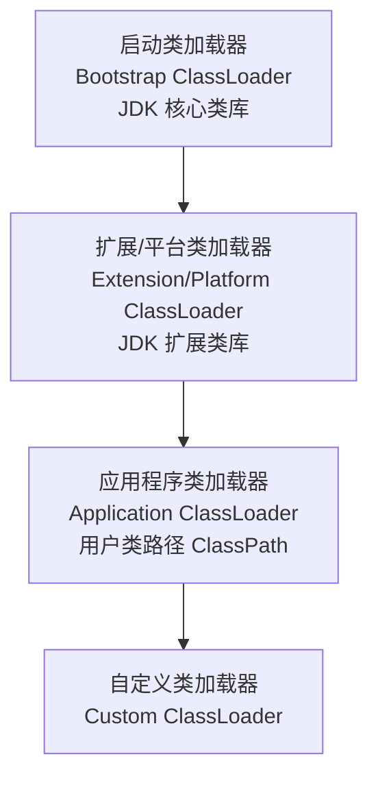

# Java 类加载机制

## 类加载过程

> 类的生命周期总体上包括：**加载**、**使用**、**卸载**；

类的加载阶段总体上分为五个阶段：
- 加载: 读取 `.class` 文件
- 连接
    - 验证: 校验字节码合法性
    - 准备: 为静态变量分配内存并设默认值
    - 解析: 符号引用转直接引用
- 初始化: 执行 `<clinit>` 方法，初始化静态变量和静态代码块

> 类加载的这五个阶段中，**加载、验证、准备和初始化这四个阶段发生的顺序是确定的**，而解析阶段则不一定，它在某些情况下可以在初始化阶段之后开始，这是为了支持Java语言的运行时绑定(也成为动态绑定或晚期绑定)。

> 另外注意这个阶段是按顺序开始，而不是按顺序进行或完成，因为这些阶段**通常都是互相交叉地混合进行的**，通常在一个阶段执行的过程中调用或激活另一个阶段。


### 阶段 1: 加载

在加载阶段，JVM 需要完成以下三件事:

- 通过一个类的**全限定类名**获取其定义的**二进制字节流**
- 将这个字节流所代表的静态存储结构转化为**方法区的运行时数据结构**
- 在**堆中生成一个代表这个类的 `java.lang.Class` 对象**，作为对方法区中这些数据的访问入口


> 其中加载阶段的获取类的二进制字节流的动作是可控性最强的，因为开发人员既可以使用 JVM 的类加载器来完成加载，也可以自定义自己的类加载器来完成加载

> 类加载器并不需要等到某个类被「首次主动使用」时再加载它，JVM 规范允许类加载器在**预料**某个类将要被使用时就**预先加载**它，如果在预先加载的过程中遇到了 `.class` 文件缺失或存在错误，类加载器必须在程序首次主动使用该类时才报告错误(`LinkageError`)，如果这个类一直没有被程序主动使用，那么类加载器就不会报告错误。

类字节流的来源有以下途径:

- **本地文件系统**中加载（最直接）
- 通过网络下载 class 文件（**可能有安全性问题**）
- 从 zip、jar 等**压缩文件中提取** class 文件
- 运行时计算生成（**动态代理**）

---

### 阶段 2: 连接 - 验证

在验证阶段，JVM 需要完成的是：**确保 `.class` 文件的字节流中包含的信息符合当前虚拟机的要求，并且不会危害虚拟机自身的安全**。

验证阶段会做 4 个方面的内容:

- **文件格式验证**：验证字节流是否符合 `.class` 文件格式的规范，比如是否以 `0xCAFEBABE` 开头等
- **元数据验证**：对字节码描述的信息进行语义分析，以保证其描述的信息符合 Java 语言规范的要求，比如这个类是否继承了被 `final` 修饰的类
- **字节码验证**：通过数据流和控制流分析，确定程序语义是合法的、符合逻辑的
- **符号引用验证**：验证引用的类、方法、字段是否存在

> 其中验证阶段是**重要但却不是必须的**，因为它对程序运行没有影响。如果引用的类经过反复验证，那么可以考虑采用 `-Xverifynone` 参数来关闭大部分的类验证措施，以缩短虚拟机类加载的时间。

---

### 阶段 3: 连接 - 准备

在准备阶段，JVM 会**为类的静态变量分配内存并初始化为默认值** (**默认的零值**，如 `0`、`0L`、`null`、`false` 等)

用一个例子具体说明准备阶段的初始化默认值操作:

```java
public class PreparationDemo {
    // 准备阶段：value = 0（默认值）
    // 初始化阶段：value = 123（实际值）
    public static int value = 123;
    
    // 准备阶段：CONSTANT = 123（编译期常量，直接赋值）
    // 同时被 static 和 final 修饰的常量会被直接赋值
    public static final int CONSTANT = 123;
}
```

- 同时被 `static` 和 `final` 修饰的常量，必须在声明的时候就为其显式地赋值，否则编译时不通过
- 只被 `final` 修饰的常量则既可以在声明时显式地为其赋值，也可以在类初始化时显式地为其赋值；总之，在**使用前**必须为其显式地赋值，系统不会为其赋予默认零值

> 内存分配的仅包括类变量，而不包括实例变量，实例变量会在对象实例化时随着对象一块分配在堆内存中

---

### 阶段 4: 连接 - 解析

在解析阶段，JVM 会**把常量池内的符号引用替换为直接引用**

- 符号引用：以一组符号来描述所引用的目标，符号可以是任何形式的字面量
- 直接引用：直接指向目标的指针、相对偏移量或一个间接定位到目标的句柄

```
.class 文件编译后，常量池存储的是方法的名称、类的名称

JVM 还不知道这些方法和类在内存中对应的位置

解析阶段过去后，常量池中存储的会是某个方法在方法表中的偏移量 (0x0012)，某个类在方法区中的地址 (0x00012345)

JVM 知道了这些位置后，在调用时就可以直接跳转过去执行
```

解析的范围包括:
- 类或接口解析
- 字段解析
- 方法解析

---

### 阶段 5: 初始化

在初始化阶段，JVM 会执行类的初始化方法 `<clinit>()` 完成初始化

**初始化步骤**:

- 假如该类还没被加载和连接，那么程序先加载并连接这个类
- 假如该类的直接父类还没有被初始化，则**先初始化其直接父类**
- 假如该类中有初始化语句，则**按顺序**执行这些初始化语句；初始化语句由**静态变量赋值语句**和**静态代码块**组成

```java
public class ClinitDemo {
    static {
        System.out.println("静态代码块 1");
    }
    
    public static int value = 123;
    
    static {
        System.out.println("静态代码块 2");
    }
    
    // 编译后生成的 <clinit>() 方法按顺序执行：
    // 1. System.out.println("静态代码块 1");
    // 2. value = 123; 在准备阶段，value 会被赋值为 0，在初始化阶段才按值初始化
    // 3. System.out.println("静态代码块 2");
}
```

**初始化时机**:

只有当对类**主动使用**的时候才会导致类的初始化

```java
// 1. 通过 new 的方式创建类实例
new MyClass();

// 2. 访问或修改类的静态变量
int value = MyClass.value;
MyClass.value = 100;

// 3. 调用类的静态方法
MyClass.staticMethod();

// 4. 使用 java.lang.reflect 包的方法对类进行反射调用
Class.forName("com.example.MyClass");

// 5. 初始化子类时，父类还没有初始化
class Parent { static {} }
class Child extends Parent { static {} }
new Child();  // 先初始化 Parent，再初始化 Child

// 6. 虚拟机启动时，用户指定的主类（包含 main 方法、单元测试方法）
public static void main(String[] args) { }
```

---

**被动引用不会触发初始化**

```java
// 1. 通过子类引用父类的静态字段，只会初始化父类
class Parent { 
    public static int value = 123; 
    static { System.out.println("Parent init"); }
}
class Child extends Parent {
    static { System.out.println("Child init"); }
}
int v = Child.value;  // 只输出 "Parent init"，Child 不会初始化

// 2. 通过数组定义引用类
Parent[] arr = new Parent[10];  // Parent 不会初始化

// 3. 引用编译期常量
class Constants {
    public static final int VALUE = 123;
    static { System.out.println("Constants init"); }
}
int v = Constants.VALUE;  // Constants 不会初始化
```


## 类加载器

> JDK 8 及之前，类加载器分为 4 种：启动类加载器（Bootstrap，加载核心类库）、扩展类加载器（Extension，加载 ext 目录）、应用程序类加载器（Application，加载用户类路径）、自定义类加载器。**JDK 9 之后扩展类加载器被平台类加载器（Platform）取代**。



### 根类加载器 (Bootstrap ClassLoader)

- JDK 9 之前，`Bootstrap ClassLoader` 负责加载 `$JAVA_HOME/jre/lib/` 路径下的核心类库，比如 rt.jar 等
- JDK 9 之后，`Bootstrap ClassLoader` 负责加载 `$JAVA_HOME/lib/modules` 文件（JIMAGE 格式，包含所有 JDK 模块）
- 可以通过 `-Xbootclasspath` VM 参数来自定义

### 扩展类加载器 (Extension ClassLoader)

`Extension ClassLoader` 只存在于 JDK 9 之前，`Extension ClassLoader` 负责加载 `$JAVA_HOME/jre/lib/ext/` 路径下的扩展类库，比如包名 javax.* 开头的类

### 平台类加载器 (Platform ClassLoader)

JDK 9 之后，`Platform ClassLoader` 代替了 `Extension ClassLoader`，负责加载 JDK 内部模块，比如包名 java.sql 开头的类

### 应用类加载器 (Application ClassLoader)

`Application ClassLoader` 负责加载 classpath 指定（当前工作目录下）的类。如果没有自定义类加载器，那么这个就是默认的类加载器

### 自定义加载器

> 应用程序都是由前面三种类加载器互相配合进行加载的，如果有必要，我们还可以加入自定义的类加载器。因为 JVM 自带的 ClassLoader 只是懂得从本地文件系统加载标准的 java class 文件，因此如果编写了自己的 ClassLoader，可以实现从特定场所取得 class 文件，如数据库和网络等

### 获取类加载器

- JDK 9 之前的做法：

```java
ClassLoader classLoader = this.getClass().getClassLoader();
System.out.println(classLoader);
System.out.println(classLoader.getParent());
System.out.println(classLoader.getParent().getParent());

//******** 输出 *********

sun.misc.Launcher$AppClassLoader@18b4aac2
sun.misc.Launcher$ExtClassLoader@78308db1
null
```

- JDK 9 之后的做法：

```java
// 获取 Platform ClassLoader
ClassLoader platformClassLoader = ClassLoader.getPlatformClassLoader();
// JDK 9 之后用 Platform ClassLoader 替换了 Extension ClassLoader
System.out.println("Platform ClassLoader: " + platformClassLoader);

// 获取 Bootstrap ClassLoader
System.out.println("Platform ClassLoader's parent => Bootstrap ClassLoader: " + platformClassLoader.getParent());

// 获取 Application ClassLoader
ClassLoader applicationClassLoader = ClassLoader.getSystemClassLoader();
// JDK 9 之前的实现：sun.misc.Launcher$AppClassLoader
// JDK 9 之后的实现：jdk.internal.loader.ClassLoaders$AppClassLoader
System.out.println("Application ClassLoader: " + applicationClassLoader);

// ******** 输出 *********

Platform ClassLoader: jdk.internal.loader.ClassLoaders$PlatformClassLoader@433c675d
Platform ClassLoader's parent => Bootstrap ClassLoader: null
Application ClassLoader: jdk.internal.loader.ClassLoaders$AppClassLoader@63947c6b
```

**可以证明我们可以获取 `Application ClassLoader`、`Extension ClassLoader` / `Platform ClassLoader`，但是无法获取 `Bootstrap ClassLoader`，因为 `Bootstrap ClassLoader` 是使用 C 语言实现的，找不到一个确定的返回方式，所以返回 `null`**

> 另外值得注意的是：无论通过什么方式获取类加载器，获取的都是同一个实例，因为类加载器是唯一的


## 类加载方式

类加载有三种方式

- 启动应用时由JVM初始化加载
- 使用 `Class.forName()` 方法动态加载
- 使用 `ClassLoader.loadClass()` 方法动态加载


> Class.forName() 和 ClassLoader.loadClass() 的区别

- `ClassLoader.loadClass()`： 只干一件事情，就是将 class 文件加载到 JVM 中，只有在调用 newInstance() 方法才会去执行 static 块
- `Class.forName()`：除了将类的 class 文件加载到 JVM 中之外，还会对类进行解释，执行类中的 static 块
- `Class.forName(name, initialize, loader)`：带参方法可以控制是否加载 static 块。如果 initialize 传入 false ，只有调用了 newInstance() 方法才用去执行 static 块

```java
public class Person {
    static {
        System.out.println("静态初始化块执行了！");
    }
}

...

@Test
public void testLoadClass() throws ClassNotFoundException {
    ClassLoader loader = this.getClass().getClassLoader();
    System.out.println(loader);
    // 使用ClassLoader.loadClass()来加载类，不会执行初始化块
    loader.loadClass("com.example.demo.entity.Person");
}
// sun.misc.Launcher$AppClassLoader@18b4aac2


@Test
public void testForName() throws ClassNotFoundException {
    ClassLoader loader = this.getClass().getClassLoader();
    System.out.println(loader);
    // 使用Class.forName()来加载类，默认会执行初始化块
    Class.forName("com.example.demo.entity.Person");
}
// sun.misc.Launcher$AppClassLoader@18b4aac2
// 静态初始化块执行了！


@Test
public void testForNameNotInit() throws ClassNotFoundException {
    ClassLoader loader = this.getClass().getClassLoader();
    System.out.println(loader);
    // 使用Class.forName()来加载类，并指定initialize，初始化时不执行静态块
    Class.forName("com.example.demo.entity.Person", false, loader);
}
// sun.misc.Launcher$AppClassLoader@18b4aac2

...
```


## 类加载机制

类加载机制有以下几个特点

- 全盘负责：当一个类加载器负责加载某一个类时，该类所依赖和引用的其他类也将由该类加载器负责加载，除非显式地使用另外一个类加载器来加载

- 缓存机制：缓存机制将会保证所有加载过的类都会被缓存，当程序中需要使用某个类时，类加载器先从缓存区寻找该类，只有缓存区不存在时，系统才会读取该类对应的二进制数据，并将其转换成Class对象，存入缓存区
- **双亲委派机制**：如果一个类加载器收到了类加载的请求，它首先不会自己去尝试加载这个类，而是把请求委托给父加载器去完成，依次向上，因此，所有的类加载请求最终都应该被传递到顶层的启动类加载器中。只有当父加载器无法完成该类的加载，子加载器才会尝试自己去加载该类

其中双亲委派机制是 JVM 类加载的一个核心内容，其最大的优势是防止内存中出现多份同样的字节码

### 双亲委派机制过程

1. 当 AppClassLoader 加载一个类时，它首先不会自己去尝试加载这个类，而是把类加载请求委派给父类加载器 ExtClassLoader 去完成
2. 当 ExtClassLoader 加载一个类时，它首先不会自己去尝试加载这个类，而是把类加载请求委派给父类加载器 BootstrapClassLoader 去完成
3. 如果 BootstrapClassLoader 可以加载这个类，那么就加载；如果无法加载，如在 $JAVA_HOME/jre/lib 中没有找到这个类，就会使用 ExtClassLoader 来进行加载
4. 如果 ExtClassLoader 可以加载这个类，那么就加载；如果也无法加载，那么会使用 AppClassLoader 来加载这个类
5. 如果 AppClassLoader 可以加载这个类，那么就加载；如果也无法加载，那么会抛出异常 ClassNotFoundException


### 双亲委派具体实现

```java
public Class<?> loadClass(String name)throws ClassNotFoundException {
    return loadClass(name, false);
}

protected synchronized Class<?> loadClass(String name, boolean resolve)throws ClassNotFoundException {
    // 首先判断该类型是否已经被加载
    Class c = findLoadedClass(name);
    if (c == null) {
        //如果没有被加载，就委托给父类加载或者委派给启动类加载器加载
        try {
            if (parent != null) {
                //如果存在父类加载器，就委派给父类加载器加载
                c = parent.loadClass(name, false);
            } else {
                //如果不存在父类加载器，就检查是否是由启动类加载器加载的类，通过调用本地方法native Class findBootstrapClass(String name)
                c = findBootstrapClass0(name);
            }
        } catch (ClassNotFoundException e) {
            // 如果父类加载器和启动类加载器都不能完成加载任务，才调用自身的加载功能
            c = findClass(name);
        }
    }
    if (resolve) {
        resolveClass(c);
    }
    return c;
}

```

从加载类源码可以看到，如果我们需要自定义一个类加载器的话，需要注意两点

- 继承 ClassLoader，重写 findClass 方法即可。尽量不要重写 loadClass 方法，否则会破坏双亲委派机制
- 需要把类文件放到自定义目录下，否则会被已有的类加载器加载；并且要设置自定义类加载器的类加载根路径 `setRoot()`
