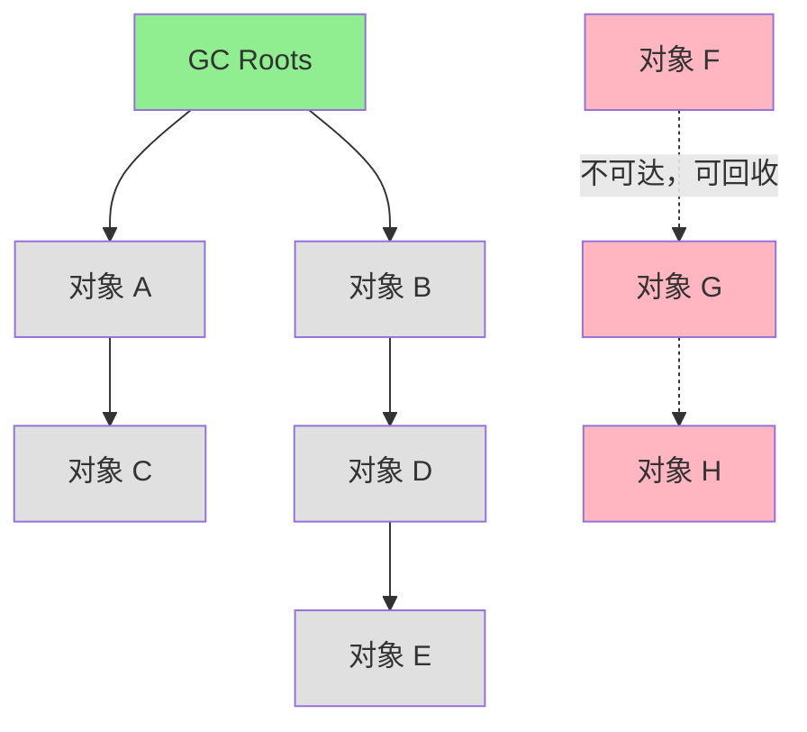
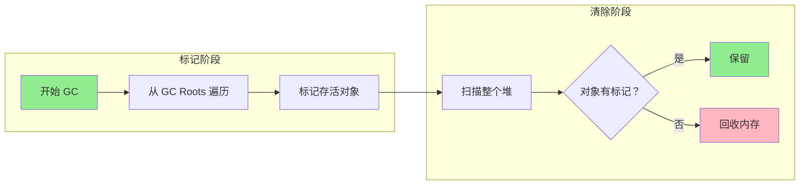
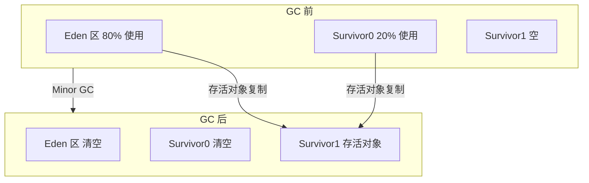
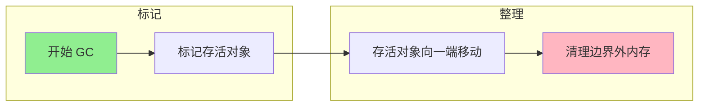
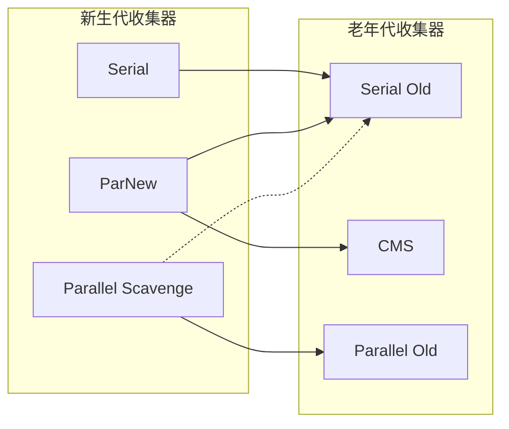

# 垃圾回收基础

> 垃圾收集主要是针对堆和方法区进行；程序计数器、虚拟机栈和本地方法栈这三个区域属于线程私有的，只存在于线程的生命周期内，线程结束之后也会消失，因此不需要对这三个区域进行垃圾回收

## 判断一个对象是否可以被回收

> **JVM 判断对象可回收有两种方法**：**引用计数法**（已淘汰）和**可达性分析**（主流实现）。Java 采用可达性分析，通过**GC Roots**作为起点，向下搜索形成引用链，**不可达的对象**判定为可回收。

### 引用计数算法

**实现原理**：给对象添加一个**引用计数器**，当对象增加一个引用时计数器加 1，引用失效时计数器减 1。引用计数为 0 的对象可被回收，这种方式实现起来简单、判定效率高。

**弊端**：两个对象出现循环引用的情况下，此时引用计数器永远不为 0，导致无法对它们进行回收。

```java
public class ReferenceCountingGC {

    public Object instance = null;

    public static void main(String[] args) {
        ReferenceCountingGC objectA = new ReferenceCountingGC();
        ReferenceCountingGC objectB = new ReferenceCountingGC();
        objectA.instance = objectB;
        objectB.instance = objectA;

        // 对象 A 的引用次数是 1，被对象 B 引用
        // 对象 B 的引用次数是 1，被对象 A 引用
        // 两个对象行程互相循环引用，导致即使外部不再使用这两个对象，但它们永远无法被回收
    }
}
```

### 可达性分析算法

**实现原理**：通过 **GC Roots** 作为起始点进行搜索，能够到达到的对象都是存活的，不可达的对象可被回收。**JVM 使用这种算法来判断对象是否可以被回收**。



### GC Root

> **面试话术**：GC Roots 包括四类对象——**虚拟机栈中引用的对象**、**方法区中静态属性引用的对象**、**方法区中常量引用的对象**、**本地方法栈中 JNI 引用的对象**。

```
┌─────────────────────────────────────────────────┐
│              GC Roots 四大来源                   │
├─────────────────────────────────────────────────┤
│ 1. 虚拟机栈（栈帧中的本地变量表）                 │
│    - 方法的参数                                  │
│    - 局部变量                                    │
│    - 临时变量                                    │
├─────────────────────────────────────────────────┤
│ 2. 方法区中的静态属性                            │
│    - static 修饰的字段                           │
│    - 类变量                                      │
├─────────────────────────────────────────────────┤
│ 3. 方法区中的常量                                │
│    - 字符串常量池中的引用                        │
│    - final 修饰的常量                            │
├─────────────────────────────────────────────────┤
│ 4. 本地方法栈中的 JNI 引用                       │
│    - Native 方法持有的 Java 对象引用             │
└─────────────────────────────────────────────────┘
```

### 引用类型

> 无论使用哪种算法，判断对象是否可以被回收，都和**引用**有关。Java 中具有四种不同强度的引用类型（强/软/弱/虚）

用一个例子来说明四种不同强度的引用类型

```java
import java.lang.ref.*;
import java.util.*;

public class ReferenceTypes {
    public static void main(String[] args) {
        // 1. 强引用 - 被强引用的对象不会被回收
        Object strong = new Object();

        // 2. 软引用 - 被软引用的对象在内存不足时回收
        SoftReference<Object> soft = new SoftReference<>(new Object());

        // 3. 弱引用 - 被弱引用的对象在下次 GC 必回收，也就是说只能存活到下一次垃圾回收之前
        // 典型案例：ThreadLocal 中 Entry 的设计
        WeakReference<Object> weak = new WeakReference<>(new Object());

        // 4. 虚引用 - 无法获取对象，用于跟踪回收
        // 为一个对象设置虚引用关联的唯一目的就是能在这个对象被回收时收到一个系统通知。
        PhantomReference<Object> phantom = new PhantomReference<>(
            new Object(), new ReferenceQueue<>()
        );
    }
}
```

| 引用类型   | 回收时机         | 使用场景                       |
| ---------- | ---------------- | ------------------------------ |
| **强引用** | 永不回收         | 普通对象引用                   |
| **软引用** | 内存不足 OOM 前  | 缓存（图片缓存、数据缓存）     |
| **弱引用** | 下次 GC 立即回收 | WeakHashMap、监听器            |
| **虚引用** | 无法获取对象     | 对象回收通知（ReferenceQueue） |

## 垃圾回收算法

### 标记-清除算法（Mark-Sweep）

**工作流程**：

- 从 GC Root 出发遍历，将存活的对象进行标记
- 回收所有未被标记的对象

优点：

- 算法简单，无需移动对象

**弊端**：

- 标记和清除过程的**效率不高**
- 会**产生大量不连续的内存碎片**，导致无法给大对象分配内存




### 标记-复制算法（Mark-Copy）

**工作流程**：

- 把内存空间分为**两份等大区域**
- 从 GC Root 出发遍历，将存活的对象进行标记
- 把存活对象**复制到空闲块**，并清理原区域中的对象
- 原区域和空闲块**角色交换**

**优点**：

- **不产生内存碎片**

**弊端**：

- 需要**双倍内存空间**
- 如果对象存活率高，那么复制算法的效率较低

**应用**：**新生代**（98% 对象朝生夕死，复制效率高）




### 标记-整理算法（Mark-Compact）

**工作流程**：

- 从 GC Root 出发遍历，将存活的对象进行标记
- 把存活的对象**都向一端移动**
- 清理边界以外的内存

**优点**：

- **不产生内存碎片**
- 不需要双倍的空间

**弊端**：

- **移动对象的计算成本高**，需要更新引用

**应用**：**老年代**（存活率高，不适合复制）




### 分代回收

堆内存根据对象生命周期划分为新生代和老年代，目的是为了**提高 gc 效率**，可以根据分代来分别采用不同的垃圾回收算法

**核心思想：为提高内存使用率，减少内存碎片**；对于新生代，存放的对象都是短生命周期的，可以采用**标记-复制算法**；对于老年代，存放的对象都是长生命周期的，可以采用**标记-整理**算法

| GC 类型                                                  | 触发条件             | 范围                             | 频率 | 速度 |
| -------------------------------------------------------- | -------------------- | -------------------------------- | ---- | ---- |
| **Young GC**、**Minor GC**                               | Eden 满              | 新生代                           | 高   | 快   |
| **Old GC**、**Major GC** <br/> (CMS 收集器特指老年代 GC) | 老年代满             | 老年代                           | 低   | 慢   |
| **Full GC**                                              | 元空间不足、老年代满 | 整个堆(新生代 + 老年代) + 元空间 | 低   | 最慢 |

## 垃圾收集器




> 以上是7个垃圾收集器，连线表示可以配合使用

**垃圾回收算法是抽象的解决方案，垃圾收集器是具体的实现方案**，一个收集器可能会采用一种或多种回收算法组合

### Serial 收集器

Serial 收集器从字面上可以知道它是以串行的方式执行的，Serial 收集器是单线程的收集器，只会使用一个线程进行垃圾收集工作。

它的优点是简单高效，对于单个 CPU 环境来说，由于没有线程交互的开销，因此拥有最高的单线程收集效率。它是 Client 模式下的默认新生代收集器。


### ParNew 收集器

ParNew 收集器是 Serial 收集器的多线程版本，是 Server 模式下虚拟机**首选的新生代垃圾收集器**，可以和 CMS 收集器配合工作。

默认开启的线程数量与 CPU 数量相同，可以使用 `-XX:ParallelGCThreads` 参数来设置线程数。


### Serial Old 收集器

是 Serial 收集器的老年代版本，也是给 Client 模式下的虚拟机使用。

如果用在 Server 模式下，它作为 CMS 收集器的后备预案，在并发收集发生 Concurrent Mode Failure 时使用。


### CMS 收集器

CMS(Concurrent Mark Sweep)，Mark Sweep 指的是标记-清除算法

CMS 收集器的工作流程：

- 初始标记：仅仅只是标记一下 **GC Roots 能直接关联到的对象**，速度很快，需要停顿。
- 并发标记：进行 **GC Roots Tracing** 的过程，它在整个回收过程中耗时最长，不需要停顿。
- 重新标记：为了**修正**并发标记期间因用户程序继续运作而导致标记产生变动的那一部分对象的标记记录，需要停顿。
- 并发清除：不需要停顿。

并发清除的过程中由于用户线程继续运行也可能会产生垃圾，称为浮动垃圾，而这一部分的浮动垃圾只能留到下一次垃圾回收才能进行回收。


CMS 收集器的优点：在整个过程中耗时最长的并发标记和并发清除的过程，收集器可以和用户线程一起工作，不需要停顿。

CMS 收集器的缺陷：

- 无法处理浮动垃圾，可能会出现 Concurrent Mode Failure。由于浮动垃圾的存在，所以每次都需要预留出一部分内存，不能像其他收集器一样等待老年代快满了再进行回收。如果预留的内存甚至不足以存放浮动垃圾，那么就会出现 Concurrent Mode Failure，这时虚拟机只能临时启用 Serial Old 来替代 CMS。
- 标记-清除算法会导致内存空间碎片，往往出现老年代空间剩余，但无法找到足够大连续空间来分配当前对象，不得不提前触发一次 Full GC。

### G1 收集器

G1(Garbage-First)，它是一款面向服务端应用的垃圾收集器，在多 CPU 和大内存的场景下有很好的性能。

#### Region

G1 收集器引入了 Region 这个概念，把新生代和老年代一视同仁，把一整块内存空间划分成多个小空间，这些小空间就称为 Region。

这种划分方法带来了很大的灵活性，每一个 Region 都可以单独地进行垃圾回收，而且收集器会记录每个 Region 垃圾回收时间以及回收后所获得的空间，来维护一个优先列表，这样每次回收时可以根据允许的收集时间来优先回收价值最大的 Region。

而且每个 Region 都有一个 Remembered Set，用来记录该 Region 对象的引用对象所在的 Region。通过 Remembered Set，在做可达性分析的时候可以避免全堆扫描。

划分 Region 后的堆结构图：


如果不计算维护 Remembered Set 的操作，G1 收集器的工作流程：

- 初始标记：仅仅只是标记一下 **GC Roots 能直接关联到的对象**
- 并发标记：进行 **GC Roots Tracing** 的过程
- 最终标记：为了**修正**在并发标记期间因用户程序继续运作而导致标记产生变动的那一部分标记记录。虚拟机将这段时间对象变化记录在线程的 Remembered Set Logs 里面，最终标记阶段需要把 Remembered Set Logs 的数据合并到 Remembered Set 中。这阶段需要停顿线程，但是可并行执行。
- 筛选回收：首先对各个 Region 中的回收价值和成本进行排序，根据用户所期望的 GC 停顿时间来**制定回收计划**。此阶段其实也可以做到与用户程序一起并发执行，但是因为只回收一部分 Region，时间是用户可控制的，而且停顿用户线程将大幅度提高收集效率。


G1 收集器的特点：

- 空间整合：从整体来看是基于「标记-整理」算法实现的收集器，从局部(两个 Region 之间)上来看是基于「复制」算法实现的，这意味着运行期间不会产生内存空间碎片。
- 可预测的停顿：能让使用者明确指定在一个长度为 M 毫秒的时间片段内，消耗在 GC 上的时间不得超过 N 毫秒。

## 堆的垃圾回收

针对 HotSpot VM 的实现，垃圾回收按区域可以分成两大类：部分回收(Partial GC)、整堆回收(Full GC)

- 部分回收：简单理解成不是针对整个 Java 堆内存的垃圾回收，其中又可以分为
  - 新生代回收(Minor GC)：只针对新生代的垃圾回收
  - 老年代回收(Major GC)：只针对老年代的垃圾回收
    - 目前只有 CMS收集器会有单独针对老年代进行垃圾回收的行为
    - 很多时候 Major GC 会和 Full GC 混合使用，需要具体分辨是老年代回收还是整堆回收
  - 混合回收(Mixed GC)：针对整个新生代和部分老年代的垃圾回收
    - 目前只有 G1 收集器会有这种行为
- 整堆回收：简单理解为针对整个 Java 堆内存和方法区进行垃圾回收

### 堆内存分配策略

- 优先在 Eden 区分配：大多数情况下，对象都在新生代的 Eden 区分配内存，当 Eden 区空间不足时，触发 Minor GC
- 大对象直接进入老年代：需要连续内存空间的大对象（长字符串、数组）直接进入老年代，避免在 Eden 区和 Survivor 区之间的大量内存复制
- 动态对象年龄判定：如果 Survivor 区中相同年龄的对象大小的总和大于 Survivor 区空间的一半，那么大于等于这个年龄的对象直接进入老年代，无需等到交换次数的阈值
- 空间分配担保：在发生 Minor GC 之前，JVM 会检查老年代最大可用的连续空间是否大于新生代所有对象的总大小
  - 如果大于，则可以保证这次 Minor GC 是安全的
  - 如果小于，那么会继续检查老年代最大可用连续空间是否大于历次晋升老年代对象的平均大小
    - 如果大于，则可以尝试进行一次 Minor GC，虽然存在一定风险
    - 进行 Full GC

### GC 触发条件

Minor GC：只要 Eden 区满了就触发一次

Full GC：触发条件比较复杂

- `System.gc()` 不建议这么做，而是让虚拟机自己管理内存
- 空间分配担保失败会触发一次 Full GC
- 老年代空间不足引起的 Full GC。为了避免这个因素，尽量不要创建过大的对象和数组，也可以通过调整参数调大新生代的大小，尽量让对象在新生代被回收，还可以调大对象进入老年代的年龄阈值
- Concurrent Mode Failure，老年代预留的空间不足以存放浮动垃圾

## 方法区的垃圾回收

方法区的垃圾回收主要回收两部分的内容：常量池中废弃的常量和不再使用的类

常量回收策略：只要常量池中的常量没有被任何地方引用，就可以被回收

类回收策略，需要同时满足三个条件：

- 该类所有的实例都已经被回收，也就是 Java 堆中不存在该类及其任何派生子类的实例

- 加载该类的类加载器已经被回收，这个条件通常很难达成

- 该类对应的 java.lang.Class 对象没有在任何地方被引用，无法在任何地方通过反射访问该类的方法
