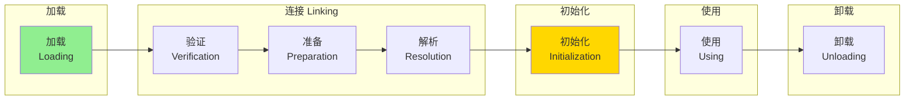
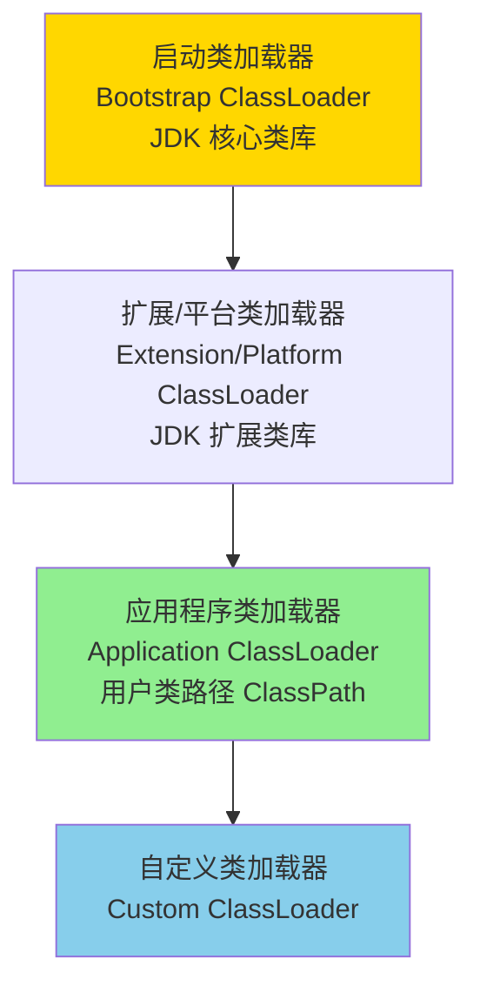
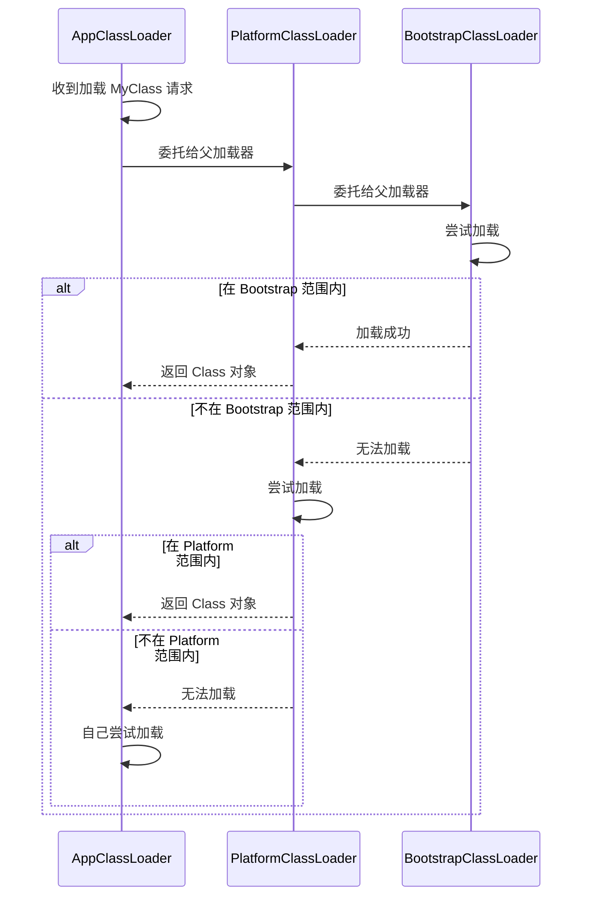

# JVM 阶段三：类加载机制

> **面试热度**：🔥🔥🔥🔥  
> **学习时长**：3-4 天  
> **前置知识**：阶段一（内存结构）必须掌握  
> **核心目标**：理解类加载过程、掌握双亲委派模型及其打破场景

---

## 📋 目录

1. [类加载过程](#一类加载过程)
2. [类加载器层次](#二类加载器层次)
3. [双亲委派模型](#三双亲委派模型)
4. [打破双亲委派](#四打破双亲委派)
5. [高频面试题汇总](#五高频面试题汇总)

---

## 一、类加载过程

### 1.1 核心概念（面试话术）

> **类加载过程分为 5 个阶段**：**加载**（读取 .class 文件）、**验证**（校验字节码合法性）、**准备**（为静态变量分配内存并设默认值）、**解析**（符号引用转直接引用）、**初始化**（执行 `<clinit>` 方法，初始化静态变量和静态代码块）。

### 1.2 类加载生命周期



---

### 1.3 各阶段详解

#### 阶段 1：加载（Loading）⭐⭐⭐⭐

**做什么**：
1. 通过类的**全限定名**获取定义此类的二进制字节流
2. 将字节流代表的静态存储结构转化为**方法区的运行时数据结构**
3. 在**堆**中生成一个代表这个类的 `java.lang.Class` 对象，作为方法区这个类各种数据的访问入口

**字节流来源**：
- 从本地文件系统加载（最常见）
- 从 ZIP 包中读取（JAR、WAR）
- 从网络获取（Applet）
- 运行时计算生成（动态代理）
- 从数据库读取

---

#### 阶段 2：验证（Verification）⭐⭐⭐

**做什么**：确保 Class 文件的字节流包含的信息符合当前虚拟机的要求

**验证内容**：
| 验证类型 | 说明 |
|----------|------|
| **文件格式验证** | 魔数 0xCAFEBABE、版本号等 |
| **元数据验证** | 是否有父类、是否继承 final 类等 |
| **字节码验证** | 指令跳转是否合法、类型转换是否正确 |
| **符号引用验证** | 引用的类、方法、字段是否存在 |

---

#### 阶段 3：准备（Preparation）⭐⭐⭐⭐⭐

**做什么**：为类的**静态变量**分配内存，并设置**默认初始值**

**关键点**：

```java
public class PreparationDemo {
    // 准备阶段：value = 0（默认值）
    // 初始化阶段：value = 123（实际值）
    public static int value = 123;
    
    // 准备阶段：CONSTANT = 123（编译期常量，直接赋值）
    public static final int CONSTANT = 123;
}
```

**默认值规则**：

| 类型 | 默认值 |
|------|--------|
| int | 0 |
| long | 0L |
| float | 0.0f |
| double | 0.0d |
| boolean | false |
| char | '\u0000' |
| 引用类型 | null |

---

#### 阶段 4：解析（Resolution）⭐⭐⭐

**做什么**：将常量池内的**符号引用**替换为**直接引用**

**符号引用 vs 直接引用**：
```
符号引用：
- 用字符串描述引用的目标
- 例如：com/example/Demo.method()V
- 与虚拟机实现的内存布局无关

直接引用：
- 直接指向目标的指针、偏移量
- 例如：方法在方法表中的偏移量 0x0012
- 与虚拟机实现的内存布局相关
```

**解析内容**：
- 类或接口解析
- 字段解析
- 方法解析
- 接口方法解析

---

#### 阶段 5：初始化（Initialization）⭐⭐⭐⭐⭐

**做什么**：执行类的初始化方法 `<clinit>()`

**`<clinit>()` 方法特点**：
1. 由编译器自动收集类中的**静态变量赋值动作**和**静态语句块**中的语句合并而成
2. 按照源文件中出现的顺序执行
3. 虚拟机会保证在子类的 `<clinit>()` 执行前，父类的 `<clinit>()` 已经执行完毕
4. 如果类没有静态变量和静态代码块，可以没有 `<clinit>()` 方法

```java
public class ClinitDemo {
    static {
        System.out.println("静态代码块 1");
    }
    
    public static int value = 123;
    
    static {
        System.out.println("静态代码块 2");
    }
    
    // 编译后生成的 <clinit>() 方法按顺序执行：
    // 1. System.out.println("静态代码块 1");
    // 2. value = 123;
    // 3. System.out.println("静态代码块 2");
}
```

---

### 1.4 类初始化时机（必背）⭐⭐⭐⭐⭐

**主动引用（会触发初始化）**：

```java
// 1. 遇到 new、getstatic、putstatic、invokestatic 这 4 条字节码指令
new MyClass();                    // new
int value = MyClass.staticVar;    // getstatic
MyClass.staticVar = 100;          // putstatic
MyClass.staticMethod();           // invokestatic

// 2. 使用 java.lang.reflect 包的方法对类进行反射调用
Class.forName("com.example.MyClass");

// 3. 初始化子类时，父类还没有初始化
class Parent { static {} }
class Child extends Parent { static {} }
new Child();  // 先初始化 Parent，再初始化 Child

// 4. 虚拟机启动时，用户指定的主类（包含 main 方法）
public static void main(String[] args) { }

// 5. JDK 7 开始的动态语言支持
MethodHandle mh = ...
```

**被动引用（不会触发初始化）**：

```java
// 1. 通过子类引用父类的静态字段，只会初始化父类
class Parent { 
    public static int value = 123; 
    static { System.out.println("Parent init"); }
}
class Child extends Parent {
    static { System.out.println("Child init"); }
}
int v = Child.value;  // 只输出 "Parent init"，Child 不会初始化

// 2. 通过数组定义引用类
Parent[] arr = new Parent[10];  // Parent 不会初始化

// 3. 引用编译期常量
class Constants {
    public static final int VALUE = 123;
    static { System.out.println("Constants init"); }
}
int v = Constants.VALUE;  // Constants 不会初始化
```

---

## 二、类加载器层次

### 2.1 核心概念（面试话术）

> **JDK 8 及之前**，类加载器分为 4 种：**启动类加载器**（Bootstrap，加载核心类库）、**扩展类加载器**（Extension，加载 ext 目录）、**应用程序类加载器**（Application，加载用户类路径）、**自定义类加载器**。JDK 9 之后扩展类加载器被**平台类加载器**（Platform）取代。

### 2.2 类加载器层次结构



---

### 2.3 各类加载器详解

#### 启动类加载器（Bootstrap ClassLoader）⭐⭐⭐⭐

```java
// 获取启动类加载器加载的核心类库路径
String bootClassPath = System.getProperty("sun.boot.class.path");
// 输出：JAVA_HOME/lib/*.jar（如 rt.jar、resources.jar）

// 启动类加载器是 C++ 实现，Java 中获取到的是 null
ClassLoader loader = String.class.getClassLoader();
System.out.println(loader);  // null
```

**加载范围**：
- `JAVA_HOME/lib/rt.jar`
- `JAVA_HOME/lib/resources.jar`
- `JAVA_HOME/lib/ext/*.jar`（JDK 8）
- `-Xbootclasspath` 指定的路径

---

#### 扩展类加载器（Extension ClassLoader）⭐⭐⭐

```java
// JDK 8：获取扩展类加载器加载的路径
String extClassPath = System.getProperty("java.ext.dirs");

// JDK 9+：平台类加载器
ClassLoader platformLoader = ClassLoader.getPlatformClassLoader();
```

**加载范围**：
- JDK 8：`JAVA_HOME/lib/ext/*.jar`
- JDK 9+：Java SE 平台核心类（如 `java.sql`）

---

#### 应用程序类加载器（Application ClassLoader）⭐⭐⭐⭐⭐

```java
// 获取应用程序类加载器
ClassLoader appLoader = ClassLoader.getSystemClassLoader();
// 也称为系统类加载器

// 获取加载路径
String classPath = System.getProperty("java.class.path");
```

**加载范围**：
- 环境变量 `CLASSPATH`
- `-classpath` 或 `-cp` 指定的路径
- 当前工作目录

---

#### 自定义类加载器 ⭐⭐⭐

```java
public class MyClassLoader extends ClassLoader {
    
    private String classPath;
    
    public MyClassLoader(String classPath) {
        this.classPath = classPath;
    }
    
    @Override
    protected Class<?> findClass(String name) throws ClassNotFoundException {
        try {
            byte[] data = loadClassData(name);
            return defineClass(name, data, 0, data.length);
        } catch (IOException e) {
            throw new ClassNotFoundException(name);
        }
    }
    
    private byte[] loadClassData(String name) throws IOException {
        String fileName = classPath + name.replace('.', '/') + ".class";
        try (InputStream is = new FileInputStream(fileName);
             ByteArrayOutputStream baos = new ByteArrayOutputStream()) {
            byte[] buffer = new byte[1024];
            int len;
            while ((len = is.read(buffer)) != -1) {
                baos.write(buffer, 0, len);
            }
            return baos.toByteArray();
        }
    }
}
```

---

### 2.4 JDK 8 vs JDK 17 对比

| 特性 | JDK 8 | JDK 17 |
|------|-------|--------|
| 扩展类加载器 | Extension ClassLoader | **Platform ClassLoader** |
| 类加载器获取 | `ClassLoader.getSystemClassLoader().getParent()` | `ClassLoader.getPlatformClassLoader()` |
| 模块化 | 无 | **模块化系统**（JPMS） |
| 类加载器数量 | 3 层 | 3 层（名称变化） |

```java
// JDK 17 查看类加载器层次
public static void main(String[] args) {
    ClassLoader loader = MyClass.class.getClassLoader();
    
    while (loader != null) {
        System.out.println(loader);
        loader = loader.getParent();
    }
    
    System.out.println("Bootstrap ClassLoader");
}

// 输出：
// AppClassLoader
// PlatformClassLoader
// Bootstrap ClassLoader
```

---

## 三、双亲委派模型

### 3.1 核心概念（面试话术）⭐⭐⭐⭐⭐

> **双亲委派模型**：当一个类加载器收到类加载请求时，首先委托父加载器加载，只有父加载器无法加载时，才自己尝试加载。**好处**：避免类的重复加载、保护核心类库不被篡改。

### 3.2 工作流程



---

### 3.3 源码分析

```java
// java.lang.ClassLoader.loadClass() 方法
protected Class<?> loadClass(String name, boolean resolve)
        throws ClassNotFoundException {
    
    synchronized (getClassLoadingLock(name)) {
        // 1. 检查是否已加载
        Class<?> c = findLoadedClass(name);
        
        if (c == null) {
            try {
                if (parent != null) {
                    // 2. 委托父加载器加载
                    c = parent.loadClass(name, false);
                } else {
                    // 3. 父加载器为 null，委托启动类加载器
                    c = findBootstrapClassOrNull(name);
                }
            } catch (ClassNotFoundException e) {
                // 父加载器无法加载，捕获异常（不处理）
            }
            
            if (c == null) {
                // 4. 父加载器都无法加载，自己尝试加载
                c = findClass(name);
            }
        }
        
        if (resolve) {
            resolveClass(c);
        }
        
        return c;
    }
}
```

---

### 3.4 双亲委派的好处 ⭐⭐⭐⭐⭐

#### 好处 1：避免类的重复加载

```
场景：用户自己写了一个 java.lang.String 类

没有双亲委派：
- AppClassLoader 加载用户的 String
- BootstrapClassLoader 加载 JDK 的 String
- 系统中存在两个 String 类，混乱！

有双亲委派：
- AppClassLoader 委托 BootstrapClassLoader
- BootstrapClassLoader 加载 JDK 的 String
- 用户写的 String 永远不会被加载
- 系统中只有一个 String 类
```

#### 好处 2：保护核心类库

```java
// 恶意代码：尝试覆盖 String 类
package java.lang;

public class String {
    public String() {
        // 恶意代码
        System.exit(0);
    }
}

// 双亲委派模型下，这个类永远不会被加载
// BootstrapClassLoader 会加载 JDK 的 String
// 保证了核心类库的安全性
```

---

## 四、打破双亲委派

### 4.1 什么时候需要打破？⭐⭐⭐⭐

| 场景 | 说明 |
|------|------|
| **SPI 机制** | JDBC、JNDI 等需要加载用户实现的类 |
| **Web 容器** | Tomcat 需要隔离不同 WebApp 的类 |
| **热部署** | 需要动态加载和卸载类 |
| **模块化** | OSGi 实现模块间的类隔离 |

---

### 4.2 打破方式 1：自定义类加载器 ⭐⭐⭐⭐

```java
/**
 * 打破双亲委派的自定义类加载器
 * 核心：重写 loadClass() 方法，不委托父加载器
 */
public class BreakParentClassLoader extends ClassLoader {
    
    private String classPath;
    
    public BreakParentClassLoader(String classPath) {
        this.classPath = classPath;
    }
    
    @Override
    protected Class<?> loadClass(String name, boolean resolve)
            throws ClassNotFoundException {
        
        // 1. 检查是否已加载
        Class<?> c = findLoadedClass(name);
        
        if (c == null) {
            // 2. 核心类库还是委托给启动类加载器
            if (name.startsWith("java.")) {
                c = getSystemClassLoader().loadClass(name);
            } else {
                // 3. 非核心类库，自己加载（打破双亲委派）
                c = findClass(name);
            }
        }
        
        if (resolve) {
            resolveClass(c);
        }
        
        return c;
    }
    
    @Override
    protected Class<?> findClass(String name) throws ClassNotFoundException {
        try {
            byte[] data = loadClassData(name);
            return defineClass(name, data, 0, data.length);
        } catch (IOException e) {
            throw new ClassNotFoundException(name);
        }
    }
    
    private byte[] loadClassData(String name) throws IOException {
        // ... 读取 class 文件
    }
}
```

---

### 4.3 打破方式 2：SPI 机制（JDBC）⭐⭐⭐⭐⭐

```java
/**
 * JDBC SPI 机制打破双亲委派的原理
 * 
 * 问题：
 * - DriverManager 在 rt.jar 中，由 BootstrapClassLoader 加载
 * - 用户实现的 Driver（如 MySQL Driver）在 classpath 下
 * - BootstrapClassLoader 无法加载 classpath 下的类
 * 
 * 解决：
 * - 使用 Thread.currentThread().getContextClassLoader()
 * - 获取线程上下文类加载器（默认是 AppClassLoader）
 * - 用它来加载用户实现的 Driver
 */

// 1. JDBC 使用方式
Connection conn = DriverManager.getConnection(url, user, password);

// 2. DriverManager 初始化（由 BootstrapClassLoader 加载）
public class DriverManager {
    static {
        // 加载所有 Driver 实现
        AccessController.doPrivileged(new PrivilegedAction<Void>() {
            public Void run() {
                // 使用线程上下文类加载器加载 SPI 实现
                ServiceLoader<Driver> loadedDrivers = ServiceLoader.load(
                    Driver.class,
                    Thread.currentThread().getContextClassLoader()  // AppClassLoader
                );
                // ...
            }
        });
    }
}

// 3. MySQL Driver 实现
// 在 META-INF/services/java.sql.Driver 文件中配置：
// com.mysql.cj.jdbc.Driver

// 4. 线程上下文类加载器的设置
// 默认是 AppClassLoader，可以自定义
Thread.currentThread().setContextClassLoader(customLoader);
```

---

### 4.4 打破方式 3：Tomcat 类加载 ⭐⭐⭐⭐

```
Tomcat 类加载器结构：
─────────────────────────────────────────────
        BootstrapClassLoader
                ↓
        ExtensionClassLoader
                ↓
        ApplicationClassLoader
                ↓
        CommonClassLoader（加载 Tomcat 公共类）
                ↓
    ┌───────────┴───────────┐
    ↓                       ↓
CatalinaClassLoader    SharedClassLoader
（加载 Tomcat 自身类）   （加载共享类）
                            ↓
                    WebAppClassLoader（每个 WebApp 一个）
                    /      |      \
                 WebApp1  WebApp2  WebApp3
                 
Tomcat 打破双亲委派的方式：
─────────────────────────────────────────────
1. WebAppClassLoader 先自己尝试加载
2. 找不到再委托给父加载器
3. 这样不同 WebApp 可以使用不同版本的同类库
```

```java
// Tomcat WebAppClassLoader 简化版
public class WebAppClassLoader extends ClassLoader {
    
    @Override
    public Class<?> loadClass(String name) throws ClassNotFoundException {
        
        // 1. 检查是否已加载
        Class<?> c = findLoadedClass(name);
        
        if (c == null) {
            // 2. 核心类库（java.*）委托给父加载器
            if (name.startsWith("java.")) {
                c = super.loadClass(name);
            } else {
                // 3. 先自己尝试加载（打破双亲委派）
                try {
                    c = findClass(name);
                } catch (ClassNotFoundException e) {
                    // 4. 找不到再委托给父加载器
                    c = super.loadClass(name);
                }
            }
        }
        
        return c;
    }
}
```

---

## 五、高频面试题汇总

### Q1: 类加载过程有几个阶段？各阶段做什么？⭐⭐⭐⭐⭐

> **答**：
> - **加载**：读取 .class 文件，创建 Class 对象
> - **验证**：校验字节码合法性
> - **准备**：为静态变量分配内存，设默认值
> - **解析**：符号引用转直接引用
> - **初始化**：执行 `<clinit>()` 方法，初始化静态变量

---

### Q2: 准备阶段和初始化阶段对静态变量的处理有什么区别？⭐⭐⭐⭐⭐

> **答**：
> ```java
> public static int value = 123;
> 
> // 准备阶段：value = 0（默认值）
> // 初始化阶段：value = 123（实际值）
> 
> public static final int CONSTANT = 123;
> 
> // 准备阶段：CONSTANT = 123（编译期常量，直接赋值）
> // 初始化阶段：无操作
> ```

---

### Q3: 什么是双亲委派模型？有什么好处？⭐⭐⭐⭐⭐

> **答**：
> - **定义**：类加载器收到加载请求时，先委托父加载器加载，父加载器无法加载时才自己加载
> - **好处**：
>   1. 避免类的重复加载
>   2. 保护核心类库不被篡改
>   3. 保证 Java 程序的稳定性

---

### Q4: 如何打破双亲委派模型？⭐⭐⭐⭐

> **答**：
> 1. **自定义类加载器**：重写 `loadClass()` 方法
> 2. **SPI 机制**：使用线程上下文类加载器
> 3. **Web 容器**：Tomcat 的 WebAppClassLoader
> 4. **热部署**：OSGi 模块化系统

---

### Q5: JDBC 如何打破双亲委派？⭐⭐⭐⭐⭐

> **答**：
> - **问题**：DriverManager 由 BootstrapClassLoader 加载，无法加载 classpath 下的用户 Driver 实现
> - **解决**：使用 `Thread.currentThread().getContextClassLoader()` 获取线程上下文类加载器（默认是 AppClassLoader），用它加载用户实现的 Driver
> - **本质**：父加载器通过子加载器加载类，打破了自下而上的委托机制

---

### Q6: Tomcat 为什么要打破双亲委派？⭐⭐⭐⭐

> **答**：
> - **问题**：多个 WebApp 可能依赖不同版本的同一个类库
> - **解决**：每个 WebApp 有独立的 WebAppClassLoader，先自己加载，找不到再委托父加载器
> - **好处**：实现 WebApp 间的类隔离，不同 WebApp 可以使用不同版本的类库

---

### Q7: 什么时候会触发类初始化？⭐⭐⭐⭐⭐

> **答**：
> - **主动引用**（会触发）：
>   1. new、getstatic、putstatic、invokestatic 指令
>   2. 反射调用 `Class.forName()`
>   3. 初始化子类时父类未初始化
>   4. 主类（包含 main 方法）
> - **被动引用**（不会触发）：
>   1. 子类引用父类静态字段
>   2. 通过数组定义引用类
>   3. 引用编译期常量

---

**阶段三·核心笔记 完成！**

**下一步**：
- 练习题
- 面试指南

**请确认内容深度是否合适！**