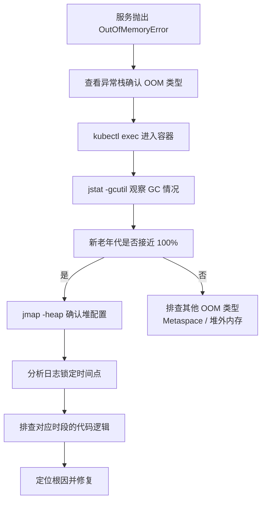

# 线上OOM排查实战

## S - Situation（背景）

我们一个后端微服务部署在 K8s 上，项目推崇小资源 + HPA 的模式，每个 Pod 只分配 **4G 内存、1400m CPU**。JVM 通过 `MaxRAMPercentage=85` 启动，堆上限约 **3.4G**。

服务上线后，运行一段时间就会抛出 `java.lang.OutOfMemoryError: Java heap space` 异常，Pod 随后被重启，重启后一段时间又会复现。服务中存在多个定时任务，主要面向内网使用，并非高并发场景。

## T - Task（任务）

快速定位 OOM 根因，彻底解决问题，避免服务反复崩溃重启影响业务。

## A - Action（排查过程）

### 1. 确认 OOM 异常类型

查看应用日志，发现异常栈为 `java.lang.OutOfMemoryError: Java heap space`，说明是**堆内存溢出**，而非 Metaspace 或堆外内存导致的问题。可以明确排查方向：**是什么对象把堆撑爆了**。

```
java.lang.OutOfMemoryError: Java heap space
    at java.util.Arrays.copyOf(Arrays.java:3210)
    at java.util.Arrays.copyOf(Arrays.java:3181)
    at java.util.ArrayList.grow(ArrayList.java:261)
    ...
```

### 2. 进容器查看 GC 情况

通过 `kubectl exec` 进入 Pod 内部，使用 `jstat -gcutil pid` 观察 GC 情况：

```bash
kubectl exec -it <pod-name> -- /bin/bash
jstat -gcutil <pid> 1000
```

发现新生代 E 区和老年代 O 区在出事前都飙到接近 **100%**，说明有大量对象产生且无法被回收。

### 3. 确认 JVM 堆内存配置

使用 `jmap -heap pid` 确认堆内存配置：

```bash
jmap -heap <pid>
```

确认堆确实只分配了约 3.4G。对于非高并发的内网系统来说这个配置是合理的，问题不在于堆太小，而在于**有东西把堆撑满了**。

### 4. 分析日志锁定时间点

查看应用日志，发现 OOM 发生的时间点与**某个定时任务的执行时间高度吻合**，日志在该时刻突然停止输出，之后再无新日志产生。

### 5. 定位根因

排查该定时任务的代码逻辑，发现问题出在动态 SQL 条件拼接上：

```java
// 动态条件拼接有 bug，where 1=1 之后没有追加任何实际条件
// 导致执行了全表查询，将几千万条数据一次性加载到内存中
List<Data> dataList = mapper.selectList(queryWrapper);
```

SQL 条件未正确拼接，实际执行的是类似 `SELECT * FROM table WHERE 1=1` 的全表查询，将表中**几千万条数据一次性加载到 List** 中。3.4G 的堆根本装不下这个量级的数据，对象迅速填满新生代，晋升到老年代后老年代也很快被填满，最终 JVM 抛出 `OutOfMemoryError: Java heap space`。

## R - Result（结果与总结）

### 结果

修复动态 SQL 条件拼接逻辑，确保查询条件正确追加，并增加分页限制。上线后问题不再复现，服务运行稳定。

### 排查流程总结



| 步骤 | 命令/手段 | 目的 |
|------|-----------|------|
| 确认异常类型 | 查看应用日志 | 区分 Java heap space / Metaspace / Direct Memory |
| 观察 GC | `jstat -gcutil pid 1000` | 判断是否有大对象产生、GC 是否频繁 |
| 确认配置 | `jmap -heap pid` | 确认堆内存分配是否合理 |
| 锁定时间点 | 分析应用日志 | 找到 OOM 发生的精确时刻 |
| 排查代码 | 代码 Review | 定位该时刻执行的逻辑 |

### 经验教训

- **`where 1=1` 一定要检查条件是否正确追加**，大表全表扫描是 OOM 的常见元凶
- OOM 排查第一步先看异常栈确认类型：`Java heap space` 查堆内大对象、`Metaspace` 查类加载、`Direct buffer memory` 查堆外内存，排查方向完全不同
- 大表查询务必加条件限制和分页，避免一次性将大量数据加载到内存
