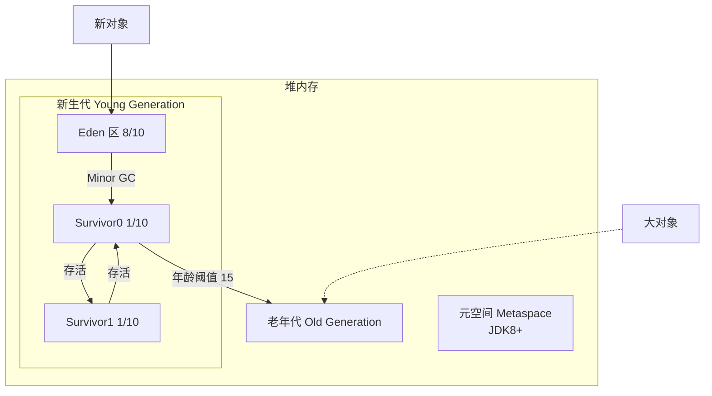
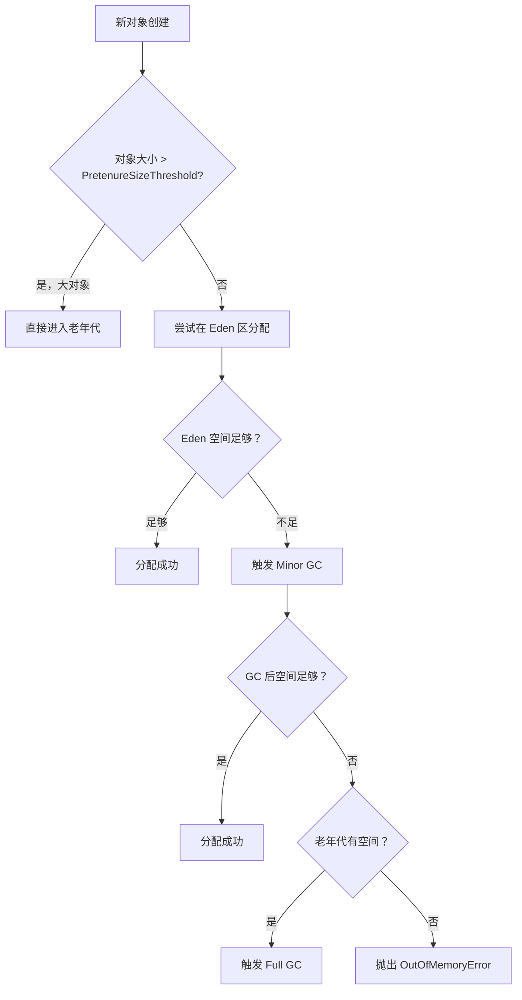
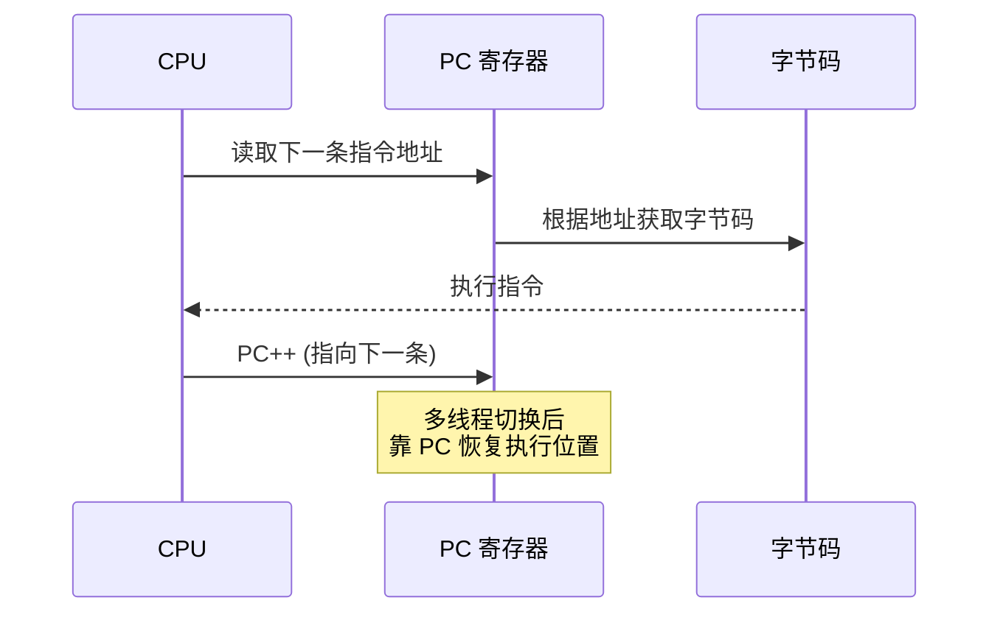

# Java 运行时内存模型

> **JVM 内存分为 5 大区域**：**堆**（存储对象）、**虚拟机栈**（方法调用）、**方法区**（类信息）、**程序计数器**（执行线索）、**本地方法栈**（Native 方法）

## JVM 整体架构


Java 虚拟机定义了若干种程序运行期间会使用到的运行时数据区，其中有一些会随着虚拟机启动而创建（线程共享），随着虚拟机退出而销毁。另外一些则是与线程一一对应的（线程私有），这些与线程一一对应的数据区域会随着线程开始和结束而创建和销毁。

- 线程私有：程序计数器、虚拟机栈、本地方法栈
- 线程共享：方法区、堆

## 堆 Heap

堆是 JVM 内存模型是最大的一块，堆内存是所有线程共享的，存放的数据是对象实例和数组。另外**字符串常量池也设置在堆内存中**。

### 堆内存划分

为了进行高效的垃圾回收，虚拟机把堆内存**逻辑上**划分成三块区域

分代存储的目的：**优化 GC 性能**

- 新生代：新对象和没达到一定年龄的对象都在新生代
  - Eden区
  - Survivor 0
  - Survivor 1
- 老年代：存放长时间使用的对象和大对象（直接进入老年代），老年代的内存空间比新生代更大

**Java 堆内存结构**




### 新生代

- 新生代被分为三个部分——伊甸园（**Eden Memory**）和两个幸存区（**Survivor Memory**，被称为：from/to 或 s0/s1），默认比例是 `8:1:1`

- 大多数新创建的对象都位于 Eden 内存空间中，**当 Eden 区被填满后，会触发 Minor GC（也称 Young GC）**

---

Eden区实现回收的策略：

- 可以被回收的对象直接回收，幸存对象会转移到 Survivor 区
- Survivor 区有 s0/s1 两块空间，分别表示正在使用和未被使用的状态。每次 Minor GC 时，将幸存对象转移到 Survivor 区中未使用的那块空间，然后将当前正在使用的空间完全清除，交换两块空间使用状态。
- 如果 Minor GC 要转移的对象大于 Survivor 区容量的上限，会转移到老年代
- 另外 s0/s1 中交换次数达到阈值的对象也会转移到老年代。可以通过 **`-XX:MaxTenuringThreshold`** 配置晋升到老年代的交换次数的阈值，默认是15

### 老年代

- 老年代包含那些经过许多轮 Minor GC 后仍然存活的对象和大对象。
- 如果一个对象需要一大段连续的内存空间，那么会直接分配到老年代，避免在 Minor GC 时需要对它从 Eden 区和两个 Survivor 区之间进行大量的拷贝
- **当老年代空间被填满后，会触发 Major GC（也称 Full GC），Major GC 通常会花费更多的时间**

### 创建一个新对象的内存分配流程




### 堆内存相关 JVM 参数

- 设置堆内存大小

```bash
-Xms2g  -XX:InitialHeapSize=2g  # 设置初始堆内存大小
-Xmx2g  -XX:MaxHeapSize=2g      # 设置最大堆内存大小

# 通常会把 `-Xms` 和 `-Xmx` 两个参数配置为相同的值，目的就是为了能够在垃圾回收后，堆内存不需要重新分隔计算堆的大小，从而提升性能。
# 设置堆内存大小后，可以通过 Arthas 工具，使用 dashboard 命令进一步查看验证

-XX:NewRatio=2                  # 老年代:新生代 = 2:1
-XX:SurvivorRatio=8             # Eden:Survivor0:Survivor1 = 8:1:1
```

- 对象年龄控制

```bash
-XX:MaxTenuringThreshold=15     # 对象在年轻代最大年龄
-XX:PretenureSizeThreshold=1m   # 大于1m的对象直接进入老年代
```

## 虚拟机栈 Stack

虚拟机栈是线程私有的内存，生命周期和线程保持一致，线程创建时就会创建一个虚拟机栈；对栈来说，最小的工作单位是**栈帧**，方法调用的开始和结束分别对应**入栈和出栈**

> 可以通过参数 `-Xss` 来设置线程的最大栈空间，**栈的大小直接决定了函数调用的最大可达深度**。

### 栈帧

栈帧的组成：

| 组成部分         | 作用                       | 特点                        |
| ---------------- | -------------------------- | --------------------------- |
| **局部变量表**   | 存储方法参数、局部变量     | 编译时确定大小，Slot 为单位 |
| **操作数栈**     | 字节码指令的工作区         | 压栈/出栈，后进先出         |
| **动态链接**     | 指向运行时常量池的方法引用 | 实现多态的关键              |
| **方法返回地址** | 方法执行完后返回调用处     | 正常退出/异常退出           |


### 栈内存溢出场景

- 栈深度超出限制

```java
public class StackOverflowDemo {
    public static void recursiveCall() {
        recursiveCall(); // 无限递归，没有出口
    }
    public static void main(String[] args) {
        recursiveCall(); // 报错：java.lang.StackOverflowError
    }
}
// 参数：-Xss1m (设置栈大小为 1MB，默认 1M 左右)
```

- 栈内存空间耗尽

```java
public class StackOOMDemo {
    public static void main(String[] args) {
        while (true) {
            new Thread(() -> {
                try { Thread.sleep(Long.MAX_VALUE); } catch (InterruptedException e) {}
            }).start(); // 无限创建线程，每个线程占用栈空间
        }
        // 报错：java.lang.OutOfMemoryError: unable to create new native thread
    }
}
```

## 方法区 Method Area

方法区**是 JVM 规范中定义的一个概念**，用于存储类信息、常量池、静态变量、JIT编译后的代码等数据，它只是定义了规范，并没有规定如何去实现它，不同的厂商、版本有不同的实现。

### JDK1.7 永久代

在 JDK1.7 及其之前的版本，JVM 使用使用**永久代**来实现方法区，位于**堆内存（Heap）**中，受堆内存大小的限制

相关 JVM 参数：`-XX:PermSize` 初始容量，`-XX:MaxPermSize` 最大容量

**后面版本抛弃永久代原因**：

- 永久代的垃圾回收主要是对类的卸载，GC 条件苛刻且效率低下，回收结果不理想
- 调优困难，大小难以预测，并且受类的总数、常量池大小影响，这些数据是动态的，静态设置容易造成内存溢出或者浪费

### JDK1.8 元空间

在 JDK1.8 及之后的版本，JVM 使用**元空间**来实现方法区，位于**本地内存 Native Memory**中，受操作系统的限制

理论上只要操作系统的内存足够，元空间就不会发生 `OutOfMemoryError`

相关 JVM 参数：`-XX:MetaspaceSize` 初始容量， `-XX:MaxMetaspaceSize` 最大容量。默认值会依赖平台

**元空间对方法区中的数据存放是这么分配的**：

- **堆内存**：字符串常量池
- **本地内存**：**类信息**（类名、接口、父类、属性、方法等）、**静态变量引用**（指向的对象存放在堆内存中）、**运行时常量池**（Class 文件中的常量池会被加载到元空间中，转化为运行时常量池）

#### 字符串常量池

字符串常量池可以理解为是分担了部分运行时常量池的工作。字符串耗费高昂的时间与空间代价，大量频繁的创建字符串，极大程度地影响程序的性能，为了提高性能和减少内存开销，在实例化字符串常量的时候进行了一些优化，为字符串开辟一个缓存区。实现该优化的基础是因为字符串是不可变的，可以不用担心数据冲突进行共享。

- 直用双引号声明：`String str1="abc";` JVM 会在字符串常量池中创建 `"abc"` 这个字符串，并返回该字符串的引用地址给 `str1`
- 使用创建对象的方式： `String str2 = new String("abc");` ，JVM 会在堆中创建一个 `"abc"` 对象实例，将字符串常量池中这个 `"abc"` 字符串的引用地址返回赋给 `str2`


## 程序计数器 PC Register

> **程序计数器是线程私有的**，可以看作当前线程执行的**字节码行号指示器**。分支、循环、跳转都依赖它。如果是 Native 方法，计数器值为空。

程序计数寄存器存储指令相关的线程信息，JVM 中的程序计数寄存器并不是广义上的物理寄存器，只是对物理程序计数寄存器的一种抽象模拟

程序计数器是一块比较小的内存，可以看作是当前线程所执行的字节码的**行号指示器**，**它是唯一一个在 JVM 规范中没有规定任何 `OutOfMemoryError` 情况的区域**

### 作用

PC 寄存器用来存储指向下一条指令的地址，这个地址指向要执行的代码。CPU 工作时就是通过改变这个计数器的值来选取下一条需要执行的字节码指令




> 为什么需要程序计数器？

因为 CPU 需要不停的切换各个线程，这时候切换回来以后，需要知道当前线程方法从哪一个指令继续执行

> 程序计数寄存器为什么设定为线程私有？

在多线程环境下，一个时间内 CPU 只能执行某一个线程方法，这样就存在着频繁的中断与恢复的过程，JVM 为了可以精准记录各个线程正在执行的字节码指令地址，所以为每个线程都分配了一个独立的程序计数寄存器

## 本地方法栈 Native Stack

Java 虚拟机栈用于管理 Java 方法的调用，而本地方法栈用于管理 `native` 方法的调用。除此之外，本地方法栈和虚拟机栈区别不大

Native 方法示例:

```java
public class Object {
    // 调用 C/C++ 实现的本地方法
    public native int hashCode();

    protected native Object clone() throws CloneNotSupportedException;
}
```

## 总结

| 区域           | 线程共享 | 作用                             | 异常情况                                                                            |
| -------------- | -------- | -------------------------------- | ----------------------------------------------------------------------------------- |
| **堆**         | ✅ 共享  | 存储对象实例、数组、字符串常量池 | OutOfMemoryError                                                                    |
| **方法区**     | ✅ 共享  | 存储类信息、常量、静态变量引用   | OutOfMemoryError                                                                    |
| **栈**         | ❌ 私有  | 方法调用、存储局部变量           | StackOverflowError（常见于无限方法递归）<br/>OutOfMemoryError（无法申请到足够内存） |
| **程序计数器** | ❌ 私有  | 记录当前执行指令                 | JVM 唯一不会发生OOM的区域                                                           |
| **本地方法栈** | ❌ 私有  | native 方法调用                  | 和栈的情况相同                                                                      |
