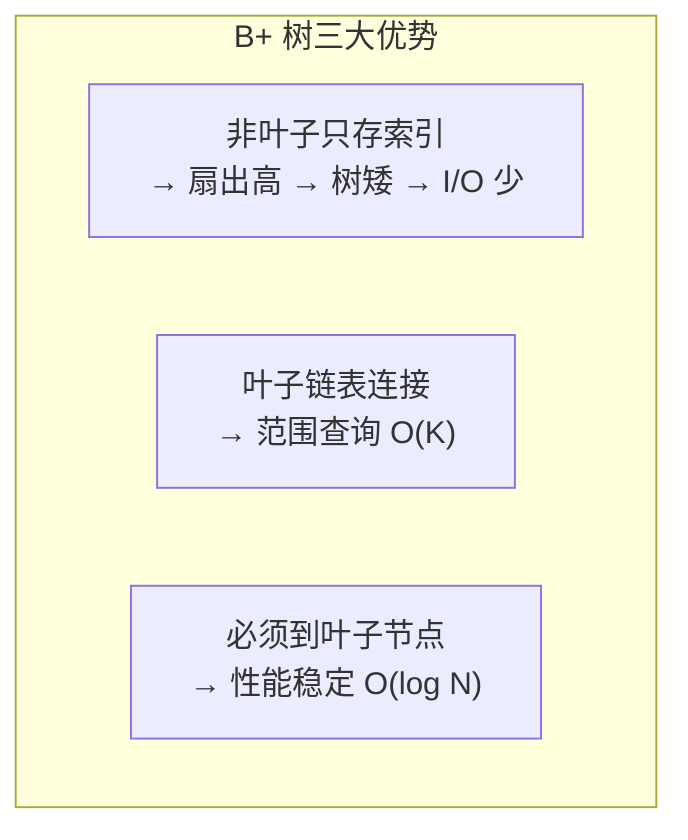
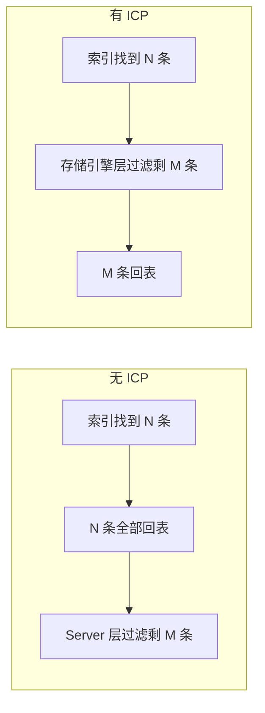

# MySQL 阶段二：索引原理 · 面试指南

> **面试岗位**：Java 后端开发（中高级）
> **准备时长**：1 天（阶段二学习完成后）
> **重点级别**：⭐⭐⭐⭐⭐（面试最高频模块）

> 如果某些知识不太清楚，回到 [MySQL索引](./MySQL-index.md) 对应章节复习。

---

## 📋 目录

1. [高频面试题 Top10](#一、高频面试题-top10)
2. [面试话术模板](#二、面试话术模板)
3. [追问与连环问](#三、追问与连环问)
4. [易错点避坑指南](#四、易错点避坑指南)
5. [源码路径速查](#五、源码路径速查)

---

## 一、高频面试题 Top10

### Q1: 为什么要用 B+ 树做索引？B 树和 B+ 树有什么区别？⭐⭐⭐⭐⭐

**参考答案**：

数据库选择 B+ 树的核心原因是**减少磁盘 I/O** 和**高效支持范围查询**。

**B 树 vs B+ 核心区别**：

| 特性 | B 树 | B+ 树 |
|------|------|-------|
| 非叶子节点 | 存键值 + 数据 | **只存键值（纯索引）** |
| 叶子节点 | 存完整数据 | 存完整数据 + **双向链表连接** |
| 查询稳定性 | 不稳定（可能在非叶子命中） | **稳定（必须到叶子节点）** |
| 范围查询 | 需中序遍历整棵树 | **沿链表顺序扫描即可** |
| 树的高度 | 更高（非叶子存数据占空间） | **更矮（扇出更高）** |

**为什么 B+ 树更适合数据库**：

1. **更矮胖，I/O 更少**：非叶子节点只存索引，同样 16KB 的页能存更多键值。InnoDB 三层 B+ 树约存 16 亿条记录，最多 3 次 I/O
2. **范围查询高效**：叶子节点链表连接，`WHERE id > 100 AND id < 200` 只需定位起点后顺序扫描
3. **查询性能稳定**：所有查询都走到叶子节点，延迟可预测



---

### Q2: 什么是聚簇索引？什么是二级索引？什么是回表？⭐⭐⭐⭐⭐

**参考答案**：

**聚簇索引（Clustered Index）**：
- 一张表**只有一个**，就是**主键索引**
- 叶子节点存储**完整的行数据**
- 数据的物理存储顺序与主键顺序一致

**二级索引（Secondary Index）**：
- 可以有**多个**
- 叶子节点存储 **(索引列值, 主键值)** 对
- 通过二级索引查到主键后，如果还需要其他列的数据，需要**回表**

**回表流程**：


> **如何避免回表？** 使用**覆盖索引**——让 SELECT 的列都在索引中，这样直接从二级索引就能返回结果。

---

### Q3: 什么是覆盖索引？有什么好处？⭐⭐⭐⭐⭐

**参考答案**：

**覆盖索引（Covering Index）**：查询所需的所有列都包含在索引中，**无需回表**，直接从索引页获取结果。

**判断方法**：`EXPLAIN` 的 Extra 列显示 `Using index`。

**实战示例**：
```sql
-- 索引：idx_name_age(name, age)

-- ✅ 覆盖索引：id(主键)、name、age 都在索引中
SELECT id, name, age FROM user WHERE name = '张三';
-- Extra: Using index

-- ❌ 非覆盖：需要 address 列，回表
SELECT * FROM user WHERE name = '张三';
```

**好处**：
1. **减少 I/O**：不需要读聚簇索引的页
2. **减少随机 I/O**：回表是随机访问聚簇索引
3. **减轻 Buffer Pool 压力**：不需要缓存数据页
4. **对 COUNT 优化特别有效**：`COUNT(*)` 如果能用覆盖索引，速度极快

---

### Q4: 什么是最左匹配原则？为什么联合索引跳过列就不行？⭐⭐⭐⭐⭐

**参考答案**：

**最左匹配原则**：联合索引的查询必须从索引的**最左边列开始连续匹配**，不能跳过中间的列。

以 `idx(a, b, c)` 为例：

| 查询 | 是否用索引 | 原因 |
|------|-----------|------|
| `WHERE a=1` | ✅ | 从最左边匹配 |
| `WHERE a=1 AND b=2` | ✅ | 连续匹配前两列 |
| `WHERE a=1 AND b=2 AND c=3` | ✅ | 全部匹配 |
| `WHERE a=1 AND c=3` | ⚠️ | a 能用，c 跳过 b 不能用 |
| `WHERE b=2` | ❌ | 跳过 a |

**本质原因**：联合索引的 B+ 树按 `(a, b, c)` 排序。只有从左边连续匹配才能利用有序性定位区间。跳过后面的列在该区间内无序，无法用索引加速。

**高频陷阱——范围断索引**：
```sql
-- idx(a, b, c)
WHERE a = 1 AND b > 2 AND c = 3;
-- a ✅, b ✅, c ❌ （b 是范围查询，后续 c 失效）
```

---

### Q5: 索引下推（ICP）是什么？解决了什么问题？⭐⭐⭐⭐⭐

**参考答案**：

**索引下推（Index Condition Pushdown，ICP）**是 MySQL **5.6** 引入的优化，用于**减少二级索引的回表次数**。

**没有 ICP 时**：
1. 在二级索引中根据最左前缀过滤
2. 剩余条件到 Server 层处理 → **每条记录都要先回表**

**有 ICP 后**：
1. 将索引列上的条件下推到存储引擎层
2. 在遍历索引时就过滤掉不满足条件的记录 → **只对满足条件的记录回表**



**判断是否生效**：EXPLAIN 的 Extra 列显示 `Using index condition`。

**限制**：ICP 主要作用于**二级索引**，不支持子查询、存储函数等复杂条件。

---

### Q6: 有哪些常见的索引失效场景？⭐⭐⭐⭐⭐

**参考答案**：

**六大常见场景**：

| 场景 | 示例 | 解决方案 |
|------|------|----------|
| **隐式类型转换** | `VARCHAR` 列传数字 | 字符串常量加引号 |
| **函数/计算操作** | `DATE(col) = ...` | 改写为范围查询 |
| **OR 条件** | OR 两边不都有索引 | 用 UNION ALL 或补索引 |
| **LIKE 前缀通配符** | `LIKE '%xx'` | 改用全文索引或 ES |
| **NOT IN / !=** | `status NOT IN (1,2)` | 改用 > / < 组合 |
| **跳过联合索引前列** | `idx(a,b)` 查 `b=?` | 调整索引或查询 |

**最高频陷阱——隐式转换**：
```sql
-- phone VARCHAR(20)，有索引
SELECT * FROM user WHERE phone = 13800138000;  -- ❌ 失效！
SELECT * FROM user WHERE phone = '13800138000'; -- ✅ 正常
```

> **核心原则**：索引保存的是原始值的有序排列，任何对列的操作（函数、计算、类型转换）都会破坏有序性导致索引失效。

---

### Q7: 如何设计一个高效的联合索引？列顺序怎么定？⭐⭐⭐⭐

**参考答案**：

**联合索引列顺序决策的三条规则**：

**规则一：等值查询频率最高的列放左边**

```sql
-- 经常 WHERE a=? AND b=?，偶尔 WHERE a=?
-- 推荐：idx(a, b) —— a 放前面
```

**规则二：排序（ORDER BY）需求考虑**

```sql
-- 经常 ORDER BY b
-- 推荐：将排序列放在等值列之后
CREATE INDEX idx_a_b ON t(a, b);  -- WHERE a=? ORDER BY b 可避免 filesort
```

**规则三：范围查询列放右边**

```sql
-- WHERE a=? AND b>? AND c=?
-- 推荐：idx(a, c, b) 或接受 b 后面 c 失效
```

**额外考虑**：
- **选择性高的列优先**：区分度高的列放左边效果更好
- **控制索引数量**：不是所有查询组合都需要独立索引
- **覆盖索引优化**：如果高频查询只需要几列，可以将这些列全部加入索引

---

### Q8: 前缀索引是什么？有什么优缺点？⭐⭐⭐⭐

**参考答案**：

**前缀索引**：对长字符串列（VARCHAR/TEXT）只索引**前 N 个字符**，节省空间。

```sql
CREATE INDEX idx_url ON page(url(20));  -- 只索引 url 前 20 个字符
```

**优点**：
- 大幅减少索引空间占用（URL 可能 200 字符，只需索引 20 字符）
- 减少内存占用和磁盘 I/O

**缺点**：
- **无法用于覆盖索引**（不包含完整列值）
- 无法支持 ORDER BY / GROUP BY（需要完整值排序）
- LIKE 后缀匹配仍然不行
- JOIN 的 ON 条件通常需要精确匹配

**关键问题：前缀长度怎么选？**

通过计算**选择性**来决定：
```sql
SELECT COUNT(DISTINCT LEFT(url, 10)) / COUNT(*) AS sel_10,
       COUNT(DISTINCT LEFT(url, 20)) / COUNT(*) AS sel_20
FROM page;
-- 选择使选择性接近完整列的最小长度
```

---

### Q9: EXPLAIN 中哪些字段最重要？如何分析执行计划？⭐⭐⭐⭐

**参考答案**：

**核心字段速查**：

| 字段 | 含义 | 关注点 |
|------|------|--------|
| **type** | 访问类型 | `system > const > eq_ref > ref > range > index > ALL`，至少达到 range |
| **key** | 实际使用的索引 | NULL 表示没用索引 |
| **rows** | 预估扫描行数 | 越小越好 |
| **Extra** | 额外信息 | `Using index`(覆盖)、`Using filesort`(文件排序)、`Using temporary`(临时表)、`Using index condition`(ICP) |

**type 字段详解**（从好到差）：

| type | 说明 | 场景 |
|------|------|------|
| `const` | 主键/唯一索引等值查找 | `WHERE pk = 1` |
| `eq_ref` | JOIN 使用主键/唯一索引 | `JOIN t2 ON t1.id = t2.id` |
| `ref` | 非唯一索引等值查找 | `WHERE idx_col = 1` |
| **`range`** | **索引范围扫描** | `WHERE id > 100` |
| `index` | 全索引扫描（遍历索引树） | `SELECT idx_col FROM t` |
| **`ALL`** | **全表扫描** | 无索引或索引失效时 |

**快速诊断步骤**：
1. 看 `type`：是不是 ALL（全表扫描）
2. 看 `key`：是否使用了预期的索引
3. 看 `rows`：扫描行数是否合理
4. 看 `Extra`：有没有 `Using filesort`、`Using temporary` 等警告

---

### Q10: 什么时候该建索引？什么情况下不该建？⭐⭐⭐⭐

**参考答案**：

**应该建索引的场景**：
- WHERE 子句中频繁出现的列
- ORDER BY / GROUP BY 的列（可以避免排序）
- JOIN 的关联字段（外键）
- 区分度高（选择性接近 1）的列
- 覆盖索引场景（减少回表）

**不该建索引的场景**：
- 表数据量很小（几百行，全表扫描更快）
- 列选择性低（如性别、状态，大量重复值）
- 频繁更新的列（每次更新都要维护索引）
- WHERE 中不出现的列
- 已经有冗余索引（如已有 idx(a,b)，再建 idx(a) 就是冗余）

**经验法则**：
- 单表索引数量建议不超过 **5-6 个**
- 联合索引列数建议不超过 **3-4 列**
- 索引总大小不宜超过表的 **30%**

---

## 二、面试话术模板

### 话术 1：被问到"索引底层结构"

> 数据库索引用的是 B+ 树。B+ 树相比 B 树最大的不同是：非叶子节点只存索引键值不存数据，叶子节点存完整数据并通过双向链表连接。这让 B+ 树有两个核心优势：第一，非叶子节点能存更多键值，树更矮胖，通常三层就能存十几亿条数据，只要 3 次 I/O；第二，叶子节点有链表，范围查询可以直接沿链表顺序扫描，非常高效。而哈希表虽然等值查询是 O(1)，但不支持范围查询和排序，所以不适合作为通用索引结构。

### 话术 2：被问到"SQL 很慢怎么排查"

> 我一般分四步排查：第一步看 EXPLAIN，重点关注 type（是不是全表扫描）、key（有没有走索引）、rows（扫描行数多不多）、Extra（有没有 filesort 或临时表）；第二步检查是不是索引失效了，最常见的坑是字符串字段没加引号导致的隐式转换；第三步看是不是需要回表太多，考虑用覆盖索引优化；第四步如果数据量确实大，考虑分页优化或者引入 ES。

### 话术 3：被问到"联合索引怎么设计"

> 设计联合索引我主要看三点：第一，把等值查询频率最高的列放最左边；第二，如果有 ORDER BY 需求，把排序列放在等值列后面，这样可以利用索引有序性避免 filesort；第三，范围查询的列尽量放最后边，因为范围查询后面的列索引会失效。另外我会特别注意控制索引数量，单表不超过 5-6 个，因为索引越多写入越慢，而且会让优化器选择困难。

### 话术 4：被问到"最左匹配的本质"

> 最左匹配的本质原因是联合索引的 B+ 树是按照索引定义的列顺序排列的。比如 idx(a,b,c)，数据是先按 a 排序，a 相同再按 b 排序，b 相同再按 c 排序。如果你查询 WHERE b=1，b=1 的记录分散在整个 B+ 树各处，无法形成一个连续区间，自然无法用索引。只有从 a 开始连续匹配，才能利用 B+ 树的有序性进行二分查找和范围定位。

---

## 三、追问与连环问

### Q: 追问 B+ 树层级怎么算？

假设 InnoDB 页大小 16KB，主键 BIGINT（8 字节）+ 指针（6 字节）= 14 字节/项：
- 非叶子节点每页存：16384 / 14 ≈ **1170 个索引项**
- 一层：1170 条
- 二层：1170² ≈ **137 万条**
- 三层：1170³ ≈ **16 亿条**
- 四层：1170⁴ ≈ **万亿级**

实际生产环境中，绝大多数表 3 层足够。

### Q: 追问如果没有主键怎么办？

InnoDB 会自动找一个**非空唯一索引**作为聚簇索引。如果也没有，InnoDB 会自动创建一个**隐藏的 6 字节 ROW_ID** 作为聚簇索引。这就是为什么强烈建议每张表都要有主键——没有主键的话，所有二级索引都要回表到一个无意义的隐藏 ID 上，而且这个 ROW_ID 是全局自增的，并发插入会有争用。

### Q: 追问主键用什么类型比较好？

推荐使用 **BIGINT AUTO_INCREMENT** 或 **雪花算法生成的 BIGINT**：
- **不用 UUID**：UUID 无序，会导致大量的页分裂和随机 I/O
- **不用自增 int**：容易溢出，BIGINT 更安全
- **自增主键的好处**：插入时数据追加到 B+ 树末尾，不会触发页分裂，写入性能最好

### Q: 追问什么是页分裂？

当向一个已满的数据页插入新记录时，InnoDB 需要**将当前页拆分成两个页**，这个过程叫页分裂。页分裂的代价很高：
1. 申请一个新的页
2. 将原页中约一半的记录迁移到新页
3. 更新父节点的索引指针
4. 可能引发级联分裂（父页也满了）

**自增主键可以最大限度避免页分裂**，因为新记录总是插入到最后一页的末尾。

### Q: 追问索引下推和覆盖索引的区别？

两者都是减少回表的优化，但层面不同：
- **覆盖索引**：根本不需要回表——查询的列全在索引里
- **索引下推（ICP）**：减少回表次数——但最终还是需要回表（只是回表的记录变少了）

简单说：覆盖索引是"不回表"，ICP 是"少回表"。如果能用覆盖索引就优先用覆盖索引。

### Q: 追问 EXPLAIN 中 key_len 代表什么？

`key_len` 表示 MySQL 使用的索引**占用的字节数**，可以用来判断联合索引用了多少列：
- 如果 `idx(a, b, c)` 的 key_len 等于 a 的长度 → 只用了 a 列
- key_len 等于 a+b 的长度 → 用了 a 和 b 列
- key_len 等于 a+b+c 的长度 → 三列都用上了

注意：允许 NULL 的列 key_len 会比 NOT NULL 多 1 字节（NULL 标记位），varchar 还要加 2 字节（长度前缀）。

### Q: 追问 FORCE INDEX 有用过吗？

用过。当优化器选择了错误的执行计划（比如明明有索引却走了全表扫描），可以用 `FORCE INDEX` 强制指定索引。但这是**临时方案**，根本解决方法是：
1. 分析为什么优化器选错了（统计信息不准？成本估算偏差？）
2. 执行 `ANALYZE TABLE` 更新统计信息
3. 调整优化器参数（如 `optimizer_search_depth`）

---

## 四、易错点避坑指南

| 易错点 | 正确理解 |
|--------|----------|
| InnoDB 索引用的是 B 树 | 实际是 **B+ 树**（MySQL 文档称 B-tree 但实现是 B+ 树变体） |
| 二级索引存的是物理地址 | 存的是 **(索引列值, 主键值)**，MyISAM 才存物理地址 |
| 联合索引每个列都能单独用 | 必须从**最左边开始连续匹配**，跳过则后续不可用 |
| IN 会导致后续列失效 | **IN 是等值匹配**，不会导致失效；`>` `<` `BETWEEN` 才会 |
| 所有 NOT IN 都不走索引 | 取决于**选择性**，排除比例很小时可能走索引 |
| 建了索引就一定快 | 优化器基于**成本模型**决策，可能选择全表扫描 |
| 覆盖索引 = ICP | 不同！`Using index` = 覆盖索引；`Using index condition` = ICP |
| 索引越多越好 | 索引增加**写入开销**和**维护成本**，需权衡 |
| 字符串传数字只是警告 | 会导致**隐式类型转换**，**索引直接失效**（最高频坑） |
| B+ 树查询不稳定 | B+ 树**性能稳定**（必须到叶子节点）；B 树才不稳定 |
| 前缀索引可以替代完整索引 | 前缀索引**无法用于覆盖索引、ORDER BY、GROUP BY** |

---

## 五、源码路径速查

### MySQL 8.0 源码关键路径

| 模块 | 路径 | 说明 |
|------|------|------|
| B+ 树实现 | `storage/innobase/btr/btr0cur.cc` | B+ 树游标操作（搜索、插入、删除） |
| B+ 树搜索 | `storage/innobase/btr/btr0sea.cc` | B+ 树搜索算法（AHI 自适应哈希索引也在此） |
| B+ 树页分裂 | `storage/innobase/btr/btr0btr.cc` | B+ 树页分裂/合并逻辑 |
| 索引创建 | `storage/innobase/dict/dict0crea.cc` | 索引（B+ 树）创建逻辑 |
| 二级索引操作 | `storage/innobase/row/row0ins.cc` | 二级索引插入（含 Change Buffer 逻辑） |
| ICP 下推实现 | `sql/sql_executor.cc` | Index Condition Pushdown 执行逻辑 |
| 优化器索引选择 | `sql/sql_optimizer.cc` | 代价估算、索引选择策略 |
| EXPLAIN 实现 | `sql/sql_select.cc` | EXPLAIN 输出格式化 |

### 关键源码片段：B+ 树搜索

```cpp
// storage/innobase/btr/btr0cur.cc
// B+ 树搜索入口 - 从根节点向下查找
dberr_t btr_cur_search_to_nth_level(
    dict_index_t* index,     // 索引描述
    const dtuple_t* tuple,   // 查找的键值
    ulint level,             // 目标层级（0 = 叶子节点）
    ulint mode,              // 搜索模式
    btr_cur_t* cursor,       // 输出：游标位置
    ulint has_search_latch,
    mtr_t* mtr)
{
    // 从根节点开始，逐层向下搜索到目标 level
    // 内部循环：读取非叶子节点 → 二分查找 → 定位子页面号 → 继续下一层
    // 直到到达叶子节点（level=0），返回匹配位置的游标
}
```

### 关键源码片段：ICP 下推判断

```cpp
// sql/sql_executor.cc
// 索引条件下推的核心判断
bool evaluate_join_record(JOIN *join, JOIN_TAB *join_tab,
                          int error)
{
    // 如果启用了 ICP（index_condition_pushdown）
    // 在存储引擎层就对索引列的条件进行过滤
    // 只有满足条件的记录才会被返回给 Server 层
    if (join_tab->cache.index_cond != nullptr) {
        // 在此执行下推的条件判断
        // 过滤掉不满足条件的记录，减少回表次数
    }
}
```

> 如果某些知识不太清楚，回到 [MySQL索引](./MySQL-index.md) 对应章节复习。