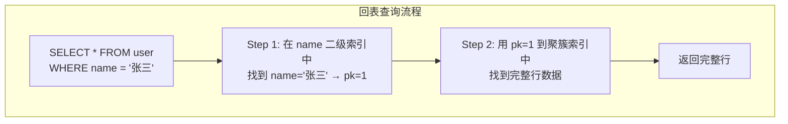
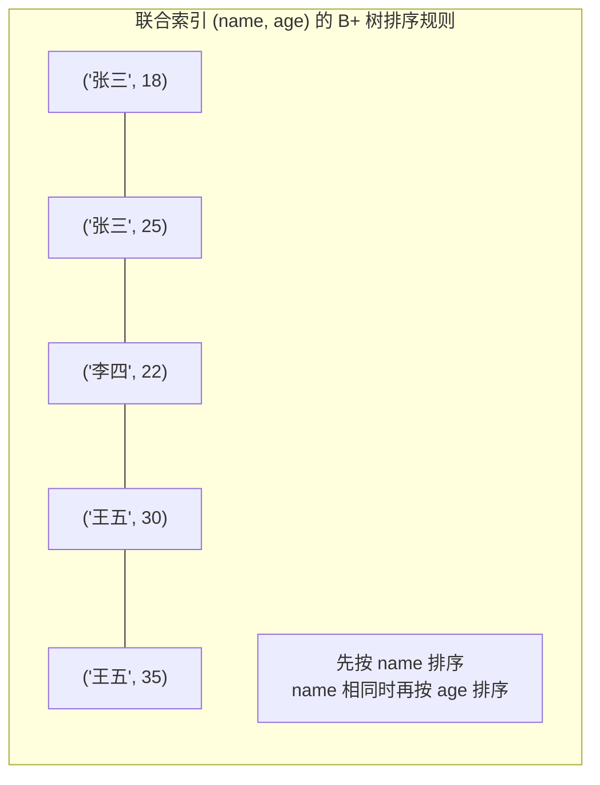

# MySQL 索引

> MySQL 的索引是一种帮助 MySQL 高效获取数据的结构。由于磁盘 IO 比较耗时，所以 MySQL 通过建立索引来减少磁盘 IO 的次数进而提升查询数据的效率。**通过索引缩小获取数据的范围，减少数据筛选的过程的时间消耗**。

## 索引结构探索

### 引言

MySQL 索引是一种帮助高效查询数据的**数据结构**，类比书本的目录，通过目录可以快速检索某一章节，而不用从头开始

提升查询速度的原理是**尽量减少扫描全表，通过减少磁盘 IO 次数**来获取目标数据

> [Data Structure Visualization (usfca.edu)](https://www.cs.usfca.edu/~galles/visualization/Algorithms.html) 这个链接可以进行各种数据结构的可视化

### 哈希表

- **优势**：哈希表可以快速查询，查询效率高

- **劣势**：当出现大量重复键时，存在**哈希冲突**；另外**数据排序、模糊查询难以实现**

### 二叉查找树

- **优势**：规定了左子树上的所有节点都小于根节点，右子树上的所有节点都大于根节点，所以可以使用二分查找提高效率

- **劣势**：在极端情况下会**退化成单向链表**，查询效率低

### 平衡二叉查找树（AVL 树）

- **优势**：规定了左子树和右子树的高度差值不能大于 1，差值超出 1 时树会进行自平衡，避免了出现退化成单向链表的情况

- **劣势**：由于节点的度太少(子节点数量太少，只能有 2 个)，导致数据量非常大的时候，树深度会变得很深，**树的深度越深，磁盘 IO 次数越多，效率越低**

> 度数理解为：节点的分叉数或者子节点数

> 度太少 -> 深度大 -> IO 次数多

### 多路平衡查找树（B 树）

> 二叉查找树、AVL 树的核心问题点就是树的深度，**树的深度和磁盘 IO 次数息息相关**

- B 树结构特点：一个节点的度数 = 一个节点的关键字数 + 1，关键字数越多，度越多，树深度越小，IO 次数越少

- B 树结构图：


- 如果使用 B 树来实现索引结构：


- **优势**：B 树解决了二叉查找树和 AVL 树只有两个度的问题，B 树的节点可以有很多的度，能有效解决数据量大的时候树深度过深导致磁盘 IO 次数过多的问题。

- **劣势**：B 树在数据插入与删除的时候，会破坏 B 树自身的平衡，不得不使用合并与分裂来保证平衡，**并且由于 B 树节点不仅存储索引也存储数据，所以导致合并、分裂节点的操作效率不高**，在节点数量较多的情况下性能影响大；**并且所有节点都存储数据，会导致数据查询的时间不稳定**。

---

### 加强版多路平衡查找树（B+ 树）

> 由于 B 树的不足，MySQL 中 InnoDB 没有直接使用 B Tree，而是对 B 树做了强化，使用了一种 B+ 树的结构来存储索引

- B+ 树结构特点：
  - 节点关键字的数量和节点度数是 `1:1` 的关系
  - 只有叶子节点存储数据，其他节点只存储关键字 (索引)
  - 每一个叶子节点都会有指向上一个和下一个叶子节点的指针，形成一个有序双向链表

- B+ 树结构图：


- B+ 树在 MySQL 中的实现


---

#### 三层 B+ 树大约能存多少数据

- B+ 树中每一个节点对应到 MySQL 是一个数据页，一页数据的大小是 16KB = 16384 字节
- 假设主键是 BIGINT 类型，需要占用 8 个字节，指针需要占用 6 个字节，所以一个非叶子节点需要占据 14 个字节，那么一个数据页大约可以存 1170 个索引
- 第一层 1 个数据页，携带有 1170 个索引（指针）
- 第二层 1170 个数据页，其中每一页携带有 1170 个索引（指针）
- 第三层总共有 1170 \* 1170 = **1368900 页数据**，最终要看每一行数据的大小，每一页能存储多少行数据
- 假设每一行数据大小大约 500 字节，那么每一页就能存 32 行数据，最终三层 B+ 树能存 1368900 \* 32 = 4380 万行数据

> **1368900 页数据、4380 万行数据**，这意味着对于绝大部分业务场景，**3 次 IO** 就能定位数据

#### B+ 树和 B 树区别

| 特性             | B 树                   | B+ 树                                  |
| ---------------- | ---------------------- | -------------------------------------- |
| **非叶子节点**   | 存储索引 + 数据        | **只存储索引**                         |
| **叶子节点**     | 存储索引 + 数据        | **只存储完整数据**                     |
| **叶子节点连接** | 无连接                 | **双向链表串联**                       |
| **查询方式**     | 非叶子节点就能找到数据 | **必须走到叶子节点，但查询效率更稳定** |
| **范围查询效率** | 需要中序遍历整棵树     | **沿链表顺序遍历即可**                 |

---

### 为什么 MySQL 选择 B+ 树作为索引的存储结构

1. **磁盘 IO 次数更少**，由于 B+ 树的非叶子节点仅存储索引，不存储数据，所以**一个非叶子节点能存储更多的索引，从而让树的高度更低**，树的深度由索引数据大小来决定
2. **查询效率更稳定**，由于 B+ 树只有叶子节点才存储数据，**每一次查询都需要走到叶子节点**；而 B 树可能会在非叶子节点中成功查询到数据，**不同查询路径会导致性能不够稳定**
3. **范围查询能力更强**，由于 B+ 树的所有非叶子节点都会有指针指向前后相邻的节点，**范围查询时本质上就是对链表进行遍历**；而 B 树需要对整棵树进行中序遍历，会涉及随机 IO，效率更低

## 存储引擎的索引实现

### MyISAM

在使用 MyISAM 存储引擎的表会分别有三个文件：`.sid`（表结构）、`.MYI`（索引）、`.MYD`（数据）

一个索引对应一棵 B+ 树，所有的 B+ 树都存储在 MYI 文件这里，在 MYI 文件中找到索引值对应数据的磁盘地址后再从 MYD 文件中找到完整的数据

**在 MyISAM 存储引擎中，主键索引和普通索引在结构上没有区别，叶子节点统一存储的是数据的磁盘地址，只是主键索引要求关键字是唯一的**


### InnoDB

在使用 InnoDB 存储引擎的表只有一个文件：`.idb`（存储索引和数据）

虽然在创建时索引有多种类型，但在 InnoDB 内部，所有索引最终会划分成两大类：**聚簇索引(主键索引)、二级索引(普通索引)**


### 存储引擎索引实现对比

| 维度             | MyISAM                                               | InnoDB                                         |
| ---------------- | ---------------------------------------------------- | ---------------------------------------------- |
| **文件结构**     | 三文件：`.sid`(表结构) + `.MYI`(索引) + `.MYD`(数据) | 单文件：`.idb`(索引+数据)                      |
| **索引和数据**   | 分离存储（索引在 MYI，数据在 MYD）                   | 统一存储（索引和数据在同一个文件）             |
| **叶子节点存储** | 数据的**磁盘地址**                                   | 聚簇索引存**完整行数据**，二级索引存**主键值** |
| **索引类型区分** | 主键索引和普通索引**结构无区别**                     | 划分为**聚簇索引**和**二级索引**               |

## InnoDB 聚簇索引与二级索引

### 聚簇索引

- InnoDB 中，**主键索引就是聚簇索引**
- 一张表**只能有一个**聚簇索引
- **叶子节点存储完整的行数据**，非叶子节点存储索引关键字(主键值)
- 数据的物理存储顺序与索引顺序一致
- 如果没有定义主键，InnoDB 会选择第一个 **UNIQUE 索引** 作为聚簇索引；如果也没有 UNIQUE 索引，InnoDB 会内部生成一个隐藏的 **row-id** 作为聚簇索引

### 二级索引

- 除了聚簇索引外，其他所有索引都是二级索引
- 一张表可以有**多个**二级索引
- 叶子节点存储的是 (**索引值**，对应数据行的**主键值**)
- 通过二级索引查到主键后，如果还需要其他列的数据，需要**回表**（回到聚簇索引查找）

### 回表查询

当通过二级索引查询且需要的列不在索引中时，会发生**回表**，根据叶子节点中的主键，回到聚簇索引中查询对应的完整数据行



**回表的代价**：每次回表都是一次额外的 B+ 树查找（可能触发额外的磁盘 I/O）。如果查询匹配了 N 条记录，就需要回表 N 次，每条记录都是一次从二级索引 → 聚簇索引的跨越。当 N 较大时，随机 I/O 的开销会显著放大，这也是后续覆盖索引和索引下推优化的核心动机。

### 聚簇索引 二级索引对比总结

| 维度         | 聚簇索引（主键索引）     | 二级索引（辅助索引）      |
| ------------ | ------------------------ | ------------------------- |
| 数量         | **一张表只有一个**       | 可以有多个                |
| 叶子节点内容 | **完整行数据（所有列）** | **索引列值 + 主键值**     |
| 查询方式     | 直接获取所有列数据       | 可能需要回表              |
| 排序         | 物理存储按主键排序       | 逻辑上按索引列排序        |
| 典型场景     | `SELECT * WHERE id = ?`  | `SELECT * WHERE name = ?` |

> InnoDB 的聚簇索引就是主键索引，叶子节点存的是完整行数据。二级索引叶子节点存的是（索引列值，主键值），所以通过二级索引查数据时，如果 SELECT 的列不在索引里，就需要拿主键值再回聚簇索引查一次完整数据，这就是"回表"。回表多了性能就会下降，所以我们要尽量用覆盖索引来避免回表。

## 索引覆蓋

### 概念

索引覆盖指的是：查询所需的列都包含在索引中，直接返回，**无需回表再查询，直接从索引页获取所需的数据**

> **如何判断是否使用了覆盖索引？** 使用 `EXPLAIN` 查看 `Extra` 列，出现 **`Using index`** 表示使用了覆盖索引。

### 案例

```sql
-- 假设有索引：INDEX idx_name_age (name, age)

-- ✅ 覆盖索引：id（主键）、name、age 都在索引中，无需回表
SELECT id, name, age FROM user WHERE name = '张三';

-- ❌ 非覆盖索引：需要 address 列，不在索引中 → 回表
SELECT id, name, age, address FROM user WHERE name = '张三';
-- 内部会额外触发一次查询，根据 id 去聚簇索引查询完整的数据行，并获取 address 列

-- ✅ 覆盖索引：COUNT 只需要索引列
SELECT COUNT(*) FROM user WHERE name LIKE '张%';
```

### 索引覆盖总结

| 对比维度         | 覆盖索引             | 非覆盖索引（需回表）         |
| ---------------- | -------------------- | ---------------------------- |
| I/O 次数         | 1 次（只读索引页）   | 2+ 次（索引页 + 聚簇索引页） |
| Buffer Pool 占用 | 少（只需缓存索引页） | 多（还需缓存数据页）         |
| 随机 I/O         | 无                   | 回表时产生随机 I/O           |
| EXPLAIN `Extra`  | `Using index`        | （无此标记或显示其他信息）   |

## 联合索引与最左匹配原则

### 联合索引

联合索引意思是对**多个列**创建的索引，并且联合索引的 B+ 树结构是**按照索引定义时的列的顺序**依次排序的

```sql
-- 创建联合索引命令，具体的索引结构会按照先按 `name` 排序，后按 `age` 排序
CREATE INDEX idx_name_age ON user(name, age);
```



### 最左匹配原则

最左匹配原则是**联合索引的查询必须从索引的最左边列开始逐一匹配，不能跳过中间列**。

以索引 `idx(a, b, c)` 为例：

| 查询条件                          | 是否命中索引    | 说明                                        |
| --------------------------------- | --------------- | ------------------------------------------- |
| `WHERE a = 1`                     | ✅ 命中         | 使用第一列                                  |
| `WHERE a = 1 AND b = 2`           | ✅ 命中         | 使用前两列                                  |
| `WHERE a = 1 AND b = 2 AND c = 3` | ✅ 命中         | 使用全部三列                                |
| `WHERE a = 1 AND c = 3`           | ⚠️ **部分命中** | 仅用了 a 列，c 列跳过了 b，**c 不能用索引** |
| `WHERE b = 2`                     | ❌ 不命中       | 跳过了最左边的 a                            |
| `WHERE b = 2 AND c = 3`           | ❌ 不命中       | 跳过了最左边的 a                            |
| `WHERE c = 3`                     | ❌ 不命中       | 跳过了 a 和 b                               |

最左匹配的本质原因是**联合索引的 B+ 树是按索引列定义顺序排序的**。只有从最左边开始连续匹配，才能利用 B+ 树的有序性进行范围定位。跳过中间列后，后面的列在 B+ 树中是无序的，无法使用索引加速查找。

#### 索引跳跃扫描

针对上面例子中 `WHERE b = 2 AND c = 3` 的情况，MySQL 8.0 引入了**索引跳跃扫描**的优化

在满足以下两个条件，最终可以使用索引来进行查询：

- a 列区分度足够低，可以直接穷举（比如只有 2-3 个值）
- 开启索引跳跃扫描

具体效果：

```sql
  -- 索引：idx(a, b, c)
  -- 查询只使用了 b 和 c 列，跳过了 a
  SELECT * FROM t WHERE b = 2 AND c = 3;

  -- 拆分成这两条查询语句后合并结果
  SELECT * FROM t WHERE a = 1 AND b = 2 AND c = 3;  -- 走索引
  SELECT * FROM t WHERE a = 2 AND b = 2 AND c = 3;  -- 走索引
```

EXPLAIN 判断：`Extra` 列显示 `Using index for skip scan`

## 索引下推

索引下推是 MySQL Server 层把与索引相关的条件下推给存储引擎层，由存储引擎层做进一步的数据筛选。核心的目标是：**尽可能地使用索引条件来减少回表操作，进而减少 IO 操作**。

### 没开启索引下推

- 存储引擎根据索引条件定位对应索引记录及其主键值
- 根据主键值去主键索引树上定位并读取完整的数据行
- **把数据行交给 Server 层检测是否满足 where 条件**

执行计划中，`Extra` 列中会显示 `Using where`

### 开启索引下推后

- 存储引擎根据索引条件定位对应对应索引记录
- **判断 where 语句中其他条件能否用索引记录中的列来做检查**，条件不满足，则处理下一行索引记录；条件满足，使用索引中的主键值去主键索引树上定位并读取完整的数据行
- 把数据行交给 Server 层，Server 层检测这些数据能否满足 where 条件的其余部分

执行计划中，`Extra` 列中会显示 `Using index condition`

### 索引下推案例

建表语句

```sql
CREATE TABLE `t_user` (
  `id` int(11) unsigned NOT NULL AUTO_INCREMENT COMMENT '主键',
  `user_name` varchar(50) CHARACTER SET utf8mb4 COLLATE utf8mb4_general_ci DEFAULT NULL COMMENT '用户名',
  `full_name` varchar(50) CHARACTER SET utf8mb4 COLLATE utf8mb4_general_ci DEFAULT NULL COMMENT '全名',
  `age` int(11) DEFAULT '18' COMMENT '年龄',
  `updated_date` date DEFAULT NULL COMMENT '更新日期',
  PRIMARY KEY (`id`),
  KEY `combined_key` (`user_name`,`full_name`,`age`)
) ENGINE=InnoDB AUTO_INCREMENT=1 DEFAULT CHARSET=utf8mb4 COLLATE=utf8mb4_general_ci;
```

可以看到创建了一个包含 3 列字段 `(user_name、full_name、age)` 的组合索引。

- 使用组合索引中，第一列进行了**模糊查询**

  ```sql
  EXPLAIN SELECT * FROM `t_user` WHERE user_name like 'Shannon%' AND full_name = 'xiao ming' And age = 20;
  ```

  因为索引匹配规则是从左到右匹配，当使用 `user_name` 进行**模糊查询**时会导致即使正确使用组合索引，存储引擎**最终也只能用上其中的 `user_name` 这一个字段来做筛选**，后面两个字段需要交给 Server 层自行筛选

  使用 `EXPLAIN` 来查看执行计划，可以看到 `Extra` 列是 `Using Index Condition`

  

  如果把索引条件下推关闭的话，可以看到 `Extra` 列是 `Using Where`

  

---

- 使用了组合索引中的第一列和第三列 (**跳过中间列**)

  ```sql
  EXPLAIN SELECT * FROM `t_user` WHERE user_name = 'Shannon Henry' AND age = 20;
  ```

  根据最左索引匹配规则，使用组合索引时必须严格按照组合索引中字段的顺序来使用，这么使用会导致存储引擎层只能使用 `user_name` 这个条件做筛选

  使用 `EXPLAIN` 来查看执行计划，可以看到 `Extra` 列是 `Using Index Condition`

  

  如果把索引条件下推关闭的话，可以看到 `Extra` 列是 `Using Where`

  

从两个例子中我们可以看到，虽然使用索引的方式导致组合索引不奏效，但是开启索引条件下推后存储引擎还是能把索引条件用上，**减少进行回表的次数，从而达到减少 IO 次数的目的**。

> 参考链接：[五分钟搞懂MySQL索引下推](https://fighter3.blog.csdn.net/article/details/120199122)

### 索引下推总结

| 条件             | 说明                                                   |
| ---------------- | ------------------------------------------------------ |
| **适用存储引擎** | InnoDB 和 MyISAM                                       |
| **适用访问类型** | `range`、`ref`、`eq_ref`、`ref_or_null`                |
| **主要作用对象** | **二级索引**（聚簇索引本身就读取完整行，ICP 意义不大） |
| **下推条件限制** | 条件必须是索引列的表达式，不支持子查询、存储函数等     |

> 索引下推是 MySQL 5.6 的优化。没有 ICP 时，二级索引只能根据最左前缀列过滤，剩余的 WHERE 条件要到 Server 层处理，导致大量无效回表。有了 ICP 后，可以将索引列上的条件下推到存储引擎层，在索引遍历时就直接过滤掉不满足条件的记录，大幅减少回表次数和 I/O。EXPLAIN 中 Extra 列显示 Using index condition 就表示 ICP 生效。

## 索引失效场景

当一条 SQL 语句执行得比较慢的时候，需要去看执行计划分析原因。如果是全表扫描或者没有使用索引，那么就说明没有建立索引或者没有正确使用索引甚至是这个 SQL 语句破坏了索引的使用规则。

### 隐式类型转换

```sql
-- 假设 phone 列是 VARCHAR 类型，且有索引
-- ❌ 索引失效：MySQL 将 phone 列隐式转为数字来比较
SELECT * FROM user WHERE phone = 13800138000;

-- ✅ 索引正常：字符串比较
SELECT * FROM user WHERE phone = '13800138000';
```

> 失效原因：MySQL 会对 `phone` 列转换为数字类型，然后和传入的值进行对比，相当于 `CAST(phone AS SIGNED) = 13800138000`，导致索引失效

使用索引时，**必须遵循索引列的数据类型，避免发生数据类型转换**

---

### 函数/计算操作

```sql
-- 假设有索引 idx_create_time(create_time)

-- ❌ 索引失效：对列使用函数
SELECT * FROM orders WHERE DATE(create_time) = '2024-01-01';

-- ✅ 索引生效：改写为范围查询
SELECT * FROM orders WHERE create_time >= '2024-01-01 00:00:00' AND create_time < '2024-01-02 00:00:00';

-- ❌ 索引失效：列参与计算
SELECT * FROM products WHERE price + 10 = 100;

-- ✅ 索引生效：常量移到另一边
SELECT * FROM products WHERE price = 90;
```

> 失效原因：MySQL 索引的结构存储的是列的原始值，如果对索引进行函数计算，会**破坏索引的有序性**，**B+ 树无法有效定位**

使用索引时，**避免对索引列进行函数计算操作**

---

### like 前缀通配符

```sql
-- 假设有索引 idx_name(name)

-- ❌ 索引失效：% 开头无法利用 B+ 树的有序性
SELECT * FROM user WHERE name LIKE '%张';

-- ⚠️ 索引失效：% 在两边
SELECT * FROM user WHERE name LIKE '%张三%';

-- ✅ 索引生效：前缀匹配可以利用 B+ 树
SELECT * FROM user WHERE name LIKE '张%';
```

> 失效原因：MySQL B+ 树中的存储的索引值是从左到右按顺序排列的，如果前缀使用通配符，无法通过索引的有序性快速定位，需要遍历所有索引记录才能筛选出来

使用索引时，**应尽可能避免把通配符 % 放在最前面**

---

### 联合索引未遵循最左匹配原则

```sql
-- 假设有索引 idx_name(a, b, c)

-- ❌ 索引失效：跳过中间列，只能命中 a 列
SELECT * FROM t WHERE a = 2 AND c = 3;

-- ✅ 索引生效：严格按照索引列定义顺序来使用
SELECT * FROM t WHERE a = 2;
SELECT * FROM t WHERE a = 2 AND b = 3;
SELECT * FROM t WHERE a = 2 AND b = 3 AND c = 4;
```

> 失效原因：MySQL B+ 树中存储的索引列是按照联合索引定义时列的顺序排序的，跳过中间列导致无法按列的顺序依次匹配

使用联合索引时，**尽可能避免跳过中间列，严格按照索引列顺序使用**

---

### 联合索引中范围查询导致后续列失效

```sql
-- 假设有联合索引 idx_abc(a, b, c)

-- ❌ b 列使用了范围查询，导致 c 列索引失效
-- 实际只能命中 a 和 b 两列，c 列需要回表后逐行过滤
SELECT * FROM t WHERE a = 1 AND b > 2 AND c = 3;

-- ✅ 等值查询全部放在前面，范围查询放在最后
-- a、b 等值匹配都能命中索引，c 的范围查询也能走索引
SELECT * FROM t WHERE a = 1 AND b = 2 AND c > 3;
```

> 失效原因：联合索引 `idx(a, b, c)` 的 B+ 树先按 `a` 排序，`a` 相同时按 `b` 排序，`b` 相同时再按 `c` 排序。当 `b` 使用范围查询（`b > 2`）时，匹配到的记录跨越了多个 `b` 值区间，这些区间内的 `c` 值**不再是全局有序的**，因此 `c` 列无法继续利用索引的有序性进行查找。

使用联合索引时，**应将等值查询条件放在范围查询条件之前**。在设计联合索引时，也应将可能用于范围查询的列放在索引定义的最后面。

---

### 使用 OR 条件

```sql
-- 假设有索引 idx_name(name)，但没有 idx_status(status)

-- ❌ 索引失效：OR 两边并不同时都有索引
SELECT * FROM user WHERE name = '张三' OR status = 1;

-- ✅ 索引生效：对有定义索引的列单独进行查询
SELECT * FROM user WHERE name = '张三'
UNION ALL
SELECT * FROM user WHERE status = 1;
```

> 失效原因：只有当 OR 连接的所有条件列都有独立索引时，MySQL 才可能分别使用索引然后合并结果。否则优化器倾向于**全表扫描**。

使用 OR 来拼接 where 语句时，需要注意 **OR 两边的条件都具备索引**，否则**需要评估是否需要拆分成单独的查询**

---

### 使用 NOT IN / NOT EXIST / !=

```sql
-- 这些条件通常会导致索引失效（或效率不高）

-- ❌ 通常全表扫描
SELECT * FROM user WHERE status NOT IN (1, 2);

-- ❌ 通常全表扫描
SELECT * FROM user WHERE status != 1;

-- ⚠️ 可能走索引，但效果差（需要扫描大部分索引再排除）
-- 改用 > 或 < 的组合往往更好
SELECT * FROM user WHERE status > 1;
```

> 需要注意：这些条件**并非绝对不走索引**。如果数据区分度很高（比如 NOT IN 排除的值占比很小），优化器仍可能选择索引扫描。但在大多数实际场景中，它们**会导致全表扫描**或低效的索引扫描。

---

### 使用 IS NULL / IS NOT NULL

```sql
-- 是否走索引取决于数据分布

-- 如果表中绝大部分记录的 name 都不为 NULL
-- IS NULL 可能走索引（因为匹配的记录很少）
SELECT * FROM user WHERE name IS NULL;

-- 如果表中大量记录的 status 为 1
-- IS NOT NULL 可能不走索引（因为匹配的记录太多，全表扫描更快）
SELECT * FROM user WHERE status IS NOT NULL;
```

> 本质：优化器基于成本估算决定是否使用索引。如果索引过滤后的数据量仍然很大（超过表的 20%-30%），优化器可能认为全表扫描更划算。

其实类似 NOT IN 的场景，面对这种模糊的查询，**优化器使用索引会取决于这个索引字段的区分度**，如果优化器认为区分度足够高，那么也会走索引查询

## 索引设计原则

因为索引对于改善查询性能的作用是巨大的，但同时索引也会带来空间上的负担，所以想要正确地创建索引，需要遵循一定的规则。

### 区分度

**索引对数据的区分度应该尽可能高**，如果重复值太多（区分度太低），MySQL 会认为**使用索引再回表的开销还不如直接全表扫描的开销大**，往往会选择全表扫描这种方式。

业界有一个比较流行的计算公式：`区分度 = COUNT(DISTINCT column) / COUNT(*)`

| 选择性范围 | 含义                             | 建议                   |
| ---------- | -------------------------------- | ---------------------- |
| 接近 1.0   | 几乎每行都不同（如主键、唯一键） | **非常适合建索引**     |
| 0.5 - 1.0  | 有较好的区分度                   | **适合建索引**         |
| 0.1 - 0.5  | 区分度一般                       | **视查询场景决定**     |
| 接近 0     | 大量重复值（如性别、状态）       | **单独建索引意义不大** |

---

### 索引值需要稳定

**索引值应该足够稳定**，频繁更新的字段不适合做索引，如果索引数据频繁地更新，那么 B+ 树需要保持平衡而进行节点的分裂和合并、重新排序，这个调整的过程是需要耗费性能的。如果这一行数据插入后，索引对应的字段一直不会被修改，这种情况是最好的。

---

### 联合索引决策

联合索引的列顺序应遵循以下优先级：

**1. 等值查询频率最高的列放左边**

收集这张表常用的查询语句来确定列的先后顺序

```sql
-- 经常这样查：
SELECT * FROM user WHERE name = ? AND age = ?;     -- 频率高
SELECT * FROM user WHERE name = ?;                   -- 频率中等
SELECT * FROM user WHERE age = ?;                    -- 频率低

-- 推荐：idx(name, age) —— name 放左边
```

**2. 排序 (ORDER BY) 需求考虑**

利用 B+ 树**叶子节点链表的有序性**来避免额外的排序开销(filesort)

```sql
-- 经常需要按 status 排序后再按 create_time 排序
SELECT * FROM orders WHERE status = 1 ORDER BY create_time ASC;

-- 反向扫描，也可以避免 filesort
SELECT * FROM orders WHERE status = 1 ORDER BY create_time DESC;

-- 推荐：idx(status, create_time) —— 可以利用索引避免 filesort

-- 注意：如果排序的列不在索引中，就会有额外的 filesort 开销
SELECT * FROM orders WHERE status = 1 ORDER BY id;
```

**3. 范围查询列放最右边**

联合索引遇到范围查询会中断后续列的匹配，所以最好把范围查询放到最右边

```sql
SELECT * FROM user WHERE a = ? AND b > ? AND c = ?
-- 推荐：idx(a, c, b)
-- 注意：b 是范围查询，放在最后可以让 a 和 c 都用到索引
```

---

### 索引冗余与重复

索引不应该冗余，冗余索引需要额外多维护一棵 B+ 树；在合理的范围内可以针对不同的查询场景创建不同的索引

```sql
-- ❌ 冗余：idx_a_b 已经包含了 idx_a 的能力
CREATE INDEX idx_a ON t(a);
CREATE INDEX idx_a_b ON t(a, b);  -- idx_a 可删除

-- ✅ 合理：不同的查询模式需要不同索引
CREATE INDEX idx_a_b ON t(a, b);   -- 查询 WHERE a=? AND b=?
CREATE INDEX idx_b_c ON t(b, c);   -- 查询 WHERE b=? AND c=?
CREATE INDEX idx_c   ON t(c);      -- 单独查 WHERE c=?
```

---

### 避免对随机无序的列建立索引

**随机无序的值不适合做索引**，比如 UUID 和身份证这种随机且无序的值，因为 B+ 树的索引是有序组织的，所以无序的数据插入删除也就意味着**需要频繁的分裂与合并操作**。

## 总结

| 知识点         | 一句话总结                                                                       |
| -------------- | -------------------------------------------------------------------------------- |
| B+ 树 vs B 树  | B+ 树非叶子节点只存索引、叶子节点存数据+链表连接，查询速度更稳定、范围查询更高效 |
| 聚簇索引       | 主键索引，叶子节点存完整行数据，一张表只有一个                                   |
| 二级索引       | 叶子节点存（索引列值，主键值），查询非索引列需回表                               |
| 回表           | 通过二级索引查询且需要的列不在索引时，需要回到聚簇索引中查询完整数据             |
| 覆盖索引       | 查询列都在索引中，无需回表，EXPLAIN 显示 `Using index`                           |
| 最左匹配       | 联合索引从最左边开始连续匹配，跳过列则后续列不可用                               |
| 范围查询断索引 | 遇到范围查询（>、<、BETWEEN）后，后续列索引失效                                  |
| 索引下推 ICP   | MySQL 5.6+ 将索引列条件下推到存储引擎层过滤，减少回表                            |
| 索引失效       | 隐式转换、函数操作、OR 无索引、LIKE '%xx'、NOT IN 等场景                         |
| 索引设计       | 高选择性优先、等值列放左、控制数量、善用覆盖索引                                 |

> 练习: [MySQL 索引练习](./MySQL-index-exercises.md)