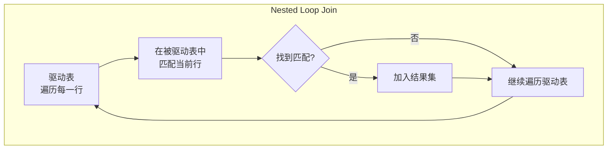

# MySQL 优化篇

## 一、EXPLAIN 查看 SQL 执行计划

### 1.1 基本用法

```sql
EXPLAIN SELECT * FROM user WHERE age = 25 AND city = 'Beijing';
```

### 1.2 常用字段

| 字段 | 含义 | 重点 |
|------|------|---------|
| **id** | 查询序号，值越大越先执行 | 子查询/UNION 中判断执行顺序 |
| **select_type** | 查询类型 | SIMPLE(普通查询) / PRIMARY(嵌套查询中最外层的查询) /<br/> SUBQUERY(子查询) / DERIVED(衍生查询，查询中出现临时结果) |
| **type** ⭐ | 访问类型 | **最核心字段**，从好到差排序见下表 |
| **possible_keys** | 可能使用的索引 | 显示候选索引，但未必真正使用 |
| **key** ⭐ | 实际使用的索引 | NULL 表示未走索引 |
| **key_len** | 索引使用的字节数 | 判断联合索引使用了几个字段 |
| **rows** ⭐ | 预估扫描行数 | 越少越好 |
| **filtered** | 过滤比例 | 100 表示全匹配，越小越差 |
| **Extra** ⭐ | 额外信息 | Using index / Using filesort / Using temporary 等 |

### 1.3 type 字段：访问类型

按效率从上往下排序

| type 值 | 含义 | 典型场景 |
|------|------|---------|
| **system** | 表中只有一行数据（const 的特例） | MyISAM 引擎的小表 |
| **const** | 通过主键或唯一索引**精确匹配一行** | `WHERE id = 1` |
| **eq_ref** | JOIN 时被驱动表通过主键/唯一索引匹配，仅有一行 | `JOIN t2 ON t1.id = t2.id` |
| **ref** | 通过非唯一索引匹配，可能多行 | `WHERE name = 'Tom'`（name 有索引） |
| **range** | 索引范围扫描 | `WHERE age BETWEEN 20 AND 30` |
| **index** | **遍历索引树**（比 ALL 好，但仍扫描全部索引） | `SELECT id FROM t`（id 是主键） |
| **ALL** | **全表扫描**（性能最差，必须优化） | 无索引条件的查询 |

`index`、`ALL` 这两种情况是必须优化的，优化的目标是 `ref` 和 `range`

### 1.4 Extra 字段关键值

| Extra 值 | 含义 | 优化建议 |
|-----------|------|---------|
| **Using index** | 覆盖索引，无需回表 | 最理想状态 |
| **Using index condition** | 索引下推（ICP） | 已优化，无需处理 |
| **Using where** | 存储引擎返回数据后**仍需在 Server 层过滤** | 检查是否可以下推到引擎层 |
| **Using filesort** | 排序时**没有使用到索引进行排序** | 如果数据量较大则需要让ORDER BY用上索引，且ORDER BY排序方向要和索引排序方向契合 |
| **Using temporary** | 使用临时表 | 需优化 GROUP BY(没走索引) / DISTINCT(没走索引) / UNION |
| **Using join buffer** | JOIN 使用了缓冲区 | 被驱动表没有索引，需加索引 |
| **Impossible WHERE** | WHERE 条件不可能为真 | 检查业务逻辑 |

### 1.5 key_len：判断联合索引使用情况

`key_len` 表示索引使用的字节数，通过它可以判断联合索引用了几个字段。

**实战案例**：

```sql
-- 联合索引 idx_abc(a INT, b VARCHAR(20) utf8mb4, c INT)
-- 条件 WHERE a = 1 AND b = 'hello'
-- a: 4字节, b: 20*4+2 = 82字节
-- key_len = 4 + 82 = 86，说明用了 a 和 b 两个字段
```

## 二、慢查询日志分析

### 2.1 慢查询日志配置

```sql
-- 查看慢查询日志状态
SHOW VARIABLES LIKE 'slow_query%';
SHOW VARIABLES LIKE 'long_query_time';

-- 开启慢查询日志
SET GLOBAL slow_query_log = ON;
SET GLOBAL long_query_time = 3;  -- 超过 3 秒记录
SET GLOBAL log_queries_not_using_indexes = ON;  -- 记录未走索引的查询
```

**配置文件方式**（my.cnf）：

```ini
[mysqld]
slow_query_log = 1
slow_query_log_file = /var/log/mysql/slow.log
long_query_time = 3
log_queries_not_using_indexes = 1
```

### 2.2 慢查询分析

- 排查慢查询日志，定位到慢 SQL
    > 在生产环境中，经典的实践还是默认关闭，不建议开启，使用 `druid` 来进行监控
- 用 EXPLAIN 查看 SQL 的执行计划，重点关注 type、key、rows、Extra 字段
- 针对性优化（建立索引、正确使用索引等）

## 三、索引失效问题

笔记中罗列了经典的索引失效的场景及优化手段：[MySQL 索引学习](./MySQL-index.md#索引失效场景)

## 四、深度分页场景

### 4.1 深度分页问题

```sql
-- LIMIT 1000000, 10：需要扫描 1000010 行，丢掉前 1000000 行
SELECT * FROM orders ORDER BY id LIMIT 1000000, 10;
```

**问题本质**：LIMIT offset, size 会**扫描 offset + size 行**再丢掉前 offset 行。offset 变得越来越大，**造成大量无效扫描**。

### 4.2 深度分页优化方案

#### 4.2.1 游标分页

游标分页的本质是**通过索引来控制分页**，发挥 B+ 树叶子节点具有双向链表的优势，这种做法无论如何翻页，**性能都恒定**

```sql
-- 第一页
SELECT * FROM orders WHERE id > 0 ORDER BY id LIMIT 10;
-- 业务中记录最后一条数据的id，假设返回最后一条 id = 100

-- 第二页
SELECT * FROM orders WHERE id > 100 ORDER BY id LIMIT 10;
```

要求：**排序字段有建立索引并且连续**（最好使用主键来进行分页），这种做法**不支持跳转任意页**，只能上下一页

#### 4.2.2 延迟关联

延迟关联的本质是利用**索引覆盖**来避免大量的回表操作，把排除的工作放在了轻量级的二级索引上

```sql
-- ❌ 原始：深分页，回表 1000010 次
SELECT * FROM orders ORDER BY create_time LIMIT 1000000, 10;

-- ✅ 优化：先通过子查询走覆盖索引拿到 id (不需要回表)，再通过 id 回表拿完整数据
SELECT * FROM orders
WHERE id IN (
    SELECT id FROM orders ORDER BY create_time LIMIT 1000000, 10
);
```

### 4.3 深度分页优化总结

当出现深度分页问题时，应该首先从业务层面思考这个需求是否合理，是否远离了用户合理行为，其次才是 SQL 层面的优化

| 方案 | 性能 | 支持跳页 | 适用条件 |
|------|------|---------|---------|
| 游标分页 | 更好 | ❌ | 排序字段有索引 |
| 延迟关联 | 次之，在二级索引上仍有排除 offset 的操作 | ✅ | 排序字段有索引 |

## 五、Join 优化

### 5.1 Join 查询原理



**执行流程**：
1. 从驱动表中取一行数据
2. 在被驱动表中通过 JOIN 条件匹配
3. 匹配成功则加入结果集
4. 重复直到驱动表遍历完

**性能关键**：驱动表的行数 × 被驱动表的访问次数。当被驱动表的 JOIN 字段有索引时，每次查找是 O(log N)，否则是 O(N)。

### 5.2 小表驱动大表

### 5.3 Join 优化总结

## 六、COUNT 优化

### 6.1 COUNT 用法对比

### 6.2 InnoDB 没有精确行数的原因

### 6.3 COUNT 优化方案

## SQL 优化方法论总结