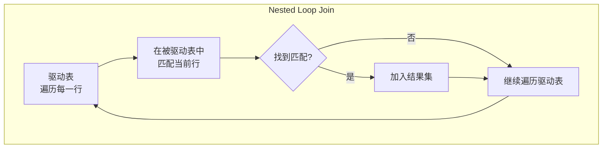
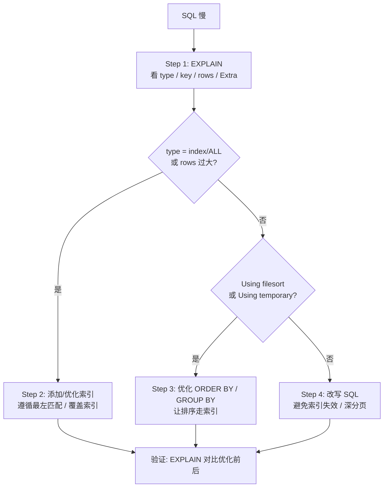

> 练习: [MySQL 优化篇练习](./MySQL-optimization-exercises.md)
>
> 面试: [MySQL 优化篇面试](./MySQL-optimization-interview.md)

# MySQL 优化篇

## 一、EXPLAIN 查看 SQL 执行计划

### 1.1 基本用法

```sql
EXPLAIN SELECT * FROM user WHERE age = 25 AND city = 'Beijing';
```

### 1.2 常用字段

| 字段              | 含义                     | 重点                                                                                                               |
| ----------------- | ------------------------ | ------------------------------------------------------------------------------------------------------------------ |
| **id**            | 查询序号，值越大越先执行 | 子查询/UNION 中判断执行顺序                                                                                        |
| **select_type**   | 查询类型                 | SIMPLE(普通查询) / PRIMARY(嵌套查询中最外层的查询) /<br/> SUBQUERY(子查询) / DERIVED(衍生查询，查询中出现临时结果) |
| **type** ⭐       | 访问类型                 | **最核心字段**，从好到差排序见下表                                                                                 |
| **possible_keys** | 可能使用的索引           | 显示候选索引，但未必真正使用                                                                                       |
| **key** ⭐        | 实际使用的索引           | NULL 表示未走索引                                                                                                  |
| **key_len**       | 索引使用的字节数         | 判断联合索引使用了几个字段                                                                                         |
| **rows** ⭐       | 预估扫描行数             | 越少越好                                                                                                           |
| **filtered**      | 过滤比例                 | 100 表示全匹配，越小越差                                                                                           |
| **Extra** ⭐      | 额外信息                 | Using index / Using filesort / Using temporary 等                                                                  |

### 1.3 type 字段：访问类型

按效率从上往下排序

| type 值    | 含义                                           | 典型场景                            |
| ---------- | ---------------------------------------------- | ----------------------------------- |
| **system** | 表中只有一行数据（const 的特例）               | MyISAM 引擎的小表                   |
| **const**  | 通过主键或唯一索引**精确匹配一行**             | `WHERE id = 1`                      |
| **eq_ref** | JOIN 时被驱动表通过主键/唯一索引匹配，仅有一行 | `JOIN t2 ON t1.id = t2.id`          |
| **ref**    | 通过非唯一索引匹配，可能多行                   | `WHERE name = 'Tom'`（name 有索引） |
| **range**  | 索引范围扫描                                   | `WHERE age BETWEEN 20 AND 30`       |
| **index**  | **遍历索引树**（比 ALL 好，但仍扫描全部索引）  | `SELECT id FROM t`（id 是主键）     |
| **ALL**    | **全表扫描**（性能最差，必须优化）             | 无索引条件的查询                    |

`index`、`ALL` 这两种情况是必须优化的，优化的目标是 `ref` 和 `range`

### 1.4 Extra 字段关键值

| Extra 值                  | 含义                                       | 优化建议                                                                       |
| ------------------------- | ------------------------------------------ | ------------------------------------------------------------------------------ |
| **Using index**           | 覆盖索引，无需回表                         | 最理想状态                                                                     |
| **Using index condition** | 索引下推（ICP）                            | 已优化，无需处理                                                               |
| **Using where**           | 存储引擎返回数据后**仍需在 Server 层过滤** | 检查是否可以下推到引擎层                                                       |
| **Using filesort**        | 排序时**没有使用到索引进行排序**           | 如果数据量较大则需要让ORDER BY用上索引，且ORDER BY排序方向要和索引排序方向契合 |
| **Using temporary**       | 使用临时表                                 | 需优化 GROUP BY(没走索引) / DISTINCT(没走索引) / UNION                         |
| **Using join buffer**     | JOIN 使用了缓冲区                          | 被驱动表没有索引，需加索引                                                     |
| **Impossible WHERE**      | WHERE 条件不可能为真                       | 检查业务逻辑                                                                   |

### 1.5 key_len：判断联合索引使用情况

`key_len` 表示索引使用的字节数，通过它可以判断联合索引用了几个字段。

**实战案例**：

```sql
-- 联合索引 idx_abc(a INT, b VARCHAR(20) utf8mb4, c INT)
-- 条件 WHERE a = 1 AND b = 'hello'
-- a: 4字节, b: 20*4+2 = 82字节
-- key_len = 4 + 82 = 86，说明用了 a 和 b 两个字段
```

## 二、慢查询日志分析

### 2.1 慢查询日志配置

```sql
-- 查看慢查询日志状态
SHOW VARIABLES LIKE 'slow_query%';
SHOW VARIABLES LIKE 'long_query_time';

-- 开启慢查询日志
SET GLOBAL slow_query_log = ON;
SET GLOBAL long_query_time = 3;  -- 超过 3 秒记录
SET GLOBAL log_queries_not_using_indexes = ON;  -- 记录未走索引的查询
```

**配置文件方式**（my.cnf）：

```ini
[mysqld]
slow_query_log = 1
slow_query_log_file = /var/log/mysql/slow.log
long_query_time = 3
log_queries_not_using_indexes = 1
```

### 2.2 慢查询分析

- 排查慢查询日志，定位到慢 SQL
  > 在生产环境中，经典的实践还是默认关闭，不建议开启，使用 `druid` 来进行监控
- 用 EXPLAIN 查看 SQL 的执行计划，重点关注 type、key、rows、Extra 字段
- 针对性优化（建立索引、正确使用索引等）

## 三、索引失效问题

笔记中罗列了经典的索引失效的场景及优化手段：[MySQL 索引学习](./MySQL-index.md#索引失效场景)

## 四、深度分页场景

### 4.1 深度分页问题

```sql
-- LIMIT 1000000, 10：需要扫描 1000010 行，丢掉前 1000000 行
SELECT * FROM orders ORDER BY id LIMIT 1000000, 10;
```

**问题本质**：LIMIT offset, size 会**扫描 offset + size 行**再丢掉前 offset 行。offset 变得越来越大，**造成大量无效扫描**。

### 4.2 深度分页优化方案

#### 4.2.1 游标分页

游标分页的本质是**通过索引来控制分页**，发挥 B+ 树叶子节点具有双向链表的优势，这种做法无论如何翻页，**性能都恒定**

```sql
-- 第一页
SELECT * FROM orders WHERE id > 0 ORDER BY id LIMIT 10;
-- 业务中记录最后一条数据的id，假设返回最后一条 id = 100

-- 第二页
SELECT * FROM orders WHERE id > 100 ORDER BY id LIMIT 10;
```

要求：**排序字段有建立索引并且连续**（最好使用主键来进行分页），这种做法**不支持跳转任意页**，只能上下一页

#### 4.2.2 延迟关联

延迟关联的本质是利用**索引覆盖**来避免大量的回表操作，把排除的工作放在了轻量级的二级索引上

```sql
-- ❌ 原始：深分页，回表 1000010 次
SELECT * FROM orders ORDER BY create_time LIMIT 1000000, 10;

-- ✅ 优化：先通过子查询走覆盖索引拿到 id (不需要回表)，再通过 id 回表拿完整数据
SELECT * FROM orders
WHERE id IN (
    SELECT id FROM orders ORDER BY create_time LIMIT 1000000, 10
);
```

### 4.3 深度分页优化总结

当出现深度分页问题时，应该首先从业务层面思考这个需求是否合理，是否远离了用户合理行为，其次才是 SQL 层面的优化

| 方案     | 性能                                     | 支持跳页 | 适用条件       |
| -------- | ---------------------------------------- | -------- | -------------- |
| 游标分页 | 更好                                     | ❌       | 排序字段有索引 |
| 延迟关联 | 次之，在二级索引上仍有排除 offset 的操作 | ✅       | 排序字段有索引 |

## 五、Join 优化

### 5.1 Join 查询原理



**执行流程**：

1. 从驱动表中取一行数据
2. 在被驱动表中通过 JOIN 条件匹配
3. 匹配成功则加入结果集
4. 重复直到驱动表遍历完

**性能关键**：驱动表的行数 × 被驱动表的访问次数。当被驱动表的 JOIN 字段有索引时，每次查找是 O(log N)，否则是 O(N)。

### 5.2 Join 查询中的驱动表和被驱动表

- `LEFT JOIN` 的左边是驱动表，右边是被驱动表
- `RIGHT JOIN` 的右边是驱动表，左边是被驱动表
- 对于 `INNER JOIN` 来说，MySQL 优化器会**自动选择**，通常会遵顼"小表驱动大表"的原则（`WHERE` 子句能让哪个表的结果集变得更小）
- 对于 `IN` 查询来说，子查询是驱动表，主查询是被驱动表
- 不确定时，可以采用 `EXPLAIN` 查看执行计划，排在前面的是驱动表，后面的是被驱动表

### 5.3 小表驱动大表

为什么要区分驱动表和被驱动表，因为 MySQL 需要遵顼**小表驱动大表的原则**：用小的数据集驱动大的数据集，这样可以**减少在大表中查询的次数**

**原理**：

| 驱动方式     | 外层循环次数         | 内层查找方式 | 总成本 |
| ------------ | -------------------- | ------------ | ------ |
| 小表驱动大表 | 由小表行数决定（少） | 大表走索引   | 低     |
| 大表驱动小表 | 由大表行数决定（多） | 小表走索引   | 较高   |

**判断"小表"的标准**：不是表的总行数，而是**经过 WHERE 过滤后的行数**。

### 5.4 Join 优化总结

| 优化点                       | 说明              |
| ---------------------------- | ----------------- |
| 被驱动表 JOIN 字段**加索引** | **最关键的优化**  |
| **小表驱动大表**             | 减少外层循环次数  |
| **避免过多表 JOIN**          | 建议不超过 3 张表 |

## 六、COUNT 优化

### 6.1 COUNT 用法对比

```sql
-- COUNT(*)：统计总行数（推荐）
SELECT COUNT(*) FROM user;

-- COUNT(1)：等价于 COUNT(*)（推荐）
SELECT COUNT(1) FROM user;

-- COUNT(列)：统计该列非 NULL 的行数
SELECT COUNT(email) FROM user;

-- COUNT(DISTINCT 列)：统计该列不同值的数量
SELECT COUNT(DISTINCT dept_id) FROM user;
```

| 用法      | 含义             | 是否统计 NULL | 性能                                        |
| --------- | ---------------- | ------------- | ------------------------------------------- |
| COUNT(*) | 总行数           | ✅ 统计       | 最优，InnoDB 会自动选择**最小的索引来遍历** |
| COUNT(1)  | 总行数           | ✅ 统计       | 最优（等同 COUNT(*)）                      |
| COUNT(列) | 该列非 NULL 行数 | ❌ 跳过 NULL  | 稍差（需判断 NULL）                         |

### 6.2 InnoDB 没有精确行数的原因

- 对于 M有ISAM 存储引擎的表来说，它会维护表的总行数作为元数据，获取时的时间复杂度是 O(1)

- 而对于 InnoDB 来说，由于 MVCC 的存在，**不同事务在同一时刻下看到的总行数可能不同，有一些行对当前事务不可见**，因此 InnoDB 需要遍历索引树才能得到当前事务视角下能看到的精确行数

## 七、SQL 优化方法论总结



**核心原则**：

1. **先定位，后优化**：慢查询 / EXPLAIN 是起点，不是猜测
2. **索引优先**：大部分慢 SQL 通过加索引或命中索引能解决
3. **改写辅助**：索引解决不了的再考虑 SQL 改写
   1. 如果能满足需求，尽量使用**索引覆盖**代替 `SELETE \*`，能有效减少网络传输
   2. 如果业务可处理，尽量使用 `UNION ALL` 代替 `UNION`，`UNION` 会排除去重，效率更低
   3. 在确定数据量的条件下，对于无索引列和普通二级索引列，尽量加上 `LIMIT 1` 来提升效率
   4. 批量操作时，尽可能在一句 `INSERT` 语句中插入多条数据，不要使用多条单独插入数据的 SQL
   5. 在事务中尽可能减少非必要操作，减小事务颗粒度，**减少锁持有时间**，降低死锁概率
4. **验证闭环**：优化前后都要 EXPLAIN，确认有效

> 练习: [MySQL 优化篇练习](./MySQL-optimization-exercises.md)
>
> 面试: [MySQL 优化篇面试](./MySQL-optimization-interview.md)
