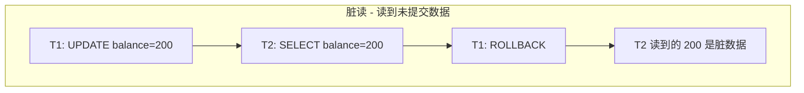
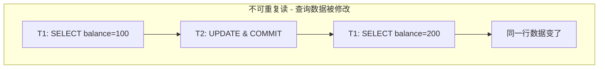
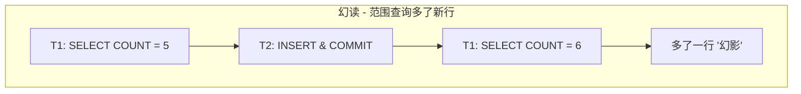
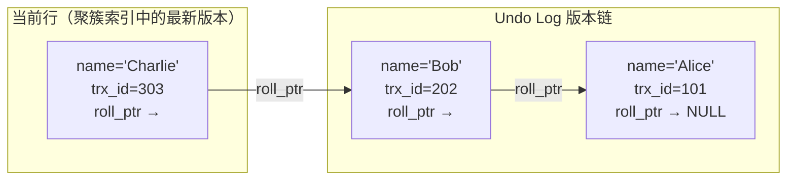
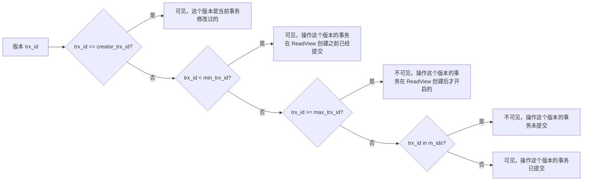
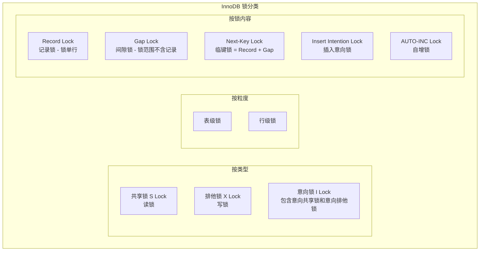

# MySQL 事务与锁解析

## 一、事务基础与 ACID

### 1.1 理解事务

事务：**一个包含多个操作的最小工作单元，这些操作要么同时成功，要么同时失败**。本篇介绍事务，由于 MyISAM 存储引擎不支持事务，所以本篇默认存储引擎为 InnoDB。

用银行转账的例子来说明事务：

```sql
-- 用户 A 向用户 B 转账 100 块，这个操作必须两个账户都同时更新成功
START TRANSACTION;
UPDATE account SET balance = balance - 100 WHERE id = 1;
UPDATE account SET balance = balance + 100 WHERE id = 2;
COMMIT;
```

### 1.2 ACID 特性

| 特性 | 含义 | InnoDB 实现方式 |
|------|------|----------------|
| **原子性<br/>Atomicity** | 事务内的操作要么全部成功，要么全部失败并回滚 | **Undo Log**（回滚日志记录数据修改前的值） |
| **隔离性<br/>Isolation** | 并发事务之间互不干扰 | **MVCC**（快照读）+ **锁机制**（当前读） |
| **持久性<br/>Duration** | 事务一旦提交，那么对数据的操作是永久性生效的，即使宕机也不丢失 | **Redo Log**（WAL 机制，先写日志再写磁盘） |
| **一致性<br/>Consistency** | 事务前后数据库从一个一致状态转换到另一个一致状态（银行转账的例子） | 原子性 + 隔离性 + 持久性共同保证 |

> 原子性、隔离性、持久性是手段，一致性是结果


## 二、事务原子性实现 (Undo Log)

原子性要保证多个操作同时成功或同时失败，同时失败时需要把数据还原到执行前的状态，这个操作由**回滚**机制来保证。

回滚机制：在发生异常的情况下，把所有已经更改过的数据还原到之前的状态；事务的回滚机制由 Undo Log 来保证实现。

### 2.1 Undo Log

Undo Log 记录事务中的增、删、改操作，又称*回滚日志*。Undo Log 有两个主要的作用：1. 记录修改，为 Rollback 恢复准备；2. 为快照读提供历史版本数据。在了解 Undo Log 前先了解一些 InnoDB 存储引擎下记录的额外信息

### 2.2 记录的隐藏字段

- `trx_id`：**当前事务标识**，事务开启时会申请一个事务标识，这个标识会**严格递增**，并向数据行插入最近操作它的一个事务标识
- `roll_pointer`：指向当前记录回滚时的 Undo Log，然后每一个 Undo Log 也会记录前一个版本的 Undo Log 地址，形成一个历史版本链，是 MySQL 事务回滚机制的实现手段，保证了事务的原子性

### 2.3 记录的头信息

- `delete_mask`：类似逻辑删除，**标记这一行数据是被删除的**。由于 MVCC 的存在，不能直接把一行数据删除掉

### 2.4 Undo Log 保障原子性原理

Undo Log 按操作类型分为两类：**insert Undo Log**（INSERT 操作产生）和 **update Undo Log**（UPDATE / DELETE 操作产生）。两者在事务提交和回滚时的行为不同：

| 操作 | Undo Log 类型 | 记录内容 | 事务提交行为 | 事务回滚行为 |
|------|--------------|---------|-------------|-------------|
| **INSERT** | insert Undo Log | 主键字段（length + value） | insert Undo Log **立即删除**（提交前只有本事务可见，无其他事务依赖） | 通过主键定位该行，**物理删除** |
| **DELETE** | update Undo Log | 索引列信息（位置、长度、内容） | 记录保持逻辑删除状态，后台 **purge 线程**择机物理删除 | 清除 `delete_mask`，记录恢复可见 |
| **UPDATE<br/>非主键，存储空间不变** | update Undo Log | 被修改字段的位置、长度、**旧值** | Undo Log 保留供 MVCC 版本链，purge 线程择机清理 | 用旧值覆盖新值，原地恢复 |
| **UPDATE<br/>非主键，存储空间改变** | update Undo Log | 被修改字段的位置、长度、**旧值** | 同上 | 删除新记录，根据旧值**重建**旧记录 |
| **UPDATE<br/>主键** | delete Undo Log + insert Undo Log | 分两步：逻辑删旧行 + 插入新行 | delete Undo Log 保留给 MVCC；insert Undo Log 可以删除 | 回滚 insert（删除新行）+ 回滚 delete（恢复 `delete_mask`） |

核心规律：**INSERT 的 Undo Log 仅对当前事务可见，提交即删**，**UPDATE / DELETE 的 Undo Log 提交后保留**（其他事务的 MVCC 可能还需要沿版本链回溯）。

### 2.5 Undo Log 清理

- 当**所有活跃事务**都不再需要某个 Undo Log 版本时，由 purge 线程清理
- 如果存在长事务（运行很久未提交），Undo Log 会**持续堆积**，导致表空间膨胀，这也是为什么线上要**监控长事务**

```sql
-- 查看运行中的长事务
SELECT trx_id, trx_state, trx_started, 
  TIMESTAMPDIFF(SECOND, trx_started, NOW()) AS duration_seconds
FROM information_schema.innodb_trx
ORDER BY trx_started;
```

## 三、事务隔离性实现 (MVCC + 锁)

### 3.1 并发事务问题与事务隔离级别

#### 3.1.1 脏读

脏读：事务 A 读到了事务 B **未提交**的数据



#### 3.1.2 不可重复读

不可重复读：事务 A 两次读取同一行数据，中间被事务 B **修改**了，两次查询结果不一致，**侧重数据被修改**



#### 3.1.3 幻读

幻读：事务 A 两次执行同一范围查询，中间被事务 B **插入**了新行，两次结果行数不同，**侧重数据新增或删除**



#### 3.1.4 事务隔离级别

| 隔离级别                        | 脏读   | 不可重复读 | 幻读             |
| ------------------------------- | ------ | ---------- | ---------------- |
| Read Uncommitted（读未提交）    | 可能   | 可能       | 可能             |
| Read Committed（读已提交）      | 不可能 | 可能       | 可能             |
| **Repeatable Read**（可重复读） | 不可能 | 不可能     | *InnoDB 下可以避免* |
| Serializable（串行化）          | 不可能 | 不可能     | 不可能           |

### 3.2 快照读与当前读
- **当前读**: 加了共享锁、排他锁的语句 (SELECT .. FRO UPDATE / INSERT / UPDATE / DELETE) 都是当前读，读取的是记录的最新版本，当前读是基于临键锁来实现的

- **快照读**: 普通的 SELECT 操作就是快照读，快照读的前提是隔离级别不是串行化，因为在串行化隔离级别下快照读会退化为当前读，快照读是基于 MVCC 来实现的

### 3.3 MVCC (多版本并发控制)

#### 3.3.1 MVCC 核心思想

MVCC (Multi Version Concurrency Control 多版本的并发控制) 的核心点：**写操作创建新版本，读操作访问旧版本**。MVCC 的实现依赖于 `Undo Log 的版本链`和 `ReadView`，通过维护一行记录的多个版本，**在不加锁的情况下避免并发读写时的冲突**

#### 3.3.2 Undo Log 版本链

每次 UPDATE 操作时，旧版本数据会记录到 Undo Log 中，这些 Undo Log 通过 `roll_pointer` 连接成一条版本链，版本链上存在当前事务和在当前事务之前已提交的事务 Undo Log



#### 3.3.3 ReadView

ReadView 是事务执行**快照读**时创建的一个"可见性判断"工具，包含四个核心字段

| 字段 | 含义 |
|------|------|
| **m_ids** | 创建 ReadView 时，当前所有**活跃（未提交）**事务的 ID 列表 |
| **min_trx_id** | 活跃事务列表中**最小**的事务 ID |
| **max_trx_id** | **下一个事务**将分配的事务 ID |
| **creator_trx_id** | 创建该 ReadView 的事务 ID |

#### 3.3.4 ReadView 判断可见性逻辑

> 之前提到过记录有一个隐藏字段 trx_id，它记录着当前/最近的事务 ID



**简化表格**：

| 条件 | 可见性 | 原因 |
|------|--------|------|
| trx_id == creator | 可见 | 自己事务修改的 |
| trx_id < min | 可见 | 在所有活跃事务之前就已提交 |
| trx_id >= max | 不可见 | ReadView 创建之后才开启的事务 |
| min <= trx_id < max 且不在 m_ids | 可见 | 已提交的事务 |
| min <= trx_id < max 且在 m_ids | 不可见 | 还没提交的事务 |

#### 3.3.5 ReadView 在 RC/RR 下不同的行为

> RC 和 RR 隔离级别底层的 MVCC 机制是一致的，唯一区别就是 ReadView 的创建时机

| 隔离级别 | ReadView 创建时机 | 效果 |
|---------|------------------|------|
| **Read Committed** | **每次 SELECT** 都创建新的 ReadView | 能看到其他事务最新提交的数据 → 允许不可重复读 |
| **Repeatable Read** | **只在第一次 SELECT** 时创建 ReadView，后续复用 | 始终看到事务开始时的快照，其他事务的提交，都无法读取到，因为这些记录版本的 trx_id 都会大于等于 max_trx_id → 保证可重复读 |

#### 3.3.6 Select COUNT(*) 的问题

- 对于 MyISAM 存储引擎，它会维护一个整型变量来记录当前存储的总行数，时间开销是 O(1)
- 对于 InnoDB 存储引擎，**需要通过 MVCC 的辅助来判断每一行对当前事务是否可见**，时间开销是 O(N)；InnoDB 支持事务和 MVCC 特性，**不同的事务查看到的数据行数都不一样**，需要每次都进行判断，不能使用一个变量来表示

### 3.4 LBCC (基于锁的并发控制)

> 除了 MVCC，InnoDB 还提供了基于锁的并发控制手段 LBCC，操作的核心就是加锁，通过加锁来解决读写冲突问题

#### 3.4.1 锁分类



#### 3.4.2 锁类型

> 按类型分类可以分为：共享锁、排他锁、意向锁三类，其中意向锁又可以细分为意向共享锁、意向排他锁

| 锁类型 | 获取方式 | 兼容性 |
|--------|---------|--------|
| **共享锁（S Lock）** | `SELECT ... FOR SHARE` | S 与 S 兼容，S 与 X 互斥 |
| **排他锁（X Lock）** | `SELECT ... FOR UPDATE` / `DELETE` / `UPDATE` | X 与任何锁互斥 |

- **共享锁 (S)**

  当一个事务给数据加上共享锁后，这个锁和其他任何锁都互斥，自己事务和其他事务都**不能对锁定的数据进行修改**，但是其他事务**可以读取到被锁定的数据**，并且其他事务也能继续给这些数据加共享锁，当事务提交时，共享锁自动释放

  ```sql
  select * from xxxtable where xxx for share;
  ```

- **排他锁 (X)**

  当一个事务给数据加上排他锁后，其他事务就不能再给这些数据加共享锁、排他锁，**只有获取了排他锁的事务才可以对数据进行读写**，直到这个事务提交释放排他锁

  ```sql
  -- insert、delete、update语句自动加上排他锁
  
  -- select语句可以手动加上排他锁
  select * from xxxtable where xxx for update;
  ```

- **意向锁 (IS/IX)**

  意向锁是一种特殊的锁，是**表级别**的锁，由**存储引擎维护**，用户无法操作，分为：意向共享锁、意向排他锁

  当事务准备给数据行加共享锁 / 排他锁时，加锁前必须先取得该表的意向共享锁 / 意向排他锁

  意向锁的意义：**当一个事务试图对这个表上加共享锁或排他锁，必须先确认没有其他事务已经锁定这个表内任意一行数据，意向锁的存在使得加锁前不需要逐行确认，是一个快速冲突检测机制**

#### 3.4.3 记录锁 (Record Lock)

记录锁锁住**单条索引记录**，是最精准的行锁；在使用*聚簇索引*或*唯一索引*做等值查询时会用到

```sql
SELECT * FROM user WHERE id = 4 FOR UPDATE;
```
锁住 id=4 这行记录（Record Lock），这行记录不能被其他事务操作


#### 3.4.4 间隙锁 (Gap Lock)

间隙锁锁住**索引记录之间的间隙**，防止其他事务在间隙中插入新数据；在进行范围查询时会用到

> 间隙锁只在 **RR 隔离级别**才生效

```sql
SELECT * FROM emp WHERE empid > 40 FOR UPDATE;
```

假设这个表中有 50 条数据，上面这条 SQL 语句锁定了一个开区间：`(40, +∞)` ，虽然这个区间内的记录 (empid = 41 ~ 50) 都会被锁定，但是间隙锁锁定的不仅仅是一个区间中的每一条记录，而是**整个区间**，如果这时一个事务想要插入一条 empid = 51 的数据，也是无法插入的


#### 3.4.5 临键锁 (Next-Key Lock)

**临键锁 = 记录锁 + 间隙锁**，锁定的内容是左开右闭区间 `(前一个索引值, 当前索引值]`，是 InnoDB 在 **RR 隔离级别下行锁默认加锁方式**

假设现在有一张表，存储引擎是 InnoDB，隔离级别是 `Repeatable Read`，`id` 是主键，`age` 是普通索引

  | id   | age  | name |
  | ---- | ---- | ---- |
  | 5    | 13   | 张三 |
  | 18   | 20   | 李四 |
  | 46   | 28   | 王五 |

那么在 age 列上潜在的临键锁
```sql
索引值:         13         20          28 
Next-Key:  (−∞,13]    (13,20]     (20,28]    (28,+∞)
```

- 在事务 1 中执行：

  ```sql
  -- 根据非唯一索引列锁住某条记录
  select * from user where age = 13 for update;
  -- 或者根据非唯一索引列update某条记录
  update user set name = '小明' where age = 13;
  ```

- 以上无论哪一句执行后，在事务 2 中执行这条语句都会被阻塞

  ```sql
  insert into user values(7, 15, '小张');
  ```

- 因为事务 1 在操作 `age = 13` 这条记录时，取得了 `(13, 20]` 这个区间的临键锁，其他事务操作这个区间内的数据会被阻塞

#### 3.4.6 不同场景下的加锁情况

假设表结构：id（主键）, c（普通索引）, d（无索引）

- 场景一：等值查询命中唯一索引

  ```sql
  SELECT * FROM t WHERE id = 10 FOR UPDATE;
  -- 加锁：Record Lock on id=10
  ```

- 场景二：等值查询命中普通索引

  ```sql
  SELECT * FROM t WHERE c = 20 FOR UPDATE;  -- c 有普通索引，值为 5, 20, 20, 30
  -- 主键索引：Record Lock on 聚簇索引中 c=20 的行
  -- 二级索引：Next-Key Lock (5, 20] + Gap Lock (20, 30)
  -- 普通索引的等值查询本质上是范围查询，因为索引值允许重复，它必须触碰到第一个大于20的索引值才能停下来，需要锁住 (20,30) 这个间隙
  ```

- 场景三：无索引更新

  ```sql
  UPDATE t SET d = 1 WHERE d = 5;  -- d 无索引
  -- 走全表扫描，每行都加 Next-Key Lock，等效于锁表！
  ```

---

可以看到 InnoDB **优先在索引上加锁**，如果没有使用索引来加锁，那么 InnoDB 会对全表进行扫描分别加锁，等同于**锁表**，性能大幅下降

```sql
-- MySQL 8.0 查看 InnoDB 锁等待
SELECT * FROM performance_schema.data_lock_waits;

-- 查看当前持有锁的信息
SELECT * FROM performance_schema.data_locks;
```

#### 3.4.7 死锁问题

只要加锁，就要面临死锁问题，出现条件：

- 存在两个或两个以上的事务
- 锁资源只能被同一个事务持有
- 事务之间因为持有锁和申请锁导致彼此**循环等待**

| 时间 | 事务 A | 事务 B |
|------|--------|--------|
| t1 | `UPDATE t SET name='a' WHERE id=1;`<br/>✅ 获取 id=1 的 X 锁 | |
| t2 | | `UPDATE t SET name='b' WHERE id=2;`<br/>✅ 获取 id=2 的 X 锁 |
| t3 | `UPDATE t SET name='c' WHERE id=2;`<br/>⏳ 等待 id=2 的 X 锁 | |
| t4 | | `UPDATE t SET name='d' WHERE id=1;`<br/>⏳ 等待 id=1 的 X 锁 → **死锁！** |

---

InnoDB 默认开启死锁检测 `innodb_deadlock_detect = ON`，事务竞争锁时默认等待时间是 50 秒 `innodb_lock_wait_timeout`，超过这个时间还没竞争成功就放弃竞争

InnoDB 会自动选择一个**代价最小**的事务进行回滚，并释放其持有的锁；代价最小通常可能是修改数据最少

```sql
-- 查看最近一次死锁信息
SHOW ENGINE INNODB STATUS;
-- 查看 LATEST DETECTED DEADLOCK 部分
```

---

应用层面避免死锁的方式：

- 操作多张表时，尽量以**相同的顺序**来操作（避免形成环形等待）
- 尽量**避免大事务**，大事务往往占用的锁资源更多，更容易出现死锁
- **合理使用索引**，确保更新走索引，避免行锁升级为表锁

### 3.5 InnoDB RR 隔离级别下解决幻读问题

数据查询可以分为快照读与当前读，在 `Repeatable Read` 隔离级别下 InnoDB 解决幻读问题也分这两种情况

- 快照读，不加锁的方式，读取到的可能不是最新版本

  MVCC 来解决幻读问题，因为在事务开启后第一次查询前会生成一个 ReadView，在这之后操作的数据版本的 `trx_id` 都会大于等于 ReadView 中的 `max_trx_id`，根据 ReadView 对可见性的判断，这些新插入、删除的数据对当前事务都不可见

- 当前读，加锁方式，读取到的数据都是最新版本

  临键锁来解决幻读问题，因为在事务开启后，访问这条数据会拿到这个数据对应非唯一索引列上的临键锁，锁住一个区间范围，其他事务无法对这个范围区间进行插入、删除数据，解决幻读的问题

## 四、MySQL 如何保证持久性

持久性主要由 Redo Log 来保证的。

由于数据修改操作会优先写入到 Buffer Pool 中，由后台线程异步地把数据写入到磁盘中去。为了避免因为服务器宕机，而后台线程还没把数据写入到磁盘中而带来的数据丢失的风险，修改操作在写入 Buffer Pool 的**同时也会把数据操作记录写入到 Log Buffer 中**，在事务提交后，就把 Log Buffer 中的数据写入到磁盘的 Redo Log 中。

一旦数据库崩溃并且事务已提交但数据未同步到数据库时，**可以使用 Redo Log 来进行崩溃恢复**。这样事务一旦提交，事务对数据的操作都是能追溯到的，因此保证了事务的持久性。

## 五、MySQL 如何保证一致性

数据库通过原子性（A）、隔离性（I）、持久性（D）来保证一致性（C）。其中一致性是目的，原子性、隔离性、持久性是手段。因此数据库必须实现AID三大特性才有可能实现一致性。


## 六、总结

首先简单了解了 MySQL 的事务的 ACID 四大特性，知道了原子性、持久性、隔离性都是实现一致性的手段，然后进一步学习了 MySQL 如何分别实现这三种事务特性。

了解到 Undo Log 的作用，主要在事务回滚方面和提供 MVCC 历史版本链方面提供帮助，是实现原子性、隔离性的重要手段。

其次在持久性方面，redo log 的崩溃恢复功能也给持久性提供了保障，保障了事务一旦提交，对数据的修改就是持久的。

最后隔离性方面学习到事务隔离性问题与事务隔离级别，通过无锁的方式 MVCC 和有锁的方式 LBCC 共同作用下实现各事务隔离级别。
