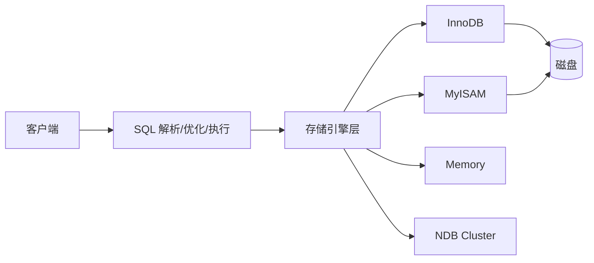
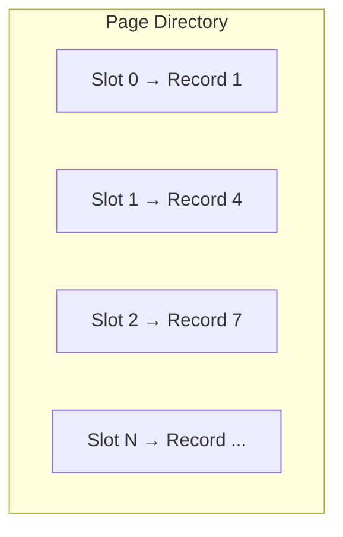
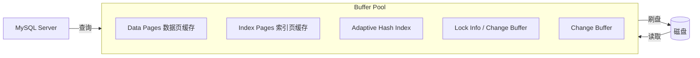
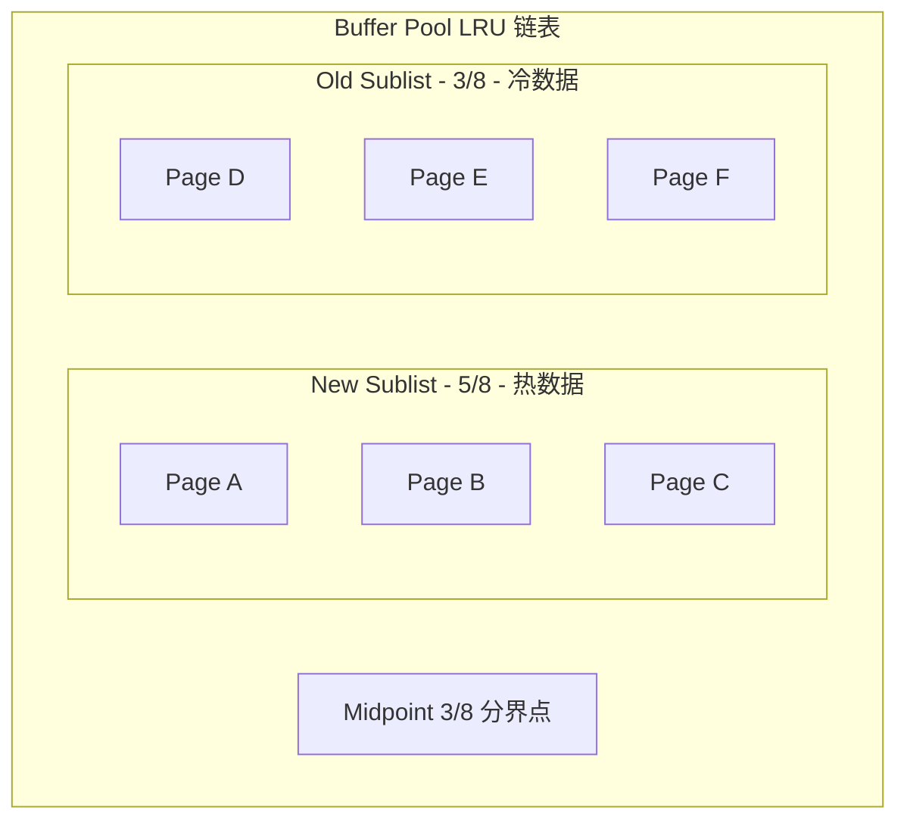
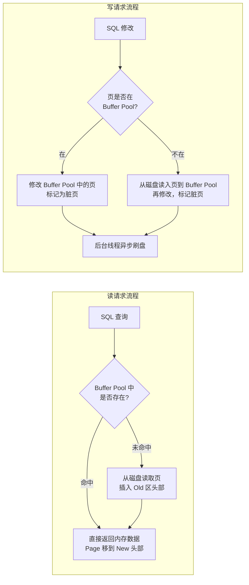
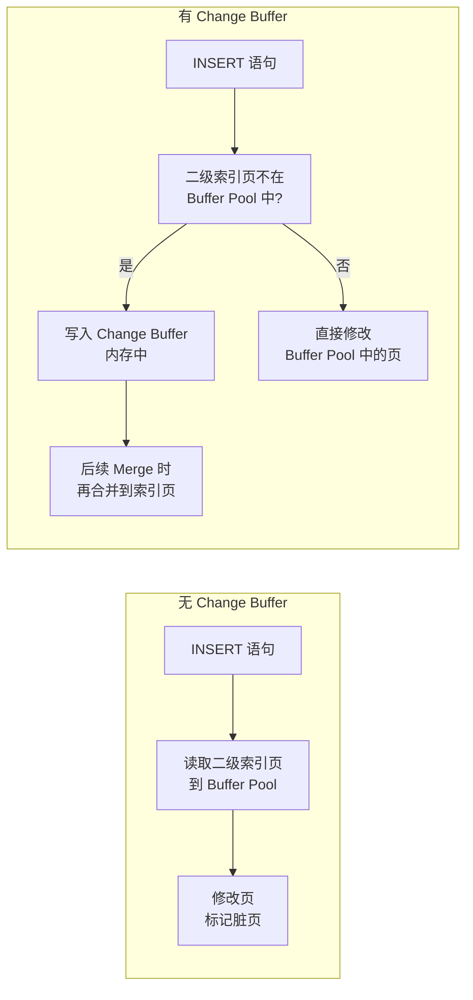
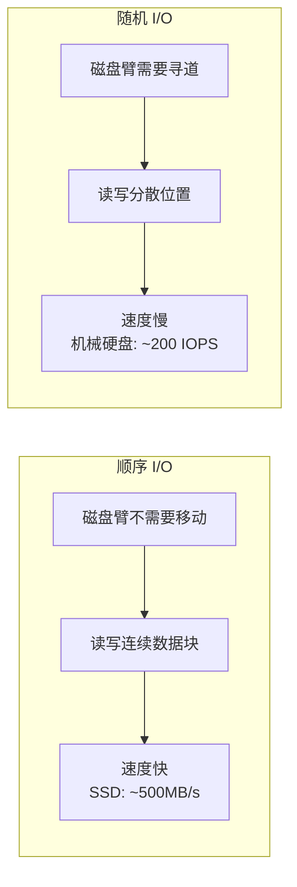

# MySQL 阶段一：存储引擎与 Buffer Pool

## 📋 目录

1. [MySQL 存储引擎概述](#一、mysql-存储引擎概述)
2. [InnoDB vs MyISAM 深度对比](#二、innodb-vs-myisam-深度对比)
3. [InnoDB 磁盘结构：表空间、段、区、页](#三、innodb-磁盘结构表空间段区页)
4. [InnoDB 页结构详解](#四、innodb-页结构详解)
5. [Buffer Pool 工作机制](#五、buffer-pool-工作机制)
6. [Change Buffer 写优化](#六、change-buffer-写优化)
7. [磁盘 I/O 与 B+ 树的关系](#七、磁盘-io-与-b-树的关系)

---

## 一、MySQL 存储引擎概述

### 1.1 什么是存储引擎

MySQL 采用**可插拔存储引擎架构**，存储引擎负责数据的**存储、索引、检索**。Server 层负责 SQL 解析、优化、执行，存储引擎层负责数据的读写。



### 1.2 查看和指定存储引擎

```sql
-- 查看所有支持的存储引擎
SHOW ENGINES;

-- 查看默认存储引擎
SHOW VARIABLES LIKE 'default_storage_engine';

-- 建表时指定存储引擎
CREATE TABLE t1 (id INT PRIMARY KEY) ENGINE = InnoDB;

-- 修改已有表的存储引擎
ALTER TABLE t1 ENGINE = InnoDB;
```

> MySQL 采用可插拔存储引擎架构，最常用的是 InnoDB（MySQL 5.5 后默认）。不同存储引擎在事务支持、锁粒度、索引类型上差异很大，选型时需要根据业务场景决定。

---

## 二、InnoDB vs MyISAM 深度对比

### 2.1 核心差异对比表

| 特性 | InnoDB | MyISAM |
|------|--------|--------|
| **事务支持** | ✅ 支持 ACID | ❌ 不支持 |
| **锁粒度** | 行级锁（Row Lock） | 表级锁（Table Lock） |
| **MVCC** | ✅ 支持 | ❌ 不支持 |
| **外键** | ✅ 支持 | ❌ 不支持 |
| **崩溃恢复** | ✅ 通过 Redo Log | ❌ 需要手动修复 |
| **索引结构** | 聚簇索引 | 非聚簇索引 |
| **全文索引** | ✅ MySQL 5.6+ 支持 | ✅ 原生支持 |
| **COUNT(*)** | 需遍历索引计数 | 直接存储行数 |
| **存储空间** | .ibd（数据+索引） | .MYD（数据）+ .MYI（索引） |
| **并发写性能** | 高（行锁） | 低（表锁） |
| **适合场景** | 高并发 OLTP | 读多写少、不需要事务 |

### 2.2 InnoDB 为什么成为默认引擎


> InnoDB 相比 MyISAM 的核心优势在于**行级锁和 MVCC**，这让它能支持高并发读写。加上 ACID 事务和 Redo Log 的崩溃恢复能力，对于 OLTP 场景几乎是唯一选择。MyISAM 唯一的优势是不需要事务的只读场景（如日志表、配置表），但这种场景现在也被 InnoDB 全面取代。MySQL 8.0 中系统表也已全部转为 InnoDB，MyISAM 基本退出了历史舞台。

### 2.3 COUNT(*) 性能差异

这是一个高频面试陷阱题：

- **MyISAM**：维护了一个整型变量存储总行数，`COUNT(*)` 是 O(1)
- **InnoDB**：需要通过 MVCC 版本判断每一行是否对当前事务可见，必须遍历辅助索引，是 O(N)

> **为什么 InnoDB 不像 MyISAM 一样维护行数？** 因为 InnoDB 支持事务和 MVCC，不同事务看到的数据行数不同（存在未提交事务），无法用一个全局变量准确表达。

---

## 三、InnoDB 磁盘结构：表空间、段、区、页

### 3.1 存储层次结构


| 层级 | 大小 | 说明 |
|------|------|------|
| **表空间** | 可扩展 | InnoDB 最大的存储单元，如系统表空间、独立表空间 |
| **段** | 动态 | 数据段（叶子节点）、索引段（非叶子节点）、回滚段 |
| **区** | 1MB（默认） | 64 个连续的 16KB 页，是物理分配的单位 |
| **页** | 16KB（默认） | InnoDB 磁盘/内存交互的最小单位 |
| **行** | 动态 | 一条记录，存储在页中 |

> **关键参数**：`innodb_page_size` 在实例初始化时指定，一旦确定不可更改。可选值：4KB、8KB、16KB（默认）、32KB、64KB。

### 3.2 表空间类型

| 类型 | 文件 | 说明 |
|------|------|------|
| **系统表空间** | `ibdata1` | 存储 InnoDB 数据字典、Change Buffer、Doublewrite Buffer、Undo Log（5.6 之前） |
| **独立表空间** | `tablename.ibd` | 每张表一个文件，存储该表的数据和索引（MySQL 5.6+ 默认） |
| **Undo 表空间** | `undo_001` 等 | 存储 Undo Log（MySQL 5.6+ 可独立） |
| **临时表空间** | `ibtmp1` | 存储临时表 |

> **参数**：`innodb_file_per_table = ON`（默认开启），每个表使用独立的 .ibd 文件。

---

## 四、InnoDB 页结构详解

### 4.1 页结构全景图

InnoDB 的每个页（16KB）由以下部分组成：


| 组成部分 | 大小 | 作用 |
|----------|------|------|
| **File Header** | 38 字节 | 页的通用信息，如页号、上一页/下一页指针、所属表空间 |
| **Page Header** | 56 字节 | 页的状态信息，如记录数、空闲空间偏移、目录槽数 |
| **Infimum 记录** | 固定 | 比页中任何记录都小的虚拟记录，最小记录 |
| **Supremum 记录** | 固定 | 比页中任何记录都大的虚拟记录，最大记录 |
| **User Records** | 动态 | 实际存储的行记录，按主键大小排序 |
| **Free Space** | 动态 | 页中尚未使用的空间 |
| **Page Directory** | 动态 | 页目录，存储若干槽位，用于二分查找 |
| **File Trailer** | 8 字节 | 用于检测页是否完整（与 File Header 配合做校验） |

### 4.2 页内数据组织


**关键点**：

1. **记录按主键排序**：User Records 中的记录按主键值从小到大排列
2. **单链表连接**：每条记录的 `next_record` 指向下一行
3. **新增记录**：从 Free Space 中分配空间，插入到正确位置（维护排序）
4. **删除记录**：标记为删除（不立即物理删除），等待后续记录插入时复用空间

### 4.3 Page Directory 与二分查找



Page Directory 的作用是**加速页内查找**：

1. 页中的记录被分成若干**组**，每个组的最后一条记录的偏移量存入一个**槽（Slot）**
2. 查找时，先通过 **Page Directory 做二分查找**，定位到具体的组
3. 再在组内通过**单链表顺序遍历**找到目标记录
4. 时间复杂度：O(log 组数 + 组内记录数)

> **面试话术**：InnoDB 的页内查找利用 Page Directory 实现了二分查找。Page Directory 是一个槽位数组，每个槽指向页内一组记录的最后一条。查找时先二分定位到组，再在组内顺序遍历，整体效率很高。

---

## 五、Buffer Pool 工作机制

### 5.1 Buffer Pool 概述

Buffer Pool 是 InnoDB 在**内存中**缓存数据和索引的区域，是 InnoDB 性能的关键。



> **关键配置**：
> - `innodb_buffer_pool_size`：Buffer Pool 大小，建议为物理内存的 50%-70%
> - `innodb_buffer_pool_instances`：Buffer Pool 实例数，默认 1，建议每个实例 >= 1GB

### 5.2 LRU 算法：冷热数据分离

InnoDB 没有使用传统 LRU，而是采用 **改进的 LRU 算法（Midpoint Insertion Strategy）**，将 LRU 链表分为**冷热两个区域**：



**核心规则**：

| 操作 | 行为 |
|------|------|
| **新页读入** | 插入到 Midpoint（Old 头部），**不直接进入热区** |
| **Old 区页面被访问** | 移到 New 头部（变"热"） |
| **New 区页面被访问** | 移到 New 头部（保持热） |
| **空间不足时** | 从 Old 尾部（LRU 端）淘汰 |

### 5.3 为什么不使用传统 LRU


> **面试话术**：InnoDB 使用改进的 LRU 算法，新页从 LRU 链表的 3/8 处（Midpoint）插入，而不是头部。这样全表扫描读入的大量冷数据不会挤走热点数据——因为冷数据不会被再次访问，只会从 Old 区自然老化淘汰。只有真正被再次访问的页面才会被提升到 New 热区。

### 5.4 预读机制（Read-Ahead）

InnoDB 支持两种预读：

| 类型 | 触发条件 | 说明 |
|------|----------|------|
| **线性预读**（Linear Read-Ahead） | 访问一个区的 56 个连续页中 >= 24 个 | 预读下一个区的所有页 |
| **随机预读**（Random Read-Ahead） | 一个区中 13 个不同页被访问 | 预读该区剩余的页 |

> **预读的页也插入到 Old 区**。只有预读的页面被实际访问后，才会被提升到 New 区。如果预读的页面一直未被访问，就会自然淘汰，不污染缓存。

### 5.5 Buffer Pool 完整工作流程



### 5.6 脏页刷盘策略

InnoDB 不会每次修改都刷盘，而是由**后台线程**异步刷新脏页：

| 刷盘触发条件 | 说明 |
|-------------|------|
| **Checkpoint** | Redo Log 空间不足时，强制刷脏页 |
| **Buffer Pool 空间不足** | 脏页比例超过阈值（`innodb_max_dirty_pages_pct`） |
| **后台线程定时刷新** | 每秒刷新一定数量的脏页 |
| **MySQL 正常关闭** | 关闭时刷新所有脏页 |
| **`FLUSH TABLES`** | 手动触发 |

### 5.7 重要配置参数

| 参数 | 默认值 | 说明 |
|------|--------|------|
| `innodb_buffer_pool_size` | 128MB | Buffer Pool 总大小，建议设为物理内存的 50%-70% |
| `innodb_buffer_pool_instances` | 1（或 8） | Buffer Pool 实例数，减少并发争用 |
| `innodb_old_blocks_time` | 1000ms | Old 区页面被访问后等多久才提升到 New 区 |
| `innodb_old_blocks_pct` | 37 | Old 区占 LRU 链表的比例（即 3/8 ≈ 37%） |
| `innodb_max_dirty_pages_pct` | 90 | 脏页比例达到此值时触发积极刷盘 |

> **面试话术**：Buffer Pool 是 InnoDB 性能的核心。通过改进的 LRU 算法（Midpoint Insertion）实现冷热数据分离，防止全表扫描污染缓存。配合预读机制和异步刷盘策略，最大化内存命中率，减少磁盘 I/O。生产环境建议将 `innodb_buffer_pool_size` 设为物理内存的 50%-70%。

---

## 六、Change Buffer 写优化

### 6.1 为什么需要 Change Buffer

对于**二级索引**（非主键索引），插入一条记录可能需要**随机磁盘 I/O**：二级索引通常不是连续的，新增记录可能导致页分裂，需要将页从磁盘读入 Buffer Pool 修改后再写回。

Change Buffer 的作用：**将二级索引的修改操作先缓存起来，后续再合并（Merge）**，避免立即的随机 I/O。



### 6.2 Change Buffer 适用场景

| 条件 | 是否适用 | 原因 |
|------|----------|------|
| **二级索引** | ✅ 适用 | 二级索引通常不唯一，写入代价高 |
| **主键索引** | ❌ 不适用 | 主键索引是有序的，通常是顺序 I/O |
| **唯一索引** | ❌ 不适用 | 需要先检查唯一性，必须读页 |
| **读多写少** | 效果不明显 | 读操作会触发 Merge，增加额外 I/O |
| **写多读少** | ✅ 效果好 | Change Buffer 累积大量修改，批量 Merge 效率高 |

> **参数**：`innodb_change_buffering`，可选值 `none/inserts/deletes/changes/all`，默认 `all`。

> **面试话术**：Change Buffer 是 InnoDB 对**非唯一二级索引**的写优化。当二级索引页不在 Buffer Pool 中时，修改操作先写入 Change Buffer（在内存中），等后续该页被读取或其他触发条件时再合并。这在写多读少的场景下能显著减少随机 I/O。

---

## 七、磁盘 I/O 与 B+ 树的关系

### 7.1 为什么数据库不用 B 树而用 B+ 树

| 特性 | B 树 | B+ 树 |
|------|------|-------|
| **数据存储** | 数据存在所有节点 | 数据只存在叶子节点 |
| **非叶子节点** | 存储数据+索引 | 只存索引（更小） |
| **叶子节点** | 无链表 | 双向链表连接 |
| **单次查询 I/O** | 可能需要多次回溯 | 固定从根到叶，路径稳定 |
| **范围查询** | 中序遍历（复杂） | 顺序遍历叶子链表（高效） |

### 7.2 层级计算（面试高频）

**问题**：假设主键为 BIGINT（8 字节），指针大小 6 字节，页大小 16KB，一棵 B+ 树能存多少数据？

```
非叶子节点每个条目 = 索引键(8B) + 指针(6B) = 14B
每个非叶子节点可存条目数 = 16KB / 14B ≈ 1170

假设每行数据 1KB
每个叶子节点可存记录数 = 16KB / 1KB = 16

3 层 B+ 树:
- 第 1 层: 1 个节点（根节点）
- 第 2 层: 1170 个节点
- 第 3 层: 1170 × 1170 = 1,368,900 个节点

总记录数 = 1,368,900 × 16 ≈ 2190 万条
```

> **结论**：一棵 3 层的 B+ 树可以存储约 **2000 万条记录**，查找一条记录最多只需 **3 次 I/O**。

### 7.3 顺序 I/O vs 随机 I/O



> **面试话术**：B+ 树的非叶子节点只存索引不存数据，使得每个页能存更多条目，从而降低树的高度。InnoDB 的一棵 3 层 B+ 树就能存储约 2000 万条记录，查询最多 3 次磁盘 I/O。而且叶子节点通过双向链表连接，范围查询可以直接顺序遍历，性能极高。

---

## 📌 本阶段核心要点总结

| 知识点 | 一句话总结 |
|--------|-----------|
| InnoDB vs MyISAM | InnoDB 支持事务、行锁、MVCC，是 OLTP 唯一选择 |
| 表空间→段→区→页 | InnoDB 存储四层结构，页是最小 I/O 单位（16KB） |
| 页结构 | Infimum + User Records + Supremum + Page Directory + Free Space |
| Buffer Pool LRU | 新页从 3/8 处插入，防止全表扫描污染缓存 |
| Change Buffer | 非唯一二级索引的写优化，减少随机 I/O |
| B+ 树 vs B 树 | 非叶子节点不存数据，3 层可存 2000 万记录，范围查询高效 |

---

> **下一步**：完成 `mysql-01-exercises.md` 练习题（建议 85 分+），然后进入阶段二：索引原理。
