# MySQL 阶段二：索引原理

> **面试热度**：🔥🔥🔥🔥🔥（最高频，几乎每场必考）
> **学习时长**：5-6 天
> **核心目标**：彻底理解 B+ 树结构、聚簇/二级索引差异、最左匹配、索引下推，能分析索引失效场景并设计高效索引

---

## 📋 目录

1. [索引概述](#一 索引概述)
2. [B+ 树结构与特性](#二 b树结构与特性)
3. [聚簇索引 vs 二级索引](#三 聚簇索引-vs-二级索引)
4. [覆盖索引与回表](#四 覆盖索引与回表)
5. [联合索引与最左匹配原则](#五 联合索引与最左匹配原则)
6. [索引下推（ICP）](#六 索引下推icp)
7. [索引失效场景全解析](#七 索引失效场景全解析)
8. [前缀索引](#八 前缀索引)
9. [索引设计原则](#九 索引设计原则)

---

## 一、索引概述

### 1.1 什么是索引

索引是帮助 MySQL **高效获取数据** 的**数据结构**。类比书的目录：通过目录可以快速定位到某一章，而不需要从头翻到尾。

```mermaid
flowchart LR
    subgraph WithoutIndex[无索引 - 全表扫描]
        A1[SELECT * FROM t WHERE id = 100] --> A2[逐行扫描<br/>O(N)]
    end
    subgraph WithIndex[有索引 - 索引查找]
        B1[SELECT * FROM t WHERE id = 100] --> B2[B+树查找<br/>O(log N)]
    end
```

### 1.2 InnoDB 索引的物理结构

根据 MySQL 官方文档：

> "With the exception of spatial indexes, InnoDB indexes are **B-tree data structures**. Index records are stored in the **leaf pages** of their B-tree or R-tree data structure. The default size of an index page is **16KB**."

InnoDB 的索引（包括聚簇索引和二级索引）底层都是 **B+ 树**（MySQL 文档中称为 B-tree，但实际实现是 B+ 树变体），索引记录存储在**叶子节点页**中。

### 1.3 索引的代价

索引不是万能的，使用索引有明确代价：

| 代价 | 说明 |
|------|------|
| **空间开销** | 索引需要额外的存储空间（通常为数据量的 10%-30%） |
| **写入性能下降** | 每次 INSERT/UPDATE/DELETE 都需要维护索引结构 |
| **维护成本** | 索引越多，优化器选择最优执行计划的复杂度越高 |

> **面试话术**：索引是"用空间换时间"的经典策略。它能将查询从 O(N) 降低到 O(log N)，但会降低写操作性能并占用额外存储。因此索引不是越多越好，需要根据查询模式精心设计。

---

## 二、B+ 树结构与特性

### 2.1 为什么数据库选择 B+ 树而非其他结构

在回答这个问题之前，先对比几种常见的数据结构：

| 数据结构 | 查找 | 范围查询 | 适用场景 |
|----------|------|----------|----------|
| 哈希表 | O(1) | ❌ 不支持 | 等值查询（Memory 引擎） |
| 二叉搜索树 | O(log N) | ✅ | 内存中的有序集合 |
| B 树 | O(log N) | ✅ | 磁盘存储 |
| **B+ 树** | **O(log N)** | **✅ 高效** | **数据库索引（最佳选择）** |
| LSM Tree | O(log N) | ✅ | 写多读少（如 RocksDB、HBase） |

### 2.2 B 树 vs B+ 核心区别

这是面试必考题，必须清晰掌握：

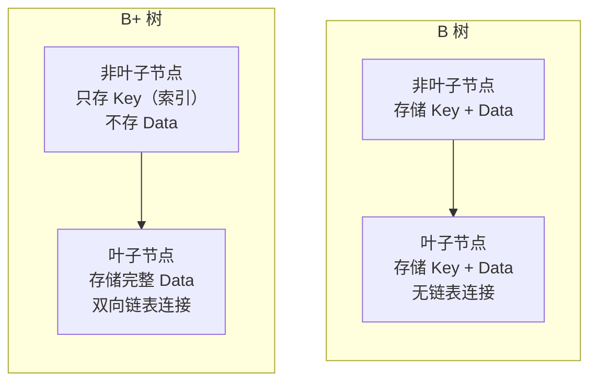

**核心区别一览**：

| 特性 | B 树 | B+ 树 |
|------|------|-------|
| **非叶子节点** | 存储键值 + 数据指针 | **只存储键值（纯索引）** |
| **叶子节点** | 存储完整数据 | 存储完整数据 |
| **叶子节点连接** | 无连接 | **双向链表串联** |
| **查询方式** | 非叶子节点就能找到数据 | **必须走到叶子节点** |
| **范围查询效率** | 需要中序遍历整棵树 | **沿链表顺序遍历即可** |
| **层级（同样数据量）** | 层级更多（非叶子节点存数据占空间） | **层级更少**（非叶子节点只存索引，扇出更高） |

### 2.3 B+ 树为什么更适合数据库

**原因一：减少磁盘 I/O（核心原因）**

数据库的瓶颈在磁盘 I/O，而磁盘是以**页（Page）**为单位读取的（InnoDB 默认 16KB/页）。B+ 树的非叶子节点只存索引键值，**一个节点能存放更多的键值**（扇出/Fan-out 更高），从而让树的**高度更低**。

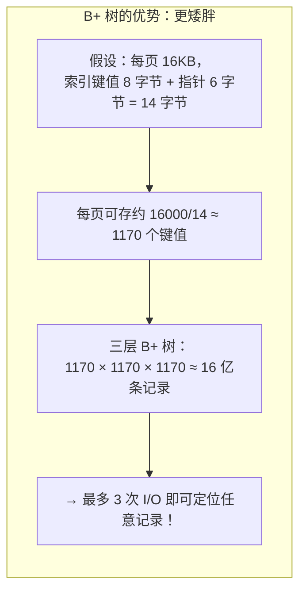

> **关键计算**：
> - InnoDB 页大小 16KB = 16384 字节
> - 假设主键为 BIGINT（8 字节）+ 指针（6 字节）= 14 字节/项
> - 非叶子节点每页可存约 **1170 个索引项**
> - 三层 B+ 树容量：1170³ ≈ **16 亿**
> - 四层 B+ 树容量：1170⁴ ≈ **万亿级**

这意味着对于绝大多数业务表，**3-4 次 I/O 就能定位到目标记录**。

**原因二：范围查询极其高效**

B+ 树的所有数据都在叶子节点，且叶子节点通过**双向链表**连接。范围查询时：
1. 先定位到范围的起始位置（O(log N)）
2. 然后沿链表顺序遍历（O(K)，K 为范围内记录数）

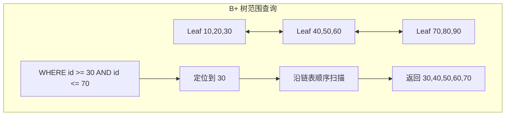

如果是 B 树做范围查询，需要在整棵树上做中序遍历，涉及大量随机 I/O，效率远低于 B+ 树。

**原因三：查询性能稳定**

B+ 树所有查询都必须走到叶子节点，查询时间稳定在 O(log N)。B 树可能在非叶子节点就命中数据，但不同查询路径长度不一致，性能不够稳定——这对数据库这种对延迟敏感的系统很重要。

### 2.4 InnoDB 中 B+ 树的真实结构

结合阶段一所学的知识，InnoDB 的 B+ 树实际上是由**页（Page）**组成的：

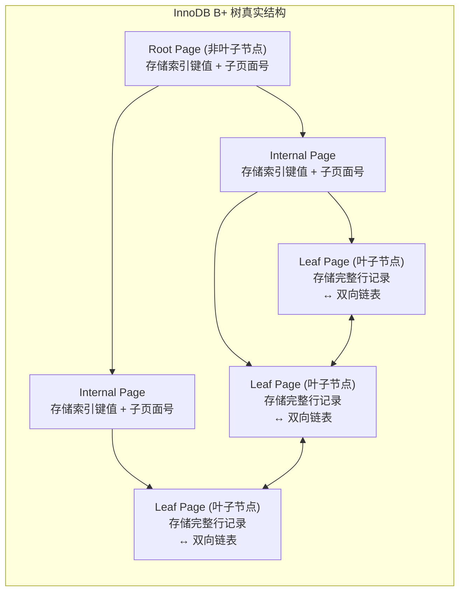

> **注意**：每个节点就是一个 InnoDB 的**页（16KB）**。非叶子节点的"指针"实际上是子页面的**页号（Page Number）**，而不是内存地址。

---

## 三、聚簇索引 vs 二级索引

### 3.1 什么是聚簇索引

根据 MySQL 官方文档：

> "The B-tree index that represents an entire table is known as the **clustered index**, which is organized according to the primary key columns. The nodes of a clustered index data structure contain **the values of all columns in the row**."

**聚簇索引（Clustered Index）**的特点：
- 一张表**只能有一个**聚簇索引
- **叶子节点存储完整的行数据**（所有列的值）
- InnoDB 中，**主键索引就是聚簇索引**
- 数据的物理存储顺序与索引顺序一致

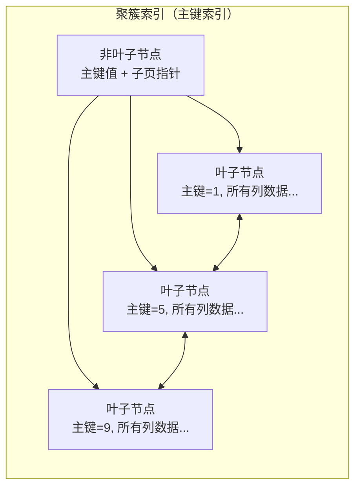

### 3.2 什么是二级索引（Secondary Index）

根据官方文档：

> "Secondary indexes in InnoDB tables are also B-trees, containing pairs of values: **the index key and a pointer to a row in the clustered index**. The pointer is in fact **the value of the primary key of the table**, which is used to access the clustered index if columns other than the index key and primary key are required."

**二级索引**的特点：
- 一张表可以有**多个**二级索引
- 叶子节点存储的是 **(索引键值, 主键值)** 对
- 通过二级索引查到主键后，如果还需要其他列的数据，需要**回表**（回到聚簇索引查找）

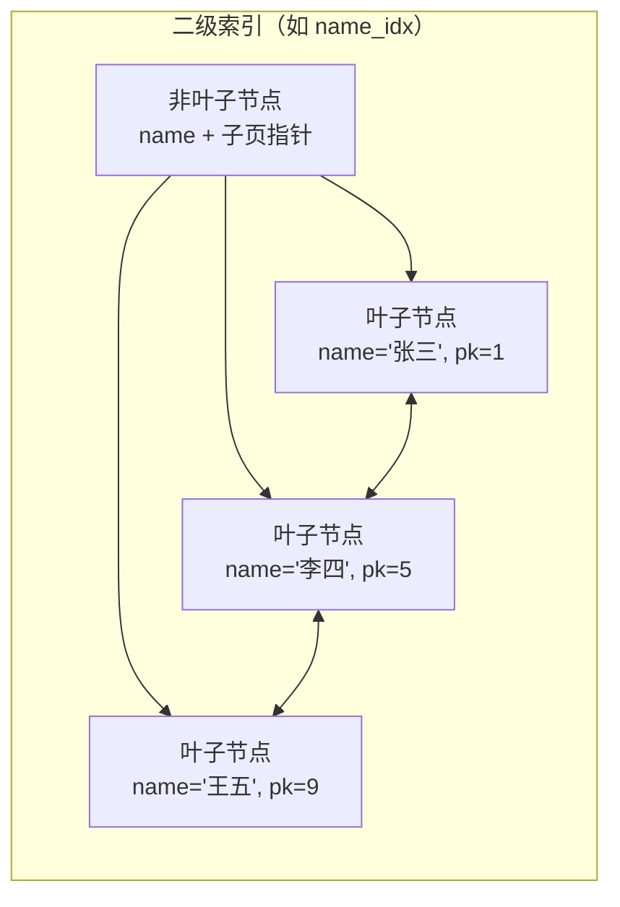

### 3.3 回表查询流程

当通过二级索引查询且需要的列不在索引中时，会发生**回表（Table Lookup / Back to Table）**：

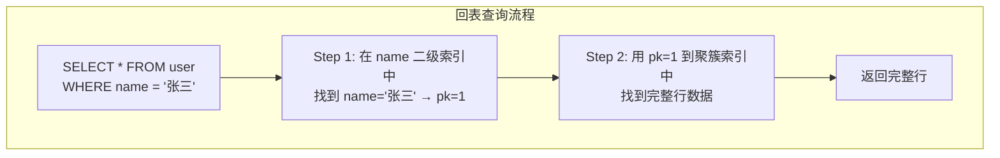

**回表的代价**：每次回表都是一次额外的 B+ 树查找（可能触发额外的磁盘 I/O）。如果回表次数过多，性能会显著下降。

### 3.4 聚簇索引 vs 二级索引对比总结

| 维度 | 聚簇索引（主键索引） | 二级索引（辅助索引） |
|------|---------------------|---------------------|
| 数量 | **一张表只有一个** | 可以有多个 |
| 叶子节点内容 | **完整行数据（所有列）** | **索引列值 + 主键值** |
| 查询方式 | 直接获取所有列数据 | 可能需要回表 |
| 排序 | 物理存储按主键排序 | 逻辑上按索引列排序 |
| 典型场景 | `SELECT * WHERE id = ?` | `SELECT * WHERE name = ?` |

> **面试话术**：InnoDB 的聚簇索引就是主键索引，叶子节点存的是完整行数据。二级索引叶子节点存的是（索引列值，主键值），所以通过二级索引查数据时，如果 SELECT 的列不在索引里，就需要拿主键值再回聚簇索引查一次完整数据，这就是"回表"。回表多了性能就会下降，所以我们要尽量用覆盖索引来避免回表。

---

## 四、覆盖索引与回表

### 4.1 什么是覆盖索引

根据 MySQL 官方文档：

> "The ideal database design uses a **covering index** where practical; the query results are computed entirely from the index, without reading the actual table data."

**覆盖索引（Covering Index）**：查询所需的所有列都包含在索引中，**无需回表**，直接从索引页就能获取结果。

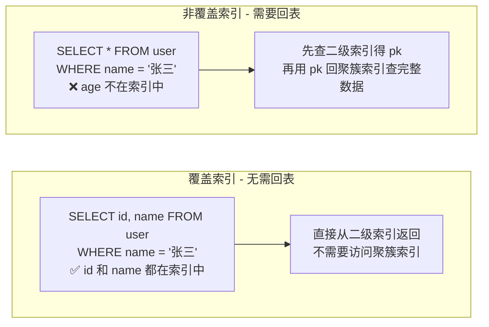

### 4.2 覆盖索引实战示例

```sql
-- 假设有索引：INDEX idx_name_age (name, age)

-- ✅ 覆盖索引：id（主键）、name、age 都在索引中
SELECT id, name, age FROM user WHERE name = '张三';

-- ❌ 非覆盖索引：需要 address 列，不在索引中 → 回表
SELECT id, name, age, address FROM user WHERE name = '张三';

-- ✅ 覆盖索引：COUNT 只需要索引列
SELECT COUNT(*) FROM user WHERE name LIKE '张%';
```

### 4.3 覆盖索引的性能优势

| 对比维度 | 覆盖索引 | 非覆盖索引（需回表） |
|----------|----------|---------------------|
| I/O 次数 | 1 次（只读索引页） | 2+ 次（索引页 + 聚簇索引页） |
| Buffer Pool 占用 | 少（只需缓存索引页） | 多（还需缓存数据页） |
| 随机 I/O | 无 | 回表时产生随机 I/O |
| EXPLAIN Extra | `Using index` | （无此标记或显示其他信息） |

> **如何判断是否使用了覆盖索引？** 使用 `EXPLAIN` 查看 `Extra` 列，出现 **`Using index`** 表示使用了覆盖索引。

---

## 五、联合索引与最左匹配原则

### 5.1 什么是联合索引

联合索引（Composite Index / Multi-column Index）是对**多个列**创建的一个索引：

```sql
-- 创建联合索引
CREATE INDEX idx_name_age ON user(name, age);
```

联合索引的 B+ 树结构是**按照索引定义的列顺序**依次比较排序的：

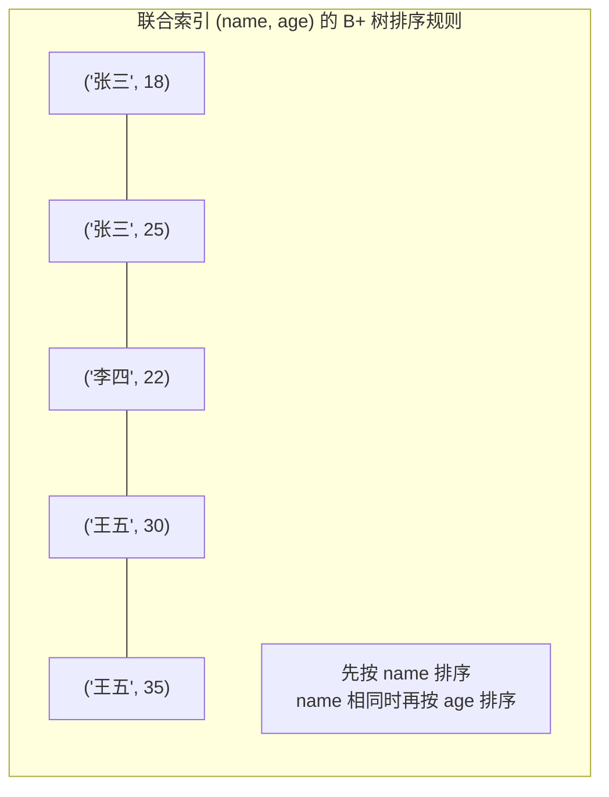

### 5.2 最左匹配原则（Leftmost Prefix）

**最左匹配原则**：联合索引的查询必须从索引的**最左边列开始匹配**，不能跳过中间的列。

根据 MySQL 官方文档关于多列索引的说明：

> "MySQL can use multiple-column indexes for queries that test all the columns in the index, or queries that test only the **first column**, the **first two columns**, the **first three columns**, and so on."

以索引 `idx(a, b, c)` 为例：

| 查询条件 | 是否命中索引 | 说明 |
|----------|-------------|------|
| `WHERE a = 1` | ✅ 命中 | 使用第一列 |
| `WHERE a = 1 AND b = 2` | ✅ 命中 | 使用前两列 |
| `WHERE a = 1 AND b = 2 AND c = 3` | ✅ 命中 | 使用全部三列 |
| `WHERE a = 1 AND c = 3` | ⚠️ **部分命中** | 用了 a 列，c 列跳过了 b，**c 不能用索引** |
| `WHERE b = 2` | ❌ 不命中 | 跳过了最左边的 a |
| `WHERE b = 2 AND c = 3` | ❌ 不命中 | 跳过了最左边的 a |
| `WHERE c = 3` | ❌ 不命中 | 跳过了 a 和 b |

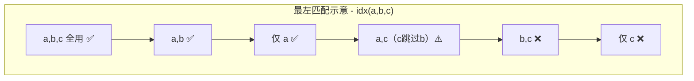

### 5.3 最左匹配的本质原因

理解本质比死记规则更重要。联合索引的 B+ 树是**按 (a, b, c) 顺序排列**的：

```
B+ 树叶子节点排列顺序（已排序）:
(1, 1, 1), (1, 1, 3), (1, 2, 1), (1, 2, 2), (2, 1, 1), (2, 3, 1), (3, 2, 1)
```

- 查 `a = 1`：可以直接定位到 `(1, *, *)` 开头的连续区间 → **能用索引**
- 查 `a = 1 AND b = 2`：进一步缩小到 `(1, 2, *)` 区间 → **能用索引**
- 查 `b = 2`：b=2 的记录分散在各处（`(1,2,*)`, `(3,2,*)` 等），无法形成连续区间 → **不能用索引**

> **面试话术**：最左匹配的本质原因是联合索引的 B+ 树是按索引列定义顺序排序的。只有从最左边开始连续匹配，才能利用 B+ 树的有序性进行范围定位。跳过中间列后，后面的列在 B+ 树中是无序的，无法使用索引加速查找。

### 5.4 范围查询后的列失效问题

这是一个高频陷阱题：

```sql
-- 索引：idx(a, b, c)

-- ✅ a 等值 + b 范围 + c 等值 → c 能用索引吗？
SELECT * FROM t WHERE a = 1 AND b > 2 AND c = 3;
```

**答案：a 和 b 能用索引，c 不能！**

原因：`b > 2` 是**范围查询**，一旦遇到范围条件，后面的列（c）就无法继续用索引精确定位了。因为 b > 2 之后，c 的值不再是有序的。

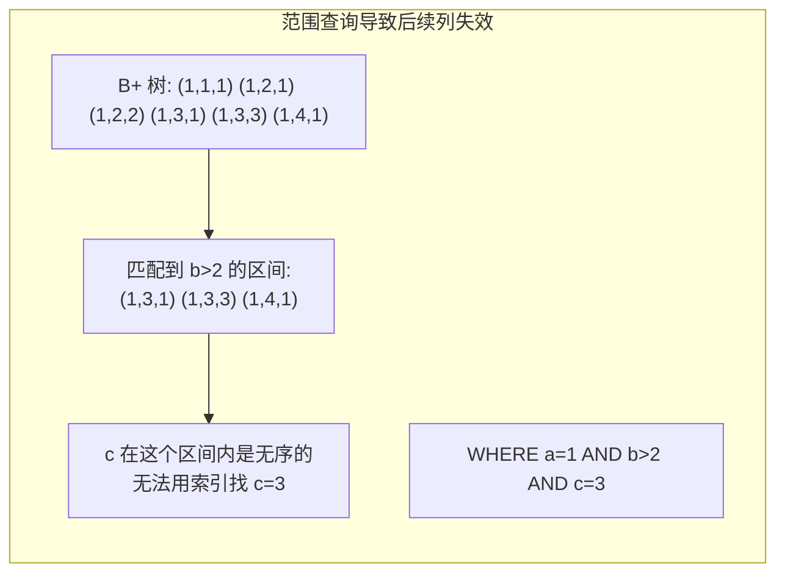

> **例外**：如果范围条件也是等值（如 `IN` 或多个 `OR` 连接的等值），则后续列仍可用索引。例如 `WHERE a = 1 AND b IN (2, 3) AND c = 3`，这里 b 用的是等值匹配（IN 拆成多个等值），c 仍然可以用索引。

---

## 六、索引下推（ICP）

### 6.1 什么是索引下推

**索引下推（Index Condition Pushdown，简称 ICP）**是 MySQL **5.6** 引入的一项优化，用于**减少回表次数**。

根据官方文档：

> "ICP is used for the range, ref, eq_ref, and ref_or_null access methods when there is need to access full table rows. For **InnoDB tables, ICP is specifically used for secondary indexes to reduce full-row reads and I/O operations**."

### 6.2 没有 ICP 时的问题

在没有 ICP 的版本（< 5.6）中，MySQL 使用二级索引时的处理流程：

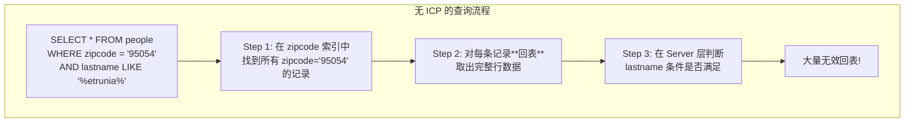

**问题**：即使 `lastname` 条件不满足，也需要先回表取完整数据，造成大量不必要的 I/O。

### 6.3 有 ICP 后的优化

开启 ICP 后，MySQL 将 `WHERE` 中属于索引列的条件**下推到存储引擎层**过滤：

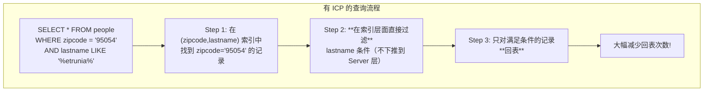

### 6.4 ICP 生效条件与限制

| 条件 | 说明 |
|------|------|
| **适用引擎** | InnoDB 和 MyISAM |
| **适用访问类型** | `range`、`ref`、`eq_ref`、`ref_or_null` |
| **主要作用对象** | **二级索引**（聚簇索引本身就读取完整行，ICP 意义不大） |
| **下推条件限制** | 条件必须是索引列的表达式，不支持子查询、存储函数等 |

**EXPLAIN 判断是否使用 ICP**：查看 `Extra` 列，出现 **`Using index condition`** 表示使用了 ICP。

```sql
-- 示例：查看 ICP 是否生效
EXPLAIN SELECT * FROM people
WHERE zipcode = '95054'
AND lastname LIKE '%etrunia%'
AND address LIKE '%Main Street%';
-- Extra: Using index condition; Using where
-- Using index condition = ICP 生效
```

> **面试话术**：索引下推是 MySQL 5.6 的优化。没有 ICP 时，二级索引只能根据最左前缀列过滤，剩余的 WHERE 条件要到 Server 层处理，导致大量无效回表。有了 ICP 后，可以将索引列上的条件下推到存储引擎层，在索引遍历时就直接过滤掉不满足条件的记录，大幅减少回表次数和 I/O。EXPLAIN 中 `Extra` 列显示 `Using index condition` 就表示 ICP 生效。

---

## 七、索引失效场景全解析

### 7.1 索引失效场景总览

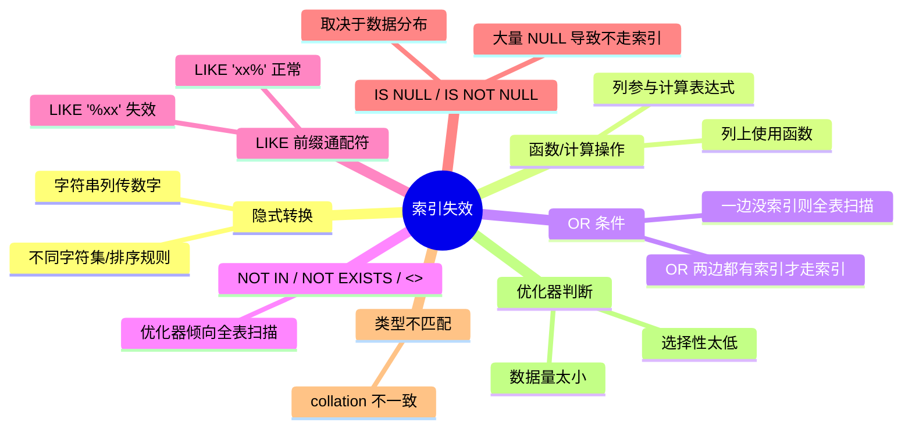

### 7.2 场景一：隐式类型转换（最高频）

```sql
-- 假设 phone 列是 VARCHAR 类型，且有索引
-- ❌ 索引失效：MySQL 将 phone 列隐式转为数字来比较
SELECT * FROM user WHERE phone = 13800138000;

-- ✅ 索引正常：字符串比较
SELECT * FROM user WHERE phone = '13800138000';
```

**为什么会失效？** 当 `phone` 是 VARCHAR 但传入数字时，MySQL 会将**列值**转换为数字进行比较（对列使用函数），相当于 `CAST(phone AS SIGNED) = 13800138000`，导致索引失效。


> **避坑建议**：SQL 中字符串类型的字段始终使用**引号包裹**，即使是纯数字也要加引号。

### 7.3 场景二：函数/计算操作

```sql
-- 假设有索引 idx_create_time(create_time)

-- ❌ 索引失效：对列使用函数
SELECT * FROM orders WHERE DATE(create_time) = '2024-01-01';

-- ✅ 索引生效：改写为范围查询
SELECT * FROM orders WHERE create_time >= '2024-01-01 00:00:00'
                          AND create_time < '2024-01-02 00:00:00';

-- ❌ 索引失效：列参与计算
SELECT * FROM products WHERE price + 10 = 100;

-- ✅ 索引生效：常量移到另一边
SELECT * FROM products WHERE price = 90;
```

**本质**：索引保存的是列的原始值，对列施加函数或计算后，原始值的有序性被破坏，B+ 树无法有效定位。

### 7.4 场景三：OR 条件

```sql
-- 假设有索引 idx_name(name)，但没有 idx_status(status)

-- ❌ 索引失效：OR 两边不都有索引
SELECT * FROM user WHERE name = '张三' OR status = 1;

-- ✅ 索引生效：OR 两边都有索引（或使用 UNION ALL 替代）
SELECT * FROM user WHERE name = '张三'
UNION ALL
SELECT * FROM user WHERE status = 1;
```

**规则**：只有当 **OR 连接的所有条件列都有独立索引**时，MySQL 才可能分别使用索引然后合并结果。否则优化器倾向于全表扫描。

### 7.5 场景四：LIKE 前缀通配符

```sql
-- 假设有索引 idx_name(name)

-- ❌ 索引失效：% 开头无法利用 B+ 树的有序性
SELECT * FROM user WHERE name LIKE '%张';

-- ⚠️ 索引失效：% 在两边
SELECT * FROM user WHERE name LIKE '%张三%';

-- ✅ 索引生效：前缀匹配可以利用 B+ 树
SELECT * FROM user WHERE name LIKE '张%';
```

**原因**：B+ 树是按顺序排列的，`LIKE '张%'` 可以定位到 `'张'` 开头的区间；`LIKE '%张'` 则需要扫描所有记录才能找出以 `'张'` 结尾的记录。

### 7.6 场景五：NOT IN / NOT EXISTS / !=

```sql
-- 这些条件通常会导致索引失效（或效率极低）

-- ❌ 通常全表扫描
SELECT * FROM user WHERE status NOT IN (1, 2);

-- ❌ 通常全表扫描
SELECT * FROM user WHERE status != 1;

-- ⚠️ 可能走索引，但效果差（需要扫描大部分索引再排除）
-- 改用 > 或 < 的组合往往更好
SELECT * FROM user WHERE status > 1;
```

> **注意**：这些条件并非绝对不走索引。如果数据选择性很高（比如 NOT IN 排除的值占比很小），优化器仍可能选择索引扫描。但在大多数实际场景中，它们会导致全表扫描或低效的索引扫描。

### 7.7 场景六：IS NULL / IS NOT NULL

```sql
-- 是否走索引取决于数据分布

-- 如果表中绝大部分记录的 name 都不为 NULL
-- IS NULL 可能走索引（因为匹配的记录很少）
SELECT * FROM user WHERE name IS NULL;

-- 如果表中大量记录的 status 为 1
-- IS NOT NULL 可能不走索引（因为匹配的记录太多，全表扫描更快）
SELECT * FROM user WHERE status IS NOT NULL;
```

**本质**：优化器基于**成本估算**决定是否使用索引。如果索引过滤后的数据量仍然很大（超过表的 20%-30%），优化器可能认为全表扫描更划算。

### 7.8 索引失效速查表

| 场景 | 是否失效 | 正确写法 |
|------|---------|----------|
| 字符串列传数字 | ❌ 失效 | 加引号：`'13800138000'` |
| `DATE(column)` | ❌ 失效 | 改为范围查询 |
| `column + 1 = 10` | ❌ 失效 | 改为 `column = 9` |
| `OR` 一边无索引 | ❌ 失效 | 用 `UNION ALL` 或补建索引 |
| `LIKE '%abc'` | ❌ 失效 | 改用全文索引或 ES |
| `LIKE 'abc%'` | ✅ 正常 | — |
| `NOT IN / !=` | ⚠️ 可能失效 | 改用 `>` / `<` 组合 |
| `IS NULL` | ⚠️ 视情况 | 确保高选择性 |
| 联合索引跳过前列 | ❌ 失效 | 调整索引列顺序或查询条件 |
| 范围查询后的列 | ⚠️ 后续列失效 | 将等值列放前面，范围列放后面 |

---

## 八、前缀索引

### 8.1 为什么需要前缀索引

对于 **VARCHAR/TEXT** 类型的长字符串列（如 URL、邮箱、地址），创建完整索引会占用大量空间：

```sql
-- 假设 url 列平均长度 100 字符
-- 完整索引：每个索引项约 100+ 字节，非常浪费
CREATE INDEX idx_url_full ON page(url);

-- 前缀索引：只索引前 20 个字符
CREATE INDEX idx_url_prefix ON page(url(20));
```

### 8.2 前缀索引的选择性

前缀索引的核心问题是：**截取多少个字符合适？** 太短则选择性低（区分度差），太长则节省空间的意义不大。

**选择性（Selectivity）** = 不重复的前缀值数 / 总行数。越接近 1 越好。

```sql
-- 计算不同前缀长度的选择性
SELECT
  COUNT(DISTINCT LEFT(url, 10)) / COUNT(*) AS sel_10,
  COUNT(DISTINCT LEFT(url, 15)) / COUNT(*) AS sel_15,
  COUNT(DISTINCT LEFT(url, 20)) / COUNT(*) AS sel_20,
  COUNT(DISTINCT LEFT(url, 30)) / COUNT(*) AS sel_30
FROM page;
```

**选择策略**：找到一个使选择性接近完整列选择性的最小前缀长度。

### 8.3 前缀索引的局限性

| 局限性 | 说明 |
|--------|------|
| **无法使用覆盖索引** | 前缀索引不包含完整列值，`SELECT url` 无法只靠索引返回 |
| **无法做 ORDER BY / GROUP BY** | 排序和分组需要完整列值 |
| **LIKE 后缀匹配仍不行** | `LIKE '%keyword'` 即使有前缀索引也无法加速 |
| **不支持 JOIN 的 ON 条件** | JOIN 通常需要精确匹配完整值 |

> **面试话术**：前缀索引适用于长字符串列（如 URL、邮箱），通过只索引前 N 个字符来节省空间。关键是选择一个合适的前缀长度——既要保证足够的选择性（区分度），又要真正节省空间。但前缀索引无法用于覆盖索引、ORDER BY、GROUP BY 等场景，因为这些操作需要完整的列值。

---

## 九、索引设计原则

### 9.1 核心设计原则

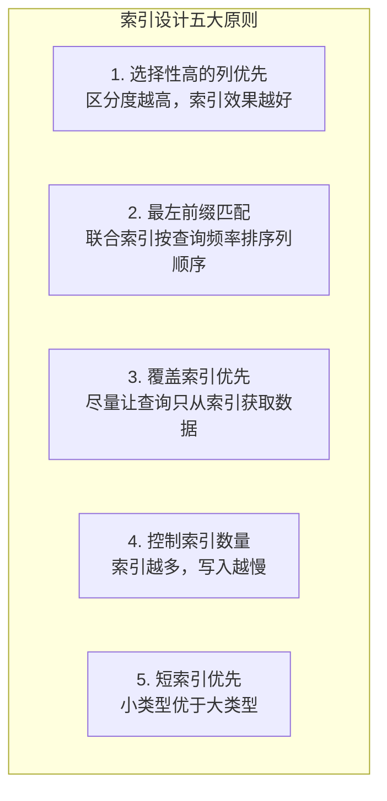

### 9.2 选择性（Selectivity）

**选择性**衡量的是一个列的区分能力：

```
选择性 = COUNT(DISTINCT column) / COUNT(*)
```

| 选择性范围 | 含义 | 建议 |
|-----------|------|------|
| 接近 1.0 | 几乎每行都不同（如主键、唯一键） | **非常适合建索引** |
| 0.5 - 1.0 | 有较好的区分度 | **适合建索引** |
| 0.1 - 0.5 | 区分度一般 | **视查询场景决定** |
| 接近 0 | 大量重复值（如性别、状态） | **单独建索引意义不大** |

```sql
-- 计算列的选择性
SELECT
  COUNT(DISTINCT status) / COUNT(*) AS status_selectivity,
  COUNT(DISTINCT phone)  / COUNT(*) AS phone_selectivity
FROM user;
-- 结果示例：status_selectivity = 0.03（低）, phone_selectivity = 1.0（高）
```

### 9.3 联合索引列顺序决策

联合索引的列顺序应遵循以下优先级：

**1. 等值查询频率最高的列放左边**

```sql
-- 经常这样查：
SELECT * FROM user WHERE name = ? AND age = ?;     -- 频率高
SELECT * FROM user WHERE name = ?;                   -- 频率中等
SELECT * FROM user WHERE age = ?;                    -- 频率低

-- 推荐：idx(name, age) —— name 放左边
```

**2. 排序（ORDER BY）需求考虑**

```sql
-- 经常需要按 name 排序后再按 age 排序
SELECT * FROM user WHERE name = '张三' ORDER BY age;

-- 推荐：idx(name, age) —— 可以利用索引避免 filesort
```

**3. 范围查询列放右边**

```sql
-- WHERE a = ? AND b > ? AND c = ?
-- 推荐：idx(a, c, b) 或 idx(a, b, c)
-- 注意：b 是范围查询，放在最后可以让 a 和 c 都用到索引
```

### 9.4 索引冗余与重复

```sql
-- ❌ 冗余：idx_a_b 已经包含了 idx_a 的能力
CREATE INDEX idx_a ON t(a);
CREATE INDEX idx_a_b ON t(a, b);  -- idx_a 可删除

-- ✅ 合理：不同的查询模式需要不同索引
CREATE INDEX idx_a_b ON t(a, b);   -- 查询 WHERE a=? AND b=?
CREATE INDEX idx_b_c ON t(b, c);   -- 查询 WHERE b=? AND c=?
CREATE INDEX idx_c   ON t(c);      -- 单独查 WHERE c=?
```

### 9.5 索引与 ORDER BY / GROUP BY

索引不仅加速 WHERE 过滤，还能**避免排序**（filesort）：

```sql
-- 假设索引：idx_status_create_time(status, create_time)

-- ✅ 利用索引有序性，避免 filesort
SELECT * FROM orders WHERE status = 1 ORDER BY create_time DESC;

-- ❌ 排序方向不一致，无法利用索引
SELECT * FROM orders WHERE status = 1 ORDER BY create_time ASC;
-- （如果索引是 DESC 则反过来）
```

> **MySQL 8.0 新特性**：支持**降序索引**（Descending Index），可以为不同列指定不同的排序方向：
> ```sql
> CREATE INDEX idx_sc ON orders(status ASC, create_time DESC);
> ```

---

## 📌 本阶段核心要点总结

| 知识点 | 一句话总结 |
|--------|-----------|
| B+ 树 vs B 树 | B+ 树非叶子节点只存索引、叶子节点存数据+链表连接，更矮胖、范围查询更高效 |
| 聚簇索引 | 主键索引即聚簇索引，叶子节点存完整行数据，一张表只有一个 |
| 二级索引 | 叶子节点存（索引列值，主键值），查询非索引列需回表 |
| 覆盖索引 | 查询列都在索引中，无需回表，EXPLAIN 显示 `Using index` |
| 最左匹配 | 联合索引从最左边开始连续匹配，跳过列则后续列不可用 |
| 范围断索引 | 遇到范围查询（>、<、BETWEEN）后，后续列索引失效 |
| 索引下推 ICP | MySQL 5.6+ 将索引列条件下推到存储引擎层过滤，减少回表 |
| 索引失效 | 隐式转换、函数操作、OR 无索引、LIKE '%xx'、NOT IN 等场景 |
| 前缀索引 | 长字符串列截取前 N 字符建索引，需权衡选择性与空间 |
| 索引设计 | 高选择性优先、等值列放左、控制数量、善用覆盖索引 |

> **预告**：事务 ACID 的实现原理、MVCC 多版本并发控制、各种锁机制将在**阶段三（事务与锁）**中详细展开。

---

> **下一步**：完成 `mysql-02-exercises.md` 练习题（建议 85 分+），然后进入阶段三：事务与锁。
