# MySQL 阶段三：事务与锁

> **面试热度**：🔥🔥🔥🔥🔥（最高频，几乎每场必考）
> **学习时长**：5-6 天
> **核心目标**：彻底掌握 ACID 实现原理、MVCC 版本链与 ReadView、InnoDB 各种锁机制，能分析死锁场景和事务并发问题

---

## 📋 目录

1. [事务基础与 ACID](#一 事务基础与-acid)
2. [事务隔离级别](#二 事务隔离级别)
3. [MVCC 多版本并发控制](#三 mvcc-多版本并发控制)
4. [InnoDB 锁机制](#四 innodb-锁机制)
5. [死锁：检测、处理与预防](#五 死锁检测处理与预防)
6. [事务日志：Redo Log 与 Undo Log](#六 事务日志redo-log-与-undo-log)

---

## 一、事务基础与 ACID

### 1.1 什么是事务

事务是数据库操作的**最小逻辑工作单元**，由一组 SQL 语句组成，要么全部成功，要么全部失败回滚。

```sql
-- 典型事务：银行转账
START TRANSACTION;
UPDATE account SET balance = balance - 100 WHERE id = 1;  -- A 扣款
UPDATE account SET balance = balance + 100 WHERE id = 2;  -- B 加款
COMMIT;
-- 任何一步失败则 ROLLBACK，恢复到事务开始前的状态
```

### 1.2 ACID 四大特性

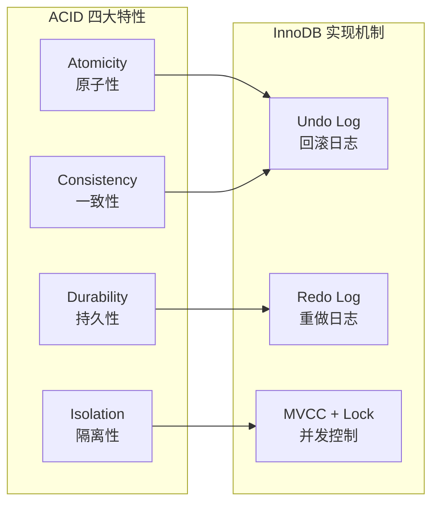

| 特性 | 含义 | InnoDB 实现方式 |
|------|------|----------------|
| **原子性** | 事务中的操作要么全部成功，要么全部回滚 | **Undo Log**（回滚日志记录数据修改前的值） |
| **一致性** | 事务前后数据库从一个一致状态转换到另一个一致状态 | 原子性 + 隔离性共同保证 |
| **隔离性** | 并发事务之间互不干扰 | **MVCC**（快照读）+ **锁机制**（当前读） |
| **持久性** | 事务一旦提交，数据永久保存，即使宕机也不丢失 | **Redo Log**（WAL 机制，先写日志再写磁盘） |

### 1.3 事务的生命周期

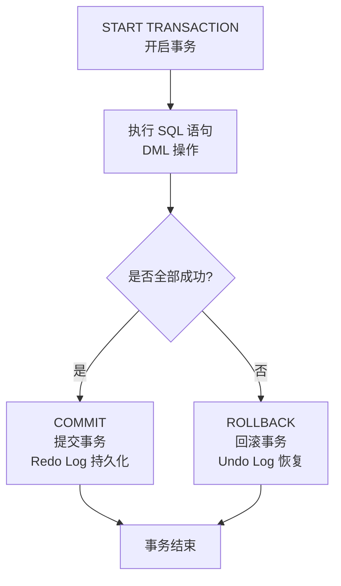

> **面试话术**：MySQL 的 ACID 不是靠单一机制实现的。原子性靠 Undo Log，持久性靠 Redo Log，隔离性靠 MVCC + 锁，一致性是前面三者的共同结果。

---

## 二、事务隔离级别

### 2.1 并发事务带来的问题

在讲解隔离级别之前，先理解并发事务会导致哪些问题：

| 问题 | 含义 | 严重程度 |
|------|------|---------|
| **脏读** | 事务 A 读到了事务 B **未提交**的数据 | 严重 |
| **不可重复读** | 事务 A 两次读同一行，中间被事务 B **修改**了，两次结果不同 | 中等 |
| **幻读** | 事务 A 两次执行同一范围查询，中间被事务 B **插入**了新行，两次结果行数不同 | 中等 |

**三者区别**：

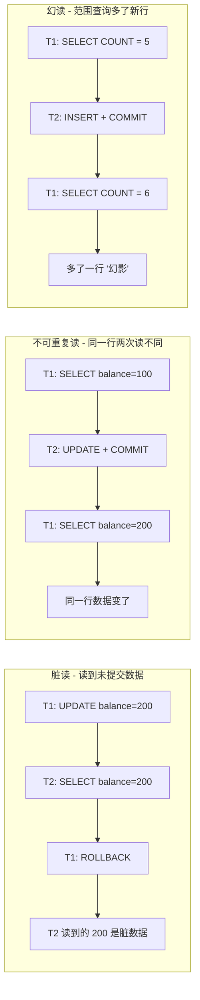

### 2.2 四种隔离级别

SQL 标准定义了四种隔离级别，从低到高：

| 隔离级别 | 脏读 | 不可重复读 | 幻读 | 性能 |
|---------|------|-----------|------|------|
| READ UNCOMMITTED（读未提交） | 可能 | 可能 | 可能 | 最高 |
| READ COMMITTED（读已提交） | 避免 | 可能 | 可能 | 高 |
| **REPEATABLE READ（可重复读）** | 避免 | 避免 | **可能** | 中 |
| SERIALIZABLE（串行化） | 避免 | 避免 | 避免 | 最低 |

> **MySQL 默认隔离级别是 REPEATABLE READ**。

```sql
-- 查看当前隔离级别
SELECT @@transaction_isolation;
-- MySQL 5.7 用 @@tx_isolation（已废弃）

-- 设置隔离级别
SET SESSION TRANSACTION ISOLATION LEVEL READ COMMITTED;
```

### 2.3 InnoDB RR 级别如何避免幻读

**核心结论**：InnoDB 的 RR 级别通过 **MVCC + Next-Key Lock** 在**很大程度上**避免了幻读，但并非 100% 避免。

- **快照读**（普通 SELECT）：通过 MVCC ReadView，始终读取事务开始时的快照，不会看到新插入的行 → **避免幻读**
- **当前读**（SELECT ... FOR UPDATE / INSERT / UPDATE / DELETE）：通过 **Next-Key Lock** 锁住范围，阻止其他事务在范围内插入新行 → **避免幻读**

**但有一个例外场景**：先快照读后当前读可能产生幻读：

```sql
-- 事务 A（RR 级别）
SELECT * FROM t WHERE id = 5;           -- 快照读：不存在
-- 事务 B 在此插入 id=5 并提交
UPDATE t SET name = 'x' WHERE id = 5;   -- 当前读：能修改成功（说明存在）
SELECT * FROM t WHERE id = 5;           -- 快照读：现在能看到了（幻读）
```

> **面试话术**：InnoDB 的 RR 级别通过 MVCC 解决了快照读的幻读问题，通过 Next-Key Lock 解决了当前读的幻读问题。但先快照读再当前读这种混合场景下仍可能出现幻读，严格来说不是 100% 避免。

---

## 三、MVCC 多版本并发控制

### 3.1 MVCC 核心思想

MVCC（Multi-Version Concurrency Control）让读操作不加锁，通过**数据的版本链**实现非阻塞读。核心是**读写不冲突**：写操作创建新版本，读操作访问旧版本。

### 3.2 隐藏字段

InnoDB 为每行记录自动添加两个隐藏字段：

| 隐藏字段 | 大小 | 作用 |
|---------|------|------|
| **DB_TRX_ID** | 6 字节 | 最近修改该行的**事务 ID** |
| **DB_ROLL_PTR** | 7 字节 | **回滚指针**，指向 Undo Log 中该行的上一个版本 |

（如果表没有主键，还有一个 6 字节的 **DB_ROW_ID** 隐藏自增列）

### 3.3 Undo Log 版本链

每次 UPDATE 操作时，旧版本数据会被写入 Undo Log，通过 `DB_ROLL_PTR` 串成一条版本链：

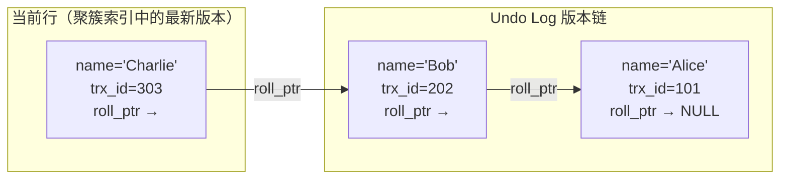

**版本链遍历规则**：从当前行出发，沿 `roll_ptr` 逐个回溯，直到找到对当前事务可见的版本。

### 3.4 ReadView（读视图）

ReadView 是事务执行**快照读**时创建的一个"可见性判断"工具，包含四个核心字段：

| 字段 | 含义 |
|------|------|
| **m_ids** | 创建 ReadView 时，当前所有**活跃（未提交）**事务的 ID 列表 |
| **min_trx_id** | 活跃事务列表中**最小**的事务 ID |
| **max_trx_id** | 下一个将分配的事务 ID（即 max(m_ids) + 1） |
| **creator_trx_id** | 创建该 ReadView 的事务 ID |

**可见性判断规则**：

对于版本链中某个版本的 `trx_id`：

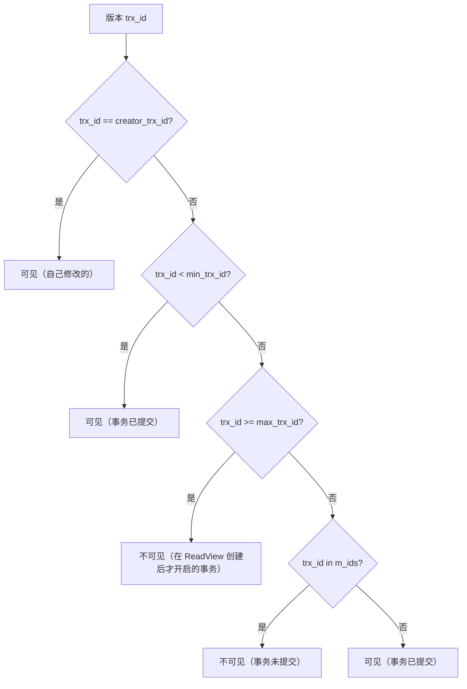

**简化口诀**：

| 条件 | 可见性 | 原因 |
|------|--------|------|
| trx_id == creator | 可见 | 自己修改的 |
| trx_id < min | 可见 | 在所有活跃事务之前就已提交 |
| trx_id >= max | 不可见 | ReadView 创建之后才开启的事务 |
| min <= trx_id < max 且不在 m_ids | 可见 | 已提交的事务 |
| min <= trx_id < max 且在 m_ids | 不可见 | 还没提交的事务 |

### 3.5 RC vs RR 的 ReadView 差异

**这是面试最爱问的 MVCC 细节**：

| 隔离级别 | ReadView 创建时机 | 效果 |
|---------|------------------|------|
| **RC（读已提交）** | **每次 SELECT** 都创建新的 ReadView | 能看到其他事务最新提交的数据 → 允许不可重复读 |
| **RR（可重复读）** | **只在第一次 SELECT** 时创建 ReadView，后续复用 | 始终看到事务开始时的快照 → 保证可重复读 |

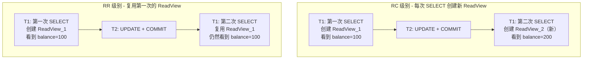

> **面试话术**：RC 和 RR 底层的 MVCC 机制完全一样，唯一的区别就是 ReadView 的创建时机。RC 每次 SELECT 创建新的，所以能看到其他事务已提交的最新数据；RR 只在第一次 SELECT 创建，后续复用，所以保证可重复读。

---

## 四、InnoDB 锁机制

### 4.1 锁的分类总览

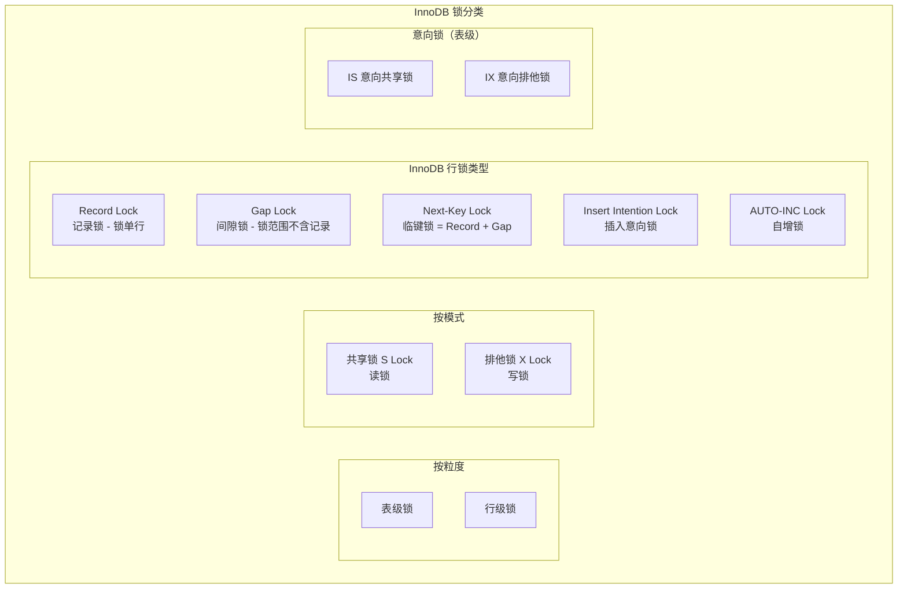

### 4.2 共享锁与排他锁

| 锁类型 | 获取方式 | 兼容性 |
|--------|---------|--------|
| **共享锁（S Lock）** | `SELECT ... LOCK IN SHARE MODE`（8.0: `FOR SHARE`） | S 与 S 兼容，S 与 X 互斥 |
| **排他锁（X Lock）** | `SELECT ... FOR UPDATE` / `DELETE` / `UPDATE` | X 与任何锁互斥 |

```sql
-- 加共享锁
SELECT * FROM t WHERE id = 1 LOCK IN SHARE MODE;  -- MySQL 5.7
SELECT * FROM t WHERE id = 1 FOR SHARE;            -- MySQL 8.0

-- 加排他锁
SELECT * FROM t WHERE id = 1 FOR UPDATE;
```

### 4.3 Record Lock（记录锁）

**锁住索引上的单条记录**，是最精确的行锁。

```sql
-- 假设 id 有主键索引
SELECT * FROM t WHERE id = 5 FOR UPDATE;
-- 锁住 id=5 这条记录（Record Lock）
```

> 注意：InnoDB 的行锁是**加在索引上的**，不是加在数据行上。如果没有用到索引，行锁会退化为表锁。

### 4.4 Gap Lock（间隙锁）

**锁住索引记录之间的间隙**，防止其他事务在间隙中插入新记录。Gap Lock 只在 RR 级别生效。

假设索引列有值 5、10、15、20：

```
索引值:   5      10      15      20
间隙:    (−∞,5) (5,10) (10,15) (15,20) (20,+∞)
```

```sql
-- 锁住 id 在 (5, 10) 之间的间隙
SELECT * FROM t WHERE id > 5 AND id < 10 FOR UPDATE;
-- 其他事务不能插入 id=6,7,8,9
```

**Gap Lock 的特点**：

- **不互相冲突**：多个事务可以同时持有同一个间隙的 Gap Lock
- **只阻止 INSERT**：不阻止其他事务对同一间隙加 Gap Lock 或 SELECT
- **仅在 RR 级别生效**：RC 级别下不会加 Gap Lock

### 4.5 Next-Key Lock（临键锁）

**Next-Key Lock = Record Lock + Gap Lock**，是 InnoDB 在 RR 级别下行锁的**默认加锁方式**。

锁住的是**左开右闭区间** `(前一个索引值, 当前索引值]`。

```
索引值:        5          10          15          20
Next-Key:  (−∞,5]    (5,10]     (10,15]     (15,20]    (20,+∞)
```

```sql
-- RR 级别下
SELECT * FROM t WHERE id = 10 FOR UPDATE;
-- 加锁：Next-Key Lock (5, 10]
-- 即：锁住 (5,10) 间隙 + 锁住 id=10 记录
-- 效果：阻止其他事务插入 id=6,7,8,9 以及修改/删除 id=10
```

**加锁规则总结**（InnoDB 的加锁规则，来源于 MySQL 技术内幕和丁奇的分析）：

| 规则 | 说明 |
|------|------|
| 规则 1 | 加锁的基本单位是 **Next-Key Lock** |
| 规则 2 | 查找过程中**访问到的对象**才会加锁 |
| 优化 1 | 等值查询中，唯一索引命中记录时，Next-Key Lock 退化为 **Record Lock** |
| 优化 2 | 等值查询中，最后一个不满足条件的值，Next-Key Lock 退化为 **Gap Lock** |

### 4.6 意向锁

意向锁是**表级锁**，用于快速判断表中是否存在行级锁。

| 意向锁 | 含义 | 触发场景 |
|--------|------|---------|
| **IS（意向共享）** | 事务打算对某行加 S 锁 | `SELECT ... FOR SHARE` 前自动加 IS |
| **IX（意向排他）** | 事务打算对某行加 X 锁 | `SELECT ... FOR UPDATE` / `UPDATE` / `DELETE` 前自动加 IX |

**兼容性矩阵**：

| | IS | IX | S | X |
|---|---|---|---|---|
| **IS** | 兼容 | 兼容 | 兼容 | 互斥 |
| **IX** | 兼容 | 兼容 | 互斥 | 互斥 |
| **S** | 兼容 | 互斥 | 兼容 | 互斥 |
| **X** | 互斥 | 互斥 | 互斥 | 互斥 |

> **面试话术**：意向锁不与行锁冲突，只与表锁冲突。它的作用是：当要对整个表加表锁时，不需要逐行检查有没有行锁，只需检查有没有意向锁即可。这是一个**快速冲突检测**机制。

### 4.7 插入意向锁

**Insert Intention Lock** 是一种特殊的 Gap Lock，在 INSERT 操作时触发。

- 表示**意图在间隙中插入**一条记录
- 多个事务在同一间隙中不同位置插入时**不互相冲突**
- 但如果间隙已被 Gap Lock 锁住，则插入意向锁会被**阻塞**

### 4.8 自增锁（AUTO-INC Lock）

MySQL 8.0 提供了三种自增锁模式（`innodb_autoinc_lock_mode`）：

| 模式 | 值 | 说明 |
|------|---|------|
| 传统模式 | 0 | 所有 INSERT 都加表级自增锁，语句结束释放 |
| 连续模式 | **1（默认）** | 普通 INSERT 用轻量级互斥量，bulk INSERT 用表级锁 |
| 交叉模式 | 2 | 所有 INSERT 都用轻量级互斥量，性能最高但 binlog 可能不安全 |

### 4.9 不同 SQL 语句的加锁情况

**假设表结构**：`id`（主键）, `c`（普通索引）, `d`（无索引）

#### 场景一：等值查询命中唯一索引

```sql
SELECT * FROM t WHERE id = 10 FOR UPDATE;
-- 加锁：Record Lock on id=10（唯一索引等值命中退化为 Record Lock）
```

#### 场景二：等值查询命中普通索引

```sql
SELECT * FROM t WHERE c = 20 FOR UPDATE;  -- c 有普通索引，值为 5, 20, 20, 30
-- 主键索引：Record Lock on 聚簇索引中 c=20 的行
-- 二级索引：Next-Key Lock (5, 20] + Gap Lock (20, 30)
```

#### 场景三：无索引的更新

```sql
UPDATE t SET d = 1 WHERE d = 5;  -- d 无索引
-- 走全表扫描，每行都加 Next-Key Lock
-- 等效于锁表！
```

> **面试关键点**：UPDATE/DELETE 一定要确保走索引，否则行锁退化为表锁，并发性能断崖式下降。

### 4.10 查看锁信息

```sql
-- MySQL 8.0 查看 InnoDB 锁等待
SELECT * FROM performance_schema.data_lock_waits;

-- 查看当前持有锁的信息
SELECT * FROM performance_schema.data_locks;

-- MySQL 5.7
SHOW ENGINE INNODB STATUS;
```

---

## 五、死锁：检测、处理与预防

### 5.1 什么是死锁

两个或多个事务互相等待对方持有的锁，导致都无法继续执行。

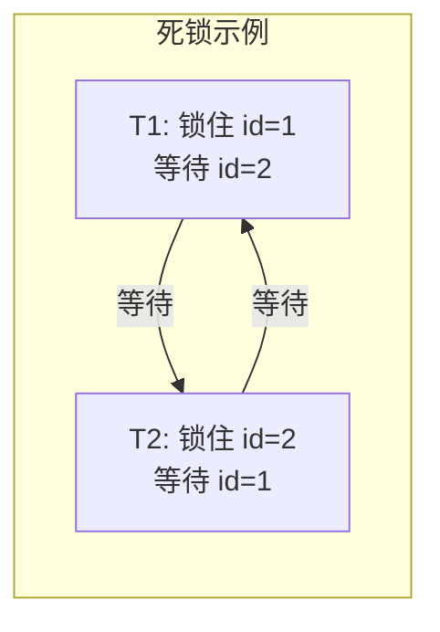

**经典死锁场景**：

| 时间 | 事务 A | 事务 B |
|------|--------|--------|
| t1 | `UPDATE t SET name='a' WHERE id=1;` ✅ 获取 id=1 的 X 锁 | |
| t2 | | `UPDATE t SET name='b' WHERE id=2;` ✅ 获取 id=2 的 X 锁 |
| t3 | `UPDATE t SET name='c' WHERE id=2;` ⏳ 等待 id=2 的 X 锁 | |
| t4 | | `UPDATE t SET name='d' WHERE id=1;` ⏳ 等待 id=1 的 X 锁 → **死锁！** |

### 5.2 InnoDB 死锁检测

InnoDB 默认开启死锁检测（`innodb_deadlock_detect = ON`）。

**检测方式**：等待图（Wait-For Graph）。事务节点 + 等待边，如果图中有环则存在死锁。

**处理方式**：InnoDB 自动选择一个**代价最小**的事务（通常是修改数据量最少的）进行回滚，释放其持有的所有锁。

```sql
-- 查看最近一次死锁信息
SHOW ENGINE INNODB STATUS;
-- 查看 LATEST DETECTED DEADLOCK 部分
```

### 5.3 死锁预防策略

| 策略 | 说明 |
|------|------|
| **固定加锁顺序** | 所有事务按 id 从小到大顺序更新，避免交叉等待 |
| **缩短事务长度** | 事务中避免耗时操作（RPC 调用、大查询），尽快提交 |
| **合理使用索引** | 确保更新走索引，避免行锁升级为表锁 |
| **降低隔离级别** | 业务允许时用 RC 替代 RR，减少 Gap Lock |
| **设置锁超时** | `innodb_lock_wait_timeout`（默认 50s），超时自动放弃 |

> **面试话术**：预防死锁最有效的手段是**固定加锁顺序**和**缩短事务**。如果线上频繁死锁，首先检查 SQL 是否走了索引、事务是否过长，必要时降低隔离级别到 RC。

---

## 六、事务日志：Redo Log 与 Undo Log

### 6.1 WAL 机制（Write-Ahead Logging）

InnoDB 的核心设计思想是 **先写日志，再写磁盘**（WAL）。

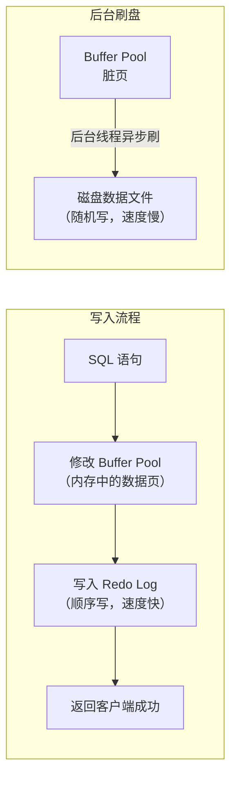

**为什么 WAL 更快**：

- Redo Log 是**顺序写**，追加到文件末尾，不需要寻道
- 数据文件是**随机写**，需要找到对应位置再修改
- 顺序写的性能远高于随机写（SSD 约 3-5 倍，HDD 约 10 倍以上）

### 6.2 Redo Log

**作用**：保证事务的**持久性**（Durability），崩溃恢复时重做已提交事务的修改。

**架构**：

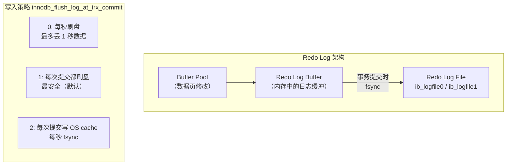

**关键参数**：

| `innodb_flush_log_at_trx_commit` | 安全性 | 性能 |
|----------------------------------|--------|------|
| **0**（每秒刷盘） | 低，可能丢 1s 数据 | 最高 |
| **1**（每次提交 fsync） | **最高，不丢数据** | 中（默认） |
| **2**（每次提交写 OS cache） | 中，OS 崩溃才丢 | 高 |

> **生产环境建议**：主库设为 **1**（安全优先），从库可以设为 2。

**Redo Log 是固定大小的循环写**：

```
write pos（当前写入位置）
    ↓
[###|###|   |   |   |   |   |   |   |###|###|###]
                                              ↑
                                         checkpoint（已刷盘的位置）
```

- write pos 到 checkpoint 之间的空闲空间可用于写入
- 当 write pos 追上 checkpoint 时，需要先推进 checkpoint（刷脏页）

### 6.3 Undo Log

**作用**：
1. 保证事务的**原子性**（回滚时恢复数据）
2. 为 **MVCC** 提供版本链

**Undo Log 类型**：

| 操作类型 | Undo Log 类型 | 内容 |
|---------|--------------|------|
| INSERT | **insert undo log** | 主键值，回滚时删除该行 |
| UPDATE/DELETE | **update undo log** | 修改前的整行数据，回滚时恢复 |

**Undo Log 的清理**：

- 当**所有活跃事务都不再需要**某个 undo log 版本时，由 purge 线程清理
- 如果存在长事务（运行很久未提交），undo log 会持续堆积，导致**表空间膨胀**
- 这也是为什么线上要**监控长事务**

```sql
-- 查看运行中的长事务
SELECT trx_id, trx_state, trx_started,
       TIMESTAMPDIFF(SECOND, trx_started, NOW()) AS duration_seconds
FROM information_schema.innodb_trx
ORDER BY trx_started;
```

### 6.4 Redo Log vs Undo Log 对比

| 维度 | Redo Log | Undo Log |
|------|----------|----------|
| **作用** | 保证持久性（崩溃恢复） | 保证原子性（回滚）+ MVCC |
| **记录内容** | 物理修改（页 X 偏移 Y 改为值 Z） | 逻辑修改（INSERT → DELETE, UPDATE → 反向 UPDATE） |
| **写入方式** | 顺序追加（循环写） | 随段分配，purge 线程清理 |
| **生命周期** | 写满后循环复用 | 事务提交后，等所有快照读不再需要时清理 |
| **存储位置** | `ib_logfile0/1` | 系统表空间 / undo 表空间 |

### 6.5 Binlog 与 Redo Log 的区别

| 维度 | Redo Log | Binlog |
|------|----------|--------|
| **归属** | InnoDB 引擎层 | MySQL Server 层 |
| **内容** | 物理日志（页的修改） | 逻辑日志（SQL 语句或行变更） |
| **写入方式** | 循环写，固定大小 | 追加写，文件写满切换新文件 |
| **用途** | 崩溃恢复 | 主从复制、数据备份 |
| **一致性** | 两阶段提交保证 Redo Log 和 Binlog 一致 |

**两阶段提交**（保证 Redo Log 和 Binlog 的一致性）：

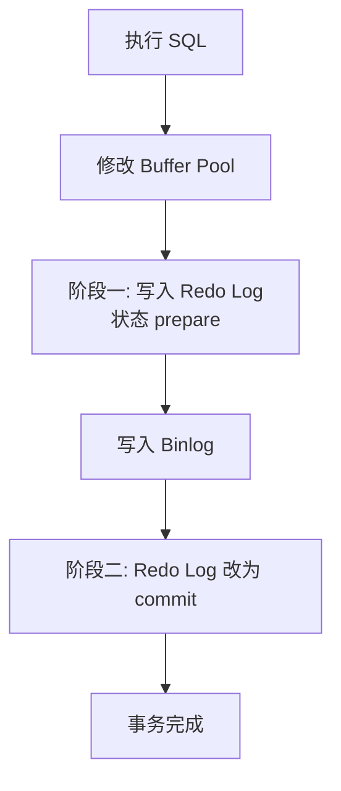

> 如果只在 Redo Log 和 Binlog 中写一个，另一个不写，会导致主从数据不一致。两阶段提交保证了两者的一致性。

---

## 📌 阶段三核心知识速查

| 知识点 | 核心要记住的 |
|--------|-------------|
| ACID 实现 | 原子性→Undo Log，持久性→Redo Log，隔离性→MVCC+锁 |
| MVCC 核心 | 隐藏字段 → Undo Log 版本链 → ReadView 可见性判断 |
| RC vs RR | RC 每次 SELECT 创建 ReadView，RR 复用第一次的 |
| Next-Key Lock | 默认加锁单位 = Record Lock + Gap Lock，RR 级别才有 |
| 死锁预防 | 固定加锁顺序 + 缩短事务 + 确保走索引 |
| WAL | 先写 Redo Log（顺序写），再刷数据页（随机写） |
| 两阶段提交 | Redo Log prepare → Binlog → Redo Log commit |

> **预告**：阶段四将讲解 **SQL 优化与执行计划（Explain）**，包括索引优化实战、SQL 调优方法论等。
