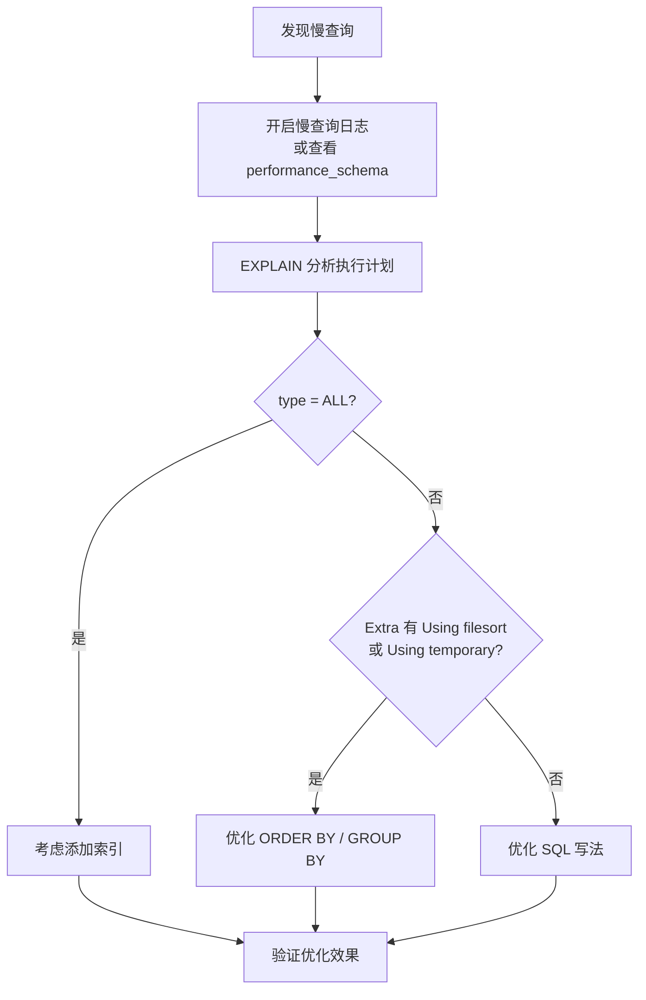
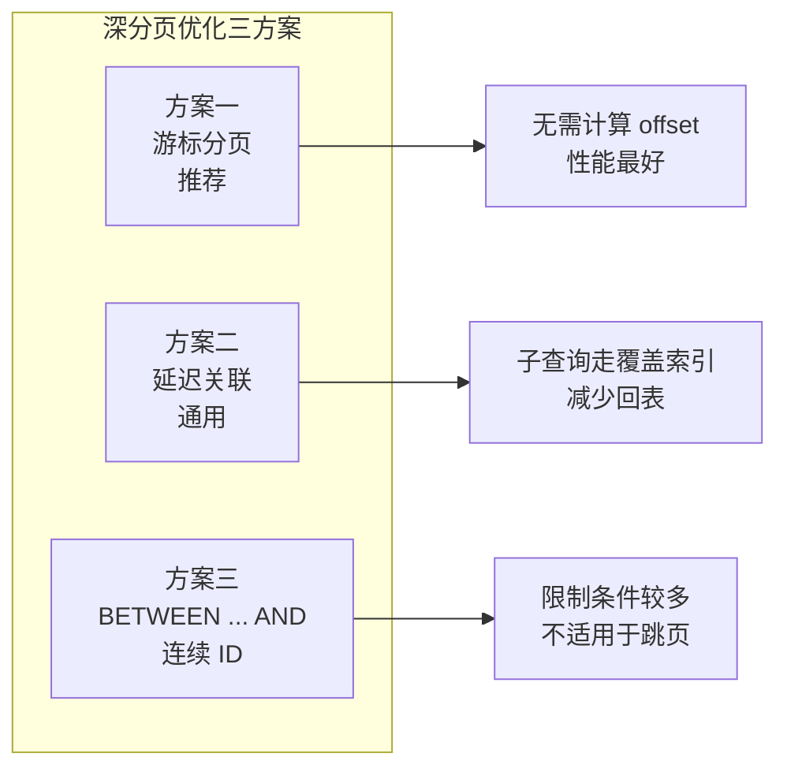
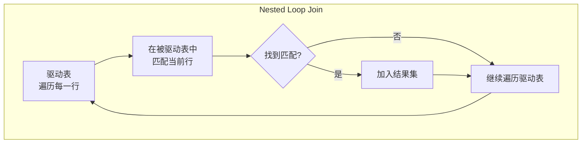
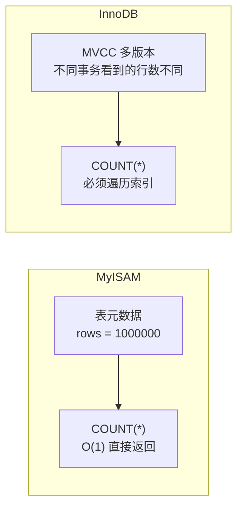
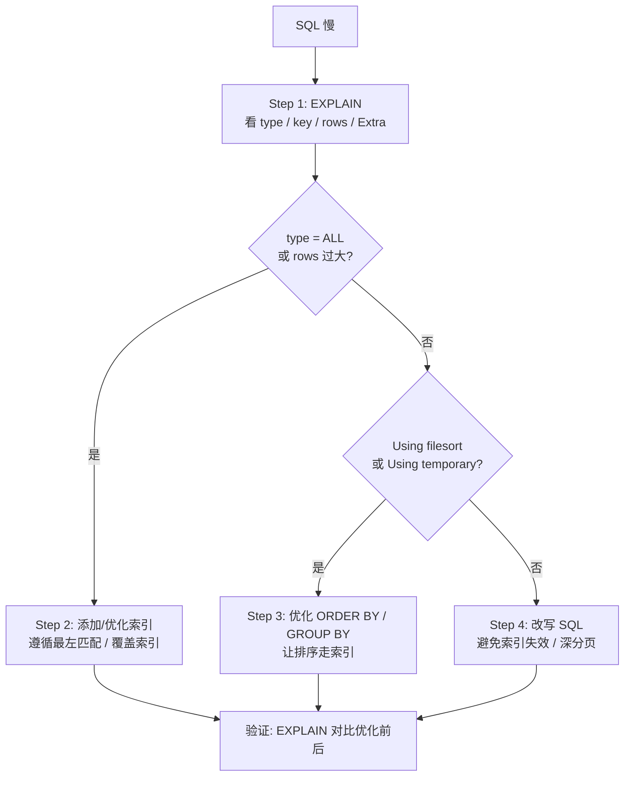

# MySQL 阶段四：SQL 优化实战

> **面试热度**：🔥🔥🔥🔥🔥（最高频，工作必备技能）
> **学习时长**：3-4 天
> **核心目标**：掌握 EXPLAIN 执行计划解读、索引失效场景识别与优化、深分页/JOIN/COUNT 等高频优化方案，形成系统的 SQL 调优方法论

---

## 📋 目录

1. [EXPLAIN 执行计划详解](#一-explain-执行计划详解)
2. [慢查询日志分析](#二-慢查询日志分析)
3. [索引失效场景与优化](#三-索引失效场景与优化)
4. [深分页优化](#四-深分页优化)
5. [JOIN 优化](#五-join-优化)
6. [子查询 vs JOIN](#六-子查询-vs-join)
7. [COUNT 优化](#七-count-优化)
8. [SQL 写法规范](#八-sql-写法规范)

---

## 一、EXPLAIN 执行计划详解

### 1.1 EXPLAIN 基本用法

```sql
EXPLAIN SELECT * FROM user WHERE age = 25 AND city = 'Beijing';
```

MySQL 8.0 还支持 `FORMAT=TREE` 和 `FORMAT=JSON` 获得更详细的执行计划：

```sql
-- 树形输出，更直观
EXPLAIN FORMAT=TREE SELECT * FROM user WHERE age = 25;

-- JSON 输出，含完整成本信息
EXPLAIN FORMAT=JSON SELECT * FROM user WHERE age = 25;
```

### 1.2 EXPLAIN 输出字段速查

| 字段 | 含义 | 面试重点 |
|------|------|---------|
| **id** | 查询序号，值越大越先执行 | 子查询/UNION 中判断执行顺序 |
| **select_type** | 查询类型 | SIMPLE / PRIMARY / SUBQUERY / DERIVED |
| **table** | 访问的表 | DERIVED 表示派生表 |
| **type** ⭐ | 访问类型 | **最核心字段**，从好到差排序见下表 |
| **possible_keys** | 可能使用的索引 | 显示候选索引，但未必真正使用 |
| **key** ⭐ | 实际使用的索引 | NULL 表示未走索引 |
| **key_len** | 索引使用的字节数 | 判断联合索引使用了几个字段 |
| **ref** | 索引查找的引用 | const / 字段名 |
| **rows** ⭐ | 预估扫描行数 | 越少越好 |
| **filtered** | 过滤比例 | 100 表示全匹配，越小越差 |
| **Extra** ⭐ | 额外信息 | Using index / Using filesort / Using temporary 等 |

### 1.3 type 字段：访问类型（从优到差）


| type | 含义 | 典型场景 |
|------|------|---------|
| **system** | 表中只有一行数据（const 的特例） | MyISAM 引擎的小表 |
| **const** | 通过主键或唯一索引精确匹配一行 | `WHERE id = 1` |
| **eq_ref** | JOIN 时被驱动表通过主键/唯一索引匹配 | `JOIN t2 ON t1.id = t2.id` |
| **ref** | 通过非唯一索引匹配，可能多行 | `WHERE name = 'Tom'`（name 有索引） |
| **range** | 索引范围扫描 | `WHERE age BETWEEN 20 AND 30` |
| **index** | 全索引扫描（比 ALL 好，但仍扫描全部索引） | `SELECT id FROM t`（id 是主键） |
| **ALL** | **全表扫描**（性能最差，必须优化） | 无索引条件的查询 |

> **面试话术**：type 字段是 EXPLAIN 中最核心的指标。一般来说，查询至少要达到 **range** 级别，最好达到 **ref** 级别。如果出现 ALL，就需要加索引或改写 SQL 了。

### 1.4 Extra 字段关键值

| Extra 值 | 含义 | 优化建议 |
|-----------|------|---------|
| **Using index** | 覆盖索引，无需回表 | 最理想状态 |
| **Using where** | 存储引擎返回数据后在 Server 层过滤 | 检查是否可以下推到引擎层 |
| **Using index condition** | 索引下推（ICP），5.6+ 优化 | 已优化，无需处理 |
| **Using temporary** | 使用临时表 | 需优化 GROUP BY / DISTINCT / UNION |
| **Using filesort** | 文件排序（非索引排序） | 需优化 ORDER BY |
| **Using join buffer** | JOIN 使用了缓冲区 | 被驱动表没有索引，需加索引 |
| **Impossible WHERE** | WHERE 条件不可能为真 | 检查业务逻辑 |

### 1.5 key_len 计算：判断联合索引使用情况

`key_len` 表示索引使用的字节数，通过它可以判断联合索引用了几个字段。

**计算规则**：

| 字段类型 | key_len 计算方式 |
|---------|----------------|
| INT | 4 字节 |
| BIGINT | 8 字节 |
| VARCHAR(N) utf8mb4 | N × 4 + 2（长度前缀）字节 |
| DATETIME | 8 字节 |
| 允许 NULL | 额外 +1 字节 |

**实战案例**：

```sql
-- 联合索引 idx_abc(a INT, b VARCHAR(20), c INT)
-- 条件 WHERE a = 1 AND b = 'hello'
-- a: 4字节, b: 20*4+2 = 82字节
-- key_len = 4 + 82 = 86，说明用了 a 和 b 两个字段
```

> **面试话术**：通过 key_len 可以精确判断联合索引用了几个字段。如果 key_len 只包含第一个字段的长度，说明后续字段没生效，需要排查原因（如范围查询导致中断）。

---

## 二、慢查询日志分析

### 2.1 慢查询日志配置

```sql
-- 查看慢查询日志状态
SHOW VARIABLES LIKE 'slow_query%';
SHOW VARIABLES LIKE 'long_query_time';

-- 开启慢查询日志
SET GLOBAL slow_query_log = ON;
SET GLOBAL long_query_time = 1;  -- 超过 1 秒记录
SET GLOBAL log_queries_not_using_indexes = ON;  -- 记录未走索引的查询
```

**配置文件方式**（my.cnf）：

```ini
[mysqld]
slow_query_log = 1
slow_query_log_file = /var/log/mysql/slow.log
long_query_time = 1
log_queries_not_using_indexes = 1
```

### 2.2 慢查询分析流程



### 2.3 mysqldumpslow 工具

```bash
# 按查询时间排序，显示前 10 条
mysqldumpslow -s t -t 10 /var/log/mysql/slow.log

# 按锁定时间排序
mysqldumpslow -s l -t 10 /var/log/mysql/slow.log

# 按返回记录数排序
mysqldumpslow -s r -t 10 /var/log/mysql/slow.log
```

**参数说明**：
- `-s t`：按查询时间排序
- `-s l`：按锁定时间排序
- `-s r`：按返回记录数排序
- `-s c`：按查询次数排序
- `-t N`：显示前 N 条
- `-g pattern`：匹配模式

### 2.4 performance_schema（MySQL 5.7+）

```sql
-- 查看最耗时的 SQL Top10
SELECT DIGEST_TEXT, COUNT_STAR,
       ROUND(SUM_TIMER_WAIT / 1000000000000, 2) AS total_sec,
       ROUND(AVG_TIMER_WAIT / 1000000000, 2) AS avg_ms
FROM performance_schema.events_statements_summary_by_digest
ORDER BY SUM_TIMER_WAIT DESC
LIMIT 10;
```

> **面试话术**：分析慢查询的步骤是：先通过慢查询日志或 performance_schema 定位慢 SQL，然后用 EXPLAIN 分析执行计划，重点关注 type、key、rows 和 Extra 字段，针对性优化。

---

## 三、索引失效场景与优化

### 3.1 索引失效全景图

```mermaid
flowchart LR
    subgraph 失效场景["索引失效六大场景"]
        A["1. 函数操作<br/>WHERE YEAR(create_time) = 2024"]
        B["2. 隐式转换<br/>VARCHAR 列用 INT 查"]
        C["3. LIKE 左模糊<br/>LIKE '%abc'"]
        D["4. OR 条件<br/>OR 连接无索引列"]
        E["5. 范围查询中断<br/>联合索引中范围字段后失效"]
        F["6. NOT IN / NOT EXISTS<br/>优化器可能放弃索引"]
    end
end
```

### 3.2 场景一：对索引列使用函数或运算

```sql
-- ❌ 失效：对 create_time 使用 YEAR() 函数
SELECT * FROM orders WHERE YEAR(create_time) = 2024;

-- ✅ 优化：改用范围查询
SELECT * FROM orders
WHERE create_time >= '2024-01-01' AND create_time < '2025-01-01';

-- ❌ 失效：对索引列做运算
SELECT * FROM goods WHERE price * 0.8 > 100;

-- ✅ 优化：调整表达式
SELECT * FROM goods WHERE price > 100 / 0.8;
```

**原理**：B+ 树是按照列的原始值排序的。对列做函数运算后，值变了，B+ 树的有序性被破坏，无法利用索引的二分查找。

### 3.3 场景二：隐式类型转换

```sql
-- phone 是 VARCHAR 类型，有索引
-- ❌ 失效：传入 INT，MySQL 会把 phone 转成数字比较
SELECT * FROM user WHERE phone = 13800138000;

-- ✅ 优化：传入字符串
SELECT * FROM user WHERE phone = '13800138000';
```

**原理**：MySQL 隐式转换规则是**将字符串转为数字**。当对索引列 `phone` 执行 `CAST(phone AS SIGNED)` 时，等同于对列使用了函数，索引失效。

**判断规则**：MySQL 会将**字符串类型**的列/值转换为**数值类型**再做比较。

```sql
-- 另一个例子：id 是 INT 类型
-- ✅ 正常：MySQL 把 '123' 转为 123，INT 列不需要函数转换
SELECT * FROM user WHERE id = '123';  -- 索引有效
```

### 3.4 场景三：LIKE 左模糊

```sql
-- ❌ 失效：左模糊
SELECT * FROM user WHERE name LIKE '%Tom';

-- ❌ 失效：双模糊
SELECT * FROM user WHERE name LIKE '%Tom%';

-- ✅ 有效：右模糊
SELECT * FROM user WHERE name LIKE 'Tom%';
```

**原理**：B+ 树按列值从左到右排序。左模糊意味着开头不确定，无法利用 B+ 树的有序性进行范围定位。

**优化方案**：
1. 全文索引（FULLTEXT）：适用于大文本搜索
2. Elasticsearch：业务量大的搜索场景
3. 存储反转字符串 + 右模糊：`REVERSE(name) LIKE 'moT%'`

### 3.5 场景四：OR 连接无索引列

```sql
-- 假设 a 有索引，b 没有索引
-- ❌ 失效：OR 导致全表扫描
SELECT * FROM t WHERE a = 1 OR b = 2;

-- ✅ 优化方案一：给 b 也加索引
ALTER TABLE t ADD INDEX idx_b(b);

-- ✅ 优化方案二：用 UNION ALL 替代
SELECT * FROM t WHERE a = 1
UNION ALL
SELECT * FROM t WHERE b = 2 AND a != 1;
```

**原理**：OR 条件中如果有一个列没有索引，MySQL 会认为全表扫描比走索引 + 回表再全表扫描更高效，直接选择全表扫描。

### 3.6 场景五：联合索引的范围查询中断

```sql
-- 联合索引 idx_abc(a, b, c)

-- ✅ 三个字段都能用上
SELECT * FROM t WHERE a = 1 AND b = 2 AND c = 3;

-- ⚠️ 只有 a 和 b 能用上，c 失效（b 是范围查询）
SELECT * FROM t WHERE a = 1 AND b > 2 AND c = 3;

-- ✅ 优化：调整索引顺序，将范围查询字段放最后
-- 创建索引 idx_acb(a, c, b)
SELECT * FROM t WHERE a = 1 AND b > 2 AND c = 3;  -- 三个字段都能用上
```

**设计原则**：联合索引中，**范围查询字段（>、<、BETWEEN、LIKE）放在最后**，避免中断后续字段。

### 3.7 场景六：NOT IN / NOT EXISTS / !=

```sql
-- ⚠️ NOT IN 可能不走索引
SELECT * FROM t WHERE status NOT IN (0, 1);

-- ✅ 优化：改用 IN（正向查询通常更易走索引）
SELECT * FROM t WHERE status IN (2, 3, 4);

-- ⚠️ != 也可能不走索引
SELECT * FROM t WHERE status != 0;

-- ✅ 优化：如果业务允许，改用 IN
SELECT * FROM t WHERE status IN (1, 2, 3);
```

**注意**：是否真正失效取决于**数据分布**。如果 NOT IN 过滤了大部分数据（返回少量行），优化器可能仍然选择索引。关键是看 EXPLAIN 的实际结果。

### 3.8 索引失效速查表

| 场景 | 失效 SQL 示例 | 优化方案 |
|------|--------------|---------|
| 函数操作 | `WHERE YEAR(time) = 2024` | 改范围查询 |
| 隐式转换 | `WHERE varchar_col = 123` | 传字符串 `'123'` |
| 左模糊 | `LIKE '%abc'` | 全文索引/ES/反转字符串 |
| OR 无索引列 | `WHERE a=1 OR b=2`（b 无索引） | 给 b 加索引 / UNION ALL |
| 范围中断 | `WHERE a=1 AND b>2 AND c=3` | 范围字段放索引末尾 |
| NOT IN/!= | `WHERE status != 0` | 改用 IN 正向查询 |

> **面试话术**：索引失效的核心原因是**破坏了 B+ 树的有序性**（函数、隐式转换、左模糊）或**优化器成本评估后放弃索引**（NOT IN、OR、数据分布）。判断索引是否失效的唯一标准是看 EXPLAIN，不要死记硬背。

---

## 四、深分页优化

### 4.1 深分页问题

```sql
-- LIMIT 1000000, 10：需要扫描 1000010 行，丢掉前 1000000 行
SELECT * FROM orders ORDER BY id LIMIT 1000000, 10;
```

**问题本质**：LIMIT offset, size 会**扫描 offset + size 行**再丢掉前 offset 行。offset 越大，无效扫描越多。

### 4.2 三种优化方案



#### 方案一：游标分页（推荐）

```sql
-- 第一页
SELECT * FROM orders WHERE id > 0 ORDER BY id LIMIT 10;
-- 假设返回最后一条 id = 100

-- 第二页
SELECT * FROM orders WHERE id > 100 ORDER BY id LIMIT 10;
```

**优点**：无论翻到第几页，性能都恒定。
**缺点**：不支持跳页（只能上一页/下一页），要求排序字段有索引且值连续。

#### 方案二：延迟关联

```sql
-- ❌ 原始：深分页，回表 1000010 次
SELECT * FROM orders ORDER BY create_time LIMIT 1000000, 10;

-- ✅ 优化：先通过子查询走覆盖索引拿到 id，再回表
SELECT * FROM orders
WHERE id IN (
    SELECT id FROM orders ORDER BY create_time LIMIT 1000000, 10
);
```

**原理**：子查询 `SELECT id FROM orders ORDER BY create_time` 只需扫描索引（覆盖索引），不需要回表。拿到 10 个 id 后再回主键索引查完整数据，回表次数从 1000010 次降到 10 次。

#### 方案三：BETWEEN ... AND

```sql
-- 前提：已知 id 范围
SELECT * FROM orders WHERE id BETWEEN 1000000 AND 1000010;
```

**优点**：走主键索引范围扫描，效率极高。
**缺点**：要求 id 连续且已知范围，不适用于排序字段非主键的场景。

### 4.3 方案对比

| 方案 | 性能 | 支持跳页 | 适用条件 |
|------|------|---------|---------|
| 游标分页 | ⭐⭐⭐⭐⭐ | ❌ | 排序字段有索引 |
| 延迟关联 | ⭐⭐⭐⭐ | ✅ | 排序字段有索引 |
| BETWEEN | ⭐⭐⭐⭐⭐ | ❌ | ID 连续且已知范围 |

> **面试话术**：深分页的根本原因是 LIMIT offset, size 会扫描 offset + size 行再丢掉前 offset 行。推荐用游标分页，不支持跳页的场景用延迟关联——先子查询走覆盖索引拿到 id，再回表取数据，将回表次数从 offset + size 降到 size。

---

## 五、JOIN 优化

### 5.1 Nested Loop Join 原理

MySQL 的 JOIN 本质是 **Nested Loop Join（嵌套循环连接）**：



**执行流程**：
1. 从驱动表中取一行数据
2. 在被驱动表中通过 JOIN 条件匹配
3. 匹配成功则加入结果集
4. 重复直到驱动表遍历完

**性能关键**：驱动表的行数 × 被驱动表的访问次数。被驱动表的 JOIN 字段有索引时，每次查找是 O(log N)，否则是 O(N)。

### 5.2 小表驱动大表

```sql
-- ✅ 小表驱动大表：dept 是小表（10 行），emp 是大表（10000 行）
SELECT * FROM dept d
STRAIGHT_JOIN emp e ON e.dept_id = d.id;

-- ❌ 大表驱动小表：emp 驱动 dept，循环 10000 次
-- 即使 dept.dept_id 有索引，也需要 10000 次索引查找
```

**原理**：

| 驱动方式 | 外层循环次数 | 内层查找方式 | 总成本 |
|---------|------------|------------|-------|
| 小表驱动大表 | 小表行数（少） | 大表走索引 | 低 |
| 大表驱动小表 | 大表行数（多） | 小表走索引 | 较高 |

**判断"小表"的标准**：不是表的总行数，而是**经过 WHERE 过滤后的行数**。

### 5.3 JOIN 优化要点

| 优化点 | 说明 |
|--------|------|
| 被驱动表 JOIN 字段加索引 | 最关键的优化 |
| 小表驱动大表 | 减少外层循环次数 |
| 避免过多表 JOIN | 建议不超过 3 张表 |
| 用 STRAIGHT_JOIN 控制驱动顺序 | 强制 MySQL 按指定顺序 JOIN |
| 用 INNER JOIN 替代 LEFT JOIN（如可能） | 优化器有更多选择空间 |

### 5.4 Block Nested Loop Join（BNL）

当被驱动表 JOIN 字段没有索引时，MySQL 使用 BNL 算法：

```
1. 将驱动表的结果集加载到 join_buffer
2. 扫描被驱动表，每行与 join_buffer 中的数据做匹配
3. 匹配成功则加入结果集
```

**BNL 的问题**：
- 被驱动表做全表扫描
- join_buffer 放不下时需要分段，增加扫描次数

**优化**：给被驱动表的 JOIN 字段加索引，让 BNL 退化为高效的 Index Nested Loop Join。

> **面试话术**：JOIN 优化的核心两条——一是**被驱动表的 JOIN 字段必须有索引**，二是**小表驱动大表**减少外层循环次数。MySQL 8.0 引入了 hash join 优化无索引场景的 JOIN 性能。

---

## 六、子查询 vs JOIN

### 6.1 子查询类型

```sql
-- 标量子查询：返回一行一列
SELECT * FROM emp WHERE salary = (SELECT MAX(salary) FROM emp);

-- 列子查询：返回一列多行
SELECT * FROM emp WHERE dept_id IN (SELECT id FROM dept WHERE name = 'IT');

-- 相关子查询：引用外层查询的列
SELECT * FROM emp e
WHERE salary > (SELECT AVG(salary) FROM emp WHERE dept_id = e.dept_id);
```

### 6.2 子查询 vs JOIN 性能对比

```sql
-- 子查询
SELECT * FROM orders
WHERE user_id IN (SELECT id FROM user WHERE status = 1);

-- 等价 JOIN
SELECT o.* FROM orders o
INNER JOIN user u ON o.user_id = u.id
WHERE u.status = 1;
```

| 维度 | 子查询 | JOIN |
|------|--------|------|
| 可读性 | 高（逻辑清晰） | 中（需要理解 JOIN 语义） |
| 优化器改写 | MySQL 5.6+ 会自动将 IN 子查询改写为半连接 | 直接执行 |
| 执行计划 | 可能被优化为半连接（Semi-Join） | 标准 Nested Loop Join |
| 灵活性 | 相关子查询无法改写为 JOIN | 非相关子查询可以改写 |

**结论**：MySQL 5.6+ 的优化器已经能将大部分 IN 子查询**自动改写为半连接（Semi-Join）**，性能与 JOIN 相当。不必强行将子查询改写为 JOIN，**可读性优先**。

> **面试话术**：MySQL 5.6+ 引入了 Semi-Join 优化，会将 IN 子查询自动改写为半连接，性能与 JOIN 基本一致。所以在 MySQL 5.6+ 中，子查询和 JOIN 的选择主要看可读性，不用为了性能强行改写。但 EXISTS 和相关子查询的性能仍然需要关注。

---

## 七、COUNT 优化

### 7.1 COUNT 用法对比

```sql
-- COUNT(*)：统计总行数（推荐）
SELECT COUNT(*) FROM user;

-- COUNT(1)：等价于 COUNT(*)（推荐）
SELECT COUNT(1) FROM user;

-- COUNT(列)：统计该列非 NULL 的行数
SELECT COUNT(email) FROM user;

-- COUNT(DISTINCT 列)：统计该列不同值的数量
SELECT COUNT(DISTINCT dept_id) FROM user;
```

| 用法 | 含义 | 是否统计 NULL | 性能 |
|------|------|--------------|------|
| COUNT(*) | 总行数 | ✅ 统计 | 最优 |
| COUNT(1) | 总行数 | ✅ 统计 | 最优（等同 COUNT(*)） |
| COUNT(列) | 该列非 NULL 行数 | ❌ 跳过 NULL | 稍差（需判断 NULL） |

### 7.2 InnoDB 为什么没有精确行数

**MyISAM**：表级元数据存储了精确行数，`COUNT(*)` 直接返回，O(1)。

**InnoDB**：由于 MVCC 的存在，**不同事务在同一时刻看到的行数可能不同**（有些行对当前事务不可见）。因此 InnoDB 必须遍历索引才能得到当前事务视角下的准确行数。



### 7.3 COUNT 优化方案

```sql
-- 1. 用最小的二级索引（而非主键索引）
-- InnoDB 会自动选择最小的索引来遍历
SELECT COUNT(*) FROM user;  -- 优化器选择最小的二级索引

-- 2. 用缓存近似值（允许不精确的场景）
-- Redis 维护计数器
INCR user_count  -- 插入时 +1
DECR user_count  -- 删除时 -1
GET user_count   -- O(1) 获取近似值

-- 3. 用汇总表
-- 定时统计写入汇总表
INSERT INTO stat_table (table_name, row_count, stat_time)
VALUES ('user', (SELECT COUNT(*) FROM user), NOW());

-- 4. SHOW TABLE STATUS（近似值，不精确）
SHOW TABLE STATUS LIKE 'user';  -- Rows 字段是估算值
```

> **面试话术**：InnoDB 的 COUNT(*) 需要遍历索引而非直接返回，是因为 MVCC 机制下不同事务看到的行数可能不同。优化方案包括：InnoDB 自动选最小的索引遍历、用 Redis 维护近似计数、使用汇总表。允许不精确时用 SHOW TABLE STATUS。

---

## 八、SQL 写法规范

### 8.1 核心规范

| 规范 | 说明 | 原因 |
|------|------|------|
| 避免 SELECT * | 只查需要的列 | 减少网络传输、可能触发覆盖索引 |
| 慎用 UNION | 优先 UNION ALL | UNION 会去重排序，UNION ALL 不去重 |
| 合理使用 LIMIT | 大结果集加 LIMIT | 防止意外返回大量数据 |
| 小事务 | 避免长事务 | 减少锁持有时间，避免阻塞 |
| 批量操作 | 用批量 INSERT/UPDATE | 减少事务次数和网络往返 |
| LIMIT 1 | 确定只有一条时加 LIMIT 1 | 找到即停，无需继续扫描 |

### 8.2 批量操作示例

```sql
-- ❌ 逐条 INSERT
INSERT INTO user (name, age) VALUES ('A', 20);
INSERT INTO user (name, age) VALUES ('B', 21);
INSERT INTO user (name, age) VALUES ('C', 22);

-- ✅ 批量 INSERT
INSERT INTO user (name, age) VALUES ('A', 20), ('B', 21), ('C', 22);
```

### 8.3 事务优化

```sql
-- ❌ 长事务：包含不必要的查询
START TRANSACTION;
SELECT * FROM goods WHERE id = 1;      -- 查询不需要在事务内
UPDATE goods SET stock = stock - 1 WHERE id = 1;
INSERT INTO orders (...) VALUES (...);
COMMIT;

-- ✅ 短事务：只包含必要的写操作
START TRANSACTION;
UPDATE goods SET stock = stock - 1 WHERE id = 1;
INSERT INTO orders (...) VALUES (...);
COMMIT;
```

> **面试话术**：SQL 优化的核心思想是**减少扫描量**（走索引、减少回表）和**减少资源占用**（小事务、批量操作、避免 SELECT *）。优化前先用 EXPLAIN 分析，优化后用 EXPLAIN 验证，避免盲猜。

---

## 📌 SQL 优化方法论总结



**核心原则**：
1. **先定位，后优化**：EXPLAIN 是起点，不是猜测
2. **索引优先**：大部分慢 SQL 通过加索引就能解决
3. **改写辅助**：索引解决不了的再考虑 SQL 改写
4. **验证闭环**：优化前后都要 EXPLAIN，确认有效
