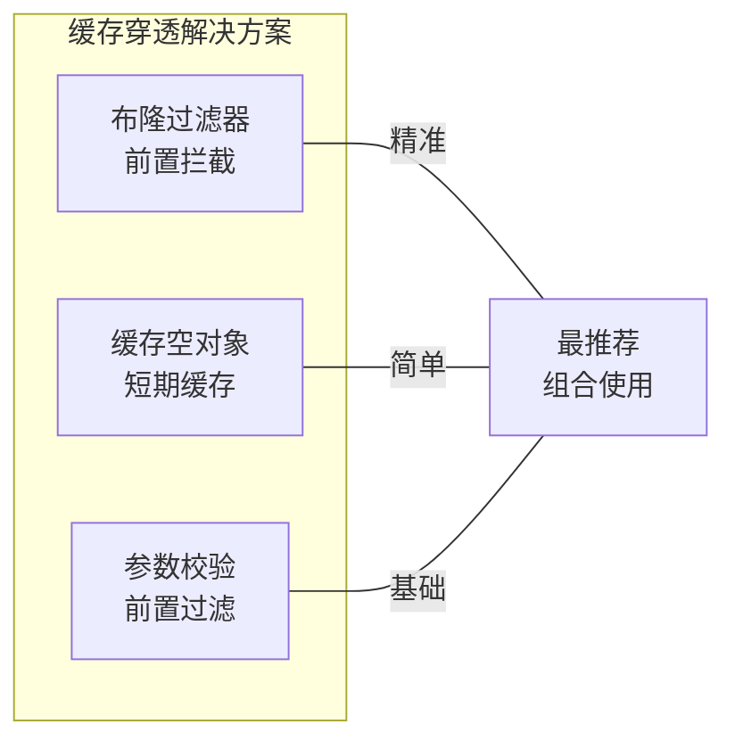
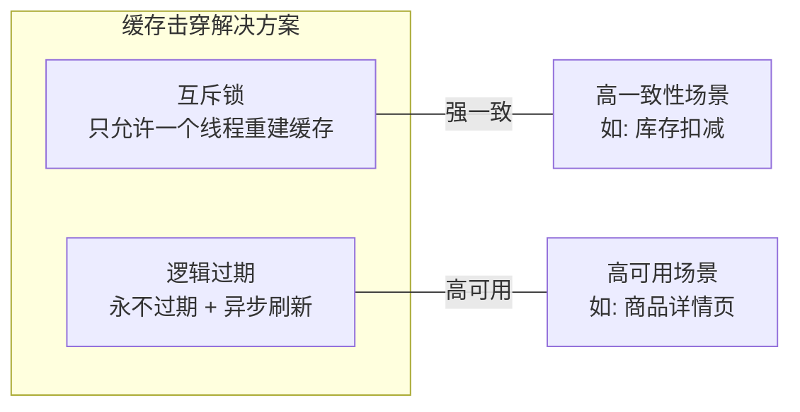
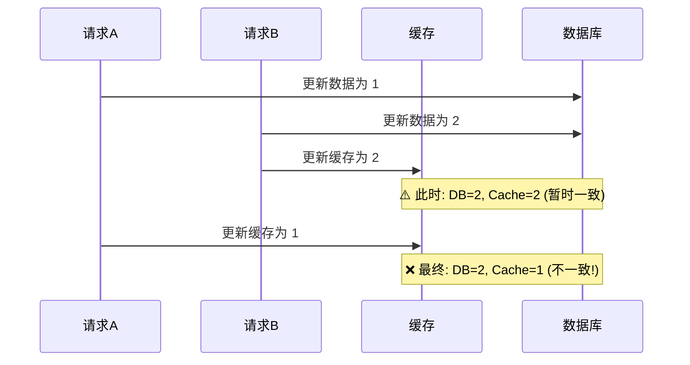
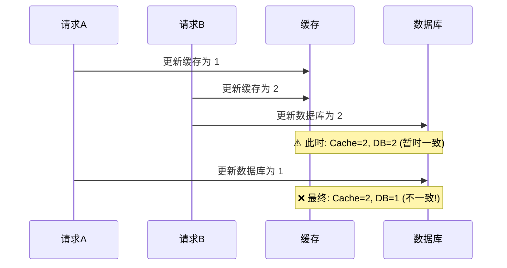
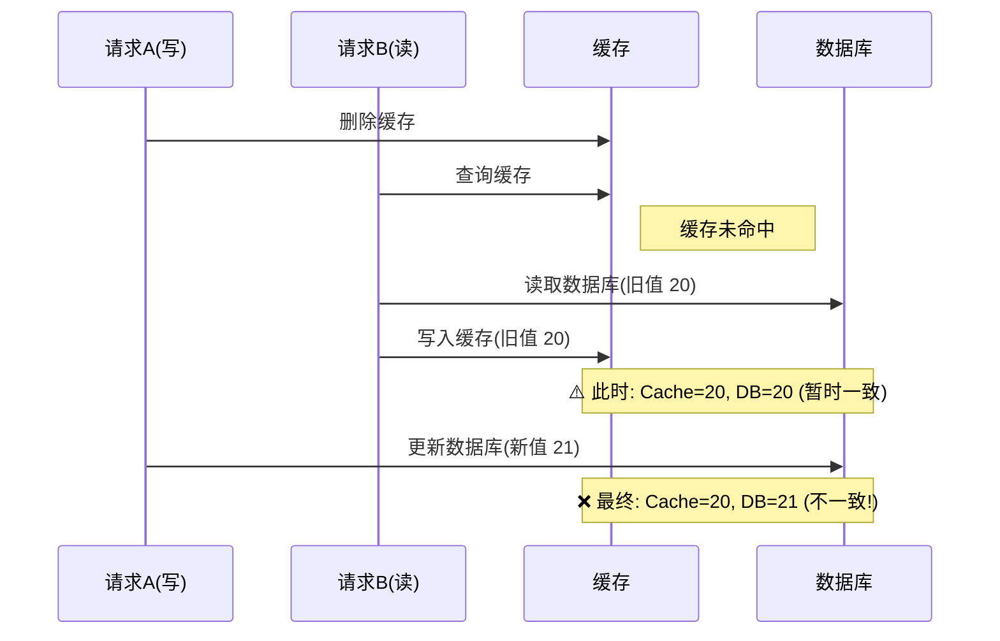
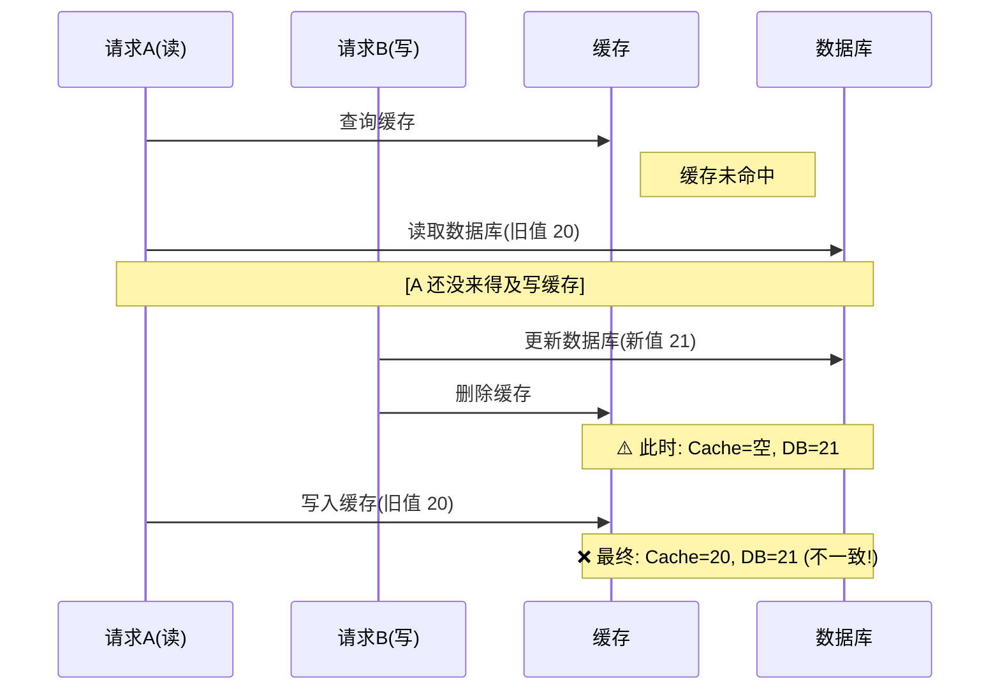
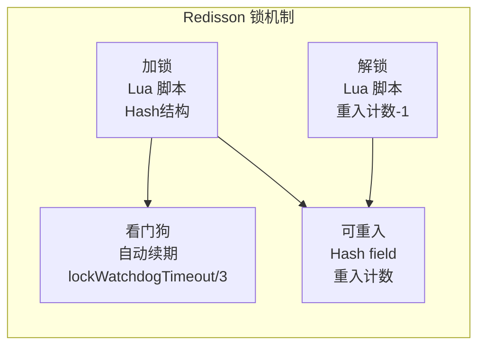
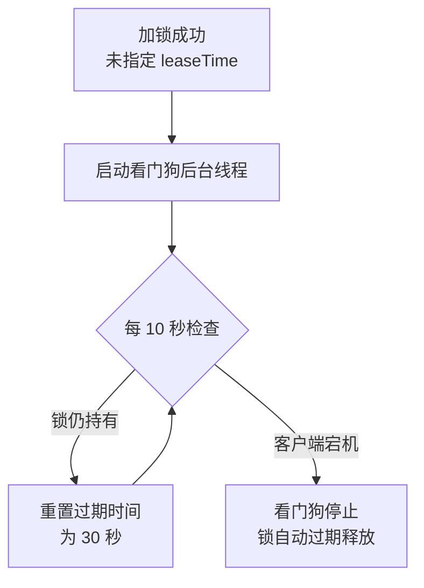

# Redis 缓存实战与应用场景

> 练习: [Redis 缓存实战与应用场景练习](./Redis-cache-practice-exercises.md)
>
> 面试: [Redis 缓存实战与应用场景面试](./Redis-cache-practice-interview.md)

## 一、缓存实战全景图

```
                          Redis 缓存实战
                                │
              ┌─────────────────┼─────────────────┐
              │                 │                 │
         缓存三大问题        双写一致性        分布式锁
              │                 │                 │
     ┌────────┼────────┐        │           ┌─────┴─────┐
     │        │        │        │           │           │
    穿透      击穿     雪崩  Cache Aside   原子锁       Redisson
     │        │        │        │           │           │
    布隆     互斥锁     随机    延迟双删     SETNX+EX     看门狗
   过滤器     + 续期    TTL     + Canal     + Lua        + 可重入
```

---

## 二、缓存穿透（⭐ 最高频）

### 2.1 什么是缓存穿透

**定义**：客户端请求的数据**在缓存和数据库中都不存在**，每次请求都会穿透缓存直接打到数据库。

```
客户端 → 缓存(未命中) → 数据库(未命中) → 返回空
                                    ↑
                            恶意攻击者反复请求不存在的 ID
                            如: /api/user?id=-1
```

**危害**：如果用脚本大量请求不存在的 key，数据库会被压垮。

### 2.2 解决方案



**方案一：布隆过滤器（推荐）**

在缓存前加一层布隆过滤器，查询前先判断 key 是否可能存在：

```
请求 → 布隆过滤器 → 不存在 → 直接返回（拦截）
                  → 可能存在 → 查缓存 → 查数据库
```

布隆过滤器特点：

- 空间效率极高（10 亿数据只需约 1.2GB）
- 存在**误判率**（可能误报存在，但不会漏报）
- 不支持删除（可用 Counting Bloom Filter）

```java
// Guava 布隆过滤器示例
BloomFilter<Long> bloomFilter = BloomFilter.create(
    Funnels.longFunnel(), 10000000, 0.01  // 1000万条，误判率 1%
);

// 写入数据库时同时加入
bloomFilter.put(userId);

// 查询前先判断
if (!bloomFilter.mightContain(userId)) {
    return null;  // 一定不存在，直接返回
}
```

**方案二：缓存空对象（简单但有效）**

数据库查不到时，也往缓存写入一个空值（null），设置短过期时间：

```
查询缓存未命中 → 查数据库未命中 → 缓存空对象（TTL=60s）
下次请求 → 缓存命中（空值） → 直接返回
```

```java
String value = redis.get(key);
if (value == null) {
    value = db.query(key);
    if (value == null) {
        // 缓存空对象，短过期时间
        redis.setex(key, 60, "");
    } else {
        redis.setex(key, 300, value);
    }
}
return value;
```

**方案三：参数校验（基础防御）**

在入口层对请求参数做基本校验（如 ID 必须为正整数），拦截明显的非法请求。

### 2.3 方案对比

| 方案       | 优点                   | 缺点                         | 适用场景                 |
| ---------- | ---------------------- | ---------------------------- | ------------------------ |
| 布隆过滤器 | 精准拦截、不存无效数据 | 有误判率、不支持删除         | 已知数据集合、读多写少   |
| 缓存空对象 | 实现简单               | 占用缓存空间、可能被恶意占满 | 请求模式随机、数据量不大 |
| 参数校验   | 零成本                 | 只能拦截明显非法请求         | 所有场景的基础防护       |

---

## 三、缓存击穿（⭐ 最高频）

### 3.1 什么是缓存击穿

**定义**：一个**热点 Key**（被大量请求访问）在某一个时刻**过期失效**，大量并发请求同时穿透到数据库。

```
热点 Key 过期瞬间:
请求1 → 缓存(过期) → 查数据库(重建缓存)
请求2 → 缓存(过期) → 查数据库(并发打到DB!)
请求3 → 缓存(过期) → 查数据库(并发打到DB!)
...
请求N → 缓存(过期) → 查数据库(数据库被压垮)
```

**与穿透的区别**：击穿是热点 Key 过期，穿透是 key 本身不存在。

### 3.2 解决方案



**方案一：互斥锁（推荐）**

使用分布式锁保证同一时刻只有一个线程去重建缓存：

```java
String value = redis.get(key);
if (value == null) {
    // 尝试获取锁
    boolean locked = redis.setnx(lockKey, "1", 10, TimeUnit.SECONDS);
    if (locked) {
        try {
            // 双重检查，防止排队线程重复查库
            value = redis.get(key);
            if (value == null) {
                value = db.query(key);
                redis.setex(key, 300, value);
            }
        } finally {
            redis.del(lockKey);
        }
    } else {
        // 获取锁失败，短暂休眠后重试
        Thread.sleep(50);
        return getWithCache(key);  // 递归重试
    }
}
return value;
```

**方案二：逻辑过期（永不过期 + 异步刷新）**

物理上不过期，或者设置一个足够长的TTL（比如24小时，过期了重建），在 value 中存储逻辑过期时间，过期后异步更新：

```java
// 缓存结构
CacheData {
    Object data;        // 实际数据
    long expireTime;    // 逻辑过期时间
}

// 查询逻辑
CacheData cacheData = redis.get(key);
if (cacheData == null) {
    // 缓存从未设置（冷启动），同步加载
    cacheData = loadAndCache(key);
} else if (cacheData.expireTime < System.currentTimeMillis()) {
    // 尝试获取"刷新锁"（TTL 短一点，防死锁），刷新通常可以在毫秒级完成，3s 足够
    boolean locked = redis.setnx("lock:refresh:" + key, "1", 3, TimeUnit.SECONDS);
    if (locked) {
        // 只有抢到锁的线程才提交异步刷新，但同时也返回旧数据，不等待
        executor.submit(() -> {
            try {
                refreshCache(key);
            } finally {
                // 有异常也需要释放锁
                redis.del("lock:refresh:" + key);
            }
        });
    }
    // 没抢到锁的也返回旧数据（不阻塞）
    return cacheData.data;
}
return cacheData.data;
```

- 请求未命中缓存，说明缓存未遇热，这时候最好同步构建缓存
- 请求命中缓存，并且缓存未逻辑过期，直接返回
- 请求命中缓存，并且缓存已逻辑过期
  - 获取锁成功，异步重建缓存，并返回旧值（不阻塞）
  - 获取锁失败，返回旧值（让获取锁成功的线程去触发缓存重建任务）

### 3.3 方案对比

| 维度     | 互斥锁                   | 逻辑过期                 |
| -------- | ------------------------ | ------------------------ |
| 一致性   | 强一致（等新数据）       | 最终一致（返回旧数据）   |
| 可用性   | 获取锁失败时等待         | 始终返回数据（即使旧的） |
| 性能     | 部分请求阻塞             | 所有请求快速响应         |
| 适用场景 | 库存、金额等强一致性场景 | 商品详情、文章等读多场景 |

---

## 四、缓存雪崩（⭐ 最高频）

### 4.1 什么是缓存雪崩

**定义**：大量 Key 在**同一时间集体过期**，或者 **Redis 缓存服务整体宕机**，导致大量请求同时打到数据库。

```
正常: 10000 QPS → Redis 9000 + DB 1000
雪崩: 10000 QPS → Redis 0 + DB 10000  ← 数据库崩溃
```

**两种类型**：

1. **大量 Key 同时过期** — 缓存重建集中爆发
2. **Redis 宕机** — 缓存层整体不可用

### 4.2 解决方案

| 方案               | 说明                                       | 适用场景          |
| ------------------ | ------------------------------------------ | ----------------- |
| **过期时间随机化** | TTL 加随机值（如 300 + random(0,60)）      | 预防 Key 集体过期 |
| **多级缓存**       | 本地缓存（Caffeine/Guava）+ Redis 二级缓存 | Redis 宕机兜底    |
| **高可用**         | 哨兵/Cluster 保证 Redis 自身高可用         | Redis 宕机兜底    |
| **熔断降级**       | Hystrix/Sentinel 在 DB 压力过大时降级      | 最终兜底          |
| **缓存预热**       | 系统启动时主动加载热点数据到缓存           | 预防冷启动        |

**过期时间随机化示例**：

```java
// 基础 TTL 5 分钟 + 随机 0-60 秒
int ttl = 300 + ThreadLocalRandom.current().nextInt(60);
redis.setex(key, ttl, value);
```

### 4.3 缓存三大问题对比

| 维度     | 穿透                    | 击穿              | 雪崩                           |
| -------- | ----------------------- | ----------------- | ------------------------------ |
| 本质     | 查不存在的数据          | 热点 Key 过期     | 大量 Key 同时过期/Redis 宕机   |
| 影响范围 | 单个不存在的 key        | 单个热点 key      | 大量 key 或整体                |
| 核心方案 | 布隆过滤器 + 缓存空对象 | 互斥锁 / 逻辑过期 | TTL 随机化 + 多级缓存 + 高可用 |

---

## 五、缓存与数据库双写一致性（⭐ 最高频）

### 5.1 Cache Aside 模式（最常用）

**旁路缓存模式**：业务代码直接操作缓存和数据库，而非通过缓存系统自动同步。

```
读流程:  先查缓存 → 未命中 → 查数据库 → 写入缓存 → 返回
写流程:  先更新数据库 → 再删除缓存
```

**为什么写流程是"删除缓存"而不是"更新缓存"？**

| 策略             | 优点                                   | 缺点                                                                                                                           |
| ---------------- | -------------------------------------- | ------------------------------------------------------------------------------------------------------------------------------ |
| 更新缓存         | 每次都是最新值                         | 如果这个 key 是需要进行一定的运算组装的，那么频繁更新会造成性能浪费；<br/>并发写操作时容易被其他线程覆盖更新缓存造成数据不一致 |
| 删除缓存（推荐） | 懒加载，下次读时再重建；减少无效写操作 | 短暂不一致窗口                                                                                                                 |

### 5.2 为什么更新缓存的方案会造成数据不一致

**方案一：先更新数据库，再更新缓存**



**问题分析**：两个线程并发执行时，后提交的缓存更新会覆盖先提交的新值。上图中线程 A 虽然先更新了数据库（旧值 1），但最后才更新缓存，把线程 B 已经写入的正确值（2）覆盖成了旧值（1）。

**方案二：先更新缓存，再更新数据库**



**问题分析**：同样存在覆盖问题。线程 B 先完成全部操作（Cache=2, DB=2），但线程 A 随后将数据库更新为旧值（1），导致缓存和数据库不一致。

**核心原因**：两种"更新缓存"的方案都无法保证**数据库和缓存的原子性操作**，在并发场景下无法精准控制线程的执行顺序

### 5.3 为什么更推荐删除缓存的方案

**方案一：先删除缓存，再更新数据库**



**问题分析**：请求 A 先删除了缓存，但还没来得及更新数据库。此时请求 B 来读数据，发现缓存 miss，就去读数据库拿到旧值（20），并回填到缓存。之后请求 A 才把数据库更新为新值（21），导致缓存是旧值、数据库是新值。

**方案二：先更新数据库，再删除缓存（业界标准，概率极低的不一致）**



**先更新 DB 后删缓存也可能不一致**（极端并发场景）：

```
线程A（读）: 查缓存 miss → 查 DB 旧值 → [线程A 还没写缓存]
线程B（写）: 更新 DB 新值 → 删除缓存 → [此时缓存是空的]
线程A（续）: 写入缓存旧值 → 不一致!
```

但这种场景发生概率极低（**需要读 DB 慢于一次写操作**），所以**先更新 DB 后删缓存**是业界标准做法。

### 5.4 延迟双删策略

为了进一步降低不一致窗口，使用延迟双删：

```java
public void update(String key, Object value) {
    // 1. 先删除缓存
    redis.del(key);
    // 2. 更新数据库
    db.update(key, value);
    // 3. 延迟再删除一次（防止并发读写入旧值）
    executor.schedule(() -> redis.del(key), 500, TimeUnit.MILLISECONDS);
}
```

**延迟时间估算**：大于一次读操作的总耗时（读 DB + 写缓存），通常 200ms-500ms。

> 其中第二次删除可以有多种变形，线程池延时任务、消息队列延时消息，都会有第二次删除失败的概率，进一步的做法是引入一系列的补偿重试，同时这会给功能带来极大的复杂性。当然可以设置一个短的缓存过期时间，允许这个时间窗口内确实存在一个极低的数据不一致的情况

### 5.4 Canal 监听 Binlog（最终一致性）

通过 Canal 监听 MySQL Binlog，数据变更后异步更新/删除缓存：

```
DB 写入 → Binlog → Canal 解析 → 异步删除缓存
```

优点：对业务代码零侵入，解耦缓存维护逻辑。适用于对一致性要求不是极致严格的场景。

### 5.5 双写一致性方案对比

| 方案                                      | 一致性                         | 复杂度 | 侵入性 | 适用场景         |
| ----------------------------------------- | ------------------------------ | ------ | ------ | ---------------- |
| Cache Aside + 先更新DB后删缓存 + 延迟双删 | 最终一致（极端情况可能不一致） | 低     | 低     | 大多数场景       |
| Canal 监听 Binlog                         | 最终一致（异步）               | 中     | 零侵入 | 大型系统         |
| 读写锁（强一致）                          | 强一致                         | 高     | 中     | 金融等强一致场景 |

---

## 六、分布式锁（⭐ 最高频）

### 6.1 为什么需要分布式锁

在分布式系统中，多个服务实例可能同时操作同一资源，单机的 `synchronized` 或 `ReentrantLock` 无法跨 JVM 生效。

```
服务实例 A ──┐
服务实例 B ──┼──→ Redis（分布式锁）──→ 共享资源
服务实例 C ──┘
```

### 6.2 基本实现：SET NX + EX

**加锁**：多角度保证锁安全

```
SET lock_key unique_value NX EX 10
```

- **NX**：只有 key 不存在时才设置（互斥性）
- **EX 10**：10 秒后自动过期（防死锁）
- **unique_value**：唯一标识（防误删）

**解锁**：使用 Lua 脚本保证"判断 + 删除"的原子性：

```lua
-- 只有 value 匹配时才删除（防误删别人的锁）
if redis.call("get", KEYS[1]) == ARGV[1] then
    return redis.call("del", KEYS[1])
else
    return 0
end
```

> 判断的目的是防止释放其他线程加的锁，防范的手段可以使用生成唯一值作为缓存值，并且在释放时做一次判断

### 6.3 完整实现

```java
public class RedisDistributedLock {
    private final StringRedisTemplate redis;
    private static final String UNLOCK_SCRIPT =
        "if redis.call('get', KEYS[1]) == ARGV[1] " +
        "then return redis.call('del', KEYS[1]) " +
        "else return 0 end";

    // 加锁
    public boolean tryLock(String lockKey, String requestId, long expireSeconds) {
        Boolean result = redis.opsForValue()
            .setIfAbsent(lockKey, requestId, expireSeconds, TimeUnit.SECONDS);
        return Boolean.TRUE.equals(result);
    }

    // 解锁（Lua 脚本保证原子性）
    public boolean unlock(String lockKey, String requestId) {
        Long result = redis.execute(
            new DefaultRedisScript<>(UNLOCK_SCRIPT, Long.class),
            Collections.singletonList(lockKey), requestId
        );
        return result != null && result > 0;
    }
}
```

### 6.4 存在的问题

| 问题         | 说明                               | 解决方案                        |
| ------------ | ---------------------------------- | ------------------------------- |
| **锁过期自动释放**   | 业务没执行完，锁自动过期了         | 看门狗自动续期（Redisson）      |
| **不可重入**     | 同一线程不能多次获取同一把锁       | 加重入计数（Redisson）          |
| **单点故障**     | Redis 单节点宕机，锁信息丢失       | RedLock（多节点）或哨兵/Cluster |
| 集群主从切换 | 主节点加锁后宕机，锁未同步到从节点 | RedLock                         |

> **面试重点**：手写 SET NX + EX 的基本实现是基础，但要指出它的缺陷并引出 Redisson。

---

## 七、Redisson 分布式锁原理（⭐ 高频）

### 7.1 Redisson 简介

Redisson 是 Redis 的 Java 客户端，提供了丰富的分布式对象和服务，其中分布式锁是最常用的功能。

```java
RLock lock = redisson.getLock("orderLock");
lock.lock();  // 加锁（自动续期）
try {
    // 业务逻辑
} finally {
    lock.unlock();  // 解锁
}
```

### 7.2 核心机制



**加锁 Lua 脚本**（简化版）：

```lua
-- 加锁：使用 Hash 结构，field 为 clientId + threadId
if redis.call("exists", KEYS[1]) == 0 then   -- 锁不存在
    redis.call("hset", KEYS[1], ARGV[2], 1)  -- 设置 hash field = 1
    redis.call("pexpire", KEYS[1], ARGV[1])   -- 设置过期时间
    return nil
end
if redis.call("hexists", KEYS[1], ARGV[2]) == 1 then  -- 可重入
    redis.call("hincrby", KEYS[1], ARGV[2], 1)         -- 计数 +1
    redis.call("pexpire", KEYS[1], ARGV[1])
    return nil
end
return redis.call("pttl", KEYS[1])  -- 锁被别人持有，返回剩余时间
```

**数据结构**：

保证锁的唯一和可重入的特性

```
lock_key: {
    "clientId:threadId": 3    // 重入计数
}
```

### 7.3 看门狗机制（⭐ 重点）

**问题**：如果业务执行时间超过锁的过期时间，锁自动释放，其他线程可以获取锁，导致并发问题。

**解决**：看门狗（Watchdog）后台线程定期续期。

```
加锁时未指定 leaseTime → 启动看门狗
看门狗每 lockWatchdogTimeout/3 秒（默认 10 秒）检查一次
如果锁仍被持有 → 重新设置过期时间为 lockWatchdogTimeout（默认 30 秒）
客户端宕机 → 看门狗停止续期 → 锁自动过期释放
```



> **注意**：指定了 leaseTime（如 `tryLock(5, 30, TimeUnit.SECONDS)`）则**不会启动看门狗**，锁在 30 秒后一定会释放。

> 如果 Redis 主节点宕机、锁信息丢在旧主上，看门狗续期也无意义，这时候才需要 RedLock（但 RedLock 自身也备受争议，Martin Kleppmann 批过）

### 7.4 Redisson 加锁流程总结

```
lock.lock()
  │
  ├── 1. Lua 脚本尝试加锁（Hash 结构 + 可重入判断）
  │     ├── 成功 → 返回
  │     └── 失败（锁被别人持有）→ 返回剩余 TTL
  │
  ├── 2. 订阅锁释放的 Pub/Sub 频道
  │     └── 等待锁释放通知（避免自旋空转）
  │
  └── 3. 收到通知后重新尝试加锁（回到步骤 1）
        └── 加锁成功后启动看门狗（未指定 leaseTime 时）
```

---

## 八、大 Key 问题（⭐ 高频）

### 8.1 什么是大 Key

**定义**：Value 过大或包含大量元素的 Key。

| 类型   | 大 Key 判定标准  |
| ------ | ---------------- |
| String | > 10KB（或 1MB） |
| Hash   | 字段数 > 5000    |
| List   | 元素数 > 5000    |
| Set    | 元素数 > 5000    |
| ZSet   | 元素数 > 5000    |

### 8.2 大 Key 的危害

| 危害     | 说明                                       |
| -------- | ------------------------------------------ |
| 集群倾斜 | 大 Key 集中在某个节点，内存使用不均        |
| 阻塞     | 操作（DEL/GET/序列化）耗时过长，阻塞主线程 |
| 网络     | 读写大 Key 占用大量带宽                    |
| 持久化   | fork 耗时长、COW 内存膨胀                  |

### 8.3 解决方案

| 方案                  | 说明                                                |
| --------------------- | --------------------------------------------------- |
| **拆分**              | Hash 拆分为多个小 Hash；大 String 压缩存储          |
| **UNLINK 异步删除**   | Redis 4.0+ 用 `UNLINK` 替代 `DEL`，后台线程异步回收 |
| **本地缓存 + 小缓存** | 大 Key 放本地缓存，只缓存摘要/索引到 Redis          |
| **压缩**              | 用 `gzip`/`snappy` 压缩大 Value                     |

**发现大 Key**：

```bash
# redis-cli 自带扫描
redis-cli --bigkeys

# SCAN + DEBUG OBJECT
redis-cli scan 0 count 1000 | xargs -I{} redis-cli debug object {}
```

---

## 九、Pipeline 与批量操作（⭐ 中频）

### 9.1 为什么需要 Pipeline

普通模式下，每条 Redis 命令都是一次完整的网络往返（RTT）：

```
无 Pipeline:
客户端 → SET k1 v1 → 服务端 (1 RTT)
客户端 → SET k2 v2 → 服务端 (1 RTT)
客户端 → SET k3 v3 → 服务端 (1 RTT)
总计: 3 次 RTT

Pipeline:
客户端 → SET k1 v1, SET k2 v2, SET k3 v3 → 服务端 (1 RTT)
总计: 1 次 RTT
```

### 9.2 Pipeline vs 事务

| 维度     | Pipeline         | 事务（MULTI/EXEC）   |
| -------- | ---------------- | -------------------- |
| 目的     | 减少网络 RTT     | 保证命令原子性       |
| 原子性   | 不保证           | 保证                 |
| 错误处理 | 部分成功部分失败 | 要么全成功要么全失败 |
| 适用场景 | 批量读写         | 原子操作             |

---

## 十、限流方案（⭐ 高频）

### 10.1 四种限流算法

```
固定窗口           滑动窗口           漏桶             令牌桶
┌──────────┐      ┌──────────┐      ┌──────────┐      ┌──────────┐
│████████  │      │  ██████  │      │ 恒定速率  │      │ 匀速生成  │
│████████  │      │ ██████   │      │ ┌──────┐ │      │ 令牌     │
│  窗口结束 │      │  窗口滑动 │      │ │漏出  │ │      │ ┌──────┐ │
│ 突击流量  │      │ 平滑限流  │      │ └──────┘ │      │ │消费  │ │
└──────────┘      └──────────┘      └──────────┘      └──────────┘
临界突发问题          无               平滑输出            突发允许
```

| 算法     | 优点         | 缺点         | Redis 实现               |
| -------- | ------------ | ------------ | ------------------------ |
| 固定窗口 | 简单         | 临界点突发   | INCR + EXPIRE            |
| 滑动窗口 | 更平滑       | 实现稍复杂，需要记住每个请求的时间戳   | ZSET（score 为时间戳）   |
| 漏桶     | 恒定速率流出，保护服务不被冲垮 | 无法处理突发 | List（LPUSH + 定时消费） |
| 令牌桶   | 允许一定突发 | 实现复杂     | Lua 脚本（推荐）         |

### 10.2 令牌桶限流（Redis + Lua）

```lua
-- 令牌桶限流脚本
local rate = tonumber(ARGV[1])         -- 每秒生成令牌数
local capacity = tonumber(ARGV[2])     -- 桶容量
local now = tonumber(ARGV[3])          -- 当前时间(ms)
local requested = tonumber(ARGV[4])    -- 请求令牌数

local fill_time = capacity / rate      -- 填满时间
local ttl = math.floor(fill_time * 2)  -- key 过期时间

local last_tokens = tonumber(redis.call("hget", KEYS[1], "tokens"))
local last_refreshed = tonumber(redis.call("hget", KEYS[1], "last_refreshed"))

if last_tokens == nil then
    last_tokens = capacity
    last_refreshed = now
end

-- 计算当前令牌数
local delta = math.max(0, now - last_refreshed)
local filled_tokens = math.min(capacity, last_tokens + (delta * rate))

local allowed = filled_tokens >= requested
if allowed then
    filled_tokens = filled_tokens - requested
end

redis.call("hset", KEYS[1], "tokens", filled_tokens)
redis.call("hset", KEYS[1], "last_refreshed", now)
redis.call("expire", KEYS[1], ttl)

return allowed
```

---

## 十一、经典应用场景

### 11.1 排行榜（Zset）

```java
// 更新分数
redis.opsForZSet().incrementScore("rank:daily", userId, score);

// 获取 Top 10（分数从高到低）
redis.opsForZSet().reverseRangeWithScores("rank:daily", 0, 9);

// 获取用户排名（从 0 开始）
Long rank = redis.opsForZSet().reverseRank("rank:daily", userId);
```

### 11.2 分布式 ID

```java
// INCR 原子递增
Long id = redis.opsForValue().increment("seq:order");
```

### 11.3 用户签到（Bitmap）

```java
// 签到: setbit sign:{userId}:{year} {dayOfYear} 1
redis.setBit("sign:1001:2026", dayOfYear, true);

// 统计本月签到天数
Long count = redis.bitCount("sign:1001:2026",
    (byte) (monthStartDay / 8), (byte) (monthEndDay / 8));
```

### 11.4 抽奖（Set + SRANDMEMBER）

```java
// 添加奖品
redis.opsForSet().add("lottery:prizes", "iPhone", "iPad", "AirPods");

// 抽取一个（不移除）
String prize = redis.opsForSet().randomMember("lottery:prizes");

// 抽取并移除（限量）
String prize = redis.opsForSet().pop("lottery:prizes");
```

> 练习: [Redis 缓存实战与应用场景练习](./Redis-cache-practice-exercises.md)
>
> 面试: [Redis 缓存实战与应用场景面试](./Redis-cache-practice-interview.md)
