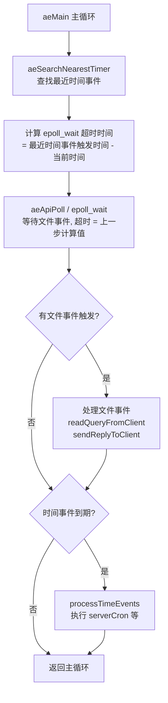

# Redis 阶段二：核心原理 — 练习题

> 参考: [Redis 核心原理](./Redis-core-principle.md)

> **总分**：100 分 + 附加题 20 分
> **及格线**：70 分 | **优秀线**：85 分
> **建议**：达到 85 分+后再进入阶段三

---

## 一、选择题（每题 3 分，共 30 分）

### 1. Redis 单线程模型快的主要原因不包括以下哪项？

A. 纯内存操作
B. IO 多路复用
C. 使用了多线程并发执行命令
D. 避免了上下文切换和锁竞争

<details>
<summary>答案</summary>

**C**。Redis 核心命令执行是单线程的，不是多线程。快的原因是纯内存操作、IO 多路复用、避免上下文切换和锁竞争。
</details>

---

### 2. 以下关于 epoll 的描述，哪项是错误的？

A. epoll 采用事件驱动方式，不需要遍历所有 FD
B. epoll 的时间复杂度是 O(1)
C. epoll 每次调用都需要全量拷贝 FD 集合
D. epoll 支持百万级并发连接

<details>
<summary>答案</summary>

**C**。这是 select/poll 的行为，不是 epoll 的。epoll 只拷贝就绪的 FD，不需要全量拷贝。
</details>

---

### 3. Redis 的 `ae.c` 事件抽象层在 Linux 上默认使用哪个 IO 多路复用实现？

A. select
B. poll
C. epoll
D. kqueue

<details>
<summary>答案</summary>

**C**。Redis 通过条件编译自动选择平台最优实现，Linux 上默认使用 epoll（`ae_epoll.c`），macOS 使用 kqueue（`ae_kqueue.c`），其他平台回退到 select。
</details>

---

### 4. Redis 过期删除策略中，定期删除的执行频率大约是？

A. 每秒 1 次
B. 每 100ms 一次
C. 每 10ms 一次
D. 每分钟 1 次

<details>
<summary>答案</summary>

**B**。`serverCron` 默认每 100ms 执行一次，内部调用 `activeExpireCycle()` 执行定期删除。
</details>

---

### 5. Redis 定期删除每轮随机抽取多少个 Key 检查过期？

A. 10 个
B. 15 个
C. 20 个
D. 50 个

<details>
<summary>答案</summary>

**C**。每轮随机抽取 20 个 Key（`ACTIVE_EXPIRE_CYCLE_LOOKUPS_PER_LOOP = 20`），如果过期比例超过 25% 则继续下一轮。
</details>

---

### 6. 以下哪种 Redis 内存淘汰策略会在内存满时直接拒绝写入？

A. allkeys-lru
B. volatile-lru
C. noeviction
D. allkeys-random

<details>
<summary>答案</summary>

**C**。`noeviction` 是默认策略，内存达到 `maxmemory` 限制时，所有写入操作直接返回错误。
</details>

---

### 7. Redis 的近似 LRU 算法中，`maxmemory-samples` 的默认值是？

A. 1
B. 3
C. 5
D. 10

<details>
<summary>答案</summary>

**C**。默认采样 5 个 Key，从中选择最久未访问的淘汰。采样数越大越接近真实 LRU，但 CPU 开销也越大。
</details>

---

### 8. Redis 6.0 的多线程模型，以下描述正确的是？

A. 命令执行使用多线程
B. 网络 IO 使用多线程，命令执行仍然单线程
C. 默认开启多线程
D. 多线程用于数据持久化

<details>
<summary>答案</summary>

**B**。Redis 6.0 的多线程仅用于网络 IO 读写，命令执行仍然是单线程的，保证了原子性。多线程默认是关闭的。
</details>

---

### 9. Redis 共享对象池的范围是？

A. 0 ~ 99
B. 0 ~ 999
C. 0 ~ 9999
D. 0 ~ 65535

<details>
<summary>答案</summary>

**C**。Redis 启动时预创建 0 ~ 9999 的整数对象共享池（`OBJ_SHARED_INTEGERS = 10000`），设置这些范围内的整数值时会复用共享对象。
</details>

---

### 10. 在 LFU 淘汰策略下，`redisObject` 的 `lru` 字段（24 bit）存储的是什么？

A. 完整的访问时间戳
B. 高 16 位存衰减时间，低 8 位存访问计数器
C. 访问总次数
D. 对象创建时间

<details>
<summary>答案</summary>

**B**。LFU 模式下，`lru` 字段被拆分：高 16 位存储分钟级衰减时间戳，低 8 位存储对数访问计数器。LRU 模式下才存储时间戳。
</details>

---

## 二、填空题（每空 2 分，共 20 分）

### 1. Redis 对 IO 多路复用做了统一封装，核心抽象层在 ______ 文件中，Linux 平台使用 ______ 文件的 epoll 实现。

<details>
<summary>答案</summary>

`ae.c`；`ae_epoll.c`
</details>

---

### 2. Redis 事件驱动模型处理两类事件：______ 事件（网络连接的读写）和 ______ 事件（定时任务如 serverCron）。

<details>
<summary>答案</summary>

文件（File Event）；时间（Time Event）
</details>

---

### 3. Redis 过期删除采用双策略组合：______ 删除（访问时检查）+ ______ 删除（定时抽样检查）。

<details>
<summary>答案</summary>

惰性（Lazy）；定期（Active）
</details>

---

### 4. Redis 定期删除中，如果本轮过期比例超过 ______%，会继续下一轮检查。

<details>
<summary>答案</summary>

25%（即 20 个中过期超过 5 个）
</details>

---

### 5. Redis 6.0 开启 IO 多线程需要配置 `io-threads` 和 `______` 两个参数。

<details>
<summary>答案</summary>

`io-threads-do-reads`（设置为 yes 开启多线程读操作）
</details>

---

## 三、简答题（每题 10 分，共 30 分）

### 1. 请解释 Redis 单线程模型为什么性能依然很高，至少说出 4 个原因。

<details>
<summary>答案</summary>

1. **纯内存操作**：数据全部在内存中，读写速度纳秒级，CPU 不是瓶颈
2. **IO 多路复用**：通过 epoll 一个线程监听数千个连接，非阻塞高效处理
3. **避免上下文切换**：单线程不需要在线程间切换，省去了寄存器/栈指针的保存恢复开销
4. **无锁竞争**：串行执行天然没有加锁、死锁、竞态条件问题
5. **高效数据结构**：SDS、ZipList、SkipList 等底层结构经过高度优化
6. **简单协议**：RESP 协议解析开销极低

（答出 4 点即可得满分）
</details>

---

### 2. 请描述 Redis 定期删除（activeExpireCycle）的执行流程。

<details>
<summary>答案</summary>

1. `serverCron` 每约 100ms 触发 `activeExpireCycle()`
2. 从过期字典（expires）中随机抽取 **20 个** Key
3. 逐个检查是否已过期，如果过期则删除
4. 统计本轮删除比例，如果**超过 25%**（即 20 个中超过 5 个过期），则继续下一轮抽样
5. 每次执行有**时间上限**（默认不超过 25ms），避免长时间阻塞主线程
6. 如果删除比例 ≤ 25% 或超过时间上限，本轮结束，等待下一次触发
</details>

---

### 3. 请对比 Redis 的 LRU 和 LFU 淘汰策略的区别，以及各自的适用场景。

<details>
<summary>答案</summary>

| 维度 | LRU | LFU |
|------|-----|-----|
| **淘汰依据** | 最后一次访问时间 | 访问频率 |
| **lru 字段用法** | 24 bit 全部存时间戳 | 高 16 位存衰减时间，低 8 位存计数器 |
| **优点** | 实现简单，保护近期活跃数据 | 区分冷热更精确 |
| **缺点** | 偶尔访问的冷数据可能不被淘汰 | 新数据初始频率低，容易被误淘汰 |
| **适用场景** | 访问模式随时间变化 | 有明确冷热区分的场景 |

LRU 适合访问热点随时间漂移的场景（如新闻推荐），LFU 适合有稳定热点的场景（如热门商品排行榜）。
</details>

---

## 四、场景题（每题 10 分，共 20 分）

### 1. 你的 Redis 实例内存使用率持续增长，即将达到 maxmemory 限制。部分 Key 是缓存数据（设了 TTL），部分是业务持久化数据（没有 TTL）。请回答：

**a)** 应该选择哪种淘汰策略？为什么？

**b)** 如果错误地选择了 `allkeys-lru`，会有什么后果？

<details>
<summary>答案</summary>

**a)** 应选择 **`volatile-lru`** 或 **`volatile-lfu`**。因为这两种策略只在设置了过期时间的 Key（即缓存数据）中进行淘汰，不会影响没有 TTL 的业务持久化数据。

**b)** 如果选择 `allkeys-lru`，Redis 会在所有 Key 中淘汰，包括没有设置 TTL 的业务持久化数据，可能导致重要业务数据被意外删除。
</details>

---

### 2. 你们公司的 Redis 集群 QPS 达到了 15 万，网络 IO 成为瓶颈。你考虑开启 Redis 6.0 的 IO 多线程。

**a)** 需要修改哪些配置？

**b)** IO 线程数建议设为多少？为什么不能设为 CPU 核心数？

**c)** 开启多线程后，命令执行的原子性是否受影响？为什么？

<details>
<summary>答案</summary>

**a)** 需要修改两个配置：
```
io-threads 4            # 设置 IO 线程数
io-threads-do-reads yes # 开启多线程读
```

**b)** 建议设为 **CPU 核心数的一半**左右。不能设为 CPU 核心数是因为主线程（命令执行线程）也需要 CPU 资源，IO 线程和主线程会竞争 CPU，设太多反而会因线程切换降低性能。

**c)** **不受影响**。Redis 6.0 的多线程只用于网络 IO 读写，命令执行仍然在主线程中串行执行。多线程负责并行读取请求和并行写回响应，但命令的执行是严格串行的，所以保持了原子性。
</details>

---

## 五、附加题（每题 10 分，共 20 分）

### 1. 请画出 Redis 事件循环的完整流程（从 `aeMain` 到处理完所有事件），并说明文件事件和时间事件是如何协调的。

<details>
<summary>答案</summary>



**协调机制**：
- 事件循环在调用 `aeApiPoll` 前，先查找最近的时间事件，用其触发时间减去当前时间作为 `epoll_wait` 的超时时间
- 这样如果一直没有文件事件，epoll_wait 最多等到最近时间事件触发时返回
- 如果有文件事件就立即处理，处理完再检查时间事件是否到期
- 通过这种方式实现了文件事件和时间事件的高效复用
</details>

---

### 2. 假设你面试被问到："为什么 Redis 不用严格 LRU 而用近似 LRU？近似 LRU 的效果如何？"

请给出你的回答。

<details>
<summary>答案</summary>

**为什么不用严格 LRU：**
严格 LRU 需要维护一个全局双向链表，每次访问 Key 都要移动到链表头部，这涉及：
1. 每次访问都要修改链表指针，增加 CPU 开销
2. 需要额外的链表节点内存
3. 多线程场景下链表操作需要加锁（虽然 Redis 是单线程，但这个设计也是考虑因素）

**近似 LRU 的做法：**
1. 每个 Key 在 `redisObject.lru` 字段记录最后访问时间戳（24 bit）
2. 淘汰时随机采样 N 个 Key（默认 5），选最久未访问的删除
3. 重复采样直到释放足够内存

**效果：**
Redis 官方测试表明，采样数为 5 时，近似 LRU 的效果已经非常接近真实 LRU（接近度达 90%+），采样数为 10 时几乎无法区分。而 CPU 和内存开销远低于严格 LRU。
</details>

---

## 评分参考

| 分数区间 | 等级 | 建议 |
|---------|------|------|
| 85 ~ 100+ | 优秀 | 可以进入阶段三 |
| 70 ~ 84 | 及格 | 回顾错题，重点关注薄弱知识点 |
| < 70 | 不及格 | 建议重新阅读笔记，重点复习 |

### 高频错题对应知识点

| 错题编号 | 对应知识点 | 笔记位置 |
|---------|-----------|---------|
| 第 3 题 | ae.c 封装层 | 第二章 2.3 |
| 第 5 题 | 定期删除参数 | 第五章 5.2 |
| 第 7 题 | 近似 LRU 采样数 | 第六章 6.3 |
| 第 10 题 | LFU 的 lru 字段 | 第六章 6.4 |
| 场景题 1 | 淘汰策略选择 | 第六章 6.2 |

> 如果某些题目做错，回到 [Redis 核心原理](./Redis-core-principle.md) 对应章节复习。
