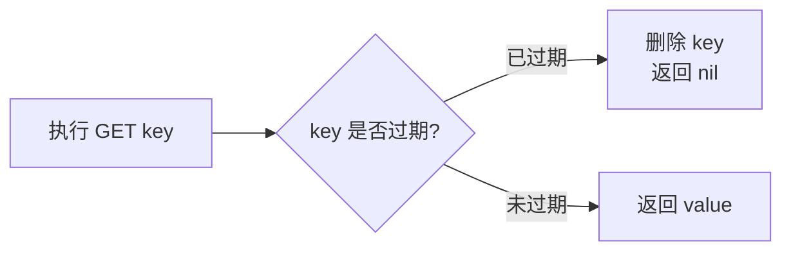
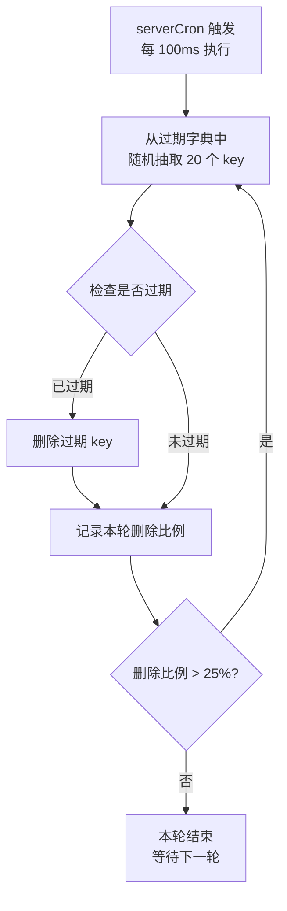
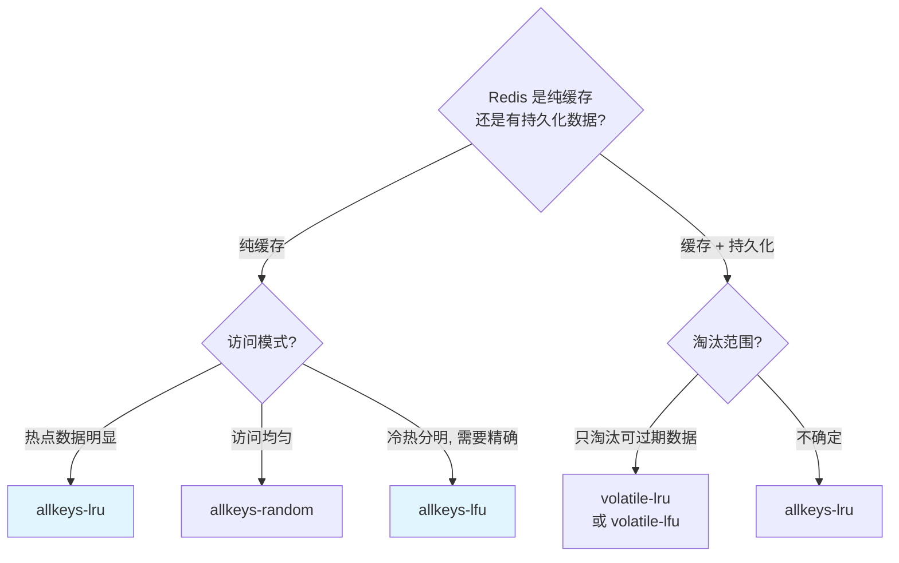
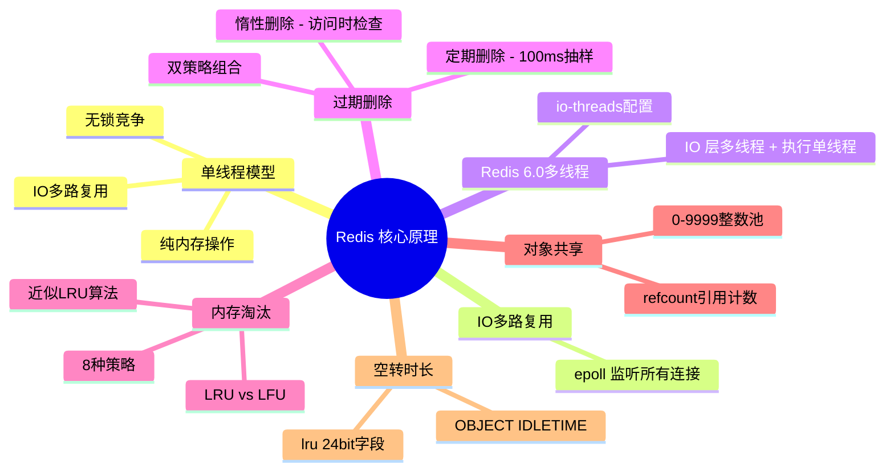

# Redis 核心原理

> 练习: [Redis 核心原理练习](./Redis-core-principle-exercises.md)
>
> 面试: [Redis 核心原理面试](./Redis-core-principle-interview.md)

## 一、单线程模型与性能分析

### 1.1 Redis 为什么用单线程

Redis 的核心命令执行是**单线程**的（从接收请求到返回结果都在一个线程中完成）。这不是设计缺陷，而是**刻意选择**，原因有三：

1. **纯内存操作** — Redis 的数据全部存放在内存中，内存读写速度是纳秒级，CPU 不是瓶颈
2. **避免上下文切换** — 多线程切换需要保存/恢复寄存器、栈指针等，开销不可忽视
3. **避免锁竞争** — 单线程天然串行执行，不需要加锁，没有死锁、竞态条件等问题

### 1.2 单线程为什么还能这么快

核心答案：**IO 多路复用 + 纯内存操作 + 高效的数据结构**

```
┌─────────────────────────────────────────────────────┐
│                  单线程为什么快                        │
├──────────────┬──────────────────────────────────────┤
│  纯内存操作   │  内存读写纳秒级, CPU 不是瓶颈            │
│  IO多路复用   │  一个线程监听数千连接, 非阻塞             │
│  高效数据结构  │  SDS / ZipList / SkipList 等优化      │
│  无锁竞争     │  串行执行, 无加锁/死锁/上下文切换开销      │
└──────────────┴──────────────────────────────────────┘
```

> Redis 单线程快的关键不是"单线程本身快"，而是**瓶颈在网络 IO 而不是 CPU**。单线程避免了**锁竞争**和**上下文切换**的开销，配合 IO 多路复用让一个线程就能高效处理大量并发连接，再加上纯内存操作和高效数据结构，整体吞吐量远超多数多线程方案。

### 1.3 单线程的局限

- **无法利用多核 CPU** — 命令执行始终在一个核上
- **耗时命令会阻塞** — 如 `KEYS *`、大 Key 操作

### 1.4 Redis 6.0 多线程

随着并发量上升，再叠加读写更大的value时，网络 IO 成为瓶颈，Redis 6.0 引入了多线程

> Redis 6.0 多线程仅支持网络 IO，命令执行仍然是单线程执行

**与单线程模型不冲突的原因**：

- IO 多路复用（epoll）仍在主线程，负责"发现哪些连接需要处理"
- IO 线程只做网络读写（`read()` / `write()`），不碰数据结构
- 命令执行依然严格串行，不需要加锁，保持了原子性

本质上是把 `read 命令 → 执行命令 → write 结果` 拆成了：IO 线程并行 read → 主线程串行执行 → IO 线程并行 write。瓶颈从网络 IO 转移后，数据结构的线程安全完全不受影响。

1. **读阶段**：多个 IO 线程并行从 socket 读取请求数据
2. **执行阶段**：主线程**串行**执行所有命令（保证原子性）
3. **写阶段**：多个 IO 线程并行将响应写回各客户端

> Redis 单线程快的原因是瓶颈在网络 IO 而非 CPU，单线程避免了锁竞争和上下文切换，配合 IO 多路复用（epoll）就能高效处理大量连接。Redis 6.0 引入的多线程只用于网络 IO 读写，命令执行仍然是单线程，所以不需要加锁，两者不冲突。默认关闭是因为 QPS < 10 万时单线程已经够用。

---

## 二、过期删除策略

Redis 对设置了过期时间的 Key 采用 **惰性删除 + 定期删除** 双策略组合。

### 2.1 惰性删除（Lazy Expiration）

**不主动删除，访问时才检查是否过期。**



**优点**：简单，CPU 友好，不额外占用资源
**缺点**：如果过期 Key 长期不被访问，会一直占用内存（内存泄漏）

### 2.2 定期删除（Active Expiration）

**每隔一段时间，随机抽取一批设置了过期时间的 Key 检查并删除。**



**关键参数**：

- 每轮随机抽取 **20 个** Key
- 如果本轮过期比例 **> 25%**，继续下一轮
- 每次执行有**时间上限**（默认不超过 25ms），避免阻塞主线程

### 2.3 为什么是惰性 + 定期组合

| 策略         | 单独使用的问题                                   |
| ------------ | ------------------------------------------------ |
| 只用惰性删除 | 过期 Key 如果不被访问就永远不删除，浪费内存      |
| 只用定期删除 | 抽样不可能覆盖所有 Key，仍会有漏网的过期 Key     |
| **组合使用** | 定期删除兜底大部分过期 Key，惰性删除兜底漏网之鱼 |

> Redis 过期删除采用"惰性删除 + 定期删除"双策略。惰性删除在每次访问 Key 时检查是否过期，简单但可能内存泄漏。定期删除每 100ms 随机抽取 20 个 Key 检查，如果过期比例超过 25% 会继续循环。两者结合既保证了 CPU 效率，又控制了内存占用。但即便如此，仍可能有少量过期 Key 未被清理，最终由内存淘汰策略兜底。

---

## 三、内存淘汰策略

当 Redis 内存使用达到 `maxmemory` 限制时，需要通过淘汰策略来决定删除哪些 Key。

### 3.1 八种淘汰策略

| 策略                | 淘汰范围           | 说明                                            |
| ------------------- | ------------------ | ----------------------------------------------- |
| **noeviction**      | 不淘汰             | 默认策略，写入操作直接报错                      |
| **allkeys-lru**     | 所有 Key           | 淘汰最久未使用的 Key                            |
| **allkeys-lfu**     | 所有 Key           | 淘汰使用频率最低的 Key（Redis 4.0+）            |
| **allkeys-random**  | 所有 Key           | 随机淘汰                                        |
| **volatile-lru**    | 设了过期时间的 Key | 淘汰最久未使用且设了 TTL 的 Key                 |
| **volatile-lfu**    | 设了过期时间的 Key | 淘汰使用频率最低且设了 TTL 的 Key（Redis 4.0+） |
| **volatile-random** | 设了过期时间的 Key | 随机淘汰设了 TTL 的 Key                         |
| **volatile-ttl**    | 设了过期时间的 Key | 淘汰剩余 TTL 最短的 Key                         |

### 3.2 策略选择指南



**实践经验**：

- 大多数场景用 **`allkeys-lru`**，最通用
- 如果有明确冷热区分，用 **`allkeys-lfu`** 更精确
- 如果 Redis 同时存持久化数据，用 **`volatile-lru`** 保护不过期的数据

### 6.3 近似 LRU 算法

Redis 并没有实现严格的 LRU（成本太高），而是采用**近似 LRU**：

1. 每个 `redisObject` 的 `lru` 字段（24 bit）记录最后一次访问时间戳
2. 需要淘汰时，**随机采样 N 个 Key**（默认 5 个），淘汰其中最久未访问的
3. 重复此过程直到腾出足够内存

**采样数量**通过 `maxmemory-samples` 配置：

```
# 默认值 5, 越大越接近真实 LRU 但越耗 CPU
maxmemory-samples 5
```

| 采样数    | LRU 精确度       | CPU 开销 |
| --------- | ---------------- | -------- |
| 1         | 很差             | 极低     |
| 5（默认） | 接近真实 LRU     | 低       |
| 10        | 非常接近真实 LRU | 中等     |

> Redis 用的是近似 LRU 而非严格 LRU。原因是严格 LRU 需要维护一个全局链表，每次访问都要移动节点，开销太大。近似 LRU 通过随机采样 + 比较时间戳来选择淘汰对象，采样数默认为 5，实测效果已经非常接近真实 LRU。Redis 4.0 还引入了 LFU 策略，基于访问频率淘汰，对冷热数据区分更准确。

### 6.4 LRU vs LFU

| 维度           | LRU（最近最少使用）        | LFU（最不经常使用）                           |
| -------------- | -------------------------- | --------------------------------------------- |
| **淘汰依据**   | 最后一次访问时间           | 访问频率                                      |
| **时间戳存储** | `lru` 字段存时间戳         | `lru` 字段高 16 位存衰减时间、低 8 位存计数器 |
| **优点**       | 实现简单                   | 区分冷热更精确                                |
| **缺点**       | 偶尔访问的冷数据可能被保留 | 新数据初始频率低，容易被淘汰                  |
| **适用场景**   | 访问模式随时间变化         | 有明确冷热数据区分                            |

LFU 的衰减机制（`lfu-decay-time`，默认 1 分钟）：每过 `lfu-decay-time` 分钟，计数器减 1，避免历史高频但已不再访问的 Key 永远不被淘汰。

LFU 的计数器增长（`lfu-log-factor`，默认 10）：计数器不是简单 +1，而是基于对数的概率增长，避免热点 Key 计数器溢出。

---

## 四、对象空转时长

### 4.1 LRU 时钟与 idle 值

每个 `redisObject` 的 `lru` 字段（24 bit）有两种用途：

| 淘汰策略 | lru 字段含义                                            |
| -------- | ------------------------------------------------------- |
| LRU 系列 | 记录最后一次访问的**时间戳**（精度：秒，截断到 24 bit） |
| LFU 系列 | 高 16 位：**衰减时间**，低 8 位：**访问计数器**         |

**idle 值计算**：`idle = 当前时间 - lru 时间戳`

### 4.2 OBJECT IDLETIME 命令

```
# 查看某个 key 的空转时长（秒）
OBJECT IDLETIME mykey
(integer) 3600

# 查看 key 的引用计数
OBJECT REFCOUNT mykey
(integer) 1

# 查看 key 的编码方式
OBJECT ENCODING mykey
"embstr"
```

### 4.3 与内存淘汰的配合

当使用 LRU 淘汰策略时，Redis 通过 `lru` 字段计算 idle 值，idle 越大越优先被淘汰：

```
淘汰优先级: idle 值越大 → 越久没被访问 → 越优先淘汰
```

> redisObject 的 24 bit lru 字段在 LRU 策略下存储的是最后一次访问时间戳。OBJECT IDLETIME 命令通过"当前时间 - lru"计算空转时长。配合 LRU 淘汰策略，idle 值越大的 Key 越优先被淘汰。

---

## 五、总结



> 练习: [Redis 核心原理练习](./Redis-core-principle-exercises.md)
>
> 面试: [Redis 核心原理面试](./Redis-core-principle-interview.md)
