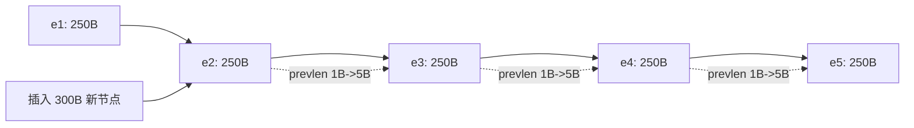
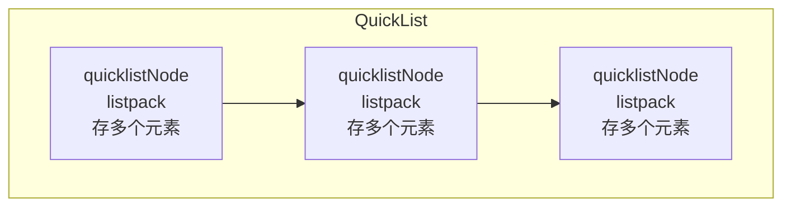

# Redis 阶段一：数据结构与对象 · 面试指南

> 参考: [Redis 数据结构](./Redis-data-structure.md)

> **面试岗位**：Java 后端开发（中高级）
> **准备时长**：1 天（阶段一学习完成后）
> **重点级别**：⭐⭐⭐⭐⭐（面试高频 + 理解底层的基础）
> **锚定版本**：Redis 7.0+

---

## 📋 目录

1. [高频面试题 Top10](#一-高频面试题-top10)
2. [面试话术模板](#二-面试话术模板)
3. [追问与连环问](#三-追问与连环问)
4. [易错点避坑指南](#四-易错点避坑指南)
5. [源码路径速查](#五-源码路径速查)

---

## 一、高频面试题 Top10

### Q1: Redis 为什么用 SDS 而不是 C 字符串？⭐⭐⭐⭐⭐

**参考答案**：

Redis 自己构建了 **SDS（Simple Dynamic String）** 作为默认字符串表示，而非直接使用 C 语言的 `char[]`。原因有六大优势：

| 对比维度 | C 字符串 | SDS |
|----------|----------|-----|
| 获取长度 | O(N) 遍历 | O(1) 直接读 `len` 字段 |
| 缓冲区溢出 | 不检查，可能越界写入 | 修改前检查空间，不足则自动扩容 |
| 二进制安全 | 依赖 `\0` 判断结尾，不能存二进制 | 用 `len` 判断结尾，可以存任意数据 |
| 空间预分配 | 无 | 修改时预分配额外空间，减少重分配次数 |
| 惰性释放 | 无 | 缩短字符串不立即释放，留作后续使用 |
| 兼容 C 字符串 | — | API 以 `\0` 结尾，可复用 `<string.h>` 部分函数 |

**面试要点**：SDS 本质是带元信息的 C 字符串，O(1) 长度 + 二进制安全 + 自动扩容是三大核心优势。

---

### Q2: Redis 字典的渐进式 rehash 是怎么做的？⭐⭐⭐⭐⭐

**参考答案**：

Redis 的字典底层是**两个哈希表**（`ht[0]` 和 `ht[1]`），rehash 不是一次性完成的，而是**分多次、渐进式**地把 `ht[0]` 的键值对迁移到 `ht[1]`。

**为什么不能一次性 rehash？**

当哈希表中键值对数量达到百万甚至亿级时，一次性 rehash 会导致服务器在一段时间内停止服务（阻塞），这对 Redis 这种单线程模型是不可接受的。

**分步迁移过程**：

1. 为 `ht[1]` 分配空间（大小取决于要扩展还是收缩）
2. 将字典的 `rehashidx` 设为 0，表示 rehash 开始
3. 每次 CRUD 操作时，顺便将 `ht[0]` 在 `rehashidx` 位置上的所有键值对迁移到 `ht[1]`，然后 `rehashidx++`
4. 同时，Redis 也会在定时任务中进行一小批量的迁移（保证在无操作时也能推进）
5. 当 `ht[0]` 全部迁移完毕，释放 `ht[0]`，将 `ht[1]` 设为 `ht[0]`，再创建一个新的空 `ht[1]`，`rehashidx` 设为 -1

**rehash 期间的 CRUD 规则**：

| 操作 | 行为 |
|------|------|
| **查找** | 先查 `ht[0]`，没找到再查 `ht[1]` |
| **添加** | 只往 `ht[1]` 添加（保证 `ht[0]` 只减不增） |
| **修改** | 先在 `ht[0]` 查找，找到就修改；否则去 `ht[1]` 修改 |
| **删除** | 先在 `ht[0]` 查找，找到就删除；否则去 `ht[1]` 删除 |

**触发条件**：

| 操作 | 负载因子阈值 | 说明 |
|------|-------------|------|
| 扩展 | `>= 1`（没有 BGSAVE/BGREWRITEAOF）或 `>= 5`（有 BGSAVE） | 负载因子 = 已使用节点数 / 哈希表大小 |
| 收缩 | `< 0.1` | 键值对过少时收缩以节省内存 |

> BGSAVE/BGREWRITEAOF 期间使用 `fork` 子进程，为避免 COW（Copy-On-Write）带来大量页复制，提高了扩展阈值。

**面试要点**：渐进式 rehash = 分摊迁移成本，通过 `rehashidx` 游标 + 每次 CRUD 顺便迁移实现，查找需同时查两个表。

---

### Q3: 为什么 Redis 用跳表而不用红黑树实现有序集合？⭐⭐⭐⭐⭐

**参考答案**：

Redis 作者 antirez 的原话解释了这一选择，核心原因有四点：

| 对比维度 | 跳表 | 红黑树 |
|----------|------|--------|
| **实现复杂度** | 简单，只需几行代码 | 复杂，旋转/着色逻辑多，容易出错 |
| **范围查询** | 天然支持，找到起点后沿最底层链表顺序遍历 | 需要中序遍历，实现复杂 |
| **内存可控** | 通过调节概率参数控制层数，空间复杂度 O(1.5N) | 每个节点固定 2 个指针 + 颜色位 |
| **插入/删除** | 只需修改相邻节点指针 | 需要旋转和再平衡 |

**范围查询的优势是决定性的**：

`ZRANGEBYSCORE` 这类命令是 Zset 最常用的操作之一。跳表在找到范围起点后，只需沿最底层链表向后遍历即可，时间复杂度 O(logN + M)（M 为结果集大小）。红黑树要做中序遍历，需要用栈或线索化来处理，代码复杂度高。

**面试要点**：跳表在范围查询、实现简单度、并发友好性上优于红黑树，是 Zset 底层编码的首选。

---

### Q4: Redis 的五种数据类型分别用什么底层编码？什么条件下会转换？⭐⭐⭐⭐⭐

**参考答案**：

Redis 的每种数据类型都有多种底层编码，会根据数据量和大小自动选择最节省内存的编码：

| 类型 | 底层编码 | 转换条件 |
|------|----------|----------|
| **String** | `int` / `embstr` / `raw` | 整数 → int；<= 44 字节 → embstr（只读，修改即转 raw）；> 44 字节 → raw |
| **Hash** | `listpack` / `hashtable` | <= 512 个元素且 <= 64 字节 → listpack；超阈值 → hashtable |
| **List** | `quicklist` | 始终使用 quicklist（内部 listpack + linkedlist） |
| **Set** | `intset` / `listpack` / `hashtable` | 全整数且 <= 512 → intset；小数据 → listpack；超阈值 → hashtable |
| **Zset** | `listpack` / `skiplist + hashtable` | <= 128 个元素且 <= 64 字节 → listpack；超阈值 → skiplist + hashtable |

**关键阈值速记**：

```
embstr:     44 字节
Hash:       512 个 / 64 字节
Set intset: 512 个
Zset:       128 个 / 64 字节
```

**转换是单向的**：从小数据编码转换到大数据编码后，即使数据减少也不会回退（比如 `intset → hashtable` 后不再转回）。

**面试要点**：Redis 的设计哲学是「小数据用紧凑编码省内存，大数据用标准结构保性能」。转换阈值可通过配置文件调整。

---

### Q5: 什么是压缩列表的连锁更新？怎么解决的？⭐⭐⭐⭐

**参考答案**：

**问题背景（历史）**：

旧版压缩列表（ziplist）中每个 entry 有一个 `prevlen` 字段，记录前一节点的长度：

- 前一节点 < 254 字节：`prevlen` 用 **1 字节** 编码
- 前一节点 >= 254 字节：`prevlen` 用 **5 字节** 编码

问题场景：如果有一组连续的 entry，每个长度都在 250~253 字节之间（`prevlen` 都是 1 字节），此时在中间插入一个 >= 254 字节的 entry，会导致后一个 entry 的 `prevlen` 从 1 字节扩展到 5 字节，该 entry 自身变大后又导致下一个 entry 的 `prevlen` 也要扩展... 产生**级联扩展**，最坏情况下 O(N) 次内存重分配。



**Redis 7.0 解决方案 — ListPack**：

ListPack 重新设计了 entry 结构，每个 entry 不再记录前一节点的长度，而是记录**自身的长度**（backlen）。这样修改某个 entry 不会影响其他 entry，从根源上消除了连锁更新。

**面试要点**：连锁更新是 ziplist 的历史问题，Redis 7.0 的 listpack 已彻底解决。面试时回答完原理后，要主动补充"Redis 7.0 已经用 listpack 替代了 ziplist"。

---

### Q6: redisObject 的结构是怎样的？type 和 encoding 的关系？⭐⭐⭐⭐

**参考答案**：

Redis 中的每个键值对，值都是一个 `redisObject` 结构：

```
typedef struct redisObject {
    unsigned type:4;        // 数据类型（String/List/Hash/Set/Zset 等）
    unsigned encoding:4;    // 底层编码（raw/int/listpack/hashtable/skiplist 等）
    unsigned lru:24;        // LRU 时间戳或 LFU 计数器
    int refcount;           // 引用计数
    void *ptr;              // 指向底层实现数据结构的指针
} robj;
```

**type 和 encoding 的关系**：

一种 `type` 可以有多种 `encoding`，Redis 会根据数据特征自动选择最优编码：

```
type=String  →  encoding: int / embstr / raw
type=Hash    →  encoding: listpack / hashtable
type=List    →  encoding: quicklist
type=Set     →  encoding: intset / listpack / hashtable
type=Zset    →  encoding: listpack / skiplist
```

**查看当前编码**：

```bash
OBJECT ENCODING mykey
```

**面试要点**：redisObject 五个字段各自分工；type 是对外暴露的类型，encoding 是对内的存储优化；用 `OBJECT ENCODING` 可查看实际编码。

---

### Q7: SDS 的空间预分配策略是怎样的？⭐⭐⭐

**参考答案**：

SDS 在进行字符串拼接（增长）操作时，如果需要对 SDS 进行空间扩展，Redis 会额外分配一些未使用空间：

| 条件 | 预分配策略 |
|------|-----------|
| `len < 1MB` | 分配 `len` 大小的额外空间（即 `free = len`，总容量翻倍） |
| `len >= 1MB` | 固定分配 `1MB` 额外空间（即 `free = 1MB`） |

**示例**：

- 当前 `len = 20`，拼接后 `len = 30`，则 `free = 30`，`buf` 总容量 = 30 + 30 + 1 = 61 字节
- 当前 `len = 2MB`，拼接后 `len = 3MB`，则 `free = 1MB`，`buf` 总容量 = 3MB + 1MB + 1 字节

**惰性释放**：缩短字符串时不立即释放多余空间，而是记录在 `free` 字段中，避免后续增长操作触发内存重分配。

**面试要点**：预分配策略是空间换时间，核心思路是减少内存重分配次数。小于 1MB 翻倍，大于等于 1MB 固定加 1MB。

---

### Q8: 整数集合的编码升级是什么？为什么不能降级？⭐⭐⭐

**参考答案**：

整数集合（intset）是一个有序的整数数组，当插入的新元素超出了当前编码能表示的范围时，会触发**编码升级**：

```
int16 → int32 → int64
```

**升级过程（以 int16 → int32 为例）**：

1. 检测到新元素 65535 超出 int16 范围（-32768 ~ 32767）
2. 按新编码（int32）重新计算数组所需空间
3. 扩展底层数组大小
4. 将现有元素从后向前按 int32 编码重新放置（从后往前是为了避免覆盖）
5. 将新元素添加到正确位置（intset 是有序的，需要找到插入位置）
6. 修改 `encoding` 属性

**为什么不能降级？**

- 升级需要遍历所有元素重新编码，有性能开销
- 降级需要额外遍历判断当前集合中的最大值是否可以降级，复杂度较高
- 实际场景中，降级的收益很小（内存节省有限），不值得额外的复杂度

**面试要点**：intset 升级是自动的、不可逆的，从后往前移动元素避免覆盖。不降级是工程权衡的结果。

---

### Q9: QuickList 是什么？为什么需要它？⭐⭐⭐

**参考答案**：

QuickList 是 List 类型的底层实现，它是 **linkedlist + listpack 的混合体**。

**为什么需要 QuickList？**

| 数据结构 | 优点 | 缺点 |
|----------|------|------|
| listpack | 连续内存，省内存，缓存友好 | 元素多时性能差 |
| linkedlist | 增删 O(1) | 每个节点独立分配，内存碎片大，指针开销大 |

**QuickList 的折中方案**：

```
quicklist = 双端链表
            每个节点（quicklistNode）= 一个 listpack
```



- 每个节点存储一定数量的元素（由 `list-max-listpack-size` 控制），而不是一个元素
- 兼顾了**内存紧凑**（每个节点内部是连续内存）和**操作效率**（节点间是链表）
- 中间节点可以被压缩（LZF 算法），进一步节省内存

**面试要点**：QuickList 是「分段的紧凑列表」，每个链表节点内部用 listpack 省内存，节点间用链表避免大块内存操作。

---

### Q10: Redis 7.0 对数据结构做了哪些优化？⭐⭐⭐

**参考答案**：

Redis 7.0 对底层结构做了几项重要改进：

| 优化项 | 说明 |
|--------|------|
| **listpack 全面替代 ziplist** | 从根本上解决连锁更新问题，entry 记录自身长度而非前节点长度 |
| **Hash/ZSet/Set 小数据编码统一使用 listpack** | 小数据场景下的紧凑编码统一为 listpack，降低维护复杂度 |
| **Multi-part AOF** | AOF 拆分为 base AOF + 增量 AOF 文件，提升 AOF 重写效率 |

**面试要点**：Redis 7.0 最核心的数据结构变化是 listpack 全面替代 ziplist，消除连锁更新隐患。

---

## 二、面试话术模板

### 话术 1：被问到"Redis 的数据结构底层实现"

> Redis 有五种基本数据类型，每种都有多种底层编码。核心设计思想是「小数据用紧凑编码省内存，大数据用标准结构保性能」。比如 Hash 类型，元素少时用 listpack，元素多了自动转 hashtable。类似地，Zset 小数据用 listpack，大数据用 skiplist + hashtable 组合。你可以用 `OBJECT ENCODING` 命令实时查看键的实际编码。这种设计让 Redis 在内存使用上非常高效。

### 话术 2：被问到"Redis 为什么快"

> Redis 快的原因是多方面的。从数据结构角度看，SDS 获取长度 O(1) 比 C 字符串快；跳表实现 Zset 范围查询高效，比红黑树实现简单；小数据用 listpack 紧凑存储，CPU 缓存命中率高。从架构角度看，单线程模型避免了上下文切换和锁竞争，配合 IO 多路复用实现高并发。再加上纯内存操作，单线程也能达到 10 万+ QPS。

### 话术 3：被问到"跳表和红黑树怎么选"

> Redis 选择跳表主要基于三点：第一，范围查询天然高效，`ZRANGEBYSCORE` 找到起点后沿最底层链表顺序遍历即可；第二，实现简单，代码量少，易于理解和维护；第三，内存使用可控，通过调节概率参数平衡时间和空间。虽然红黑树在最坏情况下的查找是严格 O(logN)，而跳表是概率性的 O(logN)，但实际工程中跳表的综合表现更好，尤其是范围操作。

---

## 三、追问与连环问

### 连环问 1：SDS → 空间预分配 → 内存碎片 → 淘汰策略

**追问 1**：SDS 的空间预分配不是会浪费内存吗？

> 是的，预分配会多占用一些内存，但这是「空间换时间」的权衡。通过预分配，连续 N 次追加操作可能只需要 1 次内存重分配，而不是 N 次。Redis 是单线程的，减少内存分配次数对性能至关重要。

**追问 2**：那 Redis 的内存碎片问题怎么解决？

> Redis 的内存碎片主要来自频繁的键值对创建和删除。监控指标是 `used_memory_rss / used_memory` 的比值，通常 > 1 表示有碎片。解决方案：1) `MEMORY PURGE` 命令主动清理（Redis 4.0+）；2) 重启 Redis 实例；3) 配置 `activedefrag yes` 开启自动碎片整理（Redis 4.0+）。

**追问 3**：内存不够了怎么办？

> 触发内存淘汰策略。Redis 提供了 8 种策略（`maxmemory-policy`），常用的有 `allkeys-lru`（淘汰最久未使用的任意键）和 `volatile-lru`（只淘汰设了过期时间的键）。选择策略取决于业务场景——做缓存用 `allkeys-lru`，做持久存储就不能随便淘汰。

---

### 连环问 2：字典 rehash → 负载因子 → BGSAVE 影响 → fork COW

**追问 1**：负载因子的扩展阈值为什么 BGSAVE 时不一样？

> BGSAVE 通过 `fork()` 创建子进程来持久化。`fork` 使用操作系统的 Copy-On-Write（COW）机制，子进程共享父进程的内存页，只有父进程修改某页时才复制该页。如果此时做 rehash，会大量修改内存，触发大量页复制，消耗额外内存。所以 Redis 提高了扩展阈值（从 1 提高到 5），尽量避免在 BGSAVE 期间做 rehash。

**追问 2**：那收缩呢？BGSAVE 期间也会收缩吗？

> 不会。Redis 规定在 BGSAVE 或 BGREWRITEAOF 期间，**不执行收缩**。原因是相同的——避免 COW 带来大量页复制。

**追问 3**：渐进式 rehash 会不会导致数据不一致？

> 不会。查找操作会同时查 `ht[0]` 和 `ht[1]`，保证能找到所有数据；新增只往 `ht[1]` 写，保证 `ht[0]` 只减不增。整个过程中，数据是完整的，只是分散在两个哈希表中。

---

### 连环问 3：跳表 → ZRANGEBYSCORE → 时间复杂度 → 为什么不用 B+ 树

**追问 1**：跳表查找的时间复杂度是多少？

> 平均 O(logN)，最坏 O(N)。但由于概率平衡，最坏情况在实际中几乎不会出现。每次查找从最高层开始，逐层往下，类似二分查找。

**追问 2**：为什么不用 B+ 树？

> B+ 树更适合**磁盘存储**场景（如 MySQL），它的设计目标是减少磁盘 IO 次数，每个节点存多个元素来降低树高。Redis 是**纯内存数据库**，不需要考虑磁盘 IO，内存中指针跳转的代价很小。跳表在内存场景下实现更简单，范围查询同样高效，而且不需要 B+ 树那样复杂的节点分裂/合并逻辑。

**追问 3**：跳表的层数是怎么决定的？

> 每次插入新节点时，有 1/4 的概率（`ZSKIPLIST_P = 0.25`）继续增加一层。层数上限是 32（`ZSKIPLIST_MAXLEVEL = 32`）。这种概率性平衡比红黑树的严格平衡实现简单得多。

---

### 连环问 4：编码转换 → 内存优化 → 生产调优

**追问 1**：编码转换的阈值可以调吗？

> 可以，通过 `redis.conf` 中的参数调整。比如 `hash-max-listpack-entries`、`zset-max-listpack-entries` 等。但如果你的数据大都是小数据，可以适当调大阈值让更多数据使用紧凑编码节省内存；如果数据变化频繁且经常在阈值附近波动，频繁转换编码反而影响性能。

**追问 2**：生产环境有做过 Redis 内存优化吗？

> 常见优化手段：1) 选择合适的数据类型（小 Hash 比多个 String 省内存）；2) 调整编码转换阈值；3) 使用 listpack 编码的 Hash 代替多个独立键（键共享开销）；4) 开启 `activedefrag`；5) 设置合理的过期时间；6) 使用 `BIGKEY` 扫描发现异常大的键。

---

## 四、易错点避坑指南

| 易错点 | 正确理解 |
|--------|----------|
| SDS 和 C 字符串完全不同 | SDS 兼容 C 字符串函数，以 `\0` 结尾，可以复用 `<string.h>` 部分函数 |
| 渐进式 rehash 会阻塞 | rehash 是分步进行的，每次 CRUD 只迁移少量数据，不会长时间阻塞 |
| 跳表是平衡树 | 跳表是概率性数据结构，不是严格平衡的，最坏 O(N) 但实际几乎不会出现 |
| `embstr` 和 `raw` 可以互相转换 | `embstr` 是只读的，任何修改操作都会先转为 `raw` 再执行，且不会再转回 `embstr` |
| 编码转换是双向的 | 小数据编码转大数据编码后，即使数据减少也**不会回退**（如 `intset → hashtable` 后不再转回） |
| intset 升级后可以降级 | intset 编码升级是**不可逆**的，不提供降级功能 |
| listpack 和 ziplist 是同一个东西 | listpack 是 Redis 7.0 对 ziplist 的替代，entry 记录自身长度而非前节点长度，消除了连锁更新。Redis 7.0+ 中 ziplist 已不再作为任何类型的底层编码 |

---

## 五、源码路径速查

| 数据结构 | 头文件 | 实现文件 | 关键结构体/函数 | 备注 |
|----------|--------|----------|----------------|------|
| SDS | `sds.h` | `sds.c` | `sdshdr`（sdshdr5/8/16/32/64）、`sdsnewlen`、`sdscatlen` | — |
| 链表 | `adlist.h` | `adlist.c` | `listNode`、`list`、`listCreate` | — |
| 字典 | `dict.h` | `dict.c` | `dict`、`dictht`、`dictRehash`、`dictAdd` | — |
| 跳表 | `server.h` | `t_zset.c` | `zskiplistNode`、`zskiplist`、`zslInsert` | — |
| 整数集合 | `intset.h` | `intset.c` | `intset`、`intsetUpgrade`、`intsetAdd` | — |
| ziplist | `ziplist.h` | `ziplist.c` | `zlentry`、`ziplistPush`、`ziplistCascadePush` | 已弃用（Redis 7.0 前） |
| listpack | `listpack.h` | `listpack.c` | `listpack`、`lpAppend`、`lpInsert` | Redis 7.0+ |
| 快速列表 | `quicklist.h` | `quicklist.c` | `quicklist`、`quicklistNode`、`quicklistPush` | — |
| 对象 | `server.h` | `object.c` | `redisObject`（robj）、`createObject`、`lookupKey` | — |

**源码阅读建议**：

- **入门顺序**：SDS → intset → listpack → dict → skiplist → quicklist → redisObject
- **重点文件**：`sds.c`（SDS 扩容逻辑）、`dict.c`（rehash 流程）、`t_zset.c`（跳表插入/范围查询）、`listpack.c`（紧凑列表）
- **关键宏/常量**：`ZSKIPLIST_MAXLEVEL`（32）、`ZSKIPLIST_P`（0.25）、`REDIS_DEFAULT_ENCODING`

---

> **下一步**：确认阶段一练习题达到 85 分+后，进入阶段二：持久化机制（RDB/AOF/Mixed）。如果某些知识不太清楚，回到 [Redis 数据结构](./Redis-data-structure.md) 对应章节复习。
