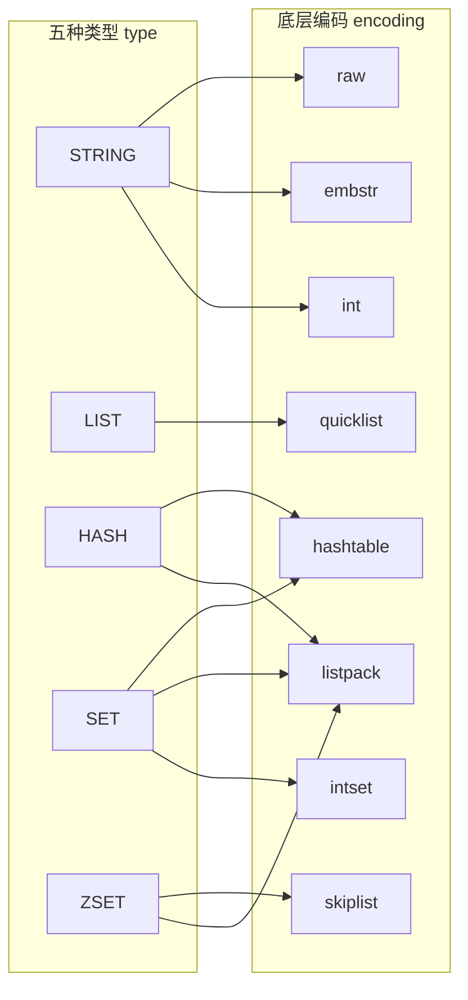
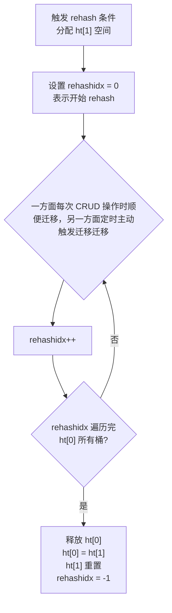

# Redis 数据结构

> **锚定版本**：Redis 7.0+
> **学习目标**：理解底层结构原理，掌握五种类型的编码转换条件，能讲清渐进式 rehash 和跳表的设计动机

## 一、redisObject 类型与编码的桥梁

Redis 并没有直接使用底层数据结构来实现键值对，而是基于这些底层数据结构构建了一个**对象系统**，称为 `redisObject`。每个键值对中的值都是一个 `redisObject`。

### 1.1 redisObject 结构

```c
// 源码路径：server.h
typedef struct redisObject {
    unsigned type:4;
    unsigned encoding:4;
    unsigned lru:24;
    int refcount;
    void *ptr;
} robj;
```

五个字段各自的作用：

| 字段 | 大小 | 说明 |
|------|------|------|
| **type** | 4 bit | 对象**类型**：STRING / LIST / HASH / SET / ZSET |
| **encoding** | 4 bit | 底层**编码方式**（同一种类型可以有多种编码） |
| **lru** | 24 bit | 记录对象**最后一次被访问的时间**（LRU）或访问频率（LFU），用于内存淘汰 |
| **refcount** | 4 字节 | **引用计数**，用于内存回收和对象共享（0-9999 整数共享池） |
| **ptr** | 8 字节 | 指向真正的底层数据结构实例的**指针** |

### 1.2 对象类型和编码的关系

**核心设计思想**：Redis 将"类型"和"编码"解耦。一种 `type` 可以对应多种 `encoding`，Redis 会根据数据规模和特征**自动选择最优编码**，在内存占用和性能之间取得平衡。这是 Redis 对内存优化的其中一个思想




### 1.3 查看数据的编码

```bash
# 示例
SET msg "hello"
OBJECT ENCODING msg    # -> "embstr"

SET bigstr "a very long string that exceeds 44 bytes limit for embstr encoding..."
OBJECT ENCODING bigstr # -> "raw"

SET counter 100
OBJECT ENCODING counter # -> "int"
```

> Redis 通过 redisObject 将类型和编码解耦，同一种类型在不同数据规模下自动选择最优编码，来达到内存使用和性能之间的最佳平衡

**学习重点**：理解 type / encoding 解耦的设计思想

## 二、SDS 简单动态字符串

SDS（Simple Dynamic String）是 Redis 自己实现的字符串抽象，**替代了 C 原生字符串**（以 `\0` 结尾的字符数组）。

### 2.1 SDS 结构

**Redis 5.0+ 引入五种头部**，根据字符串长度选择最合适的头部大小，进一步节省内存：

```c
// 源码路径：sds.h
// len < 2^5
struct __attribute__((__packed__)) sdshdr5 {
    unsigned char flags; /* 3 lsb of type, 5 msb of string length */
    char buf[];
};

// len < 2^8
struct __attribute__((__packed__)) sdshdr8 {
    uint8_t len;        /* 已使用长度 */
    uint8_t alloc;      /* 总分配长度（不含 header 和 \0）*/
    unsigned char flags; /* 低 3 位表示类型 */
    char buf[];
};

// len < 2^16
struct __attribute__((__packed__)) sdshdr16 {
    uint16_t len;
    uint16_t alloc;
    unsigned char flags;
    char buf[];
};

// len < 2^32
struct __attribute__((__packed__)) sdshdr32 {
    uint32_t len;
    uint32_t alloc;
    unsigned char flags;
    char buf[];
};

// len >= 2^32
struct __attribute__((__packed__)) sdshdr64 {
    uint64_t len;
    uint64_t alloc;
    unsigned char flags;
    char buf[];
};
```

**设计原因**：不同长度范围的字符串用不同大小的 `len` 和 `alloc` 字段。短字符串用 `uint8_t`（1 字节），长字符串用 `uint64_t`（8 字节），避免所有字符串都浪费空间。

### 2.2 SDS 对比 C 字符串的优势

**获取字符串长度**

- C 字符串需要遍历到 `\0` 才能知道字符串长度，时间复杂度是 O(N)
- SDS 可以直接通过 `len` 字段获取，更高效，时间复杂度是 O(1)，获取字符串长度的命令是 `STRLEN`

---

**二进制安全**

- C 字符串依赖 `\0` 来判断结尾，无法存储包含 `\0` 的二进制数据（图片、序列化对象等）
- SDS 依赖 `len` 来记录长度，与内容无关，可以存储任意二进制数据

---

**缓冲区溢出问题**

- C 字符串 `strcat` 不检查缓冲区，可能导致溢出覆盖相邻内存
- SDS `strcat` 拼接前会检查空间是否足够，不足则自动扩容

---

**空间预分配**

当 SDS 需要扩容时，Redis **不仅分配当前所需空间，还会预分配一些空间**，有效减少后续扩容的次数

策略：< 1MB 分配 2 倍，>= 1MB 固定多分配 1MB

---

**惰性释放**

`sdstrim` 截断字符串时，不立即释放多余内存，而是记录到 `free`（或 `alloc - len`）中，供将来使用。

---

再结合 2.1，SDS 对于 C 字符串的优势还有：设计了 5 种头部，**根据字符串长度来自动选择最小头部**，进一步节省内存

**学习重点**：SDS 相比 C 字符串的优势

## 三、Dict 字典 / 哈希表（核心重点）

字典是 Redis 最核心的数据结构之一。Redis 的键值对就是存在字典里的，Hash 类型底层也是字典。

### 3.1 哈希表结构 dictht

```c
// 源码路径：dict.h

typedef struct dictht {
    dictEntry **table;      // 哈希表数组（桶数组），每个元素是一个 dictEntry 链表
    unsigned long size;     // 哈希表大小（桶的数量，总是 2^n）
    unsigned long sizemask; // 哈希表大小掩码，用于计算索引值（ sizemask = size - 1 ）
    unsigned long used;     // 已有节点数量
} dictht;
```

### 3.2 字典结构 dict

```c
typedef struct dict {
    dictType *type;     // 类型特定函数（哈希函数、键比较、键销毁等）
    void *privdata;     // 私有数据（传给 type 中函数的附加参数）
    dictht ht[2];       // 两个哈希表（ht[0] 平时使用，ht[1] rehash 时使用）
    long rehashidx;     // rehash 索引（-1 表示不在 rehash）
    int16_t pauserehash; /* rehash 暂停标志 */
} dict;
```

**`ht[2]` 双哈希表设计是渐进式 rehash 的基础**。

### 3.3 哈希表节点 dictEntry

```c
typedef struct dictEntry {
    void *key;                   // 键
    union {
        void *val;               // 值（可以是任意类型指针）
        uint64_t u64;
        int64_t s64;
        double d;
    } v;                         // 值（用 union 节省内存）
    struct dictEntry *next;      // 指向下一个节点（链地址法解决冲突）
} dictEntry;
```

### 3.4 哈希算法

Redis 使用 **MurmurHash2** 算法计算哈希值：

```c
// 计算哈希值
hash = dict->type->hashFunction(key);

// 计算索引（通过 sizemask 做取模运算）
index = hash & dict->ht[x].sizemask;
```

MurmurHash2 的特点：简单快速、分布均匀、非加密型（不用于安全场景）。

### 3.5 哈希冲突：链地址法（头插法）

当多个键被分配到同一个桶时，用链表解决冲突。新节点采用**头插法**插入链表头部（O(1) 插入）。

### 3.6 渐进式 Rehash（核心重点）

**为什么需要渐进式 rehash？**

当哈希表的负载因子（`used / size`）过大或过小时，需要扩容或收缩。但一次性 rehash 几百万个键会导致服务长时间阻塞。Redis 采用**渐进式 rehash**，将 rehash 分摊到后续的每次 CRUD 操作中。

**渐进式 rehash 流程**：



**rehash 期间的 CRUD 规则**：

| 操作 | 规则 |
|------|------|
| **查找** | 先查 `ht[0]`，没找到再查 `ht[1]` |
| **新增** | 只写入 `ht[1]`（保证 ht[0] 的数据只会减少不会增加） |
| **修改** | 先在 `ht[0]` 找到就修改 `ht[0]`，否则修改 `ht[1]` |
| **删除** | 在 `ht[0]` 找到就删除 `ht[0]` 的，否则删除 `ht[1]` 的 |

**rehash 触发条件**：

| 操作 | 条件 | 说明 |
|------|------|------|
| **扩展** | 负载因子 >= 1，且**没有**在执行 BGSAVE/BGREWRITEAOF | 服务器空闲时扩展 |
| **扩展** | 负载因子 >= 5 | 强制扩展，不管是否在 BGSAVE |
| **收缩** | 负载因子 < 0.1 | 哈希表过于稀疏，浪费内存 |

```
负载因子 = used / size
```

**为什么 BGSAVE 期间不轻易扩展？**

BGSAVE/BGREWRITEAOF 使用 `fork()` 子进程，依赖操作系统 COW（写时复制）机制。如果此时扩展哈希表，会产生大量内存页的修改，触发大量 COW，消耗额外的内存和 CPU。所以 Redis 在 BGSAVE 期间提高扩展阈值到 5，尽量避免不必要的 rehash。

> Redis 字典使用 `ht[2]` 双哈希表实现渐进式 rehash。当负载因子达到阈值时，分配新的 ht[1]，然后把 rehash 分摊到后续每次 CRUD 操作中逐步迁移。rehash 期间查找会同时查两个表，新增只写 ht[1]。这样避免了一次性 rehash 几百万键导致服务阻塞。触发条件是负载因子 >= 1 时扩展（BGSAVE 期间阈值提高到 5），< 0.1 时收缩。

**学习重点**：渐进式 rehash 能手画流程图

## 四、SkipList 跳表

跳表是一种**多层有序数据结构**，通过在每个节点中**维持多个指向其他节点的指针**，实现 O(logN) 的查找、插入、删除。Redis 用跳表实现有序集合（ZSET）的底层结构之一。

### 4.1 跳表结构

```c
// 源码路径：server.h

// 跳表节点
typedef struct zskiplistNode {
    sds ele;                              // 成员对象（元素值）
    double score;                         // 分值（排序依据）
    struct zskiplistNode *backward;       // 后退指针（只能后退一个节点）
    // 节点的level数组，保存每层上的前向指针和跨度
    struct zskiplistLevel {
        struct zskiplistNode *forward;    // 前进指针
        unsigned long span;               // 跨度（用于计算排名）
    } level[];                            // 层（柔性数组，每个节点层数不同）
} zskiplistNode;

// 跳表结构
typedef struct zskiplist {
    struct zskiplistNode *header, *tail;  // 头尾节点
    unsigned long length;                 // 节点数量
    int level;                            // 最大层数
} zskiplist;
```

### 4.2 层级原理

每个跳表节点有 1~32 个层级，层数通过**幂次定律**随机生成：

每次生成随机数，看结果是否是偶数，如果是偶数那么再加一层，最多能加到32层；如果循环的过程中碰到随机的结果是奇数，那么就停下来，当前层数就是这个节点有的层数

伪代码：

int randomLevel() {
    int level = 1;                          // 第1层，每个节点必定有
    while (random() % 2 == 0) {             // 每次生成一个随机数
        level++;                            // 如果是偶数（50%概率），层数+1
        if (level == 32) break;             // 最多32层
    }
    return level;
}

```
层级生成规则（概率）：
  第 1 层：100%（每个节点都有）
  第 2 层：50%（1/2 概率有第 2 层）
  第 3 层：25%（1/4 概率有第 3 层）
  ...
  第 32 层：极低概率

平均每个节点的层数约为 1 / (1 - 0.5) = 2 层
```

`span`（跨度）字段的作用：记录当前节点到下一个节点之间跨越了多少个节点，**用于计算排名**。`ZRANK` 命令通过累加 span 得到排名。

### 4.3 查找过程（重点）


以查找 score=40 的节点为例：

- 从最高层 HEAD 开始，向右比较，发现第一个元素是 30，因为目标元素 40 > 30，所以继续往右走
- 往右走发现元素是 50，因为 50 > 目标元素 40，所以需要往下走一层
- 往下走之后发现右边第一个元素就是 40，结束查询过程

整个查询过程是从高层向右、向下逐步逼近目标，查找、插入、删除的时间复杂度都是 **O(logN)**。

### 5.4 为什么用跳表不用红黑树？（重点）

跳表是"带有快速通道的多层链表"，而红黑树是"会自动旋转保持平衡的二叉搜索树"，他们都是为了提高有序数据的访问和修改

**范围查询场景**

范围查询是 Redis 典型的使用场景，比如使用 `ZRANGEBYSCORE 60 80`，搜索 score 在 60~80 之间的元素

- 跳表只需要找到 score=60 的位置，作为起点，然后往后顺序遍历到 80 即可（最底层链表包含所有元素）
- 红黑树需要做中序遍历，假如数据分布在两棵子树中，递归搜索的过程会比较复杂

跳表找到起点后就是线性遍历；红黑树找到起点后还需要做中序遍历才能按顺序搜索到所有符合要求的节点

---

**实现复杂度**

跳表代码量远小于红黑树，更易于维护

---

**插入节点后的行为**

- 跳表在插入一个节点后：随机决定层数，找到插入位置，修改相邻节点的 forward 指针
- 红黑树插入一个节点后：可能还需要旋转、变色等操作来维护红黑树的平衡状态


**核心原因**：ZSET 的典型操作是 `ZRANGEBYSCORE`、`ZRANGE` 这类**范围查询**。跳表在找到起始点后，沿着最底层链表顺序遍历即可，非常自然。红黑树做范围查询需要中序遍历，实现复杂且不直观。此外，跳表的实现简单、易于调试维护，对于 Redis 这种对代码简洁性有高要求的项目非常重要。

> Redis 选用跳表而不是红黑树，核心原因是：第一，ZSET 最常用的操作是 ZRANGEBYSCORE 这类范围查询，跳表在找到起点后沿底层链表顺序遍历即可，红黑树做范围查询要中序遍历，不直观。第二，跳表实现简单，代码量远小于红黑树的旋转/变色逻辑，方便维护。第三，跳表内存占用可控，平均每节点约 2 层。Redis 作者 antirez 也在社区讨论中明确表达过这些理由。

**学习重点**：理解层级原理，能讲清"为什么用跳表不用红黑树"

## 五、IntSet —— 整数集合

**学习重点**：编码升级机制

- [ ] 结构：encoding + length + contents[]（有序存储，二分查找）
- [ ] 三种编码：int16 → int32 → int64
- [ ] 编码升级流程（插入大整数触发，从后往前重排）
- [ ] 升级不可降级（为什么？）

---

## 六、ListPack —— 压缩列表（Redis 7.0+）

**学习重点**：理解 ZipList 的连锁更新问题以及 ListPack 如何解决

- [ ] 整体结构：zlbytes + zltail + zllen + entries + zlend
- [ ] Entry 结构：prevlen（变长 1/5 字节）+ encoding + data
- [ ] **连锁更新问题**：prevlen 变长编码导致中间节点扩展引发连锁反应
- [ ] ListPack 的改进：记录自身长度而非前一节点长度，从根本上消除连锁更新
- [ ] 历史演进：Redis 7.0 起 listpack 替代 ziplist，无需再深究 ziplist 细节

---

## 七、QuickList —— 快速列表

**学习重点**：理解"分段 ziplist + 链表串联"的折中思想

- [ ] 设计思想：linkedlist（指针开销大）+ ziplist（大块 realloc 差）的折中
- [ ] 结构：双向链表，每个节点指向一个 listpack（Redis 7.0+）
- [ ] 中间节点 LZF 压缩（List 操作集中在两端）
- [ ] 关键配置：`list-max-listpack-size`、`list-compress-depth`

---

## 八、五种基础类型与编码转换（面试最高频）

**学习重点**：记住每种类型的编码转换条件和阈值，锚定 Redis 7.0+

### String

```
int（long 整数）→ embstr（<= 44 字节，只读）→ raw（> 44 字节）
```

- [ ] int：ptr 直接存值，不指向 SDS
- [ ] embstr：redisObject + SDS 一次 malloc 分配，连续内存，修改即转 raw
- [ ] raw：redisObject 和 SDS 分开分配

### List

```
quicklist（统一使用，内部为 listpack + linkedlist）
```

- [ ] Redis 3.2+ 统一为 quicklist，不再区分 ziplist/linkedlist
- [ ] Redis 7.0+ 内部用 listpack 替代 ziplist

### Hash

```
listpack（元素数 <= 512 且值 <= 64 字节）→ hashtable（超过阈值）
```

- [ ] 配置：`hash-max-listpack-entries`、`hash-max-listpack-value`

### Set

```
intset（全整数且 <= 512）→ listpack（7.2+，<= 128 且 <= 64 字节）→ hashtable
```

- [ ] Redis 7.2+ 新增 listpack 中间编码
- [ ] 配置：`set-max-intset-entries`、`set-max-listpack-entries`

### ZSet（Sorted Set）

```
listpack（元素数 <= 128 且值 <= 64 字节）→ skiplist + hashtable
```

- [ ] 为什么双结构：skiplist 负责范围查询 O(logN+M)，hashtable 负责单元素查找 O(1)
- [ ] 配置：`zset-max-listpack-entries`、`zset-max-listpack-value`

### 编码转换总结速记

| 类型 | 省内存编码 | 高性能编码 | 元素数阈值 | 值大小阈值 |
|------|-----------|-----------|-----------|-----------|
| String | int / embstr | raw | - | 44 字节 |
| List | quicklist（统一） | - | - | - |
| Hash | listpack | hashtable | 512 | 64 字节 |
| Set | intset / listpack | hashtable | 512 / 128 | 64 字节 |
| ZSet | listpack | skiplist + hashtable | 128 | 64 字节 |
