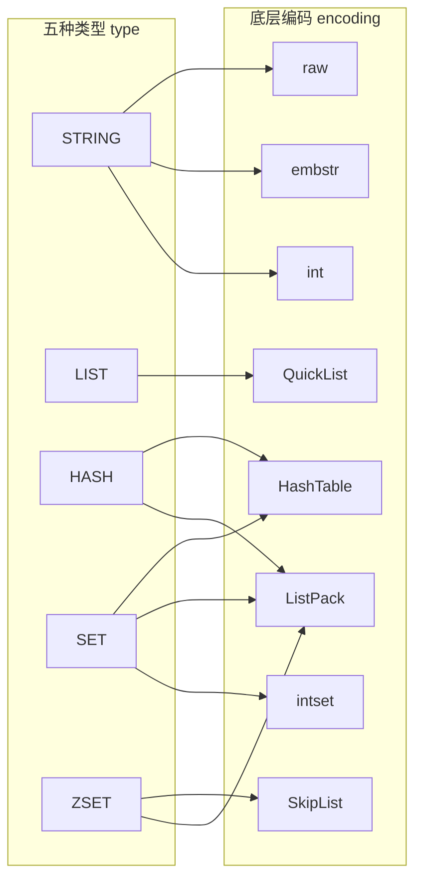
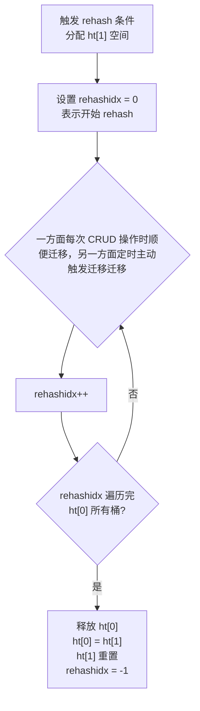
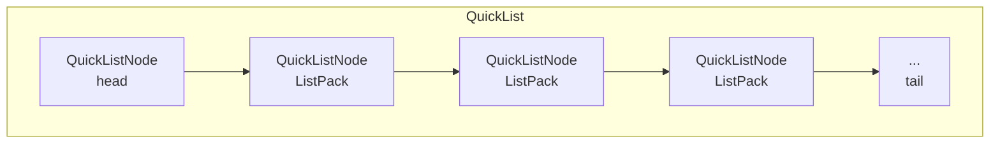

# Redis 数据结构

> 练习: [Redis 数据结构练习](./Redis-data-structure-exercises.md)
>
> 面试: [Redis 数据结构面试](./Redis-data-structure-interview.md)

> **锚定版本**：Redis 7.0+
> **学习目标**：理解底层结构原理，掌握五种类型的编码转换条件，能讲清渐进式 rehash 和跳表的设计动机

## 一、redisObject 类型与编码的桥梁

Redis 并没有直接使用底层数据结构来实现键值对，而是基于这些底层数据结构构建了一个**对象系统**，称为 `redisObject`。每个键值对中的值都是一个 `redisObject`。

### 1.1 redisObject 结构

```c
// 源码路径：server.h
typedef struct redisObject {
    unsigned type:4;
    unsigned encoding:4;
    unsigned lru:24;
    int refcount;
    void *ptr;
} robj;
```

五个字段各自的作用：

| 字段         | 大小   | 说明                                                                   |
| ------------ | ------ | ---------------------------------------------------------------------- |
| **type**     | 4 bit  | 对象**类型**：STRING / LIST / HASH / SET / ZSET                        |
| **encoding** | 4 bit  | 底层**编码方式**（同一种类型可以有多种编码）                           |
| **lru**      | 24 bit | 记录对象**最后一次被访问的时间**（LRU）或访问频率（LFU），用于内存淘汰 |
| **refcount** | 4 字节 | **引用计数**，用于内存回收和对象共享（0-9999 整数共享池）              |
| **ptr**      | 8 字节 | 指向真正的底层数据结构实例的**指针**                                   |

### 1.2 对象类型和编码的关系

**核心设计思想**：Redis 将"类型"和"编码"解耦。一种 `type` 可以对应多种 `encoding`，Redis 会根据数据规模和特征**自动选择最优编码**，在内存占用和性能之间取得平衡。这是 Redis 对内存优化的其中一个思想



### 1.3 查看数据的编码

```bash
# 示例
SET msg "hello"
OBJECT ENCODING msg    # -> "embstr"

SET bigstr "a very long string that exceeds 44 bytes limit for embstr encoding..."
OBJECT ENCODING bigstr # -> "raw"

SET counter 100
OBJECT ENCODING counter # -> "int"
```

> Redis 通过 redisObject 将类型和编码解耦，同一种类型在不同数据规模下自动选择最优编码，来达到内存使用和性能之间的最佳平衡

**学习重点**：理解 type / encoding 解耦的设计思想

## 二、SDS 简单动态字符串

SDS（Simple Dynamic String）是 Redis 自己实现的字符串抽象，**替代了 C 原生字符串**（以 `\0` 结尾的字符数组）。

### 2.1 SDS 结构

**Redis 5.0+ 引入五种头部**，根据字符串长度选择最合适的头部大小，进一步节省内存：

```c
// 源码路径：sds.h
// len < 2^5
struct __attribute__((__packed__)) sdshdr5 {
    unsigned char flags; /* 3 lsb of type, 5 msb of string length */
    char buf[];
};

// len < 2^8
struct __attribute__((__packed__)) sdshdr8 {
    uint8_t len;        /* 已使用长度 */
    uint8_t alloc;      /* 总分配长度（不含 header 和 \0）*/
    unsigned char flags; /* 低 3 位表示类型 */
    char buf[];
};

// len < 2^16
struct __attribute__((__packed__)) sdshdr16 {
    uint16_t len;
    uint16_t alloc;
    unsigned char flags;
    char buf[];
};

// len < 2^32
struct __attribute__((__packed__)) sdshdr32 {
    uint32_t len;
    uint32_t alloc;
    unsigned char flags;
    char buf[];
};

// len >= 2^32
struct __attribute__((__packed__)) sdshdr64 {
    uint64_t len;
    uint64_t alloc;
    unsigned char flags;
    char buf[];
};
```

**设计原因**：不同长度范围的字符串用不同大小的 `len` 和 `alloc` 字段。短字符串用 `uint8_t`（1 字节），长字符串用 `uint64_t`（8 字节），避免所有字符串都浪费空间。

### 2.2 SDS 对比 C 字符串的优势

**获取字符串长度**

- C 字符串需要遍历到 `\0` 才能知道字符串长度，时间复杂度是 O(N)
- SDS 可以直接通过 `len` 字段获取，更高效，时间复杂度是 O(1)，获取字符串长度的命令是 `STRLEN`

---

**二进制安全**

- C 字符串依赖 `\0` 来判断结尾，无法存储包含 `\0` 的二进制数据（图片、序列化对象等）
- SDS 依赖 `len` 来记录长度，与内容无关，可以存储任意二进制数据

---

**缓冲区溢出问题**

- C 字符串 `strcat` 不检查缓冲区，可能导致溢出覆盖相邻内存
- SDS `strcat` 拼接前会检查空间是否足够，不足则自动扩容

---

**空间预分配**

当 SDS 需要扩容时，Redis **不仅分配当前所需空间，还会预分配一些空间**，有效减少后续扩容的次数

策略：< 1MB 分配 2 倍，>= 1MB 固定多分配 1MB

---

**惰性释放**

`sdstrim` 截断字符串时，不立即释放多余内存，而是记录到 `free`（或 `alloc - len`）中，供将来使用。

---

再结合 2.1，SDS 对于 C 字符串的优势还有：设计了 5 种头部，**根据字符串长度来自动选择最小头部**，进一步节省内存

**学习重点**：SDS 相比 C 字符串的优势

## 三、Dict 字典 / 哈希表（核心重点）

字典是 Redis 最核心的数据结构之一。Redis 的键值对就是存在字典里的，Hash 类型底层也是字典。

### 3.1 哈希表结构 dictht

```c
// 源码路径：dict.h

typedef struct dictht {
    dictEntry **table;      // 哈希表数组（桶数组），每个元素是一个 dictEntry 链表
    unsigned long size;     // 哈希表大小（桶的数量，总是 2^n）
    unsigned long sizemask; // 哈希表大小掩码，用于计算索引值（ sizemask = size - 1 ）
    unsigned long used;     // 已有节点数量
} dictht;
```

### 3.2 字典结构 dict

```c
typedef struct dict {
    dictType *type;     // 类型特定函数（哈希函数、键比较、键销毁等）
    void *privdata;     // 私有数据（传给 type 中函数的附加参数）
    dictht ht[2];       // 两个哈希表（ht[0] 平时使用，ht[1] rehash 时使用）
    long rehashidx;     // rehash 索引（-1 表示不在 rehash）
    int16_t pauserehash; /* rehash 暂停标志 */
} dict;
```

**`ht[2]` 双哈希表设计是渐进式 rehash 的基础**。

### 3.3 哈希表节点 dictEntry

```c
typedef struct dictEntry {
    void *key;                   // 键
    union {
        void *val;               // 值（可以是任意类型指针）
        uint64_t u64;
        int64_t s64;
        double d;
    } v;                         // 值（用 union 节省内存）
    struct dictEntry *next;      // 指向下一个节点（链地址法解决冲突）
} dictEntry;
```

### 3.4 哈希算法

Redis 使用 **MurmurHash2** 算法计算哈希值：

```c
// 计算哈希值
hash = dict->type->hashFunction(key);

// 计算索引（通过 sizemask 做取模运算）
index = hash & dict->ht[x].sizemask;
```

MurmurHash2 的特点：简单快速、分布均匀、非加密型（不用于安全场景）。

### 3.5 哈希冲突：链地址法（头插法）

当多个键被分配到同一个桶时，用链表解决冲突。新节点采用**头插法**插入链表头部（O(1) 插入）。

### 3.6 渐进式 Rehash（核心重点）

**为什么需要渐进式 rehash？**

当哈希表的负载因子（`used / size`）过大或过小时，需要扩容或收缩。但一次性 rehash 几百万个键会导致服务长时间阻塞。Redis 采用**渐进式 rehash**，将 rehash 分摊到后续的每次 CRUD 操作中。

**渐进式 rehash 流程**：



**rehash 期间的 CRUD 规则**：

| 操作     | 规则                                                  |
| -------- | ----------------------------------------------------- |
| **查找** | 先查 `ht[0]`，没找到再查 `ht[1]`                      |
| **新增** | 只写入 `ht[1]`（保证 ht[0] 的数据只会减少不会增加）   |
| **修改** | 先在 `ht[0]` 找到就修改 `ht[0]`，否则修改 `ht[1]`     |
| **删除** | 在 `ht[0]` 找到就删除 `ht[0]` 的，否则删除 `ht[1]` 的 |

**rehash 触发条件**：

| 操作     | 条件                                                | 说明                        |
| -------- | --------------------------------------------------- | --------------------------- |
| **扩展** | 负载因子 >= 1，且**没有**在执行 BGSAVE/BGREWRITEAOF | 服务器空闲时扩展            |
| **扩展** | 负载因子 >= 5                                       | 强制扩展，不管是否在 BGSAVE |
| **收缩** | 负载因子 < 0.1                                      | 哈希表过于稀疏，浪费内存    |

```
负载因子 = used / size
```

**为什么 BGSAVE 期间不轻易扩展？**

BGSAVE/BGREWRITEAOF 使用 `fork()` 子进程，依赖操作系统 COW（写时复制）机制。如果此时扩展哈希表，会产生大量内存页的修改，触发大量 COW，消耗额外的内存和 CPU。所以 Redis 在 BGSAVE 期间提高扩展阈值到 5，尽量避免不必要的 rehash。

> Redis 字典使用 `ht[2]` 双哈希表实现渐进式 rehash。当负载因子达到阈值时，分配新的 ht[1]，然后把 rehash 分摊到后续每次 CRUD 操作中逐步迁移。rehash 期间查找会同时查两个表，新增只写 ht[1]。这样避免了一次性 rehash 几百万键导致服务阻塞。触发条件是负载因子 >= 1 时扩展（BGSAVE 期间阈值提高到 5），< 0.1 时收缩。

**学习重点**：渐进式 rehash 能手画流程图

## 四、SkipList 跳表

跳表是一种**多层有序数据结构**，通过在每个节点中**维持多个指向其他节点的指针**，实现 O(logN) 的查找、插入、删除。Redis 用跳表实现有序集合（ZSET）的底层结构之一。

### 4.1 跳表结构

```c
// 源码路径：server.h

// 跳表节点
typedef struct zSkipListNode {
    sds ele;                              // 成员对象（元素值）
    double score;                         // 分值（排序依据）
    struct zSkipListNode *backward;       // 后退指针（只能后退一个节点）
    // 节点的level数组，保存每层上的前向指针和跨度
    struct zSkipListLevel {
        struct zSkipListNode *forward;    // 前进指针
        unsigned long span;               // 跨度（用于计算排名）
    } level[];                            // 层（柔性数组，每个节点层数不同）
} zSkipListNode;

// 跳表结构
typedef struct zSkipList {
    struct zSkipListNode *header, *tail;  // 头尾节点
    unsigned long length;                 // 节点数量
    int level;                            // 最大层数
} zSkipList;
```

### 4.2 层级原理

每个跳表节点有 1~32 个层级，层数通过**幂次定律**随机生成：

每次生成随机数，看结果是否是偶数，如果是偶数那么再加一层，最多能加到32层；如果循环的过程中碰到随机的结果是奇数，那么就停下来，当前层数就是这个节点有的层数

伪代码：

int randomLevel() {
int level = 1; // 第1层，每个节点必定有
while (random() % 2 == 0) { // 每次生成一个随机数
level++; // 如果是偶数（50%概率），层数+1
if (level == 32) break; // 最多32层
}
return level;
}

```
层级生成规则（概率）：
  第 1 层：100%（每个节点都有）
  第 2 层：50%（1/2 概率有第 2 层）
  第 3 层：25%（1/4 概率有第 3 层）
  ...
  第 32 层：极低概率

平均每个节点的层数约为 1 / (1 - 0.5) = 2 层
```

`span`（跨度）字段的作用：记录当前节点到下一个节点之间跨越了多少个节点，**用于计算排名**。`ZRANK` 命令通过累加 span 得到排名。

### 4.3 查找过程（重点）


以查找 score=40 的节点为例：

- 从最高层 HEAD 开始，向右比较，发现第一个元素是 30，因为目标元素 40 > 30，所以继续往右走
- 往右走发现元素是 50，因为 50 > 目标元素 40，所以需要往下走一层
- 往下走之后发现右边第一个元素就是 40，结束查询过程

整个查询过程是从高层向右、向下逐步逼近目标，查找、插入、删除的时间复杂度都是 **O(logN)**。

### 5.4 为什么用跳表不用红黑树？（重点）

跳表是"带有快速通道的多层链表"，而红黑树是"会自动旋转保持平衡的二叉搜索树"，他们都是为了提高有序数据的访问和修改

**范围查询场景**

范围查询是 Redis 典型的使用场景，比如使用 `ZRANGEBYSCORE 60 80`，搜索 score 在 60~80 之间的元素

- 跳表只需要找到 score=60 的位置，作为起点，然后往后顺序遍历到 80 即可（最底层链表包含所有元素）
- 红黑树需要做中序遍历，假如数据分布在两棵子树中，递归搜索的过程会比较复杂

跳表找到起点后就是线性遍历；红黑树找到起点后还需要做中序遍历才能按顺序搜索到所有符合要求的节点

---

**实现复杂度**

跳表代码量远小于红黑树，更易于维护

---

**插入节点后的行为**

- 跳表在插入一个节点后：随机决定层数，找到插入位置，修改相邻节点的 forward 指针
- 红黑树插入一个节点后：可能还需要旋转、变色等操作来维护红黑树的平衡状态

**核心原因**：ZSET 的典型操作是 `ZRANGEBYSCORE`、`ZRANGE` 这类**范围查询**。跳表在找到起始点后，沿着最底层链表顺序遍历即可，非常自然。红黑树做范围查询需要中序遍历，实现复杂且不直观。此外，跳表的实现简单、易于调试维护，对于 Redis 这种对代码简洁性有高要求的项目非常重要。

> Redis 选用跳表而不是红黑树，核心原因是：第一，ZSET 最常用的操作是 ZRANGEBYSCORE 这类范围查询，跳表在找到起点后沿底层链表顺序遍历即可，红黑树做范围查询要中序遍历，不直观。第二，跳表实现简单，代码量远小于红黑树的旋转/变色逻辑，方便维护。第三，跳表内存占用可控，平均每节点约 2 层。Redis 作者 antirez 也在社区讨论中明确表达过这些理由。

**学习重点**：理解层级原理，能讲清"为什么用跳表不用红黑树"

## 五、IntSet —— 整数集合

整数集合是 Set 类型的底层编码之一，当集合中的元素**全部是整数**且**数量不多**时使用。

### 5.1 IntSet 结构

```c
// 源码路径：intset.h

typedef struct intset {
    uint32_t encoding;    // 编码方式：INT16 / INT32 / INT64
    uint32_t length;      // 元素数量
    int8_t contents[];    // 保存元素的数组（声明为 int8_t 但实际类型取决于 encoding）
} intset;
```

**IntSet 中的元素是有序的（从小到大排列）**，因此查找使用**二分查找**，时间复杂度 O(logN)。

### 5.2 编码升级

当插入一个新元素，其类型超出当前 `encoding` 的范围时，需要**升级**整个数组。

**升级过程示例**：当前 encoding = INT16（存了 1, 2, 3），插入 65535（超出 int16 范围）。

1. 升级为 INT32 编码
2. 数组从 3 _ 2 字节扩展到 4 _ 4 字节
3. 从后往前移动：3 -> 新位置, 2 -> 新位置, 1 -> 新位置
4. 插入 65535 到对应位置

> 从后往前移动的原因：避免前面的元素重新计算编码后覆盖掉后面未处理的元素

---

**关键特性：升级不可降级**。一旦从 INT16 升级到 INT32，即使后来删除了大整数元素，encoding 也不会回退，原因：

- 避免频繁的内存重分配
- 降级需要遍历所有元素判断是否可以安全降级，增加复杂度
- 实际使用中 IntSet 元素数量很少（默认阈值 512），内存浪费可忽略

> IntSet 是 Set 类型在元素全为整数且数量不超过 512 个时的底层编码。IntSet 内部元素都是有序排序的，适合用二分查询。它有三个编码等级（int16/int32/int64），当插入的元素超出当前编码范围时会触发升级：扩展数组、按新编码从后往前重排元素、插入新元素。注意升级是不可逆的，不会降级。

**学习重点**：编码升级机制

---

## 六、ListPack —— 压缩列表（Redis 7.0+）

ListPack 是 Redis 7.0 引入的紧凑数据结构，用于替代 ZipList。它是一块**连续内存**中存储多个元素的紧凑结构，是 Hash、ZSet、Set 在数据量少时的底层编码，也作为 QuickList 内部节点的存储容器。

### 6.1 ListPack 结构

**整体结构**：

```
+---------------+-----------------+---------+---------+-----+-----------+
| total-bytes   | num-elements    | entry1  | entry2  | ... | end (0xFF)|
| 4 字节        | 4 字节          |  变长   |  变长   |     | 1 字节    |
+---------------+-----------------+---------+---------+-----+-----------+
```

| 字段             | 大小   | 说明                         |
| ---------------- | ------ | ---------------------------- |
| **total-bytes**  | 4 字节 | 整个 ListPack 占用的总字节数 |
| **num-elements** | 4 字节 | 元素数量                     |
| **entryX**       | 变长   | 各个元素节点                 |
| **end**          | 1 字节 | 结束标记（固定值 0xFF）      |

**Entry 结构**：

```
+----------+----------+-----------+
| encoding |   data   |  backlen  |
|  1-5 字节 |  变长    |  1-5 字节  |
+----------+----------+-----------+
```

- **encoding**：记录当前 entry 的数据类型和长度（整数或字符串）
- **data**：实际存储的数据
- **backlen**：记录当前 entry 的自身长度（用于从后向前遍历时定位前一个 entry）

> **关键设计**：ListPack 的每个 entry 记录的是**自身长度**（backlen），而不是前一节点的长度。这是它区别于 ZipList 的核心改进。

### 6.2 为什么用 ListPack？（对比 ZipList）

**ZipList 的连锁更新问题**：

ZipList 的每个 entry 用 `prevlen` 字段记录**前一节点的长度**。当 prevlen < 254 时用 1 字节存储，>= 254 时用 5 字节存储。如果连续多个 entry 恰好在临界大小，在头部插入一个大 entry 会触发连锁反应——一个 entry 扩展导致下一个 entry 的 prevlen 也要扩展，最坏情况 O(N) 次内存重分配。


**ListPack 的解决方案**：

```
ZipList entry:  prevlen + encoding + data    （记录前一节点长度）
ListPack entry: encoding + data + backlen    （记录自身长度）
```

ListPack 的 entry 改为记录自身长度（backlen），修改某个 entry 不会影响其他 entry 的长度信息，**从根源上消除了连锁更新**。

> ListPack 是 Redis 7.0 引入的紧凑数据结构，用于替代 ZipList。ZipList 的问题是每个 entry 记录前一节点长度（prevlen），当节点长度变化可能引发连锁更新——一个节点扩展导致后续所有节点的 prevlen 都要扩展，最坏 O(N) 次内存重分配。ListPack 的 entry 改为记录自身长度（backlen），修改某个 entry 不会影响其他 entry，从根本上消除了连锁更新。

### 6.3 ListPack 的适用场景

- **数据量少时的省内存方案**：连续内存、无指针开销、紧凑编码，元素少时比 HashTable 节省大量内存
- **用于 Hash、ZSet、Set（Redis 7.2+）的小数据编码**：元素数量和值大小不超过阈值时使用 ListPack，超过则转换为 HashTable/SkipList
- **作为 QuickList 内部节点的存储容器**：List 类型的每个 QuickListNode 内部就是一个 ListPack

**学习重点**：理解 ZipList 的连锁更新问题以及 ListPack 如何解决

---

## 七、QuickList —— 快速列表

QuickList 是 **ListPack + LinkedList 的折中方案**，是 List 类型的统一底层实现。

### 7.1 设计思想

```
LinkedList：每个节点存一个元素 -> 指针开销大，内存碎片多
单个大 ListPack：一块连续内存 -> 数据多时 realloc 性能差

QuickList：把数据分成多段，每段用 ListPack 存储，段与段之间用 LinkedList 串联
```

### 7.2 QuickList 结构

```c
// 源码路径：QuickList.h

typedef struct QuickListNode {
    struct QuickListNode *prev;      // 前驱节点
    struct QuickListNode *next;      // 后继节点
    unsigned char *entry;            // 指向 ListPack
    size_t size;                     // entry 指向的数据大小（字节）
    unsigned int count;              // entry 中的元素数量
    unsigned int encoding;           // 编码方式：RAW 或 LZF
    unsigned int container;          // 容器类型：Redis 7.0+ 统一为 ListPack
    unsigned int recompress;         // 是否需要再次压缩
    unsigned int attempted_compress; /* 测试用 */
    unsigned int extra;              /* 预留字段 */
} QuickListNode;

typedef struct QuickList {
    QuickListNode *head;             // 头节点
    QuickListNode *tail;             // 尾节点
    unsigned long count;             // 所有元素总数
    unsigned long len;               // QuickListNode 节点数量
    int fill;                        // 每个 ListPack 的最大大小（负数表示字节数限制）
    unsigned int compress;           // 压缩深度（0 = 不压缩）
    unsigned int bookmark_count;     /* 书签数量 */
    QuickListBookmark bookmarks[];   /* 可选的书签 */
} QuickList;
```



### 7.4 中间节点压缩

QuickList 支持对中间节点使用 **LZF 压缩**，因为 List 操作通常集中在两端（LPUSH/RPUSH/LPOP/RPOP），中间节点很少被访问。压缩可以显著节省内存。

> QuickList 是 List 类型的统一底层实现，是 ListPack 和 LinkedList 的折中方案。它把数据分成多段，每段用一个 ListPack 存储（连续内存、省空间），段与段之间用双向链表连接（避免单个大 ListPack 的性能问题）。还支持对中间不常访问的节点进行 LZF 压缩。

**学习重点**：理解"分段 ZipList + 链表串联"的折中思想

---

## 八、五种基础类型与编码转换

Redis 的五种基础数据类型在不同条件下会使用不同的底层编码，理解编码转换条件和原因非常关键。

**学习重点**：记住每种类型的编码转换条件和阈值

### 8.1 String

| 编码       | 条件                       | 内存分配         | 特点                                                        |
| ---------- | -------------------------- | ---------------- | ----------------------------------------------------------- |
| **int**    | 值可以用 `long` 表示的整数 | 1 次             | `ptr` 直接存储整数值，不指向 SDS                            |
| **embstr** | 字符串长度 <= 44 字节      | 1 次（连续内存） | redisObject 和 SDS 一起分配，CPU 缓存友好，一旦修改即转 raw |
| **raw**    | 字符串长度 > 44 字节       | 2 次（分开分配） | redisObject 和 SDS 各自独立分配                             |

**embstr vs raw 的关键区别**：

```
embstr 内存布局（连续）：
+-------------+----------+-----+
| redisObject | sdshdr   | buf |
+-------------+----------+-----+
<-------- 一次 malloc -------->

raw 内存布局（分离）：
+-------------+       +----------+-----+
| redisObject |  ptr  | sdshdr   | buf |
+-------------+ ----> +----------+-----+
<-- malloc -->        <--- malloc --->
```

**embstr 修改时转为 raw**：embstr 是只读的，任何修改操作（如 APPEND）都会将其转为 raw，因为 embstr 的连续内存布局不好做扩容。

### 8.2 List

List 类型底层编码统一使用 **QuickList**，不存在编码转换。

- 每个 QuickListNode 内部是一个 ListPack（连续内存、紧凑编码）
- QuickListNode 之间用双向链表(LinkedList)连接
- 支持对中间节点进行 LZF 压缩，节省内存

### 8.3 Hash

| 编码          | 条件                              | 配置参数 |
| ------------- | --------------------------------- | -------- |
| **ListPack**  | 元素数 <= 512 且每个值 <= 64 字节 | -        |
| **HashTable** | 超过任一阈值                      | -        |

### 8.4 Set

| 编码          | 条件                            | 配置参数 |
| ------------- | ------------------------------- | -------- |
| **intset**    | 所有元素都是整数且数量 <= 512   | -        |
| **ListPack**  | 元素数 <= 128 且每个 <= 64 字节 | -        |
| **HashTable** | 超过上述任一阈值                | -        |

> **注意**：intset 优先级高于 ListPack。当集合元素全是整数且数量不超过 512 时使用 intset；当包含非整数元素但元素数量较少时使用 ListPack；超过阈值则统一转为 HashTable。

### 8.5 ZSet（Sorted Set）

| 编码                     | 条件                              | 配置参数 |
| ------------------------ | --------------------------------- | -------- |
| **ListPack**             | 元素数 <= 128 且每个值 <= 64 字节 | -        |
| **SkipList + HashTable** | 超过任一阈值                      | -        |

**为什么 ZSet 用 SkipList + HashTable 双结构？**

这是一个重要的设计问题。ZSet 同时需要支持两种操作：

- **范围查询**（ZRANGEBYSCORE、ZRANGE）：由 **SkipList** 负责，O(logN + M)
- **单元素查找**（ZSCORE、ZREM）：由 **HashTable** 负责，O(1)

如果只有 SkipList，ZSCORE 需要遍历跳表，是 O(logN)；如果只有 HashTable，范围查询无法高效实现。两者结合，各取所长。

### 8.6 编码转换总结速记

| 类型       | 编码 1（省内存）                   | 编码 2（高性能）     | 元素数阈值 | 值大小阈值               |
| ---------- | ---------------------------------- | -------------------- | ---------- | ------------------------ |
| **String** | int / embstr                       | raw                  | -          | 44 字节（embstr vs raw） |
| **List**   | QuickList（ListPack + LinkedList） | -                    | -          | -                        |
| **Hash**   | ListPack                           | HashTable            | 512        | 64 字节                  |
| **Set**    | intset / ListPack                  | HashTable            | 512 / 128  | 64 字节                  |
| **ZSet**   | ListPack                           | SkipList + HashTable | 128        | 64 字节                  |

> Redis 的五种基础类型都支持多种底层编码，核心思想是在数据量小时用紧凑编码（ListPack/intset）节省内存，数据量大时自动转为通用结构（HashTable/SkipList）保证性能。String 有 int/embstr/raw 三种，embstr 用于 44 字节以内的短字符串，一次内存分配且只读，修改就转 raw。Hash 的阈值是 512 个元素或 64 字节的值。ZSet 用 SkipList + HashTable 双结构，SkipList 负责范围查询，HashTable 负责 O(1) 单元素查找。可以用 `OBJECT ENCODING` 命令验证当前编码。

## 九、总结核心要点

1. **redisObject** 是 Redis 对象系统的核心，type 和 encoding 解耦，`OBJECT ENCODING` 可查看编码
2. **SDS** 相比 C 字符串：O(1) 长度、二进制安全、防溢出、空间预分配（2x / 1MB）、惰性释放
3. **字典的渐进式 rehash** `ht[2]` 双表、分步迁移、查找双表、新增只写 `ht[1]`
4. **跳表 vs 红黑树**：实现简单、范围查询方便、内存可控，是 Redis 的理性选择
5. **连锁更新**是 ziplist 的历史问题，Redis 7.0 的 ListPack 通过记录自身长度已彻底解决
6. **编码转换**：数据少用紧凑编码省内存，数据多自动转通用结构保性能，阈值需记住

> 练习: [Redis 数据结构练习](./Redis-data-structure-exercises.md)
>
> 面试: [Redis 数据结构面试](./Redis-data-structure-interview.md)
