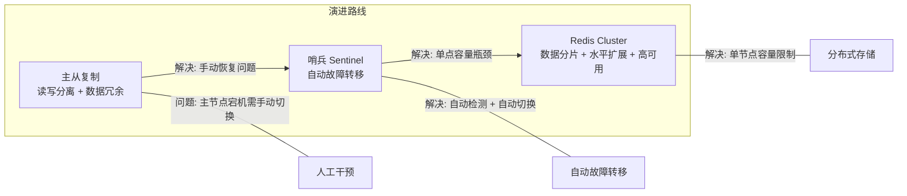
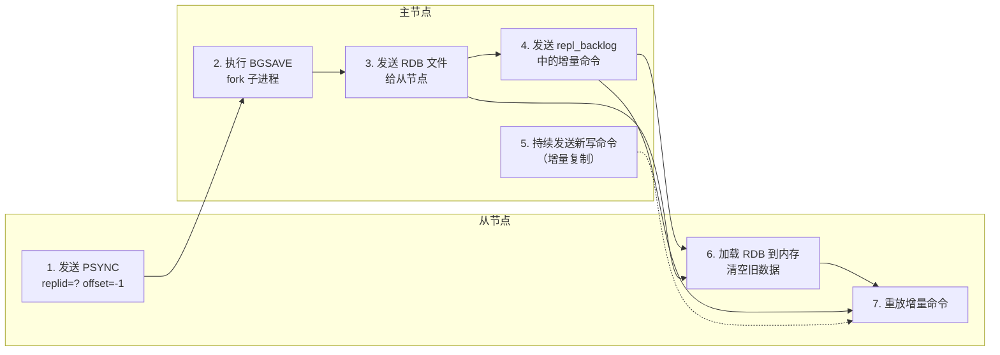
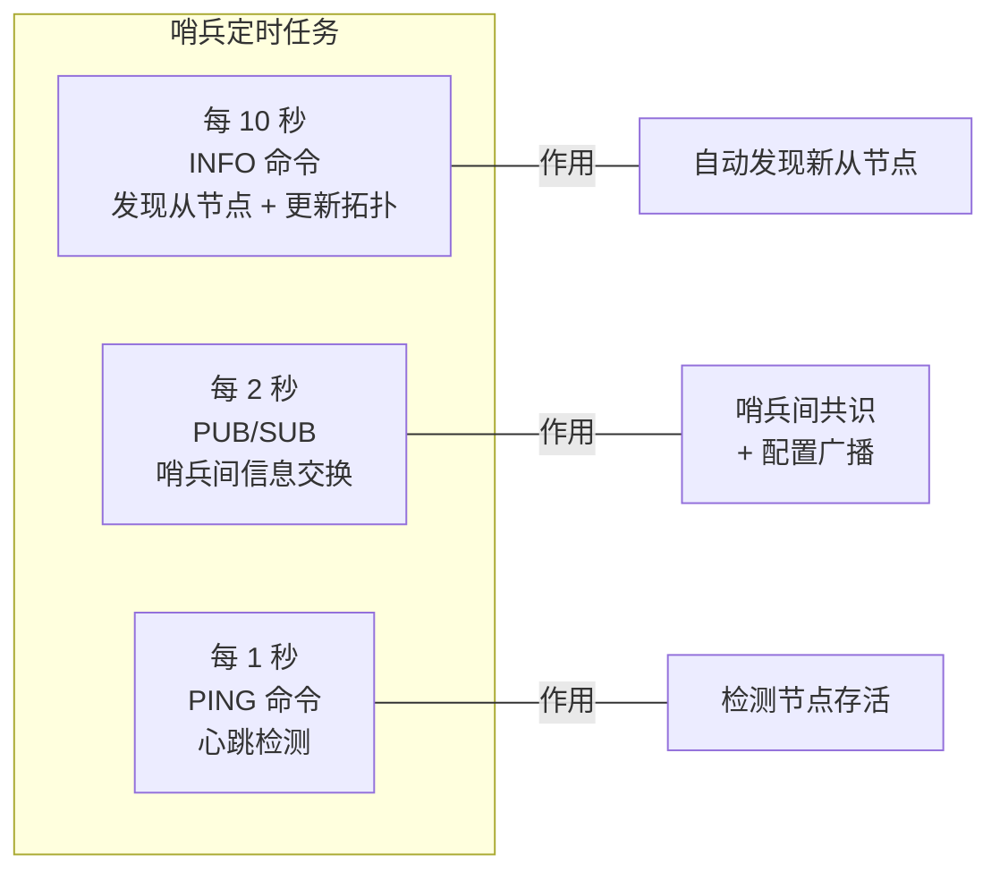
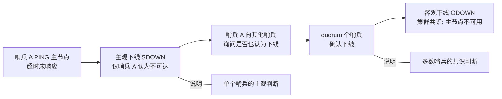
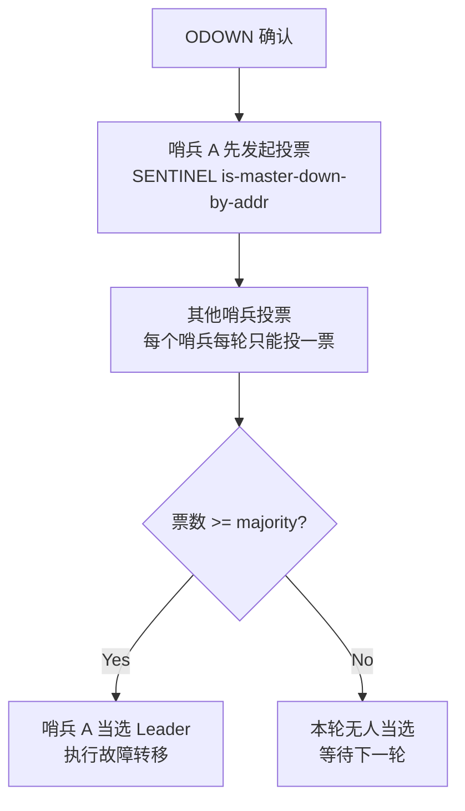
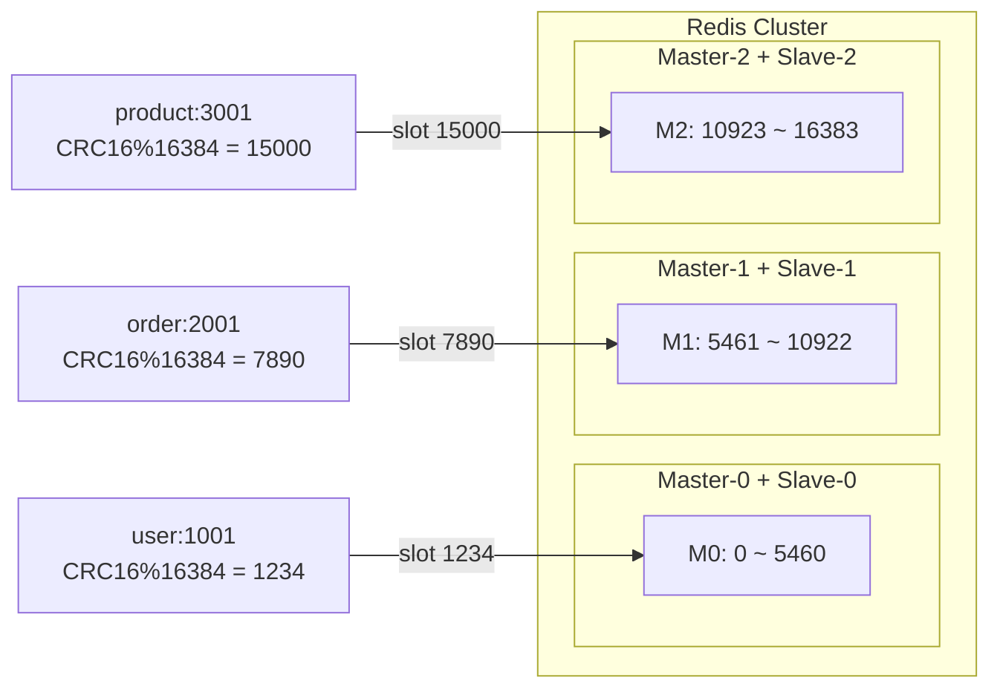
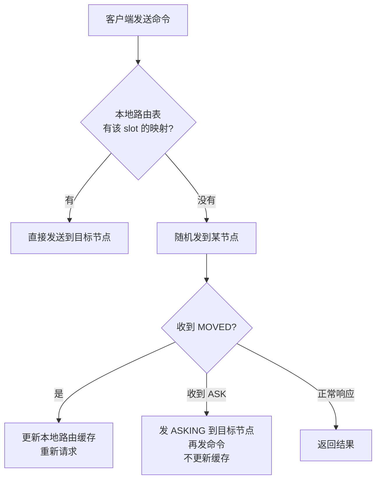
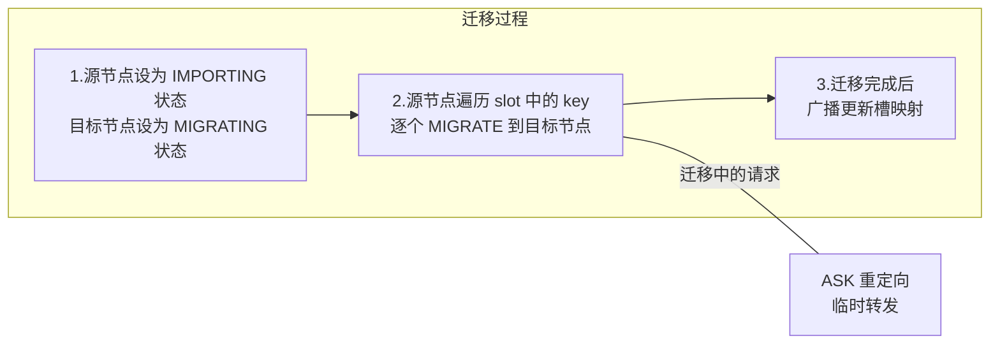

# Redis 高可用架构

> 练习: [Redis 高可用架构练习](./Redis-high-availability-exercises.md)
>
> 面试: [Redis 高可用架构面试](./Redis-high-availability-interview.md)

## 一、高可用全景图

Redis 高可用从简单到复杂经历了三个阶段，每个阶段解决不同的可用性问题：



| 方案 | 数据量上限 | 可用性 | 复杂度 | 适用场景 |
|------|-----------|--------|--------|---------|
| 主从复制 | 单机内存 | 低（手动恢复） | 低 | 读写分离、备份 |
| 主从 + 哨兵 | 单机内存 | 高（自动恢复） | 中 | 中小规模、高可用 |
| Redis Cluster | 多机汇总 | 高（自动恢复） | 高 | 大规模、高性能 |

**面试关键认知**：三种方案不是互斥的，Cluster 内部本身就包含了主从复制。生产环境选择的核心依据是**数据量是否超过单机内存上限**。

---

## 二、主从复制（⭐ 最高频）

### 2.1 为什么需要主从复制

```
        ┌──────────────┐
        │   Master     │
        │ (读 + 写)    │
        └──────┬───────┘
               │ 复制
       ┌───────┼───────┐
       ▼       ▼       ▼
   ┌───────┐┌───────┐┌───────┐
   │Slave-1││Slave-2││Slave-3│
   │(只读) ││(只读) ││(只读) │
   └───────┘└───────┘└───────┘
```

三个核心价值：
1. **读写分离** — 主节点处理写，从节点处理读，提升读 QPS
2. **数据冗余** — 从节点是主节点的实时副本，可用于数据备份
3. **故障恢复基础** — 从节点保存了完整数据，是哨兵/集群故障转移的前提

### 2.2 PSYNC 命令与复制流程（⭐ 必考）

Redis 2.8 之前用 `SYNC` 命令（只有全量复制），2.8+ 用 `PSYNC`（支持增量复制）。

#### PSYNC 命令格式

```
PSYNC <replid> <offset>
```

- **replid**：主节点的 replication ID（类似 run_id，标识一次复制周期）
- **offset**：从节点的复制偏移量（已接收多少字节的复制流）

#### 全量复制 vs 增量复制判断

主节点收到 PSYNC 后的判断逻辑：

```
从节点发送 PSYNC replid offset
        │
        ▼
  replid 匹配? ──── No ──→ 全量复制（FIRST PSYNC）
        │
       Yes
        │
        ▼
  offset 在 repl_backlog 范围内? ──── No ──→ 全量复制（backlog 不够）
        │
       Yes
        │
        ▼
  增量复制（发送 backlog 中 offset 之后的数据）
```

#### 全量复制完整流程（⭐ 必考）



**关键步骤详解**：

| 步骤 | 动作 | 说明 |
|------|------|------|
| 1 | 从节点发送 PSYNC | 首次连接 replid=? offset=-1 |
| 2 | 主节点 BGSAVE | fork 子进程生成 RDB |
| 3 | 发送 RDB 文件 | 期间主节点的写操作记录到 repl_backlog |
| 4 | 发送增量命令 | fork 期间积累的增量数据 |
| 5 | 持续增量同步 | 正常运行后的增量复制 |
| 6 | 从节点加载 RDB | 清空旧数据，加载新 RDB |
| 7 | 重放增量命令 | 追上主节点的最新状态 |

> **面试重点**：全量复制期间，从节点处于不可用状态（加载 RDB 中），无法响应读请求。

#### 增量复制流程

增量复制依赖 **repl_backlog（复制积压缓冲区）**：

```
repl_backlog（环形缓冲区，默认 1MB）
┌──────────────────────────────────────────┐
│  已被覆盖的数据 │  有效数据（offset 区间）  │
│                │  ← offset A ← offset B  │
└──────────────────────────────────────────┘
                  ↑                        ↑
            master_repl_offset        从节点请求的 offset

如果从节点请求的 offset 在缓冲区范围内 → 增量复制
如果 offset 已被覆盖 → 回退到全量复制
```

**repl_backlog 大小配置**：
```
# 默认 1MB，建议按公式计算
repl-backlog-size 10mb

# 计算公式: 主节点每秒写入量 * 断线重连最大时间
# 例如: 1MB/s * 60s = 60MB
```

### 2.3 心跳检测

主从节点之间通过定期命令维持连接、同步状态：

| 命令 | 方向 | 频率 | 作用 |
|------|------|------|------|
| PING | 主→从 | 每 10 秒（可配） | 检测从节点是否存活 |
| REPLCONF ACK | 从→主 | 每 1 秒 | 上报从节点的 offset，用于判断增量复制可行性 |
| CMD | 主→从 | 实时 | 传播写命令 |

---

## 三、哨兵 Sentinel（⭐ 最高频）

### 3.1 哨兵概述

哨兵是 Redis 高可用的核心组件，解决了主从复制中**主节点宕机需要人工干预**的问题。

```
            ┌──────────────┐
            │   Master     │
            └──────┬───────┘
           ┌───────┼───────┐
           ▼       ▼       ▼
       ┌──────┐┌──────┐┌──────┐
       │Slave ││Slave ││Slave │
       └──────┘└──────┘└──────┘

       ┌──────┐┌──────┐┌──────┐
       │Sent1 ││Sent2 ││Sent3 │  ← 哨兵集群（至少 3 个）
       └──────┘└──────┘└──────┘
         监控所有主从节点
```

**哨兵的四大职责**：
1. **监控** — 持续检测主从节点是否正常
2. **通知** — 故障时通知管理员或应用
3. **自动故障转移** — 主节点宕机时自动将从节点提升为新主
4. **配置提供者** — 客户端通过哨兵获取当前主节点地址

### 3.2 哨兵的三个定时任务



| 频率 | 命令 | 对象 | 作用 |
|------|------|------|------|
| 每 10 秒 | INFO | 主节点 | 获取从节点列表、更新拓扑 |
| 每 2 秒 | PUBLISH/SUBSCRIBE | 所有节点 | 哨兵间交换信息（`__sentinel__:hello` 频道） |
| 每 1 秒 | PING | 主从 + 其他哨兵 | 检测节点是否存活 |


### 3.3 主观下线与客观下线（⭐ 高频）



**SDOWN（Subjectively Down）**：
- 单个哨兵认为主节点不可达
- 判定条件：`down-after-milliseconds`（默认 30 秒）内未收到有效 PING 响应
- 这是**主观**判断，不代表主节点真的挂了（可能是网络问题）

**ODOWN（Objectively Down）**：
- quorum 个哨兵都认为主节点不可达
- 判定条件：`sentinel monitor mymaster ip port quorum` 中配置的 quorum 值
- 这是**客观**共识，触发故障转移的前置条件

> **面试易错点**：quorum 不是"要多少个哨兵同意才能 failover"，而是"多少个哨兵确认主节点下线"。真正执行 failover 还需要 **majority（超过半数哨兵）** 授权。


### 3.4 哨兵 Leader 选举（⭐ 高频）

ODOWN 之后，需要选出一个哨兵来执行故障转移。这就是 Leader 选举。

**选举规则（Raft 协议简化版）**：



**关键规则**：
1. **先到先得** — 每个 Sentinel 都会尝试成为 Leader，谁先发起投票谁有优势
2. **每轮一票** — 每个 Sentinel 在一轮选举中只能投给一个候选者
3. **多数原则** — 获得超过半数 Sentinel 投票才能当选
4. **单次任期** — 一个 Sentinel 在一个 configuration epoch 中只能发起一次选举

> **为什么不用主节点来选 Leader？** 哨兵设计为与数据平面解耦。主节点已经挂了，无法参与选举。而且哨兵需要独立于主从架构来保证判断的公正性。

### 3.5 故障转移流程（⭐ 必考）

Leader 哨兵当选后，执行以下完整流程：


**步骤详解**：

**Step 1 — 选主规则**：

按优先级依次筛选，选出最合适的从节点：

| 优先级 | 规则 | 说明 |
|--------|------|------|
| 1 | `replica-priority`（优先级） | 值越小优先级越高，默认 100。设为 0 则永不选为主 |
| 2 | `replication offset`（复制偏移量） | 选 offset 最大的，数据最新最完整 |
| 3 | `run_id`（字典序最小） | 如果以上都一样，选 run_id 最小的（确定性选择） |

**Step 2 — 晋升**：
```redis
# Leader 哨兵对选中从节点执行
SLAVEOF NO ONE   # 从节点变为主节点
```

**Step 3 — 重新配置**：
```redis
# Leader 哨兵让其他从节点复制新主
SLAVEOF <new-master-ip> <new-master-port>
```

**Step 4 — 更新配置**：
- 通过 `__sentinel__:hello` 频道广播新主节点信息
- 所有 Sentinel 更新本地配置
- 客户端通过 Sentinel 获取新主地址

源码路径：`sentinel.c:sentinelFailoverStateMachine()` — 故障转移状态机

### 3.6 哨兵配置要点

```redis
# 哨兵核心配置
sentinel monitor mymaster 127.0.0.1 6379 2    # 监控主节点，quorum=2
sentinel down-after-milliseconds mymaster 30000 # SDOWN 判定时间 30s
sentinel failover-timeout mymaster 180000       # 故障转移超时 180s
sentinel parallel-syncs mymaster 1              # 同时同步的从节点数

# 从节点优先级（在从节点配置）
replica-priority 100   # 值越小越优先
```

**部署建议**：
- 哨兵至少 **3 个实例**（容忍 1 个故障），推荐 **5 个**（容忍 2 个故障）
- 哨兵数量必须是**奇数**（避免平票僵局）
- 哨兵应部署在**不同物理机**上（避免同机故障）

---

## 四、Redis Cluster（⭐ 最高频）

### 4.1 集群概述

哨兵解决了高可用问题，但**没有解决容量瓶颈** — 所有数据仍然在一台主节点上。Redis Cluster 通过**数据分片**解决了这个问题。

**与主从 + 哨兵的区别**：

```
主从 + 哨兵:
┌─────────────────────────┐
│     单机存储全部数据     │  ← 容量受限于单机内存
│  Master ←── Sentinel    │
│  Slave1, Slave2         │
└─────────────────────────┘

Redis Cluster:
┌──────────┐ ┌──────────┐ ┌──────────┐
│ Master-0 │ │ Master-1 │ │ Master-2 │  ← 数据分布存储
│ Slots    │ │ Slots    │ │ Slots    │
│ 0-5460   │ │ 5461-10922│ │ 10923-16383│
│ Slave-0  │ │ Slave-1  │ │ Slave-2  │
└──────────┘ └──────────┘ └──────────┘
       容量 = 3 台机器汇总  ← 水平扩展
```

### 4.2 数据分片：Hash Slot（⭐ 必考）

Redis Cluster 将所有数据划分为 **16384 个 Hash Slot**，每个 Master 负责一部分槽。

**分片算法**：
```
slot = CRC16(key) % 16384
```

**CRC16** 对 key 计算出 16 位散列值，然后对 16384 取模，得到 key 应该在哪个槽上。

**为什么是 16384？**

| 因素 | 说明 |
|------|------|
| 心跳消息大小 | Gossip 消息中用 2 字节（bitmap，16384/8=2048 字节）表示槽映射。如果是 65536 槽，需要 8KB，开销太大 |
| 节点数量 | Redis Cluster 设计上限约 1000 个主节点，16384 个槽完全够用 |
| 压缩效率 | CRC16 结果是 16 位（0-65535），16384 是 2^14，取模运算效率高 |
| 权衡 | 16384 是在消息大小、节点规模和计算效率之间的最佳平衡点 |

**3 主 3 从的槽分布示例**：



**Hash Tag 机制**：
```redis
# 花括号 {} 内的内容参与 hash 计算
SET {user:1001}.profile "Tom"
SET {user:1001}.orders "..."
# 两个 key 都用 "user:1001" 计算 slot，保证在同一节点上
```

### 4.3 节点通信：Gossip 协议（⭐ 高频）

Redis Cluster 采用去中心化的 **Gossip 协议**进行节点间通信，每个节点定期与其他节点交换信息。

**三种消息类型**：

| 消息 | 作用 | 发送频率 |
|------|------|---------|
| MEET | 新节点加入集群时使用 | 手动触发 |
| PING | 节点间心跳检测 | 每 1 秒 |
| PONG | 响应 PING / 广播自身状态 | 收到 PING 时 / 每 1 秒 |

**Gossip 消息体包含**：

```
Gossip Message {
    节点 IP + Port
    节点状态（在线/故障/握手中）
    负责的 Slot 范围
    configuration epoch
    其他已知节点的摘要信息
}
```

**Gossip 传播方式**：每个节点每秒随机选择几个节点发送 PING，携带自己和其他节点的状态。通过多轮传播，集群状态最终收敛到一致。

> **为什么不用强一致性协议（如 Paxos/Raft）？** 因为 Redis Cluster 追求的是**高性能 + 最终一致性**，而非强一致性。Gossip 协议开销小、延迟低、对网络分区容错性好，适合 Redis 的使用场景。

源码路径：`cluster.c:clusterSendPing()` — Gossip 消息发送

### 4.4 请求路由：MOVED 与 ASK 重定向（⭐ 必考）

客户端发送请求到错误节点时，会收到重定向响应。

**MOVED 重定向（永久性）**：

```
客户端 → Node-A: GET user:1001
Node-A → 客户端: -MOVED 1234 192.168.1.101:6380

# 含义: slot 1234 的负责节点是 192.168.1.101:6380
# 客户端更新本地缓存，后续直接请求正确节点
```

MOVED 发生的场景：**槽已完成迁移**，当前节点不再是该槽的负责人。

**ASK 重定向（临时性）**：

```
客户端 → Node-A: GET user:1001
Node-A → 客户端: -ASK 1234 192.168.1.101:6380

# 含义: slot 1234 正在从 Node-A 迁移到 192.168.1.101:6380
# 客户端先发 ASKING 到目标节点，再发实际命令
# 不更新本地缓存（下次可能还是这个节点）
```

ASK 发生的场景：**槽正在迁移中**，部分 key 在源节点，部分在目标节点。

**MOVED vs ASK 对比**：

| 维度 | MOVED | ASK |
|------|-------|-----|
| 场景 | 槽已迁移完成 | 槽正在迁移中 |
| 客户端行为 | 更新本地路由缓存 | 不更新缓存 |
| 重试方式 | 直接请求目标节点 | 先 ASKING 再请求 |
| 频率 | 一次性（更新后不再出现） | 可能多次出现 |

**Smart Client（智能客户端）**：



JedisCluster 和 Lettuce 都是 Smart Client，内部维护 slot → node 的映射表。

### 4.5 槽迁移（⭐ 高频）

槽迁移是将某个槽从一个节点迁移到另一个节点的过程，常用于扩容和负载均衡。



**迁移命令**：
```bash
# 官方工具（推荐）
redis-cli --cluster reshard <host>:<port>

# 底层命令
CLUSTER SETSLOT <slot> IMPORTING <node-id>   # 目标节点：准备导入
CLUSTER SETSLOT <slot> MIGRATING <node-id>   # 源节点：准备迁出
MIGRATE <target-ip> <target-port> <key> 0 <timeout>  # 迁移单个 key
CLUSTER SETSLOT <slot> NODE <node-id>        # 迁移完成后更新映射
```

**迁移期间请求处理逻辑**：

```
源节点收到请求（slot 正在迁移）:
  - key 还在源节点 → 正常处理
  - key 已迁移到目标 → 返回 ASK 重定向

目标节点收到请求（slot 正在导入）:
  - key 已在本节点 → 正常处理（但需要先收到 ASKING）
  - key 还在源节点 → 返回 ASK 重定向到源节点
```

### 4.6 集群扩缩容（了解即可）

**扩容（添加节点）**：

```bash
# 1. 添加新节点到集群
redis-cli --cluster add-node <new-node-ip>:<port> <existing-node-ip>:<port>

# 2. 重新分片（将部分槽迁移到新节点）
redis-cli --cluster reshard <existing-node-ip>:<port>
```

**缩容（移除节点）**：

```bash
# 1. 迁移该节点上的所有槽到其他节点
redis-cli --cluster reshard <existing-node-ip>:<port>

# 2. 移除空节点
redis-cli --cluster del-node <existing-node-ip>:<port> <node-id>
```

---

## 五、主从 vs 哨兵 vs 集群对比（⭐ 最高频）

### 全面对比

| 维度 | 主从复制 | 主从 + 哨兵 | Redis Cluster |
|------|---------|------------|---------------|
| 数据分布 | 单机存储全部 | 单机存储全部 | 分布式分片存储 |
| 容量上限 | 单机内存 | 单机内存 | 多机汇总 |
| 读 QPS | 主 + 多从 | 主 + 多从 | 所有 Master + Slave |
| 写 QPS | 单主 | 单主 | 多主并行 |
| 高可用 | 无（手动切换） | 自动故障转移 | 自动故障转移 |
| 运维复杂度 | 低 | 中 | 高 |
| 批量操作 | 支持（mget） | 支持 | 受限（需 hash tag） |
| 事务 | 支持 | 支持 | 仅限同一 slot 的 key |
| 适用数据量 | < 单机内存 | < 单机内存 | 超过单机内存 |

### 生产环境选择建议

```
数据量 < 10GB?
├── 是 → 读压力大?
│   ├── 是 → 主从 + 哨兵（读写分离 + 自动故障转移）
│   └── 否 → 主从复制（简单备份）
└── 否 → Redis Cluster（水平扩展 + 高可用）
```

> **面试经典回答**：如果数据量在单机能承载的范围内（通常 < 10-20GB），用哨兵方案就够了，运维简单且性能好。如果数据量超过单机内存，或者写 QPS 需要水平扩展，才用 Cluster。Cluster 虽然强大，但带来了诸多限制（多 key 操作必须在同一 slot、事务受限等），在没有容量瓶颈时没必要引入这些复杂度。

---

> 练习: [Redis 高可用架构练习](./Redis-high-availability-exercises.md)
>
> 面试: [Redis 高可用架构面试](./Redis-high-availability-interview.md)
