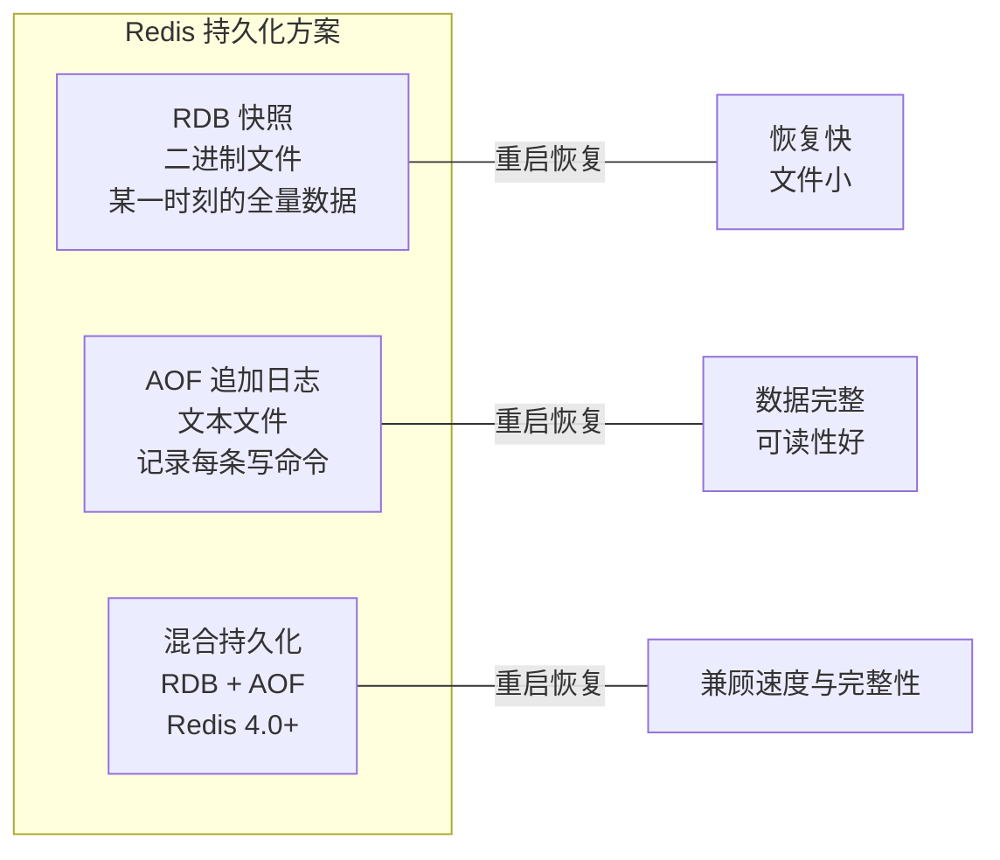
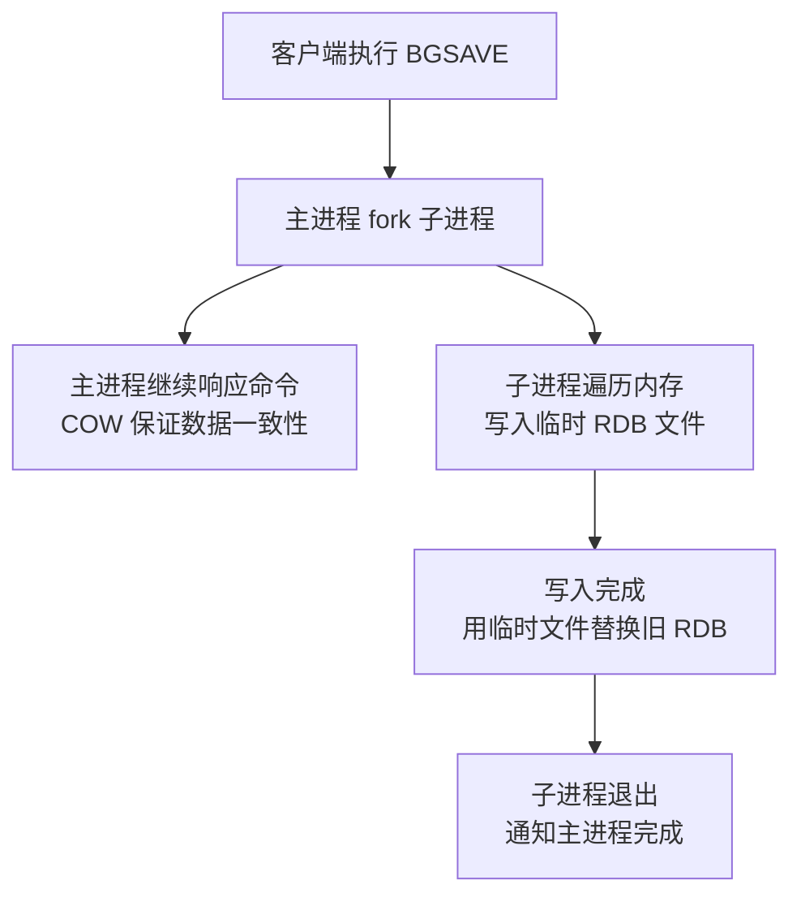
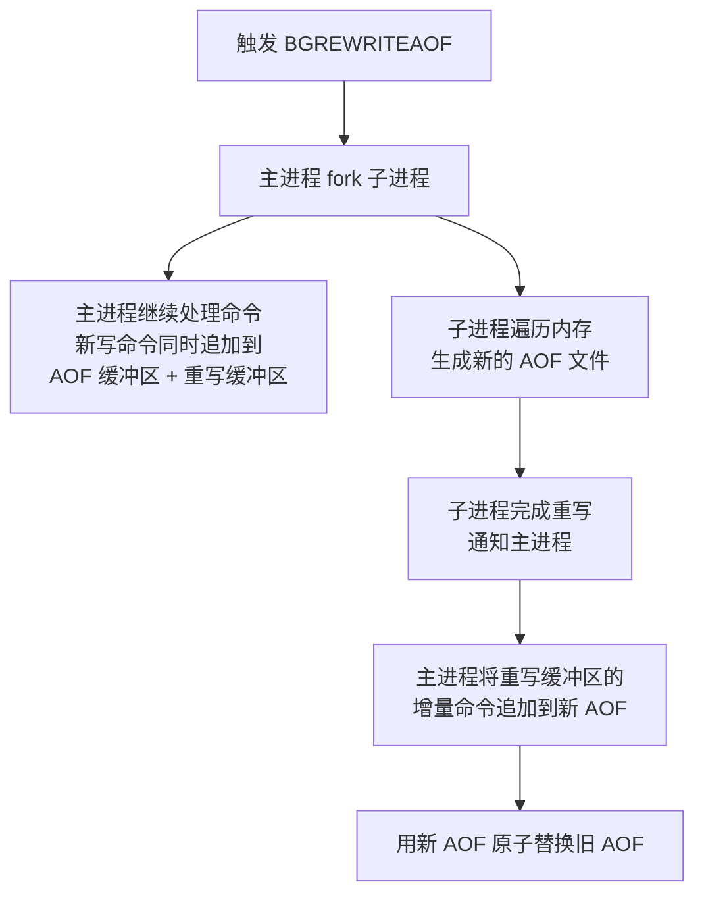
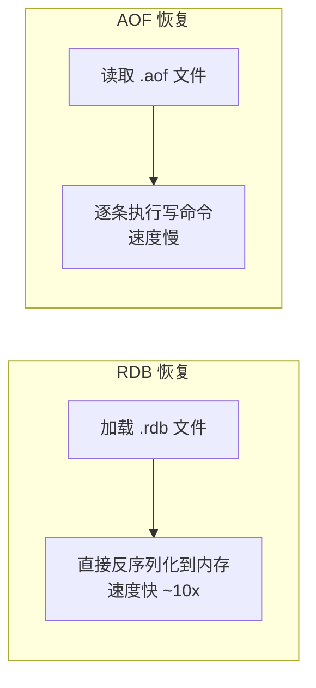
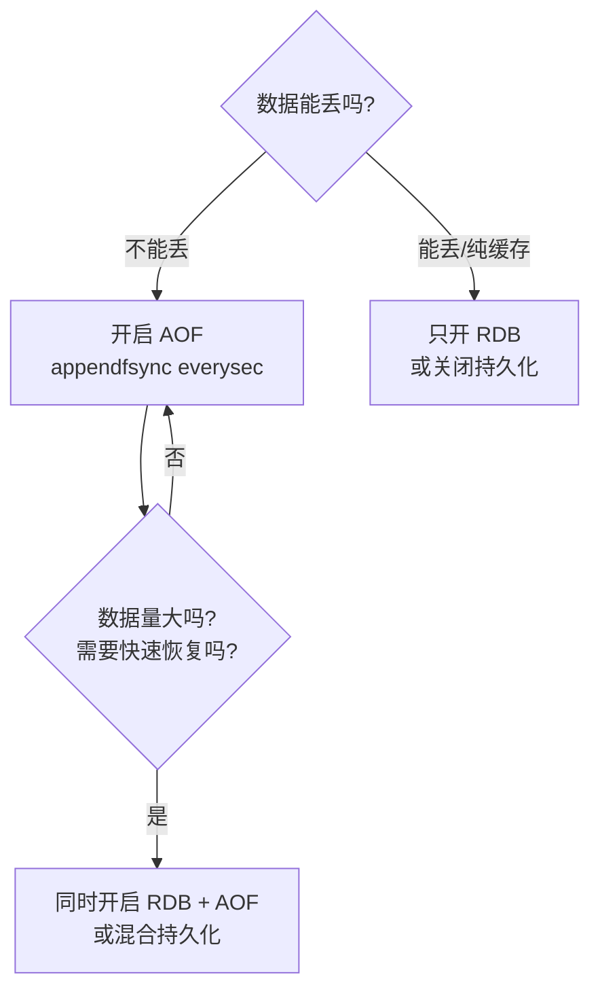
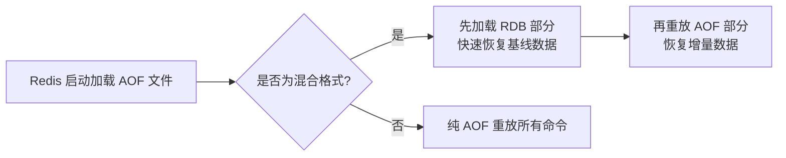
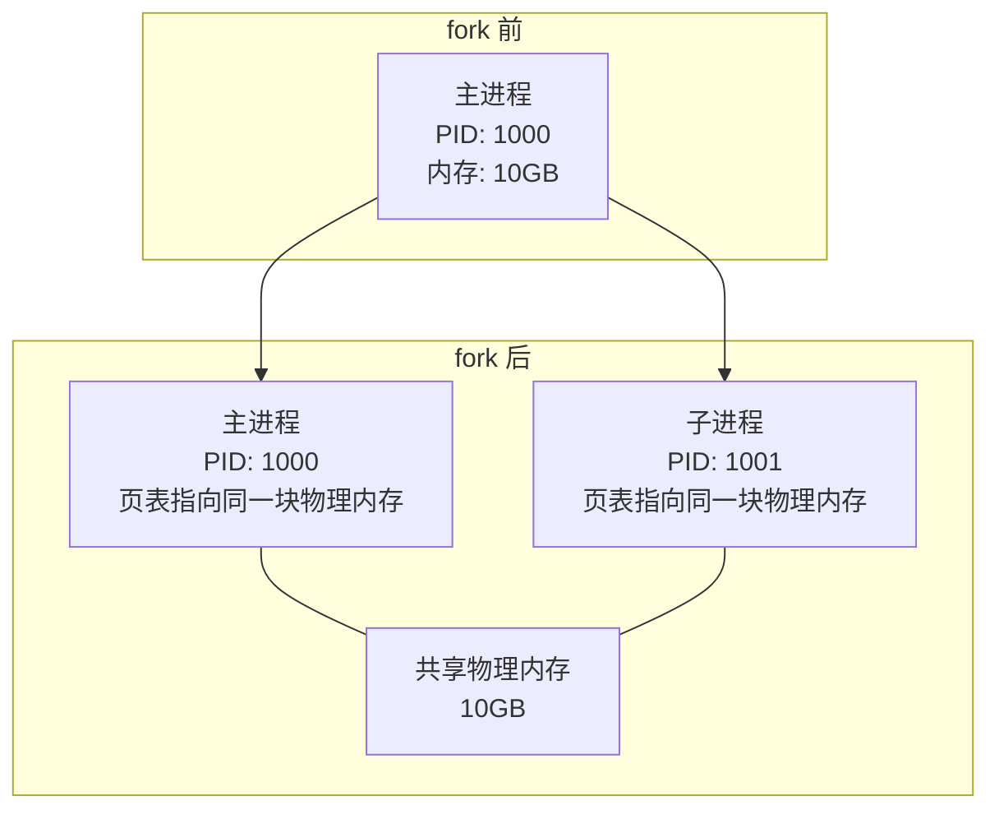
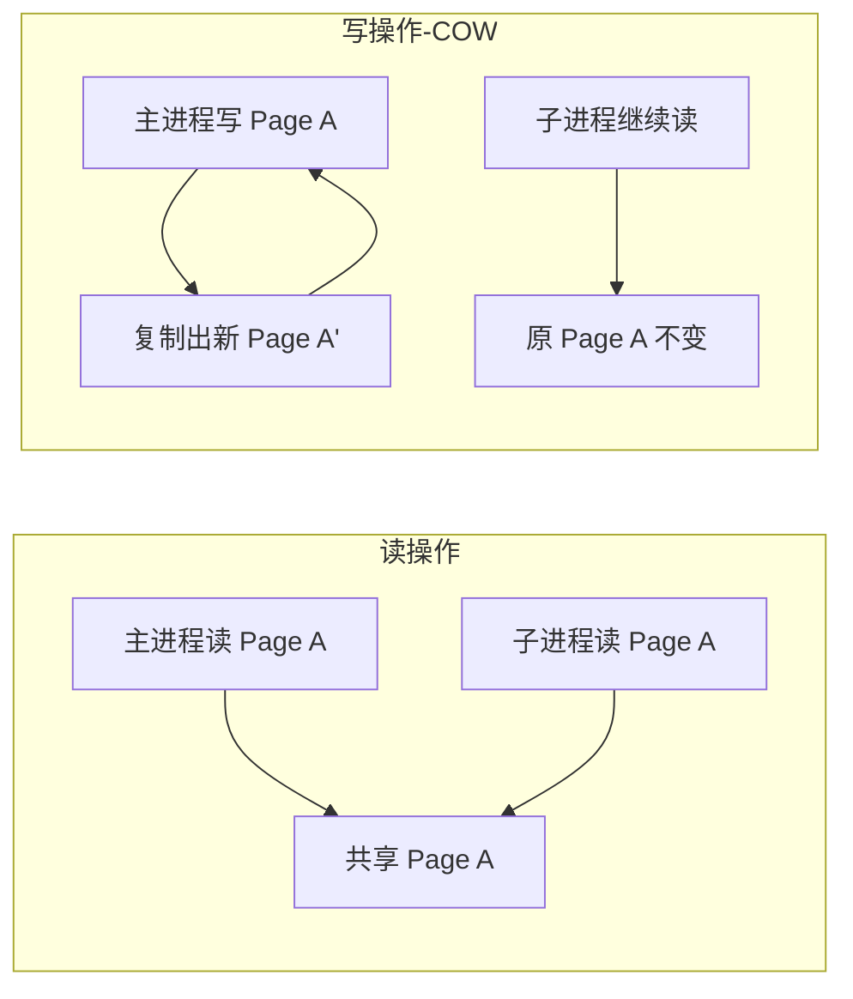
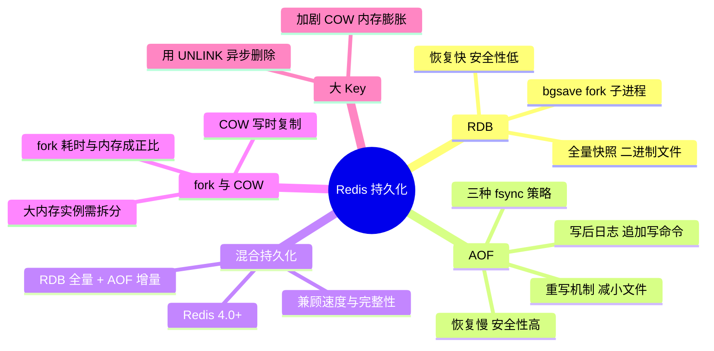

# Redis 持久化

> 练习: [Redis 持久化练习](./Redis-persistence-exercises.md)
>
> 面试: [Redis 持久化面试](./Redis-persistence-interview.md)

## 一、持久化全景图

Redis 是内存数据库，重启后数据会丢失。持久化就是将内存数据写入磁盘，保证重启后可恢复。



**面试关键认知**：Redis 提供了两种持久化方式，不是互斥的，可以同时开启。**生产环境推荐同时开启 RDB + AOF**，或者使用混合持久化。

---

## 二、RDB 快照持久化

### 2.1 什么是 RDB

RDB（Redis Database）是将某一时刻的内存数据**全量快照**写入磁盘，生成一个二进制 `.rdb` 文件。

**一句话理解**：RDB 就是给 Redis 的内存数据拍一张"照片"。

### 2.2 触发方式

| 方式 | 命令/配置 | 说明 |
|------|----------|------|
| **自动触发** | `save 60 1000` | 60 秒内至少 1000 个 Key 变化则触发 |
| **手动触发** | `bgsave` | 后台异步创建快照（**生产唯一推荐**） |
| ~~手动触发~~ | ~~`save`~~ | ~~主线程同步创建，**会阻塞，生产禁用**~~ |

> `save` 命令已不推荐使用，面试中只需知道它"会阻塞主线程"即可。

### 2.3 bgsave 执行流程（⭐ 重点）



**关键步骤详解**：

1. **fork**：主进程调用 `fork()` 创建子进程，子进程拥有父进程内存的"副本"（通过 COW 实现，不是真的拷贝）
2. **子进程写 RDB**：遍历整个内存数据，写入临时文件
3. **替换**：写入完成后，用新文件原子替换旧 RDB 文件
4. **主进程不受影响**：fork 之后主进程继续处理客户端请求，写操作通过 COW 机制保证数据一致性


### 2.4 自动触发配置

```
# 默认配置（可叠加多条规则，满足任一即触发）
save 3600 1      # 3600 秒（1 小时）内至少 1 个 Key 变化
save 300 100     # 300 秒（5 分钟）内至少 100 个 Key 变化
save 60 10000    # 60 秒内至少 10000 个 Key 变化

# 关闭自动 RDB
save ""
```

> Redis 7.0 已将默认配置简化为 `save 3600 1 300 100 60 10000`，相比旧版本降低了快照频率，减少对性能的影响。

### 2.5 RDB 的优缺点

| 优点 | 缺点 |
|------|------|
| 恢复速度快（直接加载二进制文件） | 无法做到实时持久化（可能丢失最后一次快照后的数据） |
| 文件紧凑，适合备份和灾备 | fork 子进程在大内存实例上耗时较长 |
| 对主线程影响小（子进程干活） | 不同版本的 RDB 格式可能不兼容 |

---

## 三、AOF 追加持久化（⭐ 高频重点）

### 3.1 什么是 AOF

AOF（Append Only File）将每条**写命令**追加记录到一个日志文件中。重启时重新执行所有命令即可恢复数据。

**一句话理解**：AOF 就是把所有写操作"录像"下来，需要时"回放"。

### 3.2 AOF 写入流程（⭐ 必考）


**三步走**：命令追加 → 写入文件 → 刷盘（fsync）

关键认知：**AOF 是"写后日志"**，即先执行命令再记录日志（不是先写日志再执行）。

> **面试追问：为什么 AOF 是写后日志，不是写前日志（WAL）？**
> 1. **避免语法检查开销**：写前需要验证命令语法，写后说明命令已成功执行
> 2. **不会阻塞当前命令**：先执行再记录，不影响命令执行速度
> 3. **风险**：执行完但还没来得及记日志就宕机，会丢失这条命令
> 4. 和 MySQL 相比，数据写入内存的速度比写入磁盘的速度更快，可以采用写后日志

### 3.3 三种 fsync 策略（⭐ 必考）

```
appendfsync always     # 每次写入都 fsync
appendfsync everysec   # 每秒 fsync 一次（默认，推荐）
appendfsync no         # 由操作系统决定何时 fsync
```

| 策略 | fsync 频率 | 数据安全性 | 写入性能 | 适用场景 |
|------|-----------|-----------|---------|---------|
| **always** | 每条命令 | 最多丢 1 条命令 | 最差（约 1/10 性能） | 对数据安全要求极高 |
| **everysec** | 每秒 1 次 | 最多丢 1 秒数据 | 较好（推荐） | **生产环境默认选择** |
| **no** | OS 决定（通常 30s） | 可能丢 30 秒数据 | 最好 | 纯缓存场景 |

> **面试话术**：生产环境一般用 `everysec`，这是性能和数据安全的最佳平衡点。`always` 虽然最安全但性能太差，`no` 虽然最快但可能丢数据太多。

### 3.4 AOF 的优缺点

| 优点 | 缺点 |
|------|------|
| 数据安全性高（最多丢 1 秒） | 文件体积大（记录每条命令） |
| 可读性好（文本格式，可人工修复） | 恢复速度慢（重放所有命令） |
| 支持重写压缩 | 比纯 RDB 稍微影响性能 |

---

## 四、AOF 重写机制（⭐ 高频重点）

### 4.1 为什么需要重写

AOF 文件会随着时间越来越大。例如对同一个 Key 执行了 100 次 `SET`，AOF 中记录了 100 条命令，但**最终只需要保留最后一条**。

```
# 重写前（AOF 文件）
SET counter 1
INCR counter        ← 冗余
INCR counter        ← 冗余
SET counter 5       ← 只需要保留这一条
DEL counter         ← 甚至整组都可以删掉

# 重写后
（无记录，因为 counter 已被删除）
```

### 4.2 AOF 重写触发方式

| 方式 | 说明 |
|------|------|
| 手动触发 | `BGREWRITEAOF` 命令 |
| 自动触发 | `auto-aof-rewrite-percentage 100`（文件大小比上次重写后增长 100%） |
| 自动触发 | `auto-aof-rewrite-min-size 64mb`（AOF 文件最小达到 64MB 才触发） |

### 4.3 AOF 重写流程（⭐ 必考）



**关键细节**（面试加分）：

1. **fork 时刻**：子进程基于 fork 时的内存快照生成新 AOF
2. **重写缓冲区（AOF Rewrite Buffer）**：fork 之后主进程收到的新写命令，需要同时写入 AOF 缓冲区和重写缓冲区
3. **合并增量**：子进程写完后，主进程把重写缓冲区的内容追加到新 AOF 末尾
4. **原子替换**：最后用 `rename` 原子替换旧文件

> **面试追问：AOF 重写期间有新写入怎么办？**
> 答：fork 之后的新写命令会同时记录到**重写缓冲区**。子进程完成重写后，主进程将重写缓冲区的增量命令追加到新 AOF 文件末尾，保证数据不丢失。

### 4.4 AOF 重写不是"读取旧 AOF 再压缩"

这是一个常见误解。**AOF 重写是直接遍历当前内存数据，生成最精简的命令**，而不是去读取和压缩旧 AOF 文件。

---

## 五、RDB vs AOF 全面对比（⭐ 最高频）

### 5.1 核心对比表

| 维度 | RDB | AOF |
|------|-----|-----|
| **持久化方式** | 全量快照（二进制） | 追加写命令日志（文本） |
| **数据安全性** | 可能丢最后一次快照后的数据 | 最多丢 1 秒数据（everysec） |
| **文件大小** | 小（二进制压缩） | 大（需重写压缩） |
| **恢复速度** | **快**（直接加载，是 AOF 的 ~10 倍） | 慢（逐条重放命令） |
| **对性能影响** | fork 时可能有瞬间延迟 | 持续的 IO 写入 |
| **文件可读性** | 不可读（二进制） | 可读（文本，可人工修复） |
| **适用场景** | 冷备份、灾备、从节点同步 | 数据安全要求高 |

### 5.2 数据安全性对比（面试常考场景）

```
场景：Redis 在 12:00 做了 RDB 快照，12:03 宕机

RDB：恢复到 12:00 的数据，12:00~12:03 的数据全部丢失
AOF（everysec）：恢复到 12:02:59 的数据，最多丢最后 1 秒
```

### 5.3 恢复速度对比



### 5.4 如何选择（⭐ 场景题标准答案）



**生产环境推荐方案**：

| 方案 | 配置 | 适用场景 |
|------|------|---------|
| **RDB + AOF 同时开启** | `appendonly yes` + `save 60 10000` | 大多数生产环境 |
| **混合持久化** | `aof-use-rdb-preamble yes` | Redis 4.0+ 推荐 |
| **只开 RDB** | `save 60 10000` | 对数据丢失容忍度高的缓存场景 |
| **关闭持久化** | `save ""` | 纯缓存，数据全在数据库 |

> **面试话术**：生产环境建议同时开启 RDB 和 AOF。RDB 做冷备份和快速恢复，AOF 保证数据安全性。Redis 4.0+ 推荐使用混合持久化，兼顾恢复速度和数据完整性。纯缓存场景可以只开 RDB 甚至关闭持久化。

---

## 六、混合持久化

### 6.1 什么是混合持久化

Redis 4.0 引入，将 RDB 和 AOF 的优势结合：**AOF 重写时，先写入 RDB 格式的全量数据，再追加 AOF 格式的增量命令**。

### 6.2 混合持久化文件结构

```
┌──────────────────────────────────────────────┐
│              混合 AOF 文件                      │
├──────────────────────┬───────────────────────┤
│   RDB 格式（二进制）    │   AOF 格式（文本）       │
│   全量快照数据          │   增量写命令             │
│   体积小, 加载快        │   保证数据完整性          │
└──────────────────────┴───────────────────────┘
```

### 6.3 配置方式

```
# 开启 AOF
appendonly yes

# 开启混合持久化（Redis 4.0+）
aof-use-rdb-preamble yes
```

### 6.4 加载流程



**优势**：恢复速度接近纯 RDB，数据完整性接近纯 AOF。

> **面试话术**：混合持久化是 Redis 4.0 的方案。AOF 重写时先用 RDB 格式写入全量数据，再追加 AOF 增量命令。这样恢复时先加载 RDB（快），再重放少量增量命令（完整），兼顾了速度和安全性。生产环境推荐开启。

---

## 七、fork 与 COW 原理（⭐ 高频重点）

### 7.1 为什么 fork 相关知识点这么重要

因为 RDB 的 `bgsave`、AOF 的 `bgrewriteaof` 都依赖 `fork()` 创建子进程。**fork 的性能直接影响 Redis 的可用性**。

### 7.2 fork 原理

`fork()` 是操作系统提供的系统调用，创建一个子进程：



**关键点**：
- `fork()` 后，父子进程**共享同一块物理内存**（不是真的拷贝一份 10GB）
- 操作系统通过**页表**（Page Table）实现共享
- fork 的耗时主要在**复制页表**，与内存大小成正比

### 7.3 COW（Copy-On-Write）写时复制

共享内存在"只读"时没问题，但当主进程需要**修改**数据时怎么办？答案是 COW：



**COW 流程**：
1. 主进程尝试修改某个内存页
2. 操作系统发现这个页是共享的，触发**缺页中断**
3. 操作系统**复制出一个新的物理页**给主进程修改
4. 子进程继续使用原来的物理页（不受影响）

### 7.4 fork 的性能问题（⭐ 面试重点）

| 问题 | 原因 | 影响 |
|------|------|------|
| **fork 耗时** | 复制页表与内存成正比，10GB 实例 fork 可能需要数百毫秒 | fork 期间主线程阻塞，客户端超时 |
| **COW 内存膨胀** | fork 后主进程的写操作触发页面复制，额外占用内存 | 极端情况下内存翻倍 |
| **大 Key 加剧问题** | 修改一个大 Key 触发大量页面复制 | COW 开销大 |

**生产经验数据**：

| 实例内存 | fork 耗时（参考值） | 风险 |
|---------|-------------------|------|
| < 4GB | < 10ms | 安全 |
| 4-10GB | 10-100ms | 需关注 |
| 10-30GB | 100ms-1s | 高风险 |
| > 30GB | > 1s | 建议拆分 |

> **面试话术**：fork 的耗时与 Redis 实例的内存大小成正比，因为要复制页表。在 Linux 系统上，10GB 的实例 fork 可能需要几百毫秒，期间主线程是被阻塞的。所以生产环境一般建议单实例内存控制在 10GB 以内。COW 是"写时复制"，fork 后父子进程共享物理内存，只有主进程修改时才复制对应的内存页，所以额外内存开销取决于 fork 期间的写操作量。

### 7.5 优化 fork 性能

- 控制单实例内存大小（建议 < 10GB）
- 使用 `config set latency-monitor-threshold 100` 监控延迟
- Linux 系统开启 `transparent_hugepage` 关闭（`echo never > /sys/kernel/mm/transparent_hugepage/enabled`），大页会加剧 COW 问题
- 使用物理机而非虚拟机（虚拟机 fork 更慢）

---

## 八、大 Key 对持久化的影响

### 8.1 大 Key 的危害

大 Key（如一个 100MB 的 Hash）对持久化的影响：

| 阶段 | 影响 |
|------|------|
| **fork** | 大 Key 本身不直接导致 fork 慢，但大 Key 通常意味着更多内存 |
| **COW** | 修改大 Key 时触发大量页面复制，内存膨胀严重 |
| **RDB 写入** | 子进程序列化大 Key 耗时长，RDB 文件体积大 |
| **AOF 重写** | 同理，重写缓冲区可能积压大量增量数据 |

### 8.2 大 Key 的发现与处理

**发现方式**：
```bash
# 扫描大 Key（Redis 4.0+）
redis-cli --bigkeys

# 查看指定 Key 的内存占用（Redis 4.0+）
MEMORY USAGE keyname
```

**处理方式**：
- 避免存储大 Key，将大 Hash 拆分为小 Hash
- 删除大 Key 用 `UNLINK`（异步删除，不阻塞主线程）
- 控制集合类型元素数量（建议单 Key 不超过 5000 个元素）

---

## 九、总结



---

**下一步**：完成 `redis-03-exercises.md` 练习题（目标 85 分+），然后对照 `redis-03-interview.md` 梳理面试话术。

  ┌──────┬───────────────────────────┬─────────────────────┐
  │ 详略  │          知识点            │        理由         │
  ├──────┼───────────────────────────┼─────────────────────┤
  │ 详讲  │ RDB vs AOF 对比            │ 几乎必考             │
  ├──────┼───────────────────────────┼─────────────────────┤
  │ 详讲  │ AOF 三种 fsync 策略        │ 高频考点             │
  ├──────┼───────────────────────────┼─────────────────────┤
  │ 详讲  │ AOF 重写流程 + 重写缓冲区    │ 高频且易错           │
  ├──────┼───────────────────────────┼─────────────────────┤
  │ 详讲  │ fork + COW 原理            │ 高频 + 场景题常考    │
  ├──────┼───────────────────────────┼─────────────────────┤
  │ 详讲  │ 混合持久化                  │ Redis 4.0+ 推荐方案 │
  ├──────┼───────────────────────────┼─────────────────────┤
  │ 详讲  │ 生产环境持久化方案选择        │ 场景题标配           │
  ├──────┼───────────────────────────┼─────────────────────┤
  │ 略讲  │ save 命令                  │ 已废弃，一句话带过    │
  ├──────┼───────────────────────────┼─────────────────────┤
  │ 略讲  │ RDB 文件格式细节            │ 冷门，不考           │
  ├──────┼───────────────────────────┼─────────────────────┤
  │ 略讲  │ rio.c I/O 抽象层           │ 冷门，面试不考        │
  └──────┴───────────────────────────┴─────────────────────┘

> 练习: [Redis 持久化练习](./Redis-persistence-exercises.md)
>
> 面试: [Redis 持久化面试](./Redis-persistence-interview.md)
