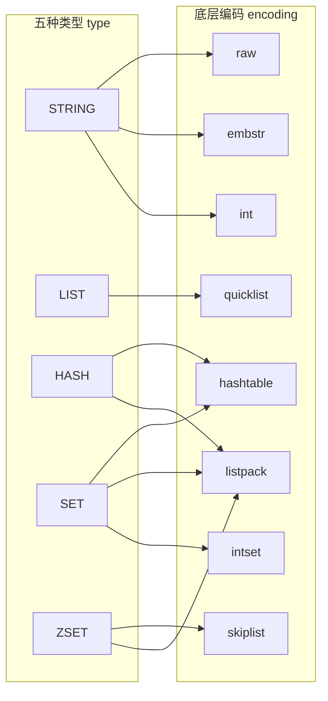
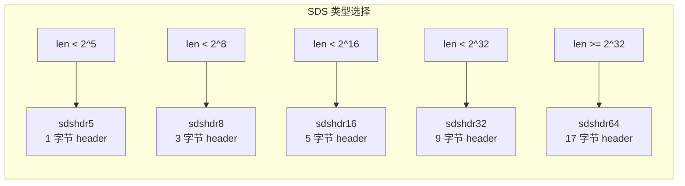
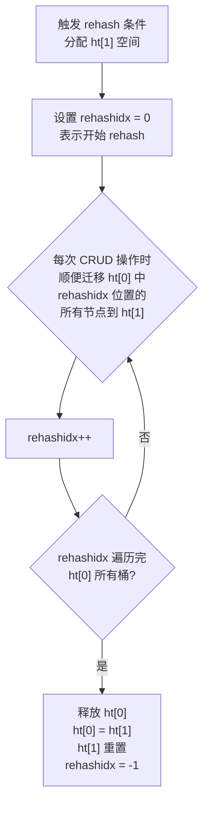
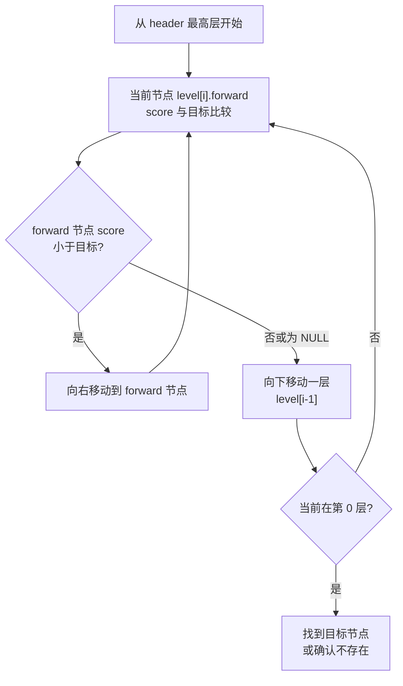
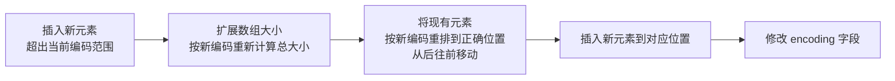
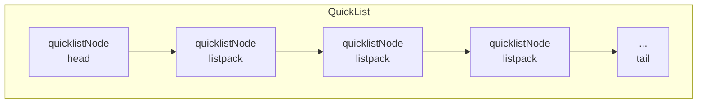
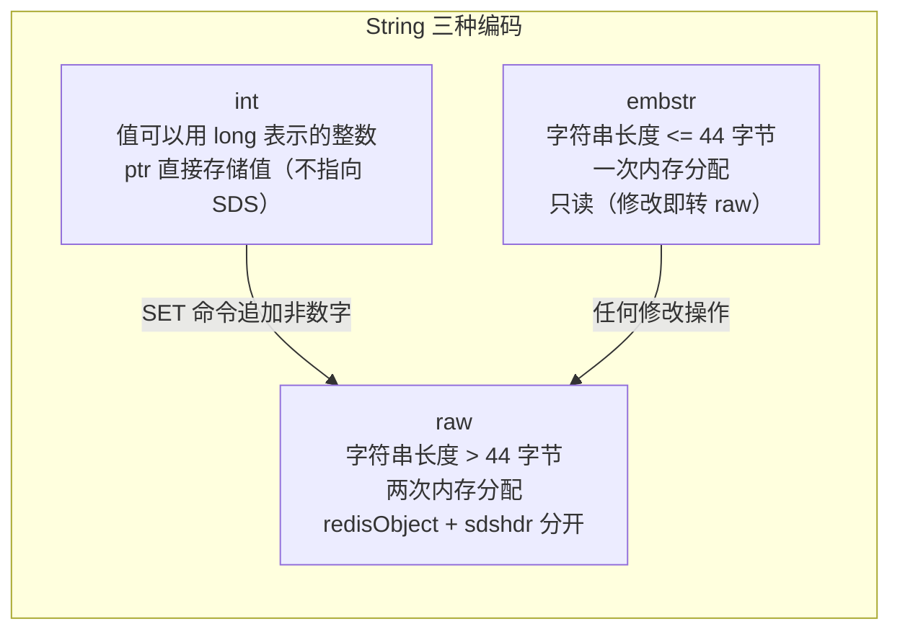
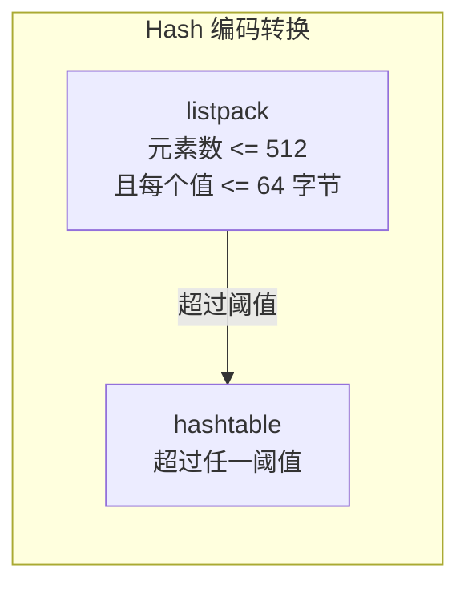
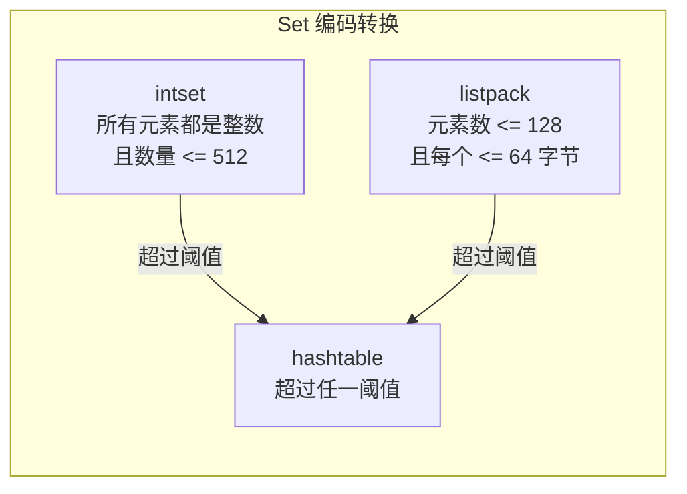
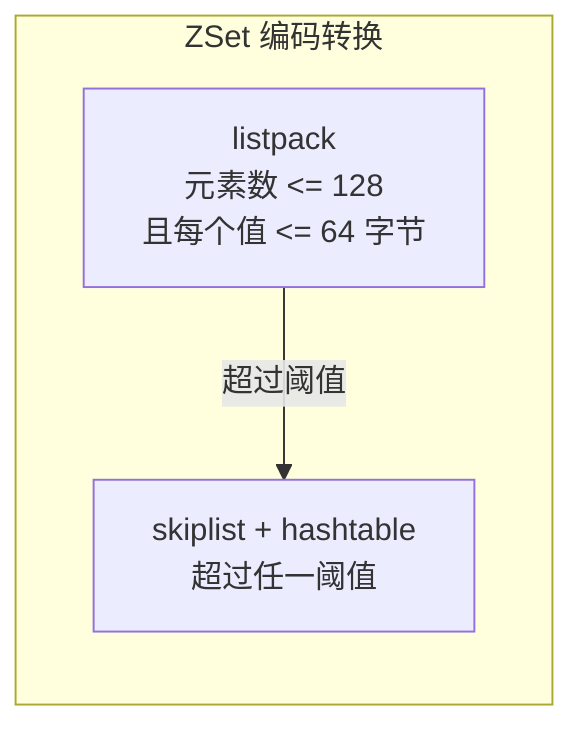

# Redis 阶段一：数据结构与对象

> **面试热度**：🔥🔥🔥🔥🔥
> **学习时长**：3-4 天
> **核心目标**：掌握 Redis 底层数据结构原理，理解五种基础类型与底层编码的对应关系，能手绘渐进式 rehash 流程

---

## 目录

1. [redisObject 对象系统](#一-redisobject-对象系统)
2. [SDS 简单动态字符串](#二-sds-简单动态字符串)
3. [链表 LinkedList](#三-链表-linkedlist)
4. [字典 Dict / Hash Table](#四-字典-dict--hash-table)
5. [跳表 SkipList](#五-跳表-skiplist)
6. [整数集合 IntSet](#六-整数集合-intset)
7. [紧凑列表 ListPack](#七-紧凑列表-listpack)
8. [快速列表 QuickList](#八-快速列表-quicklist)
9. [五种基础类型与编码转换](#九-五种基础类型与编码转换)

---

## 一、redisObject 对象系统

Redis 并没有直接使用底层数据结构来实现键值对，而是基于这些底层数据结构构建了一个**对象系统**，即 `redisObject`。每个键值对中的值都是一个 `redisObject`。

### 1.1 redisObject 结构

```c
// 源码路径：server.h
typedef struct redisObject {
    unsigned type:4;        // 类型（4 bit）
    unsigned encoding:4;    // 编码（4 bit）
    unsigned lru:24;        // LRU 时间戳或 LFU 计数（24 bit）
    int refcount;           // 引用计数
    void *ptr;              // 指向底层数据结构的指针
} robj;
```

五个字段各自的作用：

| 字段 | 大小 | 说明 |
|------|------|------|
| **type** | 4 bit | 对象类型：STRING / LIST / HASH / SET / ZSET |
| **encoding** | 4 bit | 底层编码方式（同一种类型可以有多种编码） |
| **lru** | 24 bit | 记录对象最后一次被访问的时间（LRU）或访问频率（LFU），用于内存淘汰 |
| **refcount** | 4 字节 | 引用计数，用于内存回收和对象共享（0-9999 整数共享池） |
| **ptr** | 8 字节 | 指向真正的底层数据结构实例 |

### 1.2 类型与编码的关系

**核心设计思想**：Redis 将"类型"和"编码"解耦。一种 `type` 可以对应多种 `encoding`，Redis 会根据数据规模和特征**自动选择最优编码**，在内存占用和性能之间取得平衡。



### 1.3 查看编码的命令

```bash
# 查看对象的编码方式
OBJECT ENCODING key

# 示例
SET msg "hello"
OBJECT ENCODING msg    # -> "embstr"

SET bigstr "a very long string that exceeds 44 bytes limit for embstr encoding..."
OBJECT ENCODING bigstr # -> "raw"

SET counter 100
OBJECT ENCODING counter # -> "int"
```

> **面试话术**：Redis 通过 redisObject 将类型和编码解耦，同一种数据类型在不同条件下会使用不同的底层编码。比如 String 类型有 int、embstr、raw 三种编码，Hash 类型在元素少时用 listpack 节省内存，元素多时自动转为 hashtable 提升性能。可以用 `OBJECT ENCODING` 命令查看当前编码。这种设计让 Redis 能在内存和性能之间自动做最优权衡。

---

## 二、SDS 简单动态字符串

SDS（Simple Dynamic String）是 Redis 自己实现的字符串抽象，**替代了 C 原生字符串**（以 `\0` 结尾的字符数组）。Redis 中所有的键和字符串值都是用 SDS 实现的。

### 2.1 SDS 结构演进

**Redis 3.2 之前**只有一种 `sdshdr`：

```c
// 旧版 SDS（Redis < 3.2）
struct sdshdr {
    int len;      // 已使用长度（不含 \0）
    int free;     // 剩余可用空间
    char buf[];   // 实际存储字符串的缓冲区
};
```

**Redis 5.0+ 引入五种头部**，根据字符串长度选择最合适的头部大小，进一步节省内存：

```c
// 源码路径：sds.h

struct __attribute__((__packed__)) sdshdr5 {
    unsigned char flags; /* 3 lsb of type, 5 msb of string length */
    char buf[];
};

struct __attribute__((__packed__)) sdshdr8 {
    uint8_t len;        /* 已使用长度 */
    uint8_t alloc;      /* 总分配长度（不含 header 和 \0）*/
    unsigned char flags; /* 低 3 位表示类型 */
    char buf[];
};

struct __attribute__((__packed__)) sdshdr16 {
    uint16_t len;
    uint16_t alloc;
    unsigned char flags;
    char buf[];
};

struct __attribute__((__packed__)) sdshdr32 {
    uint32_t len;
    uint32_t alloc;
    unsigned char flags;
    char buf[];
};

struct __attribute__((__packed__)) sdshdr64 {
    uint64_t len;
    uint64_t alloc;
    unsigned char flags;
    char buf[];
};
```

**设计原因**：不同长度范围的字符串用不同大小的 `len` 和 `alloc` 字段。短字符串用 `uint8_t`（1 字节），长字符串用 `uint64_t`（8 字节），避免所有字符串都浪费空间。



### 2.2 SDS vs C 字符串对比

| 特性 | C 字符串 | SDS |
|------|----------|-----|
| **获取长度** | O(N) 遍历 | O(1) 直接读 `len` |
| **缓冲区溢出** | 不安全（`strcat` 不检查） | 安全（`sdscat` 先检查空间再扩容） |
| **二进制安全** | 不安全（`\0` 是结尾标志） | 安全（用 `len` 判断结束，不依赖 `\0`） |
| **内存重分配** | 每次修改都需重分配 | 空间预分配 + 惰性释放 |
| **兼容 C 字符串** | - | 兼容（`buf` 末尾也有 `\0`） |

**五大优势详解**：

**（1）O(1) 获取字符串长度**

C 字符串需要遍历到 `\0` 才能知道长度，SDS 直接读取 `len` 字段。`STRLEN` 命令的时间复杂度是 O(1)。

**（2）杜绝缓冲区溢出**

`sdscat` 在拼接前会检查剩余空间是否足够，不足则自动扩容。而 C 的 `strcat` 不检查，可能导致缓冲区溢出覆盖相邻内存。

**（3）二进制安全**

C 字符串以 `\0` 判断结尾，无法存储包含 `\0` 的二进制数据（如图片、序列化对象）。SDS 用 `len` 字段记录长度，不依赖 `\0`，可以存储任意二进制数据。

**（4）空间预分配**

当 SDS 需要扩容时，Redis 不仅分配所需空间，还会额外预分配一些空间，减少后续内存重分配次数。

```
策略：
  len < 1MB  ->  分配 2 * len 的空间（len + free = 2 * len）
  len >= 1MB ->  分配 len + 1MB 的空间（free 固定为 1MB）
```

示例：当前 `len = 100`，`free = 0`，需要追加 50 字节。
- 扩容后：`len = 150`，`free = 150`（总共 300 字节可用空间）
- 下次再追加 100 字节以内时，无需再次分配内存

**（5）惰性释放**

`sdstrim` 截断字符串时，不立即释放多余内存，而是记录到 `free`（或 `alloc - len`）中，供将来使用。

```c
// sdstrim 伪代码：只修改 len 和 free，不释放内存
void sdstrim(sds s, const char *cset) {
    // ... 计算 trim 后的新长度 newlen
    s->len = newlen;
    s->free = old_len - newlen;  // 多余的空间记为 free，不释放
    s->buf[newlen] = '\0';
}
```

> **面试话术**：SDS 相比 C 字符串有五大优势。最核心的是：O(1) 获取长度（用 len 字段）、二进制安全（不依赖 `\0` 判断结尾）、杜绝缓冲区溢出（修改前检查空间）。此外还有空间预分配（小于 1MB 分配 2 倍，大于等于 1MB 固定多分配 1MB）和惰性释放（trim 不释放内存，记到 free 里）来优化内存重分配次数。Redis 5.0+ 进一步优化为 sdshdr5/8/16/32/64 五种头部，根据字符串长度选最小头部，节省内存。

---

## 三、链表 LinkedList

### 3.1 双端无环链表结构

Redis 早期自己实现了双端无环链表，用于 List 类型的底层实现。

```c
// 源码路径：adlist.h（旧版） / list.h（新版）

// 链表节点
typedef struct listNode {
    struct listNode *prev;  // 前驱指针
    struct listNode *next;  // 后继指针
    void *value;            // 值（void* 可以存任意类型）
} listNode;

// 链表结构
typedef struct list {
    listNode *head;                           // 头节点
    listNode *tail;                           // 尾节点
    unsigned long len;                        // 节点数量
    void *(*dup)(void *ptr);                  // 节点值复制函数
    void (*free)(void *ptr);                  // 节点值释放函数
    int (*match)(void *ptr, void *key);       // 节点值比较函数
} list;
```

### 3.2 特性

- **双端**：每个节点有 prev 和 next 指针，获取前后节点都是 O(1)
- **无环**：head 的 prev 和 tail 的 next 都指向 NULL
- **带长度计数器**：`len` 字段，O(1) 获取链表长度
- **多态**：通过 `dup`、`free`、`match` 三个函数指针实现多态，链表节点可以存储任意类型的值

### 3.3 使用场景

| 场景 | 说明 |
|------|------|
| **List 类型底层（已弃用）** | Redis 3.2 之前，List 使用 linkedlist 或 ziplist |
| **发布订阅** | Pub/Sub 模块中维护订阅者列表 |
| **慢查询日志** | 存储慢查询日志条目 |
| **监视器** | 维护客户端监视器列表 |

> **注意**：Redis 3.2+ 中 List 底层已统一改为 quicklist，linkedlist 作为独立数据结构不再作为 List 的底层编码。但链表结构在 Redis 内部其他模块仍有使用。

> **面试话术**：Redis 的链表是双端无环链表，每个节点有 prev/next 指针，链表有 head/tail/len 字段，通过函数指针实现多态。Redis 3.2 之后 List 底层已经从 linkedlist/ziplist 统一改为 quicklist（listpack + linkedlist 的混合体），但链表结构在发布订阅、慢查询日志等内部模块中仍在使用。

---

## 四、字典 Dict / Hash Table

字典是 Redis 最核心的数据结构之一。Redis 的键值对就是存在字典里的，Hash 类型底层也是字典。

### 4.1 哈希表结构 dictht

```c
// 源码路径：dict.h

typedef struct dictht {
    dictEntry **table;      // 哈希表数组（桶数组），每个元素是一个 dictEntry 链表
    unsigned long size;     // 哈希表大小（桶的数量，总是 2^n）
    unsigned long sizemask; // 哈希表大小掩码，用于计算索引值（ sizemask = size - 1 ）
    unsigned long used;     // 已有节点数量
} dictht;
```

### 4.2 字典结构 dict

```c
typedef struct dict {
    dictType *type;     // 类型特定函数（哈希函数、键比较、键销毁等）
    void *privdata;     // 私有数据（传给 type 中函数的附加参数）
    dictht ht[2];       // 两个哈希表（ht[0] 平时使用，ht[1] rehash 时使用）
    long rehashidx;     // rehash 索引（-1 表示不在 rehash）
    int16_t pauserehash; /* rehash 暂停标志 */
} dict;
```

**`ht[2]` 双哈希表设计是渐进式 rehash 的基础**。

### 4.3 哈希表节点 dictEntry

```c
typedef struct dictEntry {
    void *key;                   // 键
    union {
        void *val;               // 值（可以是任意类型指针）
        uint64_t u64;
        int64_t s64;
        double d;
    } v;                         // 值（用 union 节省内存）
    struct dictEntry *next;      // 指向下一个节点（链地址法解决冲突）
} dictEntry;
```

### 4.4 哈希算法

Redis 使用 **MurmurHash2** 算法计算哈希值：

```c
// 计算哈希值
hash = dict->type->hashFunction(key);

// 计算索引（通过 sizemask 做取模运算）
index = hash & dict->ht[x].sizemask;
```

MurmurHash2 的特点：简单快速、分布均匀、非加密型（不用于安全场景）。

### 4.5 哈希冲突：链地址法（头插法）

当多个键被分配到同一个桶时，用链表解决冲突。新节点采用**头插法**插入链表头部（O(1) 插入）。

### 4.6 渐进式 Rehash（核心重点）

**为什么需要渐进式 rehash？**

当哈希表的负载因子（`used / size`）过大或过小时，需要扩容或收缩。但一次性 rehash 几百万个键会导致服务长时间阻塞。Redis 采用**渐进式 rehash**，将 rehash 分摊到后续的每次 CRUD 操作中。

**渐进式 rehash 流程**：



**rehash 期间的 CRUD 规则**：

| 操作 | 规则 |
|------|------|
| **查找** | 先查 `ht[0]`，没找到再查 `ht[1]` |
| **新增** | 只写入 `ht[1]`（保证 ht[0] 的数据只会减少不会增加） |
| **修改** | 先在 `ht[0]` 找到就修改 `ht[0]`，否则修改 `ht[1]` |
| **删除** | 在 `ht[0]` 找到就删除 `ht[0]` 的，否则删除 `ht[1]` 的 |

**rehash 触发条件**：

| 操作 | 条件 | 说明 |
|------|------|------|
| **扩展** | 负载因子 >= 1，且**没有**在执行 BGSAVE/BGREWRITEAOF | 服务器空闲时扩展 |
| **扩展** | 负载因子 >= 5 | 强制扩展，不管是否在 BGSAVE |
| **收缩** | 负载因子 < 0.1 | 哈希表过于稀疏，浪费内存 |

```
负载因子 = used / size = ht[0].used / ht[0].size
```

**为什么 BGSAVE 期间不轻易扩展？**

BGSAVE/BGREWRITEAOF 使用 `fork()` 子进程，依赖操作系统 COW（写时复制）机制。如果此时扩展哈希表，会产生大量内存页的修改，触发大量 COW，消耗额外的内存和 CPU。所以 Redis 在 BGSAVE 期间提高扩展阈值到 5，尽量避免不必要的 rehash。

> **面试话术**：Redis 字典使用 `ht[2]` 双哈希表实现渐进式 rehash。当负载因子达到阈值时，分配新的 ht[1]，然后把 rehash 分摊到后续每次 CRUD 操作中逐步迁移。rehash 期间查找会同时查两个表，新增只写 ht[1]。这样避免了一次性 rehash 几百万键导致服务阻塞。触发条件是负载因子 >= 1 时扩展（BGSAVE 期间阈值提高到 5），< 0.1 时收缩。

---

## 五、跳表 SkipList

跳表是一种**有序数据结构**，通过在每个节点中维持多个指向其他节点的指针，实现 O(logN) 的查找、插入、删除。Redis 用跳表实现有序集合（ZSET）的底层结构之一。

### 5.1 跳表结构

```c
// 源码路径：server.h

// 跳表节点
typedef struct zskiplistNode {
    sds ele;                              // 成员对象（元素值）
    double score;                         // 分值（排序依据）
    struct zskiplistNode *backward;       // 后退指针（只能后退一个节点）
    struct zskiplistLevel {
        struct zskiplistNode *forward;    // 前进指针
        unsigned long span;               // 跨度（用于计算排名）
    } level[];                            // 层（柔性数组，每个节点层数不同）
} zskiplistNode;

// 跳表结构
typedef struct zskiplist {
    struct zskiplistNode *header, *tail;  // 头尾节点
    unsigned long length;                 // 节点数量
    int level;                            // 最大层数
} zskiplist;
```

### 5.2 层级原理

每个跳表节点有 1~32 个层级，层数通过**幂次定律**随机生成：

```
层级生成规则（概率）：
  第 1 层：100%（每个节点都有）
  第 2 层：50%（1/2 概率有第 2 层）
  第 3 层：25%（1/4 概率有第 3 层）
  ...
  第 32 层：极低概率

平均每个节点的层数约为 1 / (1 - 0.5) = 2 层
```

`span`（跨度）字段的作用：记录当前节点到下一个节点之间跨越了多少个节点，**用于计算排名**。`ZRANK` 命令通过累加 span 得到排名。

### 5.3 查找过程

以查找 score=70 的节点为例：



查找、插入、删除的时间复杂度都是 **O(logN)**。

### 5.4 为什么用跳表不用红黑树？（面试必问）

这是一个**高频面试题**，也是 Redis 作者 antirez 本人在讨论中给出的理由：

| 对比维度 | 跳表 | 红黑树 / 平衡树 |
|----------|------|----------------|
| **实现复杂度** | 简单，代码量少 | 复杂，旋转/变色逻辑多 |
| **范围查询** | 天然适合（链表顺序遍历） | 需要中序遍历，不直观 |
| **内存占用** | 可控（平均 2 个指针/节点） | 每节点至少 2 个指针 |
| **并发友好** | 局部修改，Lock-free 友好 | 旋转操作涉及多节点 |
| **插入/删除** | O(logN)，只需修改相邻指针 | O(logN)，但可能需要多次旋转 |

**核心原因**：ZSET 的典型操作是 `ZRANGEBYSCORE`、`ZRANGE` 这类**范围查询**。跳表在找到起始点后，沿着最底层链表顺序遍历即可，非常自然。红黑树做范围查询需要中序遍历，实现复杂且不直观。此外，跳表的实现简单、易于调试维护，对于 Redis 这种对代码简洁性有高要求的项目非常重要。

> **面试话术**：Redis 选用跳表而不是红黑树，核心原因是：第一，ZSET 最常用的操作是 ZRANGEBYSCORE 这类范围查询，跳表在找到起点后沿底层链表顺序遍历即可，红黑树做范围查询要中序遍历，不直观。第二，跳表实现简单，代码量远小于红黑树的旋转/变色逻辑，方便维护。第三，跳表内存占用可控，平均每节点约 2 层。Redis 作者 antirez 也在社区讨论中明确表达过这些理由。

---

## 六、整数集合 IntSet

整数集合是 Set 类型的底层编码之一，当集合中的元素**全部是整数**且**数量不多**时使用。

### 6.1 IntSet 结构

```c
// 源码路径：intset.h

typedef struct intset {
    uint32_t encoding;    // 编码方式：INT16 / INT32 / INT64
    uint32_t length;      // 元素数量
    int8_t contents[];    // 保存元素的数组（实际类型取决于 encoding）
} intset;
```

`contents` 数组是整数集合的底层实现，虽然声明为 `int8_t`，但实际存储的类型由 `encoding` 决定：

| encoding 值 | 含义 | 每个元素大小 |
|-------------|------|-------------|
| `INTSET_ENC_INT16` | int16_t | 2 字节 |
| `INTSET_ENC_INT32` | int32_t | 4 字节 |
| `INTSET_ENC_INT64` | int64_t | 8 字节 |

**IntSet 中的元素是有序的（从小到大排列）**，因此查找使用**二分查找**，时间复杂度 O(logN)。

### 6.2 编码升级

当插入一个新元素，其类型超出当前 `encoding` 的范围时，需要**升级**整个数组。

**升级过程**：



示例：当前 encoding = INT16（存了 1, 2, 3），插入 65535（超出 int16 范围）。

1. 升级为 INT32 编码
2. 数组从 3 * 2 字节扩展到 4 * 4 字节
3. 从后往前移动：3 -> 新位置, 2 -> 新位置, 1 -> 新位置
4. 插入 65535 到对应位置

**关键特性：升级不可降级**。一旦从 INT16 升级到 INT32，即使后来删除了大整数元素，encoding 也不会回退。

**为什么升级但不降级？**

- 避免频繁的内存重分配
- 降级需要遍历所有元素判断是否可以安全降级，增加复杂度
- 实际使用中 IntSet 元素数量很少（默认阈值 512），内存浪费可忽略

> **面试话术**：IntSet 是 Set 类型在元素全为整数且数量不超过 512 个时的底层编码。它有三个编码等级（int16/int32/int64），当插入的元素超出当前编码范围时会触发升级：扩展数组、按新编码从后往前重排元素、插入新元素。注意升级是不可逆的，不会降级。IntSet 内部元素有序存储，查找用二分查找。

---

## 七、紧凑列表 ListPack

ListPack 是 Redis 7.0 引入的紧凑数据结构，用于替代 ziplist。它是一块**连续内存**中存储多个元素的紧凑结构，是 Hash、ZSet、Set 在数据量少时的底层编码，也作为 QuickList 内部节点的存储容器。

### 7.1 ListPack 结构

**整体结构**：

```
+---------------+-----------------+---------+---------+-----+-----------+
| total-bytes   | num-elements    | entry1  | entry2  | ... | end (0xFF)|
| 4 字节        | 4 字节          |  变长   |  变长   |     | 1 字节    |
+---------------+-----------------+---------+---------+-----+-----------+
```

| 字段 | 大小 | 说明 |
|------|------|------|
| **total-bytes** | 4 字节 | 整个 listpack 占用的总字节数 |
| **num-elements** | 4 字节 | 元素数量 |
| **entryX** | 变长 | 各个元素节点 |
| **end** | 1 字节 | 结束标记（固定值 0xFF） |

**Entry 结构**：

```
+----------+----------+-----------+
| encoding |   data   |  backlen  |
|  1-5 字节 |  变长    |  1-5 字节  |
+----------+----------+-----------+
```

- **encoding**：记录当前 entry 的数据类型和长度（整数或字符串）
- **data**：实际存储的数据
- **backlen**：记录当前 entry 的自身长度（用于从后向前遍历时定位前一个 entry）

> **关键设计**：ListPack 的每个 entry 记录的是**自身长度**（backlen），而不是前一节点的长度。这是它区别于 ziplist 的核心改进。

### 7.2 为什么用 ListPack？（对比 ZipList）

**ziplist 的连锁更新问题**：

ziplist 的每个 entry 用 `prevlen` 字段记录前一节点的长度。当 prevlen < 254 时用 1 字节存储，>= 254 时用 5 字节存储。如果连续多个 entry 恰好在临界大小，在头部插入一个大 entry 会触发连锁反应——一个 entry 扩展导致下一个 entry 的 prevlen 也要扩展，最坏情况 O(N) 次内存重分配。


**ListPack 的解决方案**：

```
ZipList entry:  prevlen + encoding + data    （记录前一节点长度）
ListPack entry: encoding + data + backlen    （记录自身长度）
```

ListPack 的 entry 改为记录自身长度（backlen），修改某个 entry 不会影响其他 entry 的长度信息，**从根源上消除了连锁更新**。

### 7.3 ListPack 的适用场景

- **数据量少时的省内存方案**：连续内存、无指针开销、紧凑编码，元素少时比 hashtable 节省大量内存
- **用于 Hash、ZSet、Set（Redis 7.2+）的小数据编码**：元素数量和值大小不超过阈值时使用 listpack，超过则转换为 hashtable/skiplist
- **作为 QuickList 内部节点的存储容器**：List 类型的每个 quicklistNode 内部就是一个 listpack

> **面试话术**：ListPack 是 Redis 7.0 引入的紧凑数据结构，用于替代 ziplist。ziplist 的问题是每个 entry 记录前一节点长度（prevlen），当节点长度变化可能引发连锁更新——一个节点扩展导致后续所有节点的 prevlen 都要扩展，最坏 O(N) 次内存重分配。ListPack 的 entry 改为记录自身长度（backlen），修改某个 entry 不会影响其他 entry，从根本上消除了连锁更新。面试时如果被问到 ziplist 的连锁更新，回答完原理后要补充"Redis 7.0 的 listpack 已经解决了这个问题"。

---

## 八、快速列表 QuickList

QuickList 是 **listpack + linkedlist 的折中方案**，是 List 类型的统一底层实现。

### 8.1 设计思想

```
linkedlist：每个节点存一个元素 -> 指针开销大，内存碎片多
单个大 listpack：一块连续内存 -> 数据多时 realloc 性能差

quicklist：把数据分成多段，每段用 listpack 存储，段与段之间用 linkedlist 串联
```

### 8.2 QuickList 结构

```c
// 源码路径：quicklist.h

typedef struct quicklistNode {
    struct quicklistNode *prev;      // 前驱节点
    struct quicklistNode *next;      // 后继节点
    unsigned char *entry;            // 指向 listpack
    size_t size;                     // entry 指向的数据大小（字节）
    unsigned int count;              // entry 中的元素数量
    unsigned int encoding;           // 编码方式：RAW 或 LZF
    unsigned int container;          // 容器类型：Redis 7.0+ 统一为 LISTPACK
    unsigned int recompress;         // 是否需要再次压缩
    unsigned int attempted_compress; /* 测试用 */
    unsigned int extra;              /* 预留字段 */
} quicklistNode;

typedef struct quicklist {
    quicklistNode *head;             // 头节点
    quicklistNode *tail;             // 尾节点
    unsigned long count;             // 所有元素总数
    unsigned long len;               // quicklistNode 节点数量
    int fill;                        // 每个 listpack 的最大大小（负数表示字节数限制）
    unsigned int compress;           // 压缩深度（0 = 不压缩）
    unsigned int bookmark_count;     /* 书签数量 */
    quicklistBookmark bookmarks[];   /* 可选的书签 */
} quicklist;
```



### 8.3 关键配置参数

```bash
# redis.conf
list-max-listpack-size -2    # 每个 listpack 的大小限制
# -1: 4096 字节
# -2: 8192 字节（默认，推荐）
# -3: 16384 字节
# -4: 32768 字节
# -5: 65536 字节

list-compress-depth 0        # 压缩深度
# 0: 不压缩（默认）
# 1: 首尾各 1 个节点不压缩，中间节点用 LZF 压缩
# 2: 首尾各 2 个节点不压缩，其余压缩
```

### 8.4 中间节点压缩

QuickList 支持对中间节点使用 **LZF 压缩**，因为 List 操作通常集中在两端（LPUSH/RPUSH/LPOP/RPOP），中间节点很少被访问。压缩可以显著节省内存。

> **面试话术**：QuickList 是 List 类型的统一底层实现，是 listpack 和 linkedlist 的折中方案。它把数据分成多段，每段用一个 listpack 存储（连续内存、省空间），段与段之间用双向链表连接（避免单个大 listpack 的性能问题）。还支持对中间不常访问的节点进行 LZF 压缩。

---

## 九、五种基础类型与编码转换

这是面试最高频的部分。Redis 的五种基础数据类型在不同条件下会使用不同的底层编码，理解编码转换条件和原因非常关键。

### 9.1 String

String 类型有三种编码：



| 编码 | 条件 | 内存分配 | 特点 |
|------|------|---------|------|
| **int** | 值可以用 `long` 表示的整数 | 1 次 | `ptr` 直接存储整数值，不指向 SDS |
| **embstr** | 字符串长度 <= 44 字节 | 1 次（连续内存） | redisObject 和 SDS 一起分配，CPU 缓存友好 |
| **raw** | 字符串长度 > 44 字节 | 2 次（分开分配） | redisObject 和 sdshdr 各自独立分配 |

**embstr vs raw 的关键区别**：

```
embstr 内存布局（连续）：
+-------------+----------+-----+
| redisObject | sdshdr   | buf |
+-------------+----------+-----+
<-------- 一次 malloc -------->

raw 内存布局（分离）：
+-------------+       +----------+-----+
| redisObject |  ptr  | sdshdr   | buf |
+-------------+ ----> +----------+-----+
<-- malloc -->        <--- malloc --->
```

**embstr 修改时转为 raw**：embstr 是只读的，任何修改操作（如 APPEND）都会将其转为 raw，因为 embstr 的连续内存布局不好做扩容。

```bash
# 验证编码转换
SET msg hello
OBJECT ENCODING msg     # -> "embstr"
APPEND msg world
OBJECT ENCODING msg     # -> "raw" （embstr 被修改，转为 raw）
```

### 9.2 List

List 类型底层编码统一使用 **quicklist**，不存在编码转换。

- 每个 quicklistNode 内部是一个 listpack（连续内存、紧凑编码）
- quicklistNode 之间用双向链表连接
- 支持对中间节点进行 LZF 压缩，节省内存

### 9.3 Hash



| 编码 | 条件 | 配置参数 |
|------|------|---------|
| **listpack** | 元素数 <= 512 且每个值 <= 64 字节 | `hash-max-listpack-entries` (512) / `hash-max-listpack-value` (64) |
| **hashtable** | 超过任一阈值 | - |

```bash
# redis.conf
hash-max-listpack-entries 512   # 元素数阈值
hash-max-listpack-value 64      # 单个 value 最大字节数
```

### 9.4 Set



| 编码 | 条件 | 配置参数 |
|------|------|---------|
| **intset** | 所有元素都是整数且数量 <= 512 | `set-max-intset-entries` (512) |
| **listpack** | 元素数 <= 128 且每个 <= 64 字节 | `set-max-listpack-entries` (128) / `set-max-listpack-value` (64) |
| **hashtable** | 超过上述任一阈值 | - |

> **注意**：intset 优先级高于 listpack。当集合元素全是整数且数量不超过 512 时使用 intset；当包含非整数元素但元素数量较少时使用 listpack；超过阈值则统一转为 hashtable。

### 9.5 ZSet（Sorted Set）



| 编码 | 条件 | 配置参数 |
|------|------|---------|
| **listpack** | 元素数 <= 128 且每个值 <= 64 字节 | `zset-max-listpack-entries` (128) / `zset-max-listpack-value` (64) |
| **skiplist + hashtable** | 超过任一阈值 | - |

**为什么 ZSet 用 skiplist + hashtable 双结构？**

这是一个重要的设计问题。ZSet 同时需要支持两种操作：
- **范围查询**（ZRANGEBYSCORE、ZRANGE）：由 **skiplist** 负责，O(logN + M)
- **单元素查找**（ZSCORE、ZREM）：由 **hashtable** 负责，O(1)

如果只有 skiplist，ZSCORE 需要遍历跳表，是 O(logN)；如果只有 hashtable，范围查询无法高效实现。两者结合，各取所长。

```bash
# redis.conf
zset-max-listpack-entries 128   # 元素数阈值
zset-max-listpack-value 64      # 单个 value 最大字节数
```

### 9.6 编码转换总结表

| 类型 | 编码 1（省内存） | 编码 2（高性能） | 元素数阈值 | 值大小阈值 |
|------|---------------|----------------|-----------|-----------|
| **String** | int / embstr | raw | - | 44 字节（embstr vs raw） |
| **List** | quicklist（listpack + linkedlist） | - | - | - |
| **Hash** | listpack | hashtable | 512 | 64 字节 |
| **Set** | intset / listpack | hashtable | 512 / 128 | 64 字节 |
| **ZSet** | listpack | skiplist + hashtable | 128 | 64 字节 |

> **面试话术**：Redis 的五种基础类型都支持多种底层编码，核心思想是在数据量小时用紧凑编码（listpack/intset）节省内存，数据量大时自动转为通用结构（hashtable/skiplist）保证性能。String 有 int/embstr/raw 三种，embstr 用于 44 字节以内的短字符串，一次内存分配且只读，修改就转 raw。Hash 的阈值是 512 个元素或 64 字节的值。ZSet 用 skiplist + hashtable 双结构，skiplist 负责范围查询，hashtable 负责 O(1) 单元素查找。可以用 `OBJECT ENCODING` 命令验证当前编码。

---

## 源码路径速查

| 数据结构 | 头文件 | 实现文件 | 说明 |
|---------|--------|---------|------|
| redisObject | `server.h` | - | 对象系统定义 |
| SDS | `sds.h` | `sds.c` | 简单动态字符串 |
| LinkedList | `adlist.h` / `list.h` | `adlist.c` / `list.c` | 双端链表 |
| Dict | `dict.h` | `dict.c` | 字典 / 哈希表 |
| SkipList | `server.h` | `t_zset.c` | 跳表（定义在 server.h，操作在 t_zset.c） |
| IntSet | `intset.h` | `intset.c` | 整数集合 |
| ZipList | `ziplist.h` | `ziplist.c` | 已弃用，Redis 7.0 前 |
| ListPack | `listpack.h` | `listpack.c` | Redis 7.0+ |
| QuickList | `quicklist.h` | `quicklist.c` | 快速列表 |

---

## 核心要点回顾

1. **redisObject** 是 Redis 对象系统的核心，type 和 encoding 解耦，`OBJECT ENCODING` 可查看编码
2. **SDS** 相比 C 字符串：O(1) 长度、二进制安全、防溢出、空间预分配（2x / 1MB）、惰性释放
3. **字典的渐进式 rehash** 是面试必考点：`ht[2]` 双表、分步迁移、查找双表、新增只写 ht[1]
4. **跳表 vs 红黑树**：实现简单、范围查询方便、内存可控，是 Redis 的理性选择
5. **连锁更新**是 ziplist 的历史问题，Redis 7.0 的 listpack 通过记录自身长度已彻底解决
6. **编码转换**：数据少用紧凑编码省内存，数据多自动转通用结构保性能，阈值需记住
