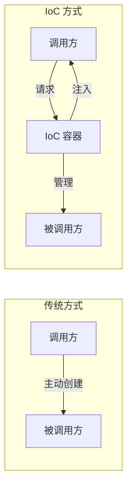
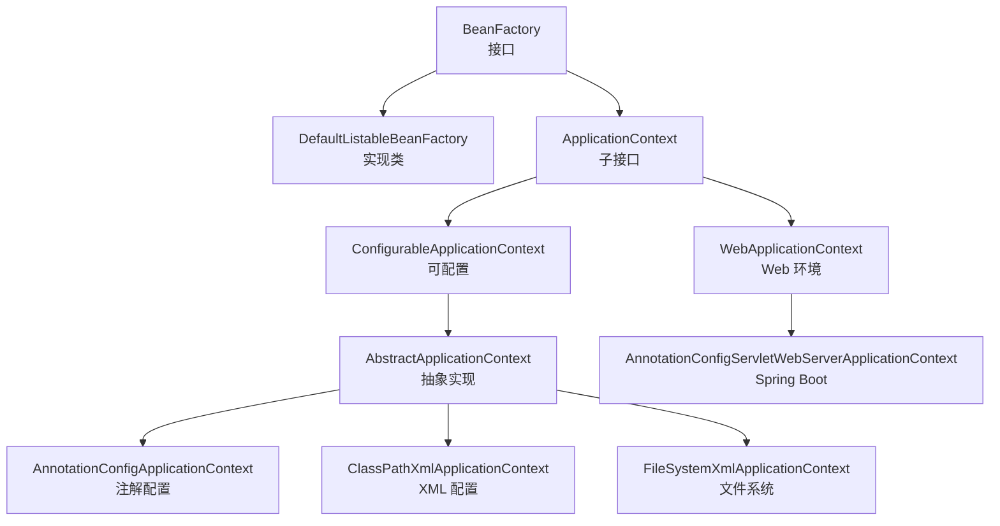
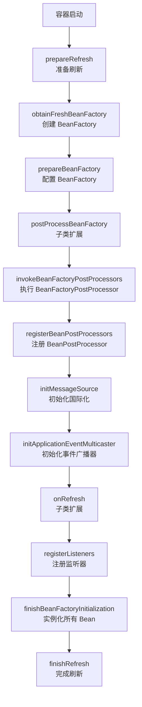
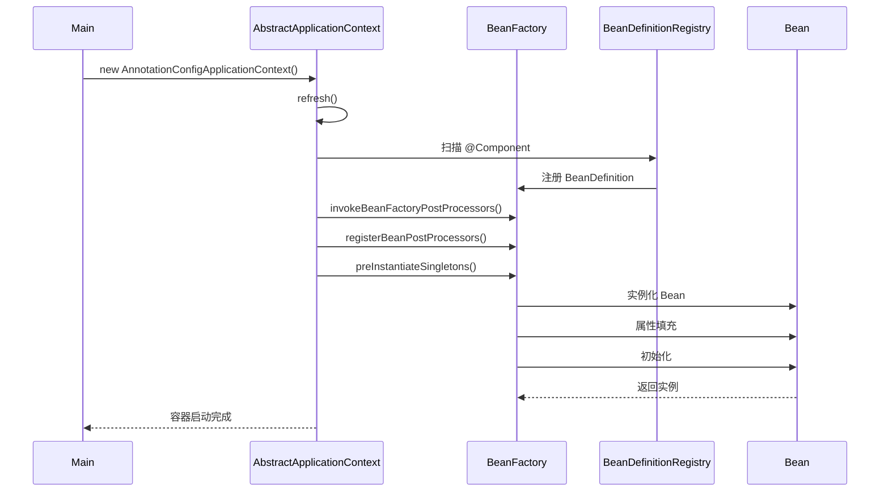
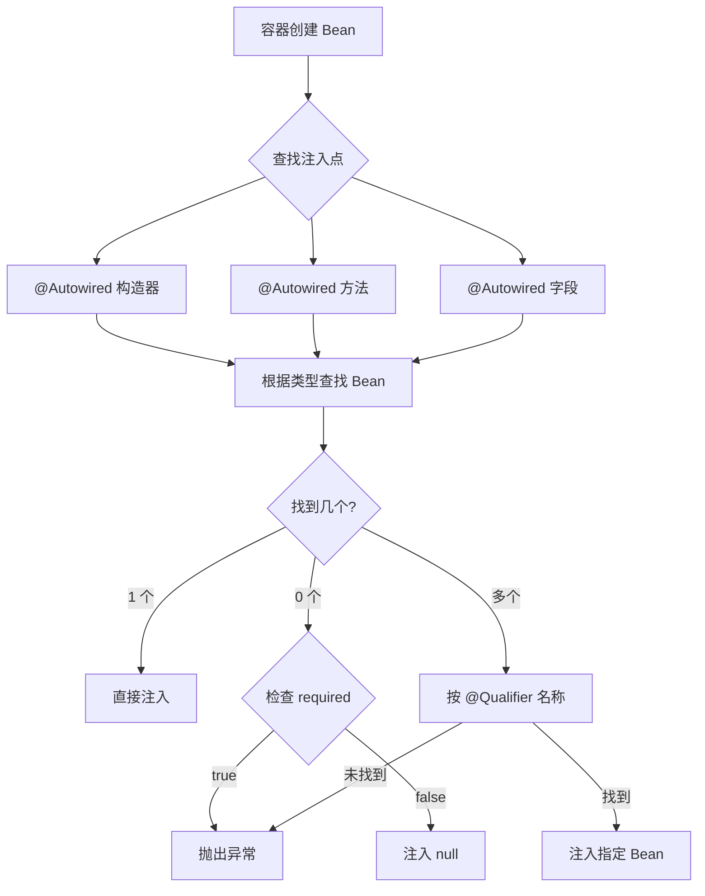
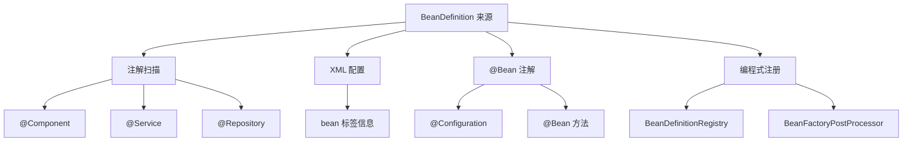

# Spring 阶段一：IoC 容器原理

## 📋 目录

1. [IoC 思想与 DI 注入](#一、ioc-思想与-di-注入)
2. [BeanFactory vs ApplicationContext](#二、beanfactory-vs-applicationcontext)
3. [容器启动流程](#三、容器启动流程)
4. [依赖注入方式](#四、依赖注入方式)
5. [BeanDefinition](#五、BeanDefinition)
6. [面试题汇总](#六、面试题汇总)

---

## 一、IoC 思想与 DI 注入

### 1.1 核心概念（面试话术）

> **IoC（Inversion of Control，控制反转）**是一种设计思想，**DI（Dependency Injection，依赖注入）**是 IoC 的实现方式。
> Spring 的 IoC 容器负责**创建对象**、**管理对象的生命周期**、**注入依赖关系**，将对象的创建权从调用方转移给容器。



### 1.2 IoC vs DI 对比

| 维度     | IoC（控制反转）      | DI（依赖注入）     |
| -------- | -------------------- | ------------------ |
| **定位** | 设计思想、设计原则   | 实现方式、设计模式 |
| **核心** | 转移对象创建控制权   | 容器主动注入依赖   |
| **关系** | IoC 是目标           | DI 是手段          |
| **比喻** | "找个管家帮我管东西" | "管家把东西送给我" |

> **面试话术**：IoC 和 DI 是同一个概念的不同描述角度——**IoC 说的是"谁来控制对象创建"（从代码反转给容器），DI 说的是"如何获取依赖对象"（容器注入而非自己创建）**。

### 1.3 DI 注入的三种方式

```java
@Component
public class UserService {
    private UserRepository userRepository;

    // 方式1：构造器注入
    // 不可变、强制依赖、利于测试
    @Autowired
    public UserService(UserRepository userRepository) {
        this.userRepository = userRepository;
    }

    // 方式2：Setter 注入
    // 灵活、可选依赖
    @Autowired
    public void setUserRepository(UserRepository userRepository) {
        this.userRepository = userRepository;
    }

    // 方式3：字段注入
    // 简洁，但对象脱离 Spring 环境后无法正常工作
    @Autowired
    private UserRepository anotherUserRepository;
}
```

---

## 二、BeanFactory vs ApplicationContext

### 2.1 容器继承体系



### 2.2 BeanFactory（基础容器）

```java
// BeanFactory 是 Spring 的基础容器接口
public interface BeanFactory {
    String FACTORY_BEAN_PREFIX = "&";

    // 根据 name 获取 Bean
    Object getBean(String name) throws BeansException;

    // 根据 type 获取 Bean
    <T> T getBean(Class<T> requiredType) throws BeansException;

    // 判断是否包含 Bean
    boolean containsBean(String name);

    // 是否单例
    boolean isSingleton(String name) throws NoSuchBeanDefinitionException;
}
```

**核心特点**：

- **延迟加载**（Lazy Load）：只有在 `getBean()` 时才创建对象
- **轻量级**：启动快，占用资源少
- **基础功能**：只提供 IoC 容器最核心的功能（提供 Bean 对象）

### 2.3 ApplicationContext（高级容器）

```java
public interface ApplicationContext extends EnvironmentCapable,
        ListableBeanFactory, HierarchicalBeanFactory,
        MessageSource, ApplicationEventPublisher, ResourcePatternResolver {

    // 获取环境信息
    Environment getEnvironment();

    // 发布事件
    void publishEvent(ApplicationEvent event);

    // 获取资源
    Resource getResource(String location);
}
```

**核心特点**：

- **立即加载**（Eager Load）：容器启动时创建所有 Bean
- **扩展功能**：
  - 事件发布（ApplicationEventPublisher）
  - 资源加载（ResourceLoader）
  - 环境信息（Environment）
  - 国际化（MessageSource）

**使用场景**：Web 应用、Spring Boot 应用（默认使用）

### 2.4 对比总结

| 特性         | BeanFactory                | ApplicationContext                    |
| ------------ | -------------------------- | ------------------------------------- |
| **加载时机** | 延迟加载                   | 立即加载                              |
| **功能范围** | IoC 基础功能               | IoC + AOP + 事件发布 + 资源加载等     |
| **启动速度** | 快                         | 慢（需创建所有 Bean）                 |
| **实现类**   | DefaultListableBeanFactory | AnnotationConfigApplicationContext 等 |

> **高频面试题**：为什么 Spring Boot 默认用 ApplicationContext？
> **答**：Web 应用需要立即发现问题（启动时创建 Bean），避免运行时空指针异常；且需要事件发布、资源加载等高级功能。

---

## 三、容器启动流程

### 3.1 容器启动核心方法：`refresh()`



### 3.2 refresh() 关键步骤源码分析

```java
// org.springframework.context.support.AbstractApplicationContext
@Override
public void refresh() throws BeansException, IllegalStateException {
    synchronized (this.startupShutdownMonitor) {
        // 1. 准备刷新（记录启动时间、初始化属性源）
        prepareRefresh();

        // 2. 创建 BeanFactory，加载 BeanDefinition（核心步骤）
        ConfigurableListableBeanFactory beanFactory = obtainFreshBeanFactory();

        // 3. 配置 BeanFactory（设置类加载器、表达式解析器等）
        prepareBeanFactory(beanFactory);

        try {
            // 4. 子类扩展点（允许子类修改 BeanFactory）
            postProcessBeanFactory(beanFactory);

            // 5. 执行 BeanFactoryPostProcessor（修改 BeanDefinition）
            invokeBeanFactoryPostProcessors(beanFactory);

            // 6. 注册 BeanPostProcessor（拦截 Bean 创建）
            registerBeanPostProcessors(beanFactory);

            // 7. 初始化国际化
            initMessageSource();

            // 8. 初始化事件广播器
            initApplicationEventMulticaster();

            // 9. 子类扩展（如 Tomcat 启动）
            onRefresh();

            // 10. 注册监听器
            registerListeners();

            // 11. 实例化所有非延迟加载的 Bean（核心步骤）
            finishBeanFactoryInitialization(beanFactory);

            // 12. 完成刷新（发布事件）
            finishRefresh();
        } catch (BeansException ex) {
            destroyBeans();
            cancelRefresh(ex);
            throw ex;
        }
    }
}
```

### 3.3 关键步骤拆解

#### 步骤 2：obtainFreshBeanFactory() - 创建 BeanFactory

```java
protected ConfigurableListableBeanFactory obtainFreshBeanFactory() {
    // 刷新 BeanFactory（序列化 ID、销毁旧 BeanFactory）
    refreshBeanFactory();

    // 返回新创建的 BeanFactory
    ConfigurableListableBeanFactory beanFactory = getBeanFactory();
    return beanFactory;
}
```

**核心逻辑**：

1. 创建 `DefaultListableBeanFactory`
2. 加载 `BeanDefinition`（从 @ComponentScan 或 XML）
3. 注册别名、BeanDefinition

#### 步骤 5：invokeBeanFactoryPostProcessors() - 执行后置处理器

```java
protected void invokeBeanFactoryPostProcessors(ConfigurableListableBeanFactory beanFactory) {
    // 执行 BeanDefinitionRegistryPostProcessor（可注册 BeanDefinition）
    PostProcessorRegistrationDelegate.invokeBeanFactoryPostProcessors(beanFactory, getBeanFactoryPostProcessors());
}
```

**典型应用**：`PropertySourcesPlaceholderConfigurer`（解析 ${} 占位符）

#### 步骤 11：finishBeanFactoryInitialization() - 实例化 Bean

```java
protected void finishBeanFactoryInitialization(ConfigurableListableBeanFactory beanFactory) {
    // 设置 ConversionService（类型转换）
    if (beanFactory.containsBean(CONVERSION_SERVICE_BEAN_NAME)) {
        beanFactory.setConversionService(
            beanFactory.getBean(CONVERSION_SERVICE_BEAN_NAME, ConversionService.class));
    }

    // 实例化所有非延迟加载的 Bean
    beanFactory.preInstantiateSingletons();
}
```

### 3.4 容器启动时序图



---

## 四、依赖注入方式

### 4.1 @Autowired 工作原理

```java
@Target({ElementType.CONSTRUCTOR, ElementType.METHOD,
         ElementType.FIELD, ElementType.PARAMETER})
@Retention(RetentionPolicy.RUNTIME)
@Documented
public @interface Autowired {
    boolean required() default true;
}
```

**注入流程**：



### 4.2 @Autowired vs @Resource

| 特性         | @Autowired                 | @Resource                |
| ------------ | -------------------------- | ------------------------ |
| **来源**     | Spring                     | JDK（JSR-250）           |
| **注入方式** | 按**类型**注入             | 按**名称**注入，再按类型 |
| **匹配不到** | required=false 可以为 null | 抛出异常                 |
| **配合注解** | @Qualifier 指定名称        | 无需配合                 |

```java
@Service
public class UserService {
    // @Autowired + @Qualifier 指定名称
    @Autowired
    @Qualifier("userRepositoryImpl")
    private UserRepository userRepository;

    // @Resource 直接指定名称
    @Resource(name = "userRepositoryImpl")
    private UserRepository userRepository2;
}
```

### 4.3 构造器注入的歧义问题

**问题**：多个构造器时，Spring 如何选择？

```java
@Component
public class UserService {
    private UserRepository userRepository;
    private EmailService emailService;

    // Spring 4.3+：无 @Autowired，自动选唯一构造器
    public UserService(UserRepository userRepository) {
        this.userRepository = userRepository;
    }

    // 多个构造器时，必须加 @Autowired
    @Autowired
    public UserService(UserRepository userRepository, EmailService emailService) {
        this.userRepository = userRepository;
        this.emailService = emailService;
    }
}
```

**选择规则**：

1. **唯一构造器**：自动选择（Spring 4.3+）
2. **多个构造器**：必须加 `@Autowired`

---

## 五、BeanDefinition

### 5.1 BeanDefinition 是什么？

> **BeanDefinition** 是 Bean 的**元信息**（Metadata），描述了如何创建一个 Bean（类名、Scope、依赖关系等），类似于 Java 的 `java.lang.Class`，但面向 Spring 容器。

```java
public interface BeanDefinition extends AttributeAccessor, BeanMetadataElement {
    // Bean 的作用域（singleton、prototype）
    String SCOPE_SINGLETON = ConfigurableBeanFactory.SCOPE_SINGLETON;
    String SCOPE_PROTOTYPE = ConfigurableBeanFactory.SCOPE_PROTOTYPE;

    // 设置/获取 Bean 的 类名
    void setBeanClassName(String beanClassName);
    String getBeanClassName();

    // 设置/获取 Scope
    void setScope(String scope);
    String getScope();

    // 设置/获取是否懒加载
    void setLazyInit(boolean lazyInit);
    boolean isLazyInit();

    // 设置/获取依赖的 Bean
    void setDependsOn(String... dependsOn);
    String[] getDependsOn();

    // 设置/获取是否自动注入
    void setAutowireMode(int autowireMode);
    int getAutowireMode();

    // Bean 是否单例
    boolean isSingleton();
    // Bean 是否原型（多例）
    boolean isPrototype();
}
```

### 5.2 BeanDefinition 的来源



### 5.3 BeanDefinition vs BeanInstance

| 维度     | BeanDefinition        | BeanInstance                    |
| -------- | --------------------- | ------------------------------- |
| **性质** | 元信息（配置）        | 实际对象                        |
| **时机** | 容器启动时创建        | 调用 getBean() 或容器启动时创建 |
| **内容** | 类名、Scope、依赖关系 | 实际的 Java 对象                |
| **比喻** | 建筑设计图纸          | 盖好的房子                      |

```java
// 示例：编程式注册 BeanDefinition
AnnotationConfigApplicationContext context =
    new AnnotationConfigApplicationContext(AppConfig.class);

// 获取 BeanFactory
ConfigurableListableBeanFactory beanFactory = context.getBeanFactory();

// 创建 BeanDefinition
BeanDefinition bd = BeanDefinitionBuilder
    .genericBeanDefinition(UserService.class)
    .setScope(ConfigurableBeanFactory.SCOPE_PROTOTYPE)
    .addPropertyValue("name", "张三")
    .getBeanDefinition();

// 注册 BeanDefinition
beanFactory.registerBeanDefinition("userService", bd);
```

---

## 六、面试题汇总

### 6.1 什么是 IoC？什么是 DI？两者关系？

> **答**：
>
> - **IoC（控制反转）**：是一种设计思想，将对象的创建权从调用方转移给容器。
> - **DI（依赖注入）**：是 IoC 的实现方式，容器主动向对象注入依赖关系。
> - **关系**：IoC 是目标，DI 是手段——通过依赖注入实现控制反转。

### 6.2 BeanFactory 和 ApplicationContext 的区别？

> **答**：
>
> 1. **加载时机**：BeanFactory 延迟加载（getBean 时创建），ApplicationContext 立即加载（启动时创建）。
> 2. **功能范围**：BeanFactory 只提供 IoC 基础功能；ApplicationContext 在 BeanFactory 的基础上扩展了事件发布、资源加载等功能。
> 3. **继承关系**：ApplicationContext 继承自 BeanFactory，是高级容器。

### 6.3 @Autowired 和 @Resource 的区别？

> **答**：
>
> 1. **来源**：@Autowired 是 Spring 注解；@Resource 是 JDK 注解（JSR-250）。
> 2. **注入方式**：@Autowired 按**类型**注入；@Resource 按**名称**注入，找不到再按类型。
> 3. **配合注解**：@Autowired 需配合 @Qualifier 指定名称；@Resource 直接通过 name 属性指定。
> 4. **required 属性**：@Autowired(required=false) 可以为 null；@Resource 匹配不到直接抛异常。

### 6.4 Spring 容器启动流程？

> **答**：核心方法是 `AbstractApplicationContext#refresh()`，共 12 个步骤：
>
> 1. `prepareRefresh()` - 准备刷新（记录启动时间、初始化属性源）
> 2. `obtainFreshBeanFactory()` - 创建 BeanFactory，加载 BeanDefinition
> 3. `prepareBeanFactory()` - 配置 BeanFactory（设置类加载器、表达式解析器）
> 4. `postProcessBeanFactory()` - 子类扩展点
> 5. `invokeBeanFactoryPostProcessors()` - 执行 BeanFactoryPostProcessor
> 6. `registerBeanPostProcessors()` - 注册 BeanPostProcessor
> 7. `initMessageSource()` - 初始化国际化
> 8. `initApplicationEventMulticaster()` - 初始化事件广播器
> 9. `onRefresh()` - 子类扩展（如 Tomcat 启动）
> 10. `registerListeners()` - 注册监听器
> 11. `finishBeanFactoryInitialization()` - **实例化所有 Bean**
> 12. `finishRefresh()` - 完成刷新（发布 ContextRefreshedEvent）

### 6.5 为什么推荐构造器注入？

> **答**：
>
> 1. **不可变性**：字段可声明为 final，保证线程安全。
> 2. **强制依赖**：构造时必须传入，避免空指针异常。
> 3. **明确依赖**：构造参数清晰表达依赖关系。
> 4. **利于测试**：可以脱离 Spring 容器，直接 new 对象传入依赖。
> 5. **Spring 官方推荐**：Spring 5.x 强制要求使用构造器注入。

### 6.6 什么是 BeanDefinition？

> **答**：BeanDefinition 是 Bean 的**元信息**（Metadata），描述了如何创建一个 Bean（类名、Scope、依赖关系、初始化方法等）。容器启动时先创建 BeanDefinition，再根据 BeanDefinition 创建 Bean 实例。

---

## 📚 核心源码路径

```java
// 容器接口
org.springframework.beans.factory.BeanFactory
org.springframework.context.ApplicationContext

// 容器实现
org.springframework.beans.factory.support.DefaultListableBeanFactory
org.springframework.context.support.AbstractApplicationContext

// BeanDefinition
org.springframework.beans.factory.config.BeanDefinition
org.springframework.beans.factory.support.BeanDefinitionBuilder

// 注解
org.springframework.beans.factory.annotation.Autowired
org.springframework.beans.factory.annotation.Qualifier
```
