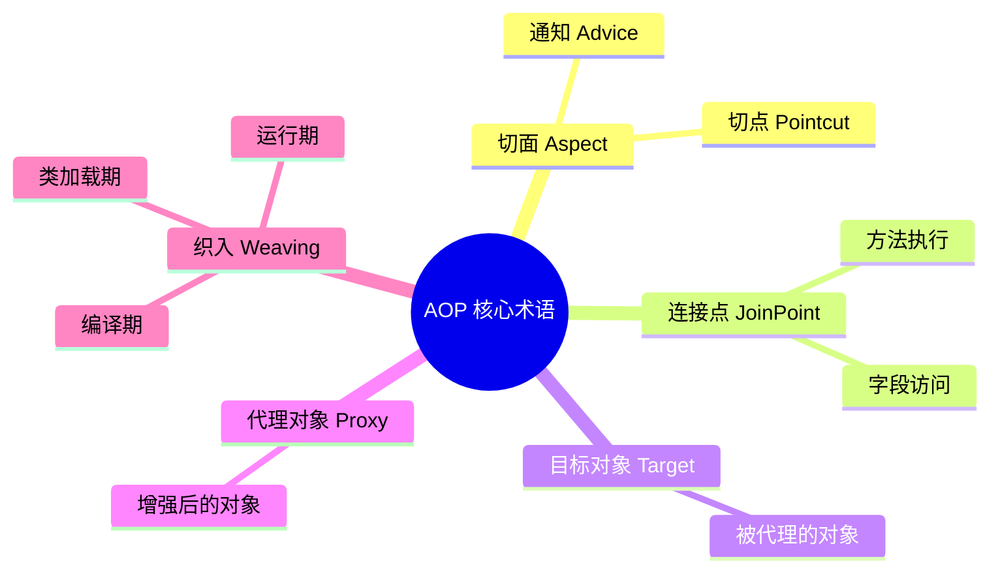
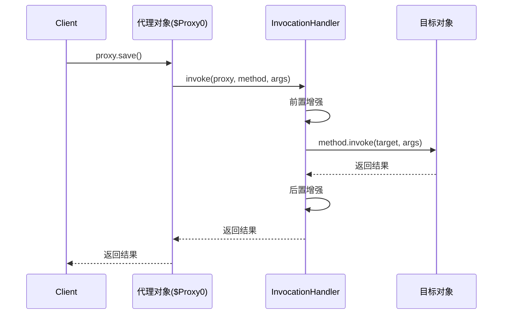
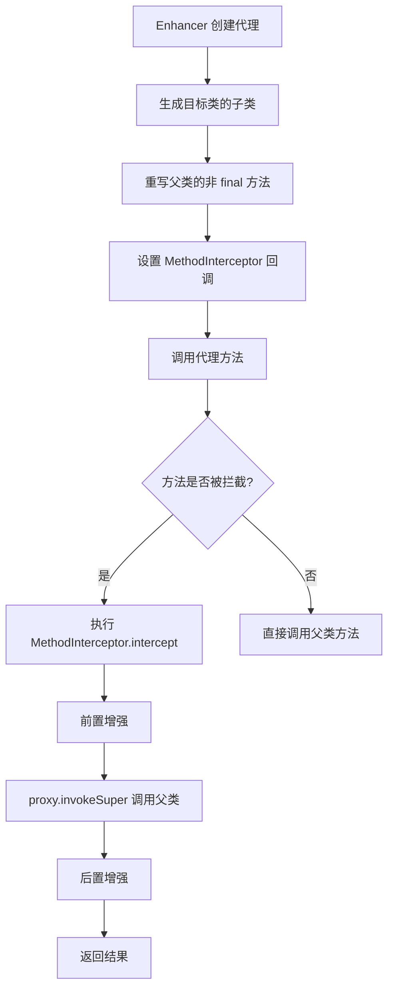
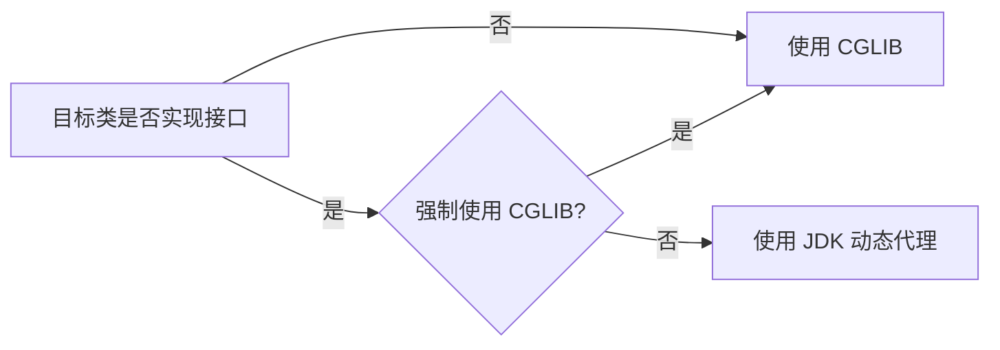
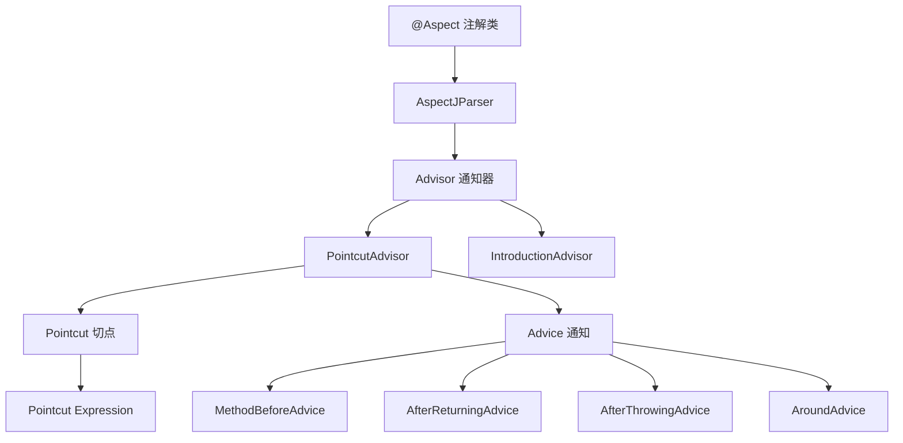
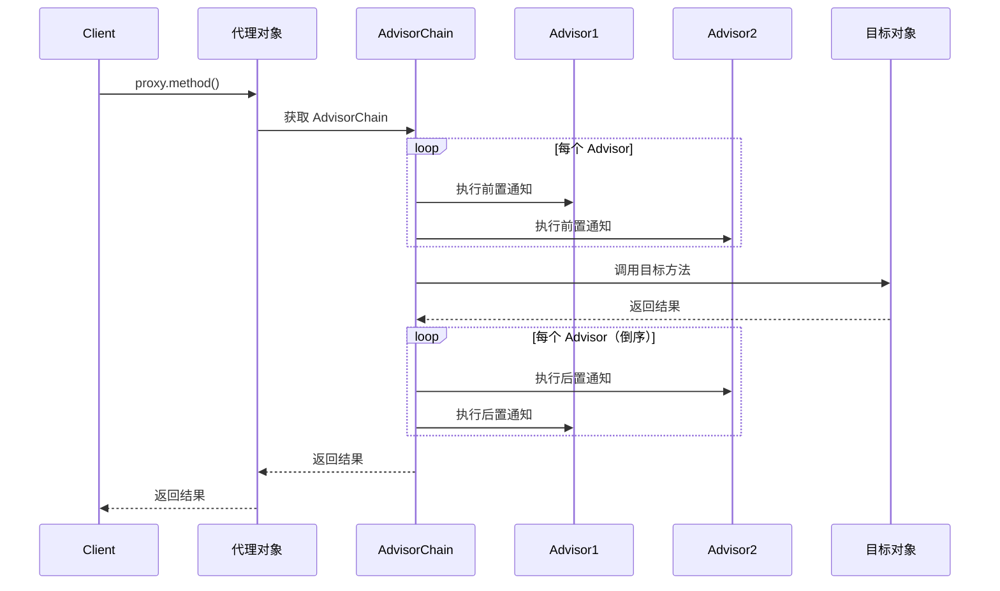
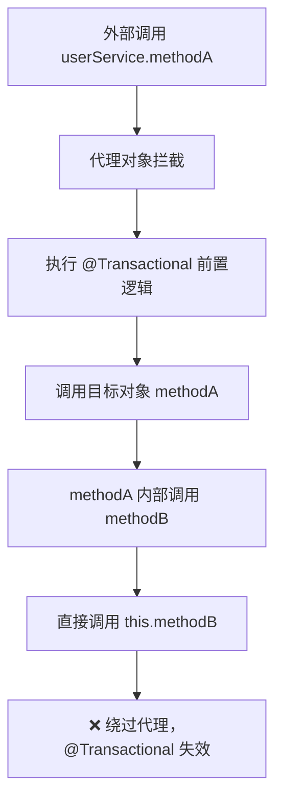

# Spring 阶段二：AOP 原理

## 📋 目录

1. [AOP 核心概念](#一、aop-核心概念)
2. [JDK 动态代理](#二、jdk-动态代理)
3. [CGLIB 动态代理](#三、cglib-动态代理)
4. [JDK vs CGLIB 对比](#四、jdk-vs-cglib-对比)
5. [Spring AOP 实现机制](#五、spring-aop-实现机制)
6. [@Aspect 注解原理](#六、aspect-注解原理)
7. [代理失效场景](#七、代理失效场景)
8. [面试题汇总](#八、面试题汇总)

---

## 一、AOP 核心概念

### 1.1 什么是 AOP？

> **AOP（Aspect-Oriented Programming，面向切面编程）**是一种编程范式，通过**预编译方式**和**运行期动态代理**实现程序功能的统一维护。AOP 是 OOP（面向对象编程）的补充，用于解决**横切关注点**（Cross-cutting Concerns）问题。

### 1.2 核心术语（面试必背）



| 术语         | 英文      | 说明                       | 示例                                       |
| ------------ | --------- | -------------------------- | ------------------------------------------ |
| **切面**     | Aspect    | 横切关注点的模块化         | @Aspect 注解的类                           |
| **连接点**   | JoinPoint | 程序执行的某个位置         | 方法执行、异常抛出                         |
| **切点**     | Pointcut  | 匹配连接点的表达式         | @Pointcut("execution(_ com.._.\*(..))")    |
| **通知**     | Advice    | 切面在特定连接点执行的动作 | @Before、@After、@Around                   |
| **目标对象** | Target    | 被代理的对象               | UserService                                |
| **代理对象** | Proxy     | 增强后的对象               | $Proxy、UserService$$EnhancerBySpringCGLIB |
| **织入**     | Weaving   | 将切面应用到目标对象的过程 | Spring AOP 在运行时织入                    |

### 1.3 通知类型（5 种）

```java
@Aspect
@Component
public class LoggingAspect {

    // 1. 前置通知：方法执行前
    @Before("execution(* com.example.service.*.*(..))")
    public void beforeAdvice(JoinPoint joinPoint) {
        System.out.println("前置通知：" + joinPoint.getSignature().getName());
    }

    // 2. 后置通知：方法执行后（无论成功或异常）
    @After("execution(* com.example.service.*.*(..))")
    public void afterAdvice(JoinPoint joinPoint) {
        System.out.println("后置通知：" + joinPoint.getSignature().getName());
    }

    // 3. 返回通知：方法成功返回后
    @AfterReturning(pointcut = "execution(* com.example.service.*.*(..))",
                     returning = "result")
    public void afterReturningAdvice(JoinPoint joinPoint, Object result) {
        System.out.println("返回通知：" + joinPoint.getSignature().getName() + ", 结果：" + result);
    }

    // 4. 异常通知：方法抛出异常后
    @AfterThrowing(pointcut = "execution(* com.example.service.*.*(..))",
                   throwing = "ex")
    public void afterThrowingAdvice(JoinPoint joinPoint, Exception ex) {
        System.out.println("异常通知：" + joinPoint.getSignature().getName() + ", 异常：" + ex.getMessage());
    }

    // 5. 环绕通知：包围方法执行（最强大）
    @Around("execution(* com.example.service.*.*(..))")
    public Object aroundAdvice(ProceedingJoinPoint joinPoint) throws Throwable {
        System.out.println("环绕通知 - 前");
        Object result = joinPoint.proceed();  // 执行目标方法
        System.out.println("环绕通知 - 后");
        return result;
    }
}
```

| 通知类型     | 注解            | 执行时机       | 能否修改参数 | 能否修改返回值 | 能否阻止执行 |
| ------------ | --------------- | -------------- | ------------ | -------------- | ------------ |
| 前置通知     | @Before         | 方法执行前     | ❌           | ❌             | ❌           |
| 后置通知     | @After          | 方法执行后     | ❌           | ❌             | ❌           |
| 返回通知     | @AfterReturning | 方法成功返回后 | ❌           | ✅             | ❌           |
| 异常通知     | @AfterThrowing  | 方法抛出异常后 | ❌           | ❌             | ❌           |
| **环绕通知** | **@Around**     | **包围方法**   | **✅**       | **✅**         | **✅**       |

> **面试话术**：环绕通知 @Around 是最强大的通知类型，因为它可以：
>
> 1. 控制目标方法是否执行（调用 proceed()）
> 2. 修改方法参数
> 3. 修改返回值
> 4. 捕获异常并处理

---

## 二、JDK 动态代理

### 2.1 核心原理

> **JDK 动态代理**利用**反射机制**在运行时动态生成代理类，代理类实现目标类的所有接口。JDK 动态代理要求目标类**必须实现接口**。

### 2.2 使用示例

```java
// 1. 定义接口
public interface UserService {
    void save();
    void delete();
}

// 2. 目标类（实现接口）
@Service
public class UserServiceImpl implements UserService {
    @Override
    public void save() {
        System.out.println("保存用户");
    }

    @Override
    public void delete() {
        System.out.println("删除用户");
    }
}

// 3. JDK 动态代理实现
public class JDKProxyTest {
    public static void main(String[] args) {
        UserService target = new UserServiceImpl();

        // 创建代理对象
        UserService proxy = (UserService) Proxy.newProxyInstance(
            target.getClass().getClassLoader(),           // 类加载器
            target.getClass().getInterfaces(),            // 目标类实现的接口
            new InvocationHandler() {                     // 调用处理器
                @Override
                public Object invoke(Object proxy, Method method, Object[] args) throws Throwable {
                    System.out.println("前置增强");
                    Object result = method.invoke(target, args);  // 调用目标方法
                    System.out.println("后置增强");
                    return result;
                }
            }
        );

        proxy.save();  // 调用代理对象的方法
    }
}
```

**输出**：

```
前置增强
保存用户
后置增强
```

### 2.3 JDK 动态代理源码分析

```java
// java.lang.reflect.Proxy
public static Object newProxyInstance(ClassLoader loader,
                                      Class<?>[] interfaces,
                                      InvocationHandler h) {
    // 1. 检查参数
    Objects.requireNonNull(h);

    // 2. 获取代理类（可能从缓存获取）
    Class<?> cl = getProxyClass0(loader, intfs);

    // 3. 获取代理类的构造器（参数为 InvocationHandler）
    final Constructor<?> cons = cl.getConstructor(constructorParams);

    // 4. 创建代理对象实例
    return cons.newInstance(new Object[]{h});
}

// 生成的代理类（简化版）
public final class $Proxy0 extends Proxy implements UserService {
    private static Method m1;
    private static Method m2;
    private static Method m3;

    static {
        try {
            m1 = Class.forName("java.lang.Object").getMethod("equals", Class.forName("java.lang.Object"));
            m2 = Class.forName("java.lang.Object").getMethod("toString");
            m3 = Class.forName("com.example.UserService").getMethod("save");
        } catch (NoSuchMethodException var2) { }
    }

    public $Proxy0(InvocationHandler var1) {
        super(var1);
    }

    public final void save() {
        try {
            super.h.invoke(this, m3, null);  // 调用 InvocationHandler
        } catch (RuntimeException | Error var2) {
            throw var2;
        } catch (Throwable var3) {
            throw new UndeclaredThrowableException(var3);
        }
    }
}
```

**关键点**：

1. 代理类 `$Proxy0` 继承 `Proxy`，实现 `UserService` 接口
2. 方法调用被转发到 `InvocationHandler#invoke()`
3. 通过反射调用目标方法 `method.invoke(target, args)`

### 2.4 JDK 动态代理执行流程



---

## 三、CGLIB 动态代理

### 3.1 核心原理

> **CGLIB（Code Generation Library）**通过**字节码生成技术**在运行时动态生成代理类的子类，并**重写父类方法**实现代理。CGLIB 不要求目标类实现接口。

### 3.2 使用示例

```java
// 1. 目标类（无需实现接口）
@Service
public class OrderService {
    public void create() {
        System.out.println("创建订单");
    }

    public void cancel() {
        System.out.println("取消订单");
    }
}

// 2. CGLIB 代理实现
public class CGLIBProxyTest {
    public static void main(String[] args) {
        OrderService target = new OrderService();

        // 创建代理对象
        Enhancer enhancer = new Enhancer();
        enhancer.setSuperclass(target.getClass());          // 设置父类
        enhancer.setCallback(new MethodInterceptor() {      // 设置回调
            @Override
            public Object intercept(Object obj, Method method, Object[] args, MethodProxy proxy) throws Throwable {
                System.out.println("前置增强");
                Object result = proxy.invokeSuper(obj, args);  // 调用父类方法
                System.out.println("后置增强");
                return result;
            }
        });

        OrderService proxy = (OrderService) enhancer.create();
        proxy.create();  // 调用代理对象的方法
    }
}
```

**输出**：

```
前置增强
创建订单
后置增强
```

### 3.3 CGLIB 工作原理



### 3.4 JDK vs CGLIB 代理类对比

| 特性             | JDK 动态代理                  | CGLIB 动态代理                               |
| ---------------- | ----------------------------- | -------------------------------------------- |
| **代理类名**     | `$Proxy0`、`$Proxy1`          | `OrderService$$EnhancerBySpringCGLIB$$12345` |
| **继承关系**     | 继承 `Proxy`，实现接口        | 继承目标类                                   |
| **方法调用**     | `InvocationHandler#invoke()`  | `MethodInterceptor#intercept()`              |
| **目标方法调用** | `method.invoke(target, args)` | `proxy.invokeSuper(obj, args)`               |
| **类加载器**     | 目标类类加载器                | 自定义 `ClassLoader`                         |

---

## 四、JDK vs CGLIB 对比

### 4.1 核心区别



| 对比维度            | JDK 动态代理           | CGLIB 动态代理      |
| ------------------- | ---------------------- | ------------------- |
| **实现原理**        | 反射机制               | 字节码生成（ASM）   |
| **代理类继承**      | 继承 `Proxy`，实现接口 | 继承目标类          |
| **JDK 支持**        | 原生支持               | 需要引入 CGLIB 依赖 |
| **final 类、方法**  | 不影响                 | ❌ 无法代理         |
| **Spring 优先选择** | ✅ 优先选择            | 降级方案            |
| **性能**            | 创建快，执行稍慢       | 创建慢，执行快      |

### 4.2 Spring AOP 代理选择策略

```java
// DefaultAopProxyFactory#createProxy()
public AopProxy createAopProxy(AdvisedSupport config) throws AopConfigException {
    // 如果配置了强制使用 CGLIB或者目标对象没有实现任何接口
    if (config.isOptimize() || config.isProxyTargetClass() || hasNoUserSuppliedProxyInterfaces(config)) {
        // 使用 CGLIB 动态代理
        return new CglibAopProxy(config);
    } else {
        // 其他情况都使用 JDK 动态代理
        return new JdkDynamicAopProxy(config);
    }
}
```

**选择策略**：

1. **目标类实现接口** → 使用 JDK 动态代理
2. **目标类未实现接口** → 使用 CGLIB
3. **强制使用 CGLIB** → `@EnableAspectJAutoProxy(proxyTargetClass = true)`

> **面试话术**：Spring AOP 默认优先使用 JDK 动态代理，因为：
>
> 1. JDK 动态代理是 Java 原生支持，无需额外依赖
> 2. JDK 动态代理遵循面向接口编程的原则
> 3. JDK 动态代理生成的代理类更轻量
> 4. 只有当目标类未实现接口时，才降级使用 CGLIB

---

## 五、Spring AOP 实现机制

### 5.1 Spring AOP 核心组件



| 组件          | 说明                            | 示例                                       |
| ------------- | ------------------------------- | ------------------------------------------ |
| **Advisor**   | 通知器，包含 Pointcut 和 Advice | `AspectJExpressionPointcutAdvisor`         |
| **Pointcut**  | 切点，匹配连接点                | `execution(* com.example.service.*.*(..))` |
| **Advice**    | 通知，在切点执行的动作          | `MethodBeforeAdvice`、`AroundAdvice`       |
| **JoinPoint** | 连接点，程序执行的位置          | 方法执行、异常抛出                         |

### 5.2 Spring AOP 代理创建流程

```java
// AbstractAutoProxyCreator#createProxy()
protected Object createProxy(Class<?> beanClass, @Nullable String beanName,
                             @Nullable Object[] specificInterceptors, TargetSource targetSource) {
    // 1. 获取 Advisors（通知器）
    Object[] advisors = buildAdvisors(beanName, specificInterceptors);

    // 2. 创建代理工厂
    ProxyFactory proxyFactory = new ProxyFactory();
    proxyFactory.copyFrom(this.advised);

    // 3. 判断使用 JDK 还是 CGLIB
    if (!proxyFactory.isProxyTargetClass()) {
        if (shouldUseCGLIB(proxyFactory)) {  // 判断是否使用 CGLIB
            proxyFactory.setProxyTargetClass(true);
        }
    }

    // 4. 创建代理对象
    return proxyFactory.getProxy(getProxyClassLoader());
}
```

### 5.3 Spring AOP 代理执行流程



---

## 六、@Aspect 注解原理

### 6.1 @Aspect 注解解析

```java
@Aspect
@Component
public class TransactionAspect {

    @Pointcut("execution(* com.example.service.*.*(..))")
    public void serviceLayer() {}

    @Before("serviceLayer()")
    public void beforeAdvice(JoinPoint joinPoint) {
        System.out.println("前置通知");
    }

    @Around("serviceLayer()")
    public Object aroundAdvice(ProceedingJoinPoint joinPoint) throws Throwable {
        System.out.println("环绕通知 - 前");
        Object result = joinPoint.proceed();
        System.out.println("环绕通知 - 后");
        return result;
    }
}
```

### 6.2 @Aspect 注解解析流程

```java
// AspectJAutoProxyBeanPostProcessor#postProcessBeforeInitialization
@Override
public Object postProcessBeforeInitialization(Object bean, String beanName) {
    // 1. 扫描 @Aspect 注解的类
    if (bean.getClass().isAnnotationPresent(Aspect.class)) {
        // 2. 解析 @Pointcut、@Before、@After 等注解
        parseAspectAnnotations(bean);
    }
    return bean;
}

private void parseAspectAnnotations(Object aspectBean) {
    Class<?> aspectClass = aspectBean.getClass();

    // 1. 解析 @Pointcut
    for (Method method : aspectClass.getDeclaredMethods()) {
        if (method.isAnnotationPresent(Pointcut.class)) {
            Pointcut pointcut = method.getAnnotation(Pointcut.class);
            // 保存切点表达式
            registerPointcut(pointcut.value(), method);
        }
    }

    // 2. 解析 @Before、@After、@Around
    for (Method method : aspectClass.getDeclaredMethods()) {
        if (method.isAnnotationPresent(Before.class)) {
            Before before = method.getAnnotation(Before.class);
            // 创建 Advisor：Pointcut + Advice
            Advisor advisor = createAdvisor(before.value(), method, aspectBean);
            registerAdvisor(advisor);
        }
    }
}
```

### 6.3 @Aspect 注解到 Advisor 的映射

| @Aspect 注解    | Advice 类型            | Advisor 类型                  | 执行时机              |
| --------------- | ---------------------- | ----------------------------- | --------------------- |
| @Before         | `MethodBeforeAdvice`   | `AspectJMethodBeforeAdvice`   | 方法执行前            |
| @After          | `AfterAdvice`          | `AspectJAfterAdvice`          | 方法执行后（finally） |
| @AfterReturning | `AfterReturningAdvice` | `AspectJAfterReturningAdvice` | 方法成功返回后        |
| @AfterThrowing  | `ThrowsAdvice`         | `AspectJAfterThrowingAdvice`  | 方法抛出异常后        |
| @Around         | `MethodInterceptor`    | `AspectJAroundAdvice`         | 包围方法执行          |

---

## 七、代理失效场景

### 7.1 自调用导致代理失效

**问题代码**：

```java
@Service
public class UserService {
    @Autowired
    private UserRepository userRepository;

    @Transactional
    public void methodA() {
        methodB();  // ❌ 自调用，@Transactional 失效
    }

    @Transactional
    public void methodB() {
        userRepository.save();
    }
}
```

**原因分析**：



**解决方案**：

```java
// 方案1：自己注入自己（推荐）⭐⭐⭐⭐⭐
@Service
public class UserService {
    @Autowired
    private UserRepository userRepository;

    @Autowired
    private UserService self;  // Spring 会注入代理对象

    @Transactional
    public void methodA() {
        self.methodB();  // ✅ 通过代理对象调用
    }

    @Transactional
    public void methodB() {
        userRepository.save();
    }
}

// 方案2：使用 AopContext.currentProxy()
@Service
public class UserService {
    @Transactional
    public void methodA() {
        ((UserService) AopContext.currentProxy()).methodB();  // ✅ 通过代理对象调用
    }
}

// 方案3：拆分到另一个 Service
@Service
public class UserService {
    @Autowired
    private UserRepository userRepository;
    @Autowired
    private UserLogService userLogService;

    @Transactional
    public void methodA() {
        userLogService.log();  // ✅ 调用其他 Service 的代理对象
    }
}

@Service
public class UserLogService {
    @Transactional
    public void log() {
        // 日志逻辑
    }
}

// 方案4：编程式事务
```

### 7.2 private/方法导致代理失效

**问题代码**：

```java
@Service
public class UserService {
    @Transactional
    private void methodB() {  // ❌ private 方法无法代理
        userRepository.save();
    }
}
```

**原因**：private 方法无法被代理类重写（JDK）或继承（CGLIB）

**解决方案**：将方法改为 public 或 protected

### 7.3 final 方法导致代理失效

**问题代码**：

```java
@Service
public class UserService {
    @Transactional
    public final void methodB() {  // ❌ final 方法无法被 CGLIB 重写
        userRepository.save();
    }
}
```

**原因**：final 方法无法被 CGLIB 子类重写

**解决方案**：去掉 final 修饰符

---

## 八、面试题汇总

### Q1: JDK 动态代理和 CGLIB 的区别？⭐⭐⭐⭐⭐

> **答**：
>
> 1. **实现原理**：JDK 动态代理基于反射机制，CGLIB 基于字节码生成（ASM）
> 2. **是否需要接口**：JDK 必须实现接口，CGLIB 无需接口
> 3. **继承关系**：JDK 代理类继承 Proxy 并实现接口，CGLIB 代理类继承目标类
> 4. **性能**：JDK 创建快、执行慢；CGLIB 创建慢、执行快
> 5. **final 限制**：JDK 不受影响，CGLIB 无法代理 final 类/方法
> 6. **Spring 选择策略**：优先使用 JDK，只有在目标类未实现接口时才使用 CGLIB

---

### Q2: Spring AOP 什么时候使用 JDK，什么时候使用 CGLIB？⭐⭐⭐⭐⭐

> **答**：
>
> 1. **默认策略**：目标类实现接口 → JDK；未实现接口 → CGLIB
> 2. **强制使用 CGLIB**：`@EnableAspectJAutoProxy(proxyTargetClass = true)`
> 3. **Spring Boot 2.x**：默认使用 CGLIB（即便实现了接口）
>
> **代码示例**：
>
> ```java
> @EnableAspectJAutoProxy(proxyTargetClass = true)  // 强制使用 CGLIB
> ```

---

### Q3: 为什么 @Transactional 在自调用时失效？⭐⭐⭐⭐⭐

> **答**：
> Spring AOP 基于代理模式，外部调用时通过代理对象拦截，但自调用（`this.methodB()`）直接调用目标对象，绕过代理。
>
> **解决方案**：
>
> 1. 自己注入自己（推荐）
> 2. 使用 `AopContext.currentProxy()`
> 3. 拆分到另一个 Service

---

### Q4: @Around 和 @Before 的区别？⭐⭐⭐⭐

> **答**：
>
> 1. **控制权**：@Around 可以控制目标方法是否执行（调用 `proceed()`），@Before 无法控制
> 2. **参数修改**：@Around 可以修改方法参数，@Before 无法修改
> 3. **返回值修改**：@Around 可以修改返回值，@Before 无法修改
> 4. **异常处理**：@Around 可以捕获异常并处理，@Before 无法处理
> 5. **性能**：@Around 更强大，但使用不当会影响性能

---

### Q5: Spring AOP 和 AspectJ 的区别？⭐⭐⭐⭐

> **答**：
> | 特性 | Spring AOP | AspectJ |
> |------|-----------|---------|
> | **织入时机** | 运行时 | 编译期、类加载期、运行期 |
> | **性能** | 有反射开销 | 无额外开销（编译期织入） |
> | **功能范围** | 仅支持方法连接点 | 支持字段、构造器、静态块等 |
> | **复杂度** | 简单 | 复杂（需要特殊编译器） |
> | **使用场景** | 一般事务、日志 | 高性能、细粒度控制 |

---

### Q6: 如何理解 JoinPoint 和 ProceedingJoinPoint？⭐⭐⭐⭐

> **答**：
>
> - **JoinPoint**：只能用于 @Before、@After、@AfterReturning、@AfterThrowing，无法控制目标方法执行
> - **ProceedingJoinPoint**：只能用于 @Around，可以控制目标方法执行（调用 `proceed()`）
>
> **继承关系**：`ProceedingJoinPoint extends JoinPoint`

---

### Q7: Spring AOP 的实现原理？⭐⭐⭐⭐⭐

> **答**：
>
> 1. **解析 @Aspect 注解**：扫描 @Aspect 注解的类，解析 @Pointcut、@Before、@After 等注解
> 2. **创建 Advisor**：每个通知（@Before、@After）对应一个 Advisor（Pointcut + Advice）
> 3. **创建代理对象**：在 Bean 初始化后，根据 Advisor 创建代理对象（JDK 或 CGLIB）
> 4. **执行链式调用**：调用代理对象方法时，按顺序执行 AdvisorChain 中的每个 Advice
>
> **核心类**：
>
> - `AbstractAutoProxyCreator`：创建代理对象
> - `DefaultAopProxyFactory`：选择 JDK 或 CGLIB
> - `ReflectiveMethodInvocation`：执行 AdvisorChain

---

## 📚 核心源码路径

```java
// JDK 动态代理
java.lang.reflect.Proxy
java.lang.reflect.InvocationHandler

// CGLIB 动态代理
org.springframework.cglib.proxy.Enhancer
org.springframework.cglib.proxy.MethodInterceptor
org.springframework.cglib.proxy.MethodProxy

// Spring AOP 核心类
org.springframework.aop.framework.ProxyFactory
org.springframework.aop.framework.JdkDynamicAopProxy
org.springframework.aop.framework.CglibAopProxy
org.springframework.aop.framework.autoproxy.AbstractAutoProxyCreator
org.springframework.aop.framework.DefaultAopProxyFactory

// @Aspect 注解解析
org.springframework.aop.aspectj.annotation.AspectJProxyFactory
org.springframework.aop.aspectj.autoproxy.AspectJAwareAdvisorAutoProxyCreator
```
