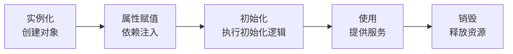
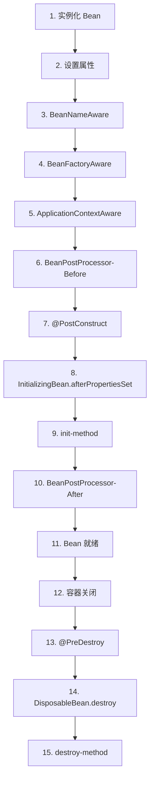
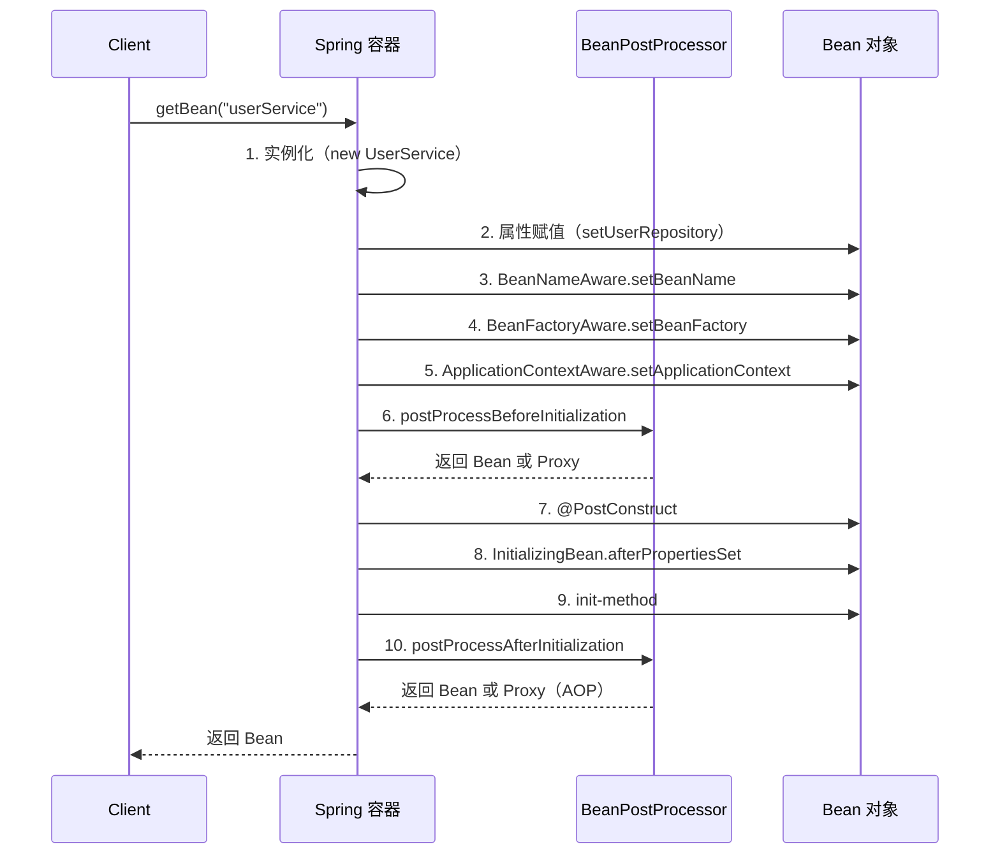
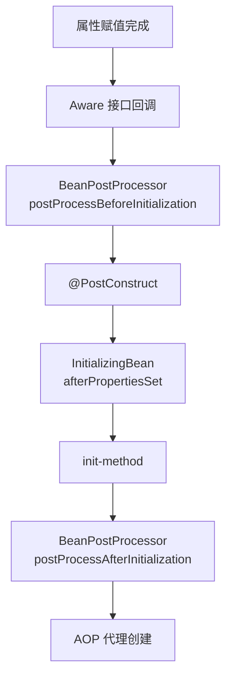
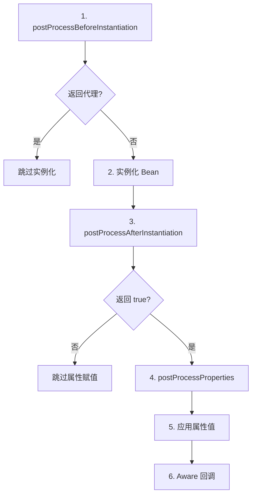

# Spring 阶段三：Bean 生命周期

## 📋 目录

1. [Bean 生命周期概览](#一、bean-生命周期概览)
2. [Bean 创建完整流程](#二、bean-创建完整流程)
3. [BeanPostProcessor 详解](#三、BeanPostProcessor-详解)
4. [InstantiationAwareBeanPostProcessor 详解](#四、InstantiationAwareBeanPostProcessor-详解)
5. [初始化回调顺序](#五、初始化回调顺序)
6. [销毁流程](#六、销毁流程)
7. [自检](#七、自检)

---

## 一、Bean 生命周期概览

### 1.1 什么是 Bean 生命周期？

> **Bean 生命周期**是指 Spring 容器中 Bean 从**创建**到**销毁**的完整过程，包括**实例化**、**属性赋值**、**初始化**、**使用**、**销毁**五个阶段。

### 1.2 生命周期五个阶段



| 阶段         | 说明           | 关键操作                                      |
| ------------ | -------------- | --------------------------------------------- |
| **实例化**   | 创建 Bean 对象 | 调用构造器                                    |
| **属性赋值** | 注入依赖       | setter 注入、@Autowired 注入                  |
| **初始化**   | 执行初始化逻辑 | @PostConstruct、InitializingBean、init-method |
| **使用**     | 提供服务       | 业务方法调用                                  |
| **销毁**     | 释放资源       | @PreDestroy、DisposableBean、destroy-method   |

### 1.3 完整生命周期（10+ 步）



---

## 二、Bean 创建完整流程

### 2.1 核心源码路径

```java
// org.springframework.beans.factory.support.AbstractAutowireCapableBeanFactory

protected Object createBean(String beanName, RootBeanDefinition mbd, Object[] args) {
    // 1. 实例化 Bean
    Object bean = doCreateBean(beanName, mbd, args);
    return bean;
}

protected Object doCreateBean(String beanName, RootBeanDefinition mbd, Object[] args) {
    // 1. 实例化 Bean（创建对象）
    Object bean = instanceWrapper.getWrappedInstance();

    // 2. 属性赋值（依赖注入）
    populateBean(beanName, mbd, instanceWrapper);

    // 3. 初始化 Bean
    Object exposedObject = initializeBean(beanName, bean, mbd);

    return exposedObject;
}
```

### 2.2 详细步骤分解

#### 步骤 1：实例化 Bean（createBeanInstance）

```java
protected BeanWrapper createBeanInstance(String beanName, RootBeanDefinition mbd, Object[] args) {
    // 1.1 获取构造器
    Constructor<?> ctorToUse = mbd.getResolvedConstructorFactoryMethod();

    // 1.2 使用反射创建对象
    return bwCreator.newInstance(ctorToUse, args);
}
```

**关键点**：

- 使用**反射机制**调用构造器
- 支持**构造器注入**
- 处理**循环依赖**（提前暴露引用）

---

#### 步骤 2：属性赋值（populateBean）

```java
protected void populateBean(String beanName, RootBeanDefinition mbd, BeanWrapper bw) {
    // 2.1 执行 InstantiationAwareBeanPostProcessor#postProcessAfterInstantiation
    if (!ibp.postProcessAfterInstantiation(bw.getWrappedInstance(), beanName)) {
        return;  // 返回 false 则跳过属性赋值
    }

    // 2.2 执行 InstantiationAwareBeanPostProcessor#postProcessProperties
    PropertyValues pvs = ibp.postProcessProperties(pvs, bw.getWrappedInstance(), beanName);

    // 2.3 应用属性值
    applyPropertyValues(beanName, mbd, bw, pvs);
}
```

**关键点**：

- **@Autowired 注入**：`AutowiredAnnotationBeanPostProcessor#postProcessProperties`
- **@Resource 注入**：`CommonAnnotationBeanPostProcessor#postProcessProperties`
- **XML 配置注入**：`applyPropertyValues`

---

#### 步骤 3：初始化 Bean（initializeBean）

```java
protected Object initializeBean(String beanName, Object bean, RootBeanDefinition mbd) {
    // 3.1 执行 Aware 接口
    invokeAwareMethods(beanName, bean);

    // 3.2 执行 BeanPostProcessor#postProcessBeforeInitialization
    Object wrappedBean = applyBeanPostProcessorsBeforeInitialization(bean, beanName);

    // 3.3 执行初始化回调
    invokeInitMethods(beanName, wrappedBean, mbd);

    // 3.4 执行 BeanPostProcessor#postProcessAfterInitialization
    wrappedBean = applyBeanPostProcessorsAfterInitialization(wrappedBean, beanName);

    return wrappedBean;
}
```

---

### 2.3 完整时序图



---

## 三、BeanPostProcessor 详解

### 3.1 BeanPostProcessor 接口定义

```java
public interface BeanPostProcessor {
    /**
     * 初始化前回调
     * 在 @PostConstruct、InitializingBean、init-method 之前执行
     */
    @Nullable
    default Object postProcessBeforeInitialization(Object bean, String beanName) throws BeansException {
        return bean;  // 返回原 Bean 或代理对象
    }

    /**
     * 初始化后回调
     * 在 @PostConstruct、InitializingBean、init-method 之后执行
     * AOP 代理在此创建
     */
    @Nullable
    default Object postProcessAfterInitialization(Object bean, String beanName) throws BeansException {
        return bean;  // 返回原 Bean 或代理对象（AOP）
    }
}
```

### 3.2 执行时机



### 3.3 典型应用场景

| BeanPostProcessor                      | 应用场景                               | 执行时机                                               |
| -------------------------------------- | -------------------------------------- | ------------------------------------------------------ |
| `AutowiredAnnotationBeanPostProcessor` | @Autowired 注入                        | postProcessProperties                                  |
| `CommonAnnotationBeanPostProcessor`    | @Resource、@PostConstruct、@PreDestroy | postProcessProperties、postProcessBeforeInitialization |
| `ApplicationContextAwareProcessor`     | Aware 接口回调                         | postProcessBeforeInitialization                        |
| `AbstractAutoProxyCreator`             | AOP 代理创建                           | postProcessAfterInitialization                         |

### 3.4 自定义 BeanPostProcessor

```java
@Component
public class CustomBeanPostProcessor implements BeanPostProcessor {

    @Override
    public Object postProcessBeforeInitialization(Object bean, String beanName) {
        if ("userService".equals(beanName)) {
            System.out.println("初始化前回调：" + beanName);
        }
        return bean;
    }

    @Override
    public Object postProcessAfterInitialization(Object bean, String beanName) {
        if ("userService".equals(beanName)) {
            System.out.println("初始化后回调：" + beanName);
        }
        return bean;
    }
}
```

**执行顺序**：

1. 容器启动时，注册所有 `BeanPostProcessor`
2. 创建每个 Bean 时，按顺序执行所有 `BeanPostProcessor`
3. 执行顺序：`Ordered` 接口 → `@Order` 注解 → 注册顺序

---

## 四、InstantiationAwareBeanPostProcessor 详解

### 4.1 接口定义

```java
public interface InstantiationAwareBeanPostProcessor extends BeanPostProcessor {
    /**
     * 实例化前回调
     * 可以返回代理对象，跳过默认实例化逻辑
     */
    @Nullable
    default Object postProcessBeforeInstantiation(Class<?> beanClass, String beanName) {
        return null;  // 返回 null 则继续默认实例化
    }

    /**
     * 实例化后回调
     * 可以在属性赋值前修改 Bean 状态
     */
    default boolean postProcessAfterInstantiation(Object bean, String beanName) {
        return true;  // 返回 false 则跳过属性赋值
    }

    /**
     * 属性赋值回调
     * 可以修改属性值
     */
    @Nullable
    default PropertyValues postProcessProperties(PropertyValues pvs, Object bean, String beanName) {
        return pvs;  // 返回修改后的属性值
    }
}
```

### 4.2 执行时机



### 4.3 典型应用场景

| InstantiationAwareBeanPostProcessor    | 应用场景        |
| -------------------------------------- | --------------- |
| `AutowiredAnnotationBeanPostProcessor` | @Autowired 注入 |
| `CommonAnnotationBeanPostProcessor`    | @Resource 注入  |
| `RequiredAnnotationBeanPostProcessor`  | @Required 检查  |

---

## 五、初始化回调顺序

### 5.1 三种初始化回调方式

```java
@Component
public class UserService {

    // 方式1：@PostConstruct 注解
    @PostConstruct
    public void init1() {
        System.out.println("方式1：@PostConstruct");
    }
}

// 方式2：InitializingBean 接口
@Component
public class UserService implements InitializingBean {
    @Override
    public void afterPropertiesSet() throws Exception {
        System.out.println("方式2：InitializingBean");
    }
}

// 方式3：init-method
@Configuration
public class AppConfig {
    @Bean(initMethod = "init3")
    public UserService userService() {
        return new UserService();
    }
}

public class UserService {
    public void init3() {
        System.out.println("方式3：init-method");
    }
}
```

### 5.2 执行顺序


**执行顺序**：

1. **@PostConstruct**（JSR-250 规范）
2. **InitializingBean#afterPropertiesSet**（Spring 接口）
3. **init-method**（XML/注解配置）

**推荐使用**：`@PostConstruct`（标准化、不耦合 Spring）

---

## 六、销毁流程

### 6.1 三种销毁回调方式

```java
// 方式1：@PreDestroy 注解
@Component
public class UserService {
    @PreDestroy
    public void destroy1() {
        System.out.println("方式1：@PreDestroy");
    }
}

// 方式2：DisposableBean 接口
@Component
public class UserService implements DisposableBean {
    @Override
    public void destroy() throws Exception {
        System.out.println("方式2：DisposableBean");
    }
}

// 方式3：destroy-method
@Configuration
public class AppConfig {
    @Bean(destroyMethod = "destroy3")
    public UserService userService() {
        return new UserService();
    }
}

public class UserService {
    public void destroy3() {
        System.out.println("方式3：destroy-method");
    }
}
```

### 6.2 执行顺序


**执行顺序**：

1. **@PreDestroy**（JSR-250 规范）
2. **DisposableBean#destroy**（Spring 接口）
3. **destroy-method**（XML/注解配置）

### 6.3 触发销毁的时机

```java
// 方式1：关闭容器
ConfigurableApplicationContext context =
    new AnnotationConfigApplicationContext(AppConfig.class);
context.close();  // 触发销毁

// 方式2：注册关闭钩子
ConfigurableApplicationContext context =
    new AnnotationConfigApplicationContext(AppConfig.class);
context.registerShutdownHook();  // JVM 关闭时触发销毁

// 方式3：使用 try-with-resources（Spring 5+）
try (ConfigurableApplicationContext context =
        new AnnotationConfigApplicationContext(AppConfig.class)) {
    // 使用容器
}  // 自动关闭，触发销毁
```

---

## 七、自检

### Q1: Bean 的生命周期是什么？⭐⭐⭐⭐⭐

> **答**：
> Bean 生命周期分为 5 个阶段：
>
> 1. **实例化**：创建对象（调用构造器）
> 2. **属性赋值**：依赖注入（@Autowired、setter）
> 3. **初始化**：执行初始化逻辑（@PostConstruct、InitializingBean、init-method）
> 4. **使用**：提供服务（业务方法调用）
> 5. **销毁**：释放资源（@PreDestroy、DisposableBean、destroy-method）

---

### Q2: BeanPostProcessor 的执行时机？⭐⭐⭐⭐⭐

> **答**：
> `BeanPostProcessor` 有两个回调方法：
>
> - `postProcessBeforeInitialization`：在 @PostConstruct、InitializingBean、init-method **之前**执行
> - `postProcessAfterInitialization`：在 @PostConstruct、InitializingBean、init-method **之后**执行
>
> **关键应用**：AOP 代理在 `postProcessAfterInitialization` 中创建。

---

### Q3: @PostConstruct、InitializingBean、init-method 的执行顺序？⭐⭐⭐⭐⭐

> **答**：
> 执行顺序：
>
> 1. **@PostConstruct**（JSR-250 规范）
> 2. **InitializingBean#afterPropertiesSet**（Spring 接口）
> 3. **init-method**（XML/注解配置）
>
> **推荐使用**：`@PostConstruct`（标准化、不耦合 Spring）

---

### Q4: AOP 代理在 Bean 生命周期的哪个阶段创建？⭐⭐⭐⭐⭐

> **答**：
> AOP 代理在 `BeanPostProcessor#postProcessAfterInitialization` 阶段创建。
>
> **执行流程**：
>
> 1. 容器启动时，扫描 @Aspect 注解，创建 Advisor
> 2. 创建 Bean 对象
> 3. 执行 `postProcessAfterInitialization` 时，`AbstractAutoProxyCreator` 判断是否需要代理
> 4. 如果需要，创建代理对象（JDK 或 CGLIB）
> 5. 返回代理对象注册到容器

---

### Q5: BeanFactory 和 ApplicationContext 在 Bean 生命周期上的区别？⭐⭐⭐⭐

> **答**：
>
> | 特性                  | BeanFactory | ApplicationContext |
> | --------------------- | ----------- | ------------------ |
> | **Aware 回调**        | 部分支持    | 全部支持           |
> | **BeanPostProcessor** | 手动注册    | 自动注册           |
> | **事件发布**          | 不支持      | 支持               |
> | **国际化**            | 不支持      | 支持               |
> | **资源加载**          | 不支持      | 支持               |
>
> **核心区别**：`ApplicationContext` 在容器启动时自动注册所有 `BeanPostProcessor`，而 `BeanFactory` 需要手动添加。

---

### Q6: 如何在 Bean 创建过程中插入自定义逻辑？⭐⭐⭐⭐

> **答**：
>
> **方式1：实现 BeanPostProcessor**
>
> ```java
> @Component
> public class CustomBeanPostProcessor implements BeanPostProcessor {
>     @Override
>     public Object postProcessBeforeInitialization(Object bean, String beanName) {
>         // 初始化前逻辑
>         return bean;
>     }
>
>     @Override
>     public Object postProcessAfterInitialization(Object bean, String beanName) {
>         // 初始化后逻辑（可以创建代理）
>         return bean;
>     }
> }
> ```
>
> **方式2：实现 InstantiationAwareBeanPostProcessor**
>
> ```java
> @Component
> public class CustomInstantiationAwareBeanPostProcessor
>         implements InstantiationAwareBeanPostProcessor {
>     @Override
>     public Object postProcessBeforeInstantiation(Class<?> beanClass, String beanName) {
>         // 实例化前逻辑（可以返回代理对象）
>         return null;
>     }
>
>     @Override
>     public boolean postProcessAfterInstantiation(Object bean, String beanName) {
>         // 实例化后逻辑（返回 false 则跳过属性赋值）
>         return true;
>     }
>
>     @Override
>     public PropertyValues postProcessProperties(PropertyValues pvs, Object bean, String beanName) {
>         // 属性赋值逻辑（可以修改属性值）
>         return pvs;
>     }
> }
> ```

---

### Q7: 循环依赖在 Bean 生命周期中如何解决？⭐⭐⭐⭐⭐

> **答**：
> Spring 通过**三级缓存**解决 Setter 注入的循环依赖：
>
> 1. **singletonObjects**（一级缓存）：存放完全初始化的 Bean
> 2. **earlySingletonObjects**（二级缓存）：存放提前暴露的 Bean（未完全初始化）
> 3. **singletonFactories**（三级缓存）：存放 Bean 工厂（可能创建代理对象）
>
> **解决流程**：
>
> 1. 创建 A 对象，实例化后放入三级缓存
> 2. A 注入 B，开始创建 B
> 3. B 注入 A，从三级缓存获取 A，移入二级缓存
> 4. B 初始化完成，放入一级缓存
> 5. A 继续初始化，从二级缓存获取 B，完成初始化
> 6. A 放入一级缓存，清理二级缓存
>
> **构造器注入无法解决**：因为实例化时就需要依赖对象，无法提前暴露。

---

## 📚 核心源码路径

```java
// Bean 创建核心类
org.springframework.beans.factory.support.AbstractAutowireCapableBeanFactory
    - #createBean()               // 创建 Bean
    - #doCreateBean()            // 执行创建
    - #createBeanInstance()      // 实例化
    - #populateBean()            // 属性赋值
    - #initializeBean()          // 初始化

// BeanPostProcessor 接口
org.springframework.beans.factory.config.BeanPostProcessor
org.springframework.beans.factory.config.InstantiationAwareBeanPostProcessor

// 典型实现
org.springframework.beans.factory.annotation.AutowiredAnnotationBeanPostProcessor
org.springframework.context.annotation.CommonAnnotationBeanPostProcessor
org.springframework.aop.framework.autoproxy.AbstractAutoProxyCreator

// Aware 回调接口
org.springframework.beans.factory.BeanNameAware
org.springframework.beans.factory.BeanFactoryAware
org.springframework.context.ApplicationContextAware

// 初始化回调接口
javax.annotation.PostConstruct                    // @PostConstruct
org.springframework.beans.factory.InitializingBean  // InitializingBean
org.springframework.beans.factory.DisposableBean   // DisposableBean
javax.annotation.PreDestroy                       // @PreDestroy
```
