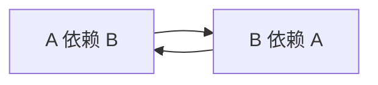
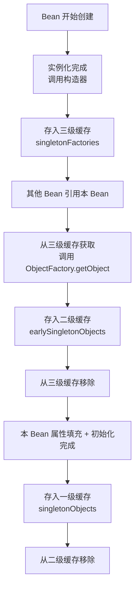
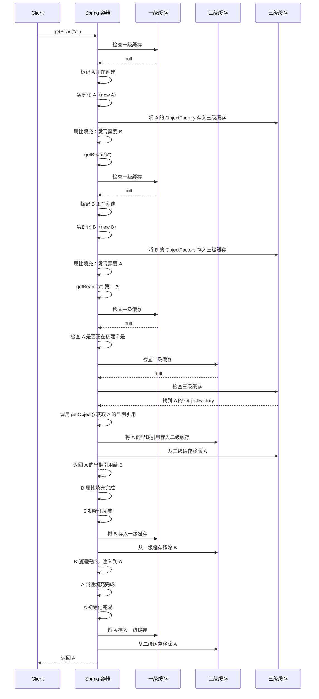
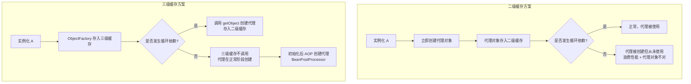
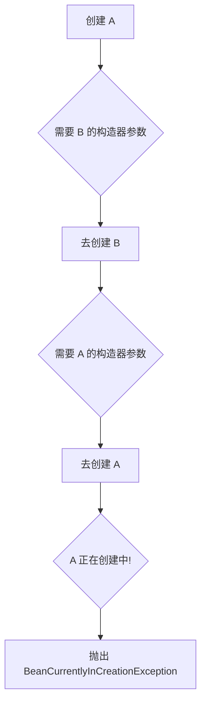
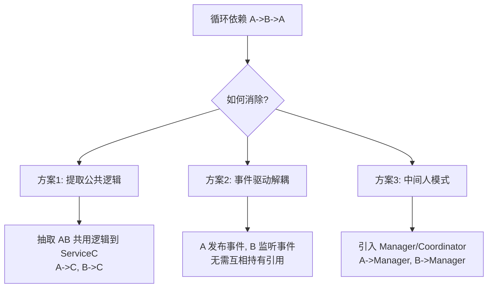

# Spring 阶段四：循环依赖

## 目录

1. [循环依赖概览](#一、循环依赖概览)
2. [三级缓存原理](#二、三级缓存原理)
3. [Setter 注入解决全流程](#三、setter-注入解决全流程)
4. [为什么是三级而非二级](#四、为什么是三级而非二级)
5. [构造器注入为何无法解决](#五、构造器注入为何无法解决)
6. [特殊场景分析](#六、特殊场景分析)
7. [面试题汇总](#七、面试题汇总)

---

## 一、循环依赖概览

### 1.1 什么是循环依赖？

> **循环依赖**是指两个或多个 Bean 之间互相持有对方引用，形成闭环。例如 A 依赖 B，B 又依赖 A。



### 1.2 循环依赖的三种类型

```java
// 类型1：构造器注入的循环依赖（无法解决）
@Component
public class ServiceA {
    private final ServiceB serviceB;
    @Autowired
    public ServiceA(ServiceB serviceB) {
        this.serviceB = serviceB;
    }
}

// 类型2：Setter/字段注入的循环依赖（可以解决）
@Component
public class ServiceA {
    @Autowired
    private ServiceB serviceB;
}

// 类型3：多 Bean 间接循环 A -> B -> C -> A
```

### 1.3 Spring 能解决哪些循环依赖？

| 注入方式 | 单例 Bean | 原型 Bean |
|---------|----------|----------|
| **Setter / 字段注入** | ✅ 可以解决 | ❌ 无法解决 |
| **构造器注入** | ❌ 无法解决 | ❌ 无法解决 |

> **核心结论**：Spring 只能解决**单例 + Setter/字段注入**的循环依赖，其他情况都会报 `BeanCurrentlyInCreationException`。

---

## 二、三级缓存原理

### 2.1 三级缓存是什么？

三级缓存定义在 `DefaultSingletonBeanRegistry` 中，本质是三个 Map：

```java
// org.springframework.beans.factory.support.DefaultSingletonBeanRegistry

/** 一级缓存：完整的单例 Bean，key=beanName, value=完全初始化后的 Bean */
private final Map<String, Object> singletonObjects = new ConcurrentHashMap<>(256);

/** 二级缓存：早期暴露的 Bean（已实例化但未完全初始化） */
private final Map<String, Object> earlySingletonObjects = new ConcurrentHashMap<>(16);

/** 三级缓存：Bean 工厂，用于生成早期引用（可能包含 AOP 代理） */
private final Map<String, ObjectFactory<?>> singletonFactories = new HashMap<>(16);
```

### 2.2 三个缓存各自的作用

| 缓存 | 名称 | 存放内容 | 作用 |
|------|------|---------|------|
| **一级缓存** | singletonObjects | 完整的 Bean（实例化 + 属性注入 + 初始化完成） | 日常 getBean 获取的就是它 |
| **二级缓存** | earlySingletonObjects | 早期的 Bean（已实例化，属性可能未填充完） | 保存从三级缓存创建的早期引用，避免重复创建代理 |
| **三级缓存** | singletonFactories | ObjectFactory（Bean 工厂 lambda） | **延迟生成**早期引用，需要时才调用 getObject()，保证 AOP 代理只创建一次 |

### 2.3 三个缓存的生命周期



> **核心要点**：三级缓存的 ObjectFactory 是在**实例化之后、属性填充之前**存入的。这意味着此时的 Bean 只是一个"空壳"（调用了构造器，但依赖还没注入），但它的引用已经可以被其他 Bean 拿到了。

---

## 三、Setter 注入解决全流程

### 3.1 经典场景：A → B → A

```java
@Component
public class A {
    @Autowired
    private B b;
}

@Component
public class B {
    @Autowired
    private A a;
}
```

### 3.2 完整流程图



### 3.3 关键源码：getSingleton() — 三级缓存查找

```java
// org.springframework.beans.factory.support.DefaultSingletonBeanRegistry

protected Object getSingleton(String beanName, boolean allowEarlyReference) {
    // 1. 从一级缓存获取完整 Bean
    Object singletonObject = this.singletonObjects.get(beanName);

    // 2. 一级缓存没有 且 当前 Bean 正在创建中
    if (singletonObject == null && isSingletonCurrentlyInCreation(beanName)) {
        // 3. 从二级缓存获取早期 Bean
        singletonObject = this.earlySingletonObjects.get(beanName);

        // 4. 二级缓存也没有 且 允许早期引用
        if (singletonObject == null && allowEarlyReference) {
            synchronized (this.singletonObjects) {
                // 5. 双重检查锁
                singletonObject = this.singletonObjects.get(beanName);
                if (singletonObject == null) {
                    singletonObject = this.earlySingletonObjects.get(beanName);
                    if (singletonObject == null) {
                        // 6. 从三级缓存获取工厂
                        ObjectFactory<?> singletonFactory = this.singletonFactories.get(beanName);
                        if (singletonFactory != null) {
                            // 7. 调用工厂创建早期引用（核心！）
                            singletonObject = singletonFactory.getObject();
                            // 8. 升级到二级缓存
                            this.earlySingletonObjects.put(beanName, singletonObject);
                            // 9. 从三级缓存移除
                            this.singletonFactories.remove(beanName);
                        }
                    }
                }
            }
        }
    }
    return singletonObject;
}
```

> **注意**：三级缓存中的 `ObjectFactory.getObject()` 调用的是 `getEarlyBeanReference()`，如果该 Bean 需要 AOP 代理，这里就会提前创建代理对象。

### 3.4 关键源码：doCreateBean() — 暴露到三级缓存

```java
// org.springframework.beans.factory.support.AbstractAutowireCapableBeanFactory

protected Object doCreateBean(String beanName, RootBeanDefinition mbd, Object[] args) {
    // 1. 实例化 Bean（调用构造器）
    BeanWrapper instanceWrapper = createBeanInstance(beanName, mbd, args);
    Object bean = instanceWrapper.getWrappedInstance();

    // 2. 提前暴露 Bean 的早期引用 — 解决循环依赖的关键
    boolean earlySingletonExposure = (mbd.isSingleton() && this.allowCircularReferences
            && isSingletonCurrentlyInCreation(beanName));
    if (earlySingletonExposure) {
        addSingletonFactory(beanName, () -> getEarlyBeanReference(beanName, mbd, bean));
    }

    // 3. 属性填充（依赖注入在这里发生）
    Object exposedObject = bean;
    populateBean(beanName, mbd, instanceWrapper);

    // 4. 初始化 Bean
    exposedObject = initializeBean(beanName, exposedObject, mbd);

    return exposedObject;
}
```

### 3.5 关键源码：addSingletonFactory()

```java
// org.springframework.beans.factory.support.DefaultSingletonBeanRegistry

protected void addSingletonFactory(String beanName, ObjectFactory<?> singletonFactory) {
    synchronized (this.singletonObjects) {
        if (!this.singletonObjects.containsKey(beanName)) {
            // 存入三级缓存
            this.singletonFactories.put(beanName, singletonFactory);
            // 从二级缓存移除（保证只在一个缓存中）
            this.earlySingletonObjects.remove(beanName);
            this.registeredSingletons.add(beanName);
        }
    }
}
```

### 3.6 完整流程简述（面试背诵版）

> **面试话术**：
> 1. Spring 创建 A，先实例化 A（调用构造器），将 A 的 ObjectFactory 存入**三级缓存**
> 2. A 属性填充时发现需要 B，去创建 B
> 3. B 实例化后存入三级缓存，属性填充时发现需要 A
> 4. B 调用 getBean("a")，先查一级缓存没有，再查二级缓存没有
> 5. 从**三级缓存**中找到 A 的 ObjectFactory，调用 getObject() 获取 A 的早期引用
> 6. 将 A 的早期引用从三级缓存升级到**二级缓存**，移除三级缓存中的 A
> 7. B 拿到 A 的早期引用，完成属性填充和初始化，存入一级缓存
> 8. 回到 A，拿到完整的 B，完成属性填充和初始化，存入一级缓存

---

## 四、为什么是三级而非二级

### 4.1 核心原因：支持 AOP 代理延迟创建

> **如果只有二级缓存**：在实例化后直接创建代理对象存入二级缓存。但问题是：**如果没有循环依赖，AOP 代理应该在初始化后创建（BeanPostProcessor#postProcessAfterInitialization），而不是提前创建。**
>
> **三级缓存的作用**：ObjectFactory 是一个工厂（lambda），只有在真正发生循环依赖时才调用 getObject()。如果不存在循环依赖，这个工厂永远不会被调用，代理对象会在正常的初始化后阶段创建。

### 4.2 对比分析



### 4.3 关键源码：getEarlyBeanReference()

```java
// org.springframework.beans.factory.support.AbstractAutowireCapableBeanFactory

protected Object getEarlyBeanReference(String beanName, RootBeanDefinition mbd, Object bean) {
    Object exposedObject = bean;
    if (!mbd.isSynthetic() && hasInstantiationAwareBeanPostProcessors()) {
        for (SmartInstantiationAwareBeanPostProcessor bp : getBeanPostProcessorCache().smartInstantiationAware) {
            // 如果需要 AOP 代理，这里会提前创建代理对象
            exposedObject = bp.getEarlyBeanReference(exposedObject, beanName);
        }
    }
    return exposedObject;
}
```

> **面试话术**：三级缓存的 ObjectFactory 中调用的 `getEarlyBeanReference()` 会遍历所有 `SmartInstantiationAwareBeanPostProcessor`，如果该 Bean 需要 AOP 代理（被 @Transactional 或 @Aspect 标注），就会在这里提前创建代理对象。如果不需要代理，直接返回原始 Bean。这就是"延迟创建代理"的含义。

### 4.4 总结

| 问题 | 二级缓存 | 三级缓存 |
|------|---------|---------|
| 能否解决无 AOP 的循环依赖 | ✅ | ✅ |
| 能否解决有 AOP 的循环依赖 | ❌ 代理创建时机不对 | ✅ 按需延迟创建 |
| 无循环依赖时是否多余创建代理 | ❌ 会提前创建 | ✅ 不会 |
| 设计理念 | 简单直接 | **延迟加载**，按需创建 |

> **面试终极回答**：Spring 使用三级缓存而非二级缓存，**核心是为了处理 AOP 场景下的循环依赖**。三级缓存的 ObjectFactory 实现了"代理对象的延迟创建"——只有在发生循环依赖时才提前生成代理，没有循环依赖时代理在正常的初始化后阶段创建，保证了代理创建的时机正确。

---

## 五、构造器注入为何无法解决

### 5.1 核心原因：鸡生蛋问题

> 构造器注入要求在**实例化阶段**就拿到依赖，而 Spring 解决循环依赖的前提是**先实例化，再填充属性**。构造器注入把这个前提打破了——A 的实例化依赖 B，B 的实例化依赖 A，双方都无法先实例化。



### 5.2 源码层面的原因

```java
// org.springframework.beans.factory.support.AbstractAutowireCapableBeanFactory

protected BeanWrapper createBeanInstance(String beanName, RootBeanDefinition mbd, Object[] args) {
    // 构造器注入在这里解析依赖
    // 如果依赖的 Bean 尚未实例化，会调用 getBean()
    // 但 getBean 又会回到 createBeanInstance → 死循环
    Constructor<?>[] ctors = determineConstructorsFromBeanPostProcessors(bd, beanName);
    // ... 解析构造器参数
    // 此时 A 和 B 都还没实例化完成，无法互相提供
}
```

> **关键点**：三级缓存的暴露（`addSingletonFactory`）发生在 `createBeanInstance` **之后**，但构造器注入的依赖解析发生在 `createBeanInstance` **之中**。也就是说，三级缓存还没来得及存，构造器就已经需要依赖了。

### 5.3 构造器循环依赖的报错信息

```
org.springframework.beans.factory.UnsatisfiedDependencyException:
Error creating bean with name 'serviceA' defined in file [...]:
Unsatisfied dependency expressed through constructor parameter 0;
nested exception is org.springframework.beans.factory.BeanCurrentlyInCreationException:
Error creating bean with name 'serviceB':
Requested bean is currently in creation: Is there an unresolvable circular reference?
```

---

## 六、特殊场景分析

### 6.1 @Lazy 解决构造器循环依赖

```java
@Component
public class ServiceA {
    private final ServiceB serviceB;

    @Autowired
    public ServiceA(@Lazy ServiceB serviceB) {
        this.serviceB = serviceB;
    }
}

@Component
public class ServiceB {
    private final ServiceA serviceA;

    @Autowired
    public ServiceB(@Lazy ServiceA serviceA) {
        this.serviceA = serviceA;
    }
}
```

> **原理**：`@Lazy` 会让 Spring 注入一个**代理对象**而非真实 Bean。构造器阶段拿到的是代理对象的"空壳"，不会触发真实 Bean 的创建。后续第一次调用代理对象的方法时，代理对象才会去容器中获取真实 Bean（此时真实 Bean 已经创建完成）。

### 6.2 @Async 导致循环依赖失败

```java
@Component
public class ServiceA {
    @Autowired
    private ServiceB serviceB;
}

@Component
public class ServiceB {
    @Lazy
    @Autowired
    private ServiceA serviceA;

    @Async
    public void asyncMethod() { }
}
```

> **原因**：`@Async` 会给 ServiceB 创建 AOP 代理。在 ServiceB 的 `postProcessAfterInitialization` 阶段，代理对象被创建。但这个代理对象和之前三级缓存中通过 `getEarlyBeanReference` 创建的早期引用**不是同一个对象**，导致 Spring 发现最终对象和早期引用不一致，抛出异常。

> **解决方案**：
> 1. 在注入处加 `@Lazy`
> 2. 使用 `@EnableAsync` 时设置 `proxyTargetClass = true`
> 3. Spring Boot 2.6+ 默认禁止循环依赖，需通过 `spring.main.allow-circular-references=true` 开启

### 6.3 原型 Bean 的循环依赖

```java
@Component
@Scope("prototype")
public class ServiceA {
    @Autowired
    private ServiceB serviceB;
}

@Component
@Scope("prototype")
public class ServiceB {
    @Autowired
    private ServiceA serviceA;
}
```

> **结论**：Spring **不尝试**解决原型 Bean 的循环依赖，直接抛出异常。因为原型 Bean 每次获取都是新对象，无法通过缓存机制管理。

### 6.4 Spring Boot 2.6+ 默认禁止循环依赖

Spring Boot 2.6 起默认禁止循环依赖：

```yaml
# application.yml
spring:
  main:
    allow-circular-references: false  # 默认值
```

> **为什么**：循环依赖本质上是**设计问题**，Spring 团队认为开发者应该通过重构代码来消除循环依赖，而不是依赖框架的"补丁"机制。禁止循环依赖能在开发阶段更早发现问题。
>
> **如何开启**：设置 `spring.main.allow-circular-references=true`。

### 6.5 三种消除循环依赖的设计方案



| 方案 | 适用场景 | 示例 |
|------|---------|------|
| **提取公共逻辑** | A 和 B 需要相同功能 | 抽取 ServiceC，A/B 都依赖 C |
| **事件驱动** | A 完成后通知 B | A 发布 `ApplicationEvent`，B 用 `@EventListener` 监听 |
| **中间人模式** | A 和 B 需要协调 | 引入 `OrderService` 协调 `PaymentService` 和 `InventoryService` |

---

## 七、面试题汇总

### Q1: 什么是循环依赖？Spring 能解决哪些？

> **答**：循环依赖是两个或多个 Bean 互相持有对方引用。Spring 只能解决**单例 + Setter/字段注入**的循环依赖，构造器注入和原型 Bean 的循环依赖无法解决。

### Q2: 三级缓存分别是什么？

> **答**：
> - 一级缓存 `singletonObjects`：存放完整的 Bean
> - 二级缓存 `earlySingletonObjects`：存放早期暴露的 Bean（已实例化但未完全初始化）
> - 三级缓存 `singletonFactories`：存放 ObjectFactory，用于延迟创建早期引用（处理 AOP）

### Q3: 为什么需要三级缓存？二级不行吗？

> **答**：二级缓存在无循环依赖时会提前创建 AOP 代理，导致代理创建时机错误。三级缓存的 ObjectFactory 实现了"按需延迟创建"——只有发生循环依赖时才调用 getObject() 创建代理，没有循环依赖时代理在正常的 BeanPostProcessor 阶段创建。

### Q4: 构造器注入的循环依赖为什么无法解决？

> **答**：构造器注入的依赖解析发生在实例化阶段，而三级缓存的暴露在实例化之后。也就是说，还没来得及把 Bean 存入三级缓存，构造器就已经需要依赖了，形成死循环。

### Q5: @Lazy 如何解决构造器循环依赖？

> **答**：`@Lazy` 注入的是代理对象而非真实 Bean。构造器拿到代理的空壳，不会触发真实 Bean 的创建。后续调用方法时代理才去容器获取真实 Bean。

---

**核心源码路径速查**：

| 类 | 方法 | 作用 |
|----|------|------|
| `DefaultSingletonBeanRegistry` | `getSingleton(String, boolean)` | 三级缓存查找逻辑 |
| `DefaultSingletonBeanRegistry` | `addSingletonFactory()` | 存入三级缓存 |
| `DefaultSingletonBeanRegistry` | `addSingleton()` | 存入一级缓存 |
| `AbstractAutowireCapableBeanFactory` | `doCreateBean()` | 暴露三级缓存的入口 |
| `AbstractAutowireCapableBeanFactory` | `getEarlyBeanReference()` | 三级缓存的 ObjectFactory 执行逻辑 |

