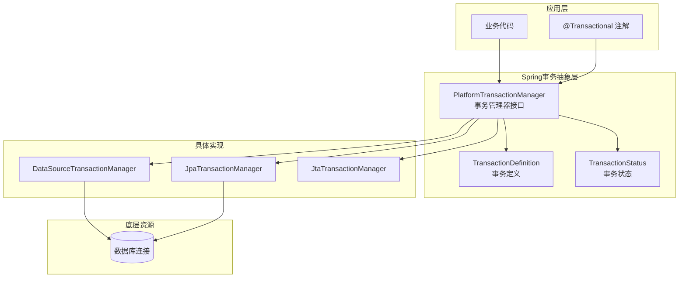
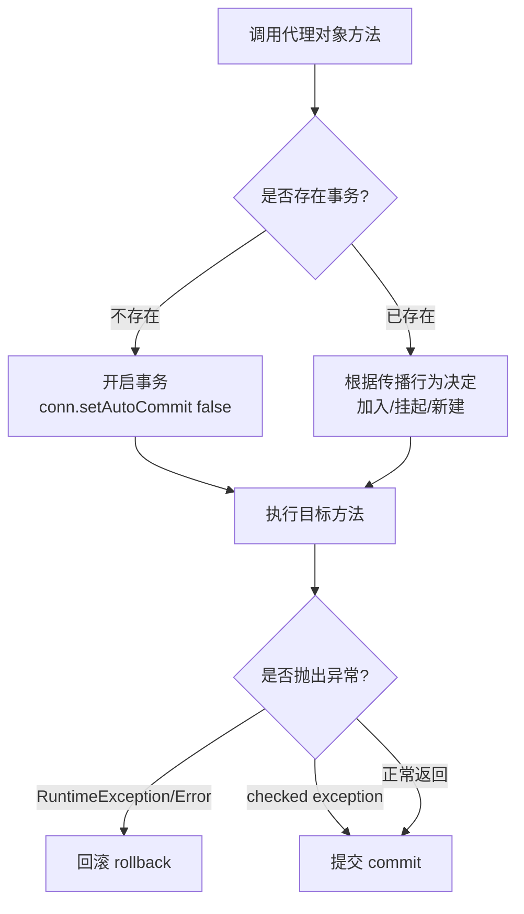
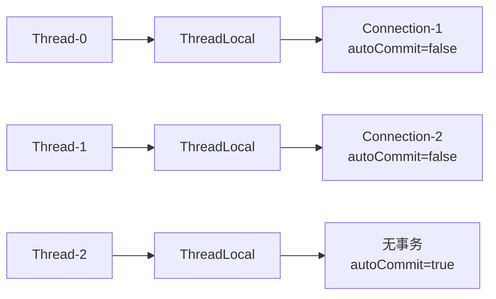
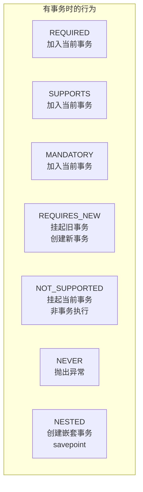
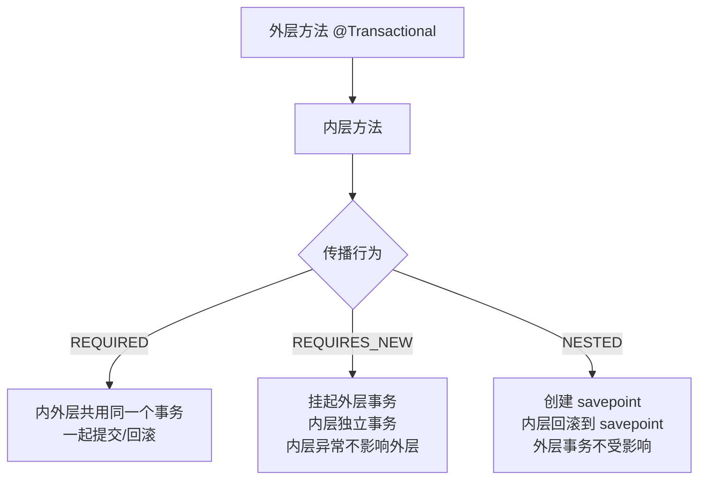
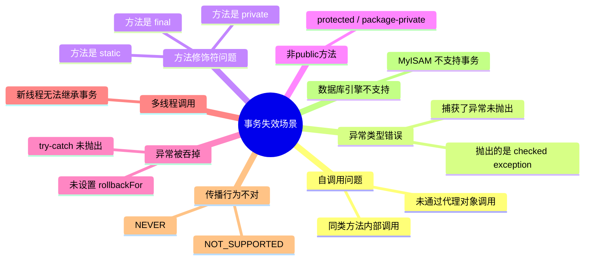

# Spring 阶段五：事务管理

## 目录

1. [Spring 事务概览](#一、spring-事务概览)
2. [@Transactional 原理](#二、transactional-原理)
3. [事务传播机制](#三、事务传播机制)
4. [事务隔离级别](#四、事务隔离级别)
5. [事务失效场景（重点）](#五、事务失效场景)
6. [编程式事务](#六、编程式事务)
7. [自检](#七、自检)

---

## 一、Spring 事务概览

### 1.1 什么是 Spring 事务管理？

> Spring 事务管理是对数据库事务的抽象封装，通过 AOP 实现声明式事务，让开发者无需手动编写 `Connection.setAutoCommit(false)` / `commit()` / `rollback()` 等代码。

Spring 提供两种事务管理方式：

| 方式 | 说明 | 使用场景 |
| --- | --- | --- |
| **声明式事务** | 基于 AOP，通过注解或 XML 配置 | 绝大多数场景 |
| **编程式事务** | 手动控制事务边界 | 需要细粒度控制的场景 |

### 1.2 Spring 事务抽象架构



**核心三接口**：

| 接口 | 作用 |
| --- | --- |
| `PlatformTransactionManager` | 事务管理器，负责获取事务、提交、回滚 |
| `TransactionDefinition` | 定义事务属性（传播、隔离、超时、只读） |
| `TransactionStatus` | 事务运行状态，可查询是否新事务、是否已完成 |

```java
public interface PlatformTransactionManager {
    TransactionStatus getTransaction(TransactionDefinition definition) throws TransactionException;
    void commit(TransactionStatus status) throws TransactionException;
    void rollback(TransactionStatus status) throws TransactionException;
}
```

### 1.3 @Transactional 注解属性

```java
@Transactional(
    propagation = Propagation.REQUIRED,       // 传播行为，默认 REQUIRED
    isolation = Isolation.DEFAULT,            // 隔离级别，默认 DEFAULT（使用数据库默认）
    timeout = -1,                             // 超时时间（秒），默认 -1（无超时）
    readOnly = false,                         // 是否只读，默认 false
    rollbackFor = {},                         // 指定回滚异常（数组）
    noRollbackFor = {},                       // 指定不回滚异常（数组）
    transactionManager = "",                  // 指定事务管理器
    label = {}                                // 事务标签
)
```

> **默认回滚策略**：只有 `RuntimeException` 和 `Error` 触发回滚，**受检异常（checked exception）不回滚**。这是面试高频考点。

---

## 二、@Transactional 原理

### 2.1 整体原理：AOP + ThreadLocal

`@Transactional` 本质是一个 AOP 切面，Spring 在 Bean 创建阶段通过 `AutoProxyCreator` 为标注了 `@Transactional` 的 Bean 创建代理对象。



### 2.2 核心源码：TransactionInterceptor

事务切面的核心是 `TransactionInterceptor`，它实现了 `MethodInterceptor` 接口：

```java
// org.springframework.transaction.interceptor.TransactionInterceptor

public class TransactionInterceptor extends TransactionAspectSupport
        implements MethodInterceptor, Serializable {

    @Override
    @Nullable
    public Object invoke(MethodInvocation invocation) throws Throwable {
        Class<?> targetClass = invocation.getThis() != null
                ? AopUtils.getTargetClass(invocation.getThis()) : null;

        // 调用父类 TransactionAspectSupport 的核心方法
        return invokeWithinTransaction(invocation.getMethod(), targetClass,
                invocation::proceed);
    }
}
```

真正的逻辑在父类 `TransactionAspectSupport.invokeWithinTransaction()` 中：

```java
// org.springframework.transaction.interceptor.TransactionAspectSupport

protected Object invokeWithinTransaction(Method method, @Nullable Class<?> targetClass,
        InvocationCallback invocation) throws Throwable {

    TransactionAttributeSource tas = getTransactionAttributeSource();
    final TransactionAttribute txAttr = tas.getTransactionAttribute(method, targetClass);

    final PlatformTransactionManager tm = determineTransactionManager(txAttr);

    // 1. 解析事务名称
    final String joinpointIdentification = methodIdentification(method, targetClass, txAttr);

    // 2. 声明式事务处理（注解方式）
    if (txAttr == null || !(tm instanceof CallbackPreferringPlatformTransactionManager)) {
        TransactionInfo txInfo = createTransactionIfNecessary(tm, txAttr, joinpointIdentification);

        Object retVal;
        try {
            // 3. 执行目标方法
            retVal = invocation.proceedWithInvocation();
        } catch (Throwable ex) {
            // 4. 异常处理 - 判断是否需要回滚
            completeTransactionAfterThrowing(txInfo, ex);
            throw ex;
        } finally {
            // 5. 清理事务信息
            cleanupTransactionInfo(txInfo);
        }
        // 6. 正常返回 - 提交事务
        commitTransactionAfterReturning(txInfo);
        return retVal;
    }

    // ... 编程式事务处理（CallbackPreferringPlatformTransactionManager）
}
```

### 2.3 事务如何绑定到线程？ThreadLocal

Spring 通过 `ThreadLocal` 将数据库连接绑定到当前线程，保证同一线程内多次数据库操作使用同一个 Connection：

```java
// org.springframework.transaction.support.TransactionSynchronizationManager

public abstract class TransactionSynchronizationManager {

    // 用 ThreadLocal 保存当前线程的事务资源（如 Connection）
    private static final ThreadLocal<Map<Object, Object>> resources =
            new NamedThreadLocal<>("Transactional resources");

    // 用 ThreadLocal 保存当前线程的事务同步回调
    private static final ThreadLocal<Set<TransactionSynchronization>> synchronizations =
            new NamedThreadLocal<>("Transaction synchronizations");

    // 用 ThreadLocal 保存当前事务的名称
    private static final ThreadLocal<String> currentTransactionName =
            new NamedThreadLocal<>("Current transaction name");

    // 用 ThreadLocal 保存当前事务是否只读
    private static final ThreadLocal<Boolean> currentTransactionReadOnly =
            new NamedThreadLocal<>("Current transaction read-only status");

    // 用 ThreadLocal 保存事务隔离级别
    private static final ThreadLocal<Integer> currentTransactionIsolationLevel =
            new NamedThreadLocal<>("Current transaction isolation level");

    // 用 ThreadLocal 保存事务是否活跃
    private static final ThreadLocal<Boolean> actualTransactionActive =
            new NamedThreadLocal<>("Actual transaction active");
}
```



> **关键点**：事务绑定在 `ThreadLocal` 上，意味着事务只能在**同一个线程**内传播。如果方法内部通过 `new Thread()` 或线程池执行数据库操作，新线程不会继承事务。

### 2.4 createTransactionIfNecessary 核心流程

```java
// TransactionAspectSupport#createTransactionIfNecessary

protected TransactionInfo createTransactionIfNecessary(
        PlatformTransactionManager tm, TransactionAttribute txAttr,
        final String joinpointIdentification) {

    // 如果没有指定事务名称，使用方法标识
    if (txAttr.getName() == null) {
        txAttr = new DelegatingTransactionAttribute(txAttr) {
            @Override
            public String getName() {
                return joinpointIdentification;
            }
        };
    }

    TransactionStatus status = null;
    if (txAttr == null || !(tm instanceof CallbackPreferringPlatformTransactionManager)) {
        // 核心入口：根据事务定义获取/创建事务
        status = tm.getTransaction(txAttr);
    }

    return prepareTransactionInfo(tm, txAttr, joinpointIdentification, status);
}
```

`getTransaction()` 由 `AbstractPlatformTransactionManager` 实现，核心逻辑是根据**传播行为**决定事务的处理方式：

```java
// org.springframework.transaction.support.AbstractPlatformTransactionManager

public final TransactionStatus getTransaction(@Nullable TransactionDefinition definition)
        throws TransactionException {

    TransactionDefinition def = (definition != null ? definition : TransactionDefinition.withDefaults());

    Object transaction = doGetTransaction();
    boolean debugEnabled = logger.isDebugEnabled();

    // 已存在事务时的处理
    if (isExistingTransaction(transaction)) {
        return handleExistingTransaction(def, transaction, debugEnabled);
    }

    // 检查超时设置
    if (def.getTimeout() < TransactionDefinition.TIMEOUT_DEFAULT) {
        throw new InvalidTimeoutException("Invalid transaction timeout", def.getTimeout());
    }

    // 当前没有事务，根据传播行为处理
    // MANDATORY: 必须有事务，没有则抛异常
    if (def.getPropagationBehavior() == TransactionDefinition.PROPAGATION_MANDATORY) {
        throw new IllegalTransactionStateException("No existing transaction found for MANDATORY");
    }
    // REQUIRED / REQUIRES_NEW / NESTED: 没有事务则新建
    else if (def.getPropagationBehavior() == TransactionDefinition.PROPAGATION_REQUIRED ||
            def.getPropagationBehavior() == TransactionDefinition.PROPAGATION_REQUIRES_NEW ||
            def.getPropagationBehavior() == TransactionDefinition.PROPAGATION_NESTED) {
        SuspendedResourcesHolder suspendedResources = suspend(null);
        try {
            boolean newSynchronization = (getTransactionSynchronization() != SYNCHRONIZATION_NEVER);
            DefaultTransactionStatus status = newTransactionStatus(
                    def, transaction, true, newSynchronization, debugEnabled, suspendedResources);
            // 开启事务（如 connection.setAutoCommit(false)）
            doBegin(transaction, def);
            prepareSynchronization(status, def);
            return status;
        } catch (RuntimeException | Error ex) {
            resume(null, suspendedResources);
            throw ex;
        }
    }
    else {
        // SUPPORTS / NOT_SUPPORTED / NEVER: 非事务方式执行
        boolean newSynchronization = (getTransactionSynchronization() == SYNCHRONIZATION_ALWAYS);
        return prepareTransactionStatus(def, null, true, newSynchronization, debugEnabled, null);
    }
}
```

---

## 三、事务传播机制

### 3.1 七种传播行为



| 传播行为 | 外层无事务 | 外层有事务 | 使用频率 |
| --- | --- | --- | --- |
| **REQUIRED**（默认） | 新建事务 | 加入外层事务 | ⭐⭐⭐⭐⭐ |
| **REQUIRES_NEW** | 新建事务 | 挂起外层，新建独立事务 | ⭐⭐⭐⭐ |
| **NESTED** | 新建事务 | 创建嵌套事务（savepoint） | ⭐⭐⭐ |
| **SUPPORTS** | 非事务执行 | 加入外层事务 | ⭐⭐⭐ |
| **NOT_SUPPORTED** | 非事务执行 | 挂起外层，非事务执行 | ⭐⭐ |
| **MANDATORY** | 抛出异常 | 加入外层事务 | ⭐⭐ |
| **NEVER** | 非事务执行 | 抛出异常 | ⭐ |

### 3.2 REQUIRED vs REQUIRES_NEW vs NESTED（高频对比）



**代码示例**：

```java
@Service
public class OrderService {

    @Autowired
    private OrderMapper orderMapper;
    @Autowired
    private LogService logService;

    @Transactional
    public void createOrder(Order order) {
        orderMapper.insert(order);
        logService.recordLog(order.getId());
    }
}

@Service
public class LogService {

    @Transactional(propagation = Propagation.REQUIRES_NEW)
    public void recordLog(Long orderId) {
        // 即使外层回滚，日志也会提交
    }
}
```

**REQUIRED 场景分析**：

```java
@Service
public class UserService {

    @Autowired
    private UserService self; // 注入代理对象

    @Transactional
    public void methodA() {
        // methodB 和 methodC 在同一个事务中
        self.methodB();
        self.methodC(); // methodC 抛异常，整个事务回滚，methodB 的操作也回滚
    }

    @Transactional
    public void methodB() {
        // 操作数据库
    }

    @Transactional
    public void methodC() {
        throw new RuntimeException("出错了");
    }
}
```

**REQUIRES_NEW 场景分析**：

```java
@Service
public class UserService {

    @Transactional
    public void methodA() {
        // 操作1
        self.methodB(); // REQUIRES_NEW 独立事务，正常提交
        // 操作2
        throw new RuntimeException(); // 只有 methodA 的事务回滚，methodB 不受影响
    }

    @Transactional(propagation = Propagation.REQUIRES_NEW)
    public void methodB() {
        // 独立事务，独立提交/回滚
    }
}
```

### 3.3 REQUIRES_NEW 的底层原理

```java
// AbstractPlatformTransactionManager#handleExistingTransaction（关键片段）

case TransactionDefinition.PROPAGATION_REQUIRES_NEW:
    // 1. 挂起当前事务
    SuspendedResourcesHolder suspendedResources = suspend(transaction);
    try {
        boolean newSynchronization = (getTransactionSynchronization() != SYNCHRONIZATION_NEVER);
        DefaultTransactionStatus status = newTransactionStatus(
                def, transaction, true, newSynchronization, debugEnabled, suspendedResources);
        // 2. 开启全新事务（从连接池获取新的 Connection）
        doBegin(transaction, def);
        prepareSynchronization(status, def);
        return status;
    } catch (RuntimeException | Error beginEx) {
        // 3. 新事务开启失败，恢复挂起的事务
        resume(null, suspendedResources);
        throw beginEx;
    }
```

> **关键点**：`suspend()` 会将当前事务的资源（Connection）从 ThreadLocal 解绑并保存，然后 `doBegin()` 从数据源获取新的 Connection 绑定到 ThreadLocal。

### 3.4 NESTED 嵌套事务原理

```java
case TransactionDefinition.PROPAGATION_NESTED:
    if (useSavepointForNestedTransaction()) {
        // 默认使用 savepoint 方式
        DefaultTransactionStatus status = prepareTransactionStatus(
                def, transaction, false, false, debugEnabled, null);
        // 创建 savepoint
        status.createAndHoldSavepoint();
        return status;
    } else {
        // JTA 事务管理器可能不支持 savepoint，使用新建事务
        return handleExistingTransaction(def, transaction, debugEnabled);
    }
```

> **NESTED 与 REQUIRES_NEW 的区别**：NESTED 是**同一个物理事务**中的 savepoint，回滚只回滚到 savepoint；REQUIRES_NEW 是**完全独立的新事务**，使用不同的 Connection。

---

## 四、事务隔离级别

### 4.1 四种隔离级别

| 隔离级别 | 脏读 | 不可重复读 | 幻读 | 性能 |
| --- | --- | --- | --- | --- |
| **READ_UNCOMMITTED** | 可能 | 可能 | 可能 | 最高 |
| **READ_COMMITTED** | 不可能 | 可能 | 可能 | 高 |
| **REPEATABLE_READ**（MySQL默认） | 不可能 | 不可能 | 可能 | 中 |
| **SERIALIZABLE** | 不可能 | 不可能 | 不可能 | 最低 |

### 4.2 Spring 隔离级别与数据库隔离级别关系

```java
public interface TransactionDefinition {
    int ISOLATION_DEFAULT = -1;          // 使用数据库默认隔离级别
    int ISOLATION_READ_UNCOMMITTED = 1;  // 对应 Connection.TRANSACTION_READ_UNCOMMITTED
    int ISOLATION_READ_COMMITTED = 2;    // 对应 Connection.TRANSACTION_READ_COMMITTED
    int ISOLATION_REPEATABLE_READ = 4;   // 对应 Connection.TRANSACTION_REPEATABLE_READ
    int ISOLATION_SERIALIZABLE = 8;      // 对应 Connection.TRANSACTION_SERIALIZABLE
}
```

> **注意**：Spring 的隔离级别最终会映射为 `java.sql.Connection` 的常量。当设置 `ISOLATION_DEFAULT` 时，使用数据库自身的默认隔离级别（MySQL 默认 `REPEATABLE_READ`，PostgreSQL 默认 `READ_COMMITTED`）。

### 4.3 readOnly 属性

```java
@Transactional(readOnly = true)
```

**作用**：
1. **语义声明**：告诉开发者和管理员这是一个只读操作
2. **优化提示**：Spring 会向 JDBC Driver 发送 `readOnly` 提示，部分驱动会做优化（如 MySQL InnoDB 对只读事务不做 change buffer）
3. **异常检查**：部分 JPA Provider（如 Hibernate）在 `readOnly=true` 时会跳过脏检查，提升查询性能

> **注意**：`readOnly` 只适用于 `REQUIRED` 和 `REQUIRES_NEW` 传播行为，对其他传播行为无效。

---

## 五、事务失效场景（重点）

> 这是面试**必问**内容，必须全部掌握并能说清原因。

### 5.1 事务失效的 7 大场景



### 5.2 场景一：自调用（最常见）

```java
@Service
public class UserService {

    // ❌ 事务失效！内部调用不经过代理
    public void batchInsert() {
        this.insertUser("张三");
        this.insertUser("李四"); // 异常后，张三已经插入，无法回滚
    }

    @Transactional
    public void insertUser(String name) {
        userMapper.insert(name);
        if ("李四".equals(name)) {
            throw new RuntimeException();
        }
    }
}
```

**原因**：`batchInsert()` 内部通过 `this` 调用 `insertUser()`，绕过了代理对象，`@Transactional` 切面没有生效。

**解决方案**：

```java
@Service
public class UserService {

    @Autowired
    private UserService self; // 注入自身的代理对象

    // ✅ 通过代理对象调用，事务生效
    public void batchInsert() {
        self.insertUser("张三");
        self.insertUser("李四");
    }

    @Transactional
    public void insertUser(String name) {
        userMapper.insert(name);
        if ("李四".equals(name)) {
            throw new RuntimeException();
        }
    }
}
```

> **原理**：Spring AOP 的代理对象拦截方法调用，`this.insertUser()` 直接调用目标对象，不经过代理。`self.insertUser()` 通过注入的代理对象调用，会被 `TransactionInterceptor` 拦截。

### 5.3 场景二：异常被捕获

```java
@Service
public class UserService {

    // ❌ 事务失效！异常被 try-catch 吞掉了
    @Transactional
    public void createUser(String name) {
        try {
            userMapper.insert(name);
            int i = 1 / 0;
        } catch (Exception e) {
            log.error("创建用户失败", e);
            // 异常被吞掉，TransactionInterceptor 看不到异常，执行 commit
        }
    }
}
```

**解决方案**：

```java
// 方案1：抛出异常
@Transactional
public void createUser(String name) {
    try {
        userMapper.insert(name);
        int i = 1 / 0;
    } catch (Exception e) {
        log.error("创建用户失败", e);
        throw e; // 重新抛出，让 TransactionInterceptor 处理
    }
}

// 方案2：手动标记回滚
@Transactional
public void createUser(String name) {
    try {
        userMapper.insert(name);
        int i = 1 / 0;
    } catch (Exception e) {
        log.error("创建用户失败", e);
        TransactionAspectSupport.currentTransactionStatus().setRollbackOnly();
    }
}
```

### 5.4 场景三：抛出的是 checked exception

```java
@Service
public class UserService {

    // ❌ 事务失效！IOException 是 checked exception，默认不回滚
    @Transactional
    public void createUser(String name) throws IOException {
        userMapper.insert(name);
        throw new IOException("文件写入失败");
    }
}
```

**解决方案**：

```java
// 方案1：指定 rollbackFor
@Transactional(rollbackFor = Exception.class)
public void createUser(String name) throws IOException {
    userMapper.insert(name);
    throw new IOException("文件写入失败");
}

// 方案2：指定具体的异常类
@Transactional(rollbackFor = {IOException.class, SQLException.class})
public void createUser(String name) throws IOException {
    userMapper.insert(name);
    throw new IOException("文件写入失败");
}
```

> **最佳实践**：建议所有 `@Transactional` 都显式指定 `rollbackFor = Exception.class`，避免踩坑。

### 5.5 场景四：方法不是 public

```java
@Service
public class UserService {

    // ❌ 事务失效！@Transactional 只能用于 public 方法
    @Transactional
    void createUser(String name) {
        userMapper.insert(name);
    }
}
```

**原因**：Spring AOP 默认只拦截 `public` 方法。在 `AbstractFallbackTransactionAttributeSource` 中有检查：

```java
// TransactionAttributeSource 的查找逻辑
if (allowPublicMethodsOnly() && !Modifier.isPublic(method.getModifiers())) {
    return null; // 非 public 方法返回 null，表示没有事务属性
}
```

### 5.6 场景五：方法是 final 或 static

```java
@Service
public class UserService {

    // ❌ 事务失效！final 方法不能被重写，CGLIB 代理无法生效
    @Transactional
    public final void createUser(String name) {
        userMapper.insert(name);
    }

    // ❌ 事务失效！static 方法不属于对象实例，无法被代理
    @Transactional
    public static void staticMethod() {
        // ...
    }
}
```

**原因**：CGLIB 通过生成子类重写方法实现代理，`final` 方法无法被重写；`static` 方法属于类而非实例，无法被 AOP 拦截。

### 5.7 场景六：未被 Spring 管理

```java
// ❌ 事务失效！没有加 @Component/@Service 等注解
public class UserService {

    @Transactional
    public void createUser(String name) {
        userMapper.insert(name);
    }
}
```

**原因**：类没有被 Spring 容器管理，自然不会被 AOP 代理。

### 5.7 场景七：数据库引擎不支持事务

```sql
-- MySQL 的 MyISAM 引擎不支持事务
CREATE TABLE user (
    id BIGINT PRIMARY KEY,
    name VARCHAR(50)
) ENGINE=MyISAM;

-- 必须使用 InnoDB 引擎
CREATE TABLE user (
    id BIGINT PRIMARY KEY,
    name VARCHAR(50)
) ENGINE=InnoDB;
```

### 5.8 事务失效场景速查表

| 序号 | 场景 | 是否失效 | 解决方案 |
| --- | --- | --- | --- |
| 1 | 自调用（this.method()） | ❌ 失效 | 注入 self 代理对象调用 |
| 2 | 异常被 try-catch 吞掉 | ❌ 失效 | 重新抛出或 setRollbackOnly() |
| 3 | 抛出 checked exception | ❌ 失效 | rollbackFor = Exception.class |
| 4 | 方法不是 public | ❌ 失效 | 改为 public |
| 5 | 方法是 final | ❌ 失效 | 去掉 final |
| 6 | 方法是 static | ❌ 失效 | 去掉 static |
| 7 | 类未被 Spring 管理 | ❌ 失效 | 加 @Service/@Component |
| 8 | 数据库引擎不支持 | ❌ 失效 | 使用 InnoDB |
| 9 | 传播行为为 NOT_SUPPORTED | ❌ 失效 | 修改传播行为 |
| 10 | 多线程调用 | ❌ 失效 | 使用编程式事务或消息队列 |

---

## 六、编程式事务

### 6.1 TransactionTemplate

```java
@Service
public class UserService {

    @Autowired
    private TransactionTemplate transactionTemplate;

    @Autowired
    private UserMapper userMapper;

    public void createUser(String name) {
        transactionTemplate.execute(status -> {
            try {
                userMapper.insert(name);
                // 其他操作...
                return true;
            } catch (Exception e) {
                status.setRollbackOnly(); // 标记回滚
                return false;
            }
        });
    }
}
```

### 6.2 PlatformTransactionManager 手动控制

```java
@Service
public class UserService {

    @Autowired
    private PlatformTransactionManager transactionManager;

    public void createUser(String name) {
        DefaultTransactionDefinition def = new DefaultTransactionDefinition();
        def.setPropagationBehavior(TransactionDefinition.PROPAGATION_REQUIRED);

        TransactionStatus status = transactionManager.getTransaction(def);
        try {
            userMapper.insert(name);
            transactionManager.commit(status);
        } catch (Exception e) {
            transactionManager.rollback(status);
            throw e;
        }
    }
}
```

### 6.3 声明式 vs 编程式

| 对比项 | 声明式事务 | 编程式事务 |
| --- | --- | --- |
| 实现方式 | AOP 代理 | 手动编码 |
| 代码侵入 | 低 | 高 |
| 粒度控制 | 方法级别 | 代码块级别 |
| 可读性 | 高 | 低 |
| 使用场景 | 绝大多数场景 | 需要细粒度控制 |

---

## 七、自检

### Q1: @Transactional 的底层原理？

```
基于 AOP + ThreadLocal 实现。

1. Spring 启动时，通过 AutoProxyCreator 为标注 @Transactional 的 Bean 创建代理对象
2. 调用方法时，代理对象的 TransactionInterceptor 拦截调用
3. 从 TransactionAttributeSource 解析事务属性（传播、隔离、超时等）
4. 通过 PlatformTransactionManager 获取/创建事务（ThreadLocal 绑定 Connection）
5. 执行目标方法
6. 正常返回则提交，抛出 RuntimeException/Error 则回滚
7. finally 中清理 ThreadLocal 中的事务信息
```

### Q2: Spring 事务传播机制有哪些？最常用的是哪几个？

```
共 7 种传播行为：

最常用的 3 个：
- REQUIRED（默认）：有事务就加入，没有就新建。绝大多数场景使用
- REQUIRES_NEW：总是新建独立事务，挂起外层事务。用于记录日志等独立操作
- NESTED：嵌套事务，基于 savepoint。内层回滚不影响外层

其他 4 个：
- SUPPORTS：有事务就加入，没有就非事务执行
- NOT_SUPPORTED：非事务执行，挂起当前事务
- MANDATORY：必须在事务中调用，否则抛异常
- NEVER：必须不在事务中调用，否则抛异常
```

### Q3: REQUIRED 和 REQUIRES_NEW 的区别？

```
核心区别：

1. REQUIRED：内外层共用同一个物理事务（同一个 Connection）
   - 内层回滚 → 外层也回滚
   - 外层回滚 → 内层也回滚

2. REQUIRES_NEW：挂起外层事务，创建新的独立事务（新 Connection）
   - 内层回滚 → 不影响外层
   - 外层回滚 → 不影响内层（内层已独立提交）

典型使用场景：
- REQUIRES_NEW 适用于：操作日志记录（即使主业务回滚，日志也要保留）
```

### Q4: 说一下事务失效的场景？

```
最常见的几种：

1. 自调用：同一个类中，非事务方法调用事务方法，this 引用绕过了代理
2. 异常被吞：try-catch 捕获异常后没有重新抛出
3. 异常类型不对：checked exception 默认不回滚，需要 rollbackFor = Exception.class
4. 方法修饰符问题：非 public、final、static 方法都无法被代理
5. 类未被 Spring 管理：没有加 @Service 等注解
6. 多线程：新线程无法继承 ThreadLocal 中的事务
7. 数据库引擎：MyISAM 不支持事务

解决方案：
- 自调用 → 注入自身代理对象（@Autowired private XxxService self）
- checked exception → rollbackFor = Exception.class
- 其他 → 代码规范
```

### Q5: 为什么 checked exception 默认不回滚？

```
这是设计选择，Spring 认为受检异常（checked exception）通常是业务可预期的异常，
调用方已经通过 try-catch 处理了，不应该触发事务回滚。

而 RuntimeException（运行时异常）通常是不可预期的系统错误，
如 NullPointerException、IllegalArgumentException 等，应该触发回滚。

但实际开发中建议统一指定 rollbackFor = Exception.class，
让所有异常都回滚，避免踩坑。
```

### Q6: 事务和锁的关系？

```
事务（Transaction）和锁（Lock）是两个不同层面的概念：

- 事务：保证一组操作的原子性（要么全成功，要么全失败）
- 锁：保证并发访问时数据的一致性

关系：
- 事务依赖锁来实现隔离级别
- 在 REPEATABLE_READ 下，MySQL 通过 MVCC + Next-Key Lock 实现可重复读
- 事务持有锁的时间 = 从事务第一条 SQL 到事务结束（commit/rollback）
- 事务时间越长，持有锁的时间越长，并发性能越差

所以事务应该尽量短，避免长事务导致锁竞争。
```

### Q7: 如何避免长事务？

```
1. 不要在事务中做非数据库操作：如 RPC 调用、文件操作、复杂计算
2. 不要在事务中查询大量数据
3. 将查询操作移到事务外部
4. 使用编程式事务缩小事务范围
5. 设置合理的超时时间 timeout

示例：
// ❌ 长事务
@Transactional
public void order() {
    createOrder();        // DB操作
    rpcCall();           // 网络调用，可能耗时数秒
    sendEmail();         // 发邮件，可能耗时数秒
    updateStock();       // DB操作
}

// ✅ 短事务
public void order() {
    Order order = createOrder();
    rpcCall();
    sendEmail(order);
    updateStockInTransaction(order);
}

@Transactional
public void updateStockInTransaction(Order order) {
    updateStock();
}
```

---

## 核心源码路径速查

| 类/方法 | 作用 |
| --- | --- |
| `TransactionInterceptor#invoke()` | 事务切面入口，拦截方法调用 |
| `TransactionAspectSupport#invokeWithinTransaction()` | 事务执行核心逻辑 |
| `TransactionAspectSupport#createTransactionIfNecessary()` | 创建/获取事务 |
| `AbstractPlatformTransactionManager#getTransaction()` | 根据传播行为决定事务处理 |
| `AbstractPlatformTransactionManager#handleExistingTransaction()` | 已有事务时的处理 |
| `AbstractPlatformTransactionManager#suspend()` | 挂起事务 |
| `AbstractPlatformTransactionManager#commit()` | 提交事务 |
| `AbstractPlatformTransactionManager#rollback()` | 回滚事务 |
| `TransactionSynchronizationManager` | 事务资源与线程绑定（ThreadLocal） |
| `DataSourceTransactionManager#doBegin()` | 开启事务（获取 Connection，setAutoCommit(false)） |
