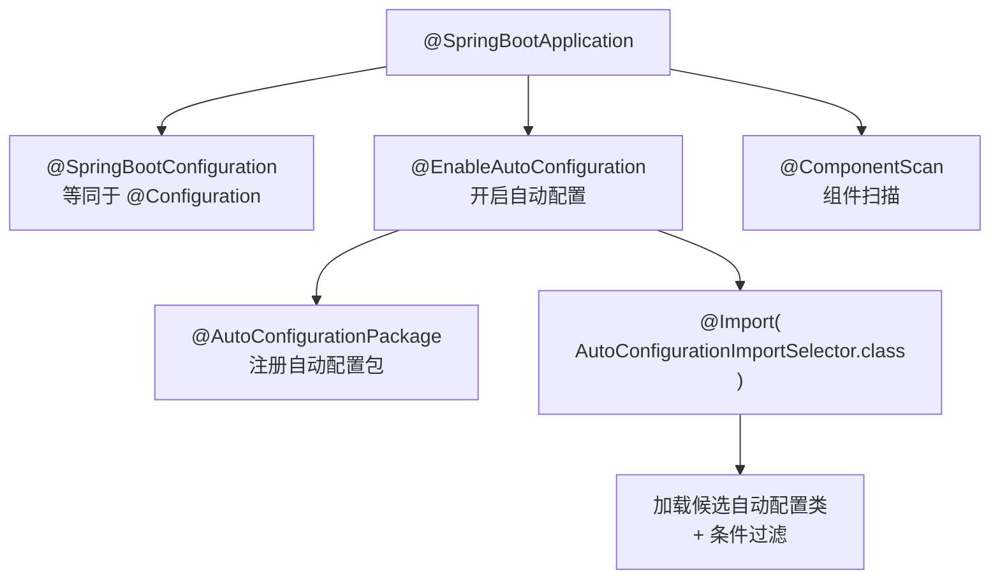
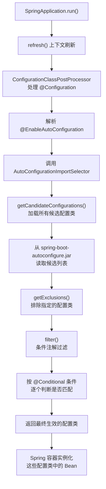
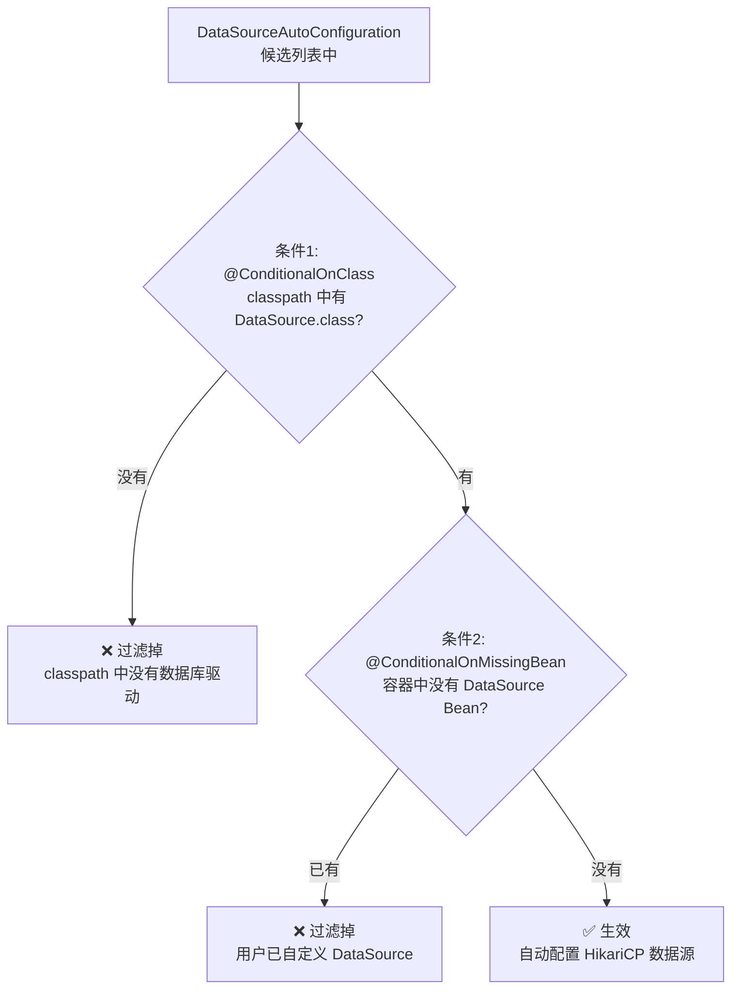
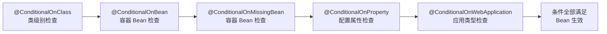
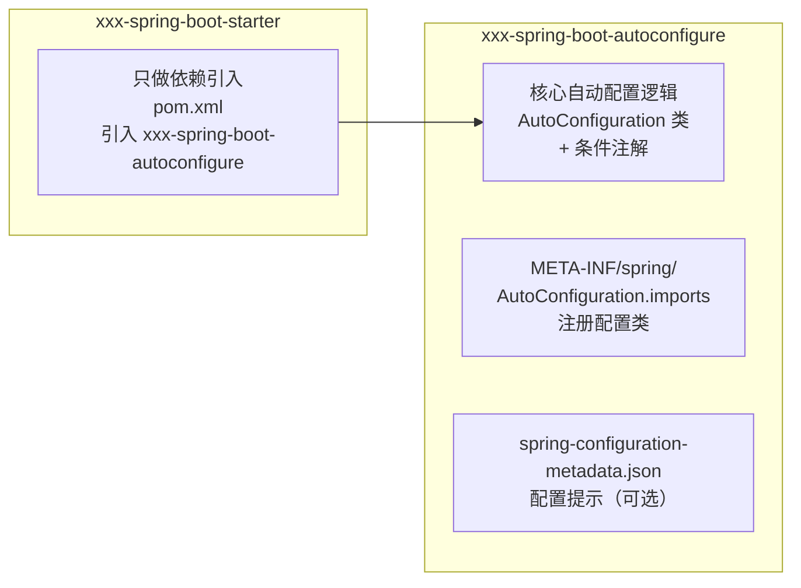
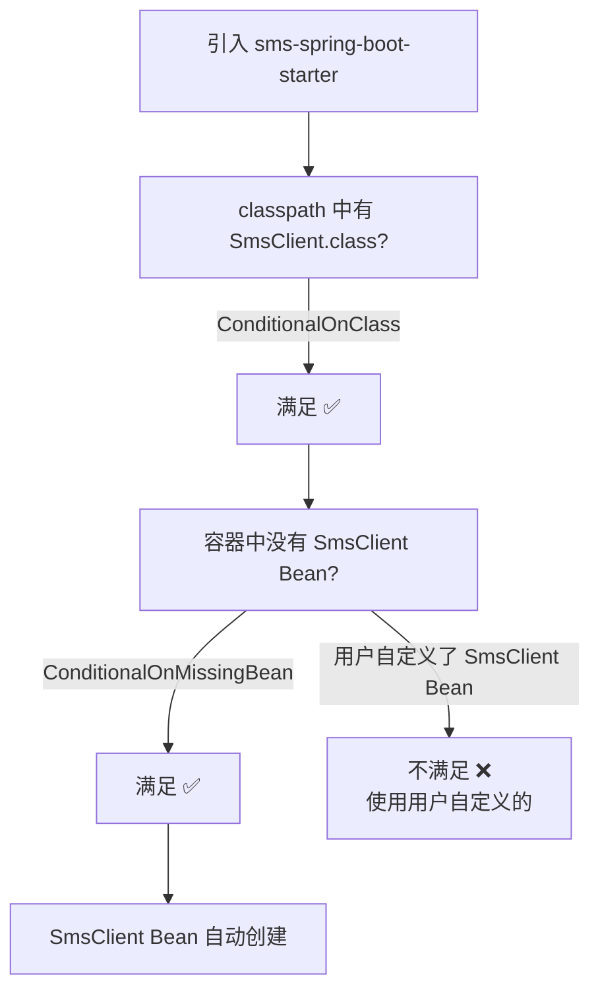

# Spring Boot 阶段一：自动配置原理

## 目录

1. [自动配置概览](#一、自动配置概览)
2. [@SpringBootApplication 组合注解](#二、springbootapplication-组合注解)
3. [自动配置加载全流程](#三、自动配置加载全流程)
4. [条件注解体系](#四、条件注解体系)
5. [自定义 Starter 原理](#五、自定义-starter-原理)
6. [禁用与排除自动配置](#六、禁用与排除自动配置)
7. [自检](#七、自检)

---

## 一、自动配置概览

### 1.1 什么是自动配置？

> Spring Boot 自动配置（Auto-Configuration）根据项目**类路径（classpath）中的依赖**和**已定义的 Bean**，自动配置 Spring 应用。核心思想是"约定优于配置"。

**传统 Spring 的痛点**：

```java
// 没有 Spring Boot 时，需要手动配置大量 Bean
@Configuration
public class DataSourceConfig {
    @Bean
    public DataSource dataSource() {
        HikariDataSource ds = new HikariDataSource();
        ds.setJdbcUrl("jdbc:mysql://localhost:3306/db");
        ds.setUsername("root");
        ds.setPassword("123456");
        return ds;
    }

    @Bean
    public PlatformTransactionManager transactionManager(DataSource ds) {
        return new DataSourceTransactionManager(ds);
    }

    @Bean
    public JdbcTemplate jdbcTemplate(DataSource ds) {
        return new JdbcTemplate(ds);
    }
    // ... 还要配置 SqlSessionFactory、MyBatis Mapper 扫描等
}
```

**Spring Boot 自动配置后**：

```yaml
# application.yml
spring:
  datasource:
    url: jdbc:mysql://localhost:3306/db
    username: root
    password: "123456"
```

```java
@SpringBootApplication
public class MyApplication {
    public static void main(String[] args) {
        SpringApplication.run(MyApplication.class, args);
    }
}
```

Spring Boot 自动配置了 DataSource、TransactionManager、JdbcTemplate 等所有必要的 Bean。

### 1.2 自动配置的核心问题

面试中需要回答三个核心问题：
1. **Spring Boot 怎么知道要配置哪些 Bean？** → 从候选列表加载 + 条件注解过滤
2. **候选配置类从哪里来？** → `META-INF/spring/org.springframework.boot.autoconfigure.AutoConfiguration.imports`
3. **什么时候生效、什么时候不生效？** → `@Conditional` 系列条件注解

---

## 二、@SpringBootApplication 组合注解

### 2.1 注解拆解

```java
// org.springframework.boot.autoconfigure.SpringBootApplication

@SpringBootConfiguration          // 1. 声明为配置类（等同于 @Configuration）
@EnableAutoConfiguration          // 2. 开启自动配置
@ComponentScan                    // 3. 开启组件扫描
public @interface SpringBootApplication {
    // exclude / excludeName: 排除特定自动配置
    Class<?>[] exclude() default {};
    String[] excludeName() default {};
    // scanBasePackages: 指定扫描包路径
    String[] scanBasePackages() default {};
}
```



### 2.2 三个子注解各自的作用

| 注解 | 作用 | 对应传统 Spring |
| --- | --- | --- |
| `@SpringBootConfiguration` | 声明为配置类 | `@Configuration` |
| `@ComponentScan` | 扫描当前包及子包下的 @Component | XML 中的 `<context:component-scan>` |
| `@EnableAutoConfiguration` | 加载并过滤自动配置类 | 手动 `@Import` 各配置类 |

> **面试话术**："`@SpringBootApplication` 是一个组合注解，核心是 `@EnableAutoConfiguration`，它通过 `@Import(AutoConfigurationImportSelector.class)` 来加载候选自动配置类，然后用条件注解过滤出需要生效的配置。"

---

## 三、自动配置加载全流程

### 3.1 整体流程图



### 3.2 第一步：加载候选配置类

```java
// org.springframework.boot.autoconfigure.AutoConfigurationImportSelector

protected AutoConfigurationEntry getAutoConfigurationEntry(
        AnnotationMetadata annotationMetadata, AnnotationAttributes attributes) {

    // 1. 获取排除列表
    List<String> exclusions = getExclusions(annotationMetadata, attributes);

    // 2. 加载所有候选自动配置类（核心方法）
    List<String> configurations = getCandidateConfigurations(annotationMetadata, attributes);

    // 3. 去重
    configurations = removeDuplicates(configurations);

    // 4. 排除不需要的
    exclusions.forEach(configurations::remove);

    // 5. 条件过滤（核心方法）
    configurations = getConfigurationClassFilter().filter(configurations);

    // 6. 触发自动配置导入事件
    fireAutoConfigurationImportEvents(configurations, exclusions);

    return new AutoConfigurationEntry(configurations, exclusions);
}
```

### 3.3 候选配置类从哪里来？

**Spring Boot 2.x**：从 `META-INF/spring.factories` 中读取

```properties
# spring-boot-autoconfigure-2.x.jar!/META-INF/spring.factories
org.springframework.boot.autoconfigure.EnableAutoConfiguration=\
org.springframework.boot.autoconfigure.web.servlet.WebMvcAutoConfiguration,\
org.springframework.boot.autoconfigure.jdbc.DataSourceAutoConfiguration,\
org.springframework.boot.autoconfigure.orm.jpa.HibernateJpaAutoConfiguration,\
...（130+ 个配置类）
```

**Spring Boot 3.x**：从 `META-INF/spring/org.springframework.boot.autoconfigure.AutoConfiguration.imports` 中读取

```text
# spring-boot-autoconfigure-3.x.jar!/META-INF/spring/org.springframework.boot.autoconfigure.AutoConfiguration.imports
org.springframework.boot.autoconfigure.web.servlet.WebMvcAutoConfiguration
org.springframework.boot.autoconfigure.jdbc.DataSourceAutoConfiguration
org.springframework.boot.autoconfigure.orm.jpa.HibernateJpaAutoConfiguration
...
```

```java
// Spring Boot 3.x 加载方式：使用 ImportCandidates
List<String> configurations = ImportCandidates.load(
    AutoConfiguration.class, getClassLoader()).getCandidates();
```

> **面试高频考点**：Spring Boot 3.x 用 `AutoConfiguration.imports` 文件替代了 `spring.factories`，原因是 `spring.factories` 作为通用 SPI 机制不够内聚，新文件专门用于自动配置类注册。

### 3.4 第二步：条件过滤

```java
// AutoConfigurationImportSelector#getConfigurationClassFilter

List<String> filter(List<String> configurations) {
    long startTime = System.nanoTime();
    String[] candidates = StringUtils.toStringArray(configurations);

    // 使用所有注册的 SpringBootCondition 实现来过滤
    boolean skipped = false;
    for (AutoConfigurationImportFilter filter : this.filters) {
        boolean[] match = filter.match(candidates, this.autoConfigurationMetadata);
        for (int i = 0; i < match.length; i++) {
            if (!match[i]) {
                candidates[i] = null;
                skipped = true;
            }
        }
    }

    // 移除不匹配的配置类
    return Arrays.stream(candidates)
            .filter(Objects::nonNull)
            .collect(Collectors.toList());
}
```

### 3.5 以 DataSourceAutoConfiguration 为例

```java
// org.springframework.boot.autoconfigure.jdbc.DataSourceAutoConfiguration

@AutoConfiguration(before = SqlInitializationAutoConfiguration.class)
@ConditionalOnClass({ DataSource.class, EmbeddedDatabaseType.class })
@EnableConfigurationProperties(DataSourceProperties.class)
@Import({ DataSourcePoolMetadataProvidersConfiguration.class,
        DataSourceInitializationConfiguration.class })
public class DataSourceAutoConfiguration {

    @Configuration(proxyBeanMethods = false)
    @Conditional(EmbeddedDatabaseCondition.class)  // 条件1：嵌入式数据库
    @ConditionalOnMissingBean(DataSource.class)      // 条件2：容器中没有 DataSource
    @Import(EmbeddedDataSourceConfiguration.class)
    static class EmbeddedDatabaseConfiguration {
    }

    @Configuration(proxyBeanMethods = false)
    @ConditionalOnMissingBean(DataSource.class)
    @Import({ HikariConfiguration.class, Tomcat.class, Dbcp2.class, OracleUcp.class })
    static class PooledDataSourceConfiguration {
    }

    // ...
}
```

**过滤过程**：



> **核心逻辑**：自动配置只在"用户没有手动配置"的情况下才生效，用户自定义优先。

---

## 四、条件注解体系

### 4.1 @Conditional 注解族

Spring Boot 提供了一系列 `@Conditional` 衍生注解，是自动配置的核心判断机制。

| 条件注解 | 作用 | 典型场景 |
| --- | --- | --- |
| `@ConditionalOnClass` | classpath 中存在指定类 | 引入了某个依赖才生效 |
| `@ConditionalOnMissingClass` | classpath 中不存在指定类 | 排除某个依赖时生效 |
| `@ConditionalOnBean` | 容器中存在指定 Bean | 依赖其他自动配置 |
| `@ConditionalOnMissingBean` | 容器中不存在指定 Bean | **用户未自定义时才自动配置** |
| `@ConditionalOnProperty` | 配置文件中存在指定属性 | 通过配置开关控制 |
| `@ConditionalOnWebApplication` | 当前是 Web 应用 | Web 相关自动配置 |
| `@ConditionalOnNotWebApplication` | 当前不是 Web 应用 | 非Web场景自动配置 |
| `@ConditionalOnExpression` | SpEL 表达式为 true | 复杂条件判断 |
| `@ConditionalOnSingleCandidate` | 容器中只有一个指定 Bean 或首选 | 确定唯一候选 |
| `@ConditionalOnResource` | classpath 中存在指定资源文件 | 配置文件存在才生效 |
| `@ConditionalOnJava` | 指定 Java 版本 | 版本兼容性 |
| `@ConditionalOnJndi` | JNDI 中存在指定资源 | JNDI 场景 |

### 4.2 最常用的三个

#### @ConditionalOnClass

```java
// 只有引入了 spring-web 依赖才加载 WebMvcAutoConfiguration
@ConditionalOnClass(DispatcherServlet.class)
public class WebMvcAutoConfiguration {
    // ...
}
```

**原理**：通过 `ClassLoader.loadClass()` 尝试加载类，成功则条件满足，失败则不满足。

#### @ConditionalOnMissingBean（最核心）

```java
// 只有用户没有自定义 DataSource Bean 时，才自动配置
@Bean
@ConditionalOnMissingBean(DataSource.class)
public DataSource dataSource(DataSourceProperties properties) {
    return properties.initializeDataSourceBuilder().type(HikariDataSource.class).build();
}
```

**原理**：在 `BeanFactory` 中查找是否已存在指定类型的 Bean 定义。这是"用户优先"原则的核心实现。

#### @ConditionalOnProperty

```java
// 通过配置属性控制是否启用
@ConditionalOnProperty(prefix = "spring.mvc", name = "dispatchtrace", havingValue = "true")
public class DispatchTraceAutoConfiguration {
}

// 通过配置属性的存在性判断
@ConditionalOnProperty(prefix = "spring.redis", name = "host")
public class RedisAutoConfiguration {
}
```

```yaml
# application.yml - 开启
spring:
  mvc:
    dispatchtrace: true

# 不配置或设为 false 则不生效
```

### 4.3 条件注解的执行顺序



> **注意**：`@ConditionalOnBean` 和 `@ConditionalOnMissingBean` 是在 `BeanFactory` 中查找已注册的 Bean 定义，所以**自动配置类的加载顺序**很重要。Spring Boot 通过 `@AutoConfigureBefore` 和 `@AutoConfigureAfter` 来控制顺序。

### 4.4 自动配置顺序控制

```java
@AutoConfiguration(before = SqlInitializationAutoConfiguration.class)  // 在其之前
@AutoConfiguration(after = { HibernateJpaAutoConfiguration.class })     // 在其后
@AutoConfigureOrder(Ordered.HIGHEST_PRECEDENCE)                        // 绝对顺序
public class DataSourceAutoConfiguration {
}
```

| 注解 | 作用 |
| --- | --- |
| `@AutoConfigureBefore` | 在指定配置类之前加载 |
| `@AutoConfigureAfter` | 在指定配置类之后加载 |
| `@AutoConfigureOrder` | 绝对排序顺序（数值越小越优先） |

---

## 五、自定义 Starter 原理

### 5.1 Starter 的组成

一个标准的自定义 Starter 包含两部分：



### 5.2 实现示例：短信服务 Starter

**步骤 1：自动配置模块**

```java
// com.example.sms.autoconfigure.SmsAutoConfiguration
@AutoConfiguration
@ConditionalOnClass(SmsClient.class)
@EnableConfigurationProperties(SmsProperties.class)
public class SmsAutoConfiguration {

    @Bean
    @ConditionalOnMissingBean
    public SmsClient smsClient(SmsProperties properties) {
        SmsClient client = new SmsClient();
        client.setAccessKey(properties.getAccessKey());
        client.setSecretKey(properties.getSecretKey());
        client.setEndpoint(properties.getEndpoint());
        return client;
    }
}
```

```java
// com.example.sms.autoconfigure.SmsProperties
@ConfigurationProperties(prefix = "sms")
public class SmsProperties {
    private String accessKey;
    private String secretKey;
    private String endpoint = "https://sms.aliyuncs.com";
    // getter/setter
}
```

**步骤 2：注册自动配置类**

```text
# META-INF/spring/org.springframework.boot.autoconfigure.AutoConfiguration.imports
com.example.sms.autoconfigure.SmsAutoConfiguration
```

**步骤 3：Starter 模块（只做依赖引入）**

```xml
<!-- pom.xml -->
<dependencies>
    <dependency>
        <groupId>com.example</groupId>
        <artifactId>sms-spring-boot-autoconfigure</artifactId>
    </dependency>
</dependencies>
```

### 5.3 自动配置生效的条件

引入 Starter 后，自动配置类生效需要满足：



---

## 六、禁用与排除自动配置

### 6.1 三种排除方式

```java
// 方式1：注解排除（推荐）
@SpringBootApplication(exclude = { DataSourceAutoConfiguration.class })
public class MyApplication {
}

// 方式2：注解排除（按名称）
@SpringBootApplication(excludeName = "org.springframework.boot.autoconfigure.jdbc.DataSourceAutoConfiguration")
public class MyApplication {
}
```

```yaml
# 方式3：配置文件排除
spring:
  autoconfigure:
    exclude:
      - org.springframework.boot.autoconfigure.jdbc.DataSourceAutoConfiguration
      - org.springframework.boot.autoconfigure.orm.jpa.HibernateJpaAutoConfiguration
```

### 6.2 调试自动配置

```yaml
# 开启自动配置报告（启动时打印）
debug: true
```

启动日志中会输出 `CONDITIONS EVALUATION REPORT`，分为两部分：
- **Positive matches**：生效的自动配置类及条件
- **Negative matches**：未生效的自动配置类及原因

```text
============================
CONDITIONS EVALUATION REPORT
============================

Positive matches:
-----------------

   DataSourceAutoConfiguration matched:
      - @ConditionalOnClass found required classes 'javax.sql.DataSource', 'org.springframework.jdbc.datasource.embedded.EmbeddedDatabaseType' (OnClassCondition)

   MyBatisAutoConfiguration matched:
      - @ConditionalOnClass found required classes 'org.apache.ibatis.session.SqlSessionFactory', 'org.mybatis.spring.SqlSessionFactoryBean' (OnClassCondition)

Negative matches:
-----------------

   RedisAutoConfiguration:
      Did not match:
         - @ConditionalOnClass did not find required class 'org.springframework.data.redis.core.RedisOperations' (OnClassCondition)
```

**生产环境可通过 Actuator 查看**：

```yaml
management:
  endpoint:
    conditions:
      enabled: true
```

```bash
GET /actuator/conditions
```

---

## 七、自检

### Q1: Spring Boot 自动配置原理？

```
核心流程：

1. @SpringBootApplication 是组合注解，包含 @EnableAutoConfiguration
2. @EnableAutoConfiguration 通过 @Import(AutoConfigurationImportSelector.class) 加载
3. AutoConfigurationImportSelector 做两件事：
   a) 加载候选配置类：Spring Boot 3.x 从 AutoConfiguration.imports 文件读取，
      Spring Boot 2.x 从 spring.factories 读取
   b) 条件过滤：根据 @Conditional 系列注解逐个判断是否匹配
4. 最终生效的配置类被 Spring 容器处理，注册其中的 @Bean

核心原则：用户自定义优先。@ConditionalOnMissingBean 保证用户配置覆盖自动配置。
```

### Q2: spring.factories 和 AutoConfiguration.imports 的区别？

```
Spring Boot 2.x 使用 spring.factories：
- 路径：META-INF/spring.factories
- 格式：key=value 形式，key 为接口全限定名
- 缺点：spring.factories 是通用 SPI 机制，自动配置只是其中一部分，不够内聚

Spring Boot 3.x 使用 AutoConfiguration.imports：
- 路径：META-INF/spring/org.springframework.boot.autoconfigure.AutoConfiguration.imports
- 格式：每行一个配置类全限定名
- 优点：专门用于自动配置，更加清晰、加载更快
```

### Q3: @ConditionalOnMissingBean 的作用？

```
这是自动配置"用户优先"原则的核心实现。
只有当容器中不存在指定类型的 Bean 时，自动配置的 Bean 才会生效。
如果用户已经自定义了该 Bean，自动配置的 Bean 就不会创建。

注意：@ConditionalOnMissingBean 的判断时机是在自动配置类处理时，
所以用户自定义的 Bean 必须在自动配置类之前被注册。
通常用户自定义的 Bean 在 @ComponentScan 中扫描到，
而自动配置类在 @EnableAutoConfiguration 中加载，
Spring 默认保证 @ComponentScan 先于自动配置处理。
```

### Q4: 如何自定义一个 Starter？

```
1. 创建两个模块：
   - xxx-spring-boot-autoconfigure：包含自动配置类
   - xxx-spring-boot-starter：只做依赖引入

2. 在 autoconfigure 模块中：
   - 编写 Properties 类（@ConfigurationProperties 绑定配置）
   - 编写 AutoConfiguration 类（@AutoConfiguration + 条件注解）
   - 创建 META-INF/spring/org.springframework.boot.autoconfigure.AutoConfiguration.imports
     文件注册自动配置类

3. 在 starter 模块中引入 autoconfigure 模块

4. 使用方只需引入 starter，并配置 application.yml 即可
```

### Q5: 如何查看哪些自动配置生效了？

```
三种方式：

1. 启动参数加 --debug，启动时打印 CONDITIONS EVALUATION REPORT

2. Actuator 端点：GET /actuator/conditions

3. IDE 插件：Spring Boot 插件可以可视化查看自动配置匹配情况
```

### Q6: 自动配置类的加载顺序怎么保证？

```
三种方式：
1. @AutoConfigureBefore(Xxx.class)：在指定配置类之前加载
2. @AutoConfigureAfter(Xxx.class)：在指定配置类之后加载
3. @AutoConfigureOrder(Ordered.HIGHEST_PRECEDENCE)：绝对顺序

比如 DataSourceAutoConfiguration 需要在
SqlInitializationAutoConfiguration 之前加载，
因为 SQL 初始化需要数据源。
```

---

## 核心源码路径速查

| 类/方法 | 作用 |
| --- | --- |
| `@SpringBootApplication` | 组合注解（@SpringBootConfiguration + @EnableAutoConfiguration + @ComponentScan） |
| `@EnableAutoConfiguration` | 开启自动配置，@Import(AutoConfigurationImportSelector.class) |
| `AutoConfigurationImportSelector` | 自动配置选择器，加载 + 过滤候选配置类 |
| `AutoConfigurationImportSelector#getAutoConfigurationEntry()` | 核心入口，完成加载-去重-排除-过滤 |
| `AutoConfigurationImportSelector#getCandidateConfigurations()` | 加载候选配置类列表 |
| `AutoConfigurationImportSelector#getConfigurationClassFilter().filter()` | 条件注解过滤 |
| `AutoConfigurationImportSelector#getExclusions()` | 获取排除列表 |
| `OnClassCondition` | 处理 @ConditionalOnClass / @ConditionalOnMissingClass |
| `OnBeanCondition` | 处理 @ConditionalOnBean / @ConditionalOnMissingBean |
| `OnPropertyCondition` | 处理 @ConditionalOnProperty |
| `@AutoConfiguration` | 标记自动配置类（Spring Boot 3.x） |
| `ImportCandidates` | Spring Boot 3.x 加载 AutoConfiguration.imports 文件 |

---

> **下一步**：完成 `springboot-01-exercises.md` 练习题，目标 85 分+，然后进入面试指南复习。
