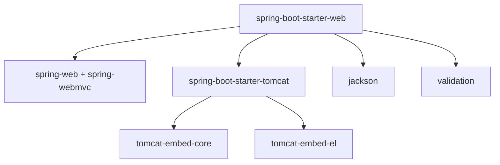
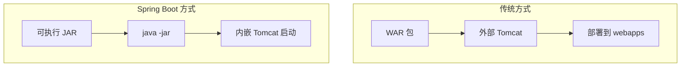
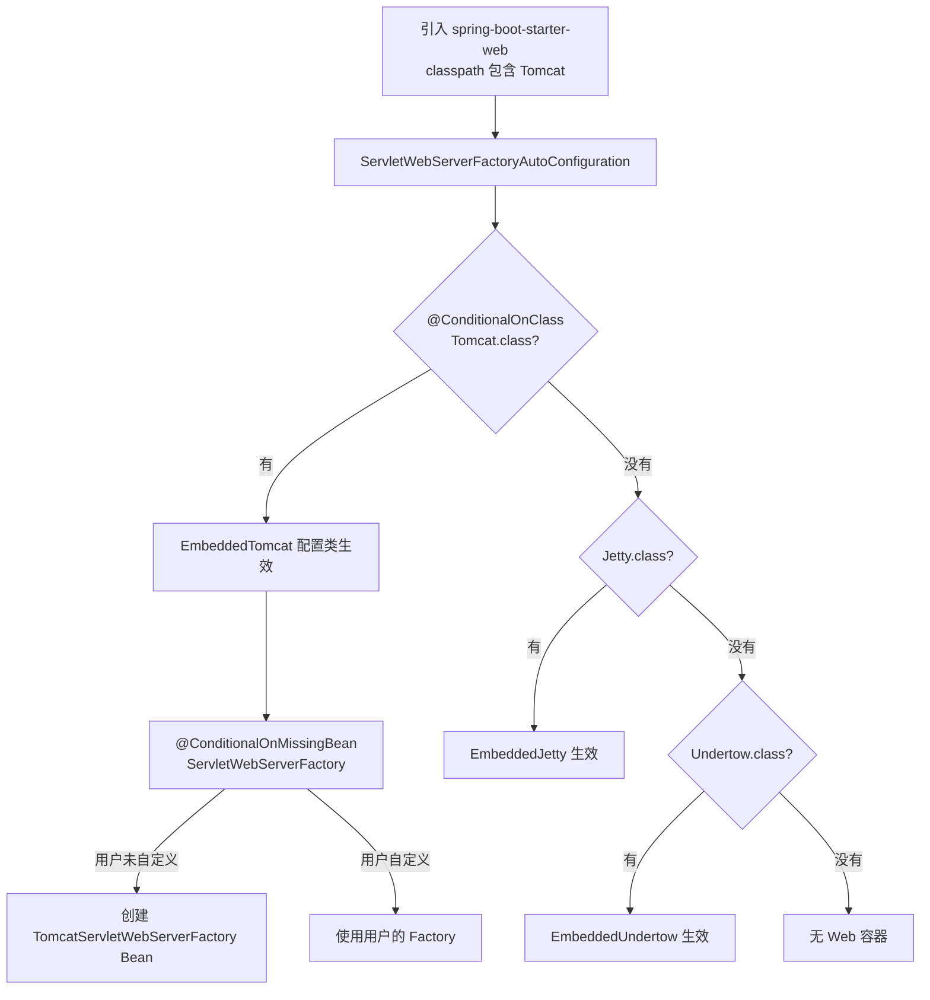
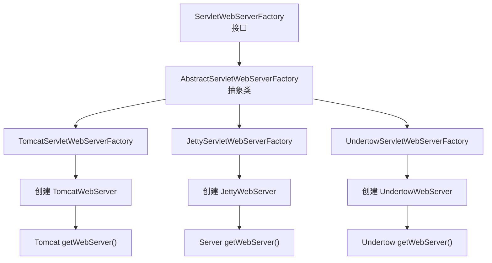
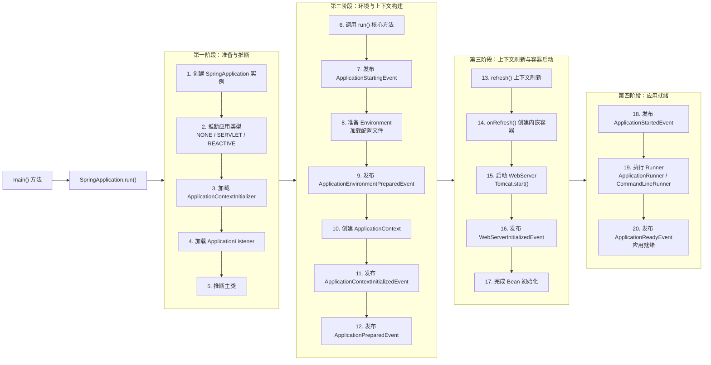
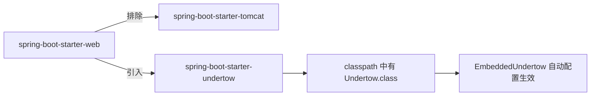
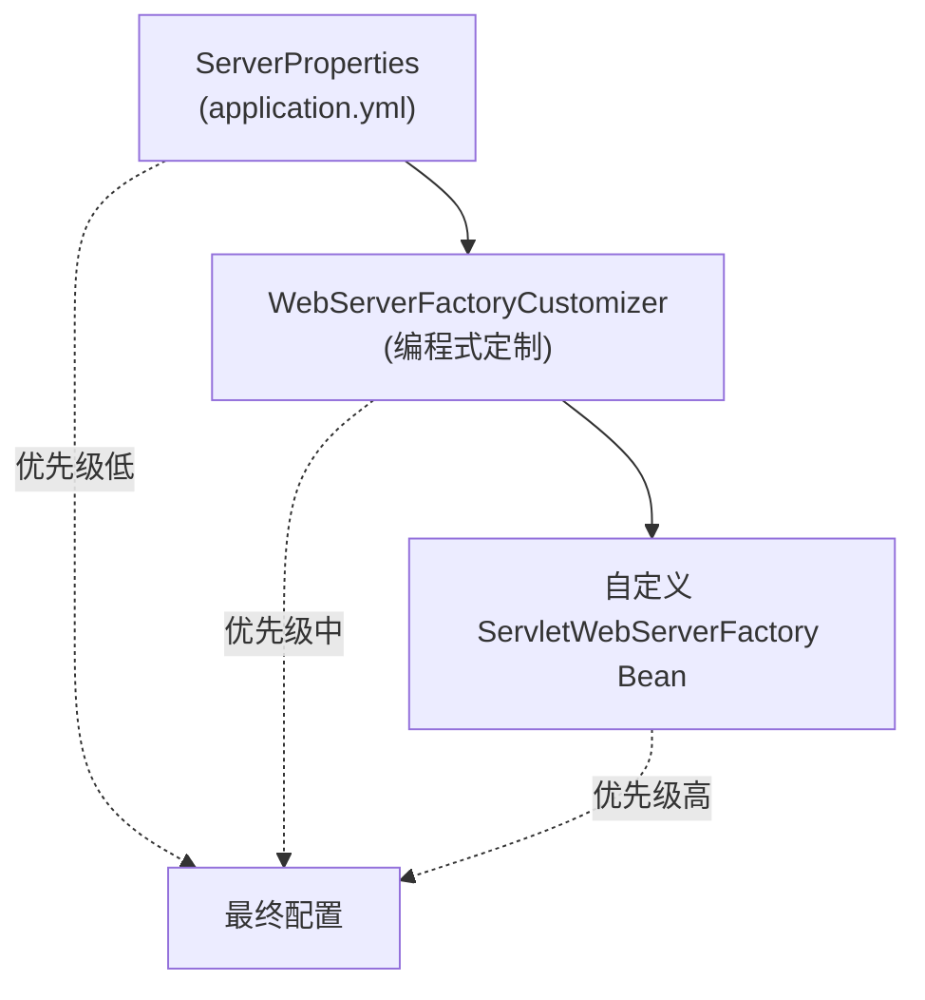

# Spring Boot 阶段二：起步依赖与内嵌容器

## 目录

1. [起步依赖（Starter）设计思想](#一、起步依赖-starter-设计思想)
2. [内嵌容器原理](#二、内嵌容器原理)
3. [Spring Boot 启动全流程](#三、spring-boot-启动全流程)
4. [切换内嵌容器](#四、切换内嵌容器)
5. [自定义内嵌容器配置](#五、自定义内嵌容器配置)
6. [自检](#六、自检)

---

## 一、起步依赖（Starter）设计思想

### 1.1 什么是 Starter？

> Starter 是 Spring Boot 提供的一站式依赖包，将完成某项功能所需的所有依赖和自动配置打包在一起，开发者只需引入一个 Starter 即可。

**传统方式 vs Starter 方式**：

```xml
<!-- 传统方式：手动引入每个依赖，需要处理版本冲突 -->
<dependencies>
    <dependency>
        <groupId>org.springframework</groupId>
        <artifactId>spring-webmvc</artifactId>
        <version>6.2.0</version>
    </dependency>
    <dependency>
        <groupId>org.springframework</groupId>
        <artifactId>spring-web</artifactId>
        <version>6.2.0</version>
    </dependency>
    <dependency>
        <groupId>jakarta.servlet</groupId>
        <artifactId>jakarta.servlet-api</artifactId>
        <version>6.0.0</version>
    </dependency>
    <dependency>
        <groupId>org.apache.tomcat.embed</groupId>
        <artifactId>tomcat-embed-core</artifactId>
        <version>10.1.18</version>
    </dependency>
    <!-- 还要引入 jackson、validation ... -->
</dependencies>

<!-- Starter 方式：一行搞定 -->
<dependency>
    <groupId>org.springframework.boot</groupId>
    <artifactId>spring-boot-starter-web</artifactId>
    <!-- 不需要写版本号，由 spring-boot-starter-parent 管理 -->
</dependency>
```

### 1.2 Starter 的依赖管理机制

Spring Boot 通过 `spring-boot-starter-parent` 统一管理依赖版本：

```xml
<parent>
    <groupId>org.springframework.boot</groupId>
    <artifactId>spring-boot-starter-parent</artifactId>
    <version>3.3.0</version>
</parent>
```

`spring-boot-starter-parent` 内部依赖 `spring-boot-dependencies`，其中定义了所有常用依赖的版本：

```xml
<!-- spring-boot-dependencies 中 -->
<properties>
    <tomcat.version>10.1.30</tomcat.version>
    <jackson.version>2.17.2</jackson.version>
    <spring-framework.version>6.2.0</spring-framework.version>
    <!-- 几百个版本号 -->
</properties>

<dependencyManagement>
    <dependencies>
        <dependency>
            <groupId>org.apache.tomcat.embed</groupId>
            <artifactId>tomcat-embed-core</artifactId>
            <version>${tomcat.version}</version>
        </dependency>
        <!-- 几百个依赖 -->
    </dependencies>
</dependencyManagement>
```



### 1.3 常用 Starter 分类

| 分类 | Starter | 说明 |
| --- | --- | --- |
| **Web** | spring-boot-starter-web | Spring MVC + 内嵌 Tomcat |
| **Web** | spring-boot-starter-webflux | WebFlux + Reactor Netty |
| **模板** | spring-boot-starter-thymeleaf | Thymeleaf 模板引擎 |
| **数据库** | spring-boot-starter-data-jpa | JPA + Hibernate |
| **数据库** | spring-boot-starter-jdbc | JDBC + HikariCP |
| **数据库** | spring-boot-starter-data-redis | Redis 客户端（Lettuce） |
| **安全** | spring-boot-starter-security | Spring Security |
| **消息** | spring-boot-starter-amqp | RabbitMQ |
| **消息** | spring-boot-starter-kafka | Apache Kafka |
| **监控** | spring-boot-starter-actuator | 监控与管理端点 |
| **测试** | spring-boot-starter-test | JUnit + Mockito + AssertJ |

### 1.4 spring-boot-starter-web 的依赖树

```
spring-boot-starter-web
├── spring-boot-starter
│   ├── spring-boot
│   ├── spring-boot-autoconfigure
│   ├── spring-core
│   ├── spring-context
│   └── logback（默认日志）
├── spring-boot-starter-json
│   ├── jackson-databind
│   └── jackson-datatype-jsr310
├── spring-boot-starter-tomcat
│   ├── tomcat-embed-core         ← 核心依赖
│   ├── tomcat-embed-el
│   └── tomcat-embed-websocket
├── spring-web
├── spring-webmvc
└── jakarta.servlet-api
```

> **核心结论**：引入 `spring-boot-starter-web` 就自动引入了 Tomcat、Spring MVC、Jackson 等所有必要依赖，无需手动配置。

---

## 二、内嵌容器原理

### 2.1 传统部署 vs 内嵌容器



**传统方式的问题**：
- 需要单独安装 Tomcat/Jetty
- 需要打 WAR 包部署
- 开发环境和生产环境可能不一致
- 版本管理复杂

**Spring Boot 内嵌容器的优势**：
- 一条命令启动：`java -jar app.jar`
- 开发和生产环境完全一致
- 版本由 Spring Boot 统一管理
- 部署简单，适合容器化（Docker）

### 2.2 内嵌容器的自动配置

Spring Boot 通过自动配置选择并创建内嵌容器：

```java
// org.springframework.boot.autoconfigure.web.servlet.ServletWebServerFactoryAutoConfiguration

@AutoConfiguration(after = SslAutoConfiguration.class)
@AutoConfigureOrder(Ordered.HIGHEST_PRECEDENCE)
@ConditionalOnClass(jakarta.servlet.ServletRequest.class)
@ConditionalOnWebApplication(type = ConditionalOnWebApplication.Type.SERVLET)
@EnableConfigurationProperties(ServerProperties.class)
@Import({
    // 导入三种容器的配置类
    ServletWebServerFactoryConfiguration.EmbeddedTomcat.class,
    ServletWebServerFactoryConfiguration.EmbeddedJetty.class,
    ServletWebServerFactoryConfiguration.EmbeddedUndertow.class
})
public class ServletWebServerFactoryAutoConfiguration {
}
```

三种容器的配置类：

```java
// org.springframework.boot.autoconfigure.web.servlet.ServletWebServerFactoryConfiguration

@Configuration(proxyBeanMethods = false)
@ConditionalOnClass({ Servlet.class, Tomcat.class, UpgradeProtocol.class })
@ConditionalOnMissingBean(value = ServletWebServerFactory.class, search = SearchStrategy.CURRENT)
static class EmbeddedTomcat {
    @Bean
    TomcatServletWebServerFactory tomcatServletWebServerFactory(
            ObjectProvider<TomcatConnectorCustomizer> connectorCustomizers,
            ObjectProvider<TomcatContextCustomizer> contextCustomizers) {
        TomcatServletWebServerFactory factory = new TomcatServletWebServerFactory();
        factory.getTomcatConnectorCustomizers().addAll(connectorCustomizers.orderedStream().toList());
        factory.getTomcatContextCustomizers().addAll(contextCustomizers.orderedStream().toList());
        return factory;
    }
}

@Configuration(proxyBeanMethods = false)
@ConditionalOnClass({ Servlet.class, Server.class, Loader.class, WebAppContext.class })
@ConditionalOnMissingBean(value = ServletWebServerFactory.class, search = SearchStrategy.CURRENT)
static class EmbeddedJetty {
    @Bean
    JettyServletWebServerFactory jettyServletWebServerFactory() {
        return new JettyServletWebServerFactory();
    }
}

@Configuration(proxyBeanMethods = false)
@ConditionalOnClass({ Servlet.class, Undertow.class, Servlets.class })
@ConditionalOnMissingBean(value = ServletWebServerFactory.class, search = SearchStrategy.CURRENT)
static class EmbeddedUndertow {
    @Bean
    UndertowServletWebServerFactory undertowServletWebServerFactory() {
        return new UndertowServletWebServerFactory();
    }
}
```



> **关键点**：`@ConditionalOnMissingBean` 保证用户可以自定义容器工厂来覆盖默认配置。

### 2.3 ServletWebServerFactory 接口体系



**核心接口**：

```java
public interface ServletWebServerFactory {
    WebServer getWebServer(ServletContextInitializer... initializers);
}
```

以 `TomcatServletWebServerFactory` 为例，创建 Tomcat 并启动的核心逻辑：

```java
// org.springframework.boot.web.embedded.tomcat.TomcatServletWebServerFactory

@Override
public WebServer getWebServer(ServletContextInitializer... initializers) {
    // 1. 创建 Tomcat 实例
    Tomcat tomcat = new Tomcat();
    
    // 2. 配置基础目录
    File baseDir = createTempDir("tomcat");
    tomcat.setBaseDir(baseDir.getAbsolutePath());
    
    // 3. 创建 Connector（监听端口）
    Connector connector = new Connector(protocol);
    connector.setPort(this.port);  // 默认 8080
    tomcat.getService().addConnector(connector);
    
    // 4. 配置 Host 和 Context
    tomcat.setHostname(this.hostname);
    tomcat.getHost().setAutoDeploy(false);
    configureContext(tomcat, initializers);
    
    // 5. 启动 Tomcat（非阻塞方式，线程池处理请求）
    tomcat.start();
    
    return new TomcatWebServer(tomcat);
}
```

---

## 三、Spring Boot 启动全流程

### 3.1 完整启动流程图



### 3.2 关键步骤详解

#### 步骤 2：推断应用类型

```java
// SpringApplication 构造方法中
static WebApplicationType deduceWebApplicationType() {
    if (ClassUtils.isPresent(WEBFLUX_INDICATOR_CLASS, null)
            && !ClassUtils.isPresent(WEBMVC_INDICATOR_CLASS, null)) {
        return WebApplicationType.REACTIVE;
    }
    for (String className : SERVLET_INDICATOR_CLASSES) {
        if (!ClassUtils.isPresent(className, null)) {
            return WebApplicationType.NONE;
        }
    }
    return WebApplicationType.SERVLET;
}
```

| 检测条件 | 应用类型 | 使用容器 |
| --- | --- | --- |
| classpath 有 DispatcherServlet，没有 DispatcherHandler | SERVLET | Tomcat/Jetty/Undertow |
| classpath 有 DispatcherHandler，没有 DispatcherServlet | REACTIVE | Reactor Netty |
| 都没有 | NONE | 无 Web 容器 |

#### 步骤 10：创建 ApplicationContext

```java
// 根据 WebApplicationType 选择 ApplicationContext
protected ConfigurableApplicationContext createApplicationContext() {
    return switch (this.webApplicationType) {
        case SERVLET -> new AnnotationConfigServletWebServerApplicationContext();
        case REACTIVE -> new AnnotationConfigReactiveWebServerApplicationContext();
        default -> new AnnotationConfigApplicationContext();
    };
}
```

> **SERVLET 类型使用 `AnnotationConfigServletWebServerApplicationContext`**，它继承自 `ServletWebServerApplicationContext`，具备创建和管理 WebServer 的能力。

#### 步骤 14：onRefresh() 创建内嵌容器

```java
// ServletWebServerApplicationContext
@Override
protected void onRefresh() {
    super.onRefresh();
    try {
        createWebServer();
    } catch (Throwable ex) {
        throw new ApplicationContextException("Unable to start web server", ex);
    }
}

private void createWebServer() {
    WebServer webServer = this.webServer;
    // 获取容器中唯一的 ServletWebServerFactory Bean
    ServletWebServerFactory factory = getWebServerFactory();
    // 通过 Factory 创建并启动 WebServer
    this.webServer = factory.getWebServer(getSelfInitializer());
}
```

> **关键点**：内嵌容器在 `onRefresh()` 阶段创建并启动，这是 `AbstractApplicationContext.refresh()` 的一个扩展点。

#### 步骤 19：执行 Runner

```java
// ApplicationRunner 和 CommandLineRunner
// 在容器启动完成后执行，适合做初始化任务

@Component
public class MyStartupRunner implements ApplicationRunner {
    @Override
    public void run(ApplicationArguments args) {
        System.out.println("应用启动完成，执行初始化...");
    }
}
```

### 3.3 启动事件时间线

| 事件 | 阶段 | 用途 |
| --- | --- | --- |
| `ApplicationStartingEvent` | 最早期 | 日志初始化 |
| `ApplicationEnvironmentPreparedEvent` | Environment 准备好 | 修改配置源 |
| `ApplicationContextInitializedEvent` | ApplicationContext 创建 | 修改上下文 |
| `ApplicationPreparedEvent` | Bean 定义加载完成 | 很少使用 |
| `ApplicationStartedEvent` | 容器刷新完成 | 启动后处理 |
| `WebServerInitializedEvent` | Web 容器启动完成 | 获取端口号 |
| `ApplicationReadyEvent` | Runner 执行完成 | 应用完全就绪 |

---

## 四、切换内嵌容器

### 4.1 切换为 Undertow

```xml
<dependency>
    <groupId>org.springframework.boot</groupId>
    <artifactId>spring-boot-starter-web</artifactId>
    <exclusions>
        <exclusion>
            <groupId>org.springframework.boot</groupId>
            <artifactId>spring-boot-starter-tomcat</artifactId>
        </exclusion>
    </exclusions>
</dependency>
<dependency>
    <groupId>org.springframework.boot</groupId>
    <artifactId>spring-boot-starter-undertow</artifactId>
</dependency>
```



### 4.2 三种容器对比

| 特性 | Tomcat | Jetty | Undertow |
| --- | --- | --- | --- |
| **默认** | Spring Boot 默认 | 需手动切换 | 需手动切换 |
| **性能** | 中等 | 较低 | **最高**（NIO） |
| **内存占用** | 较高 | 最低 | 较低 |
| **并发模型** | NIO（默认） | NIO | **NIO + XNIO** |
| **Servlet 规范** | 完整支持 | 完整支持 | 完整支持 |
| **WebSocket** | 支持 | 支持 | 支持 |
| **生态** | 最成熟 | 成熟 | 成熟 |
| **适用场景** | 通用场景 | 低内存/长连接 | **高并发/高性能** |

> **面试建议**：知道默认是 Tomcat，了解 Undertow 性能最优即可。实际切换只需改 Maven 依赖，原理是 `@ConditionalOnClass` 自动选择。

---

## 五、自定义内嵌容器配置

### 5.1 通过 application.yml 配置

```yaml
server:
  port: 8080
  address: 0.0.0.0
  
  # Tomcat 特有配置
  tomcat:
    max-connections: 8192        # 最大连接数
    accept-count: 100            # 等待队列长度
    threads:
      max: 200                   # 最大工作线程数
      min-spare: 10              # 最小空闲线程数
    connection-timeout: 5000     # 连接超时(ms)
    
  # SSL 配置
  ssl:
    enabled: true
    key-store: classpath:keystore.p12
    key-store-password: 123456
    key-store-type: PKCS12
```

### 5.2 通过 WebServerFactoryCustomizer 编程配置

```java
@Component
public class MyTomcatCustomizer implements WebServerFactoryCustomizer<TomcatServletWebServerFactory> {

    @Override
    public void customize(TomcatServletWebServerFactory factory) {
        factory.setPort(9090);
        factory.setTomcatConnectorCustomizers(connector -> {
            Http11NioProtocol protocol = (Http11NioProtocol) connector.getProtocolHandler();
            protocol.setMaxConnections(2000);
            protocol.setConnectionTimeout(5000);
        });
        factory.addContextCustomizers(context -> {
            context.setSessionTimeout(30);
        });
    }
}
```

### 5.3 完全自定义 ServletWebServerFactory

```java
@Configuration
public class WebServerConfig {

    @Bean
    public ServletWebServerFactory servletWebServerFactory() {
        TomcatServletWebServerFactory factory = new TomcatServletWebServerFactory();
        factory.setPort(9090);
        factory.setContextPath("/api");
        factory.addErrorPages(new ErrorPage(HttpStatus.NOT_FOUND, "/404.html"));
        return factory;
    }
}
```

> **注意**：自定义 `ServletWebServerFactory` Bean 后，自动配置的 `@ConditionalOnMissingBean` 不满足，默认配置不会生效。

### 5.4 配置方式优先级



---

## 六、自检

### Q1: Spring Boot 是如何自动选择内嵌容器的？

```
通过 @ConditionalOnClass 注解实现的自动配置：

ServletWebServerFactoryAutoConfiguration 导入了三个内部配置类：
- EmbeddedTomcat：@ConditionalOnClass(Servlet.class, Tomcat.class)
- EmbeddedJetty：@ConditionalOnClass(Servlet.class, Server.class, Loader.class)
- EmbeddedUndertow：@ConditionalOnClass(Servlet.class, Undertow.class)

classpath 中有哪个容器的类，对应的配置就生效，创建对应的 ServletWebServerFactory Bean。
默认引入 spring-boot-starter-web 包含 spring-boot-starter-tomcat，所以默认用 Tomcat。
切换容器只需排除 Tomcat 引入其他容器依赖即可。
```

### Q2: Spring Boot 启动流程？

```
核心步骤：

1. 创建 SpringApplication 实例
   - 推断应用类型（SERVLET / REACTIVE / NONE）
   - 加载 Initializer 和 Listener

2. 执行 run()
   - 发布 ApplicationStartingEvent
   - 准备 Environment（加载 application.yml 等）
   - 创建 ApplicationContext（SERVLET → AnnotationConfigServletWebServerApplicationContext）
   - 发布 ApplicationPreparedEvent

3. refresh() 容器刷新
   - 执行 Bean 定义加载和实例化
   - onRefresh() 中创建并启动内嵌容器（Tomcat.start()）

4. 发布 ApplicationStartedEvent

5. 执行 ApplicationRunner / CommandLineRunner

6. 发布 ApplicationReadyEvent，应用就绪
```

### Q3: 为什么内嵌容器在 onRefresh() 中启动？

```
onRefresh() 是 AbstractApplicationContext.refresh() 中的一个模板方法。
将 Web 容器创建放在这里的原因：

1. 时序正确：此时 BeanFactory 已经创建完成，可以获取 ServletWebServerFactory Bean，
   但其他 Bean 还没有初始化，适合创建并启动容器

2. 与 Spring 集成：DispatcherServlet 等 Web 组件作为 Bean 在后续步骤注册到容器中

3. 避免循环：如果太早启动容器，Servlet 可能需要访问还未创建的 Bean；
   如果太晚，请求可能已经到达但容器还没准备好

4. 可扩展性：非 Web 应用（NONE 类型）的 ApplicationContext 不重写 onRefresh()，
   自然不会创建 Web 容器
```

### Q4: 如何切换内嵌容器？

```
以切换 Undertow 为例：

1. 排除默认的 Tomcat：
   spring-boot-starter-web 中排除 spring-boot-starter-tomcat

2. 引入目标容器：
   添加 spring-boot-starter-undertow 依赖

原理：classpath 中有 Undertow.class → EmbeddedUndertow 的 @ConditionalOnClass 满足
     没有 Tomcat.class → EmbeddedTomcat 的 @ConditionalOnClass 不满足
     自动配置选择 Undertow
```

### Q5: spring-boot-starter-web 包含了哪些依赖？

```
核心依赖：
- spring-boot-starter：自动配置核心
- spring-boot-starter-json：Jackson 序列化
- spring-boot-starter-tomcat：内嵌 Tomcat
- spring-web + spring-webmvc：Spring MVC
- jakarta.servlet-api：Servlet API

一句话：引入 spring-boot-starter-web 就拥有了 Spring MVC + Tomcat + Jackson，
可以直接开发 RESTful API。
```

### Q6: ApplicationRunner 和 CommandLineRunner 的区别？

```
功能完全相同，都是在 ApplicationReadyEvent 之前执行，用于启动后初始化。

区别：
- ApplicationRunner：参数是 ApplicationArguments（有 --key=value 的解析）
- CommandLineRunner：参数是原始 String[] args

执行顺序：用 @Order 注解控制

示例场景：
- 预热缓存
- 检查外部依赖是否可用
- 初始化演示数据
```

---

## 核心源码路径速查

| 类/方法 | 作用 |
| --- | --- |
| `ServletWebServerFactoryAutoConfiguration` | 内嵌容器自动配置入口 |
| `ServletWebServerFactoryConfiguration.EmbeddedTomcat` | Tomcat 配置（条件化） |
| `ServletWebServerFactoryConfiguration.EmbeddedJetty` | Jetty 配置（条件化） |
| `ServletWebServerFactoryConfiguration.EmbeddedUndertow` | Undertow 配置（条件化） |
| `TomcatServletWebServerFactory#getWebServer()` | 创建并启动 Tomcat |
| `JettyServletWebServerFactory#getWebServer()` | 创建并启动 Jetty |
| `UndertowServletWebServerFactory#getWebServer()` | 创建并启动 Undertow |
| `ServletWebServerFactory` | 容器工厂接口 |
| `ServletWebServerApplicationContext#onRefresh()` | 创建内嵌容器的触发点 |
| `ServletWebServerApplicationContext#createWebServer()` | 获取工厂并创建容器 |
| `SpringApplication#run()` | 启动流程核心方法 |
| `SpringApplication#deduceWebApplicationType()` | 推断应用类型 |
| `SpringApplication#createApplicationContext()` | 根据 WebType 创建上下文 |
| `WebServerFactoryCustomizer` | 编程式自定义容器接口 |
| `ServerProperties` | server.* 配置属性绑定类 |
