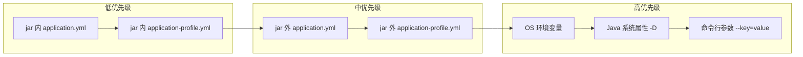
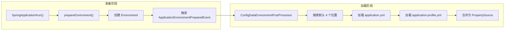
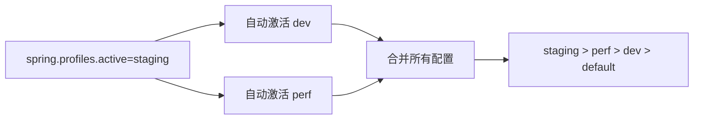
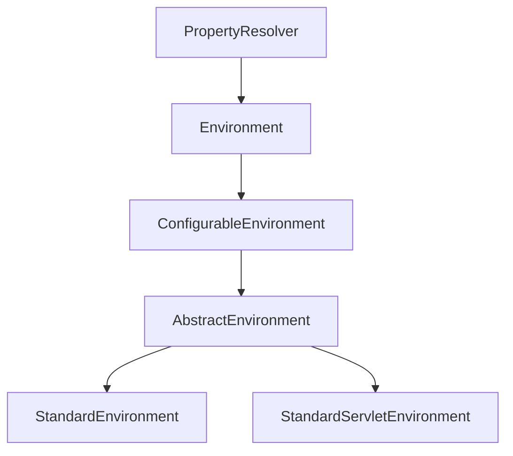
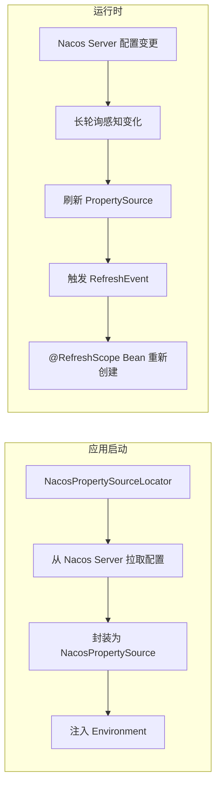

# Spring Boot 阶段三：配置加载与环境抽象

## 目录

1. [外部化配置概述](#一、外部化配置概述)
2. [配置优先级（面试必背）](#二、配置优先级面试必背)
3. [配置文件加载流程](#三、配置文件加载流程)
4. [类型安全配置 @ConfigurationProperties](#四、类型安全配置-configurationproperties)
5. [@Value vs @ConfigurationProperties 对比](#五、value-vs-configurationproperties-对比)
6. [Profile 多环境配置](#六、profile-多环境配置)
7. [Environment 与 PropertySource 简述](#七、environment-与-propertysource-简述)
8. [配置中心整合（Nacos）](#八、配置中心整合nacos)
9. [实践：多环境配置方案](#九、实践多环境配置方案)

---

## 一、外部化配置概述

> Spring Boot 允许将配置从代码中分离，通过配置文件、环境变量、命令行参数、配置中心等方式外部加载，实现**同一份代码、不同环境不同配置**。

```java
// 方式一：@Value 注入单个属性
@Value("${server.port}")
private int port;

// 方式二：@ConfigurationProperties 批量类型安全绑定（推荐）
@ConfigurationProperties(prefix = "server")
public class ServerConfig {
    private int port;
    // getter/setter ...
}
```

---

## 二、配置优先级（面试必背）

### 2.1 一句话记忆

```
命令行参数 > Java 系统属性 > OS 环境变量 > jar 外 Profile 配置 > jar 外默认配置 > jar 内 Profile 配置 > jar 内默认配置
```

核心规则：**外部覆盖内部，指定 Profile 覆盖默认，命令行参数最高**。

### 2.2 优先级流程图



> 同一位置同时存在 `.properties` 和 `.yml` 时，`.properties` 优先。建议整个项目只用一种格式。
>
> 配置文件默认搜索位置：`file:./config/` > `file:./` > `classpath:/config/` > `classpath:/`。生产环境通常通过配置中心接管，不依赖这些默认位置。

---

## 三、配置文件加载流程

### 3.1 核心流程



> 加载顺序：先加载 `application.yml`（从中读取 `spring.profiles.active`），再加载 `application-{profile}.yml`，Profile 配置覆盖默认配置的同名属性。

### 3.2 关键源码

配置文件加载由 `ConfigDataEnvironmentPostProcessor` 负责（Spring Boot 2.4+，替代旧版 `ConfigFileApplicationListener`）：

```java
// org.springframework.boot.context.config.ConfigDataEnvironmentPostProcessor
public class ConfigDataEnvironmentPostProcessor
        implements EnvironmentPostProcessor, Ordered {

    @Override
    public void postProcessEnvironment(ConfigurableEnvironment environment,
            SpringApplication application) {
        // 核心入口：响应 ApplicationEnvironmentPreparedEvent
        postProcessEnvironment(environment, application.getResourceLoader(),
                application.getBootstrapContext(),
                application.getAdditionalProfiles());
    }

    private void processAndApply() {
        ConfigDataEnvironment configDataEnvironment = new ConfigDataEnvironment(
                this.log, this.environment, this.resourceLoader,
                this.additionalProfiles, this.resolvers);
        configDataEnvironment.process();        // 解析并加载所有 ConfigData
        configDataEnvironment.applyToEnvironment(); // 合并到 Environment
    }
}
```

---

## 四、类型安全配置 @ConfigurationProperties

### 4.1 基本用法

```java
@ConfigurationProperties(prefix = "app.mail")
@Component
public class MailProperties {

    private String host;
    private int port = 587;
    private boolean sslEnabled = true;
    private Duration timeout = Duration.ofSeconds(30);
    private List<String> recipients = new ArrayList<>();
    private Map<String, String> headers = new HashMap<>();

    // getter/setter 必须有，Spring 通过 setter 绑定
}
```

```yaml
app:
  mail:
    host: smtp.example.com
    port: 465
    ssl-enabled: true
    timeout: 60s
    recipients:
      - admin@example.com
    headers:
      X-Custom-Header: value
```

### 4.2 松散绑定（Relaxed Binding）

> 这是 `@ConfigurationProperties` 的核心特性之一，面试高频考点。以下所有写法都能绑定到 `maxConnectionCount` 字段：

```yaml
app:
  service:
    max-connection-count: 50    # kebab-case（YAML 推荐）
    maxConnectionCount: 50      # camelCase
    max_connection_count: 50    # snake_case（.properties 常用）
```

```bash
# 环境变量必须全大写 + 下划线
export APP_SERVICE_MAXCONNECTIONCOUNT=50
```

```
绑定规则总结：
- kebab-case → camelCase    （max-connection-count → maxConnectionCount）
- snake_case → camelCase    （max_connection_count → maxConnectionCount）
- UPPER_CASE → camelCase    （MAXCONNECTIONCOUNT → maxConnectionCount）
- 环境变量最多用下划线替换一个分隔符，多余的保留

注意：@Value 不支持松散绑定，必须精确匹配！
```

### 4.3 两种绑定方式对比

**JavaBean 方式**（Setter 绑定）：

```java
@ConfigurationProperties("my.service")
@Component
public class MyProperties {
    private boolean enabled = false;
    private final Security security = new Security();  // 嵌套对象预初始化
    private List<String> roles = new ArrayList<>();    // 集合预初始化

    // 必须有无参构造器 + getter + setter
    public boolean isEnabled() { return enabled; }
    public void setEnabled(boolean enabled) { this.enabled = enabled; }
}
```

**构造器绑定方式**（Spring Boot 2.2+，推荐）：

```java
@ConfigurationProperties("my.service")
public class MyProperties {

    private final boolean enabled;
    private final Security security;
    private final List<String> roles;

    public MyProperties(
            @DefaultValue("false") boolean enabled,
            Security security,
            @DefaultValue("USER") List<String> roles) {
        this.enabled = enabled;
        this.security = security;
        this.roles = roles;
    }

    // 只有 getter，没有 setter → 不可变、线程安全
    public boolean enabled() { return this.enabled; }
    public Security security() { return this.security; }
    public List<String> roles() { return this.roles; }
}
```

```
关键区别：
- JavaBean 方式：可变对象，支持 @Component 注册
- 构造器绑定：不可变对象，默认值用 @DefaultValue，不能用 @Component 注册
  必须通过 @EnableConfigurationProperties 或 @ConfigurationPropertiesScan 注册
```

### 4.4 绑定时机（面试常问）


```
绑定发生在 BeanPostProcessor 的 postProcessBeforeInitialization 阶段：
1. Spring 创建 Bean 实例
2. 完成依赖注入
3. ConfigurationPropertiesBindingPostProcessor 介入
   → 调用 Binder 将 Environment 属性绑定到 Bean 字段
   → 如果标注了 @Validated，执行 JSR-303 校验
4. 校验失败则启动报错（快速失败）
5. 绑定完成后执行 @PostConstruct

核心类：
- ConfigurationPropertiesBindingPostProcessor：BeanPostProcessor 实现
- Binder：执行实际绑定，负责类型转换（String → Duration/InetAddress 等）和松散匹配
```

### 4.5 JSR-303 校验

```java
@ConfigurationProperties(prefix = "app.service")
@Validated
@Component
public class ServiceProperties {

    @NotBlank
    private String name;

    @Min(1)
    @Max(500)
    private int maxConnections = 10;

    @NotNull
    private Duration timeout;

    // getter/setter ...
}
```

> 需要引入 `spring-boot-starter-validation` 依赖。校验失败启动直接报错，避免运行时才发现配置问题。

### 4.6 三种注册方式

```java
// 方式一：@Component（仅 JavaBean 方式）
@Component
@ConfigurationProperties(prefix = "app.mail")
public class MailProperties { }

// 方式二：@EnableConfigurationProperties（精确控制，两种绑定方式都支持）
@Configuration
@EnableConfigurationProperties(MailProperties.class)
public class AppConfig { }

// 方式三：@ConfigurationPropertiesScan（批量扫描包下所有配置类，推荐）
@SpringBootApplication
@ConfigurationPropertiesScan("com.example.config")
public class MyApplication { }
```

### 4.7 配置元数据自动提示

> 引入 `spring-boot-configuration-processor` 后，编写 `application.yml` 时 IDE 会自动提示属性名和默认值。

```xml
<dependency>
    <groupId>org.springframework.boot</groupId>
    <artifactId>spring-boot-configuration-processor</artifactId>
    <optional>true</optional>
</dependency>
```

编译后自动生成 `target/classes/META-INF/spring-configuration-metadata.json`，IDE 读取后提供补全。

---

## 五、@Value vs @ConfigurationProperties 对比

| 特性 | `@Value` | `@ConfigurationProperties` |
| --- | --- | --- |
| 功能 | 注入单个属性 | 批量绑定前缀下所有属性 |
| 松散绑定 | 不支持（精确匹配） | 支持 |
| SpEL 表达式 | 支持 `${}` `#{}` | 不支持 |
| 校验 | 不支持 | 支持 JSR-303 |
| 复杂类型 | 不支持（List/Map 需 SpEL） | 原生支持 |
| 元数据提示 | 不支持 | 自动生成 |
| 推荐场景 | 少量简单属性、SpEL 表达式 | 业务配置类（推荐） |

```java
// @Value 适合的场景
@Value("${server.port}")                    // 简单属性
@Value("#{systemProperties['user.home']}")  // SpEL 表达式

// @ConfigurationProperties 适合的场景
// 一组相关配置 → 数据库配置、邮件配置、第三方 SDK 配置等
```

---

## 六、Profile 多环境配置

### 6.1 Profile 基本用法

> Profile 是 Spring 对不同环境配置进行隔离的机制。

```
src/main/resources/
  ├── application.yml           ← 公共配置 + 默认值
  ├── application-dev.yml       ← 开发环境
  ├── application-test.yml      ← 测试环境
  └── application-prod.yml      ← 生产环境
```

### 6.2 激活 Profile 的方式

| 方式 | 示例 | 场景 |
| --- | --- | --- |
| 命令行参数 | `--spring.profiles.active=prod` | 优先级最高 |
| 环境变量 | `SPRING_PROFILES_ACTIVE=prod` | 容器化部署 |
| 配置文件 | `spring.profiles.active: dev` | 本地开发 |
| 代码 | `springApplication.setAdditionalProfiles("prod")` | 编程式 |

### 6.3 @Profile 条件化 Bean 注册

> `@Profile` 控制的是 **Bean 是否注册**，不是配置文件是否加载。即使 Profile 没激活，对应配置文件的内容仍在 Environment 中。

```java
@Configuration
public class DataSourceConfig {

    @Bean
    @Profile("dev")
    public DataSource devDataSource() {
        return new EmbeddedDatabaseBuilder()
                .setType(EmbeddedDatabaseType.H2).build();
    }

    @Bean
    @Profile("!dev")   // 非 dev 环境生效
    @ConfigurationProperties(prefix = "spring.datasource")
    public DataSource prodDataSource() {
        return DataSourceBuilder.create().build();
    }
}

// 也可以放在类级别
@Configuration
@Profile("prod")
public class ProdSecurityConfig {
    // 整个配置类只在 prod 环境生效
}
```

### 6.4 Profile Group（Spring Boot 2.4+）

> 当多个环境共享部分配置时，用 Profile Group 组合。

```yaml
spring:
  profiles:
    group:
      staging: [dev, perf]    # 激活 staging 时，同时激活 dev 和 perf
```



---

## 七、Environment 与 PropertySource 简述

> Environment 是 Spring 的属性访问抽象，内部维护一个 **PropertySource 有序列表**。查找属性时从列表尾部（优先级最高）向头部遍历，找到即返回。



```
核心概念（了解即可）：
- PropertySource：单个属性来源（配置文件、环境变量、系统属性等都是独立的 PropertySource）
- PropertySource 按优先级排列在 Environment 中，后加入的覆盖先加入的同名属性
- ConfigDataEnvironmentPostProcessor 加载配置文件后，将它们封装为 PropertySource 加入 Environment

配置中心（如 Nacos）本质上也是向 Environment 中添加 PropertySource，
只是它支持动态刷新（长轮询 + 推送），不需要重启应用。
```

---

## 八、配置中心整合（Nacos）

### 8.1 Nacos Config 本质

> Nacos Config 的核心原理是：**向 Spring Environment 中注入一个动态 PropertySource**。



### 8.2 整合方式

```xml
<dependency>
    <groupId>com.alibaba.cloud</groupId>
    <artifactId>spring-cloud-starter-alibaba-nacos-config</artifactId>
</dependency>
```

```yaml
# bootstrap.yml（注意是 bootstrap，不是 application，因为要在启动早期加载）
spring:
  application:
    name: my-service
  cloud:
    nacos:
      config:
        server-addr: 127.0.0.1:8848
        namespace: dev    # 环境隔离
        group: DEFAULT_GROUP
        file-extension: yml
        shared-configs:   # 共享配置
          - data-id: common.yml
            group: SHARED_GROUP
            refresh: true
```

### 8.3 配置中心 vs 本地配置文件

```
                    Nacos Config          本地配置文件
加载时机            bootstrap 阶段        prepareEnvironment 阶段
动态刷新            支持（长轮询推送）     不支持（需重启）
多环境隔离          namespace / group     Profile
优先级              可配置，通常较高       默认位置决定
适用场景            微服务、云原生         单体应用、本地开发

面试回答要点：
Nacos Config 本质是 NacosPropertySourceLocator 在启动早期创建
NacosPropertySource 并注入 Environment，与本地配置文件的 PropertySource
并列存在。优先级由加入顺序决定，Nacos 的配置通常优先级更高。
运行时配置变更通过长轮询感知，触发 Environment 刷新，标注了
@RefreshScope 的 Bean 会重新创建。
```

---

## 九、实践：多环境配置方案

### 9.1 项目配置文件结构（本地开发 + Nacos）

```
src/main/resources/
  ├── bootstrap.yml              ← Nacos 连接配置（namespace 区分环境）
  ├── application.yml            ← 本地公共配置 + 默认值
  └── application-dev.yml        ← 本地开发覆盖（可选）
```

### 9.2 推荐的 Nacos 多环境方案

```
Nacos 中按 namespace 隔离环境：
- namespace: dev    → 开发环境配置
- namespace: test   → 测试环境配置
- namespace: prod   → 生产环境配置

每个 namespace 中：
- my-service.yml     ← 服务专属配置
- common.yml         ← 共享配置（数据库、Redis 等）
```

### 9.3 配置优先级实践

```yaml
# bootstrap.yml
spring:
  application:
    name: my-service
  cloud:
    nacos:
      config:
        server-addr: ${NACOS_ADDR:127.0.0.1:8848}
        namespace: ${NACOS_NAMESPACE:dev}
        file-extension: yml
        shared-configs:
          - data-id: common.yml
            refresh: true

# 本地 application.yml 保留兜底默认值，Nacos 中没有的配置走本地
spring:
  profiles:
    active: ${SPRING_PROFILES_ACTIVE:dev}
```

---

## 附录：核心源码路径速查

| 源码路径 | 作用 |
| --- | --- |
| `org.springframework.boot.context.config.ConfigDataEnvironmentPostProcessor` | 配置文件加载核心（2.4+） |
| `org.springframework.boot.context.properties.ConfigurationProperties` | 类型安全配置注解 |
| `org.springframework.boot.context.properties.ConfigurationPropertiesBindingPostProcessor` | 属性绑定后置处理器 |
| `org.springframework.boot.context.properties.bind.Binder` | 属性绑定器（类型转换 + 松散匹配） |
| `org.springframework.boot.context.properties.bind.DefaultValue` | 构造器绑定默认值注解 |
| `org.springframework.core.env.Environment` | 环境抽象顶层接口 |
| `org.springframework.core.env.PropertySource` | 属性源抽象 |
| `org.springframework.context.annotation.Profile` | Profile 条件注解 |
| `org.springframework.boot.SpringApplication#prepareEnvironment()` | 准备 Environment 入口 |
| `com.alibaba.cloud.nacos.NacosPropertySourceLocator` | Nacos 配置拉取入口 |
| `com.alibaba.cloud.nacos.refresh.NacosContextRefresher` | Nacos 配置动态刷新 |
