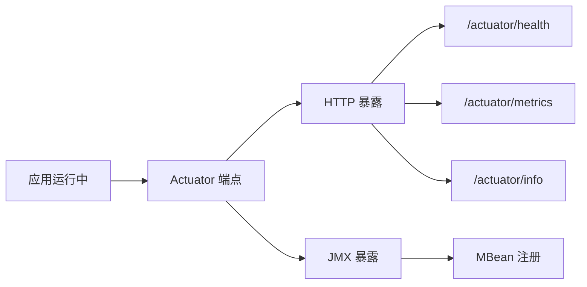
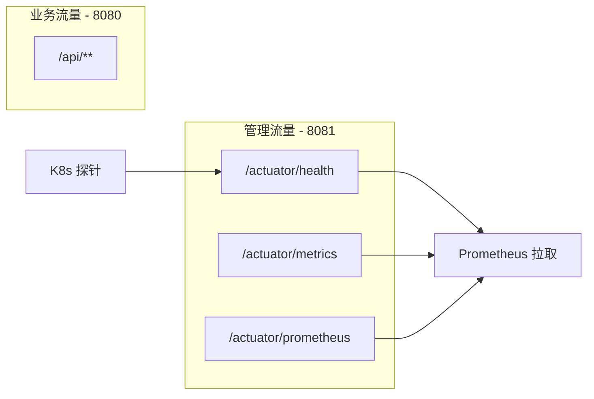
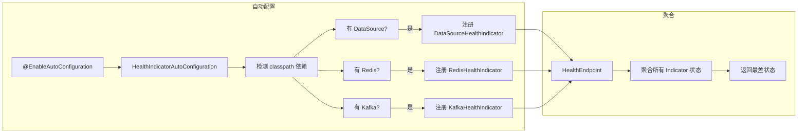
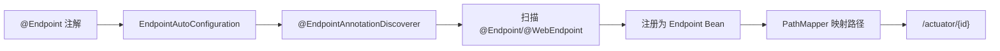
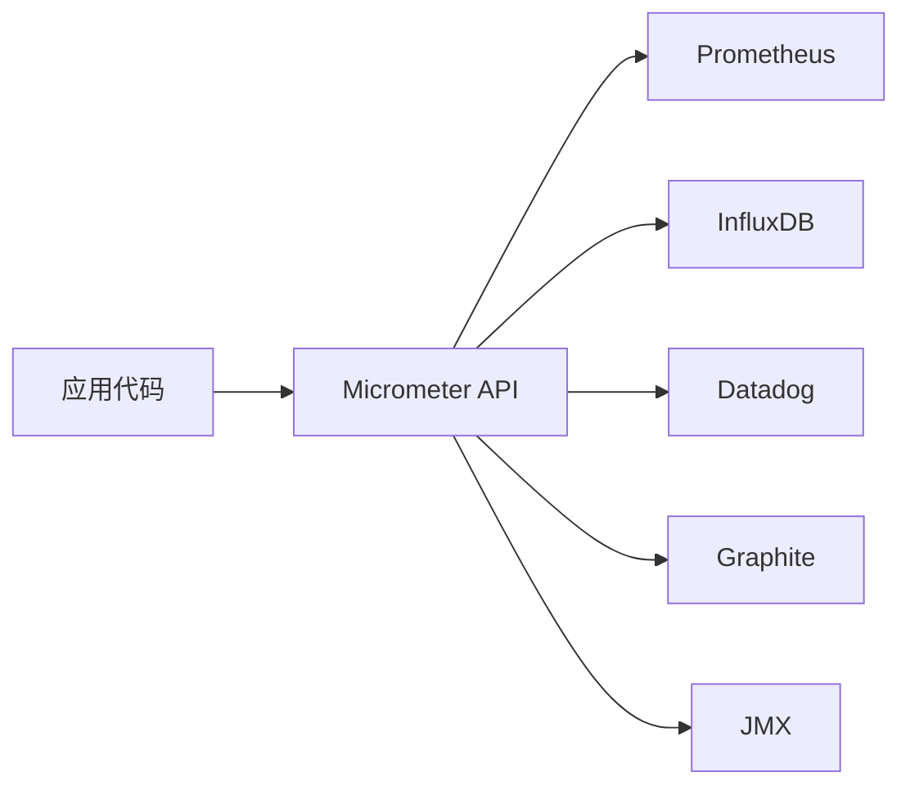
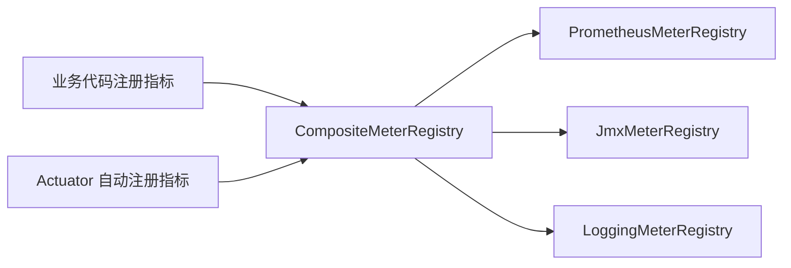
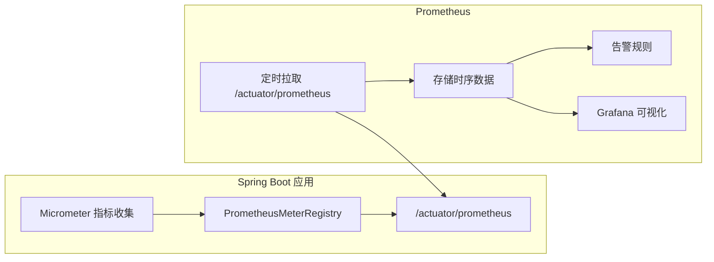

# Spring Boot 阶段四：Actuator 与监控

## 目录

1. [Actuator 概述](#一、actuator-概述)
2. [核心端点详解](#二、核心端点详解-⭐)
3. [端点暴露与安全控制](#三、端点暴露与安全控制)
4. [Health 端点深入](#四、health-端点深入-⭐)
5. [自定义 HealthIndicator](#五、自定义-healthindicator)
6. [自定义端点 @Endpoint](#六、自定义端点-endpoint)
7. [Micrometer 指标体系](#七、micrometer-指标体系)
8. [Prometheus 集成](#八、prometheus-集成-⭐)
9. [生产环境监控方案实践](#九、生产环境监控方案实践)

---

## 一、Actuator 概述

> Spring Boot Actuator 提供了一系列**生产级特性**，帮助你监控和管理应用。它通过 HTTP 端点或 JMX 暴露应用内部状态，是微服务运维的基础设施。

### 1.1 引入依赖

```xml
<dependency>
    <groupId>org.springframework.boot</groupId>
    <artifactId>spring-boot-starter-actuator</artifactId>
</dependency>
```

引入后，Spring Boot 通过自动配置注册所有内置端点，但默认只暴露 `health` 端点。

### 1.2 核心设计思路



```
核心概念：
- 端点（Endpoint）：一段暴露应用信息的逻辑单元，如 HealthEndpoint、MetricsEndpoint
- 暴露（Exposure）：端点可以通过 HTTP 或 JMX 暴露给外部访问
- 默认只暴露 health 端点（生产安全考虑）
- 所有端点自动配置，按需开启暴露即可
```

---

## 二、核心端点详解 ⭐

### 2.1 内置端点分类

| 分类 | 端点 ID | 说明 | 面试频率 |
| --- | --- | --- | --- |
| **运行状况** | `health` | 应用健康状态 | ⭐⭐⭐⭐⭐ |
| **指标** | `metrics` | 应用指标（JVM、HTTP、DB 等） | ⭐⭐⭐⭐⭐ |
| | `prometheus` | Prometheus 格式指标 | ⭐⭐⭐⭐ |
| **环境信息** | `env` | 环境属性 | ⭐⭐⭐ |
| | `configprops` | @ConfigurationProperties 属性 | ⭐⭐⭐ |
| | `info` | 应用信息（build.info） | ⭐⭐⭐ |
| **诊断** | `conditions` | 自动配置条件报告 | ⭐⭐⭐ |
| | `beans` | 所有 Bean 列表 | ⭐⭐ |
| | `mappings` | 请求映射列表 | ⭐⭐ |
| **运维操作** | `loggers` | 日志级别动态调整 | ⭐⭐⭐ |
| | `heapdump` | 堆内存 dump | ⭐⭐ |
| | `shutdown` | 优雅停机 | ⭐⭐⭐ |
| | `threaddump` | 线程 dump | ⭐⭐ |

### 2.2 常用端点示例

**健康检查**：

```bash
# 基本健康状态
curl http://localhost:8080/actuator/health

# 响应（默认只显示 UP/DOWN）
{"status": "UP"}

# 展示详情
curl http://localhost:8080/actuator/health
# 配置后展示详情：
{
  "status": "UP",
  "components": {
    "db": {"status": "UP"},
    "diskSpace": {"status": "UP", "details": {"free": 1073741824}},
    "redis": {"status": "UP"}
  }
}
```

**指标查询**：

```bash
# 列出所有可用指标名
curl http://localhost:8080/actuator/metrics

# 查看某个具体指标
curl http://localhost:8080/actuator/metrics/jvm.memory.used

# 带标签查询（如按堆内存区分）
curl http://localhost:8080/actuator/metrics/jvm.memory.used?tag=area:heap
```

**动态调整日志级别**（运维常用）：

```bash
# 查看所有 logger 级别
curl http://localhost:8080/actuator/loggers

# 动态修改某个包的日志级别（无需重启）
curl -X POST http://localhost:8080/actuator/loggers/com.example.service \
  -H "Content-Type: application/json" \
  -d '{"configuredLevel": "DEBUG"}'
```

---

## 三、端点暴露与安全控制

### 3.1 暴露配置

```yaml
management:
  endpoints:
    web:
      exposure:
        include: health,info,metrics,prometheus,loggers  # 指定暴露
        # include: "*"  # 暴露所有（仅开发环境！）
        # exclude: shutdown  # 排除特定端点
      base-path: /actuator  # 默认值，可自定义
  endpoint:
    health:
      show-details: when_authorized  # 仅认证用户看详情
      # show-details: always  # 所有人看详情（开发环境）
    shutdown:
      enabled: true  # 默认关闭，需要显式开启
  server:
    port: 8081  # 管理端口独立于业务端口（生产推荐）
```

### 3.2 生产环境安全配置



```java
// 管理端点的安全配置
@Configuration(proxyBeanMethods = false)
public class ActuatorSecurityConfig {

    @Bean
    public SecurityFilterChain actuatorSecurityFilterChain(HttpSecurity http)
            throws Exception {
        http.securityMatcher(EndpointRequest.toAnyEndpoint());
        http.authorizeHttpRequests(requests -> requests
            .requestMatchers(EndpointRequest.to("health", "info")).permitAll()
            .requestMatchers(EndpointRequest.toAnyEndpoint())
                .hasRole("ENDPOINT_ADMIN")
        );
        http.httpBasic(withDefaults());
        return http.build();
    }
}
```

> **生产建议**：管理端口与业务端口分离（`management.server.port`），内网访问 actuator 端点，health 端点供 K8s 探针使用，prometheus 供监控系统拉取。

---

## 四、Health 端点深入 ⭐

### 4.1 健康状态体系

```
Status 等级（从高到低）：
UP          → 正常
DOWN        → 异常
OUT_OF_SERVICE → 停服维护
UNKNOWN     → 未知

聚合规则：所有 HealthIndicator 的状态取最低值
- db=UP + redis=UP + diskSpace=UP → 总体 UP
- db=UP + redis=DOWN → 总体 DOWN（K8s 会摘除流量）
```

### 4.2 内置 HealthIndicator

| HealthIndicator | 检查内容 |
| --- | --- |
| `DataSourceHealthIndicator` | 数据库连接 |
| `RedisHealthIndicator` | Redis 连接 |
| `DiskSpaceHealthIndicator` | 磁盘空间（默认阈值 10MB） |
| `MongoHealthIndicator` | MongoDB 连接 |
| `RabbitHealthIndicator` | RabbitMQ 连接 |
| `KafkaHealthIndicator` | Kafka 连接 |
| `MailHealthIndicator` | 邮件服务 |

### 4.3 Health 端点自动配置流程



> 内置 HealthIndicator 由 `HealthIndicatorAutoConfiguration` 注册，遵循条件装配原则——classpath 中有对应依赖才注册对应 Indicator。

---

## 五、自定义 HealthIndicator

### 5.1 基本实现

```java
@Component
public class ExternalApiHealthIndicator implements HealthIndicator {

    private final RestTemplate restTemplate;

    @Value("${external.api.health-url:https://api.example.com/health}")
    private String healthEndpoint;

    @Override
    public Health health() {
        try {
            long startTime = System.currentTimeMillis();
            ResponseEntity<String> response = restTemplate
                .getForEntity(healthEndpoint, String.class);
            long responseTime = System.currentTimeMillis() - startTime;

            if (response.getStatusCode().is2xxSuccessful()) {
                return Health.up()
                    .withDetail("url", healthEndpoint)
                    .withDetail("responseTime", responseTime + "ms")
                    .build();
            }
            return Health.down()
                .withDetail("status", response.getStatusCode().value())
                .build();
        } catch (Exception ex) {
            return Health.down(ex).build();
        }
    }
}
```

### 5.2 自定义健康状态

```java
@Component
public class CustomHealthIndicator implements HealthIndicator {

    @Override
    public Health health() {
        int errorCode = checkService();
        if (errorCode == 0) {
            return Health.up().build();
        }
        // 可以自定义状态码（不超过已知等级）
        return Health.status("DEGRADED")
            .withDetail("errorCode", errorCode)
            .withDetail("message", "Service degraded but still accepting requests")
            .build();
    }
}
```

> **需要注意**：自定义状态 `DEGRADED` 默认映射为 DOWN，会导致 K8s 健康检查失败。需要在配置中映射状态等级：

```yaml
management:
  health:
    status:
      order: "DOWN,DEGRADED,OUT_OF_SERVICE,UP,UNKNOWN"
      # DEGRADED 排在 DOWN 之后、UP 之前，K8s 探针判断为 UP
```

---

## 六、自定义端点 @Endpoint

### 6.1 端点注解体系

```
@Endpoint        → 同时支持 HTTP + JMX（推荐）
@WebEndpoint     → 仅 HTTP
@JmxEndpoint     → 仅 JMX

操作注解：
@ReadOperation   → GET（读操作）
@WriteOperation  → POST（写操作）
@DeleteOperation → DELETE（删除操作）

参数注解：
@Selector        → 路径参数（/actuator/{endpointId}/{selector}）
```

### 6.2 完整自定义端点示例

```java
@Component
@Endpoint(id = "features")
public class FeaturesEndpoint {

    private final Map<String, Feature> features = new ConcurrentHashMap<>();

    public FeaturesEndpoint() {
        features.put("darkMode", new Feature("darkMode", true));
        features.put("betaFeatures", new Feature("betaFeatures", false));
    }

    @ReadOperation
    public Map<String, Feature> features() {
        return features;
    }

    @ReadOperation
    public Feature feature(@Selector String name) {
        return features.get(name);
    }

    @WriteOperation
    public Feature updateFeature(@Selector String name, @Selector boolean enabled) {
        Feature feature = features.get(name);
        if (feature != null) {
            feature.setEnabled(enabled);
        }
        return feature;
    }

    @DeleteOperation
    public void deleteFeature(@Selector String name) {
        features.remove(name);
    }

    @Data
    @AllArgsConstructor
    public static class Feature {
        private String name;
        private boolean enabled;
    }
}
```

```yaml
management:
  endpoints:
    web:
      exposure:
        include: health,info,features
  endpoint:
    features:
      enabled: true
```

```bash
# 使用
curl http://localhost:8080/actuator/features
curl http://localhost:8080/actuator/features/darkMode
# 参数选择 json 格式
curl -X POST "http://localhost:8080/actuator/features/darkMode" -d "enabled=false"
curl -X DELETE http://localhost:8080/actuator/features/betaFeatures
```

### 6.3 端点自动注册原理



```
关键源码路径：
- org.springframework.boot.actuate.endpoint.annotation.Endpoint
- org.springframework.boot.actuate.endpoint.annotation.EndpointAutoConfiguration
- org.springframework.boot.actuate.endpoint.invoke.OperationInvoker
```

---

## 七、Micrometer 指标体系

### 7.1 Micrometer 概述

> Micrometer 是一个**指标门面（Facade）**，提供统一的指标 API，底层可以对接 Prometheus、InfluxDB、Datadog 等不同监控系统。类似于 SLF4J 之于日志框架。



### 7.2 四种指标类型

| 类型 | 说明 | 示例 |
| --- | --- | --- |
| **Counter** | 只增不减的计数器 | HTTP 请求总数 |
| **Gauge** | 可增可减的瞬时值 | JVM 内存使用量、线程数 |
| **Timer** | 计时 + 分布统计 | 接口响应时间 |
| **DistributionSummary** | 分布统计（不限时间） | 请求体大小分布 |

```java
@Component
public class MyMetrics {

    private final Counter requestCounter;
    private final AtomicLong activeConnections;

    public MyMetrics(MeterRegistry registry) {
        // Counter：请求计数
        this.requestCounter = Counter.builder("my.service.requests")
            .description("Total service requests")
            .tag("version", "v1")
            .register(registry);

        // Gauge：瞬时值（通常引用外部状态）
        this.activeConnections = new AtomicLong(0);
        Gauge.builder("my.service.active.connections", activeConnections)
            .description("Current active connections")
            .register(registry);
    }

    public void handleRequest() {
        requestCounter.increment();
    }

    public void connect() {
        activeConnections.incrementAndGet();
    }

    public void disconnect() {
        activeConnections.decrementAndGet();
    }
}
```

### 7.3 Spring Boot 内置自动指标

引入 `spring-boot-starter-actuator` 后，Micrometer 自动注册以下指标：

```
JVM 指标：
- jvm.memory.used / jvm.memory.max       → 内存使用
- jvm.gc.pause                           → GC 停顿
- jvm.threads.live                       → 线程数

HTTP 指标：
- http.server.requests                   → 请求次数、响应时间、状态码
  标签：method, uri, status, exception

数据源指标（有 DataSource 时）：
- jdbc.connections.active / max
- hikaricp.connections.active / idle / pending

缓存指标（有 Redis 时）：
- cache.gets / cache.puts
```

### 7.4 MeterRegistry 层次



```
CompositeMeterRegistry 是一个组合注册表，将指标分发到多个后端。
Spring Boot 自动配置 CompositeMeterRegistry，根据 classpath 自动添加对应实现。
```

---

## 八、Prometheus 集成 ⭐

### 8.1 集成步骤

```xml
<!-- Prometheus 指标导出 -->
<dependency>
    <groupId>io.micrometer</groupId>
    <artifactId>micrometer-registry-prometheus</artifactId>
</dependency>
```

引入后自动注册 `PrometheusMeterRegistry`，并暴露 `/actuator/prometheus` 端点。

```yaml
management:
  endpoints:
    web:
      exposure:
        include: health,info,prometheus,metrics
  metrics:
    export:
      prometheus:
        enabled: true
    tags:
      application: ${spring.application.name}  # 全局标签
```

### 8.2 Prometheus 拉取模式



```bash
# Prometheus 通过 HTTP 拉取指标
curl http://localhost:8080/actuator/prometheus

# 输出示例：
# HELP jvm_memory_used_bytes The amount of used memory
# TYPE jvm_memory_used_bytes gauge
jvm_memory_used_bytes{area="heap",id="G1 Old Gen",} 12345678
jvm_memory_used_bytes{area="heap",id="G1 Eden",} 56789012

# HELP http_server_requests_seconds
# TYPE http_server_requests_seconds summary
http_server_requests_seconds_count{method="GET",status="200",uri="/api/users",} 1000.0
http_server_requests_seconds_sum{method="GET",status="200",uri="/api/users",} 5.234
```

---

## 九、生产环境监控方案实践

### 9.1 完整技术栈

```
┌─────────────────────────────────────────────────────┐
│                    Grafana                           │
│          (大盘可视化 + 告警通知)                       │
├─────────────────────────────────────────────────────┤
│                   Prometheus                        │
│          (指标采集 + 存储告警)                         │
├─────────────────────────────────────────────────────┤
│        Spring Boot Actuator                         │
│  /actuator/health  /actuator/metrics               │
│  /actuator/prometheus  /actuator/info              │
└─────────────────────────────────────────────────────┘
```

### 9.2 生产配置模板

```yaml
# application-prod.yml
management:
  server:
    port: 8081
    base-path: /actuator
  endpoints:
    web:
      exposure:
        include: health,prometheus,info,metrics
  endpoint:
    health:
      show-details: when_authorized
      probes:
        enabled: true  # 单独暴露 liveness/readiness 端点
    prometheus:
      enabled: true
  health:
    livenessstate:
      enabled: true    # /actuator/health/liveness
    readinessstate:
      enabled: true    # /actuator/health/readiness
    db:
      enabled: true
    redis:
      enabled: true
    diskspace:
      enabled: true
      threshold: 500MB  # 生产环境调大磁盘阈值
  metrics:
    export:
      prometheus:
        enabled: true
    tags:
      application: ${spring.application.name}
    distribution:
      percentiles-histogram:
        http.server.requests: true
      slo:
        http.server.requests: 50ms,100ms,200ms,500ms,1s
```

### 9.3 K8s 探针集成

```yaml
# Kubernetes Deployment 配置
spec:
  containers:
  - name: my-service
    livenessProbe:
      httpGet:
        path: /actuator/health/liveness
        port: 8081
      initialDelaySeconds: 30
      periodSeconds: 10
    readinessProbe:
      httpGet:
        path: /actuator/health/readiness
        port: 8081
      initialDelaySeconds: 20
      periodSeconds: 5
```

```
liveness  → 应用是否存活（挂了就重启容器）
readiness → 应用是否就绪（没就绪就从 Service 摘除，不接收流量）

两者分开配置是最佳实践：
- liveness 检查轻量（如内存是否正常）
- readiness 检查全面（如数据库连接、Redis 连接、外部依赖）
```

---

## 附录：核心源码路径速查

| 源码路径 | 作用 |
| --- | --- |
| `org.springframework.boot.actuate.endpoint.annotation.Endpoint` | 自定义端点注解 |
| `org.springframework.boot.actuate.endpoint.annotation.EndpointAutoConfiguration` | 端点自动配置 |
| `org.springframework.boot.actuate.health.HealthIndicator` | 健康检查接口 |
| `org.springframework.boot.actuate.health.HealthEndpoint` | 健康端点（聚合所有 Indicator） |
| `org.springframework.boot.actuate.health.Health` | 健康状态构建器 |
| `org.springframework.boot.actuate.autoconfigure.health.HealthIndicatorAutoConfiguration` | 内置健康检查自动配置 |
| `org.springframework.boot.actuate.metrics.MetricsEndpoint` | 指标端点 |
| `org.springframework.boot.actuate.metrics.export.prometheus.PrometheusScrapeEndpoint` | Prometheus 端点 |
| `io.micrometer.core.instrument.MeterRegistry` | Micrometer 指标注册表 |
| `io.micrometer.core.instrument.binder.jvm.JvmMemoryMetrics` | JVM 内存指标自动绑定 |
| `io.micrometer.observation.ObservationRegistry` | Observation 注册表（3.x） |
| `org.springframework.boot.actuate.autoconfigure.security.servlet.EndpointRequest` | 端点安全匹配器 |

---

## 附录：核心记忆点

```
1. Actuator 默认只暴露 health 端点 → 生产安全考虑
2. 管理端口与业务端口分离 → management.server.port
3. HealthIndicator 由条件装配注册 → 有依赖才有对应检查
4. 自定义端点用 @Endpoint + @ReadOperation/@WriteOperation
5. Micrometer 是指标门面 → 对接 Prometheus/InfluxDB/Datadog
6. Prometheus 使用拉取模式 → /actuator/prometheus
7. K8s 探针使用 liveness/readiness 分离 → 挂了重启 vs 没好不接流量
8. 高基数标签（如 orderId）不能进指标 → 会导致 Prometheus 指标爆炸
```
