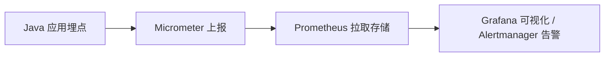

# Metrics 核心概念

## Metrics

- 定义：系统运行时的**可量化数据点**，如 CPU 使用率、请求延迟、错误次数等
- 作用：**量化系统状态**，为性能分析和故障排查提供依据，重启会丢失
- 分类
    - `Gauge（仪表盘）`：捕捉瞬时值（如实时在线人数、JVM 内存使用率）。
    - `Counter（计数器）`：统计累计增量（如接口总请求量、错误请求数）。
    - `Timer（计时器）`：记录事件耗时分布（如接口响应时间、数据库查询耗时）。

## Gauge

Gauge 是一种特殊的指标，他一般用于瞬时值。

### 核心设计

- 动态采集

    如果一次注册只能采集一次瞬时值，就无法“持续地”获取每一个时刻的瞬时值，这样很不灵活。所以 Gauge 采取了一个很巧妙的设计，除了传入一个对象，**还需要传入一个函数式接口，这样每次获取都能动态调用这个接口的实现方法拿到最新值，而不是使用某个固定时刻的快照**。

    ```java
    /**
    * A gauge tracks a value that may go up or down. The value that is published for gauges
    * is an instantaneous sample of the gauge at publishing time.
    *
    * @author Jon Schneider
    */
    public interface Gauge extends Meter {

        /**
        * @param name The gauge's name.
        * @param obj An object with some state or function which the gauge's instantaneous
        * value is determined from.
        * @param f A function that yields a double value for the gauge, based on the state of
        * {@code obj}.
        * @param <T> The type of object to gauge.
        * @return A new gauge builder.
        */
        static <T> Builder<T> builder(String name, @Nullable T obj, ToDoubleFunction<T> f) {
            return new Builder<>(name, obj, f);
        }

    ```

- 弱引用

    另外看到 Gauge 的实现类，可以看到传入的对象是一个**弱引用**。弱引用的作用是

    - 避免对象无法被回收。如果一个对象已经没有任何业务作用了，它应该要进入一个可回收的状态（比如指定为null）。如果此时它仍被 Micrometer 强引用，那么它将永远无法被回收。如果 Micrometer 对它是弱引用，它只被弱引用持有，在下一次 GC 就会被回收
    - Micrometer 自动停止该 Gauge 指标的采集。也是基于弱引用可以被 GC 的特性，既然这个对象都已经被 GC 了，那么这个瞬时值指标自然也就不需要再收集。实现了指标的自动生命周期管理

    ```java
    public class DefaultGauge<T> extends AbstractMeter implements Gauge {

        private static final WarnThenDebugLogger logger = new WarnThenDebugLogger(DefaultGauge.class);

        private final WeakReference<T> ref;

        private final ToDoubleFunction<T> value;

        public DefaultGauge(Meter.Id id, @Nullable T obj, ToDoubleFunction<T> value) {
            super(id);
            this.ref = new WeakReference<>(obj);
            this.value = value;
        }

        @Override
        public double value() {
            T obj = ref.get();
            if (obj != null) {
                try {
                    return value.applyAsDouble(obj);
                }
                catch (Throwable ex) {
                    logger.log(() -> "Failed to apply the value function for the gauge '" + getId().getName() + "'.", ex);
                }
            }
            return Double.NaN;
        }

    }
    ```

## Micrometer

- 定义：Java 应用的监控指标收集库，**提供标准化 API 统一对接多种监控系统**
- 作用
    - 封装底层监控逻辑，简化指标采集
    - 提供标准化 API ，可以对接 Prometheus、Graphite 等监控平台
- 示例：使用 Micrometer 的 API 定义一个 Gauge 类型的 Metrics
    
    ```java
    // 使用 Micrometer 定义一个 Gauge
    Gauge.builder("memory.usage", Runtime.getRuntime(), Runtime::totalMemory)
         .register(meterRegistry);
    ```
    

## Prometheus

- 定义：一套开源的监控平台，专注于时序数据采集、存储和查询
- 作用
    - 主动拉取应用的指标数据
    - 基于 PromQL 定义异常条件并触发通知

## 协作流程



- `指标生成`：ava 应用通过 Micrometer API 埋点（如 Gauge.builder()记录 JVM 内存、Counter.increment()统计订单数），将业务/系统状态转化为 Metrics 对象
- `指标暴露`：Micrometer 将所有注册的 Metrics 封装为 Prometheus 格式的文本数据（如 # TYPE jvm_memory_used gauge\njvm_memory_used 12345678），并通过 HTTP 端点（如 Spring Boot Actuator 的 `/actuator/prometheus`）对外暴露
- `指标采集`：Prometheus 定时（如每 15 秒）向应用的 Metrics 端点发起 HTTP 请求，拉取最新指标并存储到时序数据库
- `指标展示`：Grafana 通过 Prometheus 数据源配置，编写 PromQL 查询语句，生成实时监控大盘（如 CPU 使用率趋势图、接口响应时间分布）
- `指标告警`：Alertmanager 基于 Prometheus 的告警规则（如“内存使用率 > 80% 持续 1 分钟”），触发邮件/短信/钉钉通知

