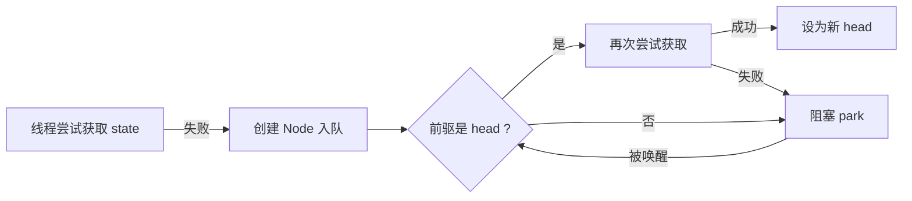

# AQS 学习


## 为什么需要 AQS

经过 synchronized 的学习，我们知道 synchronized 可以很方便地给一段共享资源的操作加上锁，对操作进行同步控制；

但是 synchronized 也有一定的弊端：

- **不支持中断** (线程无法响应 interrupt)
- **不支持超时** (无法进行 `tryLock(timeout)`)
- **不支持公平锁** (无法保证 FIFO 获取)

AQS 全称 AbstractQueueSynchronizer (抽象队列同步器)，它正是用来解决以上弊端的，同时它作为 J.U.C 包的基础，提供了：

- 标准化的同步框架：统一封装了线程排队、阻塞、唤醒等通用逻辑
- 灵活的扩展能力：使用模板方法设计模式，定制自定义同步语意
- 高性能无锁设计：CAS 原子操作 + volatile 保证数据修改是线程安全的


## AQS 核心组件

> AQS 的设计精髓：一个状态(state) + 一个等待队列(CLH) + 一套原子操作(CAS)


### `state` 同步状态机

`state` 可以理解为锁的计数器，或者资源剩余量，用具体例子来说明：

- `ReentrantLock`: `state = 0` 表示无锁，`state > 0` 表示被持有以及锁重入的次数
- `CountDownLatch`: `state = 3` 表示还需要进行 3 次 `countDown()`

关键设计：`state` 被 `volatile` 修饰，保证了多个线程之间的可见性


### CLH FIFO阻塞队列

CLH 队列是一个双向链表实现的阻塞队列，**AQS 通过 prev 和 next 两个指针来维护链表**

CLH 队列工作流程：



高效关键：

- 当线程获取 `state` 失败时，会被封装成一个 `Node` ，**通过 CAS 的方式加入 CLH 队列尾部**，避免使用 `synchronized` 而带来的开销
- 每个线程只需要关注前驱线程，比如线程 B 阻塞时，**只等待前驱节点线程 A 唤醒** (`LockSupport.unpark`)；避免了全局通知的开销，同时天然保证 FIFO 特性


### CAS 原子操作基石

AQS 中对于 `state` 状态机的修改和线程加入 CLH 队列的操作都是使用 CAS 的方式，既安全又比 `synchronized` 高效


## AQS 独占模式与共享模式

| 对比维度  |                  独占模式 (Exclusive)                  |                         共享模式 (Shared)                          |
|:-----:|:--------------------------------------------------:|:--------------------------------------------------------------:|
|  语义   |                    一次仅允许一个线程通过                     |                      在资源足够的情况下，允许多个线程同时通过                      |
| 核心方法  |             `tryAcquire() -> boolean`              |                  `tryAcquireShared() -> int`                   |
| 返回值含义 |                    `true` 表示成功                     |               `>=0` 表示成功，值表示剩余资源 <br> `<0` 表示失败                |
| 唤醒行为  |                       唤醒一个后继                       |                        传播式唤醒 (多个线程同时通过)                        |
| 代表工具  | `ReentrantLock`、`ReentrantReadWriteLock.WriteLock` | `CountDownLatch`、`ReentrantReadWriteLock.ReadLock`、`Semaphore` |

## 公平锁与非公平锁

先简单讲讲公平锁和非公平锁的意思：

- 公平锁：每个线程按照访问锁的先后顺序来获取锁，遵顼先访问先获取的规则
- 非公平锁：每个线程都会竞争锁的获取，获取顺序是随机的，不遵循先来先得的规则

ReentrantLock 中对公平锁和非公平锁都进行了实现，主要的区别在于 `tryAcquire()` 方法中，其中 `FairSync` 的实现中，在 CAS 修改 `state` 之前还先检查了一下排队线程，前面没有其他线程等待锁了，才进行 CAS 修改 `state` 来获取锁；在 `NonfairSync` 的实现中，则所有线程不管队列，直接一起抢占

```java
static final class FairSync extends Sync {
    protected final boolean tryAcquire(int acquires) {
        // hasQueuedPredecessors: 如果当前线程前面有已排队的线程，则返回 true；如果当前线程位于队列头部或队列为空，则返回 false。
        if (getState() == 0 && !hasQueuedPredecessors() && compareAndSetState(0, acquires)) {
            setExclusiveOwnerThread(Thread.currentThread());
            return true;
        }
        return false;
    }
}

static final class NonfairSync extends Sync {
    protected final boolean tryAcquire(int acquires) {
        if (getState() == 0 && compareAndSetState(0, acquires)) {
            setExclusiveOwnerThread(Thread.currentThread());
            return true;
        }
        return false;
    }
}
```


## AQS 简易实现

### 不可重入锁

接下来使用 AQS 来实现 synchronized 功能

```java
public class AQSDemo {
    public static void main(String[] args) throws InterruptedException {
        SimpleMutex simpleMutex = new SimpleMutex();

        Thread t1 = new Thread(() -> {
            // 线程1：获取锁并持有3秒
            System.out.println(Thread.currentThread().getName() + " 尝试获取锁");
            simpleMutex.lock();
            System.out.println(Thread.currentThread().getName() + " 获取锁成功");
            try {
                TimeUnit.SECONDS.sleep(3);
            } catch (InterruptedException e) {
                Thread.currentThread().interrupt();
            } finally {
                System.out.println(Thread.currentThread().getName() + " 释放锁");
                simpleMutex.unlock();
            }
        }, "Thread-1");

        Thread t2 = new Thread(() -> {
            try {
                // 确保线程1拿到锁
                TimeUnit.MILLISECONDS.sleep(100);
            } catch (InterruptedException e) {
                Thread.currentThread().interrupt();
            }
            // 线程2：获取锁时会进入阻塞状态，直到线程1释放锁
            System.out.println(Thread.currentThread().getName() + " 尝试获取锁");
            simpleMutex.lock();
            System.out.println(Thread.currentThread().getName() + " 获取锁成功");
            try {
                TimeUnit.SECONDS.sleep(3);
            } catch (InterruptedException e) {
                Thread.currentThread().interrupt();
            } finally {
                simpleMutex.unlock();
                System.out.println(Thread.currentThread().getName() + " 释放锁");
            }
        }, "Thread-2");

        t1.start();
        t2.start();

        t1.join();
        t2.join();

        System.out.println("主线程结束，锁状态：" + (simpleMutex.isLocked() ? "已锁" : "未锁"));
    }
}

/**
 * 一个基于 AQS 的简单互斥锁（不可重入）
 */
class SimpleMutex {
    // 实现互斥锁的核心组件，通过 AQS 来构建同步工具
    private static class Sync extends AbstractQueuedSynchronizer {
        @Override
        protected boolean tryAcquire(int arg) {
            // 通过 CAS 的方式修改 state 值
            // 原子地获取锁
            if (compareAndSetState(0, 1)) {
                // 记录当前拥有独立访问权限的线程
                // 可重入的基础
                setExclusiveOwnerThread(Thread.currentThread());
                return true;
            }
            return false;
        }

        @Override
        protected boolean tryRelease(int arg) {
            if (getState() == 0) {
                // 如果 state 已经是 0，说明没有成功获取锁，或者已经被释放了，抛出异常
                throw new IllegalMonitorStateException();
            }
            // 清除拥有独立访问权限线程的标识
            setExclusiveOwnerThread(null);
            // state = 0 说明释放锁
            setState(0);
            return true;
        }

        @Override
        protected boolean isHeldExclusively() {
            // 通过 state 是否等于 1 来判断锁是否被持有
            return getState() == 1;
        }
    }

    private final Sync sync = new Sync();

    public void lock() {
        sync.acquire(1);
    }

    public void unlock() {
        sync.release(1);
    }

    public boolean isLocked() {
        return sync.isHeldExclusively();
    }
}
```

结果是：线程 2 也尝试获取锁，但是阻塞等待着线程 1 的释放

```
Thread-1 尝试获取锁
Thread-1 获取锁成功
Thread-2 尝试获取锁
Thread-1 释放锁
Thread-2 获取锁成功
Thread-2 释放锁
主线程结束，锁状态：未锁
```

### 可重入锁

在简易实现的基础上添加重入的支持，核心要点就是检查 `state` 的数量和 `exclusiveOwnerThread` 的指向

```java
public class AQSDemo {
    public static void main(String[] args) throws InterruptedException {
        ReentrantMutex reentrantMutex = new ReentrantMutex();

        Thread t = new Thread(() -> {
            System.out.println("线程开始");

            reentrantMutex.lock();
            System.out.println("第1次 lock，holdCount = " + reentrantMutex.getHoldCount());

            reentrantMutex.lock();
            System.out.println("第2次 lock，holdCount = " + reentrantMutex.getHoldCount());

            reentrantMutex.lock();
            System.out.println("第3次 lock，holdCount = " + reentrantMutex.getHoldCount());

            // 释放三次
            reentrantMutex.unlock();
            System.out.println("第1次 unlock，holdCount = " + reentrantMutex.getHoldCount());

            reentrantMutex.unlock();
            System.out.println("第2次 unlock，holdCount = " + reentrantMutex.getHoldCount());

            reentrantMutex.unlock();
            System.out.println("第3次 unlock，holdCount = " + reentrantMutex.getHoldCount());

            System.out.println("线程结束，锁是否释放: " + !reentrantMutex.isLocked());
        });

        t.start();
        try {
            t.join();
        } catch (InterruptedException e) {
            Thread.currentThread().interrupt();
        }
    }
}

class ReentrantMutex {
    private static class Sync extends AbstractQueuedSynchronizer {
        @Override
        protected boolean tryAcquire(int acquires) {
            Thread current = Thread.currentThread();
            int state = getState();

            if (state == 0) {
                // 无锁，尝试获取
                if (compareAndSetState(0, acquires)) {
                    setExclusiveOwnerThread(current);
                    return true;
                }
            } else if (current == getExclusiveOwnerThread()) {
                // 可重入：同一线程再次获取
                int next = state + acquires;
                if (next < 0) { // 溢出检查
                    throw new Error("Maximum lock count exceeded");
                }
                setState(next);
                return true;
            }
            return false;
        }

        @Override
        protected boolean tryRelease(int releases) {
            int state = getState() - releases;
            if (Thread.currentThread() != getExclusiveOwnerThread()) {
                // 非持有者释放锁，抛出异常
                throw new IllegalMonitorStateException();
            }

            boolean free = false;

            if (state == 0) {
                // 重入次数归零，真正释放
                free = true;
                setExclusiveOwnerThread(null);
            }
            // 未归零，继续更新 state
            setState(state);
            // 注意：AQS release() 会检查 tryRelease() 返回值是否为 true
            return free;
        }

        @Override
        protected boolean isHeldExclusively() {
            return getExclusiveOwnerThread() == Thread.currentThread();
        }

        public int getHoldCount() {
            // 如果被持有着，返回重入次数
            // 如果没有被持有，直接返回0
            return isHeldExclusively() ? getState() : 0;
        }
    }

    private final Sync sync = new Sync();

    public void lock() {
        sync.acquire(1);
    }

    public void unlock() {
        sync.release(1);
    }

    public boolean isLocked() {
        return sync.isHeldExclusively();
    }

    public int getHoldCount() {
        return sync.getHoldCount();
    }
}
```

结果是：

```
线程开始
第1次 lock，holdCount = 1
第2次 lock，holdCount = 2
第3次 lock，holdCount = 3
第1次 unlock，holdCount = 2
第2次 unlock，holdCount = 1
第3次 unlock，holdCount = 0
线程结束，锁是否释放: true
```


## 总结

AQS 的设计哲学

- **分离关注点，高效扩展**：AQS 中已经定义好通用的逻辑 (获取锁、阻塞排队、释放锁、唤醒)，比如 `acquire()` 和 `release()` 方法；子类只需要实现 “如何通过” (怎么样才算是获取/释放锁成功/失败)，比如 `tryAcquire()` 和 `tryRelease()` 方法，体现了模板方法的设计模式
- **线程安全，操作高效**：对于 `state` 状态机以及队列操作，都使用 `volatile` 修饰且使用 CAS 操作，避免直接使用 synchronized，既保证安全又保证了性能；CLH 队列的唤醒，只需要唤醒后一个线程，避免全局唤醒的开销


## 高频面试题

### AQS 如何保证内存可见性

`state` 状态机和 `Node` 队列节点的前后指针，都使用 `volatile` 来修饰，在使用上天然满足 happens-before 规则，确保多个线程间能看到最新的修改

### CLH 高效的原因

- 加入队列和退出队列的过程中，都使用 CAS 操作，**避免直接加锁的开销**
- 每一个队列节点，都只需要监听前驱节点的状态，**避免全局通知的开销**

### AQS 和 synchronized 的主要区别

- synchronized 底层依赖 JVM 的 Monitor (C++实现)，加锁释放锁都由 JVM 自动完成，自动管理，但缺少一定的灵活性
- AQS 由 Java 实现，灵活扩展，支持中断/超时/公平锁

