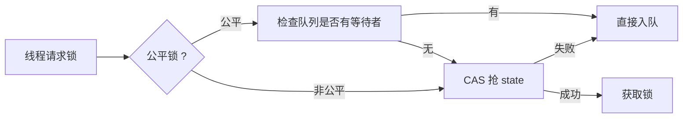

# ReentrantLock 学习

> ReentrantLock 是 JUC 中非常常用的一个工具，单独展开学习，它使用了 AQS 的共享模式，提供了公平锁和非公平锁两种实现

## 公平锁与非公平锁的差异

**核心差异：获取锁时是否检查等待队列**



### 非公平锁 (默认选项)

当我们使用 `Lock lock = new ReentrantLock()` 创建锁时，默认使用的是非公平锁，非公平锁在获取锁时会**直接尝试 CAS 抢锁**，如果 CAS 失败才入队

非公平锁的实现：

- 检查 `state` 是否为 0，如果为 0，表示当前锁没有被抢占
- 尝试使用 CAS 方式抢占锁

```java
protected final boolean tryAcquire(int acquires) {
    if (getState() == 0 && compareAndSetState(0, acquires)) {
        setExclusiveOwnerThread(Thread.currentThread());
        return true;
    }
    return false;
}
```

### 公平锁

公平锁简单理解为：当有一系列线程想要获取锁时，**严格按照先排队先获取的顺序来获取锁**

如果要创建公平锁，需要在构造方法中指定：`Lock lock = new ReentrantLock(true)`，公平锁在获取锁之前会先检查 CLH 队列中是否有等待的线程，有的话会进行排队

公平锁的实现：

- 检查 `state` 是否为 0，如果为 0，表示当前锁没有被抢占
- 调用 `hasQueuedPredecessors()` 方法检查 CLH 队列中是否有等待的线程
- 尝试使用 CAS 方式抢占锁

```java
protected final boolean tryAcquire(int acquires) {
    if (getState() == 0 && !hasQueuedPredecessors() &&
        compareAndSetState(0, acquires)) {
        setExclusiveOwnerThread(Thread.currentThread());
        return true;
    }
    return false;
}
```

公平锁的好处：**避免线程饥饿**（线程长期无法获取到锁）

**在高竞争场景下，公平锁的性能可能会更好，因为**减少了 CAS 重试开销**从而抵消 CLH 队列的等待时间**


## 线程通信模型

### synchronized + wait/notify 的线程通信模型

在学习 synchronized 时，了解到搭配 `wait()` 和 `notifyAll()` 方法可以实现一个简易的线程通信模型：

```java
public class PCModelDemo {
    public static void main(String[] args) throws InterruptedException {
         WaitNotifyModel model = new WaitNotifyModel();

        // 2个生产者，3个消费者
        Thread p1 = new Thread(() -> {
            for (int i = 1; i <= 5; i++) {
                try {
                    model.produce(i);
                    Thread.sleep(100); // 模拟处理时间
                } catch (InterruptedException e) {
                    Thread.currentThread().interrupt();
                }
            }
        }, "Producer-1");

        Thread p2 = new Thread(() -> {
            for (int i = 6; i <= 10; i++) {
                try {
                    model.produce(i);
                    Thread.sleep(150);
                } catch (InterruptedException e) {
                    Thread.currentThread().interrupt();
                }
            }
        }, "Producer-2");

        Thread c1 = new Thread(() -> {
            for (int i = 0; i < 4; i++) {
                try {
                    model.consume();
                    Thread.sleep(200);
                } catch (InterruptedException e) {
                    Thread.currentThread().interrupt();
                }
            }
        }, "Consumer-1");

        Thread c2 = new Thread(() -> {
            for (int i = 0; i < 3; i++) {
                try {
                    model.consume();
                    Thread.sleep(250);
                } catch (InterruptedException e) {
                    Thread.currentThread().interrupt();
                }
            }
        }, "Consumer-2");

        Thread c3 = new Thread(() -> {
            for (int i = 0; i < 3; i++) {
                try {
                    model.consume();
                    Thread.sleep(300);
                } catch (InterruptedException e) {
                    Thread.currentThread().interrupt();
                }
            }
        }, "Consumer-3");

        System.out.println("===== 启动 synchronized + wait/notify 测试 =====");
        c1.start(); c2.start(); c3.start();
        p1.start(); p2.start();

        // 等待所有线程完成
        p1.join(); p2.join();
        c1.join(); c2.join(); c3.join();
        System.out.println("===== synchronized 测试完成 =====\n");
    }
}

class WaitNotifyModel {
    private final Queue<Integer> queue = new LinkedList<>();
    private final int capacity = 5;

    public synchronized void produce(int item) throws InterruptedException {
        while (queue.size() == capacity) {
            System.out.println(Thread.currentThread().getName() + " [producer] 队列已满，不能继续添加元素，生产者释放锁");
            wait(); // 1. 释放锁 2. 进入锁对象 Monitor 的 waitSet
        }
        queue.add(item);
        System.out.println(Thread.currentThread().getName() + " [producer] 队列添加元素 " + item + ", 元素数量=" + queue.size() + ", 唤醒消费者");
        notifyAll(); // 唤醒获取锁的线程（包括所有消费者和同样等待锁的生产者！）
    }

    public synchronized int consume() throws InterruptedException {
        while (queue.isEmpty()) {
            System.out.println(Thread.currentThread().getName() + " [consumer] 队列是空的，等待生产者添加元素，消费者释放锁");
            wait(); // 1. 释放锁 2. 进入锁对象 Monitor 的 waitSet
        }
        int item = queue.poll();
        System.out.println(Thread.currentThread().getName() + " [consumer] 从队列中取出元素 " + item + ", 元素数量=" + queue.size() + ", 唤醒生产者");
        notifyAll(); // 唤醒获取锁的线程（包括所有生产者和同样等待锁的消费者！）
        return item;
    }
}
```

虽然也算是能实现一个消费者生产者模型，但是存在问题：`notifyAll()` 会唤醒所有线程

**因为所有生产者和所有消费者他们调用 `wait()` 方法后，都进入锁对象 Monitor 的同一个 waitSet；当 waitSet 中的线程收到 `notifyAll()` 唤醒时，所有线程都会开始竞争锁（包括所有生产者和所有消费者），这样会造成不必要的竞争**

### ReentrantLock + Condition 的线程通信模型

在 `ReentrantLock` 中，同样可以实现线程通信模型，是借助 `Condition` 工具实现，并且可以实现更精准的唤醒 (避免 `notifyAll()` 唤醒无关线程)

```java
public class PCModelDemo {
    public static void main(String[] args) throws InterruptedException {
        ConditionLockModel model = new ConditionLockModel();

        // 2个生产者，3个消费者
        Thread p1 = new Thread(() -> {
            for (int i = 1; i <= 5; i++) {
                try {
                    model.produce(i);
                    Thread.sleep(100); // 模拟处理时间
                } catch (InterruptedException e) {
                    Thread.currentThread().interrupt();
                }
            }
        }, "Producer-1");

        Thread p2 = new Thread(() -> {
            for (int i = 6; i <= 10; i++) {
                try {
                    model.produce(i);
                    Thread.sleep(150);
                } catch (InterruptedException e) {
                    Thread.currentThread().interrupt();
                }
            }
        }, "Producer-2");

        Thread c1 = new Thread(() -> {
            for (int i = 0; i < 4; i++) {
                try {
                    model.consume();
                    Thread.sleep(200);
                } catch (InterruptedException e) {
                    Thread.currentThread().interrupt();
                }
            }
        }, "Consumer-1");

        Thread c2 = new Thread(() -> {
            for (int i = 0; i < 3; i++) {
                try {
                    model.consume();
                    Thread.sleep(250);
                } catch (InterruptedException e) {
                    Thread.currentThread().interrupt();
                }
            }
        }, "Consumer-2");

        Thread c3 = new Thread(() -> {
            for (int i = 0; i < 3; i++) {
                try {
                    model.consume();
                    Thread.sleep(300);
                } catch (InterruptedException e) {
                    Thread.currentThread().interrupt();
                }
            }
        }, "Consumer-3");

        System.out.println("===== 启动 Lock + Condition 测试 =====");
        c1.start(); c2.start(); c3.start();
        p1.start(); p2.start();

        // 等待所有线程完成
        p1.join(); p2.join();
        c1.join(); c2.join(); c3.join();
        System.out.println("===== Lock 测试完成 =====\n");
    }
}

class ConditionLockModel {
    private final Queue<Integer> queue = new LinkedList<>();
    private final int capacity = 5;

    private final Lock lock = new ReentrantLock();
    // 两个独立条件队列
    private final Condition notFull = lock.newCondition();  // 队列不满
    private final Condition notEmpty = lock.newCondition(); // 队列非空

    public void produce(int item) throws InterruptedException {
        lock.lock();
        try {
            while (queue.size() == capacity) {
                System.out.println(Thread.currentThread().getName() + " [producer] 队列已满，不能继续添加元素，生产者释放锁");
                notFull.await(); // 1. 释放锁 2. 进入 notFull 条件队列
            }
            queue.add(item);
            System.out.println(Thread.currentThread().getName() + " [producer] 队列添加元素 " + item + ", 元素数量=" + queue.size() + ", 唤醒消费者");
            notEmpty.signal(); // 仅唤醒 notEmpty 队列（所有消费者）
        } finally {
            lock.unlock();
        }
    }

    public int consume() throws InterruptedException {
        lock.lock();
        try {
            while (queue.isEmpty()) {
                System.out.println(Thread.currentThread().getName() + " [consumer] 队列是空的，等待生产者添加元素，消费者释放锁");
                notEmpty.await(); // 1. 释放锁 2. 进入 notEmpty 条件队列
            }
            int item = queue.poll();
            System.out.println(Thread.currentThread().getName() + " [consumer] 从队列中取出元素 " + item + ", 元素数量=" + queue.size() + ", 唤醒生产者");
            notFull.signal(); // 仅唤醒 notFull 队列（所有生产者）
            return item;
        } finally {
            lock.unlock();
        }
    }
}
```

通过定义两个不同的 `Condition`：`notFull` & `notEmpty`，这样可以做到精准唤醒生产者和消费者

**`Condition` 的出现，让线程通信模型从 “广播通知” 升级到 “精准通知”**


## ReentrantLock 和 synchronized 对比

| 对比维度 | ReentrantLock             | synchronized                 |
|------|---------------------------|------------------------------|
| 超时控制 | `tryLock()`               | 不支持                          |
| 中断响应 | `lockInterruptibly()`     | 不支持                          |
| 公平锁  | `new ReentrantLock(true)` | 不支持                          |
| 条件队列 | 不同 `Condition` 精准唤醒不同线程   | 所有线程都进入锁对象 Monitor 的 waitSet |
| 锁释放  | 必须手动调用 `lock.unlock()`    | 自动释放                         |


**`ReentrantLock` 不是 `synchronized` 的替代品，相反大部分场景下，基本上都能用 `synchronized` 解决问题，因为他用法简单，并且经过锁升级的优化，性能也不会太差；但是如果涉及到超时、中断、公平锁等进阶场景，那么必须使用 `ReentrantLock`**
