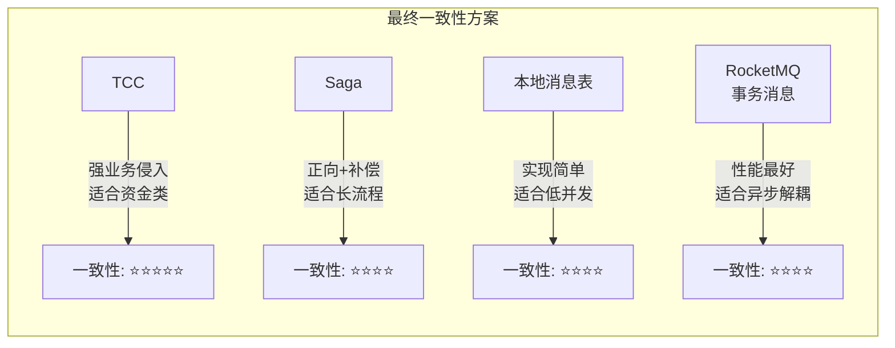
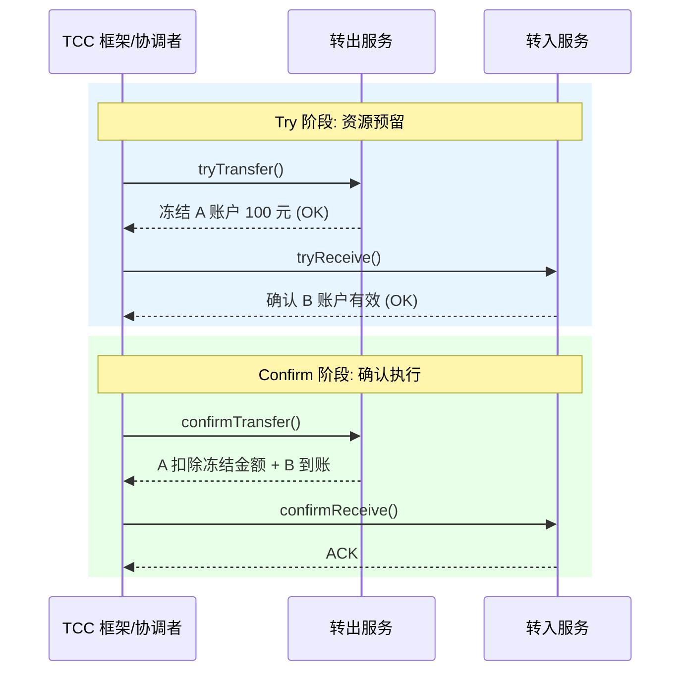
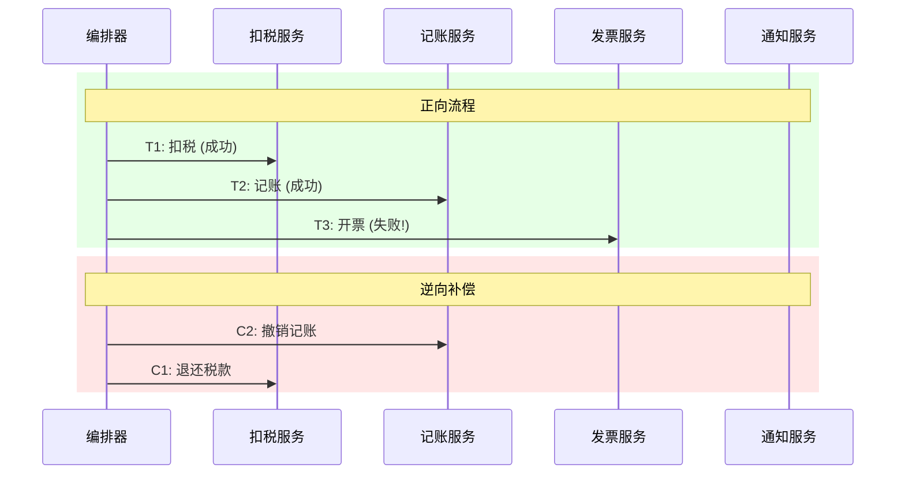
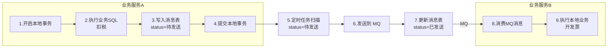
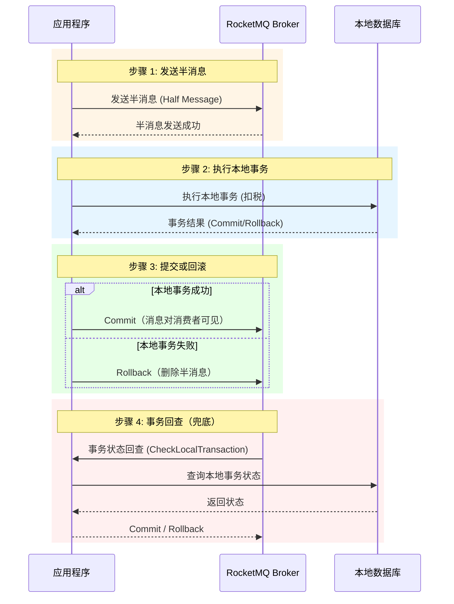
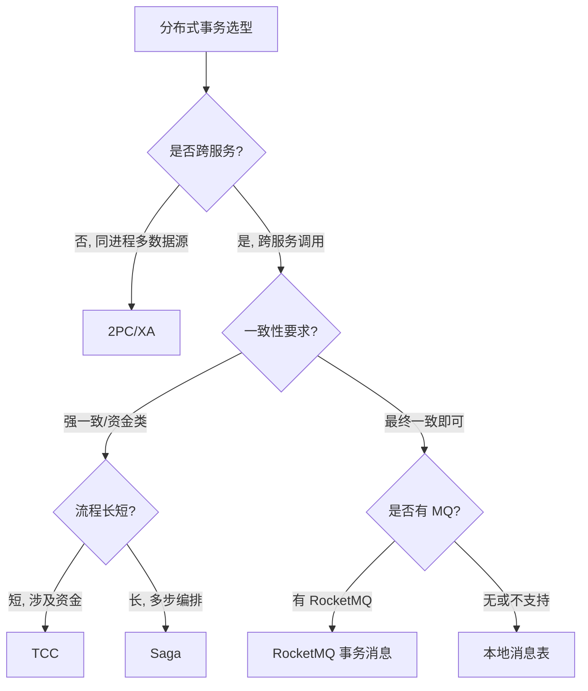
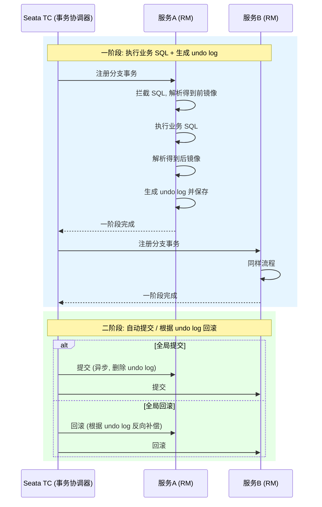
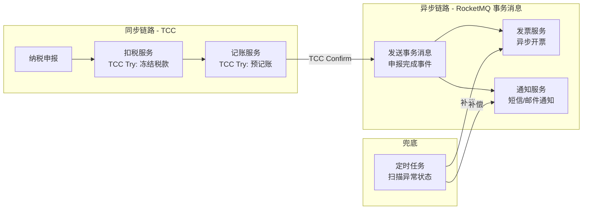
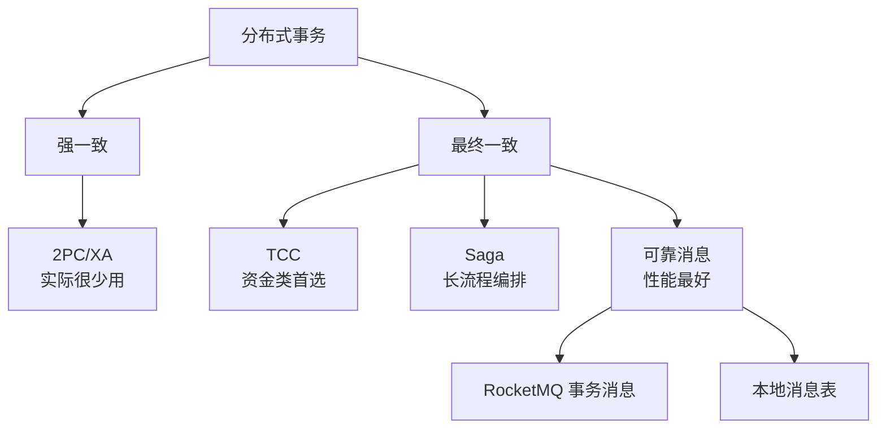

# 分布式事务最终一致性方案与框架选型

> 练习: [分布式事务最终一致性方案练习](./distributed-tx-patterns-exercises.md)
>
> 面试: [分布式事务最终一致性方案面试](./distributed-tx-patterns-interview.md)

---

## 一、最终一致性方案概览

强一致性方案（2PC/XA）因同步阻塞问题在实际项目中很少使用，业界主流采用**最终一致性方案**：



---

## 二、TCC 模式

### 2.1 核心概念

TCC（Try-Confirm-Cancel）把一个业务操作拆成三个阶段：

| 阶段 | 作用 | 说明 |
| --- | --- | --- |
| **Try** | 资源预留 | 冻结资源，不真正执行业务 |
| **Confirm** | 确认执行 | 使用预留的资源完成业务 |
| **Cancel** | 取消补偿 | 释放预留的资源 |

### 2.2 转账场景示例

用户 A 向用户 B 转账 100 元：

```java
// ========== Try 阶段：资源预留 ==========
public void tryTransfer(TransferDTO dto) {
    // A 账户冻结 100 元（不是真正扣款）
    accountMapper.freeze(dto.getFromId(), dto.getAmount());
    //  记录冻结金额到 freeze_amount 字段
    //  UPDATE account SET freeze_amount = freeze_amount + 100
    //  WHERE id = ? AND balance - freeze_amount >= 100
}

// ========== Confirm 阶段：确认执行 ==========
public void confirmTransfer(TransferDTO dto) {
    // A 账户：扣除冻结的 100 元
    accountMapper.debitFrozen(dto.getFromId(), dto.getAmount());
    //  UPDATE account SET balance = balance - 100, freeze_amount = freeze_amount - 100
    //  WHERE id = ?

    // B 账户：加 100 元
    accountMapper.credit(dto.getToId(), dto.getAmount());
    //  UPDATE account SET balance = balance + 100 WHERE id = ?
}

// ========== Cancel 阶段：取消补偿 ==========
public void cancelTransfer(TransferDTO dto) {
    // A 账户：释放冻结的 100 元
    accountMapper.unfreeze(dto.getFromId(), dto.getAmount());
    //  UPDATE account SET freeze_amount = freeze_amount - 100 WHERE id = ?
}
```

### 2.3 TCC 流程



> 如果 Try 阶段任何一个参与者失败，TM 调用所有参与者的 Cancel 方法。

### 2.4 TCC 三大难题

| 问题 | 说明 | 解决方案 |
| --- | --- | --- |
| **空回滚** | Try 未执行但收到 Cancel 调用 | 记录事务状态，Cancel 时检查是否执行过 Try |
| **幂等性** | Confirm/Cancel 可能被重复调用 | 记录执行状态，重复调用直接返回成功 |
| **悬挂** | Cancel 先于 Try 执行（网络延迟） | 除了返回成功外，还需记录一条“已取消”标记。当迟到的 Try 后续到达时，检测到该标记应直接拒绝执行，防止资源被永久锁定 |

**解决方案核心思路**：在数据库中建一张事务控制表：

```sql
CREATE TABLE tcc_transaction (
    xid          VARCHAR(128) PRIMARY KEY,  -- 全局事务 ID
    branch_id    VARCHAR(128),              -- 分支事务 ID
    status       VARCHAR(16),               -- trying / confirmed / cancelled
    created_at   TIMESTAMP DEFAULT NOW()
);
```

> **面试关键**：TCC 的三大难题（空回滚、幂等、悬挂）是面试高频考点，必须能讲清楚。

---

## 三、Saga 模式

### 3.1 核心概念

Saga 将长事务拆成多个**本地事务**，每个本地事务都有一个对应的**补偿操作**。如果某个步骤失败，则逆向执行之前所有步骤的补偿操作。

```
正向: T1 → T2 → T3 → ... → Tn
补偿: C1 ← C2 ← C3 ← ... ← Cn
```

### 3.2 税务申报场景

以"纳税申报"为例：扣税 → 记账 → 开票 → 通知



### 3.3 两种实现方式

| 方式 | 说明 | 优缺点 |
| --- | --- | --- |
| **编排式（Choreography）** | 各服务通过事件驱动，无中心协调 | 去中心化、松耦合，但流程不直观、难追踪 |
| **协调式（Orchestration）** | 中心编排器统一控制流程 | 流程清晰、易追踪，但编排器有单点风险 |

```java
// 协调式 Saga 编排器（伪代码）
public class TaxDeclareSaga {

    public void execute(TaxDeclareRequest request) {
        try {
            taxService.deduct(request);       // T1: 扣税
            ledgerService.record(request);     // T2: 记账
            invoiceService.issue(request);     // T3: 开票
            notifyService.send(request);       // T4: 通知
        } catch (Exception e) {
            // 逆向补偿已执行的步骤
            compensate(e.getFailedStep(), request);
        }
    }

    private void compensate(int failedStep, TaxDeclareRequest request) {
        if (failedStep > 3) notifyService.cancelSend(request);    // C4
        if (failedStep > 2) invoiceService.cancelIssue(request);  // C3
        if (failedStep > 1) ledgerService.cancelRecord(request);  // C2
        if (failedStep > 0) taxService.refund(request);            // C1
    }
}
```

### 3.4 TCC vs Saga 对比

| 维度 | TCC | Saga |
| --- | --- | --- |
| 一致性 | 较强（Try 预留资源） | 较弱（直接提交，补偿回滚） |
| 业务侵入 | 强（三个方法） | 中（正向 + 补偿） |
| 隔离性 | 有（Try 阶段冻结资源） | 无（脏读问题） |
| 适用场景 | 短流程、资金类 | 长流程、业务编排 |
| 性能 | 较低（资源锁定） | 较高（无锁） |

> **面试话术**：TCC 适合"短且重要"的操作（如转账），Saga 适合"长且可补偿"的流程（如订单履约、税务申报）。

---

## 四、本地消息表

### 4.1 核心思路

在业务数据库中建一张消息表，利用**本地事务**保证业务操作和消息记录的原子性，再通过定时任务将消息发送到 MQ。

### 4.2 实现流程



### 4.3 消息表设计

```sql
CREATE TABLE outbox_message (
    id            BIGINT PRIMARY KEY AUTO_INCREMENT,
    biz_id        VARCHAR(64) NOT NULL,       -- 业务ID（唯一键）
    topic         VARCHAR(128) NOT NULL,      -- MQ Topic
    tag           VARCHAR(64),                -- MQ Tag
    message_body  TEXT NOT NULL,              -- 消息内容
    status        VARCHAR(16) DEFAULT 'NEW',  -- NEW / SENT / FAIL
    retry_count   INT DEFAULT 0,              -- 重试次数
    created_at    TIMESTAMP DEFAULT NOW(),
    updated_at    TIMESTAMP DEFAULT NOW(),
    INDEX idx_status_created (status, created_at)
);
```

### 4.4 优缺点

| 优点 | 缺点 |
| --- | --- |
| 实现简单，不依赖特殊中间件 | 与业务数据库耦合 |
| 利用本地事务保证原子性 | 定时任务有延迟 |
| 不依赖 MQ 的事务消息功能 | 消息表数据量可能很大 |

---

## 五、RocketMQ 事务消息

> 衔接已学的 RocketMQ 知识，这里重点讲事务消息的原理。

### 5.1 核心流程



### 5.2 关键代码

```java
// 生产者：发送事务消息
@Component
public class TaxTransactionProducer {

    @Autowired
    private RocketMQTemplate rocketMQTemplate;

    public void sendTaxDeductMessage(TaxDeductEvent event) {
        // 发送事务消息，同时传入本地事务执行器和回查逻辑
        rocketMQTemplate.sendMessageInTransaction(
            "tax-deduct-topic",
            MessageBuilder.withPayload(event).build(),
            event  // 传递给本地事务执行器的参数
        );
    }
}

// 本地事务执行器
@Component
@RocketMQTransactionListener
public class TaxTransactionListener implements RocketMQLocalTransactionListener {

    @Autowired
    private TaxService taxService;

    // 执行本地事务
    @Override
    public RocketMQLocalTransactionState executeLocalTransaction(Message msg, Object arg) {
        try {
            TaxDeductEvent event = (TaxDeductEvent) arg;
            taxService.deductTax(event);  // 执行扣税
            return RocketMQLocalTransactionState.COMMIT;  // 提交：消息对消费者可见
        } catch (Exception e) {
            return RocketMQLocalTransactionState.ROLLBACK; // 回滚：删除消息
        }
    }

    // 事务回查（Broker 未收到确认时调用）
    @Override
    public RocketMQLocalTransactionState checkLocalTransaction(Message msg) {
        String bizId = (String) msg.getHeaders().get("bizId");
        // 查询本地数据库，确认事务是否已执行
        TaxRecord record = taxService.getByBizId(bizId);
        if (record != null && record.isSuccess()) {
            return RocketMQLocalTransactionState.COMMIT;
        }
        return RocketMQLocalTransactionState.ROLLBACK;
    }
}
```

### 5.3 半消息的本质

- 半消息发送到 Broker 后，**对消费者不可见**（存在特殊的内部 Topic）
- 收到 Commit 后，消息转移到目标 Topic，消费者可以消费
- 收到 Rollback 后，消息被删除
- 如果长时间未收到确认，Broker 会发起**事务回查**（最多 15 次）

> **面试关键**：事务回查是兜底机制，必须实现。回查逻辑是查询本地数据库确认事务状态。

---

## 六、方案对比选型（面试必背）

### 6.1 四大方案对比表

| 维度 | 2PC/XA | TCC | Saga | 可靠消息 |
| --- | --- | --- | --- | --- |
| **一致性** | 强一致 | 较强（冻结资源） | 最终一致 | 最终一致 |
| **性能** | 低（阻塞） | 中（资源锁定） | 高（无锁） | 最高（异步） |
| **业务侵入** | 无 | 强（三个方法） | 中（正向+补偿） | 低（消息接口） |
| **隔离性** | 有 | 有（Try冻结） | 无（脏读问题） | 无 |
| **实现复杂度** | 低（框架支持） | 高（三大难题） | 中 | 低 |
| **适用场景** | 同进程多数据源 | 短流程资金类 | 长流程业务编排 | 异步解耦 |
| **典型框架** | Atomikos/Bitronix | Seata TCC | Seata Saga | RocketMQ |

### 6.2 选型决策树



### 6.3 面试话术

> 在我们项目中，分布式事务方案不是一刀切的：
>
> - **核心转账链路**使用 TCC 模式，因为涉及资金，必须保证一致性，且流程短（只涉及扣款和到账两步）
> - **发票和通知等非核心链路**使用 RocketMQ 事务消息，异步解耦，性能好
> - **兜底策略**是本地消息表 + 定时任务补偿，确保极端情况下（如 MQ 宕机）数据也能最终一致

---

## 七、Seata 框架

### 7.1 Seata 是什么

Seata（Simple Extensible Autonomous Transaction Architecture）是阿里开源的分布式事务框架，支持四种模式：

| 模式 | 原理 | 一致性 | 适用场景 |
| --- | --- | --- | --- |
| **AT** | 自动拦截 SQL，生成回滚日志 | 最终一致 | 大多数场景（零侵入） |
| **TCC** | 手动定义 Try/Confirm/Cancel | 较强 | 资金类、需要资源隔离 |
| **Saga** | 正向操作 + 补偿操作 | 最终一致 | 长流程业务编排 |
| **XA** | 数据库 XA 协议 | 强一致 | 已有 XA 基础设施 |

### 7.2 AT 模式原理（面试高频）

AT 模式是 Seata 最常用的模式，**零业务侵入**，核心机制是**回滚日志（undo log）**：



**AT 模式的优缺点**：

| 优点 | 缺点 |
| --- | --- |
| 零业务侵入（只需加 @GlobalTransactional） | 只支持关系型数据库 |
| 自动生成回滚日志 | 全局锁可能影响性能 |
| 社区活跃、文档完善 | 一阶段已提交，回滚时有短暂的脏读 |

> **面试关键**：AT 模式 = 一阶段执行 SQL + 生成 undo log → 二阶段提交（删 undo log）或回滚（根据 undo log 反向补偿）。

### 7.3 Seata 三大角色

| 角色 | 全称 | 职责 |
| --- | --- | --- |
| **TC** | Transaction Coordinator | 事务协调器，维护全局事务状态（独立部署的 Server） |
| **TM** | Transaction Manager | 事务管理器，开启/提交/回滚全局事务（嵌入在业务服务中） |
| **RM** | Resource Manager | 资源管理器，管理分支事务的资源（嵌入在业务服务中） |

---

## 八、税务/转账场景方案设计

### 8.1 场景描述

税务系统：纳税人提交申报 → 扣税 → 记账 → 开票 → 通知纳税人

### 8.2 推荐方案



**设计思路**：

1. **核心链路（扣税 + 记账）**：使用 TCC，因为涉及资金，需要强一致性
2. **非核心链路（开票 + 通知）**：使用 RocketMQ 事务消息，异步解耦，提升性能
3. **兜底策略**：定时任务扫描超时/失败状态，触发人工补偿或自动重试

### 8.3 面试总结

> 我们税务系统的分布式事务方案是**混合架构**：
> - 核心转账/扣税用 TCC 保证资金安全
> - 非核心的开票、通知用 RocketMQ 事务消息做异步解耦
> - 有定时任务兜底补偿
> - 这个方案在我们线上跑了 X 个月，XX TPS 的申报量下表现稳定

---

## 小结



**面试核心结论**：
1. 2PC/XA 了解原理和问题即可，不是面试重点
2. TCC 重点掌握三大难题（空回滚/幂等/悬挂）
3. Saga 重点掌握编排式 vs 协调式
4. RocketMQ 事务消息重点掌握半消息 + 回查机制
5. 必须能讲清楚方案对比选型表和你的选型理由

---

## 参考知识衔接

| 已学知识 | 本阶段衔接点 |
| --- | --- |
| RocketMQ 基础 | 事务消息的半消息 + 回查机制 |
| Redis 基础 | 分布式锁是事务的辅助手段 |
| MySQL 事务 ACID | 单机事务是分布式事务的理论基础 |

> 练习: [分布式事务最终一致性方案练习](./distributed-tx-patterns-exercises.md)
>
> 面试: [分布式事务最终一致性方案面试](./distributed-tx-patterns-interview.md)
