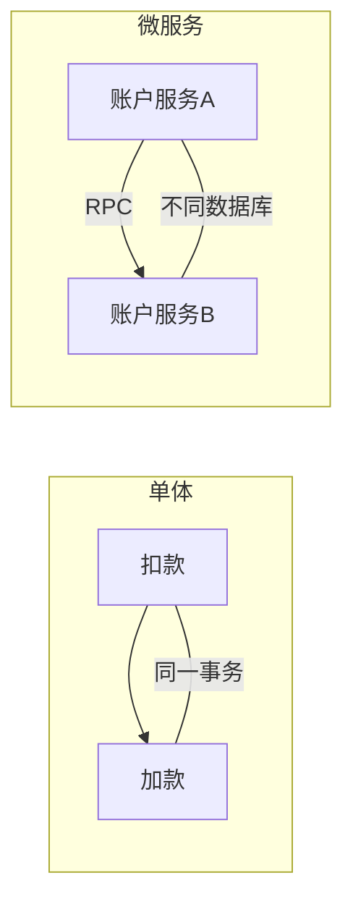
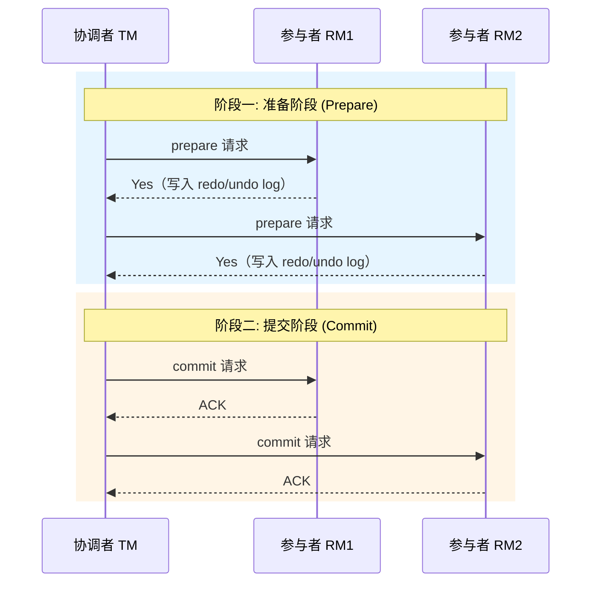
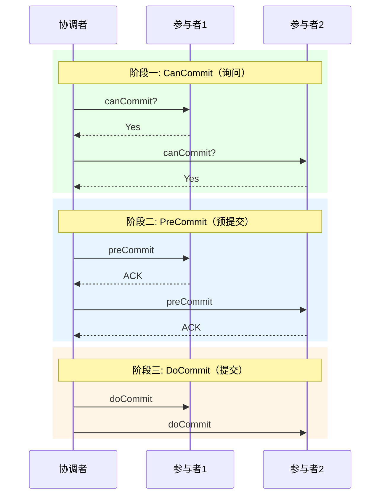
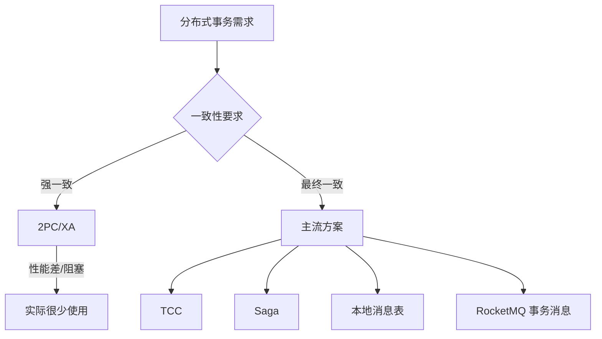

# 分布式事务理论基础与强一致性方案

> 练习: [分布式事务理论基础练习](./distributed-tx-theory-exercises.md)
>
> 面试: [分布式事务理论基础面试](./distributed-tx-theory-interview.md)

---

## 一、分布式事务产生的背景

### 1.1 从单体到微服务

单体应用中，所有操作在同一个数据库事务中完成，靠数据库自身的 ACID 保证一致性：

```java
@Transactional
public void transfer(Long fromId, Long toId, BigDecimal amount) {
    accountMapper.debit(fromId, amount);   // 扣款
    accountMapper.credit(toId, amount);    // 加款
    // 同一个数据库事务，要么全成功，要么全回滚
}
```

单体拆分为微服务后，扣款和加款分别在两个服务、两个数据库中执行，本地事务无法覆盖：



**核心问题**：服务 A 扣款成功，但调用服务 B 加款失败 → 数据不一致。

### 1.2 分布式事务的定义

**分布式事务**：跨越多个服务/数据库/节点的事务操作，需要保证这些操作要么全部成功，要么全部回滚（或补偿）。

---

## 二、CAP 定理

### 2.1 三个要素

| 要素 | 全称 | 含义 |
| --- | --- | --- |
| **C** | Consistency | 一致性：所有节点读到的数据一致 |
| **A** | Availability | 可用性：每个请求都能得到非错误响应 |
| **P** | Partition tolerance | 分区容忍性：网络分区时系统仍能工作 |

### 2.2 三选二？

**不是"三选二"，而是"P 必选，C 和 A 二选一"**。因为网络分区是客观存在的（网络抖动、光缆中断），无法避免。

```
┌─────────────────────────────────────────┐
│            网络分区发生 (P 必选)          │
│                                         │
│   ┌─────────┐         ┌─────────┐      │
│   │ CP 系统  │         │ AP 系统  │      │
│   │         │         │         │      │
│   │ 牺牲可用 │         │ 牺牲一致 │      │
│   │ 保证一致 │         │ 保证可用 │      │
│   └─────────┘         └─────────┘      │
│                                         │
│   例: ZooKeeper         例: Eureka      │
└─────────────────────────────────────────┘
```

**面试话术**：
> CAP 不是三选二，因为网络分区是不可避免的，所以 P 是必选的。实际是在 C 和 A 之间做权衡。大多数互联网系统选择 AP，牺牲强一致性换取高可用，通过最终一致性来弥补。金融场景对一致性要求高，会倾向 CP。

### 2.3 常见系统的 CAP 选择

| 系统 | 选择 | 原因 |
| --- | --- | --- |
| ZooKeeper | CP |Leader 选举期间不可用，保证数据一致 |
| Eureka | AP | 节点间复制可能不一致，但始终可用 |
| Redis Cluster | CP（主从切换时） | 故障转移期间可能短暂不可用 |
| MySQL 主从 | 视配置 | 异步复制→AP，半同步→偏 CP |

---

## 三、BASE 理论

BASE 是 CAP 中 AP 方向的工程实践，是对大规模分布式系统的妥协方案。

| 要素 | 全称 | 含义 |
| --- | --- | --- |
| **BA** | Basically Available | 基本可用：允许响应时间变长或功能降级 |
| **S** | Soft State | 软状态：允许中间状态（如"处理中"） |
| **E** | Eventually Consistent | 最终一致性：一段时间后数据最终一致 |

**ACID vs BASE 对比**：

| 维度 | ACID | BASE |
| --- | --- | --- |
| 一致性 | 强一致 | 最终一致 |
| 可用性 | 可能牺牲 | 优先保证 |
| 性能 | 较低（加锁等待） | 较高（异步补偿） |
| 复杂度 | 数据库原生支持 | 需要业务层实现补偿 |
| 适用场景 | 金融核心转账 | 互联网高并发业务 |

---

## 四、2PC 两阶段提交

### 4.1 核心角色

- **协调者（Coordinator / TM）**：全局事务管理器，决定提交还是回滚
- **参与者（Participant / RM）**：各资源管理器（如 MySQL 实例）

### 4.2 流程



**阶段一（Prepare）**：
1. 协调者向所有参与者发送 `prepare` 请求
2. 参与者执行事务操作（但不提交），写入 redo/undo log
3. 如果成功，返回 `Yes`；失败返回 `No`

**阶段二（Commit/Rollback）**：
- 所有参与者都返回 `Yes` → 协调者发送 `commit`
- 任何一个参与者返回 `No`（或超时）→ 协调者发送 `rollback`

### 4.3 2PC 的致命问题

| 问题 | 说明 |
| --- | --- |
| **同步阻塞** | Prepare 后参与者一直持有锁直到 Commit，高并发下性能极差 |
| **单点故障** | 协调者宕机，所有参与者永远阻塞等待 |
| **数据不一致** | 阶段二只有部分参与者收到 commit（网络问题），导致部分提交部分回滚 |
| **太过保守** | 任何一个参与者超时就全局回滚，没有更细粒度的容错 |

**面试话术**：
> 2PC 最大的问题是同步阻塞——在 Prepare 和 Commit 之间，参与者会一直持有数据库锁，这在高并发场景下是不可接受的。另外协调者单点故障也很致命，一旦宕机所有参与者都会阻塞。

---

## 五、XA 协议

### 5.1 XA 是什么

XA 是 X/Open 组织定义的分布式事务处理标准，本质就是 2PC 的工程实现。

**角色映射**：
- **AP（Application Program）**：应用程序
- **TM（Transaction Manager）**：事务管理器 = 2PC 的协调者
- **RM（Resource Manager）**：资源管理器 = 2PC 的参与者

### 5.2 Java JTA

Java 通过 JTA（Java Transaction API）实现 XA：

```java
// Spring Boot + JTA Atomikos 示例
@Transactional
public void transfer(Long fromId, Long toId, BigDecimal amount) {
    // 操作数据源 A（账户服务）
    accountAMapper.debit(fromId, amount);
    // 操作数据源 B（账单服务）
    accountBMapper.credit(toId, amount);
    // Atomikos 作为 TM 协调两个数据源的两阶段提交
}
```

### 5.3 XA 的实际局限

| 屘限 | 说明 |
| --- | --- |
| **性能差** | 持有锁时间长，不适合高并发 |
| **依赖数据库支持** | 不是所有数据库/中间件都支持 XA |
| **不适合微服务** | 跨服务调用走 RPC，无法用 XA 协调 |
| **运维复杂** | TM 单点问题需要额外解决 |

> **面试关键**：XA 在实际项目中很少使用，面试官问 2PC 主要是为了引出"它有什么问题"和"你们用了什么替代方案"。

---

## 六、3PC 三阶段提交（了解即可）

3PC 在 2PC 基础上增加了 `CanCommit` 阶段，并引入超时机制。



**3PC vs 2PC 对比**：

| 维度 | 2PC | 3PC |
| --- | --- | --- |
| 阶段数 | 2 | 3（每次事务多一轮CanCommit的网络往返） |
| 阻塞问题 | 严重 | 缓解（参与者超时自动提交） |
| 数据不一致 | 可能 | 仍可能（超时提交导致） |
| 实际应用 | 有（XA 协议） | 几乎没有 |

**面试话术**：
> 3PC 在 2PC 基础上增加了 CanCommit 阶段和超时机制，减少了阻塞，但引入了新的数据不一致问题（超时后参与者自动提交可能与协调者意图冲突）。实际生产中 3PC 几乎没有使用，更多是理论意义。

---

## 七、小结：为什么需要最终一致性方案



**核心结论**：强一致性方案（2PC/XA）因性能问题在实际项目中很少使用，业界主流采用**最终一致性方案**，这将是阶段二的重点。

---

## 参考知识衔接

| 已学知识 | 衔接点 |
| --- | --- |
| RocketMQ | 阶段二的事务消息方案 |
| Redis | 分布式锁与分布式事务的关系 |
| MySQL ACID | 理解单机事务是分布式事务的基础 |

> 练习: [分布式事务理论基础练习](./distributed-tx-theory-exercises.md)
>
> 面试: [分布式事务理论基础面试](./distributed-tx-theory-interview.md)
