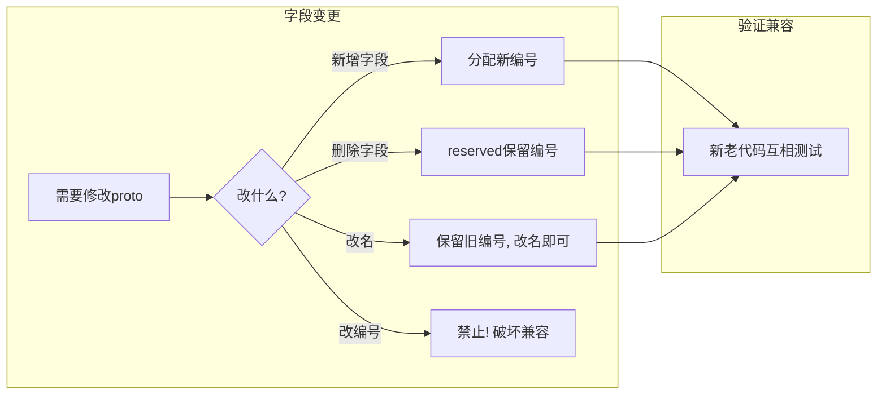
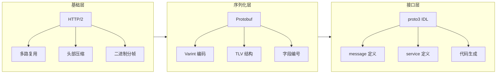

# gRPC 基础与 Protobuf

> 练习: [gRPC 基础与 Protobuf 练习](./gRPC-basic-protobuf-exercises.md)
>
> 面试: [gRPC 基础与 Protobuf 面试](./gRPC-basic-protobuf-interview.md)

---

## 一句话总结

gRPC = **HTTP/2**（传输层多路复用）+ **Protobuf**（序列化层二进制编码）+ **IDL**（接口定义语言自动生成代码），三者协同带来比 REST + JSON 快 3-10 倍的性能。

---

## 1. gRPC 是什么

gRPC（gRPC Remote Procedure Call）是 Google 开源的高性能 RPC 框架，核心思路是**让远程调用像本地调用一样简单**。

```
+------------------+                    +------------------+
|   Client (Java)  |                    |   Server (Java)  |
|                  |   HTTP/2 + Protobuf |                  |
|  greeterStub    | ==================> |  GreeterImpl     |
|  .sayHello(req) | <================== |  .sayHello(req)  |
|                  |                    |                  |
+------------------+                    +------------------+
```

**核心组件**：

| 组件          | 作用                  | 类比              |
| ------------- | --------------------- | ----------------- |
| IDL (.proto)  | 定义接口契约          | OpenAPI / Swagger |
| protoc 编译器 | 生成客户端/服务端代码 | OpenAPI Generator |
| HTTP/2        | 传输协议              | HTTP/1.1          |
| Protobuf      | 序列化格式            | JSON              |

---

## 2. gRPC vs REST（面试必考）

### 核心对比表

| 维度           | gRPC                    | REST                        |
| -------------- | ----------------------- | --------------------------- |
| **协议**       | HTTP/2                  | HTTP/1.1（也可用 HTTP/2）   |
| **序列化**     | Protobuf（二进制）      | JSON（文本）                |
| **接口定义**   | .proto 文件（强类型）   | 无强制约束（靠文档/规范）   |
| **代码生成**   | 自动生成 Stub           | 需手动或第三方工具          |
| **流式通信**   | 四种模式原生支持        | 需 WebSocket / SSE          |
| **性能**       | 快 3-10 倍              | 基准                        |
| **浏览器支持** | 需 gRPC-Web             | 原生支持                    |
| **调试难度**   | 高（需 grpcurl 等工具） | 低（curl / 浏览器直接可用） |
| **适用场景**   | 内部服务间通信          | 对外暴露 API                |

### 选型决策（面试话术）

> "我们项目选择 gRPC 的原因是：服务间调用频繁、对延迟敏感、接口需要强类型约束。对外 API 仍然用 REST，因为浏览器友好、调试方便。**内外分离**是常见的架构模式。"

**面试关键点**：不要说"gRPC 比 REST 好"，要说"各有所长，按场景选择"。

---

## 3. HTTP/2 核心特性（重点理解）

HTTP/2 是 gRPC 高性能的传输层基础，三个核心特性：

### 3.1 多路复用（Multiplexing）

HTTP/1.1 每个请求占用一个 TCP 连接，或者用 Keep-Alive 复用但必须**排队**（队头阻塞）。

HTTP/2 在一个 TCP 连接上通过 **Stream ID** 并行传输多个请求/响应：

```
HTTP/1.1 (管线化, 队头阻塞):
  连接1: 请求A -----> 响应A ----->
  连接2: 请求B -----> 响应B ----->   (必须等 A 完成)

HTTP/2 (多路复用):
  单连接: Stream1[A请求] ---> Stream2[B请求] --->
          Stream1[A响应] <--- Stream2[B响应] <---
          (并行交错传输, 互不阻塞)
```

### 3.2 头部压缩（HPACK）

HTTP/1.1 每次请求都发送完整 Header（可能几百字节到几 KB）。

HTTP/2 用 **HPACK** 算法压缩头部：

- 客户端和服务端维护**静态表 + 动态表**
- 常见 Header（如 `:method GET`）直接用索引号代替
- 重复的 Header 字段只传差值

### 3.3 二进制分帧

HTTP/1.1 是文本协议，HTTP/2 是**二进制分帧**：

- 数据被拆分为更小的 **Frame**（帧）
- 帧类型：HEADERS、DATA、SETTINGS、PING 等
- 二进制解析比文本解析快得多

> **面试总结**：HTTP/2 对 gRPC 的贡献 = 多路复用（省连接）+ 头部压缩（省带宽）+ 二进制分帧（省解析）。不需要深入帧格式细节，理解这三点即可。

---

## 4. Protobuf 编码原理（面试高频）

### 4.1 为什么比 JSON 小 3-10 倍？

以一个简单示例对比：

```json
// JSON: 34 字节
{ "name": "Alice", "age": 30 }
```

```protobuf
// Protobuf 编码后: 约 12 字节
// 0A 05 41 6C 69 63 65    // field 1 (name="Alice")
// 10 1E                    // field 2 (age=30)
```

**关键原因**：

1. **不传字段名**：用字段编号（1-2 字节）替代字符串 key
2. **Varint 编码**：整数用可变长度编码，小数字只占 1 字节
3. **无分隔符**：Tag-Length-Value 结构，不需要 `{}、""、:,`

### 4.2 编码结构：Tag-Length-Value

每个字段编码为 **TLV** 结构：

```
+--------+--------+---------+
|  Tag   | Length |  Value  |
+--------+--------+---------+
| 1-2字节 | 可变长  |  实际数据 |
+--------+--------+---------+

Tag = (field_number << 3) | wire_type
```

**Wire Type**（只需记住前两种）：

| Wire Type | 含义             | 适用类型                    |
| --------- | ---------------- | --------------------------- |
| 0         | Varint           | int32, int64, bool, enum    |
| 2         | Length-delimited | string, bytes, 嵌套 message |

**编码示例**：

```
message Person {
  string name = 1;   // field_number=1, wire_type=2
  int32  age  = 2;   // field_number=2, wire_type=0
}

// name="Alice", age=30 的编码过程:
// Tag(name) = (1 << 3) | 2 = 0x0A
// Length    = 5 ("Alice"长度)
// Value     = "Alice"
// => 0A 05 41 6C 69 63 65

// Tag(age)  = (2 << 3) | 0 = 0x10
// Value     = 30 (Varint编码) = 0x1E
// => 10 1E
```

### 4.3 Varint 编码

Varint 是 Protobuf 整数编码的核心，用**可变字节数**表示整数：

```
规则: 每个字节的最高位(MSB)是"继续位"
  MSB=1 => 后面还有字节
  MSB=0 => 这是最后一个字节

示例: 数字 150 的编码
  150 = 10010110 (二进制)
  拆分为 7bit 一组: 0000001 0010110
  从低位开始, 加继续位:
    => 10010110 00000001
    => 0x96 0x01  (2字节)
```

> **面试关键**：面试官问"Protobuf 为什么高效"，回答三个关键词：**字段编号替代字段名**、**Varint 可变长编码**、**二进制无分隔符**。

---

## 5. proto3 语法速查

### 5.1 基本结构

```protobuf
syntax = "proto3";

package com.example.grpc;

// Java 专属选项
option java_multiple_files = true;    // 每个message/service生成独立Java类
option java_package = "com.example.grpc";
option java_outer_classname = "UserProto";

// 定义消息（类似 Java 的 class）
message UserRequest {
  string username = 1;
  int32  user_id  = 2;
}

message UserResponse {
  int32  user_id   = 1;
  string username  = 2;
  string email     = 3;
  bool   is_active = 4;
}

// 定义服务（类似 Java 的 interface）
service UserService {
  rpc GetUser(UserRequest) returns (UserResponse);
}
```

### 5.2 字段类型映射

| proto3 类型        | Java 类型          | 说明                            |
| ------------------ | ------------------ | ------------------------------- |
| `string`           | `String`           | UTF-8 字符串                    |
| `int32`            | `int`              | 变长编码，负数效率低用 `sint32` |
| `int64`            | `long`             | 同上，负数用 `sint64`           |
| `bool`             | `boolean`          | -                               |
| `float` / `double` | `float` / `double` | -                               |
| `bytes`            | `ByteString`       | 二进制数据                      |
| `repeated`         | `List<T>`          | 列表/数组                       |
| `map<K,V>`         | `Map<K,V>`         | 字典                            |

### 5.3 字段编号规则（面试必考）

```protobuf
message Example {
  string name = 1;      // 编号 1-15 只占 1 字节 Tag
  int32  id   = 2;      // 编号 16-2047 占 2 字节 Tag
  // 编号范围: 1 - 536870911 (2^29 - 1)
  // 禁用范围: 19000-19999 (Protobuf 内部保留)
}
```

**核心规则**：

1. **编号一旦分配，不可更改**（老客户端用编号识别字段）
2. 编号 1-15 最常用，占 1 字节 Tag，给高频字段
3. `repeated` 字段尽量用 1-15（packed 编码省空间）

### 5.4 reserved 字段

删除字段时必须 `reserved`，防止新字段复用旧编号：

```protobuf
message Person {
  reserved 2, 15, 9 to 11;   // 保留编号
  reserved "old_field";       // 保留字段名

  string name = 1;
  // int32 old_field = 2;  // 已删除, 但编号2被保留
  string email = 3;
}
```

---

## 6. 代码生成机制

### 6.1 Maven 配置

```xml
<dependencies>
    <dependency>
        <groupId>io.grpc</groupId>
        <artifactId>grpc-netty-shaded</artifactId>
        <version>1.80.0</version>
        <scope>runtime</scope>
    </dependency>
    <dependency>
        <groupId>io.grpc</groupId>
        <artifactId>grpc-protobuf</artifactId>
        <version>1.80.0</version>
    </dependency>
    <dependency>
        <groupId>io.grpc</groupId>
        <artifactId>grpc-stub</artifactId>
        <version>1.80.0</version>
    </dependency>
</dependencies>

<build>
    <extensions>
        <extension>
            <groupId>kr.motd.maven</groupId>
            <artifactId>os-maven-plugin</artifactId>
            <version>1.7.1</version>
        </extension>
    </extensions>
    <plugins>
        <plugin>
            <groupId>org.xolstice.maven.plugins</groupId>
            <artifactId>protobuf-maven-plugin</artifactId>
            <version>0.6.1</version>
            <configuration>
                <protocArtifact>com.google.protobuf:protoc:3.25.8:exe:${os.detected.classifier}</protocArtifact>
                <pluginId>grpc-java</pluginId>
                <pluginArtifact>io.grpc:protoc-gen-grpc-java:1.80.0:exe:${os.detected.classifier}</pluginArtifact>
            </configuration>
            <executions>
                <execution>
                    <goals>
                        <goal>compile</goal>
                        <goal>compile-custom</goal>
                    </goals>
                </execution>
            </executions>
        </plugin>
    </plugins>
</build>
```

### 6.2 生成的代码

`protoc` 编译器从 .proto 文件生成两类代码：

```
user.proto
  |
  +-- protoc (protobuf 编译器)
  |     => UserRequest.java, UserResponse.java (消息类)
  |
  +-- protoc-gen-grpc-java (gRPC 插件)
        => UserServiceGrpc.java (服务 Stub 基类)
            ├── UserServiceImplBase    (服务端继承)
            ├── newBlockingStub()      (同步阻塞客户端)
            ├── newFutureStub()        (Future 异步客户端)
            └── newStub()              (完全异步客户端)
```

---

## 7. Schema 演进（向后兼容规则）

这是生产中最常遇到的问题，也是面试高频考点。

### 7.1 安全操作（向后兼容）

| 操作               | 说明                       | 示例                      |
| ------------------ | -------------------------- | ------------------------- |
| 新增字段           | 老代码忽略新字段           | 加 `string nickname = 5;` |
| 删除字段           | 必须用 `reserved` 保留编号 | `reserved 3;`             |
| `int32` ↔ `int64`  | 兼容（精度可能丢失）       | -                         |
| `string` ↔ `bytes` | 兼容（UTF-8 场景）         | -                         |

### 7.2 危险操作（破坏兼容）

| 操作                     | 原因                               |
| ------------------------ | ---------------------------------- |
| 修改字段编号             | 二进制编码靠编号识别，改了就解析错 |
| 复用已删除的编号         | 老数据可能按旧类型解析             |
| 修改字段类型（不兼容的） | 如 `int32` 改 `string`             |
| 修改默认值               | proto3 无法区分"未设置"和"默认值"  |

### 7.3 完整流程图



---

## 8. 快速实战：一个完整的 gRPC 示例

### 8.1 定义 proto

```protobuf
syntax = "proto3";

package helloworld;
option java_multiple_files = true;
option java_package = "com.example.grpc.helloworld";

message HelloRequest {
  string name = 1;
}

message HelloReply {
  string message = 1;
}

service Greeter {
  rpc SayHello(HelloRequest) returns (HelloReply);
}
```

### 8.2 服务端实现

```java
public class HelloWorldServer {
    public static void main(String[] args) throws Exception {
        Server server = ServerBuilder.forPort(50051)
            .addService(new GreeterImpl())
            .build()
            .start();

        System.out.println("Server started on port 50051");
        server.awaitTermination();
    }

    // 继承 protoc 生成的 ImplBase
    static class GreeterImpl extends GreeterGrpc.GreeterImplBase {
        @Override
        public void sayHello(HelloRequest req,
                             StreamObserver<HelloReply> responseObserver) {
            HelloReply reply = HelloReply.newBuilder()
                .setMessage("Hello " + req.getName())
                .build();
            responseObserver.onNext(reply);
            responseObserver.onCompleted();
        }
    }
}
```

### 8.3 客户端调用

```java
public class HelloWorldClient {
    public static void main(String[] args) throws Exception {
        // Channel 是线程安全的, 应复用
        ManagedChannel channel = Grpc.newChannelBuilder(
            "localhost:50051",
            InsecureChannelCredentials.create()
        ).build();

        // 创建同步阻塞 Stub
        GreeterGrpc.GreeterBlockingStub stub =
            GreeterGrpc.newBlockingStub(channel);

        // 发起调用
        HelloReply reply = stub.sayHello(
            HelloRequest.newBuilder().setName("World").build()
        );
        System.out.println(reply.getMessage());

        channel.shutdownNow().awaitTermination(5, TimeUnit.SECONDS);
    }
}
```

---

## 9. 知识图谱总结



**面试速记**：HTTP/2 解决**传输效率**，Protobuf 解决**编码效率**，IDL 解决**开发效率**。

---

> 练习: [gRPC 基础与 Protobuf 练习](./gRPC-basic-protobuf-exercises.md)
>
> 面试: [gRPC 基础与 Protobuf 面试](./gRPC-basic-protobuf-interview.md)
