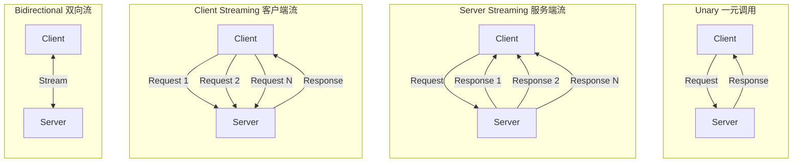
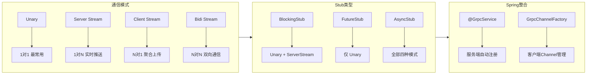

# gRPC 通信模式与 Spring Boot 整合

> 练习: [gRPC 通信模式与 Spring Boot 整合 练习](./gRPC-patterns-spring-exercises.md)
>
> 面试: [gRPC 通信模式与 Spring Boot 整合 面试](./gRPC-patterns-spring-interview.md)

---

## 一句话总结

gRPC 定义了**四种通信模式**（Unary / Server Streaming / Client Streaming / Bidirectional），Spring Boot 通过 `spring-grpc` 项目提供 `@GrpcService` 和 `GrpcChannelFactory` 实现零样板代码整合。

---

## 1. 四种通信模式总览



### 对比表（面试必备）

| 模式                 | 请求 | 响应 | 典型场景                     | 面试频率   |
| -------------------- | ---- | ---- | ---------------------------- | ---------- |
| **Unary**            | 1 个 | 1 个 | 普通查询/增删改              | ⭐⭐⭐⭐⭐ |
| **Server Streaming** | 1 个 | N 个 | 实时推送、大结果集分批返回   | ⭐⭐⭐⭐   |
| **Client Streaming** | N 个 | 1 个 | 文件上传、批量提交、聚合计算 | ⭐⭐⭐     |
| **Bidirectional**    | N 个 | N 个 | 聊天、实时协作、双工通信     | ⭐⭐⭐⭐   |

---

## 2. Unary RPC（一元调用）

最常用模式，等价于普通 HTTP 请求-响应。

### proto 定义

```protobuf
service UserService {
  rpc GetUser(GetUserRequest) returns (UserResponse);
}
```

### 服务端实现

```java
// 原生 gRPC: 继承 ImplBase
public class UserServiceImpl extends UserServiceGrpc.UserServiceImplBase {
    @Override
    public void getUser(GetUserRequest request,
                        StreamObserver<UserResponse> responseObserver) {
        UserResponse response = UserResponse.newBuilder()
            .setUserId(request.getUserId())
            .setUsername("Alice")
            .build();
        responseObserver.onNext(response);   // 发送响应
        responseObserver.onCompleted();      // 结束流
    }
}
```

### 客户端调用

```java
// BlockingStub - 同步阻塞
UserResponse response = blockingStub.getUser(
    GetUserRequest.newBuilder().setUserId(1).build()
);

// FutureStub - ListenableFuture 异步
ListenableFuture<UserResponse> future = futureStub.getUser(request);

// AsyncStub - 回调异步
asyncStub.getUser(request, new StreamObserver<UserResponse>() {
    @Override
    public void onNext(UserResponse value) { /* 处理响应 */ }
    @Override
    public void onError(Throwable t) { /* 处理错误 */ }
    @Override
    public void onCompleted() { /* 流结束 */ }
});
```

---

## 3. Server Streaming RPC（服务端流）

客户端发**一个请求**，服务端返回**多个响应**（流式推送）。

### proto 定义

```protobuf
service OrderService {
  rpc ListOrders(ListOrdersRequest) returns (stream OrderResponse);
  //                                            ^^^^^ stream 关键字
}
```

### 服务端实现

```java
@Override
public void listOrders(ListOrdersRequest request,
                       StreamObserver<OrderResponse> responseObserver) {
    // 查询结果逐条推送
    for (Order order : orderRepository.findByUserId(request.getUserId())) {
        OrderResponse resp = OrderResponse.newBuilder()
            .setOrderId(order.getId())
            .setAmount(order.getAmount())
            .build();
        responseObserver.onNext(resp);   // 每次推送一条
    }
    responseObserver.onCompleted();      // 推送结束
}
```

### 客户端调用

```java
// BlockingStub - 用 Iterator 消费流
Iterator<OrderResponse> orders = blockingStub.listOrders(request);
while (orders.hasNext()) {
    OrderResponse order = orders.next();
    System.out.println("Order: " + order.getOrderId());
}
```

**适用场景**：

- 实时日志/事件推送（替代 SSE / WebSocket）
- 大数据集分批返回（避免一次性加载 OOM）
- 订阅模式（股票行情、位置追踪）

---

## 4. Client Streaming RPC（客户端流）

客户端发**多个请求**，服务端返回**一个响应**（聚合处理）。

### proto 定义

```protobuf
service FileService {
  // stream 关键字在请求类型前
  rpc UploadFile(stream FileChunk) returns (UploadResponse);
}
```

### 服务端实现

服务端返回一个 `StreamObserver<FileChunk>` 用于接收客户端的流式请求：

```java
@Override
public StreamObserver<FileChunk> uploadFile(
        StreamObserver<UploadResponse> responseObserver) {
    return new StreamObserver<FileChunk>() {
        private ByteArrayOutputStream buffer = new ByteArrayOutputStream();

        @Override
        public void onNext(FileChunk chunk) {
            // 每收到一个 chunk 就追加
            buffer.write(chunk.getData().toByteArray());
        }

        @Override
        public void onError(Throwable t) {
            logger.warning("Upload failed: " + t.getMessage());
        }

        @Override
        public void onCompleted() {
            // 客户端发送完毕, 返回汇总结果
            UploadResponse response = UploadResponse.newBuilder()
                .setSize(buffer.size())
                .setSuccess(true)
                .build();
            responseObserver.onNext(response);
            responseObserver.onCompleted();
        }
    };
}
```

### 客户端调用

```java
// 只能用 AsyncStub (BlockingStub 不支持 Client/Bidi Streaming)
StreamObserver<UploadResponse> responseObserver = new StreamObserver<UploadResponse>() {
    @Override
    public void onNext(UploadResponse value) {
        System.out.println("Upload complete, size=" + value.getSize());
    }
    @Override
    public void onError(Throwable t) { /* 错误处理 */ }
    @Override
    public void onCompleted() { /* 流结束 */ }
};

// 获取请求流 Observer
StreamObserver<FileChunk> requestObserver = asyncStub.uploadFile(responseObserver);

// 逐块发送
for (byte[] chunk : fileChunks) {
    requestObserver.onNext(FileChunk.newBuilder()
        .setData(ByteString.copyFrom(chunk))
        .build());
}
requestObserver.onCompleted();  // 发送完毕
```

**适用场景**：

- 文件分块上传
- 批量数据提交
- 聚合计算（逐条发送数据，服务端汇总返回）

---

## 5. Bidirectional Streaming RPC（双向流）

客户端和服务端**独立地同时发送流**，两端的流互不阻塞。

### proto 定义

```protobuf
service ChatService {
  // 两端都是 stream
  rpc Chat(stream ChatMessage) returns (stream ChatMessage);
}
```

### 服务端实现

```java
@Override
public StreamObserver<ChatMessage> chat(
        StreamObserver<ChatMessage> responseObserver) {
    return new StreamObserver<ChatMessage>() {
        @Override
        public void onNext(ChatMessage msg) {
            // 收到客户端消息, 广播给所有在线用户
            ChatMessage reply = ChatMessage.newBuilder()
                .setUser("Server")
                .setText("Echo: " + msg.getText())
                .build();
            responseObserver.onNext(reply);  // 随时可以推送
        }

        @Override
        public void onError(Throwable t) {
            logger.warning("Chat error: " + t.getMessage());
        }

        @Override
        public void onCompleted() {
            responseObserver.onCompleted();
        }
    };
}
```

**核心特性**：`onNext` 可以在收到客户端消息时随时调用，不一定要等客户端流结束。两端的流是**独立**的。

**适用场景**：

- 即时聊天（类似 WebSocket）
- 实时协作编辑
- 双向心跳 + 数据推送

---

## 6. BlockingStub vs AsyncStub vs FutureStub（面试必考）

| 特性                 | BlockingStub       | FutureStub       | AsyncStub        |
| -------------------- | ------------------ | ---------------- | ---------------- |
| **同步/异步**        | 同步阻塞           | 异步（Future）   | 异步（回调）     |
| **Unary**            | 支持               | 支持             | 支持             |
| **Server Streaming** | 支持（Iterator）   | 不支持           | 支持             |
| **Client Streaming** | **不支持**         | **不支持**       | 支持             |
| **Bidirectional**    | **不支持**         | **不支持**       | 支持             |
| **适用场景**         | 简单查询、快速调用 | 并发调用多个服务 | 流式通信、高并发 |

**面试关键**：

- **BlockingStub** 最常用，适合 Unary + Server Streaming
- **Client Streaming 和 Bidirectional Streaming 只能用 AsyncStub**
- FutureStub 只支持 Unary，适合需要 `ListenableFuture` 的场景

---

## 7. Spring Boot 整合 gRPC

Spring 官方提供了 `spring-grpc` 项目（Spring Boot 3.x），让 gRPC 开发几乎零配置。

### 7.1 依赖配置

```xml
<!-- 服务端 -->
<dependency>
    <groupId>org.springframework.grpc</groupId>
    <artifactId>spring-grpc-spring-boot-starter</artifactId>
</dependency>

<!-- 客户端（如果当前服务也是 gRPC 客户端） -->
<dependency>
    <groupId>org.springframework.grpc</groupId>
    <artifactId>spring-grpc-client-spring-boot-starter</artifactId>
</dependency>
```

### 7.2 服务端：@GrpcService

Spring Boot 自动扫描标记了 `@Bean` 的 `BindableService` 实现，注册为 gRPC 服务：

```java
@Service  // 同时是 Spring Bean 和 gRPC 服务
public class UserGrpcService extends UserServiceGrpc.UserServiceImplBase {

    private final UserRepository userRepository;

    // 依赖注入 - gRPC 服务也能用 Spring 的全部能力
    public UserGrpcService(UserRepository userRepository) {
        this.userRepository = userRepository;
    }

    @Override
    public void getUser(GetUserRequest request,
                        StreamObserver<UserResponse> responseObserver) {
        User user = userRepository.findById(request.getUserId())
            .orElseThrow(() -> new StatusRuntimeException(
                Status.NOT_FOUND.withDescription("User not found")
            ));

        UserResponse response = UserResponse.newBuilder()
            .setUserId(user.getId())
            .setUsername(user.getUsername())
            .setEmail(user.getEmail())
            .build();
        responseObserver.onNext(response);
        responseObserver.onCompleted();
    }
}
```

**`@GrpcService` 的本质**：它等价于把 `BindableService` 注册为 `@Bean`，Spring Boot 自动发现并绑定到 gRPC Server。

### 7.3 客户端：GrpcChannelFactory

```java
@Configuration
public class GrpcClientConfig {

    @Bean
    UserServiceGrpc.UserServiceBlockingStub userStub(GrpcChannelFactory channels) {
        return UserServiceGrpc.newBlockingStub(
            channels.createChannel("user-service:9090")
        );
    }
}
```

在业务代码中直接注入使用：

```java
@Service
public class OrderService {
    private final UserServiceGrpc.UserServiceBlockingStub userStub;

    public OrderService(UserServiceGrpc.UserServiceBlockingStub userStub) {
        this.userStub = userStub;
    }

    public OrderDTO createOrder(CreateOrderRequest req) {
        // 调用远程 gRPC 服务, 像本地方法一样
        UserResponse user = userStub.getUser(
            GetUserRequest.newBuilder().setUserId(req.getUserId()).build()
        );
        // ... 业务逻辑
    }
}
```

### 7.4 客户端：自动 Stub 注入（@ImportGrpcClients）（推荐）

```java
@SpringBootApplication
@ImportGrpcClients(basePackageClasses = MyApplication.class)
class MyApplication { }

// 之后可以直接 @Autowired 注入 Stub
@Service
public class SomeService {
    @Autowired
    private UserServiceGrpc.UserServiceBlockingStub userStub;
}
```

### 7.5 application.yml 配置

```yaml
spring:
  grpc:
    server:
      port: 9090 # gRPC 服务端口
      address: 0.0.0.0
    client:
      channels:
        user-service:
          address: "static://user-service:9090"
          negotiation-type: plaintext
```

---

## 8. StreamObserver 回调机制

四种模式的底层都依赖 `StreamObserver` 接口，这是理解 gRPC 流式通信的关键：

```java
public interface StreamObserver<V> {
    void onNext(V value);      // 收到一条消息
    void onError(Throwable t); // 流发生错误
    void onCompleted();        // 流正常结束
}
```

### 四种模式中的 StreamObserver 流向

```
+-----------------+          +------------------+
|                 |  request |                  |
|    Client       | -------> |    Server        |
|                 | <------- |                  |
|                 | response |                  |
+-----------------+          +------------------+

Unary:
  Client.onNext(req) -> Server.onNext(resp) -> Server.onCompleted()
  Client.onCompleted()

Server Streaming:
  Client.onNext(req) -> Client.onCompleted()
  Server.onNext(resp1) -> Server.onNext(resp2) -> ... -> Server.onCompleted()

Client Streaming:
  Client.onNext(req1) -> Client.onNext(req2) -> ... -> Client.onCompleted()
  Server.onNext(resp) -> Server.onCompleted()

Bidirectional:
  Client.onNext(req) <-> Server.onNext(resp)   (随时互发)
  Client.onCompleted() -> Server.onCompleted()  (各自独立结束)
```

---

## 9. 四种模式完整 proto 示例

```protobuf
syntax = "proto3";

package com.example.grpc;
option java_multiple_files = true;
option java_package = "com.example.grpc.demo";

// --- 消息定义 ---
message Request { string query = 1; }
message Response { string result = 1; }

// --- 四种模式的服务定义 ---
service DemoService {
  // 1. Unary: 1个请求 -> 1个响应
  rpc UnaryCall(Request) returns (Response);

  // 2. Server Streaming: 1个请求 -> N个响应
  rpc ServerStreamingCall(Request) returns (stream Response);

  // 3. Client Streaming: N个请求 -> 1个响应
  rpc ClientStreamingCall(stream Request) returns (Response);

  // 4. Bidirectional: N个请求 -> N个响应
  rpc BidiStreamingCall(stream Request) returns (stream Response);
}
```

---

## 10. 知识图谱总结



**面试速记**：四种模式看 `stream` 位置、三种 Stub 看同步/异步、Spring 整合看 `@GrpcService` + `GrpcChannelFactory`。

---

> 练习: [gRPC 通信模式与 Spring Boot 整合 练习](./gRPC-patterns-spring-exercises.md)
>
> 面试: [gRPC 通信模式与 Spring Boot 整合 面试](./gRPC-patterns-spring-interview.md)
