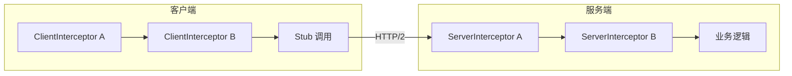
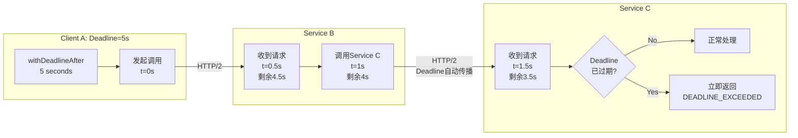
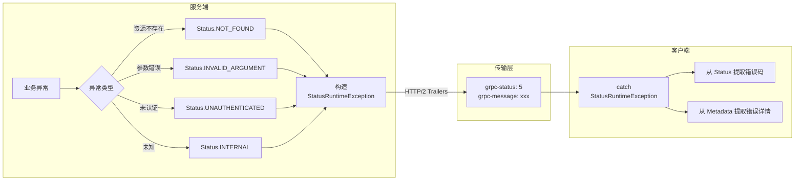
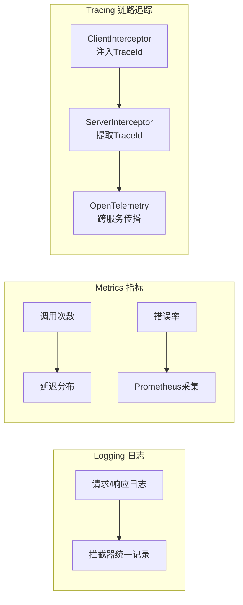
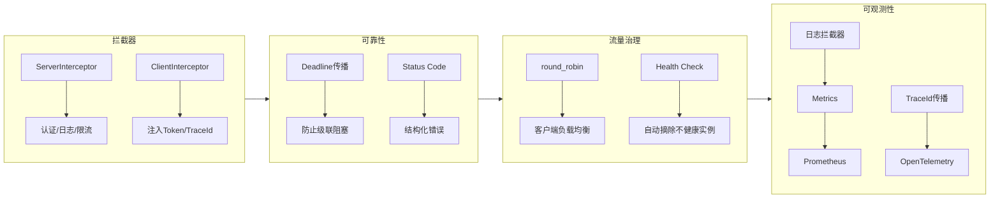

# gRPC 生产实践与高级特性

> 练习: [gRPC 生产实践与高级特性 练习](./gRPC-production-exercises.md)
>
> 面试: [gRPC 生产实践与高级特性 面试](./gRPC-production-interview.md)

---

## 一句话总结

gRPC 生产级应用的三大支柱：**拦截器**（认证/日志/限流）+ **Deadline 传播**（防止级联阻塞）+ **结构化错误处理**（Status + Metadata），再加上负载均衡和可观测性形成完整的生产保障体系。

---

## 1. 拦截器机制（面试必考）

### 1.1 拦截器是什么

gRPC 拦截器类似 Spring MVC 的 `Filter` / `HandlerInterceptor`，在 RPC 调用前后插入通用逻辑，**避免业务代码重复**。

```
Client                          Server
  |                               |
  |  ClientInterceptor            |  ServerInterceptor
  |  ┌──────────┐                 |  ┌──────────┐
  |  │ 注入Token │                 |  │ 校验Token │
  |  │ 注入trace │                 |  │ 记录日志  │
  |  └──────────┘                 |  └──────────┘
  |         |                     |         |
  |  ──── RPC 调用 ──────────────────>  业务逻辑
  |  <─── RPC 响应 ───────────────────  业务逻辑
```

### 1.2 两类拦截器对比

| 维度 | ServerInterceptor | ClientInterceptor |
| --- | --- | --- |
| 位置 | 服务端 | 客户端 |
| 接口 | `io.grpc.ServerInterceptor` | `io.grpc.ClientInterceptor` |
| 核心方法 | `interceptCall(call, headers, next)` | `interceptCall(method, callOptions, next)` |
| 典型场景 | 认证鉴权、限流、日志 | 注入 Token、传递 TraceId |
| Spring 注解 | `@GrpcGlobalServerInterceptor` | `@GrpcGlobalClientInterceptor` |

### 1.3 ServerInterceptor 实现

#### 基础：日志拦截器

```java
public class LogServerInterceptor implements ServerInterceptor {

    @Override
    public <ReqT, RespT> ServerCall.Listener<ReqT> interceptCall(
            ServerCall<ReqT, RespT> call,
            Metadata headers,
            ServerCallHandler<ReqT, RespT> next) {

        String methodName = call.getMethodDescriptor().getFullMethodName();
        long start = System.currentTimeMillis();

        log.info("[gRPC] >>> {} started", methodName);

        // 继续调用链, 用 SimpleForwardingServerCall 包装以拦截响应
        return next.startCall(new ForwardingServerCall.SimpleForwardingServerCall<ReqT, RespT>(call) {
            @Override
            public void close(Status status, Metadata trailers) {
                long cost = System.currentTimeMillis() - start;
                log.info("[gRPC] <<< {} finished, status={}, cost={}ms",
                        methodName, status.getCode(), cost);
                super.close(status, trailers);
            }
        }, headers);
    }
}
```

#### 进阶：JWT 认证拦截器（面试重点）

```java
public class AuthServerInterceptor implements ServerInterceptor {

    private static final Metadata.Key<String> AUTH_HEADER =
            Metadata.Key.of("authorization", Metadata.ASCII_STRING_MARSHALLER);

    @Override
    public <ReqT, RespT> ServerCall.Listener<ReqT> interceptCall(
            ServerCall<ReqT, RespT> call,
            Metadata headers,
            ServerCallHandler<ReqT, RespT> next) {

        // 1. 从 Metadata 中提取 Token
        String token = headers.get(AUTH_HEADER);

        // 2. 校验 Token
        if (token == null || !validateToken(token)) {
            // 直接关闭调用, 返回 UNAUTHENTICATED
            call.close(Status.UNAUTHENTICATED
                    .withDescription("Missing or invalid token"),
                    new Metadata());
            return new ServerCall.Listener<ReqT>() {};  // 空 Listener
        }

        // 3. 校验通过, 继续调用链
        // 可以用 Context 传递用户信息给业务层
        String userId = extractUserId(token);
        Context ctx = Context.current()
                .withValue(AuthContextKey.USER_ID_KEY, userId);

        return Contexts.interceptCall(ctx, call, headers, next);
    }

    private boolean validateToken(String token) {
        // JWT 校验逻辑
        return token.startsWith("Bearer ") && token.length() > 10;
    }
}
```

**关键点**：
- 认证失败时调用 `call.close()` 返回错误状态，返回空 Listener
- 校验通过后用 `Context` 传递用户信息，业务代码通过 `AuthContextKey.USER_ID_KEY.get()` 获取
- 使用 `Contexts.interceptCall()` 将 Context 绑定到调用链

### 1.4 ClientInterceptor 实现

```java
public class AuthClientInterceptor implements ClientInterceptor {

    private static final Metadata.Key<String> AUTH_HEADER =
            Metadata.Key.of("authorization", Metadata.ASCII_STRING_MARSHALLER);

    private final TokenProvider tokenProvider;  // 从外部获取 Token

    @Override
    public <ReqT, RespT> ClientCall<ReqT, RespT> interceptCall(
            MethodDescriptor<ReqT, RespT> method,
            CallOptions callOptions,
            Channel next) {

        // 用 SimpleForwardingClientCall 包装, 在 start 时注入 Header
        return new ForwardingClientCall.SimpleForwardingClientCall<ReqT, RespT>(
                next.newCall(method, callOptions)) {
            @Override
            public void start(Listener<RespT> responseListener, Metadata headers) {
                // 注入 Token 到 Metadata
                headers.put(AUTH_HEADER, "Bearer " + tokenProvider.getToken());
                super.start(responseListener, headers);
            }
        };
    }
}
```

### 1.5 Spring Boot 整合拦截器

#### 方式一：全局拦截器（推荐）

```java
@Configuration
public class GrpcInterceptorConfig {

    // 全局服务端拦截器, 对所有 @GrpcService 生效
    @GrpcGlobalServerInterceptor
    public LogServerInterceptor logInterceptor() {
        return new LogServerInterceptor();
    }

    @GrpcGlobalServerInterceptor
    public AuthServerInterceptor authInterceptor() {
        return new AuthServerInterceptor();
    }

    // 全局客户端拦截器, 对所有 @GrpcClient 生效
    @GrpcGlobalClientInterceptor
    public AuthClientInterceptor authClientInterceptor(TokenProvider provider) {
        return new AuthClientInterceptor(provider);
    }
}
```

#### 方式二：Per-Service 拦截器

```java
@GrpcService(interceptors = { LogServerInterceptor.class })
public class UserServiceImpl extends UserServiceGrpc.UserServiceImplBase {
    // 只对 UserService 生效
}
```

### 1.6 拦截器执行顺序



**规则**：
- 全局拦截器按 `@Order` 或注册顺序执行
- 多个全局拦截器 + Per-Service 拦截器时，全局先执行

**类比 Spring MVC**：

| gRPC | Spring MVC | 作用 |
| --- | --- | --- |
| ServerInterceptor | Filter / HandlerInterceptor | 服务端通用逻辑 |
| ClientInterceptor | RestTemplate Interceptor | 客户端请求增强 |
| Metadata | HttpServletRequest.getHeader() | 传递元数据（Token、TraceId） |
| Context | RequestContextHolder | 在调用链中传递上下文 |

---

## 2. Deadline 与超时传播（面试必考）

### 2.1 为什么需要 Deadline

```
Client A ──调用──> Service B ──调用──> Service C
  5s 超时           3s 超时           处理中...

问题: 如果 Service C 处理慢 (4s):
  - Service B 的 3s 超时触发, 已经返回错误
  - 但 Service C 还在处理, 白白浪费资源!
  - 更糟的是: 如果还有 Service D, E, F...级联阻塞!

Deadline 解决方案:
  - Client A 设置 5s Deadline
  - 传给 Service B 时, 剩余时间 = 5s - 已耗时
  - 传给 Service C 时, 剩余时间 = 5s - 更多已耗时
  - 任何节点发现 Deadline 已过, 立即放弃!
```

### 2.2 Deadline vs Timeout

| 维度 | Timeout（超时） | Deadline（截止时间） |
| --- | --- | --- |
| 定义 | 相对时长（"等 3 秒"） | 绝对时间点（"到 12:00:03"） |
| 传播 | 不传播（每个服务各自设） | **自动传播**（剩余时间递减） |
| 防级联 | 不能 | 能（下游看到的是剩余时间） |
| gRPC API | `withDeadlineAfter()` | `withDeadline()` |

### 2.3 代码实现

#### 客户端设置 Deadline

```java
// 方式一: withDeadlineAfter (最常用, 相对时间)
HelloReply reply = blockingStub
        .withDeadlineAfter(3, TimeUnit.SECONDS)
        .sayHello(request);

// 方式二: withDeadline (绝对时间)
Deadline deadline = Deadline.after(3, TimeUnit.SECONDS);
HelloReply reply = blockingStub
        .withDeadline(deadline)
        .sayHello(request);
```

#### 服务端感知 Deadline

```java
@Override
public void sayHello(HelloRequest request,
                     StreamObserver<HelloReply> responseObserver) {

    // 检查是否还有足够时间
    Deadline deadline = Context.current().getDeadline();

    if (deadline != null && deadline.isExpired()) {
        // 已经超时, 直接返回
        responseObserver.onError(Status.DEADLINE_EXCEEDED
                .withDescription("Deadline exceeded before processing")
                .asRuntimeException());
        return;
    }

    // 正常处理...
}
```

### 2.4 Deadline 传播流程



**面试关键点**：
- Deadline 由 gRPC 框架自动传播，不需要手动传递
- 每经过一跳，剩余时间自动递减
- 下游服务发现 Deadline 已过期会立即放弃，不会继续处理
- 这就是 gRPC 防止级联阻塞的核心机制

### 2.5 超时配置最佳实践

```yaml
# application.yml - grpc-spring-boot-starter 配置示例
grpc:
  client:
    user-service:
      address: 'static://localhost:9090'
      negotiationType: plaintext
      deadline: 5000    # 5 秒默认超时 (仅部分 starter 支持)
```

**实践建议**：
- 外层调用设 Deadline（如网关层设 5s），内层自动传播
- 不同接口可以设不同 Deadline：读操作 3s，写操作 10s
- 永远不要设无 Deadline 的调用（生产事故隐患）

---

## 3. Status Code 与错误处理（面试必考）

### 3.1 gRPC Status Code

gRPC 定义了一组标准状态码，类似 HTTP 状态码但更精确：

| Status Code | 含义 | HTTP 类比 | 典型场景 |
| --- | --- | --- | --- |
| `OK` (0) | 成功 | 200 | 正常响应 |
| `CANCELLED` (1) | 调用被取消 | 499 | 客户端主动取消 |
| `UNKNOWN` (2) | 未知错误 | 500 | 兜底错误 |
| `INVALID_ARGUMENT` (3) | 参数无效 | 400 | 请求校验失败 |
| `DEADLINE_EXCEEDED` (4) | 超时 | 504 | Deadline 过期 |
| `NOT_FOUND` (5) | 资源不存在 | 404 | 查询数据为空 |
| `ALREADY_EXISTS` (6) | 资源已存在 | 409 | 重复创建 |
| `PERMISSION_DENIED` (7) | 权限不足 | 403 | 无操作权限 |
| `RESOURCE_EXHAUSTED` (8) | 资源耗尽 | 429 | 限流/配额耗尽 |
| `UNAUTHENTICATED` (16) | 未认证 | 401 | Token 无效/缺失 |
| `UNAVAILABLE` (14) | 服务不可用 | 503 | 服务下线/网络不通 |
| `UNIMPLEMENTED` (12) | 方法未实现 | 501 | 接口未实现 |
| `INTERNAL` (13) | 内部错误 | 500 | 服务端 bug |

> **面试速记**：最常用的 5 个：`OK` / `INVALID_ARGUMENT` / `NOT_FOUND` / `UNAUTHENTICATED` / `DEADLINE_EXCEEDED`。

### 3.2 服务端错误处理

#### 基本模式：业务异常 → Status

```java
@Override
public void getUser(GetUserRequest request,
                    StreamObserver<UserResponse> responseObserver) {
    try {
        User user = userService.findById(request.getUserId());

        if (user == null) {
            // 业务异常转为 gRPC Status
            responseObserver.onError(Status.NOT_FOUND
                    .withDescription("User not found: " + request.getUserId())
                    .asRuntimeException());
            return;
        }

        UserResponse response = UserResponse.newBuilder()
                .setUserId(user.getId())
                .setUsername(user.getUsername())
                .build();
        responseObserver.onNext(response);
        responseObserver.onCompleted();

    } catch (Exception e) {
        responseObserver.onError(Status.INTERNAL
                .withDescription("Internal error: " + e.getMessage())
                .withCause(e)
                .asRuntimeException());
    }
}
```

#### 进阶：带自定义详情的错误（google.rpc.Status）

gRPC 支持通过 `google.rpc.Status` 在 Trailers 中携带**结构化错误详情**，比 `withDescription` 更丰富：

```java
import com.google.rpc.ErrorInfo;
import io.grpc.protobuf.ProtoUtils;
import io.grpc.Status;
import io.grpc.Metadata;

public class ErrorDetailSample {

    // 定义 Metadata Key
    private static final Metadata.Key<ErrorInfo> ERROR_INFO_KEY =
            ProtoUtils.keyForProto(ErrorInfo.getDefaultInstance());

    public static RuntimeException createBusinessException(
            String code, String message, String domain) {

        ErrorInfo errorInfo = ErrorInfo.newBuilder()
                .setReason(code)          // 如 "USER_NOT_FOUND"
                .setDomain(domain)        // 如 "user.service"
                .putMetadata("message", message)
                .build();

        Metadata trailers = new Metadata();
        trailers.put(ERROR_INFO_KEY, errorInfo);

        return Status.NOT_FOUND
                .withDescription(message)
                .asRuntimeException(trailers);
    }
}
```

#### 客户端提取错误详情

```java
try {
    UserResponse response = stub.getUser(request);
} catch (StatusRuntimeException e) {
    Status status = e.getStatus();
    Metadata trailers = Status.trailersFromThrowable(e);

    // 提取结构化错误
    if (trailers != null && trailers.containsKey(ERROR_INFO_KEY)) {
        ErrorInfo errorInfo = trailers.get(ERROR_INFO_KEY);
        log.error("Business error: domain={}, reason={}, message={}",
                errorInfo.getDomain(),
                errorInfo.getReason(),
                errorInfo.getMetadataMap().get("message"));
    }
}
```

### 3.3 Spring Boot 统一异常处理

grpc-spring-boot-starter 提供 `@GrpcExceptionHandler`，类似 Spring MVC 的 `@ExceptionHandler`：

```java
@GrpcAdvice
public class GrpcExceptionAdvice {

    @GrpcExceptionHandler(ResourceNotFoundException.class)
    public StatusRuntimeException handleNotFound(ResourceNotFoundException e) {
        return Status.NOT_FOUND
                .withDescription(e.getMessage())
                .asRuntimeException();
    }

    @GrpcExceptionHandler(ValidationException.class)
    public StatusRuntimeException handleValidation(ValidationException e) {
        return Status.INVALID_ARGUMENT
                .withDescription(e.getMessage())
                .asRuntimeException();
    }

    @GrpcExceptionHandler(Exception.class)
    public StatusRuntimeException handleGeneral(Exception e) {
        log.error("Unexpected error", e);
        return Status.INTERNAL
                .withDescription("Internal server error")
                .asRuntimeException();
    }
}
```

### 3.4 错误处理流程图



---

## 4. 负载均衡

### 4.1 两种策略

| 策略 | 行为 | 适用场景 |
| --- | --- | --- |
| `pick_first`（默认） | 选第一个地址，一直用 | 单实例 / 开发环境 |
| `round_robin` | 轮询所有地址 | 多实例 / 生产环境 |

### 4.2 客户端负载均衡配置

```java
// 方式一: 代码配置
ManagedChannel channel = Grpc.newChannelBuilder(
        "dns:///my-service.default.svc.cluster.local:9090",
        InsecureChannelCredentials.create())
    .defaultLoadBalancingPolicy("round_robin")  // 轮询策略
    .build();

// 方式二: Service Config (推荐, 支持运行时更新)
Map<String, Object> serviceConfig = new HashMap<>();
serviceConfig.put("loadBalancingConfig", Arrays.asList(
        Collections.singletonMap("round_robin", Collections.emptyMap())));

ManagedChannel channel = Grpc.newChannelBuilder(target, credentials)
    .defaultServiceConfig(serviceConfig)
    .build();
```

引入 Service Mesh（强烈推荐）
如果集群已部署或计划部署 Istio / Linkerd：
Envoy Sidecar 会通过 xDS 协议感知 Service A 的所有 Endpoint（Pod IP）
客户端连接 localhost 的 Sidecar，Sidecar 做真正的 L7 轮询
零代码改动，彻底解决问题

---

## 5. 健康检查

### 5.1 gRPC 健康检查协议

gRPC 内置了标准的健康检查协议 `grpc.health.v1.Health`，各语言实现都自带：

```protobuf
// gRPC 内置的健康检查 proto (不需要自己写)
service Health {
  rpc Check(HealthCheckRequest) returns (HealthCheckResponse);
  rpc Watch(HealthCheckRequest) returns (stream HealthCheckResponse);
}

enum ServingStatus {
  UNKNOWN = 0;
  SERVING = 1;       // 正常服务
  NOT_SERVING = 2;   // 不可用
  SERVICE_UNKNOWN = 3;
}
```

然后通过 `grpcurl` 命令可以查看

```bash
grpcurl -plaintext localhost:9090 grpc.health.v1.Health/Check

{
  "status": "SERVING"
}
```

### 5.2 Kubernetes 探针集成

在 K8s 中，可以将 gRPC 健康检查作为 liveness/readiness 探针：

```yaml
# K8s Pod 配置 (K8s 1.24+ 原生支持 gRPC 探针)
spec:
  containers:
    - name: my-service
      ports:
        - containerPort: 9090
      livenessProbe:
        grpc:
          port: 9090
        initialDelaySeconds: 10
        periodSeconds: 5
      readinessProbe:
        grpc:
          port: 9090
        initialDelaySeconds: 5
        periodSeconds: 3
```

---

## 6. 可观测性（了解即可）

### 6.1 三大支柱



### 6.2 拦截器实现日志

```java
@GrpcGlobalServerInterceptor
public class LoggingInterceptor implements ServerInterceptor {

    @Override
    public <ReqT, RespT> ServerCall.Listener<ReqT> interceptCall(
            ServerCall<ReqT, RespT> call, Metadata headers,
            ServerCallHandler<ReqT, RespT> next) {

        String method = call.getMethodDescriptor().getFullMethodName();
        long start = System.nanoTime();

        return next.startCall(
                new ForwardingServerCall.SimpleForwardingServerCall<ReqT, RespT>(call) {
                    @Override
                    public void close(Status status, Metadata trailers) {
                        long durationMs = TimeUnit.NANOSECONDS.toMillis(
                                System.nanoTime() - start);
                        log.info("method={} status={} duration={}ms",
                                method, status.getCode(), durationMs);
                        super.close(status, trailers);
                    }
                }, headers);
    }
}
```

### 6.3 Prometheus 指标

grpc-spring-boot-starter 内置 `MetricCollectingClientInterceptor`，开箱即用：

```java
@Bean
MetricCollectingClientInterceptor metricCollector(MeterRegistry registry) {
    return new MetricCollectingClientInterceptor(registry);
}
```

自动采集的指标：
- `grpc.client.calls`（Counter）— 调用次数，按 method / statusCode 分组
- `grpc.client.processing.duration`（Timer）— 调用耗时分布

### 6.4 OpenTelemetry 链路追踪

gRPC 的 TraceId 传播通过 Client/Server Interceptor 配对实现：

- ClientInterceptor：向 Metadata 注入 `traceparent` / `traceid`
- ServerInterceptor：从 Metadata 提取并恢复 Trace 上下文

OpenTelemetry 提供了开箱即用的 gRPC Interceptor（`GrpcTracing`），无需手写。

---

## 7. 知识图谱总结



**面试速记**：拦截器管**横切关注点**，Deadline 管**超时传播**，Status 管**错误处理**，三者组合是 gRPC 生产化的核心。

---

> 练习: [gRPC 生产实践与高级特性 练习](./gRPC-production-exercises.md)
>
> 面试: [gRPC 生产实践与高级特性 面试](./gRPC-production-interview.md)
